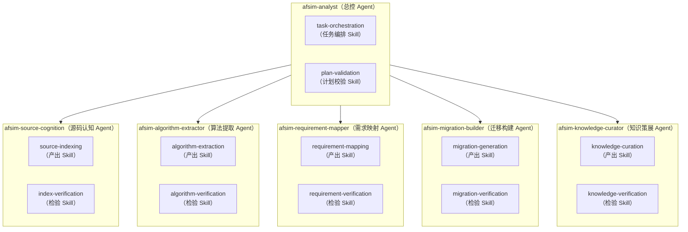

# AFSIM Analysis Skill Project

本项目用于构建一套面向 **AFSIM 的多 agent 协作体系**。

目标是能通过该项目实现快速完成对 AFSIM 的**认知学习**、**源码索引**、**架构理解**、**算法提取**、**需求映射**和**功能迁移**，并最终生成可以快速用在自有项目中的算法说明、接口规范、代码原型和测试计划。

将**知识提取 -> 需求映射 -> 代码迁移**路线落成可执行、可扩展、可追溯的目录结构。

以下方案从**架构设计、Agent 分工、数据流、文档与规范**四个层面给出可落地的路线图。

---

## 一、总体思路：以“知识提取→需求映射→代码迁移”为主干

整个项目可以分为 7 个阶段，每个阶段都有对应的 Agent 和输出文档：

1. **源码索引与静态分析准备**

2. **架构与功能提取（理解 AFSIM）**：从目录、模块、类、函数、调用链、数据流和仿真生命周期建立整体认知；通过源码索引和架构报告找到 AFSIM 中与目标需求相关的模块和实现。

3. **数学公式与算法解析**：将源码中的数学公式、数值计算、模型逻辑和控制流程转化为算法卡片、伪代码和接口说明。

4. **需求分析与功能缺口推断**：把用户需求或自有项目源码作为基准，输出缺口分析、迁移方案、适配接口和验证计划。

5. **AFSIM 源码定位与适配方案生成**

6. **代码迁移与集成到自有内核**

7. **验证、文档生成与闭环记录**：每次分析都沉淀为知识库，后续任务复用已有索引、报告和决策记录。

---

## 二、Agent 体系设计（1个总体Agent + 5 个专职 Agent）

### Agent-Skill 双层架构



基于大模型（如 GPT-4/Claude 3.5 级别）搭建 Agent，每个 Agent 有明确的角色、输入、输出和可调用的工具。

| Agent 名称                                | 作用                                                   | 主要产物                                 | 状态                                        |
| --------------------------------------- | ---------------------------------------------------- | ------------------------------------ | ----------------------------------------- |
| `afsim-analyst`                         | 总控入口，判断任务类型并协调其他 skill                               | 阶段计划、路由决策、综合报告                       | ✅ SKILL.md + references 就绪                |
| `afsim-source-cognition`(源码分析 Agent)    | 快速学习 AFSIM 源码，总结架构，提取函数、类、数据流                        | 源码索引、架构报告、模块依赖                       | ✅ 已执行两轮基线（core/ 14模块 + wsf_plugins/ 16模块） |
| `afsim-algorithm-extractor`(数学解析 Agent) | 识别并解释源码中的算法、公式、变量映射，转化为标准数学表示和伪代码                    | 算法卡片、伪代码、接口规格                        | ✅ 已执行，产出 23 张算法卡片 + 24 份接口规格              |
| `afsim-requirement-mapper`(需求分析 Agent)  | 阅读规范需求文档，推断自有仿真器缺少的功能，生成待补充功能列表                      | 需求缺口报告、功能映射矩阵                        | ⏳ SKILL.md 就绪，待执行                         |
| `afsim-migration-builder`(代码迁移 Agent)   | 在 AFSIM 源码中定位所需功能，进行代码切片、简化、适配，生成迁移方案、适配接口、代码原型和测试计划 | 迁移记录、适配方案、测试计划                       | ⏳ SKILL.md 就绪，待执行                         |
| `afsim-knowledge-curator`(知识记录 Agent)   | 整理知识库、追溯矩阵、决策记录和后续任务，全程记录每一步的输入、思考链、决策、输出，生成阶段性文档    | 知识地图、追溯矩阵、过程记录、文档模板、Markdown 生成、版本快照 | ⏳ SKILL.md 就绪，待执行                         |

---

## 三、分阶段实施步骤与规范

### 当前进展

首轮分析已完成 **阶段 1（AFSIM 源码结构化分析）** 和 **阶段 2（算法提取）**：

### 阶段 1 — 源码认知

| 基线     | 分析范围                   | 文件数        | 产出                                             |
| ------ | ---------------------- | ---------- | ---------------------------------------------- |
| 基线 1   | `core/` 全 14 模块        | 4,997      | 4 份 JSONL 索引 + 2 份架构报告                         |
| 基线 2   | `wsf_plugins/` 全 16 模块 | 11,666     | 4 份 JSONL 索引 + 3 份架构报告（含 x-level-capabilities） |
| **合计** | **30 模块**              | **16,663** | **8 份索引（76,844 行）+ 5 份架构报告**                   |

### 阶段 2 — 算法提取

| 领域                              | 算法数    | 卡片产出                | 接口规格                        |
| ------------------------------- | ------ | ------------------- | --------------------------- |
| 飞行动力学 (wsf_p6dof + wsf_six_dof) | 10     | 10 张算法卡片（平均 ~440 行） | 10 份 interface-spec.md      |
| 空间/轨道力学 (wsf_space)             | 13     | 13 张算法卡片（平均 ~340 行） | 14 份 interface-spec.md（含已有） |
| **合计**                          | **23** | **23 张卡片（9,307 行）** | **24 份接口规格**                |

**最新质量补全**（2026-06-12）：全部 23 张卡片已通过结构性自检，覆盖 output-contracts.md 要求的 14 个必填章节（含新增的内部状态、变量映射表、边界条件、提取策略）。详见 `docs/records/12-algorithm-extraction-quality-supplement.md`。

后续待执行：阶段 3（需求映射）、阶段 4（迁移生成）、阶段 5（知识沉淀）。

### 项目结构

```text
afsim-analysis-skill-project/
├── README.md                                   # 项目总览（本文件）
├── readme2.md                                  # 早期方案草案（多 Agent 协同开发流水线）
├── deep-research-report.md                     # 深度研究报告：AFSIM 功能迁移方案
├── .gitignore                                  # Git 忽略规则（排除 .* 文件和 source_root/）
├── .obsidian/                                  # Obsidian 笔记工具配置（个人工作区，不纳入版本管理）
│
├── skill/                                      # ═══════════ 可被大模型调用的 Skill 系统 ═══════════
│   ├── afsim-analyst/                          # 【总控 Agent】判断任务类型并协调其他 skill
│   │   ├── SKILL.md                            #   总控入口：任务路由、标准工作流（6 步）、输出规则、证据规则、迁移原则
│   │   ├── references/                         #   参考规范（定义执行约束）
│   │   │   ├── baseline-workflow.md            #     阶段模型与 Agent 职责（Phase 0-6）
│   │   │   ├── output-contracts.md             #     输出字段规范（架构报告、算法卡片、需求缺口、迁移记录）
│   │   │   ├── skill-routing.md                #     Skill 选择规则（单任务路由 + 组合任务路由 + 停止条件）
│   │   │   └── traceability-rules.md           #     证据等级（5 级）、追溯链和记录规则
│   │   ├── scripts/                            #   编排脚本（预留）
│   │   │   └── README.md
│   │   └── assets/                             #   静态资源（预留）
│   │       └── README.md
│   │
│   ├── afsim-source-cognition/                 # 【源码认知 Skill】快速学习 AFSIM 源码结构与架构
│   │   └── SKILL.md                            #   7 步工作流：确认边界→发现文件→符号索引→依赖索引→生命周期→数据流→生成报告
│   │                                           #   输出规范：4 个 JSONL 索引文件(file/symbol/function/dependency) + 架构文档
│   │                                           #   质量门槛 + 基线记录（已完成 core/ 全 14 模块深度分析）
│   │
│   ├── afsim-algorithm-extractor/              # 【算法提取 Skill】从源码中识别并抽取算法与数学公式
│   │   └── SKILL.md                            #   7 步执行：定位→区分→抽取→转换→映射→评估→验证
│   │                                           #   输出：算法卡片 + 伪代码 + 接口规格 + 原型代码
│   │
│   ├── afsim-requirement-mapper/               # 【需求映射 Skill】自有需求与 AFSIM 能力的缺口分析
│   │   └── SKILL.md                            #   6 步执行：抽取需求→识别能力→拆分原子能力→查找候选→判断状态→推荐下一步
│   │                                           #   四类判断：已满足/部分满足/缺失/未知
│   │
│   ├── afsim-migration-builder/                # 【迁移生成 Skill】生成可落地的迁移方案和代码原型
│   │   └── SKILL.md                            #   6 步执行：确认接入点→评估耦合度→选择迁移方式→接口适配→迁移记录→按需生成代码
│   │                                           #   三种迁移方式：直接适配 / 局部重写 / clean-room 重实现
│   │
│   └── afsim-knowledge-curator/                # 【知识沉淀 Skill】整理分析结果为可复用知识库
│       └── SKILL.md                            #   5 步执行：检查已有→合并重复→更新追溯矩阵→记录决策→标记风险
│                                               #   输出：过程记录 + 追溯矩阵 + 迁移汇总 + 知识地图
│
├── docs/                                       # ═══════════ 人工可读、可审查的分析产物 ═══════════
│   ├── architecture/                           # 架构分析结果
│   │   ├── .gitkeep
│   │   ├── core/                                #   core/ 基线 1 架构报告
│   │   │   ├── afsim-architecture.md            #     AFSIM 总体架构报告（模块总览、生命周期、数据流、配置流、扩展点）
│   │   │   ├── module-dependency.md             #     模块依赖说明（构建依赖图 + 继承/组合/调用关系 + 子系统依赖）
│   │   │   ├── directroy_structure.md           #     AFSIM 2.9.0 源码目录树
│   │   │   └── x-level-capabilities.md          #     四层功能体系说明（系统级/模块级/类级/方法级）
│   │   └── wsf_plugins/                         #   wsf_plugins 基线 2 架构报告
│   │       ├── afsim-architecture.md            #     插件架构报告（16 模块总览、4 大子系统）
│   │       ├── module-dependency.md             #     插件依赖说明（构建依赖 + 继承/组合 + 子系统间依赖）
│   │       └── x-level-capabilities.md          #     插件功能层次（13 系统级 → 34+ 模块级 → 60+ 类级）
│   │
│   ├── baseline/                               # AFSIM 官方基线文档（作为分析参考输入）
│   │   ├── WsfSimulation_Design_Document.md    #   WSF 子系统完整软件设计文档（111KB，12 章）
│   │   └── WsfSimulation_Core_Design_Document.md # WSF 仿真核心控制类设计文档（66KB）
│   │
│   ├── algorithms/                             # 算法提取结果（23 张算法卡片 + 1 份汇总文档）
│   │   ├── .gitkeep
│   │   ├── CompendiumofAlgorithms.md            #   算法汇总文档（23 个算法的分类目录 + 可移植性总览）
│   │   ├── flight-dynamics-*.md                 #   飞行动力学算法卡片 × 10（积分器/气动/SAS/推进/发动机/PID）
│   │   └── space-*.md                           #   空间/轨道力学算法卡片 × 13（传播器/大气/碎片/机动/交会/地影）
│   │
│   ├── requirements/                           # 需求映射结果（当前为空，待后续分析产出）
│   │   └── .gitkeep
│   │
│   ├── migration/                              # 迁移方案（当前为空，待后续分析产出）
│   │   └── .gitkeep
│   │
│   ├── records/                                # 过程记录、决策记录和进度跟踪
│   │   ├── .gitkeep
│   │   ├── vx.json                             #   记录文件元数据索引（JSON，含文件 ID、签名/哈希、时间戳、版本号），由知识库管理工具自动维护，用于追踪 records/ 下文档的变更
│   │   ├── 01-scope-boundary.md                #   ✅ 分析边界确认（P0-P4 分级表，~17,190 文件）
│   │   ├── 01-scope-decision.md                #   ✅ 范围决策记录（代码库规模、模块数）
│   │   ├── 02-module-inventory.md              #   ✅ 模块清单（P0 核心 ~1,113 文件详细 + P1-P3 概览）
│   │   ├── 03-batch-plan.md                    #   ✅ 分批分析计划（15 个批次，按依赖顺序）
│   │   ├── 04-analysis-progress.md             #   ✅ 分析进度跟踪（首轮 P0 核心分析完成）
│   │   ├── 05-architecture-decisions.md        #   ✅ 架构推导决策（子系统划分依据、数据流推导、初始化顺序）
│   │   ├── 08-analysis-plan-v3.md              #   ✅ 认知分析计划 v3（基于 2026-06-09 修订版提示词）
│   │   ├── 09-algorithm-extraction-kickoff.md  #   ✅ 算法提取首轮记录（运动学积分器，3 张卡片 + 2 份支撑文件）
│   │   ├── 10-wsf-space-algorithm-extraction.md #  ✅ wsf_space 模块算法提取记录（12 张卡片 + 7 份接口规格）
│   │   ├── 11-skill-improvement-from-algorithm-extraction.md # ✅ Skill 完善记录（算法提取中发现的 6 类高频错误及预防规则）
│   │   └── 12-algorithm-extraction-quality-supplement.md     # ✅ 阶段 2 全面质量补全记录（23 张卡片补全 + 16 份接口规格 + 依赖索引增强）
│   │
│   └── templates/                              # 输出文档模板（统一格式，保证一致性）
│       ├── architecture-report.md              #   架构报告模板（10 个必填章节）
│       ├── algorithm-card.md                   #   算法卡片模板（元数据/变量映射/可移植性评估/验证计划）
│       ├── migration-record.md                 #   迁移记录模板（需求ID/源码证据/耦合评估/许可证/测试计划）
│       ├── requirement-gap.md                  #   需求缺口报告模板（需求ID/自有项目证据/AFSIM证据/状态/下一步）
│       └── skill-output-checklist.md           #   Skill 输出质量检查清单（通用 + 针对各 skill 的检查项）
│
├── workspace/                                  # ═══════════ 机器生成或中间产物 ═══════════
│   ├── source-index/                           # 源码索引（JSONL 格式，每行一条记录）
│   │   ├── .gitkeep
│   │   ├── core/                                #   core/ 基线 1：file(4,997行) + symbol(3,255) + function(4,099) + dependency(1,113)
│   │   │   ├── file-index.jsonl
│   │   │   ├── symbol-index.jsonl
│   │   │   ├── function-index.jsonl
│   │   │   └── dependency-index.jsonl
│   │   └── wsf_plugins/                         #   wsf_plugins 基线 2：file(11,666) + symbol(14,565) + function(36,939) + dependency(456)
│   │       ├── file-index.jsonl
│   │       ├── symbol-index.jsonl
│   │       ├── function-index.jsonl
│   │       └── dependency-index.jsonl
│   │
│   ├── analysis-cache/                         # 分析缓存（当前为空）
│   │   └── .gitkeep
│   │
│   ├── extracted-algorithms/                   # 提取的算法产物（24 个算法目录，各含 interface-spec.md）
│   │   ├── .gitkeep
│   │   ├── flight-dynamics-*/                   #   飞行力学接口规格 × 10
│   │   ├── space-*/                             #   空间力学接口规格 × 13
│   │   └── kinematics-integration/              #   运动学积分器接口规格（早期产出）
│   │
│   └── own-kernel-adapters/                    # 适配代码草稿（当前为空）
│       └── .gitkeep
│
├── tools/                                      # ═══════════ 工具脚本与 Prompt 模板 ═══════════
│   ├── prompts/                                # Prompt 模板（版本化管理，保证过程可复现）
│   │   └── README.md
│   ├── indexers/                               # 索引器脚本（C/C++ 源码扫描、JSONL 输出）
│   │   └── README.md
│   ├── validators/                             # 校验脚本（索引格式校验、报告完整性检查）
│   │   └── README.md
│   └── orchestrators/                          # 编排脚本（多 Agent 流水线自动化）
│       └── README.md
│
├── examples/                                   # ═══════════ 示例（用于检验 skill 稳定性） ═══════════
│   ├── requests/                               # 典型用户请求示例
│   │   └── README.md                           #   示例请求列表（分析仿真循环/提取导引算法/对比需求/生成迁移方案）
│   └── outputs/                                # 对应标准输出示例
│       └── README.md                           #   经审查的标准输出样例
│
├── tests/                                      # ═══════════ 测试与验证 ═══════════
│   ├── migration_src/                          # 所有需求的迁移代码目录
│   │   └── <req_index>/                        # 需求对应迁移代码
│   │       ├── REQ_xxx.h                       # 该需求下所有原子功能的接口声明
│   │       ├── REQ_xxx.cpp                     # 所有原子功能的实现（按 FU 分段注释）
│   │       ├── test_demo.cpp                   # 测试 demo（验证整个 REQ 功能）
│   │       └── README.md                       # 编译说明
│   └── README.md                               #   测试目录说明（结构检查/JSONL解析/报告元数据验证/算法原型编译）
│
└── source_root/                                # ═══════════ AFSIM 2.9.0 源码（Git 忽略） ═══════════
```

### 阶段 1：AFSIM 源码结构化分析

**Agent：`afsim-source-cognition`(源码分析 Agent)**

**输入：** AFSIM 源码目录

**过程：**

1. **代码切分**：用 AST 工具将源码切分为函数级、类级片段，保留文件路径和行号。

2. **摘要生成**：让大模型为每个代码单元生成功能摘要、输入输出说明、依赖关系。

3. **架构归纳**：由大模型阅读主要模块的摘要，绘制组件图、数据流图（可用 Mermaid）。

4. **人工校验**：开发人员校对架构图与关键模块理解，修正后存入 `/docs/architecture/`。

**输出：**

- ```
  workspace/source-index/
  ├── file-index.jsonl        # 文件级索引
  ├── symbol-index.jsonl      # 符号索引（类、枚举、全局变量等）
  ├── function-index.jsonl    # 函数/方法索引
  └── dependency-index.jsonl  # 模块依赖关系索引
  
  docs/architecture/
  ├── afsim-architecture.md   # 总体架构文档（含 Mermaid 图）
  └── module-dependency.md    # 模块依赖关系
  ```

**记录要求：** 文档 Agent 记录每个总结所依据的代码片段、模型思考过程（通过 Chain-of-Thought 提示生成）。

### 2. 算法与功能提取

使用 `afsim-algorithm-extractor` 对关键模块进行算法抽取。重点区分：

- 数学和算法核心
- AFSIM 框架封装
- 配置、场景和运行时依赖
- 可直接迁移部分
- 应重新实现部分

输出保存到 `docs/algorithms/` 和 `workspace/extracted-algorithms/`。

### 3. 自有项目需求映射

```text
[用户] 自然语言需求描述
    ↓
[requirement-spec-generator] 
    → 读取 AFSIM 认知资产
    → 生成待确认需求规范文档（含复选框/选项）
    ↓
[人工] 勾选必须/可选、选择简化/详细、确认优先级
    ↓
[requirement-mapping]
    → 读取确认后规范
    → 映射到 AFSIM 功能 + 对比目标系统
    → 生成缺口报告 + 映射矩阵
    ↓
[下游] 代码迁移 Agent
```

使用 `afsim-requirement-mapper` 读取自有项目需求文档、接口定义或源码，形成需求到 AFSIM 能力的映射。每条需求分类为：

- 已满足
- 部分满足
- 缺失
- 未知

输出保存到 `docs/requirements/`。

### 4. 功能迁移与适配生成

- 完整的工作流程:
```text
[gap-specs.jsonl + 映射矩阵]
    ↓
[migration-planner] → 生成含 Y/N 的计划文档
    ↓
[人工] 勾选 Y/N 并填写要求（多轮迭代）
    ↓ 全部 Y
[标记为可执行计划]
    ↓
[migration-implementer] → 读取计划 + 模板 → 生成 SDD + 代码 + demo
    ↓
[检验 Skill 验证] → 人工 HCP 审核 → 交付
```

- 最终 migration-implementer 产出清单为：

| 产物 |	路径	| 说明 |
|------|-----------|-------|
|软件设计说明|	docs/migration/<req_index>-SDD.md	|依据 template_sdd.md 撰写|
|功能头文件|	tests/migration_src/<req_index>/fu_xxx.h	|接口定义，详细注释|
|功能实现文件|	tests/migration_src/<req_index>/fu_xxx.cpp	|核心算法实现，完整注释|
|测试 Demo|	tests/migration_src/<req_index>/test_demo.cpp	|包含 main，快速验证|
|使用说明|	tests/migration_src/<req_index>/README.md	|编译、依赖、运行示例|

使用 `afsim-migration-builder` 选择可迁移算法和功能，生成：

- 候选 AFSIM 源码位置
- 选择理由
- 耦合度评估
- 接口适配方案
- 许可证和版权风险
- 测试计划
- 必要时生成代码原型

输出保存到 `docs/migration/` 和 `workspace/own-kernel-adapters/`。

### 5. 知识沉淀

使用 `afsim-knowledge-curator` 汇总每轮分析结果，更新：

- `docs/records/`
- `docs/architecture/knowledge-map.md`
- `docs/requirements/requirement-to-afsim-trace.md`
- `docs/migration/migration-summary.md`

## 目录职责

`skill/` — 可被大模型直接使用的 Skill 系统，包含 6 个 skill（1 个总控 + 5 个专职）。每个 skill 只放执行规则和必要引用文件，保持精简。其中：

- `afsim-analyst` 是总控入口，负责判任务类型、选 skill、定输入输出、保证据追溯
- `afsim-source-cognition` 是最先开发完成的 skill，已对 AFSIM core/ 全 14 模块完成深度分析（产出了 4 个 JSONL 索引和 2 份架构报告）
- 其余 4 个专职 skill（算法提取/需求映射/迁移生成/知识沉淀）SKILL.md 已就绪，等待后续阶段执行

`docs/` — 人工可读、可审查的分析结果。架构、算法、需求、迁移和过程记录分开存放：

- `architecture/` 已有 4 份产出：总体架构报告、模块依赖说明、源码目录树、四层功能体系
- `baseline/` 存放 AFSIM 官方设计文档作为分析参考输入（2 份，共 177KB）
- `records/` 已有 7 份过程记录，覆盖边界确认、模块清单、分批计划、进度跟踪、架构决策和分析计划
- `templates/` 包含 5 份输出模板和检查清单
- `algorithms/`、`requirements/`、`migration/` 当前为空，待后续阶段产出

`workspace/` — 机器生成物和中间产物：

- `source-index/` 已产出 4 个 JSONL 索引文件（共约 13,464 条记录），是后续所有分析的基础资产
- 其余子目录当前为空，待后续阶段填充

`tools/` — 工具脚本和 Prompt 模板（4 个子目录已建好 README，具体工具脚本待实现）。

`examples/` — 典型请求和标准输出样例（目录已建好，样例待补充）。

`tests/` — 测试与验证用例（目录已建好，测试用例待补充）。

`source_root/` — AFSIM 2.9.0 源码（约 17,000+ 文件），已被 `.gitignore` 排除，不纳入版本管理。

## 输出规范

所有正式输出都应满足以下要求：

1. 结论必须有证据来源，例如源码路径、符号名、行号、需求编号或用户文档位置。
2. 算法提取必须包含输入、输出、状态依赖、数学形式、伪代码、变量映射和验证计划。
3. 迁移方案必须说明为什么选择该源码片段，以及哪些依赖需要保留、替换或删除。
4. 生成代码前必须明确目标项目接口、单位、生命周期、错误处理和测试策略。
5. 许可证不明确时，只生成 clean-room 风格的算法规格和重写建议。
6. 文档记录可审查的依据、假设、决策和结论，不记录隐藏推理过程。

## 推荐落地顺序

1. ~~先完善 `tools/indexers/`，实现 C/C++ 源码扫描和 JSONL 索引输出。~~ → 首轮分析已通过 Agent 直接扫描完成
2. ~~用 `afsim-source-cognition` 生成第一版 AFSIM 架构报告。~~ → ✅ 已完成（core/ + wsf_plugins/ 两轮基线）
3. ~~选择一个小功能，用 `afsim-algorithm-extractor` 生成算法卡片。~~ → ✅ 已完成（23 张算法卡片 + 24 份接口规格，经全面质量补全）
4. 输入一个自有项目需求，用 `afsim-requirement-mapper` 做缺口分析。
5. 用 `afsim-migration-builder` 生成迁移方案和最小代码原型。
6. 用 `afsim-knowledge-curator` 更新追溯矩阵和知识地图。

## 未来扩展

- 增加 tree-sitter 或 clang AST 索引器。
- 增加公式热点检测脚本。
- 增加报告证据校验器。
- 增加从算法卡片生成 C++/Python 原型的脚本。
- 增加针对自有项目构建系统的迁移适配模板。
