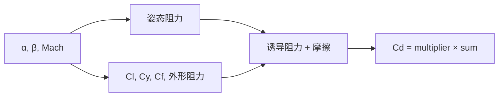

# 气动体总阻力系数（Aero Body Total Drag Coefficient）

> **算法 ID**：ALG-AERODYNAMICS-BODY-TOTAL-DRAG-COEFFICIENT  
> **状态**：verified  
> **版本/日期**：1.0 / 2026-07-27  
> **领域**：气动 / 飞行器设计  
> **AFSIM 模块**：`mover_creator/source`  
> **覆盖候选**：`87793b5ccf423e9c`、`ec07b3b0303ff435`  
> **接口规格**：`docs/extracted-algorithms/aero-body-total-drag-coefficient/aerodynamics-body-total-drag-coefficient-interface-spec.md`

## 1. 算法边界

- **目的**：汇总由迎角/侧滑、升力、侧力、摩擦及 Mach 外形效应产生的无量纲机体阻力系数。
- **入口条件**：辅助升力、侧力、摩擦和外形阻力模型能对当前姿态/Mach 返回有限值。
- **完成条件**：返回带全局阻力倍率的 $C_D$。
- **包含**：四项阻力与 $AR=1$ 的诱导阻力假设。
- **不包含**：力和力矩换算、`CalcLiftCoefficient` 等辅助模型内部算法、阻力表生成。
- **生命周期位置**：气动体受力计算时的模型求值。

## 2. 流程



## 3. 数据契约

### 3.1 输入

| 名称 | 代码标识 | 符号 | 单位 | Method |
| --- | --- | --- | --- | --- |
| 迎角/侧滑角 | `aAlpha_rad/aBeta_rad` | $\alpha,\beta$ | rad | `AeroBody::CalcDragCoefficient#afedea7029` |
| Mach 数 | `aMach` | $M$ | 1 | 同上 |
| 升力/侧力系数 | `CalcLiftCoefficient/CalcSideForceCoefficient` | $C_L,C_Y$ | 1 | 同上 |
| 摩擦/外形阻力 | `CalcSkinFrictionCoefficient/CalcShapeDragCoefficient` | $C_f,C_{shape}$ | 1 | 同上 |

### 3.2 输出

| 名称 | 代码标识 | 符号 | 单位 |
| --- | --- | --- | --- |
| 总阻力系数 | `return` | $C_D$ | 1 |

### 3.3 参数与常量

| 名称 | 代码标识 | 符号 | 单位/来源 |
| --- | --- | --- | --- |
| 阻力倍率 | `cDragMultiplier` | $k_D$ | 1，源码常量/配置 |
| 参考面积比 | `mSurfaceArea_ft2/mCrossSectionalArea_sqft` | $A_s/A_c$ | 1，成员状态 |
| 诱导阻力分母 | `UtMath::cPI` | $\pi$ | 源码按 $AR=1$ 注释 |

### 3.4 内部状态

只读成员为表面积、截面积和倍率；函数本身无持久状态写入。

## 4. 数学模型

$$C_{ab}=\sin^2\alpha(\cos^2\beta+1)+\sin^2\beta(\cos^2\alpha+1)$$
$$\boxed{C_D=k_D\left(C_{shape}+C_{ab}+\frac{C_L^2}{\pi}+\frac{C_Y^2}{\pi}+C_f\frac{A_s}{A_c}\right)}$$

这是每次调用的代数汇总；源码注释确认两项诱导阻力均假设展弦比 $AR=1$。

## 5. 伪代码

```text
function body_drag(alpha_rad, beta_rad, mach, model, geometry):
    # 中文：姿态阻力对 α/β 对称，β=90° 时与 α 无关。
    cab = sin(alpha_rad)^2*(cos(beta_rad)^2+1) + sin(beta_rad)^2*(cos(alpha_rad)^2+1)
    induced = model.lift(alpha_rad,beta_rad)^2/pi + model.side(alpha_rad,beta_rad)^2/pi
    friction = model.skin_friction(mach) * geometry.surface_area / geometry.cross_area
    # 中文：外形阻力子模型已包含跨声速影响。
    return geometry.drag_multiplier * (model.shape_drag(mach) + cab + induced + friction)
```

## 6. 源码证据

### 6.1 入口和调用链

```text
AeroBody::CalcDragCoefficient#afedea7029
  -> CalcLiftCoefficient / CalcSideForceCoefficient / CalcSkinFrictionCoefficient
  -> CalcShapeDragCoefficient
```

### 6.2 源码位置

| candidate_id | qualified_name | 模块 | 源码位置 | 角色 | 证据等级 |
| --- | --- | --- | --- | --- | --- |
| `87793b5ccf423e9c` | `AeroBody::CalcDragCoefficient#afedea7029` | `mover_creator/source` | `afsim-2_9/swdev/src/mover_creator/source/AeroBody.cpp:293-319` | 核心 | source-cited |
| `ec07b3b0303ff435` | `Designer::AeroBody::CalcDragCoefficient#afedea7029` | `mover_creator/source` | 同一源码范围 | 上游索引别名 | source-cited |

### 6.3 框架与依赖

| 依赖 | 分类 | 用途 | 中性替代 |
| --- | --- | --- | --- |
| `AeroBody` | 设计器模型 | 成员与辅助系数 | 回调与值结构 |
| `UtMath::cPI` | 工具常量 | 诱导阻力 | 标准常量 |

## 7. 边界、风险与未知

| 条件 | 源码行为 | 影响 | 建议 |
| --- | --- | --- | --- |
| $A_c=0$ | 无检查 | 摩擦项除零 | 中性接口拒绝 |
| 辅助系数非有限 | 无检查 | 输出污染 | 校验回调输出 |
| $\beta=\pi/2$ | 姿态项为 2 | 验证对称性 | 作为不变量 |

- **已确认假设**：外形阻力子函数负责 Mach/跨声速细节。
- **待人工复核**：`cDragMultiplier` 的配置来源不在当前函数范围内。

## 8. 验证计划

| 类型 | 输入/场景 | Oracle | 容差/不变量 |
| --- | --- | --- | --- |
| 正常 | $\alpha=\beta=0,C_L=.5,C_Y=.2,C_f=.003,A_s/A_c=10,C_{shape}=.1,k_D=1.2$ | `0.26677184039195917` | `1e-12` |
| 边界 | $\beta=\pi/2$ | $C_{ab}=2$ | `1e-12` |
| 退化 | $A_c=0$ | `invalid_geometry` | 不除零 |

## 9. 可移植性

- **等级**：中高；汇总公式可移植，子模型和面积数据为设计器耦合。
- **类型/单位适配**：角度 rad，所有系数和面积比无量纲。
- **许可证/clean-room 注意**：按公式、回调边界和验证 oracle 独立实现。

## 10. 覆盖账本回写

| candidate_id | 状态 | algorithm_id | 决策理由 | 验证 |
| --- | --- | --- | --- | --- |
| `87793b5ccf423e9c`、`ec07b3b0303ff435` | extracted | ALG-AERODYNAMICS-BODY-TOTAL-DRAG-COEFFICIENT | 同一总阻力汇总实现及其索引别名 | passed |
