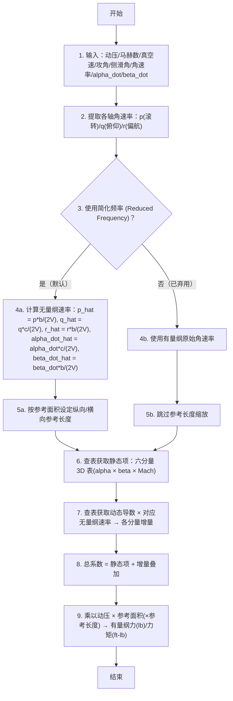

# 算法卡片 -- P6DOF 稳定性导数气动系数模型

> **状态**：draft
> **日期**：2026-06-11
> **索引证据**：function-index.jsonl (wsf_plugins::p6dof_module), source/P6DofAeroCoreObject.hpp, source/P6DofAeroCoreObject.cpp
> **关联文档**：flight-dynamics-p6dof-heun-integrator-card.md

### 基础资料

- **算法名称**：P6DOF Stability-Derivative Aerodynamic Model（P6DOF 稳定性导数气动系数模型）
- **算法所属模块**：wsf_p6dof（拟六自由度飞行器运动学插件 -- 旧模块）
- **算法功能**：基于飞行状态（马赫数、攻角、侧滑角、角速率、攻角变化率、侧滑角变化率），通过高维查表和多维插值计算气动力系数（升力 CL、阻力 Cd、侧力 CY、俯仰力矩 Cm、偏航力矩 Cn、滚转力矩 Cl），将静态项、动态阻尼项和非定常增量叠加后，乘以动压、参考面积和参考长度，得到有量纲气动力和力矩。支持多种气动构型模态切换。

### 算法流程

整个算法流程图如下：



其中，第一步接收来自积分器的飞行状态参数；第二步将角速率矢量拆分到三轴；第三步根据 `mUseReducedFrequency` 标志决定是否使用简化频率（无量纲化），默认为 true；第四步用参考弦长（俯仰相关：c_ref）或翼展（滚转/偏航相关：b）对速率做无量纲化；第五步根据是否使用参考面积（`mUseRefArea`）确定各分量的参考长度；第六步通过 3D 查表 `Table(Mach, Beta, Alpha)` 获取六分量静态系数；第七步通过 2D 表或 1D 曲线查取动态导数并乘以对应的无量纲速率得到增量；第八步将静态项与各增量叠加得到总系数；第九步用动压 q_bar、参考面积 S_ref 和参考长度（c_ref 或 b）将无量纲系数转换为有量纲升力/阻力和力矩。

### 算法变量和常量

1. 输入 (input)：
   
   | 英文标识符 (Symbol)      | 中文名称 (Name) | 数据类型 (Type)       | 含义 (Meaning)                   | 单位 (Units) | 所属函数 (Method)       |
   | ------------------- | ----------- | ----------------- | ------------------------------ | ---------- | ------------------- |
   | `aDynPress_lbsqft`  | 动压          | `double`          | 自由流动压 q_bar = 0.5*rho*V^2      | lb/ft^2    | ComputeCoefficients |
   | `aMach`             | 马赫数         | `double`          | 飞行马赫数                          | 无量纲        | ComputeCoefficients |
   | `aSpeed_fps`        | 真空速         | `double`          | 相对气流的真空速                       | ft/s       | ComputeCoefficients |
   | `aAlpha_rad`        | 攻角          | `double`          | 体轴 x 与相对气流方向的夹角                | rad        | ComputeCoefficients |
   | `aBeta_rad`         | 侧滑角         | `double`          | 体轴 y 与相对气流方向的夹角                | rad        | ComputeCoefficients |
   | `aAlphaDot_rps`     | 攻角变化率       | `double`          | 攻角的时间导数                        | rad/s      | ComputeCoefficients |
   | `aBetaDot_rps`      | 侧滑角变化率      | `double`          | 侧滑角的时间导数                       | rad/s      | ComputeCoefficients |
   | `aAngularRates_rps` | 体轴角速率       | `const UtVec3dX&` | [p, q, r] = [滚转, 俯仰, 偏航] 角速率   | rad/s      | ComputeCoefficients |
   | `aRadiusSizeFactor` | 几何尺度因子      | `double`          | 缩放气动面的线性因子（如降落伞/气球面积缩放），默认 1.0 | 无量纲        | ComputeCoefficients |
   | `aInput` (overload) | 输入数据流       | `UtInput&`        | 读取气动数据配置文件（翼面参数 + 多张数据表）       | —          | ProcessInput        |

2. 输出 (output)：
   
   | 英文标识符 (Symbol)   | 中文名称 (Name) | 数据类型 (Type) | 含义 (Meaning)                              | 单位 (Units) | 所属函数 (Method)       |
   | ---------------- | ----------- | ----------- | ----------------------------------------- | ---------- | ------------------- |
   | `aMoment_ftlbs`  | 气动力矩矢量      | `UtVec3dX&` | [roll, pitch, yaw] = [M_x, M_y, M_z] 气动力矩 | ft-lb      | ComputeCoefficients |
   | `aLift_lbs`      | 升力          | `double&`   | 垂直于相对气流方向的力                               | lb         | ComputeCoefficients |
   | `aDrag_lbs`      | 阻力          | `double&`   | 平行于相对气流方向的力                               | lb         | ComputeCoefficients |
   | `aSideForce_lbs` | 侧力          | `double&`   | 垂直于升阻平面的力                                 | lb         | ComputeCoefficients |

3. 常量 (constant)：
   
   | 英文标识符 (Symbol)         | 中文名称 (Name) | 数据类型 (Type)          | 含义 (Meaning)                                 | 单位 (Units) | 所属函数 (Method) |
   | ---------------------- | ----------- | -------------------- | -------------------------------------------- | ---------- | ------------- |
   | `mWingChord_ft`        | 机翼弦长        | `double`             | 平均气动弦长（MAC），用于俯仰力矩的无量纲化                      | ft         | ProcessInput  |
   | `mWingSpan_ft`         | 翼展          | `double`             | 机翼展长，用于滚转/偏航力矩的无量纲化                          | ft         | ProcessInput  |
   | `mWingArea_sqft`       | 机翼面积        | `double`             | 机翼参考面积，用于所有力/力矩的有量纲化                         | ft^2       | ProcessInput  |
   | `mRefArea_sqft`        | 参考面积        | `double`             | 替代机翼面积的显式参考面积（启用 `mUseRefArea` 时生效）          | ft^2       | ProcessInput  |
   | `mRefLength_ft`        | 参考长度        | `double`             | sqrt(mRefArea_sqft)，替代弦长/展长用于无量纲化            | ft         | ProcessInput  |
   | `mUseRefArea`          | 参考面积开关      | `bool`               | true 时用 mRefArea_sqft / mRefLength_ft 替代翼面参数 | 无量纲        | ProcessInput  |
   | `mUseReducedFrequency` | 简化频率开关      | `bool (true)`        | true 时用无量纲化频率替代有量纲角速率（默认）                    | 无量纲        | ProcessInput  |
   | `mUseLegacy`           | 旧版导数开关      | `bool (false)`       | true 时启用已弃用的 alpha-only 和 beta-only 旧版导数表    | 无量纲        | ProcessInput  |
   | `mSubModesList`        | 气动模态列表      | `list<CloneablePtr>` | 多构型气动参数表（如挂弹/空载/襟翼位置）的列表                     | —          | ProcessInput  |

### 关键数学公式

1. **简化频率（Reduced Frequency）—— 角速率无量纲化**：
   消除飞行器尺寸和飞行速度的量纲影响，将角速率和变化率转换为无量纲化频率。公式如下：
   $k_q = \frac{q \cdot c_{ref}}{2V}, \quad k_r = \frac{r \cdot b}{2V}, \quad k_p = \frac{p \cdot b}{2V}$
   $k_{\dot{\alpha}} = \frac{\dot{\alpha} \cdot c_{ref}}{2V}, \quad k_{\dot{\beta}} = \frac{\dot{\beta} \cdot b}{2V}$
   其中：
   
   - $p, q, r$ 分别为体轴滚转角速率、俯仰角速率、偏航角速率，单位为 rad/s。
   - $\dot{\alpha}, \dot{\beta}$ 分别为攻角变化率、侧滑角变化率，单位为 rad/s。
   - $c_{ref}$ 为参考弦长（机翼弦长 `mWingChord_ft` 或显式参考长度 `mRefLength_ft`），单位为 ft。
   - $b$ 为翼展（`mWingSpan_ft` 或 `mRefLength_ft`），单位为 ft。
   - $V$ 为真空速，单位为 ft/s，当 V=0 时取值下限为 1 ft/s（避免除零）。

2. **升力系数（含动态增量）**：
   升力由静态 3D 表加上俯仰阻尼升力和非定常延迟升力组成：
   $C_{L\_total} = C_L(\alpha, \beta, M) + C_{L_q}(\alpha, M) \cdot k_q + C_{L_{\dot{\alpha}}}(\alpha, M) \cdot k_{\dot{\alpha}}$
   有量纲升力：
   $L = \bar{q} \cdot S_{ref} \cdot C_{L\_total} \cdot R^2$
   其中：
   
   - $C_L(\alpha, \beta, M)$ 为升力系数静态 3D 表，含攻角、侧滑角和马赫数三维。
   - $C_{L_q}(\alpha, M)$ 为俯仰阻尼升力导数 2D 表。
   - $C_{L_{\dot{\alpha}}}(\alpha, M)$ 为攻角延迟升力导数 2D 表。
   - $\bar{q}$ 为动压，单位为 lb/ft^2。
   - $S_{ref}$ 为参考面积（机翼面积或显式参考面积），单位为 ft^2。
   - $R$ 为几何尺度因子（`aRadiusSizeFactor`），用于缩放气动面的线性尺寸。

3. **阻力系数**：
   阻力仅使用静态 3D 表，不含动态项（常规气动模型中阻力无阻尼增量）：
   $C_{d} = C_d(\alpha, \beta, M)$
   有量纲阻力：
   $D = \bar{q} \cdot S_{ref} \cdot C_d \cdot R^2$

4. **侧力系数（含动态增量）**：
   侧力由静态项加上偏航速率引起的侧力和非定常侧滑延迟侧力：
   $C_{Y\_total} = C_Y(\alpha, \beta, M) + C_{Y_r}(\beta, M) \cdot k_r + C_{Y_{\dot{\beta}}}(\beta, M) \cdot k_{\dot{\beta}}$
   有量纲侧力：
   $Y = \bar{q} \cdot S_{ref} \cdot C_{Y\_total} \cdot R^2$

5. **俯仰力矩系数（含交叉导数）**：
   $C_{m\_total} = C_m(\alpha, \beta, M) + C_{m_q}(M) \cdot k_q + C_{m_p}(M) \cdot k_p + C_{m_{\dot{\alpha}}}(M) \cdot k_{\dot{\alpha}}$
   有量纲俯仰力矩：
   $M_y = \bar{q} \cdot S_{ref} \cdot c_{ref} \cdot C_{m\_total}$
   其中：
   
   - $C_{m_q}(M)$ 为俯仰阻尼导数（1D 曲线，仅取决于 Mach）。
   - $C_{m_p}(M)$ 为滚转-俯仰交叉导数。
   - $C_{m_{\dot{\alpha}}}(M)$ 为攻角延迟俯仰力矩导数。
   - $c_{ref}$ 为参考弦长，用于俯仰力矩的有量纲化。

6. **偏航力矩系数**：
   $C_{n\_total} = C_n(\alpha, \beta, M) + C_{n_r}(M) \cdot k_r + C_{n_p}(M) \cdot k_p + C_{n_{\dot{\beta}}}(M) \cdot k_{\dot{\beta}}$
   有量纲偏航力矩：
   $M_z = \bar{q} \cdot S_{ref} \cdot b \cdot C_{n\_total}$

7. **滚转力矩系数（含最多交叉导数项）**：
   $C_{l\_total} = C_l(\alpha, \beta, M) + C_{l_p}(M) \cdot k_p + C_{l_r}(M) \cdot k_r + C_{l_q}(M) \cdot k_q + C_{l_{\dot{\alpha}}}(M) \cdot k_{\dot{\alpha}} + C_{l_{\dot{\beta}}}(M) \cdot k_{\dot{\beta}}$
   有量纲滚转力矩：
   $M_x = \bar{q} \cdot S_{ref} \cdot b \cdot C_{l\_total}$

8. **Legacy 导数模式（已弃用，仅向后兼容）**：
   当 `mUseLegacy = true` 时，使用旧版单变量导数表（alpha-only）且动态导数使用 deg/s 为单位（乘以 DEG_PER_RAD 转换）。非 Legacy 模式（默认）使用多变量导数 (alpha-beta) 且直接使用 rad/s。

9. **气动构型模态切换**：
   通过 `mSubModesList` 支持多种飞行器构型（如内部挂载/自由飞行/襟翼设定），每种模态有独立的全套气动参数表。`SetModeName()` 切换到指定模态。

### 算法伪代码

```
// === P6DOF 稳定性导数气动系数模型 ===
// 整体目标：给定飞行状态(alpha/beta/Mach/角速率)，通过高维查表和系数叠加计算六分量气动力/力矩。

function CalculateCoreAeroFM(q_bar, Mach, V, alpha, beta, alpha_dot, beta_dot, omega_body, radius_factor):
    // 1. 拆解角速率
    rollRate, pitchRate, yawRate = omega_body              // p, q, r (rad/s)

    // 2. 基础无量纲化：角速率 / (2*V)，V 下限保护为 1 ft/s
    speedSafe = max(V, 1.0)                                // 防止除零
    kq = pitchRate / (2 * speedSafe)                       // 基础俯仰无量纲速率
    kr = yawRate   / (2 * speedSafe)                       // 基础偏航无量纲速率
    kp = rollRate  / (2 * speedSafe)                       // 基础滚转无量纲速率
    ka = alpha_dot / (2 * speedSafe)                       // 基础攻角变化率无量纲速率
    kb = beta_dot  / (2 * speedSafe)                       // 基础侧滑角变化率无量纲速率

    // 3. 按参考长度缩放（简化频率模式）
    if UseRefArea:
        kLq = kq * refLength;    kLa = ka * refLength      // 俯仰相关用参考长度
        kYr = kr * refLength;    kYb = kb * refLength      // 偏航相关用参考长度
    else:
        kLq = kq * wingChord;    kLa = ka * wingChord      // 俯仰相关用弦长
        kYr = kr * wingSpan;     kYb = kb * wingSpan       // 偏航相关用翼展

    if Not UseReducedFrequency:
        kLq = pitchRate; kLa = alpha_dot                   // 直接用有量纲角速率（已弃用）
        kYr = yawRate;   kYb = beta_dot

    // 4. === 升力 + 阻力 + 侧力 ===
    if UseLegacy:
        CL = Table_2D_CL_AlphaMach(Mach, alpha)             // 旧版 2D 表 (alpha-only)
        Cd = Table_2D_Cd_AlphaMach(Mach, alpha) + Table_2D_Cd_BetaMach(Mach, beta)
        CY = Table_2D_CY_BetaMach(Mach, beta)
    else:
        CL       = Table_3D_CL_AlphaBetaMach(Mach, beta, alpha)      // 升力静态项 3D 表
        CLq      = Table_2D_CLq_AlphaMach(Mach, alpha) * kLq         // 俯仰阻尼升力增量
        CL_adot  = Table_2D_CLadot_AlphaMach(Mach, alpha) * kLa      // 攻角延迟升力增量
        Cd       = Table_3D_Cd_AlphaBetaMach(Mach, beta, alpha)      // 阻力静态项（无动态项）
        CY       = Table_3D_CY_AlphaBetaMach(Mach, beta, alpha)      // 侧力静态项
        CYr      = Table_2D_CYr_BetaMach(Mach, beta) * kYr           // 偏航速率侧力增量
        CY_bdot  = Table_2D_CYbdot_BetaMach(Mach, beta) * kYb        // 侧滑延迟侧力增量

    // 面积缩放因子（半径因子的平方，用于降落伞/气球等非翼面气动体）
    areaFactor = radius_factor * radius_factor

    if UseRefArea:                                            // 使用显式参考面积
        lift      = q_bar * (CL + CLq + CL_adot) * refArea * areaFactor
        drag      = q_bar * Cd * refArea * areaFactor
        sideForce = q_bar * (CY + CYr + CY_bdot) * refArea * areaFactor
    else:                                                     // 使用机翼面积
        lift      = q_bar * (CL + CLq + CL_adot) * wingArea * areaFactor
        drag      = q_bar * Cd * wingArea * areaFactor
        sideForce = q_bar * (CY + CYr + CY_bdot) * wingArea * areaFactor

    // 5. === 力矩：准备各分量的简化频率（各自独立参考长度缩放）===
    kmq = kq; kma = ka; kmp = kp                              // 俯仰力矩用
    klq = kq; kla = ka; klr = kr; klb = kb; klp = kp           // 滚转力矩用
    knr = kr; knb = kb; knp = kp                               // 偏航力矩用

    if UseRefArea:
        kmq*=refLength; kma*=refLength; kmp*=refLength         // 俯仰用参考长度
        klq*=refLength; kla*=refLength; klr*=refLength           // 滚转用参考长度
        klb*=refLength; klp*=refLength
        knr*=refLength; knb*=refLength; knp*=refLength           // 偏航用参考长度
    else:
        kmq*=wingChord; kma*=wingChord; kmp*=wingChord          // 俯仰用弦长
        klq*=wingSpan;  kla*=wingSpan;  klr*=wingSpan             // 滚转用翼展
        klb*=wingSpan;  klp*=wingSpan
        knr*=wingSpan;  knb*=wingSpan;  knp*=wingSpan             // 偏航用翼展

    if Not UseReducedFrequency:
        kmq=pitchRate; kma=alpha_dot; kmp=rollRate              // 直接使用有量纲值
        klq=pitchRate; kla=alpha_dot; klr=yawRate; klb=beta_dot; klp=rollRate
        knr=yawRate;   knb=beta_dot;  knp=rollRate

    // 6. === 力矩系数：查表 + 无量纲速率 × 导数 ===
    if UseLegacy:
        Cm      = Table_2D_Cm_AlphaMach(Mach, alpha)           // 旧版 (alpha-only)
        CmQ     = Curve_1D_Cmq_Mach(Mach) * kmq * DEG_PER_RAD // Legacy 用 deg/s
        Cn      = Table_2D_Cn_BetaMach(Mach, beta)
        CnR     = Curve_1D_Cnr_Mach(Mach) * knr * DEG_PER_RAD
        CnP     = Curve_1D_Cnp_Mach(Mach) * knp * DEG_PER_RAD
        Cl      = Table_2D_Cl_BetaMach(Mach, beta)
        ClP     = Curve_1D_Clp_Mach(Mach) * klp * DEG_PER_RAD
        ClR     = Curve_1D_Clr_Mach(Mach) * klr * DEG_PER_RAD
    else:
        Cm         = Table_3D_Cm_AlphaBetaMach(Mach, beta, alpha)     // 俯仰力矩静态项
        CmQ        = Curve_1D_Cmq_Mach(Mach) * kmq                     // 俯仰阻尼
        CmP        = Curve_1D_Cmp_Mach(Mach) * kmp                     // 滚转-俯仰交叉
        Cm_adot    = Curve_1D_Cm_adot_Mach(Mach) * kma                 // 攻角延迟俯仰力矩
        Cn         = Table_3D_Cn_AlphaBetaMach(Mach, beta, alpha)     // 偏航力矩静态项
        CnR        = Curve_1D_Cnr_Mach(Mach) * knr                     // 偏航阻尼
        CnP        = Curve_1D_Cnp_Mach(Mach) * knp                     // 滚转-偏航交叉
        Cn_bdot    = Curve_1D_Cn_bdot_Mach(Mach) * knb                // 侧滑延迟偏航力矩
        Cl         = Table_3D_Cl_AlphaBetaMach(Mach, beta, alpha)     // 滚转力矩静态项
        ClP        = Curve_1D_Clp_Mach(Mach) * klp                     // 滚转阻尼
        ClR        = Curve_1D_Clr_Mach(Mach) * klr                     // 偏航-滚转交叉
        ClQ        = Curve_1D_Clq_Mach(Mach) * klq                     // 俯仰-滚转交叉
        Cl_adot    = Curve_1D_Cl_adot_Mach(Mach) * kla                // 攻角延迟滚转力矩
        Cl_bdot    = Curve_1D_Cl_bdot_Mach(Mach) * klb                // 侧滑延迟滚转力矩

    // 7. === 有量纲力矩：总系数 × 动压 × 面积 × 参考长度 ===
    if UseRefArea:
        rollMoment  = q_bar * (Cl+ClP+ClR+ClQ+Cl_adot+Cl_bdot) * refArea
        pitchMoment = q_bar * (Cm+CmQ+CmP+Cm_adot) * refArea
        yawMoment   = q_bar * (Cn+CnR+CnP+Cn_bdot) * refArea
    else:
        rollMoment  = q_bar * (Cl+ClP+ClR+ClQ+Cl_adot+Cl_bdot) * wingArea * wingSpan
        pitchMoment = q_bar * (Cm+CmQ+CmP+Cm_adot) * wingArea * wingChord
        yawMoment   = q_bar * (Cn+CnR+CnP+Cn_bdot) * wingArea * wingSpan

    moment = [rollMoment, pitchMoment, yawMoment]            // (ft-lb)
    return lift, drag, sideForce, moment
```

### 源码使用说明

#### 入口和调用链

```
// 从积分器 CalculateFM() → 飞行器气动接口 → 气动系数模型求值
P6DofIntegrator::CalculateFM()                                // 力/力矩汇总 — 积分器每帧调用
  → aState.UpdateAeroState()                                  // 更新当前气动状态（α/β/Mach/q_bar）
  → aObject.CalculateAeroBodyFM(lift,drag,side,moment,refPt)  // 气动力/力矩计算接口
    → P6DofAeroCoreObject::CalculateCoreAeroFM(                // 气动系数模型主入口 — 稳定性导数法
        q_bar, Mach, V, α, β, α̇, β̇, ω_vec, ...)
      → 拆分角速率和变化率 → 计算简化频率
      → CL_AlphaBetaMach(Mach, β, α)          // 升力静态 3D 表
      → Cd_AlphaBetaMach(Mach, β, α)          // 阻力静态 3D 表
      → CY_AlphaBetaMach(Mach, β, α)          // 侧力静态 3D 表
      → CLq_AlphaMach(Mach, α) * kLq          // 俯仰阻尼升力增量
      → CL_AlphaDotAlphaMach(Mach, α) * kLa   // 攻角延迟升力增量
      → CYr_BetaMach(Mach, β) * kYr           // 偏航速率侧力增量
      → CY_BetaDotBetaMach(Mach, β) * kYb     // 侧滑延迟侧力增量
      → Cm_AlphaBetaMach(Mach, β, α)          // 俯仰力矩静态 3D 表
      → Cmq_Mach(Mach) * kmq                  // 俯仰阻尼力矩
      → Cmp_Mach(Mach) * kmp                  // 滚转-俯仰交叉力矩
      → CmAlphaDotMach(Mach) * kma           // 攻角延迟俯仰力矩
      → Cn_AlphaBetaMach(Mach, β, α)          // 偏航力矩静态 3D 表
      → Cnr_Mach(Mach) * knr                  // 偏航阻尼
      → Cnp_Mach(Mach) * knp                  // 滚转-偏航交叉
      → CnBetaDotMach(Mach) * knb             // 侧滑延迟偏航力矩
      → Cl_AlphaBetaMach(Mach, β, α)          // 滚转力矩静态 3D 表
      → Clp_Mach(Mach) * klp                  // 滚转阻尼
      → Clr_Mach(Mach) * klr                  // 偏航-滚转交叉
      → Clq_Mach(Mach) * klq                  // 俯仰-滚转交叉
      → Cl_AlphaDotMach(Mach) * kla           // 攻角延迟滚转
      → Cl_BetaDotMach(Mach) * klb            // 侧滑延迟滚转
      → 静态项 + 增量叠加 → × 动压 × 面积 × 参考长度 → 有量纲力/力矩

// 初始化阶段：从配置文件读取气动数据
P6DofAeroCoreObject::ProcessInput(aInput)                     // 解析 aero_data 配置块
  → 读取 wing_chord_ft / wing_span_ft / wing_area_sqft       // 翼面几何参数
  → 读取 aero_center_x / y / z                                // 气动中心位置
  → 读取各导数表（cL_alpha_beta_mach_table 等 20+ 张表）    // 稳定性导数数据加载
  → 读取 aero_mode 子模态（多个构型的气动参数表）             // 多构型支持
  → Initialize()  // 传播顶层设置到子模态                         // 将 use_legacy 和 use_reduced_frequency 等设置传播到所有子模态
```

#### 源码位置

| File                                                                                                  | Symbol                                 | Lines     | Evidence level | 中文说明                                  |
| ----------------------------------------------------------------------------------------------------- | -------------------------------------- | --------- | -------------- | ------------------------------------- |
| [P6DofAeroCoreObject.hpp](source_root/src/wsf_plugins/wsf_p6dof/p6dof/source/P6DofAeroCoreObject.hpp) | `P6DofAeroCoreObject` (class)          | 31-218    | source-cited   | 气动核心对象全量 — 20+ 导数查表成员变量 + 模态切换 + 几何参数 |
| [P6DofAeroCoreObject.hpp](source_root/src/wsf_plugins/wsf_p6dof/p6dof/source/P6DofAeroCoreObject.hpp) | `CalculateCoreAeroFM()`                | 55-67     | source-cited   | 气动力/力矩主计算函数声明 — 11 个输入参数 → 4 个输出      |
| [P6DofAeroCoreObject.hpp](source_root/src/wsf_plugins/wsf_p6dof/p6dof/source/P6DofAeroCoreObject.hpp) | `ProcessInput()` / `Initialize()`      | 42-44     | source-cited   | 初始化和配置输入接口                            |
| [P6DofAeroCoreObject.hpp](source_root/src/wsf_plugins/wsf_p6dof/p6dof/source/P6DofAeroCoreObject.hpp) | 20+ 查表函数（`CL_AlphaBetaMach()` 等）       | 92-130    | source-cited   | 各稳定性导数的查表函数声明                         |
| [P6DofAeroCoreObject.cpp](source_root/src/wsf_plugins/wsf_p6dof/p6dof/source/P6DofAeroCoreObject.cpp) | `ProcessInput()`                       | 33-79     | source-cited   | 解析 aero_data 和 aero_mode 配置块          |
| [P6DofAeroCoreObject.cpp](source_root/src/wsf_plugins/wsf_p6dof/p6dof/source/P6DofAeroCoreObject.cpp) | `ProcessCommonInput()`                 | 82-578    | source-cited   | 解析 25+ 种气动数据命令（翼面几何 + 导数表加载）          |
| [P6DofAeroCoreObject.cpp](source_root/src/wsf_plugins/wsf_p6dof/p6dof/source/P6DofAeroCoreObject.cpp) | `Initialize()`                         | 580-597   | source-cited   | 顶层设置传播到子模态                            |
| [P6DofAeroCoreObject.cpp](source_root/src/wsf_plugins/wsf_p6dof/p6dof/source/P6DofAeroCoreObject.cpp) | `CalculateCoreAeroFM()`                | 1072-1351 | source-cited   | 主计算函数 — 简化频率→系数叠加→有量纲力/力矩全流程          |
| [P6DofAeroCoreObject.cpp](source_root/src/wsf_plugins/wsf_p6dof/p6dof/source/P6DofAeroCoreObject.cpp) | 各查表函数（20+ 个）                           | 628-964   | source-cited   | 每个函数的实现：空表返回 0 + UtTable::Lookup 查表   |
| [P6DofAeroCoreObject.cpp](source_root/src/wsf_plugins/wsf_p6dof/p6dof/source/P6DofAeroCoreObject.cpp) | `SetModeName()` / `GetSubModeByName()` | 604-626   | source-cited   | 气动模态切换接口                              |

#### 框架依赖

| AFSIM 原始依赖                                                           | 依赖类型      | 替换方案                             |
| -------------------------------------------------------------------- | --------- | -------------------------------- |
| `UtTable::Table`                                                     | 高维查表引擎    | 自定义多维插值引擎（支持 2D/3D 线性插值）         |
| `UtTable::Curve`                                                     | 1D 曲线查表   | 自定义 1D 插值（线性/Akima/Cubic Spline） |
| `UtInput` / `UtInputBlock`                                           | 配置文件解析    | 自定义 JSON/YAML/TOML 解析器           |
| `UtVec3dX`                                                           | 三维矢量      | Eigen::Vector3d                  |
| `UtCloneablePtr`                                                     | 智能指针（深拷贝） | std::unique_ptr/shared_ptr       |
| `UtMath::cPI / cPI_OVER_2 / cDEG_PER_RAD / cRAD_PER_DEG / cFT_PER_M` | 数学和单位转换常数 | 直接硬编码                            |

#### 测试和验证计划

1. **零攻角零侧滑角对称性测试**：对称飞行器（α=0, β=0, 所有角速率=0）下，升力/侧力/俯仰/偏航/滚转力矩均应为零或接近零（仅阻力非零）。
2. **小扰动线性性测试**：小 AoA（如 0-5 度）下 CL ~ alpha（线性段斜率为升力线斜率 CL_alpha），验证斜率匹配查表数据。
3. **表格边界外推测试**：超表范围的 α/β/Mach 输入值应有合理边界行为（如外推返回零或边界值），无崩溃或 NaN。
4. **简化频率量纲正确性**：改变翼展/弦长/飞行速度，验证无量纲化后系数不变（仅几何和动压缩放影响有量纲力）。
5. **Legacy 模式回归测试**：比较同一飞行条件下 Legacy 模式和新模式的结果（在相同输入表条件下），确保模式切换后行为一致。
6. **多模态构型切换测试**：预设两个模态（如内部挂载-零气动、自由飞行-标准气动），验证切换模态后气动力正确变化。
7. **面积缩放因子测试**：将 `aRadiusSizeFactor` 设为 2.0，验证力变为原来的 4 倍（面积随半径的平方缩放）。
8. **空表保护测试**：不加载任何气动表（所有表指针为 null），验证返回零力/力矩而不崩溃。

### 内部状态

`P6DofAeroCoreObject` 的核心计算函数 `CalculateCoreAeroFM()` 是**纯函数**（无副作用，不修改成员变量），所有输入来自参数、所有输出通过引用返回。气动系数模型本质上是一个高维函数 $(\alpha, \beta, \text{Mach}, \omega, \dot{\alpha}, \dot{\beta}) \to (L, D, Y, \mathbf{M})$。跨帧持久化状态集中于数据表指针和几何参数（配置加载一次，运行时只读）：

| 变量名 | 类型 | 初始值 | 物理含义 | 更新时机 |
|--------|------|--------|----------|----------|
| `mCL_AlphaBetaMachTablePtr` | `UtCloneablePtr<UtTable::Table>` | `nullptr` | 升力系数 CL 的 3D 静态表 (Mach, Beta, Alpha) 指针。表维度为 (Mach 行 × Beta 行 × Alpha 行)，内部使用双线性/三线性插值 | `ProcessInput()` 配置阶段加载；运行时只读 |
| `mCLq_AlphaMachTablePtr` | `UtCloneablePtr<UtTable::Table>` | `nullptr` | 俯仰阻尼升力导数 CLq 的 2D 表 (Mach, Alpha) | 同上 |
| `mCL_AlphaDotAlphaMachTablePtr` | `UtCloneablePtr<UtTable::Table>` | `nullptr` | 攻角延迟升力导数 CL_adot 的 2D 表 (Mach, Alpha) | 同上 |
| `mCd_AlphaBetaMachTablePtr` | `UtCloneablePtr<UtTable::Table>` | `nullptr` | 阻力系数 Cd 的 3D 静态表 (Mach, Beta, Alpha) | 同上 |
| `mCY_AlphaBetaMachTablePtr` | `UtCloneablePtr<UtTable::Table>` | `nullptr` | 侧力系数 CY 的 3D 静态表 (Mach, Beta, Alpha) | 同上 |
| `mCYr_BetaMachTablePtr` | `UtCloneablePtr<UtTable::Table>` | `nullptr` | 偏航速率侧力导数 CYr 的 2D 表 (Mach, Beta) | 同上 |
| `mCY_BetaDotBetaMachTablePtr` | `UtCloneablePtr<UtTable::Table>` | `nullptr` | 侧滑延迟侧力导数 CY_bdot 的 2D 表 (Mach, Beta) | 同上 |
| `mCm_AlphaBetaMachTablePtr` | `UtCloneablePtr<UtTable::Table>` | `nullptr` | 俯仰力矩系数 Cm 的 3D 静态表 (Mach, Beta, Alpha) | 同上 |
| `mCmq_MachCurvePtr` | `UtCloneablePtr<UtTable::Curve>` | `nullptr` | 俯仰阻尼力矩导数 Cmq 的 1D 曲线 (Mach) | 同上 |
| `mCmp_MachCurvePtr` | `UtCloneablePtr<UtTable::Curve>` | `nullptr` | 滚转-俯仰交叉力矩导数 Cmp 的 1D 曲线 (Mach) | 同上 |
| `mCm_AlphaDotMachCurvePtr` | `UtCloneablePtr<UtTable::Curve>` | `nullptr` | 攻角延迟俯仰力矩导数 Cm_adot 的 1D 曲线 (Mach) | 同上 |
| `mCn_AlphaBetaMachTablePtr` | `UtCloneablePtr<UtTable::Table>` | `nullptr` | 偏航力矩系数 Cn 的 3D 静态表 (Mach, Beta, Alpha) | 同上 |
| `mCnr_MachCurvePtr` | `UtCloneablePtr<UtTable::Curve>` | `nullptr` | 偏航阻尼力矩导数 Cnr 的 1D 曲线 (Mach) | 同上 |
| `mCnp_MachCurvePtr` | `UtCloneablePtr<UtTable::Curve>` | `nullptr` | 滚转-偏航交叉力矩导数 Cnp 的 1D 曲线 (Mach) | 同上 |
| `mCn_BetaDotMachCurvePtr` | `UtCloneablePtr<UtTable::Curve>` | `nullptr` | 侧滑延迟偏航力矩导数 Cn_bdot 的 1D 曲线 (Mach) | 同上 |
| `mCl_AlphaBetaMachTablePtr` | `UtCloneablePtr<UtTable::Table>` | `nullptr` | 滚转力矩系数 Cl 的 3D 静态表 (Mach, Beta, Alpha) | 同上 |
| `mClp_MachCurvePtr` | `UtCloneablePtr<UtTable::Curve>` | `nullptr` | 滚转阻尼力矩导数 Clp 的 1D 曲线 (Mach) | 同上 |
| `mClr_MachCurvePtr` | `UtCloneablePtr<UtTable::Curve>` | `nullptr` | 偏航-滚转交叉力矩导数 Clr 的 1D 曲线 (Mach) | 同上 |
| `mClq_MachCurvePtr` | `UtCloneablePtr<UtTable::Curve>` | `nullptr` | 俯仰-滚转交叉力矩导数 Clq 的 1D 曲线 (Mach) | 同上 |
| `mCl_AlphaDotMachCurvePtr` | `UtCloneablePtr<UtTable::Curve>` | `nullptr` | 攻角延迟滚转力矩导数 Cl_adot 的 1D 曲线 (Mach) | 同上 |
| `mCl_BetaDotMachCurvePtr` | `UtCloneablePtr<UtTable::Curve>` | `nullptr` | 侧滑延迟滚转力矩导数 Cl_bdot 的 1D 曲线 (Mach) | 同上 |
| `mWingChord_ft` | `double` | `0.0` | 机翼平均气动弦长（ft），用于俯仰相关无量纲速率缩放 | `ProcessInput()` 配置阶段加载；运行时只读 |
| `mWingSpan_ft` | `double` | `0.0` | 翼展（ft），用于滚转/偏航相关无量纲速率缩放 | 同上 |
| `mWingArea_sqft` | `double` | `0.0` | 机翼参考面积（ft²），用于力/力矩有量纲化 | 同上 |
| `mRefArea_sqft` | `double` | `0.0` | 显式参考面积（ft²），当 `mUseRefArea=true` 时替代 mWingArea_sqft | 同上 |
| `mRefLength_ft` | `double` | `0.0` | sqrt(mRefArea_sqft)，替代弦长/翼展用于无量纲化 | 同上 |
| `mUseRefArea` | `bool` | `false` | 是否使用显式参考面积（true=使用 mRefArea_sqft/mRefLength_ft，false=使用翼面参数） | 同上 |
| `mUseReducedFrequency` | `bool` | `true` | 是否使用简化频率（无量纲化角速率），true 为默认；false 时使用有量纲角速率（已弃用） | 同上 |
| `mUseLegacy` | `bool` | `false` | 是否启用已弃用的 alpha-only / beta-only 旧版导数表 | 同上 |
| `mAeroCenter_ft` | `UtVec3dX` | (0,0,0) | 气动中心相对参考点的偏移（ft），影响力/力矩的参考点位置 | `ProcessInput()` 加载 |
| `mModeName` | `string` | `"DEFAULT"` | 当前激活的气动构型模态名称 | `SetModeName()` 切换 |
| `mSubModesList` | `list<UtCloneablePtr<P6DofAeroCoreObject>>` | 空列表 | 多构型气动参数表列表（如挂弹/空载/襟翼位置），每个子模态有独立的全套导数表 | `ProcessInput()` 加载各模态配置 |

**关键特性**：`P6DofAeroCoreObject` 的所有成员均为配置期一次性加载、运行时只读，严格来说是一个参数化函数而非有状态的对象。构型模态切换（`SetModeName()`）通过遍历 `mSubModesList` 找到对应名称的子模态，并将后续所有气动力计算委托给该子模态完成——这实现了运行时"热切换"气动模型，但从框架角度看也是查询而非状态修改。

### 变量映射表

| 代码变量 | 数学符号 | 含义 |
|----------|----------|------|
| `aDynPress_lbsqft` | $\bar{q}$ | 动压（lb/ft²），$\bar{q} = \frac{1}{2} \rho V^2$ |
| `aMach` | $M$ | 马赫数（无量纲），用于气动表查表 |
| `aSpeed_fps` | $V$ | 真空速（ft/s），用于简化频率和动压计算 |
| `aAlpha_rad` | $\alpha$ | 攻角（rad），体轴 x 与相对气流夹角 |
| `aBeta_rad` | $\beta$ | 侧滑角（rad），体轴 y 与相对气流夹角 |
| `aAlphaDot_rps` | $\dot{\alpha}$ | 攻角变化率（rad/s） |
| `aBetaDot_rps` | $\dot{\beta}$ | 侧滑角变化率（rad/s） |
| `aAngularRates_rps` | $\boldsymbol{\omega} = [p, q, r]$ | 体轴角速率（rad/s） |
| `aRadiusSizeFactor` | $R$ | 几何尺度因子（无量纲），有量纲力/力矩中乘以 $R^2$ |
| `aLift_lbs` | $L$ | 有量纲升力（lbf） |
| `aDrag_lbs` | $D$ | 有量纲阻力（lbf） |
| `aSideForce_lbs` | $Y$ | 有量纲侧力（lbf） |
| `aMoment_ftlbs` | $\mathbf{M} = [M_x, M_y, M_z]$ | 有量纲气动力矩（ft-lbf） |
| `kq / kr / kp` | $k_q, k_r, k_p$ | 无量纲化俯仰/偏航/滚转角速率（简化频率） |
| `kLq / kYr` 等 | — | 乘以参考长度后的无量纲速率，用于与导数查表值相乘 |
| `kLa / kYb / kma / kla / kna / klb / kba` | $k_{\dot{\alpha}}, k_{\dot{\beta}}$ 等 | 角速率变化率 × 参考长度的无量纲化值 |
| `speedSafe` | $V_{\text{safe}}$ | 真空速下限保护值 = max(V, 1.0)，防止除零 |
| `CL / Cd / CY` | $C_L, C_d, C_Y$ | 升力/阻力/侧力系数（静态 3D 表 + 动态增量叠加后） |
| `CLq / CL_adot` | $C_{L_q}, C_{L_{\dot{\alpha}}}$ | 俯仰阻尼/攻角延迟对升力系数的动态导数贡献 |
| `CYr / CY_bdot` | $C_{Y_r}, C_{Y_{\dot{\beta}}}$ | 偏航速率/侧滑延迟对侧力系数的动态导数贡献 |
| `Cm / CmQ / CmP / Cm_adot` | $C_m, C_{m_q}, C_{m_p}, C_{m_{\dot{\alpha}}}$ | 俯仰力矩静态系数 + 俯仰阻尼 + 滚转交叉 + 攻角延迟增量 |
| `Cn / CnR / CnP / Cn_bdot` | $C_n, C_{n_r}, C_{n_p}, C_{n_{\dot{\beta}}}$ | 偏航力矩静态系数 + 偏航阻尼 + 滚转交叉 + 侧滑延迟增量 |
| `Cl / ClP / ClR / ClQ / Cl_adot / Cl_bdot` | $C_l, C_{l_p}, C_{l_r}, C_{l_q}, C_{l_{\dot{\alpha}}}, C_{l_{\dot{\beta}}}$ | 滚转力矩静态系数 + 滚转阻尼 + 偏航交叉 + 俯仰交叉 + 攻角延迟 + 侧滑延迟增量 |
| `areaFactor` | $R^2$ | 半径因子的平方，用于面积缩放（降落伞/气球等非翼面气动体） |
| `wingChord / refLength` | $c_{\text{ref}}$ | 参考弦长（ft），用于俯仰力矩无量纲化 |
| `wingSpan / refLength` | $b$ | 参考翼展（ft），用于滚转/偏航力矩无量纲化 |
| `wingArea / refArea` | $S_{\text{ref}}$ | 参考面积（ft²），用于所有力/力矩的有量纲化 |

### 边界条件

1. **空表保护（关键）**：所有 20+ 个查表函数（`CL_AlphaBetaMach()` 等）在空表指针（`nullptr`）时直接返回 `0.0`。这意味着加载不完整的气动数据（如仅配置升力和阻力表而不配置力矩表）时，缺项被静默设为零，飞行器仅受部分气动力并保持姿态不变化。不会崩溃或产生 NaN。

2. **真空速除零保护**：`speedSafe = max(aSpeed_fps, 1.0)`。当 V=0 时（地面静止或初始化），所有无量纲化除以 1 ft/s 而非 0，避免除零崩溃。此时简化频率 k= 角速率 / 2，值偏大但有限。

3. **动压为零时的力/力矩**：若 `aDynPress_lbsqft = 0`（如真空环境），所有有量纲力/力矩为 0（系数 × 0 → 0），飞行器不受气动力/力矩影响，仅受推力、重力和起落架力支配。

4. **表格边界外推**：`UtTable::Lookup` 引擎在超表范围时默认线性外推到最近边界值（clamp to edge），而非插值到边界外。因此配置超范围（如 alpha=30° 但表只到 20°）时，导数按 alpha=20° 的值计算，不会异常跳变或返回 NaN。

5. **Legacy 模式兼容保护**：
   - Legacy 导数表使用 deg/s 为单位，代码中乘以 `DEG_PER_RAD` 将 rad/s 输入转换为 deg/s 后再查表。
   - Legacy 模式未配置导数表（指针为 null）时，对应查表函数返回 0（受空表保护覆盖），增量项为零。
   - Legacy 模式默认为 `false`，仅在显式配置 `use_legacy = true` 时启用。

6. **简化频率开关**：`mUseReducedFrequency` 默认为 `true`。当设为 `false` 时，跳过除以 2V 和乘以参考长度的步骤，直接用有量纲角速率（rad/s）乘以导数。这是已弃用的模式，但保留向后兼容。两种模式的选择由 `Initialize()` 传播到所有子模态。

7. **几何尺度因子**：`aRadiusSizeFactor` 默认为 1.0。有量纲力中乘以 `radiusFactor * radiusFactor`（即 $R^2$），有量纲力矩中乘以对应的面积和长度缩放。当 $R \neq 1$ 时（如降落伞面积缩放），力和力矩按面积缩放（$R^2$），力矩额外按长度缩放。

8. **多模态切换**：`SetModeName()` 遍历 `mSubModesList` 查找匹配模态名。若未找到匹配模态，保持当前模态不变（无报错，静默忽略）。每个子模态通过 `Initialize()` 从父模态继承 `mUseReducedFrequency`、`mUseLegacy` 等控制设置。

9. **导数表完整性**：并非所有导数表都必须加载。实际使用中可能仅加载静态 3D 表（CL/Cd/CY/Cm/Cn/Cl）而不加载动态导数表（CLq/CYr/Cmq 等），此时动态增量全部为 0，即仅使用准稳态气动模型。

### 提取策略

- **源文件**：`P6DofAeroCoreObject.hpp`、`P6DofAeroCoreObject.cpp`
- **提取方法**：从 `P6DofAeroCoreObject` 类中识别 `CalculateCoreAeroFM()` 函数（280 行），该函数是完整的稳定性导数法气动模型计算核心。逻辑清晰分为 7 个阶段：角速率拆解→基础无量纲化（除以 2V）→参考长度缩放→升力+阻力+侧力查表与叠加→力矩各分量的独立简化频率计算→力矩系数查表与叠加→总系数 × 动压 × 面积 × 参考长度→有量纲力/力矩输出。20+ 个查表函数（`CL_AlphaBetaMach`、`Cm_AlphaBetaMach` 等）是薄封装，内部仅做空表检查和 `UtTable::Lookup` 调用。
- **函数识别**：从 `function-index.jsonl` 中通过 `wsf_plugins::p6dof_module`（模块级）、`wsf_p6dof::ProcessInput`（配置解析）、`wsf_p6dof::Initialize`（初始化传播）、`wsf_p6dof::SetModeName`（模态切换）等函数名定位。`CalculateCoreAeroFM` 在 index 中通过 `P6DofAeroCoreObject.hpp` 路径标记。
- **还原方式**：阅读 `CalculateCoreAeroFM()` 的函数体，按照角速率拆解→简化频率→静态项查表→动态导数乘以无量纲速率→叠加→有量纲化的顺序提取全部数学公式。`ProcessCommonInput()` 提供了 25+ 种气动数据命令的解析逻辑（每张表如何从输入流加载），`Initialize()` 展示了控制设置如何从父模态传播到所有子模态。`SetModeName()` 展示了模态查找与切换。

#### 可移植性评分

**可移植性**：中

**原因**：

1. 稳定性导数法是航空航天工程的标准方法，所有数学公式（静态项+动态阻尼+非定常增量叠加）完全可移植到任何语言。
2. 简化频率（Reduced Frequency）是标准无量化技术，文献记载充分。
3. 核心计算逻辑（`CalculateCoreAeroFM`）不包含任何平台特定代码，仅依赖基本数学运算和查表。
4. 查表引擎 `UtTable::Table` 和 `UtTable::Curve` 属于 AFSIM 框架专属类，移植时需替换为自有多维插值库。
5. 气动数据表本身是飞行器特有的机密数据（通常来自风洞试验或 CFD），不能直接搬运。移植后需用户自行提供数据表。
6. Legacy 导数模式（alpha-only, deg/s）为已弃用代码，移植时可完全移除以简化实现。
7. 单位体系为 Imperial（lb, ft, slug, sqft），移植时建议统一为 SI（N, m, kg, m^2）。
