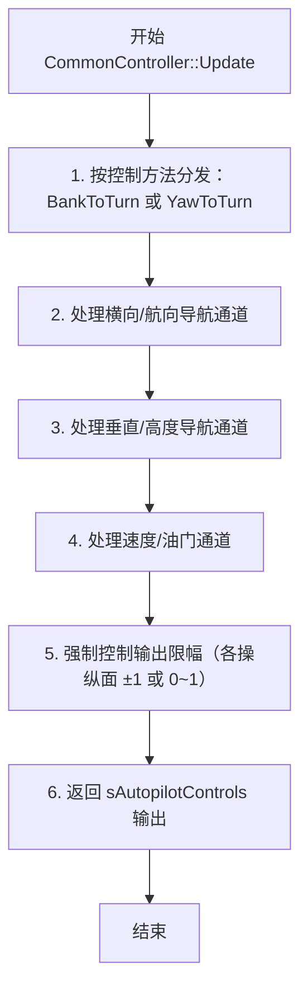
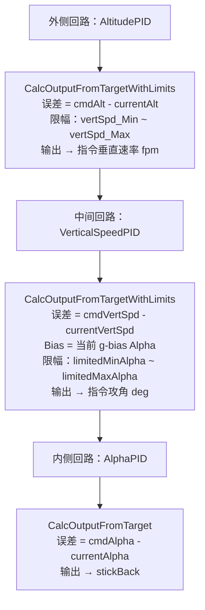
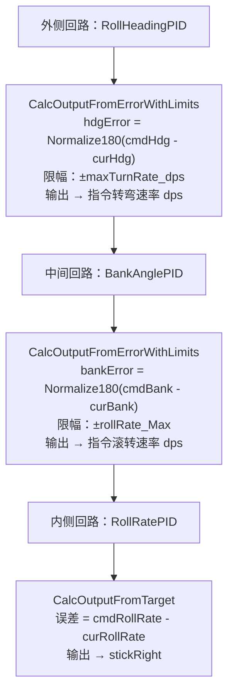
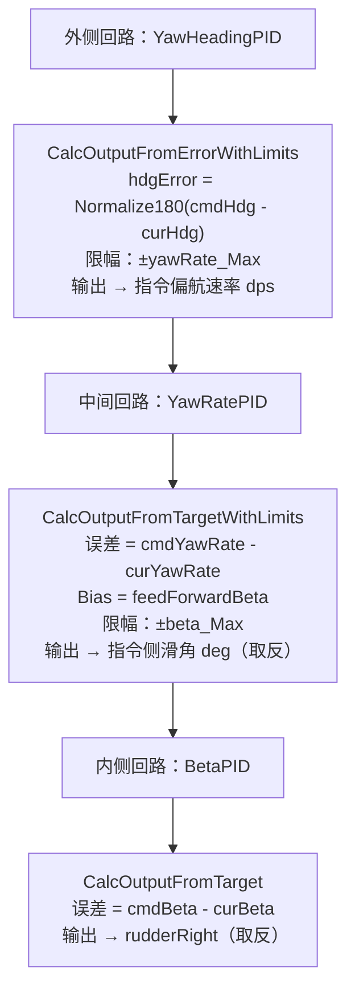
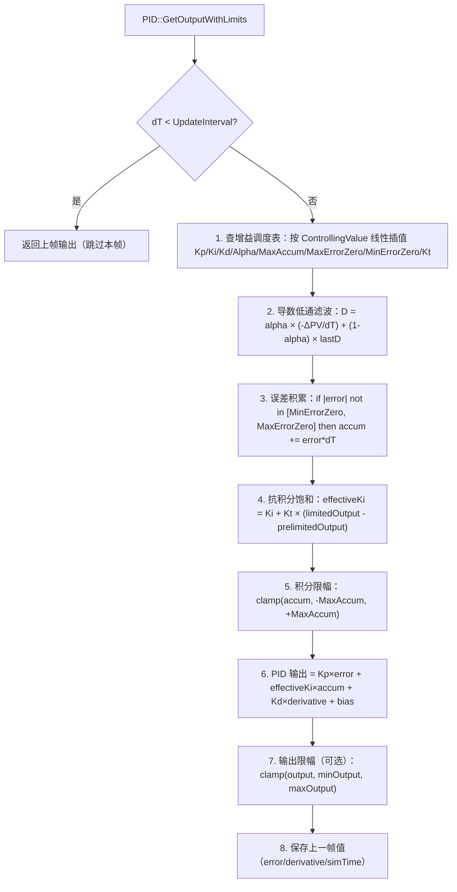

# 算法卡片 -- wsf_six_dof 自动驾驶仪 PID 嵌套回路控制

> **状态**：draft
> **日期**：2026-06-11
> **索引证据**：function-index.jsonl (wsf_six_dof::CommonController, wsf_six_dof::PID), source/WsfSixDOF_CommonController.hpp/.cpp, source/WsfSixDOF_PID.hpp/.cpp
> **关联文档**：flight-dynamics-rigid-body-integrator-card.md, flight-dynamics-pointmass-sas-card.md, flight-dynamics-pointmass-aero-card.md

### 基础资料

- **算法名称**：Autopilot PID Nested-Loop Control with Gain Scheduling（带增益调度的自动驾驶仪 PID 嵌套回路控制）
- **算法所属模块**：wsf_six_dof（点质/刚体六自由度飞行器运动学插件 -- 新模块）
- **算法功能**：实现 Bank-To-Turn（BTT）和 Yaw-To-Turn（YTT）两种自动驾驶仪控制模式，通过 20 个 PID 控制器组成三通道嵌套反馈回路（外侧回路→中间回路→内侧回路），支持增益调度（以动压等为控制变量查 PID 增益表）、抗积分饱和（Kt anti-windup + 误差阈值死区）、低通滤波导数、以及前馈偏置（feed-forward bias）。垂直通道嵌套：Altitude PID → VertSpeed PID → Alpha PID → 升降舵；横向 BTT 通道：RollHeading PID → BankAngle PID → RollRate PID → 副翼；横向 YTT 通道：YawHeading PID → YawRate PID → Beta PID → 方向舵。

### 算法流程

整个算法流程图如下：



**垂直通道嵌套回路（以 Altitude 模式为例）**：



**横向 BTT 通道嵌套回路（以 RollHeading 模式为例）**：



**横向 YTT 通道嵌套回路（以 YawHeading 模式为例）**：



**PID 核心计算流程**：



### 算法变量和常量

1. 输入 (input)：

   | 英文标识符 (Symbol)           | 中文名称 (Name)     | 数据类型 (Type)       | 含义 (Meaning)                       | 单位 (Units) | 所属函数 (Method)   |
   | ------------------------ | --------------- | ----------------- | ---------------------------------- | ---------- | --------------- |
   | `aControls` (output)     | 自动驾驶仪控制输出      | `sAutopilotControls&` | 输出操纵面/油门指令                       | 各量纲        | Update          |
   | `aDT_nanosec`           | 本帧时间步长          | `int64_t`           | 仿真时间增量                           | ns         | Update          |
   | `mCurrentActivityPtr`   | 当前自动驾驶活动       | `AutopilotAction*`   | 外部管理的自动驾驶命令指针（航路/模式/目标值）          | —          | Update          |
   | `aSetPoint` (PID)       | 设定点（目标值）        | `double`            | PID 目标值                          | 各量纲        | CalcOutputFromTarget |
   | `aCurValue` (PID)      | 当前值（过程变量）       | `double`            | 被控对象的当前测量值                       | 各量纲        | CalcOutputFromTarget |
   | `aError` (PID overload) | 输入误差           | `double`            | 外部预计算的误差（用于角度归一化等场景）              | 各量纲        | CalcOutputFromError  |
   | `mControllingValue` (PID) | 增益调度控制变量       | `double`            | 用于查增益表的自变量（通常为动压 q_bar 或 Mach）  | 各量纲        | SetControllingValue |
   | `mProportionalBiasValue` (PID) | 前馈偏置       | `double`            | 加到 P 通道输出的额外偏置（feed-forward）      | 各量纲        | SetBias          |

2. 输出 (output)：

   | 英文标识符 (Symbol)                 | 中文名称 (Name) | 数据类型 (Type) | 含义 (Meaning)                  | 单位 (Units) | 所属函数 (Method)                |
   | ------------------------------ | ----------- | ----------- | ----------------------------- | ---------- | ---------------------------- |
   | `aControls.stickBack`          | 升降舵指令       | `double`    | 驾驶杆后拉量（-1 全推 ~ +1 全拉）         | 无量纲        | Update, ProcessStandardVerticalNavMode_Alpha |
   | `aControls.stickRight`         | 副翼指令        | `double`    | 驾驶杆右压量（-1 全左 ~ +1 全右）          | 无量纲        | Update, ProcessStandardLateralNavMode_RollRate |
   | `aControls.rudderRight`        | 方向舵指令       | `double`    | 右舵量（-1 全左 ~ +1 全右）            | 无量纲        | Update, ProcessStandardLateralNavMode_Beta |
   | `aControls.throttleMilitary`   | 军推油门指令      | `double`    | 军推油门位置（0 慢车 ~ 1 全推）            | 无量纲        | Update, ProcessSpeedChannel |
   | `aControls.throttleAfterburner` | 加力油门指令      | `double`    | 加力油门位置（0 关 ~ 1 全开）             | 无量纲        | Update, ProcessSpeedChannel |
   | `mOutput` (PID)               | PID 输出值     | `double`    | 当前 PID 回路计算输出（可能经限幅）           | 各量纲        | GetOutputWithLimits        |

3. 常量 (constant)：

   | 英文标识符 (Symbol)              | 中文名称 (Name)     | 数据类型 (Type)            | 含义 (Meaning)                        | 单位 (Units) | 所属函数 (Method)        |
   | --------------------------- | --------------- | ---------------------- | ----------------------------------- | ---------- | -------------------- |
   | `mGainTables` (PID)         | PID 增益表         | `vector<PidGainData>`  | 增益调度数据数组（按 ControllingValue 单调递增）    | —          | ProcessInput, CalcPidGainsData |
   | `PidGainData.KpGain`        | 比例增益           | `float`                | 比例通道增益 Kp                           | 各量纲        | ProcessInput         |
   | `PidGainData.KiGain`        | 积分增益           | `float`                | 积分通道增益 Ki                           | 各量纲        | ProcessInput         |
   | `PidGainData.KdGain`        | 微分增益           | `float`                | 微分通道增益 Kd                           | 各量纲        | ProcessInput         |
   | `PidGainData.LowpassAlpha`  | 低通滤波系数         | `float`                | 导数通道低通滤波 alpha（0~1，0=强滤波/1=无滤波）       | 无量纲        | ProcessInput         |
   | `PidGainData.MaxAccum`      | 积分饱和上限         | `float`                | 误差累积的绝对值上限                          | 各量纲        | ProcessInput         |
   | `PidGainData.MaxErrorZero`  | 大误差抗积分饱和阈值     | `float`                | 误差绝对值 > 此值时停止积分累积                   | 各量纲        | ProcessInput         |
   | `PidGainData.MinErrorZero`  | 小误差死区阈值        | `float`                | 误差绝对值 < 此值时停止积分累积（死区）               | 各量纲        | ProcessInput         |
   | `PidGainData.KtAntiWindup`  | 抗积分饱和反馈增益      | `float`                | Kt 反算增益（反馈输出限幅误差到积分通道）              | 无量纲        | ProcessInput         |
   | `mUpdateInterval_sec` (PID) | 更新间隔           | `ut::optional<double>` | PID 回路最小更新间隔（嵌套回路的外侧/中间层使用）          | s          | ProcessInput         |
   | `NestedFeedbackLoop.middleLoopFactor` | 中间回路倍率 | `int`                  | 内侧回路每执行 N 次，中间回路执行 1 次             | 无量纲        | ProcessCommonInputCommand |
   | `NestedFeedbackLoop.outerLoopFactor`  | 外侧回路倍率  | `int`                  | 中间回路每执行 M 次，外侧回路执行 1 次             | 无量纲        | ProcessCommonInputCommand |
   | `cDT_RIGID_BODY_SEC`        | 刚体基本步长         | `constexpr double`     | 内侧回路的基本仿真步长（如 0.01s）               | s          | utils               |

### 关键数学公式

1. **PID 基本公式（含增益调度 + 抗积分饱和 + 前馈偏置）**：
   $$u(t) = K_p(\rho) \cdot e(t) + K_i^{eff}(\rho) \cdot \int e(\tau) d\tau + K_d(\rho) \cdot \frac{de(t)}{dt} + b(t)$$
   其中：
   - $u(t)$ 为 PID 输出（控制量）。
   - $e(t) = SP - PV$ 为误差（设定点 - 过程变量）。
   - $K_p(\rho), K_i(\rho), K_d(\rho)$ 为通过控制变量 $\rho$（如动压）增益调度查表线性插值得到的增益。
   - $K_i^{eff} = K_i(\rho) + K_t(\rho) \cdot (u_{limited} - u_{prelimited})$ 为抗积分饱和修正后的有效积分增益。
   - $b(t)$ 为前馈偏置（feed-forward bias），由外部设定（如 1g 攻角偏置）。

2. **导数低通滤波**：
   对过程变量的变化使用一阶低通滤波抑制噪声：
   $$\alpha_{adjusted} = \frac{\Delta t}{\tau_{intended} + \Delta t}, \quad \tau_{intended} = T_{update} \cdot \frac{1 - \alpha_{nominal}}{\alpha_{nominal}}$$
   $$\frac{dPV}{dt}_{filtered} = \alpha_{adjusted} \cdot \left(-\frac{PV_t - PV_{t-1}}{\Delta t}\right) + (1 - \alpha_{adjusted}) \cdot \frac{dPV}{dt}_{prev}$$
   其中 $\alpha_{nominal}$ 为配置的低通 alpha（0=最强调制/1=不滤波），$\Delta t$ 为实际帧间隔，$T_{update}$ 为标称更新间隔。这种时间常数归一化方法确保不同帧率下滤波特性一致。

3. **积分抗饱和 -- 误差阈值死区**：
   在以下两种情况下停止积分累积：
   $$accumulation\_enabled = \begin{cases} true & \text{if } |e| \leq MaxErrorZero \text{ and } |e| \geq MinErrorZero \\ false & \text{otherwise} \end{cases}$$
   即：误差过大时可能由外部饱和引起（停止积累），误差过小时进入死区（停止抖振）。

4. **积分限幅**：
   误差累积值受 MaxAccum 绝对值限制：
   $$accum = \text{clamp}\left(accum, -MaxAccum, +MaxAccum\right)$$

5. **RollHeading 模式下的航向误差 → 转弯速率 → 坡角变换链（BTT 横向通道）**：
   外层 RollHeading PID 输出为指令转弯速率 $\dot{\psi}_{cmd}$，然后转换为坡角指令：
   $$R = \frac{V^2}{g \cdot \tan(\phi_{max})}, \quad C = 2\pi R, \quad T_{circle} = \frac{C}{V}, \quad \dot{\psi}_{max} = \frac{360\degree}{T_{circle}}$$
   $$\dot{\psi}_{cmd} = PID_{rollHeading}(hdgError), \quad \text{limited by } \pm\dot{\psi}_{max}$$
   再根据转弯速率反算坡角：
   $$n_y = \frac{V^2}{32.174 \cdot R_{cmd}}, \quad R_{cmd} = \frac{C_{cmd}}{2\pi}, \quad C_{cmd} = \frac{360}{\dot{\psi}_{cmd}} \cdot V$$
   $$\phi_{cmd} = \text{atan2}\left(n_y, \frac{1}{\cos\theta}\right)$$
   其中 $V$ 为速度 ft/s，$g = 32.174$ ft/s^2，$\theta$ 为俯仰角（用于 g-bias 修正）。

6. **垂直通道 g-bias 补偿**：
   自动驾驶仪需考虑 1g 巡航的基准攻角（g-bias）。g-bias 计算：
   $$n_{z\_bias} = \frac{1}{\cos\phi} \cdot \cos\theta, \quad \text{clamp}\left(n_{z\_bias}, \pm G_{limit}\right)$$
   其中 $\phi$ 为滚转角，$\theta$ 为俯仰角，$G_{limit}$ 为 g-load 限制。然后通过 `CalculateAlphaAtSpecifiedGLoad_deg` 将 g-bias 转为 alpha_bias 作为垂直速度 PID 的前馈偏置。

7. **速度通道前馈偏置（drag-based thrust bias）**：
   速度 PID 的前馈偏置基于当前阻力与可用推力的比较：
   $$b_{speed} = \begin{cases} 1.0 & \text{if } D > T_{max} \\ -1.0 & \text{if } D < T_{min} \\ \frac{D - T_{min}}{T_{max} - T_{min}} & \text{otherwise} \end{cases}$$
   其中 $D$ 为当前阻力，$T_{max}$ 为最大可用推力（含 cos alpha 投影），$T_{min}$ 为最小可用推力。

8. **增益调度线性插值**：
   当增益表中的控制变量 $\rho$ 落在两个表条目之间时，所有 PID 参数以线性插值获得：
   $$\text{fraction} = \frac{\rho - \rho_{low}}{\rho_{high} - \rho_{low}}$$
   $$K_p = K_{p\_low} + \text{fraction} \cdot (K_{p\_high} - K_{p\_low})$$
   同理应用于 $K_i, K_d, \alpha, MaxAccum, MaxErrorZero, MinErrorZero, K_t$。

### 算法伪代码

```
// === 自动驾驶仪 PID 嵌套回路控制 ===
// 整体目标：通过两级三通道嵌套 PID 回路实现 Bank-To-Turn 或 Yaw-To-Turn 自动驾驶

// --- CommonController::Update（入口）---
function Update(out controls, dT_nanosec):
    simTime_sec = dT_nanosec * 1e-9

    // 计算 g-bias 基准攻角（考虑当前滚转和俯仰姿态）
    CalcAlphaBetaGLimits()                                          // g-bias + α/β 限幅

    if controlMethod == BankToTurn:
        UpdateBankToTurn(controls, simTime_sec)                     // BTT 控制分支
    else:
        UpdateYawToTurn(controls, simTime_sec)                      // YTT 控制分支

    EnforceControlLimits()                                          // 所有操纵面输出限幅

// --- UpdateBankToTurn ---
function UpdateBankToTurn(out controls, simTime):
    ProcessLaternalNavChannelsBankToTurn(simTime)                    // 处理横向导航
    ProcessVerticalNavChannelBankToTurn(simTime)                     // 处理垂直导航
    ProcessSpeedChannelBankToTurn(simTime)                           // 处理速度通道
    controls = mControlOutputs

// --- BTT 横向 RollHeading 模式（外侧→中间→内侧三级嵌套）---
function CalcLateralNavMode_RollHeadingCore(heading_deg, maxBank_rad, simTime):
    curHeading_deg = parentVehicle.getLocalHeading_deg()
    hdgError_deg = NormalizeAngle180(heading_deg - curHeading_deg) // 归一化航向误差 [-180, +180]

    // 计算最大转弯速率（基于最大坡角和当前速度）
    lateral_g = tan(maxBank_rad)                                     // 水平升力分量
    pitchAngle_rad = parentVehicle.getLocalPitch_rad()
    pitchFactor = 1.0 / cos(pitchAngle_rad)                         // 俯仰修正因子

    if speed < minSpeed:                                             // 极低速不做机动
        ProcessStandardLateralNavMode_Bank(0, simTime)
        return

    radius_ft = (speed^2) / (32.174 * min(lateral_g*pitchFactor, maxG))
    circumference_ft = TWO_PI * radius_ft
    timeToCircle_sec = circumference_ft / speed
    maxTurnRate_dps = 360.0 / timeToCircle_sec                       // 最大转弯速率 (deg/s)

    // 外侧回路：RollHeadingPID → 指令转弯速率
    cmdTurnRate_dps = mRollHeadingPID.CalcOutputFromErrorWithLimits(
        hdgError_deg, curHeading_deg, simTime, -maxTurnRate_dps, maxTurnRate_dps)

    // 转弯速率 → 坡角反算
    radius_ft = speed / (TWO_PI * |cmdTurnRate_dps| / 360.0)
    lateral_g = speed^2 / (radius_ft * 32.174)
    bank_rad = atan2(lateral_g, pitchFactor)
    cmdBank_deg = bank_rad * DEG_PER_RAD * sign(cmdTurnRate_dps)
    cmdBank_deg = clamp(cmdBank_deg, -bankAngle_Max, bankAngle_Max)

    // 中间回路：BankAnglePID → 指令滚转速率
    ProcessStandardLateralNavMode_Bank(cmdBank_deg, simTime)

// --- ProcessStandardLateralNavMode_Bank（中间→内侧回路）---
function ProcessStandardLateralNavMode_Bank(cmdBank_deg, simTime):
    curBank_deg = parentVehicle.getLocalRoll_deg()
    bankError_deg = NormalizeAngle180(cmdBank_deg - curBank_deg)   // 坡角误差归一化

    // 中间回路：BankAnglePID → 指令滚转速率（限幅 ±rollRate_Max）
    cmdRollRate_dps = mBankAnglePID.CalcOutputFromErrorWithLimits(
        bankError_deg, curBank_deg, simTime, -rollRate_Max, rollRate_Max)

    // 内侧回路：RollRatePID → 副翼指令
    ProcessStandardLateralNavMode_RollRate(cmdRollRate_dps, simTime)

// --- ProcessStandardLateralNavMode_RollRate（内侧回路）---
function ProcessStandardLateralNavMode_RollRate(cmdRollRate_dps, simTime):
    curRollRate_dps = parentVehicle.getRollRate_dps()
    cmdRollRate_dps = clamp(cmdRollRate_dps, -rollRate_Max, rollRate_Max)

    // 内侧回路：RollRatePID → stickRight
    mControlOutputs.stickRight = mRollRatePID.CalcOutputFromTarget(
        cmdRollRate_dps, curRollRate_dps, simTime)

// --- 垂直通道 Altitude 模式（外侧→中间→内侧三级嵌套）---
function ProcessStandardVerticalNavMode_Altitude(cmdAlt_ft, simTime):
    curAlt_ft = parentVehicle.getAlt_ft()

    // 外侧回路：AltitudePID → 指令垂直速率（限幅 vertSpd_Min ~ vertSpd_Max）
    cmdVertSpeed_fpm = mAltitudePID.CalcOutputFromTargetWithLimits(
        cmdAlt_ft, curAlt_ft, simTime, vertSpd_Min, vertSpd_Max)

    ProcessStandardVerticalNavMode_VertSpeed(cmdVertSpeed_fpm, simTime)

function ProcessStandardVerticalNavMode_VertSpeed(cmdVertSpeed_fpm, simTime):
    curVertSpeed_fpm = parentVehicle.getVerticalSpeed_fpm()
    cmdVertSpeed_fpm = clamp(cmdVertSpeed_fpm, vertSpd_Min, vertSpd_Max)

    mVerticalSpeedPID.SetBias(currentGBiasAlpha_deg)                // g-bias 前馈

    // 中间回路：VerticalSpeedPID → 指令攻角（限幅 alphaMin ~ alphaMax）
    cmdAlpha_deg = mVerticalSpeedPID.CalcOutputFromTargetWithLimits(
        cmdVertSpeed_fpm, curVertSpeed_fpm, simTime,
        limitedMinAlpha_deg, limitedMaxAlpha_deg)

    ProcessStandardVerticalNavMode_Alpha(cmdAlpha_deg, simTime)

function ProcessStandardVerticalNavMode_Alpha(cmdAlpha_deg, simTime):
    curAlpha_deg = parentVehicle.getAlpha_deg()
    cmdAlpha_deg = clamp(cmdAlpha_deg, limitedMinAlpha_deg, limitedMaxAlpha_deg)

    // 内侧回路：AlphaPID → stickBack
    mControlOutputs.stickBack = mAlphaPID.CalcOutputFromTarget(
        cmdAlpha_deg, curAlpha_deg, simTime)

// --- 速度通道（单回路 PID + 前馈偏置）---
function ProcessStandardSpeedMode_FPS(cmdSpeed_fps, simTime):
    curSpeed_fps = parentVehicle.getSpeed_fps()

    // 计算前馈偏置：基于当前阻力与可用推力的关系
    drag_lbs     = parentVehicle.getDrag_lbs()
    alpha_rad    = parentVehicle.getAlpha_deg() * RAD_PER_DEG
    cosAlpha     = cos(alpha_rad)
    maxThrust    = parentVehicle.getMaxPotentialThrust_lbs() * cosAlpha
    minThrust    = parentVehicle.getMinPotentialThrust_lbs() * cosAlpha
    deltaThrust  = maxThrust - minThrust

    if drag > maxThrust: biasThrottle = 1.0                         // 阻力 > 最大推力
    else if drag < minThrust: biasThrottle = -1.0                   // 阻力 < 最小推力
    else if deltaThrust != 0: biasThrottle = (drag - minThrust) / deltaThrust
    else: biasThrottle = 0.0

    mSpeedPID.SetBias(biasThrottle)                                  // 阻力前馈偏置

    // SpeedPID → 指令油门（限幅 -1~2，用于后处理分拆为 Mil+AB）
    cmdThrottle = mSpeedPID.CalcOutputFromTargetWithLimits(
        cmdSpeed_fps, curSpeed_fps, simTime, -1.0, 2.0)
    return cmdThrottle

// ======================== PID 核心算法 ==========================

// --- PID::GetOutputWithLimits（PID 每帧求值核心）---
function PID_GetOutputWithLimits(simTime_sec, minOutput, maxOutput, useLimits):
    dT_sec = simTime_sec - lastSimTime_sec
    if dT_sec < updateInterval_sec:                                  // 未到更新间隔
        return mOutput                                               // 保持上一帧输出

    // 1. 增益调度查表线性插值
    CalcPidGainsData(mGainTables, controllingValue,
                     out Kp, out Ki, out Kd, out lowpassAlpha,
                     out maxAccum, out maxErrorZero, out minErrorZero, out Kt)

    // 2. 导数低通滤波（基于过程变量变化量）
    if lastSimTime_sec > 0:
        sampledDerivative = -(currentValue - lastValue) / dT_sec    // 过程变量变化率
        if not NearlyZero(lowpassAlpha):
            intendedTau = updateInterval * ((1 - lowpassAlpha) / lowpassAlpha)
            adjustedAlpha = dT_sec / (intendedTau + dT_sec)         // 时间常数归一化
        else:
            adjustedAlpha = 0.0                                      // 不滤波
        currentDerivative = adjustedAlpha * sampledDerivative + (1 - adjustedAlpha) * lastDerivative

    // 3. 误差累积 — 抗积分饱和条件判断
    allowAccum = true
    if |currentError| > maxErrorZero: allowAccum = false            // 大误差停止积累
    if |currentError| < minErrorZero: allowAccum = false             // 小误差死区

    // Kt 抗积分饱和反算
    errorLimitedOutput = mOutput - prelimitedOutput                  // 限幅引入的误差
    ktE = Kt * errorLimitedOutput                                   // Kt 反算修正
    effectiveKi = Ki + ktE                                           // 有效积分增益

    if allowAccum and lastSimTime_sec > 0:
        errorAccum += currentError * dT_sec                          // 误差积分累积
    errorAccum = clamp(errorAccum, -maxAccum, maxAccum)             // 积分限幅

    // 4. PID 三通道输出
    KpContrib = Kp * currentError                                    // 比例通道
    KiContrib = effectiveKi * errorAccum                             // 积分通道（含抗积分饱和）
    KdContrib = Kd * currentDerivative                               // 微分通道

    prelimitedOutput = KpContrib + KiContrib + KdContrib + bias     // 限幅前输出
    mOutput = prelimitedOutput

    // 5. 输出限幅
    if useLimits:
        mOutput = clamp(mOutput, minOutput, maxOutput)

    // 6. 保存状态
    lastValue = currentValue; lastError = currentError
    lastDerivative = currentDerivative; lastSimTime_sec = simTime_sec
    return mOutput

// --- CalcPidGainsData（增益调度线性插值）---
function CalcPidGainsData(tables, controllingValue,
                          out Kp, out Ki, out Kd, out alpha, out maxAccum,
                          out maxErrorZero, out minErrorZero, out Kt):
    if tables is empty: set all gains to 0; return
    if tables has 1 element: use that element directly; return
    if controllingValue <= tables[0].ControllingValue: use first; return
    if controllingValue >= tables[last].ControllingValue: use last; return

    // 查找所在区间并线性插值
    for each pair (low, high) in tables:
        if controllingValue < high.ControllingValue:
            fraction = (controllingValue - low.ControllingValue) / (high.ControllingValue - low.ControllingValue)
            Kp = low.Kp + fraction * (high.Kp - low.Kp)              // 比例增益插值
            Ki = low.Ki + fraction * (high.Ki - low.Ki)              // 积分增益插值
            Kd = low.Kd + fraction * (high.Kd - low.Kd)              // 微分增益插值
            alpha = low.Alpha + fraction * (high.Alpha - low.Alpha)  // 低通滤波插值
            maxAccum = low.MaxAccum + fraction * (high.MaxAccum - low.MaxAccum)
            // ... 其他参数同理
            return
```

### 源码使用说明

#### 入口和调用链

```
// 从飞行控制系统 → 自动驾驶仪更新 → 导航通道分解 → 嵌套 PID 回路
WsfRigidBodySixDOF_FlightControlSystem::Update()                   // 飞行控制系统每帧调用
  → CommonController::Update(controls, dT_nanosec)                // 自动驾驶仪更新入口
    → CalcAlphaBetaGLimits()                                      // g-bias + alpha/beta 限幅计算
    → UpdateBankToTurn(controls, simTime) 或 UpdateYawToTurn(...) // BTT/YTT 分发
      → ProcessLaternalNavChannelsBankToTurn(simTime)              // 横向导航通道
        → 按模式分发：
          → RollWaypoint → GetAimHeadingForWaypointNav → RollHeadingPID → BankAnglePID → RollRatePID
          → RollPoint    → GetAimHeadingForPoint     → RollHeadingPID → BankAnglePID → RollRatePID
          → RollHeading  → ProcessStandardLateralNavMode_RollHeading
          → YawWaypoint  → YawHeadingPID → YawRatePID → BetaPID
          → YawPoint     → YawHeadingPID → YawRatePID → BetaPID
          → YawHeading   → YawHeadingPID → YawRatePID → BetaPID
          → Beta         → BetaPID 单回路
          → Bank         → BankAnglePID → RollRatePID
          → DeltaRoll    → DeltaRollPID → RollRatePID
          → RollRate     → RollRatePID 单回路
          → NoControl    → stickRight=0, rudderRight=0
      → ProcessVerticalNavChannelBankToTurn(simTime)               // 垂直导航通道
        → 按模式分发：
          → Waypoint     → AltitudePID → VerticalSpeedPID → AlphaPID
          → Altitude     → AltitudePID → VerticalSpeedPID → AlphaPID
          → VertSpeed    → VerticalSpeedPID → AlphaPID
          → PitchGLoad   → Alpha 单回路
          → PitchAng     → PitchAnglePID → AlphaPID
          → PitchRate    → PitchRatePID → AlphaPID
          → FltPathAng   → FlightPathAnglePID → AlphaPID
          → DeltaPitch   → DeltaPitchPID → AlphaPID
          → Alpha        → AlphaPID 单回路
          → NoControl    → stickBack=0
      → ProcessSpeedChannelBankToTurn(simTime)                     // 速度通道
        → 按模式分发：
          → Waypoint     → ProcessStandardSpeedMode_FPS
          → ForwardAccel → ForwardAccelPID → throttle
          → KIAS/KTAS/Mach/FPS → SpeedPID → throttle
          → Throttle     → 直通（无 PID）
          → NoControl    → 返回 0
      → EnforceControlLimits()                                     // 所有操纵面输出限幅

// 从 PID 核心
PID::CalcOutputFromTarget(SP, PV, simTime)                          // 设定点 → 目标 → 计算误差 → GetOutputWithLimits
PID::CalcOutputFromError(error, curVal, simTime)                    // 外部预计算误差 → GetOutputWithLimits
PID::CalcOutputFromTargetWithLimits(SP, PV, simTime, min, max)      // 同上 + 输出限幅
PID::CalcOutputFromErrorWithLimits(error, curVal, simTime, min, max) // 同上 + 输出限幅
  → GetOutputWithLimits(simTime, min, max, useLimits)
    → CalcPidGainsData() → 增益调度线性插值
    → 导数低通滤波 → 误差累积 → Kt 抗积分饱和 → 三通道叠加 → 偏置 → 输出限幅
```

#### 源码位置

| File | Symbol | Lines | Evidence level | 中文说明 |
| ---- | ------ | ----- | -------------- | -------- |
| [WsfSixDOF_CommonController.hpp](source_root/src/wsf_plugins/wsf_six_dof/source/WsfSixDOF_CommonController.hpp) | `CommonController` (class) | 37-479 | source-cited | 自动驾驶仪主类 -- 20 个 PID 实例 + 嵌套回路参数 |
| [WsfSixDOF_CommonController.hpp](source_root/src/wsf_plugins/wsf_six_dof/source/WsfSixDOF_CommonController.hpp) | `NestedFeedbackLoop` (struct) | 76-99 | source-cited | 嵌套回路时序管理（middleLoopFactor / outerLoopFactor） |
| [WsfSixDOF_CommonController.hpp](source_root/src/wsf_plugins/wsf_six_dof/source/WsfSixDOF_CommonController.hpp) | `sAutopilotControls` (struct) | 40-55 | source-cited | 自动驾驶仪输出结构（12 个操纵面指令） |
| [WsfSixDOF_CommonController.hpp](source_root/src/wsf_plugins/wsf_six_dof/source/WsfSixDOF_CommonController.hpp) | `Update()` | 108 | source-cited | 自动驾驶仪更新入口（纯虚函数） |
| [WsfSixDOF_CommonController.cpp](source_root/src/wsf_plugins/wsf_six_dof/source/WsfSixDOF_CommonController.cpp) | `UpdateBankToTurn()` | 426-444 | source-cited | BTT 控制分发 -- 18 行 |
| [WsfSixDOF_CommonController.cpp](source_root/src/wsf_plugins/wsf_six_dof/source/WsfSixDOF_CommonController.cpp) | `UpdateYawToTurn()` | 446-463 | source-cited | YTT 控制分发 -- 17 行 |
| [WsfSixDOF_CommonController.cpp](source_root/src/wsf_plugins/wsf_six_dof/source/WsfSixDOF_CommonController.cpp) | `CalcLateralNavMode_RollHeadingCore()` | 852-1028 | source-cited | BTT 横向核心 -- 航向误差→转弯速率→坡角 变换链（176 行） |
| [WsfSixDOF_CommonController.cpp](source_root/src/wsf_plugins/wsf_six_dof/source/WsfSixDOF_CommonController.cpp) | `ProcessStandardLateralNavMode_Bank()` | 1030-1065 | source-cited | 坡角→滚转速率 嵌套（BankAnglePID → RollRatePID） |
| [WsfSixDOF_CommonController.cpp](source_root/src/wsf_plugins/wsf_six_dof/source/WsfSixDOF_CommonController.cpp) | `ProcessStandardLateralNavMode_RollRate()` | 807-829 | source-cited | 滚转速率→副翼 内侧回路 |
| [WsfSixDOF_CommonController.cpp](source_root/src/wsf_plugins/wsf_six_dof/source/WsfSixDOF_CommonController.cpp) | `ProcessStandardLateralNavMode_YawHeading()` | 1067-1089 | source-cited | YTT 航向→偏航速率 外层回路 |
| [WsfSixDOF_CommonController.cpp](source_root/src/wsf_plugins/wsf_six_dof/source/WsfSixDOF_CommonController.cpp) | `ProcessStandardLateralNavMode_YawRate()` | 1091-1145 | source-cited | 偏航速率→侧滑 中间回路（含前馈偏置） |
| [WsfSixDOF_CommonController.cpp](source_root/src/wsf_plugins/wsf_six_dof/source/WsfSixDOF_CommonController.cpp) | `ProcessStandardLateralNavMode_Beta()` | 1147-1170 | source-cited | 侧滑→方向舵 内侧回路（取反输出） |
| [WsfSixDOF_CommonController.cpp](source_root/src/wsf_plugins/wsf_six_dof/source/WsfSixDOF_CommonController.cpp) | `ProcessStandardVerticalNavMode_Altitude()` | 1335-1355 | source-cited | 高度→垂直速率 外层回路 |
| [WsfSixDOF_CommonController.cpp](source_root/src/wsf_plugins/wsf_six_dof/source/WsfSixDOF_CommonController.cpp) | `ProcessStandardVerticalNavMode_VertSpeed()` | 1396-1431 | source-cited | 垂直速度→攻角 中间回路（g-bias 前馈） |
| [WsfSixDOF_CommonController.cpp](source_root/src/wsf_plugins/wsf_six_dof/source/WsfSixDOF_CommonController.cpp) | `ProcessStandardVerticalNavMode_Alpha()` | 1486-1508 | source-cited | 攻角→升降舵 内侧回路 |
| [WsfSixDOF_CommonController.cpp](source_root/src/wsf_plugins/wsf_six_dof/source/WsfSixDOF_CommonController.cpp) | `ProcessStandardSpeedMode_FPS()` | 1697-1744 | source-cited | 速度→油门 单回路（阻力前馈偏置） |
| [WsfSixDOF_CommonController.cpp](source_root/src/wsf_plugins/wsf_six_dof/source/WsfSixDOF_CommonController.cpp) | `CalcGBiasData()` | 1357-1394 | source-cited | g-bias 计算（滚转+俯仰修正） |
| [WsfSixDOF_CommonController.cpp](source_root/src/wsf_plugins/wsf_six_dof/source/WsfSixDOF_CommonController.cpp) | `CalcAlphaBetaGLimits()` | 1880-1963 | source-cited | alpha/beta 限幅（g-load 限制 + 直接限制取交） |
| [WsfSixDOF_CommonController.cpp](source_root/src/wsf_plugins/wsf_six_dof/source/WsfSixDOF_CommonController.cpp) | `EnforceControlLimits()` | 633-645 | source-cited | 所有 10 个操纵面的输出限幅 |
| [WsfSixDOF_PID.hpp](source_root/src/wsf_plugins/wsf_six_dof/source/WsfSixDOF_PID.hpp) | `PID` (class) | 41-185 | source-cited | PID 控制器全量 -- 8 参数 + 增益调度表 |
| [WsfSixDOF_PID.cpp](source_root/src/wsf_plugins/wsf_six_dof/source/WsfSixDOF_PID.cpp) | `GetOutputWithLimits()` | 436-579 | source-cited | PID 核心算法 -- 143 行含增益调度+滤波+抗积分饱和+输出限幅 |
| [WsfSixDOF_PID.cpp](source_root/src/wsf_plugins/wsf_six_dof/source/WsfSixDOF_PID.cpp) | `CalcPidGainsData()` | 707-844 | source-cited | 增益调度线性插值 -- 137 行 |

#### 框架依赖

| AFSIM 原始依赖 | 依赖类型 | 替换方案 |
| ------------ | ---- | ---- |
| `UtTable::Curve` | 1D 曲线（g-limits: CLMax/Mach, AlphaMax/Mach 等） | 自定义 1D 插值 |
| `UtTable::Table` | 2D 表（Alpha vs Mach vs CL 查表） | 自定义 2D 插值 |
| `UtInput` / `UtInputBlock` | 配置解析 | JSON/YAML/TOML 解析器 |
| `UtVec3dX` | 三维矢量 | Eigen::Vector3d |
| `UtLLAPos` | 经纬高位置 | 自定义 GeoPoint 类 |
| `UtMath` (NormalizeAngle180, NearlyZero, 常数) | 数学工具函数 | 标准 math.h + 自定义实现 |
| `KinematicState` (Mover) | 飞行状态查询 | 自定义飞行状态类 |
| `AutopilotAction` | 自动驾驶命令 | 自定义命令类 |
| `AutopilotLimitsAndSettings` | 限幅和设置容器 | 自定义配置结构 |
| `Route` (CalcAimHeadingAndBankAngle, CalcVerticalSpeed 等) | 航路计算 | 标准航路几何公式 |
| `Environment` | 大气/重力环境 | 自定义环境模型 |

#### 测试和验证计划

1. **PID 比例通道测试**：Ki=Kd=0, Kp=1，误差=5，验证输出=5（纯比例，无积分无微分）。
2. **PID 积分通道测试**：Kp=Kd=0, Ki=0.1，误差=10 持续 2s，验证误差累积=20，输出=2.0。
3. **PID 抗积分饱和测试**：MaxAccum=5，持续大误差，验证 errorAccum 不超过 5。
4. **导数低通滤波测试**：alpha=0.5（大滤波），阶跃误差输入，验证导数输出为平滑渐变而非脉冲跳变。
5. **增益调度插值测试**：建两个条目（控制值=0, Kp=1）和（控制值=100, Kp=2），控制值=50 时验证 Kp=1.5（线性中点）。
6. **BTT 航向阶跃响应测试**：初始 heading=0，指令 heading=30deg，验证 RollHeadingPID → BankAnglePID → RollRatePID 链条输出正确，最终 stickRight 驱动飞行器转向。
7. **YTT 航向阶跃响应测试**：初始 heading=0，指令 heading=30deg，验证 YawHeadingPID → YawRatePID → BetaPID 链条输出正确，rudderRight 取反。
8. **垂直速度阶跃响应测试**：初始 vs=0，指令 vs=1000fpm，验证 AltitudePID → VerticalSpeedPID → AlphaPID 输出正确。
9. **g-bias 补偿测试**：不同滚转角（0/30/60 deg）下验证 g-bias 计算值符合 $1/\cos\phi \cdot \cos\theta$。
10. **速度前馈偏置测试**：模拟阻力=5000lb、maxThrust=10000lb、minThrust=1000lb，验证 biasThrottle = (5000-1000)/(9000) ≈ 0.444。

#### 可移植性评分

**可移植性**：中

**原因**：

1. PID 控制器的数学公式（P+I+D+低通滤波+抗积分饱和）是控制工程的标准算法，文献极其充分，可直接翻译到任何语言。
2. 嵌套回路控制架构（外侧→中间→内侧）是经典飞行控制设计模式，结构清晰。
3. 增益调度（多维线性插值）是标准插值问题，核心查表→插值→应用逻辑不依赖 AFSIM。
4. 航向归一化（NormalizeAngle180）、坡角反算（atan2）、转弯半径公式等均为标准三角函数运算。
5. 主复杂度在 20 个 PID 实例的初始化和每条回路的连接组装，以及航路几何导航（Route CalcAimHeadingAndBankAngle）-- 后者为独立的航路算法。
6. PID 低通滤波的时间常数归一化技术（`intendedTau = T * (1-alpha)/alpha`）是领域特有的处理，移植时需仔细复现。
7. 与飞行状态（KinematicState）、环境模型（Environment）、自动驾驶命令（AutopilotAction）、限幅设置（LimitsAndSettings）等耦合紧密，这些类均需同步迁移。
8. 操纵面指令输出格式（stickBack/stickRight/rudderRight 等 12 个字段）与飞行控制系统的接口绑定，移植时需保持一致性。
9. 单位体系为 Imperial（fpm, ft, fps），移植时可选择性转换为 SI。
