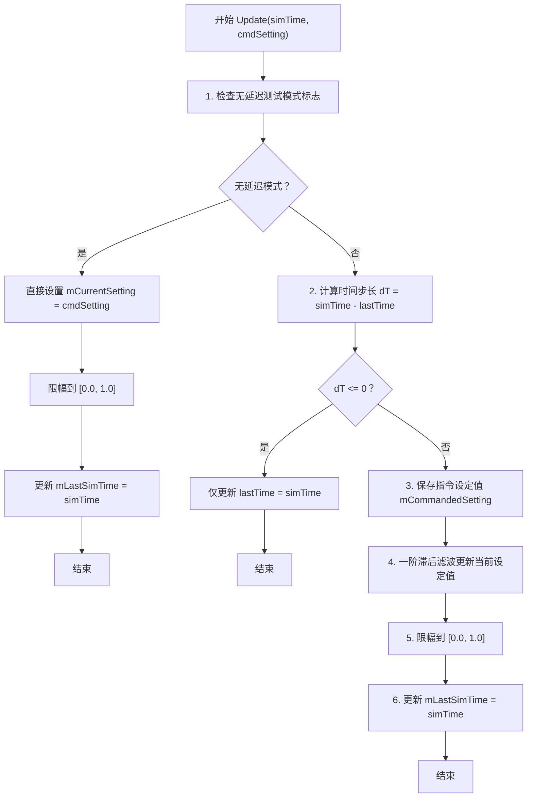

# 算法卡片 -- 一阶滞后滤波执行机构模型

> **状态**：draft
> **日期**：2026-06-24
> **索引证据**：function-index.jsonl (wsf::six_dof::PointMassControlActuator)
> **关联文档**：flight-dynamics-autopilot-pid-card.md, flight-dynamics-pointmass-aero-card.md, flight-dynamics-rate-limited-actuator-card.md
> **关联源文件**：`WsfPointMassSixDOF_ControlActuator.hpp/.cpp`

### 基础资料

- **算法名称**：First-Order Lag Filter Actuator Model（一阶滞后滤波执行机构模型）
- **算法所属模块**：wsf_six_dof（点质/刚体六自由度飞行器运动学插件 -- 新模块）
- **算法功能**：模拟点质（PointMass）飞行器控制通道的执行机构动力学——通过一阶滞后滤波（指数平滑）将飞控系统输出的连续型指令设定值（取值范围 0~1，对应操纵面偏度百分比）平滑过渡到实际当前值。不同于刚体舵机的角速率限幅模型，该模型直接操作无量纲的"设定值"（setting），不涉及角度、角速率等物理量纲。

### 算法流程

整个算法流程图如下：



其中，第一步检测 `testingNoLag` 标志，开启时光有指令直达——直接赋值并钳制在 [0,1]；第二步计算时间步长并防御零步长；第三步记录指令值；第四步是核心——用一阶滞后（指数平滑）递推公式更新当前设定值；第五步确保最终输出不超出 [0,1] 范围；第六步保存时间戳。

### 算法变量和常量映射表

1. 输入变量(input)：

   | # | 中文名称(Name) | 代码标识(Symbol) | 数学符号(Math-sym) | 数据类型(Type) | 含义(Meaning) | 单位(Units) | 所属函数(Method) |
   |---| ---- | ---- | ---- | --- | ---- | --- |
   | 1 | 仿真时间 | `aSimTime_nanosec` | $t_\text{sim}$ | `int64_t` | 当前仿真时间戳 | 纳秒(ns) | `wsf::six_dof::PointMassControlActuator::Update` |
   | 2 | 指令设定值 | `aCommandedSetting` | $s_{\text{cmd}}$ | `double` | 飞控系统输出的期望控制设定值 | 无量纲 | `wsf::six_dof::PointMassControlActuator::Update` |

2. 输出变量(output)：

   | # | 中文名称(Name) | 代码标识(Symbol) | 数学符号(Math-sym) | 数据类型(Type) | 含义(Meaning) | 单位(Units) | 所属函数(Method) |
   |---| ---- | ---- | ---- | --- | ---- | --- |
   | 1 | 当前设定值 | `mCurrentSetting` | $s_{\text{cur}}$ | `double` | 经过一阶滞后滤波和限幅后的实际控制设定值 | 无量纲 | `wsf::six_dof::PointMassControlActuator::Update` |

3. 参数变量(parameters)：

   | # | 中文名称(Name) | 代码标识(Symbol) | 数学符号(Math-sym) | 数据类型(Type) | 含义(Meaning) | 单位(Units) | 所属函数(Method) |
   |---| ---- | ---- | ---- | --- | ---- | --- |
   | 1 | 滞后时间常数 | `mLagTimeConstant_sec` | $\tau$ | `double` | 一阶滞后滤波的时间常数，值越大响应越慢 | 秒(s) | `wsf::six_dof::PointMassControlActuator::ProcessInput` |

4. 状态变量(state variables)：

   | # | 中文名称(Name) | 代码标识(Symbol) | 数学符号(Math-sym) | 数据类型(Type) | 含义(Meaning) | 单位(Units) | 所属函数(Method) | 初始值(Initial-val) | 更新时机(Update-tim) |
   |---| ---- | ---- | ---- | --- | ---- | --- |
   | 1 | 当前设定值 | `mCurrentSetting` | $s_{\text{cur}}$ | `double` | 经滤波的实际控制设定值 | 无量纲 | `wsf::six_dof::PointMassControlActuator::Initialize` | 0 | 每次 `Update()` 调用更新 |
   | 2 | 上次仿真时间 | `mLastSimTime_nanosec` | $t_{\text{last}}$ | `int64_t` | 上一次 Update 的仿真时间戳 | 纳秒(ns) | `wsf::six_dof::PointMassControlActuator::Initialize` | 初始化时赋值为当前仿真时间 | 每次 `Update()` 调用更新为当前时间 |
   | 3 | 指令设定值 | `mCommandedSetting` | $s_{\text{cmd}}$ | `double` | 最近一次接收到的指令设定值（用于记录和诊断） | 无量纲 | `wsf::six_dof::PointMassControlActuator::Update` | 0 | 每次 `Update()` 调用更新 |

5. 常量(constant)：

   本算法不涉及物理常量。所有控制参数均为用户可配置的仿真参数。系统隐含的常量仅有两个：
   - $s_{\text{min}} = 0.0$（最小设定值，硬编码）
   - $s_{\text{max}} = 1.0$（最大设定值，硬编码）

### 关键数学公式

1. **时间步长计算**：
    根据两次仿真的纳秒时间戳计算物理时间步长，公式如下：
    $$\Delta t = (t_\text{sim} - t_\text{last}) \times 10^{-9}$$
    其中：
    - $\Delta t$ 表示物理时间步长，单位为秒(s)。
    - $t_\text{sim}$ 表示当前仿真时间戳，单位为纳秒(ns)。
    - $t_\text{last}$ 表示上次更新时的仿真时间戳，单位为纳秒(ns)。

2. **一阶滞后滤波核心公式**：
    这是将连续一阶微分方程 $\tau \frac{ds}{dt} + s = s_{\text{cmd}}$ 用隐式欧拉法（向后欧拉）离散化的结果，公式如下：
    $$\tau \frac{s_{\text{cur}}^{(n+1)} - s_{\text{cur}}^{(n)}}{\Delta t} + s_{\text{cur}}^{(n+1)} \approx s_{\text{cmd}}$$
    整理得到显式递推公式：
    $$s_{\text{cur}}^{(n+1)} = \frac{s_{\text{cmd}} \cdot \Delta t + s_{\text{cur}}^{(n)} \cdot \tau}{\tau + \Delta t}$$
    其中：
    - $s_{\text{cur}}^{(n+1)}$ 表示更新后的当前设定值，无量纲，取值[0, 1]。
    - $s_{\text{cur}}^{(n)}$ 表示更新前的当前设定值，无量纲，取值[0, 1]。
    - $s_{\text{cmd}}$ 表示飞控系统输出的指令设定值，无量纲，取值[0, 1]。
    - $\tau$ 表示滞后时间常数，单位为秒(s)。当 $\tau = 0$ 时，退化为 $s_{\text{cur}}^{(n+1)} = s_{\text{cmd}}$（瞬时响应）。
    - $\Delta t$ 表示时间步长，单位为秒(s)。

    **递推公式的直观理解**：$s_{\text{cur}}^{(n+1)}$ 是 $s_{\text{cmd}}$ 和 $s_{\text{cur}}^{(n)}$ 的加权平均，权重分别为 $\frac{\Delta t}{\tau + \Delta t}$ 和 $\frac{\tau}{\tau + \Delta t}$。当 $\Delta t \ll \tau$ 时，当前值权重接近 1（响应极慢）；当 $\Delta t \gg \tau$ 时，指令值权重接近 1（快速跟踪指令）。

    与连续解的对应关系：一阶微分方程 $\tau \frac{ds}{dt} + s = s_{\text{cmd}}$ 的阶跃响应为 $s(t) = s_{\text{cmd}} + (s_0 - s_{\text{cmd}}) e^{-t/\tau}$。经历一个时间常数 $\tau$ 后，$s$ 约达到阶跃的 63.2%。

3. **输出限幅公式**：
    $$s_{\text{cur}}' = \text{clamp}(s_{\text{cur}}^{(n+1)}, 0.0, 1.0)$$
    其中：
    - $\text{clamp}(x, a, b) = \max(a, \min(x, b))$ 表示限幅函数。
    - $0.0$ 和 $1.0$ 分别是设定值的最小和最大允许范围。

4. **无延迟测试模式公式**：
    当 `testingNoLag` 标志为真时：
    $$s_{\text{cur}}' = \text{clamp}(s_{\text{cmd}}, 0.0, 1.0)$$
    即完全跳过一阶滞后滤波，瞬时响应。

### 算法伪代码

```
// ====================================================================
// 算法：一阶滞后滤波执行机构 Update
// 功能：用隐式欧拉法离散一阶微分方程，平滑跟踪指令设定值
// 适用模块：wsf_six_dof（PointMassControlActuator）
// ====================================================================

FUNCTION Update(simTime_ns, cmdSetting):
    // 第一步：检查无延迟测试模式
    IF testing_no_lag_flag IS TRUE THEN
        mCommandedSetting = cmdSetting              // 保存指令值
        mCurrentSetting = cmdSetting                // 直接等于指令（无延迟）
        mCurrentSetting = CLAMP(mCurrentSetting,    // 钳制到 [0, 1]
                                0.0, 1.0)
        mLastSimTime_ns = simTime_ns               // 更新时间戳
        RETURN
    END IF

    // 第二步：计算时间步长（纳秒 -> 秒）
    dt_ns = simTime_ns - mLastSimTime_ns            // 时间差（纳秒）
    IF dt_ns <= 0 THEN                              // 时间未推进或回退
        mLastSimTime_ns = simTime_ns                // 更新时间戳但不做计算
        RETURN
    END IF
    dt_sec = ns_to_seconds(dt_ns)                   // 转换为秒

    mLastSimTime_ns = simTime_ns                    // 保存本次时间戳

    // 第三步：保存指令设定值
    mCommandedSetting = cmdSetting

    // 第四步：一阶滞后滤波 —— 隐式欧拉离散化
    // tau * (s_new - s_old)/dt + s_new = s_cmd
    // => s_new = (s_cmd * dt + s_old * tau) / (tau + dt)
    mCurrentSetting = (cmdSetting * dt_sec
                     + mCurrentSetting * mLagTimeConstant_sec)
                    / (mLagTimeConstant_sec + dt_sec)

    // 第五步：输出限幅到 [0, 1]（操纵面偏度百分比范围）
    IF mCurrentSetting > 1.0 THEN
        mCurrentSetting = 1.0                        // 上限幅
    END IF
    IF mCurrentSetting < 0.0 THEN
        mCurrentSetting = 0.0                        // 下限幅
    END IF

    RETURN
END FUNCTION
```

### 源码使用说明

#### 入口和调用链

```
→ PointMassFlightControlSystem::Update()
  // 点质飞控系统主更新入口：根据控制模式计算指令设定值
  → PointMassControlActuator::Update(simTime, cmdSetting)
    // 一阶滞后滤波：将飞控指令平滑为实际控制面设定值
    // 输出 mCurrentSetting（0~1 范围）用于后续气动模型缩放
```

#### 源码位置

| 类 | 头文件 | 实现文件 | Update方法行号 |
|---|--------|---------|--------------|
| `PointMassControlActuator` | `wsf_plugins/wsf_six_dof/source/WsfPointMassSixDOF_ControlActuator.hpp:25-63` | `WsfPointMassSixDOF_ControlActuator.cpp:67-124` | L67-124 |

#### 框架依赖

| 依赖类型 | AFSIM 原始依赖 | 说明 |
|---------|---------------|------|
| 框架依赖 | `PointMassFlightControlSystem` | 父飞控系统指针，用于访问测试标志；可替换为任意父容器 |
| 框架依赖 | 测试标志 (`testingNoLag`) | 无延迟测试模式开关；可替换为自定义测试标志 |
| 可替换依赖 | `utils::TimeToTime()` | 纳秒→秒转换（× 1e-9）；`std::chrono` 可完全替代 |
| 可替换依赖 | `UtInputBlock` | 输入脚本解析器，读取 `lag_time_constant` 命令；可替换为 JSON/YAML |

#### 边界条件

1. **时间步长为零或负值**：当 `dt_ns <= 0` 时直接返回，不更新设定值。
2. **设定值硬范围**：输出始终钳制在 [0.0, 1.0]。这意味着该执行机构适用于表示 0% 到 100% 的操纵面偏度或推力水平等连续型控制量。
3. **$\tau = 0$ 的退化**：当 `mLagTimeConstant_sec = 0` 时，递推公式退化为 `mCurrentSetting = cmdSetting * dt / dt = cmdSetting`，即瞬时响应。代码中默认值即为 0。
4. **与角速率限幅执行机构的对比**：`PointMassControlActuator` 用于点质模型的控制通道（油门、方向舵等效偏度等），操作的是无量纲设定值、不涉及角度量纲；`RigidBodyControlActuator` 用于刚体模型的物理舵面，操作的是角度（°）。这一区别是本质性的——前者是"归一化控制量"的滤波平滑器，后者是"物理角度"的速率限幅器。

#### 测试和验证计划

1. **单元测试——阶跃响应时间**：
   - 设置 $\tau = 1.0$ s，初始 $s_{\text{cur}} = 0.0$
   - 输入 $s_{\text{cmd}} = 1.0$ 的阶跃，固定 $\Delta t = 0.01$ s
   - 运行 100 步（1.0 s），验证 $s_{\text{cur}}$ 约达到 $1.0 - 1.0 \times e^{-1} \approx 0.632$
2. **单元测试——稳态响应**：
   - 设置 $\tau = 0.5$ s，连续多步输入 $s_{\text{cmd}} = 0.8$
   - 运行足够长时间后，验证 $s_{\text{cur}}$ 收敛到 0.8 ± 1e-6
3. **单元测试——输出限幅**：
   - 输入 $s_{\text{cmd}} = 2.5$，验证输出被钳制在 1.0
   - 输入 $s_{\text{cmd}} = -0.5$，验证输出被钳制在 0.0
4. **数值对比**：与 MATLAB `filter([dt/(tau+dt)], [1, -tau/(tau+dt)], cmdSeq)` 对比，误差 < 1e-12

#### 可移植性评分
**可移植性**：高
**原因**：
1. 核心算法仅一行公式——隐式欧拉离散化，无任何外部数学库依赖。
2. 输入输出均为无量纲值（范围 [0, 1]），不依赖任何物理单位系统。
3. 唯一依赖是时间单位转换（纳秒→秒），`std::chrono::duration_cast` 可完全替代。
