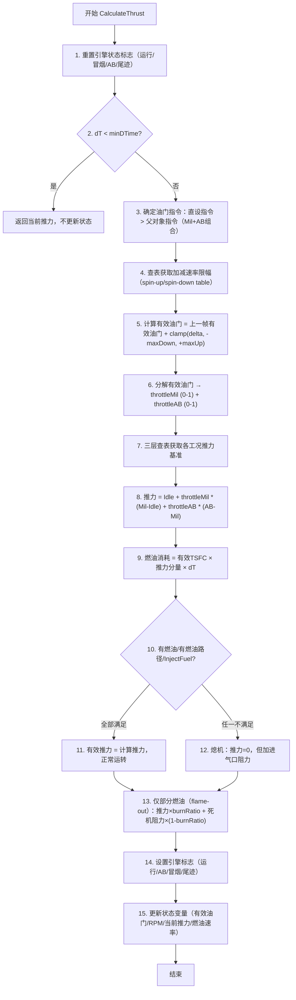

# 算法卡片 -- wsf_six_dof 喷气发动机推力模型

> **状态**：draft
> **日期**：2026-06-11
> **索引证据**：function-index.jsonl (wsf_six_dof::JetEngine), source/WsfSixDOF_JetEngine.hpp/.cpp, source/WsfSixDOF_Engine.hpp
> **关联文档**：flight-dynamics-propulsion-fuel-card.md, flight-dynamics-rigid-body-integrator-card.md

### 基础资料

- **算法名称**：Jet Engine Thrust Model with Spool Dynamics（含转速加减速动特性的喷气发动机推力模型）
- **算法所属模块**：wsf_six_dof（点质/刚体六自由度飞行器运动学插件 -- 新模块）
- **算法功能**：模拟涡喷/涡扇发动机的推力响应特性。核心算法包括：(1) 三层查表（Idle/Mil/AB 各一表，支持简单替代曲线或改进 2D 马赫/高度表）；(2) 油门杆转速动特性（spool dynamics）：有效油门按 Mil/AB 不同加减速率（spin-up/spin-down rate）渐进跟随指令油门，模拟发动机转速滞后；(3) 推力分解：Idle 工况推力 + 按油门比例的 Mil 增量 + AB 增量（仅当有加力燃烧室时）；(4) 燃油消耗 = 有效 TSFC（推力比油耗）× 推力分量 × 时间步长，经燃油箱 UpdateFuelBurn 消耗；(5) 熄火保护：缺油/断油时返回零推力 + 进气口阻力（dead engine drag）。

### 算法流程

整个算法流程图如下：



其中，第一步清零前帧的运行、冒烟、AB、尾迹标志；第二步保护极小时间步（< EPSILON）避免零除；第三步优先使用直设油门（SetThrottlePosition），否则由父对象 ThrustProducerObject 的 Mil 油门 + AB 油门合成；第四步通过 1D 曲线或标量值查取当前有效油门位置对应的加减速限幅；第五步是 spool dynamics 核心：`effectiveThrottle = lastThrottle + clamp(target - lastThrottle, -maxSpinDown, +maxSpinUp)`，模拟发动机转子惯性；第六步将有效油门分解为 0-1 的 Mil 分量和 AB 分量；第七步查三层推力表（简单替代曲线查 altitude，改进 2D 表查 mach+alt 或 alt+mach），顺序为 Idle -> Mil -> AB，AB=MachAlt 查值减去 Mil=MachAlt 查值得增量、Mil=MachAlt 查值减去 Idle=MachAlt 查值得增量；第八步总推力=Idle+throttleMil*MilIncrement+throttleAB*ABIncrement；第九步燃油消耗=有效TSFC_pps*推力分量*dT；第十步检查燃油供给路径完整性（FuelFlowPathIntact）和 InjectFuel 标志；第十一步全部条件满足则正常运转；第十二步缺油/断油时，推力=0，附加 deadEngineDrag=InoperatingDragArea*dynPress；第十三步部分燃油（flame-out）时，推力按 burnRatio 缩比，同时叠加部分死机阻力；第十四步设置引擎可见性标志；第十五步更新成员状态变量。

### 算法变量和常量

1. 输入 (input)：

   | 英文标识符 (Symbol)         | 中文名称 (Name) | 数据类型 (Type) | 含义 (Meaning)                    | 单位 (Units) | 所属函数 (Method)    |
   | ---------------------- | ----------- | ----------- | ------------------------------- | ---------- | ---------------- |
   | `aDeltaT_sec`          | 时间步长        | `double`    | 当前帧仿真时间步长                       | s          | CalculateThrust  |
   | `aAlt_ft`              | 海拔高度        | `double`    | 当前飞行器 MSL 海拔                    | ft         | CalculateThrust  |
   | `aDynPress_lbsqft`     | 动压          | `double`    | 自由流动压 q_bar（熄机阻力计算用）               | lb/ft^2    | CalculateThrust  |
   | `aMach`                | 马赫数         | `double`    | 飞行马赫数（改进 2D 推力表查表用）                | 无量纲        | CalculateThrust  |
   | `mThrottleLeverPosition` | 油门杆位        | `double`    | 直接设定的油门杆位置（0=慢车/1=军推/2=全加力，含AB时）    | 无量纲        | CalculateThrust  |
   | `mInjectFuel`          | 供油标志        | `bool`      | false 时停止供油（熄火/shutdown）              | —          | CalculateThrust  |
   | `aUpdateData`          | 更新数据标志      | `bool`      | true 时更新发动机状态变量（thrust/RPM/燃油速率等）      | —          | CalculateThrust  |

2. 输出 (output)：

   | 英文标识符 (Symbol)      | 中文名称 (Name) | 数据类型 (Type) | 含义 (Meaning)           | 单位 (Units) | 所属函数 (Method)   |
   | ------------------- | ----------- | ----------- | ---------------------- | ---------- | --------------- |
   | `aForceAndMoment`   | 推力值         | `double&`   | 当前计算推力（正值）或熄机阻力（负值）   | lb         | CalculateThrust |
   | `aFuelBurnRate_pps` | 燃油消耗率       | `double&`   | 当前计算燃油质量流率            | lb/s       | CalculateThrust |
   | `aFuelBurned_lbs`   | 本帧燃烧燃油质量    | `double&`   | 本时间步内实际消耗的燃油质量        | lb         | CalculateThrust |
   | `mCurrentThrust_lbs` | 当前推力（状态变量）  | `double`    | 保存的当前推力值（供 GetThrust 使用） | lb         | CalculateThrust |

3. 常量 (constant)：

   | 英文标识符 (Symbol)           | 中文名称 (Name)     | 数据类型 (Type)          | 含义 (Meaning)                    | 单位 (Units) | 所属函数 (Method)   |
   | ------------------------ | --------------- | -------------------- | ------------------------------- | ---------- | --------------- |
   | `mIdleThrustTable`       | 慢车推力曲线         | `Curve*`             | 简单模式：Idle推力 vs 海拔 (alt)         | lb         | ProcessInput    |
   | `mMilThrustTable`        | 军推推力曲线         | `Curve*`             | 简单模式：Mil推力 vs 海拔               | lb         | ProcessInput    |
   | `mABThrustTable`         | 加力推力曲线         | `Curve*`             | 简单模式：AB推力 vs 海拔（全加力）            | lb         | ProcessInput    |
   | `mMilThrustMachAltTable` | 军推推力 2D 表      | `Table*`             | 改进模式：Mil推力 (mach × alt) 2D       | lb         | ProcessInput    |
   | `mABThrustMachAltTable`  | 加力推力 2D 表      | `Table*`             | 改进模式：AB推力 (mach × alt) 2D       | lb         | ProcessInput    |
   | `mIdleThrustMachAltTable` | 慢车推力 2D 表      | `Table*`             | 改进模式：Idle推力 (mach × alt) 2D     | lb         | ProcessInput    |
   | `mIdleThrustAltMachTable` | 慢车推力 2D 表(alt优先) | `Table*`             | 改进模式：Idle推力 (alt × mach) 2D     | lb         | ProcessInput    |
   | `mMilThrustAltMachTable` | 军推推力 2D 表(alt优先) | `Table*`              | 改进模式：Mil推力 (alt × mach) 2D      | lb         | ProcessInput    |
   | `mABThrustAltMachTable`  | 加力推力 2D 表(alt优先) | `Table*`              | 改进模式：AB推力 (alt × mach) 2D       | lb         | ProcessInput    |
   | `mTSFC_Idle_pph`         | 慢车推力比油耗        | `double`             | Thrust-Specific Fuel Consumption (Idle) | lb/lb/hr   | ProcessInput    |
   | `mTSFC_Mil_pph`          | 军推推力比油耗        | `double`             | TSFC (Mil)                      | lb/lb/hr   | ProcessInput    |
   | `mTSFC_AB_pph`           | 加力推力比油耗        | `double`             | TSFC (AB)                       | lb/lb/hr   | ProcessInput    |
   | `mRatedThrustIdle_lbs`   | 额定慢车推力         | `double`             | 设计点慢车推力（用于TSFC标定）               | lb         | ProcessInput    |
   | `mRatedThrustMil_lbs`    | 额定军推推力         | `double`             | 设计点军推推力                        | lb         | ProcessInput    |
   | `mRatedThrustAB_lbs`     | 额定加力推力         | `double`             | 设计点加力推力                        | lb         | ProcessInput    |
   | `mSpinUpMil_per_sec`     | 军推加速率          | `double`             | 慢车→军推时的最大油门加速率（标量或查表）           | 1/s        | ProcessInput    |
   | `mSpinDownMil_per_sec`   | 军推减速率          | `double`             | 军推→慢车时的最大油门减速率                 | 1/s        | ProcessInput    |
   | `mSpinUpAB_per_sec`      | 加力加速率          | `double`             | 军推→加力时的最大油门加速率                 | 1/s        | ProcessInput    |
   | `mSpinDownAB_per_sec`    | 加力减速率          | `double`             | 加力→军推时的最大油门减速率                 | 1/s        | ProcessInput    |
   | `mEffectiveTSFC_Idle_pps` | 有效慢车 TSFC (pps) | `double`             | = TSFC_Idle / 3600              | lb/lb/s    | Initialize      |
   | `mEffectiveTSFC_Mil_pps`  | 有效军推 TSFC (pps) | `double`             | = (MilFuel-IdleFuel)/(MilThrust-IdleThrust)/3600 | lb/lb/s | Initialize |
   | `mEffectiveTSFC_AB_pps`   | 有效加力 TSFC (pps) | `double`             | = (ABFuel-MilFuel)/(ABThrust-MilThrust)/3600 | lb/lb/s    | Initialize      |
   | `mAfterburnerPresent`     | 加力存在标志         | `bool`               | 无 AB 推力表时 = false                | —          | DetermineIfAfterburnerIsPresent |

### 关键数学公式

1. **有效油门 Spool Dynamics（转速加减速动特性）**：
   发动机响应油门指令存在转子惯性引起的滞后，有效油门通过受速率限制的一阶滞后跟随：
   $$\delta_{eff}(t + \Delta t) = \delta_{eff}(t) + \text{clamp}\left(\delta_{cmd} - \delta_{eff}(t), -\dot{\delta}_{down} \cdot \Delta t, +\dot{\delta}_{up} \cdot \Delta t\right)$$
   其中：
   - $\delta_{eff}$ 为当前有效油门（无量纲，0=熄火/1=军推/2=全加力）。
   - $\delta_{cmd}$ 为指令油门。
   - $\dot{\delta}_{up}$ 为加速率（当前在 Mil 段用 spinUpMil，AB 段用 spinUpAB）。
   - $\dot{\delta}_{down}$ 为减速率（当前在 Mil 段用 spinDownMil，AB 段用 spinDownAB）。
   - 加减速率可为标量值或 1D Curve（查表参数为 lastThrottlePosition）。

2. **油门分解为 Mil 和 AB 分量**：
   有效油门超过 1.0 的部分属于加力燃烧室：
   $$\delta_{mil} = \min(\delta_{eff}, 1.0), \quad \delta_{ab} = \max(0, \delta_{eff} - 1.0)$$
   无加力发动机时 $\delta_{ab} = 0$，$\delta_{mil} = \text{clamp}(\delta_{eff}, 0, 1)$。

3. **推力计算 -- 简单曲线模式（推力 = f(altitude)）**：
   三种工况推力分别查替代曲线，取增量：
   $$T_{idle\_base} = f_{idle}(h), \quad T_{mil\_base} = f_{mil}(h), \quad T_{ab\_base} = f_{ab}(h)$$
   $$T_{mil\_inc} = T_{mil\_base} - T_{idle\_base}, \quad T_{ab\_inc} = T_{ab\_base} - T_{mil\_base}$$
   $$T = T_{idle\_base} + \delta_{mil} \cdot T_{mil\_inc} + \delta_{ab} \cdot T_{ab\_inc}$$

4. **推力计算 -- 改进 2D 表模式（推力 = f(mach, altitude) 或 f(altitude, mach)）**：
   两种查表顺序并存（MachAlt 优先于 AltMach），取最后一次非零查值：
   $$T_{idle\_base} = \max\left(f_{idle\_machAlt}(M, h), f_{idle\_altMach}(h, M)\right)$$
   $$T_{mil\_base} = \max\left(f_{mil\_machAlt}(M, h), f_{mil\_altMach}(h, M)\right)$$
   $$T_{ab\_base} = \max\left(f_{ab\_machAlt}(M, h), f_{ab\_altMach}(h, M)\right)$$
   注意：表查值单位在 alt 维度为 m（乘以 cM_PER_FT 转换），mach 为原始值。

5. **燃油消耗计算**：
   有效 TSFC 从额定推力和名义 TSFC 反算（仅使用增量部分的 TSFC）：
   $$T_{sfc\_mil\_eff} = \frac{T_{rated\_mil} \cdot SFC_{mil} - T_{rated\_idle} \cdot SFC_{idle}}{T_{rated\_mil} - T_{rated\_idle}} \cdot \frac{1}{3600}$$
   $$T_{sfc\_ab\_eff} = \frac{T_{rated\_ab} \cdot SFC_{ab} - T_{rated\_mil} \cdot SFC_{mil}}{T_{rated\_ab} - T_{rated\_mil}} \cdot \frac{1}{3600}$$
   $$m_{fuel} = \left(T_{idle\_base} \cdot SFC_{idle} + \delta_{mil} \cdot T_{mil\_inc} \cdot T_{sfc\_mil\_eff} + \delta_{ab} \cdot T_{ab\_inc} \cdot T_{sfc\_ab\_eff}\right) \cdot \frac{\Delta t}{3600}$$
   或等效用 pps（每秒磅数）：
   $$m_{fuel} = (T_{idle\_base} \cdot SFC_{idle\_pps} + \delta_{mil} \cdot T_{mil\_inc} \cdot T_{sfc\_mil\_pps} + \delta_{ab} \cdot T_{ab\_inc} \cdot T_{sfc\_ab\_pps}) \cdot \Delta t$$

6. **熄机进气口阻力**：
   当引擎完全缺油或断油时，附加阻力为：
   $$D_{dead} = A_{drag\_area} \cdot \bar{q}$$
   其中 $A_{drag\_area}$ 为引擎不工作时的等效阻力面积（ft^2），$\bar{q}$ 为动压。

7. **部分燃油 Flame-out 推力**：
   当燃油仅够部分时间步时：
   $$T_{eff} = T \cdot \frac{m_{burned}}{m_{requested}} - D_{dead} \cdot \left(1 - \frac{m_{burned}}{m_{requested}}\right)$$
   即推力按燃油供给比例缩比，同时叠加部分死机阻力。

### 算法伪代码

```
// === 喷气发动机推力模型（含 Spool Dynamics）===
// 整体目标：计算有效推力 + 燃油消耗率，考虑转速动特性和熄火保护

function CalculateThrust(dT_sec, alt_ft, dynPress_lbsqft, mach,
                         out thrust_lbs, out fuelBurnRate_pps, out fuelBurned_lbs,
                         updateData):
    // 重置状态标志
    mEngineOperating = false; mEngineSmoking = false                // 默认不运转
    mAfterburnerOn = false; mContrailing = false                    // 默认关AB/无尾迹
    mProducingSmokeTrail = false                                     // 涡喷/涡扇无持久烟迹

    if dT_sec < EPSILON:                                            // 极小时间步保护
        thrust_lbs = mCurrentThrust_lbs; fuelBurnRate_pps = 0; fuelBurned_lbs = 0
        return

    // 1. 确定油门指令优先级：直设指令 > 父对象指令
    if mThrottleLeverPositionSet:
        throttleCmd = mThrottleLeverPosition                        // 使用直设值
    else:
        throttleCmd = parent.getThrottleMilSetting()                // 父对象 Mil 油门 (0~1)
        if mAfterburnerPresent and throttleCmd > 0.99:
            throttleCmd += parent.getThrottleAbSetting()           // 叠加父对象 AB 油门
        clampThrottleLimits(throttleCmd)                            // 限幅 [0, 1+AB]

    // 2. 查表获取加减速限幅（spin-up/down rate）
    maxSpinUpMil   = getSpinUpMilPerSec  * dT_sec                   // 标量乘 dT
    maxSpinDownMil = getSpinDownMilPerSec * dT_sec
    maxSpinUpAB    = getSpinUpABPerSec   * dT_sec
    maxSpinDownAB  = getSpinDownABPerSec * dT_sec

    if mSpinUpMilTable:                                              // 优先使用查表
        maxSpinUpMil = dT_sec * mSpinUpMilTable.Lookup(mLastThrottle)
    if mSpinDownMilTable:
        maxSpinDownMil = dT_sec * mSpinDownMilTable.Lookup(mLastThrottle)
    if mSpinUpABTable:
        maxSpinUpAB = dT_sec * mSpinUpABTable.Lookup(mLastThrottle)
    if mSpinDownABTable:
        maxSpinDownAB = dT_sec * mSpinDownABTable.Lookup(mLastThrottle)

    // 3. Spool Dynamics：有效油门渐进跟随指令
    effectiveThrottle = mLastThrottle
    delta = throttleCmd - effectiveThrottle

    if delta >= 0:                                                  // 加速方向
        if effectiveThrottle > 1.0:                                 // 当前在 AB 段
            delta = min(delta, maxSpinUpAB)
        else:                                                       // 当前在 Mil 段
            delta = min(delta, maxSpinUpMil)
        if not mAfterburnerPresent:
            delta = min(delta, maxSpinUpMil)
    else:                                                           // 减速方向
        if effectiveThrottle > 1.0:
            delta = max(delta, -maxSpinDownAB)                     // 负 delta，用 max 限幅
        else:
            delta = max(delta, -maxSpinDownMil)
        if not mAfterburnerPresent:
            delta = max(delta, -maxSpinDownMil)

    effectiveThrottle += delta                                      // 有效油门 = 上一帧 + 受限增量

    if testNoLag:                                                   // 测试用无滞后模式
        effectiveThrottle = throttleCmd

    clampThrottleLimits(effectiveThrottle)                          // 二次限幅保证

    // 4. 分解油门为 Mil 和 AB 分量
    if effectiveThrottle > 1.0:
        throttleMil = 1.0
        throttleAB  = effectiveThrottle - 1.0                       // AB 分量 0~1
    else:
        throttleMil = effectiveThrottle
        throttleAB  = 0.0
    if not mAfterburnerPresent:
        throttleMil = min(effectiveThrottle, 1.0); throttleAB = 0.0

    // 5. 三层查表获取推力基准
    if mMilThrustTable:                                              // 简单曲线模式
        idleThrust = mIdleThrustTable.Lookup(alt_ft)
        milThrust  = mMilThrustTable.Lookup(alt_ft)
        abThrust   = mABThrustTable.Lookup(alt_ft)  if mABThrustTable else 0
        abThrust  -= milThrust                                      // AB = 总AB - 总Mil
        milThrust -= idleThrust                                     // Mil = 总Mil - 总Idle
    else if mMilThrustMachAltTable or mMilThrustAltMachTable:      // 改进 2D 表模式
        machAltArgs = [mach, alt_ft*M_PER_FT]
        altMachArgs = [alt_ft*M_PER_FT, mach]
        idleThrust = mMilThrustMachAltTable.Lookup(machAltArgs) \
                  or mMilThrustAltMachTable.Lookup(altMachArgs)
        milThrust  = ... (同上取 max)
        abThrust   = ... (同上取 max)
        abThrust  -= milThrust; milThrust -= idleThrust

    // 6. 推力 = 基准 + 按油门比例缩放增量
    milIncrementThrust = throttleMil * milThrust
    abIncrementThrust  = throttleAB  * abThrust  if mAfterburnerPresent else 0
    totalThrust = idleThrust + milIncrementThrust + abIncrementThrust

    // 7. 燃油消耗 = 有效 TSFC × 推力分量 × dT
    idleFuelBurn = effectiveTSFC_Idle_pps * idleThrust * dT_sec
    milFuelBurn  = effectiveTSFC_Mil_pps  * milIncrementThrust * dT_sec
    abFuelBurn   = effectiveTSFC_AB_pps   * abIncrementThrust * dT_sec
    fuelRequest_lbs = idleFuelBurn + milFuelBurn + abFuelBurn

    // 8. 熄火/缺油判定
    deadEngine = false
    if mCurrentFuelTank == null or not mInjectFuel or fuelRequest <= 0:
        deadEngine = true                                           // 无油箱/断油/零油请求

    if not deadEngine:
        flowPathIntact = mCurrentFuelTank.FuelFlowPathIntact(parentPropSystem)
        if not flowPathIntact:
            mCurrentFuelTank = null; deadEngine = true              // 路径中断则标记 dead

    ableToBurnAllFuel = false
    if not deadEngine:
        if updateData:
            ableToBurnAllFuel = mCurrentFuelTank.UpdateFuelBurn(dT_sec, fuelRequest,
                                  out actualBurned, out newMass, out newCg)
        else:
            ableToBurnAllFuel = mCurrentFuelTank.CalculateFuelBurn(dT_sec, fuelRequest,
                                  out actualBurned, out newMass, out newCg)

    // 9. 熄机阻力
    deadEngineDrag = 0
    if deadEngine or not ableToBurnAllFuel:
        deadEngineDrag = parentThrustProducer.getInoperatingDragArea_ft2() * dynPress

    // 10. 有效推力确定
    if deadEngine:
        effectiveThrust = -deadEngineDrag                           // 纯熄机阻力
        fuelBurnRate_pps = 0; fuelBurned_lbs = 0
    else if not ableToBurnAllFuel:
        burnRatio = actualBurned / fuelRequest                     // 燃油供给比例
        effectiveThrust = totalThrust * burnRatio - deadEngineDrag * (1 - burnRatio)
        fuelBurnRate_pps = actualBurned / dT_sec
        fuelBurned_lbs = actualBurned
        mEngineOperating = false                                     // flame-out 视为不运转
    else:
        effectiveThrust = totalThrust                               // 正常运转
        fuelBurnRate_pps = actualBurned / dT_sec; fuelBurned_lbs = actualBurned
        mEngineOperating = true
        mAfterburnerOn = (mAfterburnerPresent and throttleAB > 0)

    // 11. 冒烟/尾迹判定
    if mEngineMaySmoke and effectiveThrottle > mEngineSmokesAboveLevel and not mAfterburnerOn:
        mEngineSmoking = true                                       // 非 AB 且高于冒烟门限

    if mEngineOperating and parentVehicle.WithinContrailAltitudeBand(alt_ft):
        mContrailing = true                                         // 在凝结尾迹高度层

    thrust_lbs = effectiveThrust

    // 12. 状态更新（仅在 UpdateThrust 而非 CalculateThrust 时执行）
    if updateData:
        mLastThrottlePosition = effectiveThrottle                    // 保存有效油门
        mEnginePercentRPM = 100.0 * throttleMil                    // 简化的 RPM 指示
        mNozzlePosition = throttleAB                                 // 简化的喷口指示
        mCurrentThrust_lbs = effectiveThrust
        mCurrentFuelBurnRate_pph = fuelBurnRate_pps * 3600.0
```

### 源码使用说明

#### 入口和调用链

```
// 从推进系统 → 推力产生器 → 引擎 → 推力计算
PropulsionSystem::Update()                                              // 帧推进系统更新
  → ThrustProducerObject::UpdateThrust()                                // 推力产生器更新
    → Engine::UpdateThrust(dT, alt, dynPress, statPress, speed, Mach, alpha, beta)
      → JetEngine::CalculateThrust(dT, ..., force, fuelBurnRate, fuelBurned, true)
        → 油门指令确定 → spin-up/down 查表
        → Spool Dynamics（有效油门限速渐进）
        → Idle/Mil/AB 推力三层查表
        → 燃油消耗计算 → FuelTank::UpdateFuelBurn(dT, fuelRequest, ...)
        → 熄火/缺油判定 → deadEngineDrag
        → 有效推力 = normalThrust 或 -deadEngineDrag
        → 冒烟/尾迹/AB 等视觉标志设位

// 非状态改变查询
→ JetEngine::GetMaximumPotentialThrust_lbs(alt, ..., Mach)
    → ABThrustTable.Lookup(alt) 或 ABThrustMachAltTable.Lookup(Mach, alt)
    → 若无 AB 表则降级查 Mil 表
→ JetEngine::GetMinimumPotentialThrust_lbs(alt, ..., Mach)
    → IdleThrustTable.Lookup(alt) 或 IdleThrustMachAltTable.Lookup(Mach, alt)

// 初始化
JetEngine::ProcessInput(aInput, aTypeManager)
    → 解析 "jet" 配置块
    → 读取 TSFC, RatedThrust, SpinUp/Down 速率, 推力表（9种）
    → 计算 Effective TSFC（增量化 TSFC）
    → DetermineIfAfterburnerIsPresent()
```

#### 源码位置

| File | Symbol | Lines | Evidence level | 中文说明 |
| ---- | ------ | ----- | -------------- | -------- |
| [WsfSixDOF_JetEngine.hpp](source_root/src/wsf_plugins/wsf_six_dof/source/WsfSixDOF_JetEngine.hpp) | `JetEngine` (class) | 31-168 | source-cited | 喷气发动机全量 -- 9 张推力表 + 8 个 spin 速率参数 |
| [WsfSixDOF_JetEngine.cpp](source_root/src/wsf_plugins/wsf_six_dof/source/WsfSixDOF_JetEngine.cpp) | `CalculateThrust()` | 428-864 | source-cited | 推力计算主函数 -- 436 行，含完整 spool dynamics + 熄火保护 |
| [WsfSixDOF_JetEngine.cpp](source_root/src/wsf_plugins/wsf_six_dof/source/WsfSixDOF_JetEngine.cpp) | `GetMaximumPotentialThrust_lbs()` | 881-953 | source-cited | 最大潜在推力查询（AB > Mil 降级） |
| [WsfSixDOF_JetEngine.cpp](source_root/src/wsf_plugins/wsf_six_dof/source/WsfSixDOF_JetEngine.cpp) | `GetMinimumPotentialThrust_lbs()` | 955-997 | source-cited | 最小潜在推力查询（Idle） |
| [WsfSixDOF_JetEngine.cpp](source_root/src/wsf_plugins/wsf_six_dof/source/WsfSixDOF_JetEngine.cpp) | `ProcessInput()` | 138-406 | source-cited | 配置解析 -- 298 行，含有效 TSFC 计算 |
| [WsfSixDOF_JetEngine.cpp](source_root/src/wsf_plugins/wsf_six_dof/source/WsfSixDOF_JetEngine.cpp) | `Initialize()` | 408-426 | source-cited | 初始化 -- 计算有效 TSFC |
| [WsfSixDOF_Engine.hpp](source_root/src/wsf_plugins/wsf_six_dof/source/WsfSixDOF_Engine.hpp) | `Engine` (class) | 34-end | source-cited | 引擎基类 -- 推力产生器接口定义 |

#### 框架依赖

| AFSIM 原始依赖 | 依赖类型 | 替换方案 |
| ------------ | ---- | ---- |
| `UtTable::Table` | 2D 查表（Mach × Alt） | 自定义 2D 插值引擎 |
| `UtTable::Curve` | 1D 查表（thrust vs alt, spin vs throttle） | 自定义 1D 插值 |
| `UtInput` / `UtInputBlock` | 配置解析 | JSON/YAML/TOML 解析器 |
| `UtMath::cLB_PER_NT / cFT_PER_M / cM_PER_FT` | 单位转换 | 硬编码常数 |
| `FuelTank` | 燃油消耗接口 | 自定义燃油箱类 |
| `ThrustProducerObject` | 父对象接口 | 自定义推力产生器类 |
| `Mover / KinematicState` | 飞行状态查询 | 自定义飞行器接口 |

#### 测试和验证计划

1. **Spool Dynamics 阶跃响应测试**：初始有效油门=0，指令油门=1.0（Mil），验证有效油门以 spinUpMil 速率线性上升到 1.0（不应瞬间跳变）。
2. **AB 加/减速切换测试**：初始有效油门=1.0（Mil），指令=2.0（AB），验证切换至 AB 加减速率（spinUpAB）。
3. **无 AB 发动机测试**：mAfterburnerPresent=false，指令油门=1.5，验证有效油门被 clamp 至 1.0。
4. **熄火零推力测试**：mInjectFuel=false 且无燃油箱，验证输出推力 = -deadEngineDrag。
5. **Flame-out 部分推力测试**：燃油箱仅够提供 50% 请求量，验证有效推力 = T*0.5 - deadEngineDrag*0.5。
6. **简单曲线 vs 2D 表一致性**：对同一 (alt, mach) 建两个等效表，验证两种模式输出一致。
7. **TSFC 计算测试**：Idle=1000lb@0.5pph, Mil=5000lb@0.8pph，验证有效 Mil TSFC = (4000-500)/(4000)/3600=0.000243 pps。
8. **燃油箱分离测试**：模拟抛弃外部油箱后，验证 engine dead 且 thrust=-deadEngineDrag。

#### 可移植性评分

**可移植性**：中

**原因**：

1. Spool Dynamics 算法（速率限制一阶滞后）是标准的发动机建模仿真技术，文献充分。
2. 推力查表+油门比例缩放是极简的线性插值模型，仅依赖多维查表能力。
3. TSFC 计算（增量油耗/增量推力）是标准推进工程公式，可直接复用。
4. 熄火阻力（dead engine drag = area * q_bar）是简单空气阻力公式。
5. 主要复杂度在大量配置选项的处理（9 种表格式、4 种 spin rate 格式），而非算法本身——移植时可简化为单一表格式。
6. 查表引擎 `UtTable::Table` 和 `UtTable::Curve` 为 AFSIM 专属，移植时需替换。
7. 与燃油箱（FuelTank）、推力产生器（ThrustProducerObject）、飞行器（Mover）的耦合较紧，移植这些类时会产生额外工作。
8. 单位体系为 Imperial（lb, ft），但推力查表和 TSFC 计算的单位转换逻辑简单明确。
