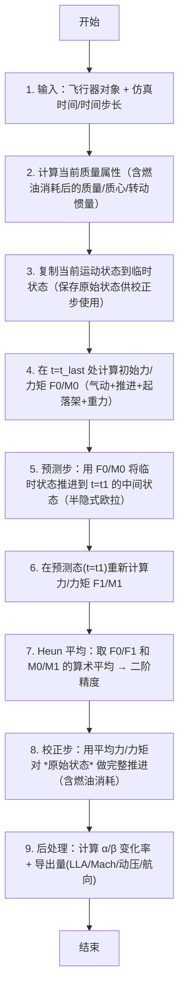

# 算法卡片 -- P6DOF Heun 修正欧拉积分器

> **状态**：draft
> **日期**：2026-06-11
> **索引证据**：function-index.jsonl (wsf_plugins::p6dof_mover_class), source/P6DofIntegrator.hpp, source/P6DofIntegrator.cpp
> **关联文档**：flight-dynamics-aero-coefficient-model-card.md, flight-dynamics-pointmass-sas-card.md

### 基础资料

- **算法名称**：P6DOF Heun's Modified Euler Integrator（P6DOF Heun 修正欧拉积分器）
- **算法所属模块**：wsf_p6dof（拟六自由度飞行器运动学插件 -- 旧模块）
- **算法功能**：对飞行器/导弹在三维空间中的平移和旋转运动进行时间推进。采用 Heun 修正欧拉法（二阶预测-校正），逐帧计算气动力/推进力/起落架力/重力四项力与力矩的综合作用，用半隐式欧拉法推进位置/速度，用四元数法积分姿态，实现完整的飞行器六自由度运动仿真。

### 算法流程

整个算法流程图如下：



其中，第一步获取飞行器对象、当前仿真时间和帧时间步长；第二步调用飞行器的质量属性更新函数以反映燃油消耗后的质量、质心和转动惯量变化；第三步将当前运动状态完整复制到临时状态，同时保留原始状态引用供校正步恢复；第四步在 t=t_last 处以虚拟零时间步长（用极小值 1e-12 秒替代，避免除零）计算当前状态的合力与合力矩，包含气动力/力矩、推进力/力矩、起落架力/力矩和重力；第五步用预测态力/力矩通过半隐式欧拉法将临时状态推进到帧末 t=t1 的时刻；第六步在推进后的预测态重新计算力/力矩；第七步取两个端点力/力矩的算术平均，使积分达到二阶精度；第八步取回原始状态，用平均力/力矩做完整推进更新（此步通过 `UpdateUsingFM` 包含燃油消耗更新和平动/转动推进）；第九步更新攻角/侧滑角的变化率以及经纬度/高度/马赫数/动压/航向等导出量。

### 算法变量和常量

1. 输入 (input)：

   | 英文标识符 (Symbol) | 中文名称 (Name) | 数据类型 (Type) | 含义 (Meaning) | 单位 (Units) | 所属函数 (Method) |
   | ---- | ---- | ---- | --- | ---- | --- |
   | `aObject` | 飞行器对象指针 | `P6DofVehicle*` | 包含质量属性/气动/推进/起落架的完整飞行器模型 | — | Update |
   | `aSimTime_nanosec` | 当前仿真时间 | `int64_t` | 当前仿真帧的时间戳 | ns | Update |
   | `aDeltaT_sec` | 帧时间步长 | `double` | 积分步长（仿真帧率的倒数） | s | Update |
   | `aObject` (overload) | 飞行器对象指针 | `P6DofVehicle*` | 同上，在力/力矩计算中用于获取气动、推进、起落架子系统 | — | CalculateFM |
   | `aState` | 运动状态引用 | `P6DofKinematicState&` | 飞行器的瞬态运动状态（位置/速度/姿态/角速率/气动角） | — | CalculateFM |
   | `aSimTime_nanosec` (overload) | 评估时间戳 | `int64_t` | 用于气动状态更新的时间点 | ns | CalculateFM |
   | `aDeltaT_sec` (overload) | 评估时间步长 | `double` | 传递给气动状态更新的名义时间步长 | s | CalculateFM |
   | `aMassProperties` | 质量属性参考 | `const P6DofMassProperties&` | 当前质量/质心/转动惯量（Ixx/Iyy/Izz） | slug, ft | PropagateUsingFM |
   | `aForcesMomentsAtRP` | 参考点处力/力矩 | `P6DofForceAndMomentsObject&` | 气动+推进+起落架在机体参考点处的合力和合力矩 | lb, ft-lb | PropagateUsingFM |
   | `aForcesMomentsAtCM` | 质心处力/力矩 | `P6DofForceAndMomentsObject&` | 仅重力作用在质心的力（重力不含力矩） | lb, ft-lb | PropagateUsingFM |
   | `aInertialAccel_mps2` | 惯性平动加速度 | `const UtVec3dX&` | 惯性坐标系下的平动加速度矢量 | m/s^2 | PropagateTranslationSphericalEarth |
   | `aInertialAccel_mps2` (WGS) | 惯性平动加速度 | `UtVec3dX` | 同上，用于 WGS84 椭球地球模型的平动推进 | m/s^2 | PropagateTranslationWGSEarth |
   | `aRotationalAccel_rps2` | 旋转角加速度 | `UtVec3dX` | 体轴系下的角加速度 [roll_dot, pitch_dot, yaw_dot] | rad/s^2 | PropagateRotation |

2. 输出 (output)：

   | 英文标识符 (Symbol) | 中文名称 (Name) | 数据类型 (Type) | 含义 (Meaning) | 单位 (Units) | 所属函数 (Method) |
   | ---- | ---- | ---- | --- | ---- | --- |
   | `kinematicState` (mutated) | 更新后的运动状态 | `P6DofKinematicState&` | 位置(WGS84/球坐标)、速度、姿态DCM、角速率(r/p/y)、攻角/侧滑角、马赫数、动压 | SI/Imperial 混合 | Update |
   | `aForcesMomentsAtRP` (out) | 参考点力/力矩 | `P6DofForceAndMomentsObject&` | 气动+推进+起落架力在参考点的汇总（不含重力） | lb, ft-lb | CalculateFM |
   | `aForcesMomentsAtCM` (out) | 质心力/力矩 | `P6DofForceAndMomentsObject&` | 重力在质心的力（加上 RP 处的力距转换后的力矩汇总） | lb, ft-lb | CalculateFM |
   | `lift_lbs / drag_lbs / thrust_lbs / wgt_lbs` | 升力/阻力/推力/重量 | `double` | 诊断用气动力/推力/重量数值 | lb | CalculateFM |
   | `moment_ftlbs` | 总力矩（在质心） | `UtVec3dX` | 总力矩在质心处的表达式（用于设定在运动状态上） | ft-lb | CalculateFM |

3. 常量 (constant)：

   | 英文标识符 (Symbol) | 中文名称 (Name) | 数据类型 (Type) | 含义 (Meaning) | 单位 (Units) | 所属函数 (Method) |
   | ---- | ---- | ---- | --- | ---- | --- |
   | `cGravitationAccel_mps2` | 标准重力加速度 | `double (9.80665)` | 将英制 lbf 转换为公制 m/s^2 加速度的转换因子 | m/s^2 | PropagateUsingFM |
   | `cMaxG` | 最大过载限制 | `double (1000.0)` | 硬限幅阈值：防止碰撞/爆炸产生天文数字的尖峰力 | 无量纲 (g) | PropagateUsingFM |
   | `cMaxOmegaDot_rps` | 最大角加速度限制 | `double (100*360*DEG_PER_RAD)` | 100 rev/s^2 的角加速度上限 | rad/s^2 | PropagateUsingFM |
   | `cEPSILON_SIMTIME_SEC` | 极小时间步长 | `double (~1e-12)` | 虚拟零时间步长，用于避免气动状态求取时除零 | s | Update |

### 关键数学公式

1. **Heun 预测-校正框架（二阶精度）**：
   Heun 修正欧拉法是二阶 Runge-Kutta 方法的一种变体。整体流程为：
   先在 t0 处求导数 F0，用 F0 预测到 t1 的中间状态，再在中间状态求导数 F1，最后用 F0 和 F1 的算术平均值从 t0 处的原始状态重新推进。公式如下：
   （预测步）先用 F0 推进：
   $\mathbf{x}_p = \mathbf{x}_0 + \mathbf{v}_0 \Delta t + \frac{1}{2}\mathbf{a}_0 \Delta t^2$
   再在预测态求 F1，然后平均：
   $\mathbf{F}_{avg} = \frac{\mathbf{F}_0 + \mathbf{F}_1}{2}, \quad \mathbf{M}_{avg} = \frac{\mathbf{M}_0 + \mathbf{M}_1}{2}$
   （校正步）用平均 F/M 对原始状态推进：
   $\mathbf{x}_{new} = \mathbf{x}_0 + \mathbf{v}_0 \Delta t + \frac{1}{2}\mathbf{a}_{avg} \Delta t^2$
   其中：
   - $\mathbf{x}_0, \mathbf{v}_0$ 为初始位置和速度。
   - $\mathbf{a}_0, \mathbf{a}_{avg}$ 分别为初始加速度和平均加速度。
   - $\Delta t$ 为帧时间步长，通常为 1/60 秒。

2. **惯性平动加速度 — 牛顿第二定律（单位转换）**：
   将英制力（lb）转换为公制加速度（m/s^2）的关键公式：
   $\mathbf{a}_{inertial} = g_0 \cdot \frac{\mathbf{F}_{total}}{m}$
   其中：
   - $\mathbf{F}_{total}$ 为惯性系下的总合力（气动+推进+起落架+重力），单位为 lb。
   - $m$ 为质量，单位为 lbm（slug 等效）。
   - $g_0 = 9.80665 \text{ m/s}^2$ 为标准重力加速度，充当英制力到公制加速度的转换因子。
   - $\mathbf{a}_{inertial}$ 为惯性加速度，单位为 m/s^2。

3. **转动方程 — 欧拉方程**：
   各轴独立，假设惯量积（I_{xy}, I_{xz}, I_{yz}）为零：
   $\alpha_x = \frac{M_x}{I_{xx}}, \quad \alpha_y = \frac{M_y}{I_{yy}}, \quad \alpha_z = \frac{M_z}{I_{zz}}$
   其中：
   - $M_x, M_y, M_z$ 分别为绕体轴 x（滚转轴）、y（俯仰轴）、z（偏航轴）的力矩，单位为 ft-lb。
   - $I_{xx}, I_{yy}, I_{zz}$ 分别为绕三轴的主转动惯量，单位为 slug-ft^2。
   - $\alpha_x, \alpha_y, \alpha_z$ 分别为三轴的角加速度，单位为 rad/s^2。

4. **半隐式欧拉推进 — 位置与速度**：
   平动推进采用半隐式欧拉格式（速度先用加速度更新，位置再用新速度）：
   $\mathbf{v}_{k+1} = \mathbf{v}_k + \mathbf{a}_{inertial} \cdot \Delta t$
   $\mathbf{x}_{k+1} = \mathbf{x}_k + \mathbf{v}_k \cdot \Delta t + \frac{1}{2} \mathbf{a}_{inertial} \cdot \Delta t^2$
   其中：
   - $\mathbf{v}_k, \mathbf{x}_k$ 为当前速度（m/s）和位置（m）。
   - $\Delta t$ 为时间步长，单位为 s。

5. **四元数姿态积分（替代已弃用的 DCM 连乘法）**：
   从 DCM 提取当前姿态四元数，用体轴角速率计算四元数变化率，推进后规范化：
   $\dot{q} = \frac{1}{2} q \otimes [0, \vec{\omega}_{body}]$
   $q(t+\Delta t) = \text{normalize}\left(q(t) + \dot{q} \cdot \Delta t\right)$
   姿态 DCM 从新四元数恢复：
   $\mathbf{DCM} = \text{quaternionToDCM}(q_{new})$
   其中：
   - $q = [w, x, y, z]$ 为四元数（标量在前约定）。
   - $\vec{\omega}_{body} = [\omega_x, \omega_y, \omega_z]$ 为体轴角速率，单位为 rad/s。
   - 规范化操作是**必须的**，否则四元数范数漂移会导致姿态逐渐失真。

6. **角增量计算**：
   角速率推进到新值后，计算本帧内的角度旋转量（用于诊断）：
   $\Delta\vec{\theta} = \vec{\omega}_{body} \cdot \Delta t + \frac{1}{2} \dot{\vec{\omega}}_{body} \cdot \Delta t^2$
   新角速率：
   $\vec{\omega}_{new} = \vec{\omega}_{body} + \dot{\vec{\omega}}_{body} \cdot \Delta t$

7. **力/力矩限幅（防止数值尖峰）**：
   最大过载限制：
   $|\mathbf{F}_{total}| \leq m \cdot G_{max}$，其中 $G_{max} = 1000$
   最大角加速度限制：
   $|M_{i}| \leq I_{ii} \cdot \dot{\omega}_{max}$，其中 $\dot{\omega}_{max} = 100 \text{ rev/s}^2 \approx 3600 \text{ rad/s}^2$

8. **地球模型选择**：
   - **球面地球**（`UseSphericalEarth() = true`）：恒定半径 $R = 6366707.0 \text{ m}$，简单弹道导弹用。
   - **WGS84 椭球地球**（`UseSphericalEarth() = false`）：标准 WGS84 ECEF 坐标系，高保真场景用。

### 算法伪代码

```
// === P6DOF Heun 修正欧拉积分器 ===
// 整体目标：每帧用二阶预测-校正法推进飞行器的平动和转动状态。

// ---------- 主入口：每帧从 WsfP6DOF_Mover 调用 ----------
function Update(aObject, aSimTime_nanosec, aDeltaT_sec):
    // 1. 准备：计算当前质量属性（含燃油消耗后的质量/质心/转动惯量）
    aObject.CalculateCurrentMassProperties()
    kinematicState = aObject.GetKinematicState()          // 获取运动状态引用
    massProperties = aObject.GetMassProperties()          // 获取质量属性
    atm = aObject.GetScenario().GetAtmosphere()           // 获取大气模型

    // 2. 复制当前状态到临时状态（校正步需用原始状态）
    tempState = copy(kinematicState)                      // 深拷贝

    // 3. Heun Step 1：在 t=t_last 处计算初始力/力矩 F0/M0
    //    用 EPSILON (1e-12 s) 代替零避免气动求值时除零
    F0_RP, F0_CM = CalculateFM(aObject, tempState, t_last, EPSILON)

    // 4. Heun Step 2：预测步 — 用 F0/M0 推进到中间状态
    PropagateUsingFM(aObject, tempState, massProperties, aDeltaT_sec, F0_RP, F0_CM)

    // 5. Heun Step 3：在预测态重新计算力/力矩 F1/M1
    F1_RP, F1_CM = CalculateFM(aObject, tempState, aSimTime_nanosec, EPSILON)

    // 6. Heun 平均：取两个端点力/力矩的算术平均 → 二阶精度
    F_avg_RP = average(F0_RP, F1_RP)                     // 参考点平均力/力矩
    F_avg_CM = average(F0_CM, F1_CM)                     // 质心平均力/力矩（重力所在）

    // 7. 从预测态拷贝诊断值到原始状态
    kinematicState.SetLiftDragSideForceThrustWeight(tempState)
    kinematicState.SetMomentAtCG(tempState.GetMoment())

    // 8. Heun Step 4：校正步 — 用平均力/力矩对 *原始状态* 推进
    UpdateUsingFM(aObject, kinematicState, massProperties,
                  aSimTime_nanosec, aDeltaT_sec, F_avg_RP, F_avg_CM)
        // → 内部调用: UpdateFuelBurn() + PropagateUsingFM()

    // 9. 后处理：更新 α/β 变化率与导出量 (LLA, Mach, 动压, 航向)
    if freezeFlags.noAlphaTesting:
        kinematicState.RemoveAlphaForTesting(atm)
    kinematicState.CalculateRates(aSimTime_nanosec)
    kinematicState.CalculateSecondaryParameters(atm)


// ---------- 力/力矩汇总函数 ----------
function CalculateFM(aObject, aState, aSimTime_nanosec, aDeltaT_sec) -> (FM_RP, FM_CM):
    massProperties = aObject.GetMassProperties()
    FM_RP = empty_ForceAndMoments()                      // 参考点处力/力矩累加器
    FM_CM = empty_ForceAndMoments()                      // 质心处力/力矩累加器
    cmRef_ft = massProperties.GetCmPosRelToRef_ft()      // 质心相对参考点的偏移 (ft)
    FM_CM.MoveRefPoint_ft(cmRef_ft)                      // 设置 CM 力/力矩对象的参考点位置

    // --- 气动力 + 力矩 ---
    aState.UpdateAeroState(atmosphere, wind, aSimTime_nanosec, aDeltaT_sec)
    aeroLift, aeroDrag, aeroSide, aeroMoment, refPt = aObject.CalculateAeroBodyFM()
    aeroTotal = aeroLift + aeroDrag + aeroSide            // 体轴系总气动力 (lb)
    AeroFM.MoveRefPoint_ft(refPt + aeroCenter_ft)
    AeroFM.AddForceAndMomentAtReferencePoint(aeroTotal, aeroMoment)
    FM_RP += AeroFM

    // --- 推进力 + 力矩 ---
    inertialPropForce, propMoment = aObject.CalculatePropulsionFM(aSimTime_nanosec, aDeltaT_sec, aState)
    propBodyForce = aState.CalcBodyVecFromInertialVec(inertialPropForce)
    FM_RP.AddForceAndMomentAtReferencePoint(propBodyForce, propMoment)

    // --- 起落架力 + 力矩 ---
    nonGearTotalInertial = aeroTotalInertial + inertialPropForce
    gearInertialForce, gearMoment = aObject.CalculateLandingGearFM(aSimTime_nanosec, nonGearTotalInertial, ...)
    gearBodyForce = aState.CalcBodyVecFromInertialVec(gearInertialForce)
    FM_RP.AddForceAndMomentAtReferencePoint(gearBodyForce, gearMoment)

    // 设定升力/阻力/推力/重量诊断值
    aState.SetLiftDragSideForceThrustWeight(lift, drag, side, thrust, wgt_lbs)

    // --- 重力（作用在质心，不含力矩）---
    gravityVec = NormalizedGravitationalAccelVec(gravity_model, lat, lon, alt, spherical_flag)
    gravityInertialForce = gravityVec * currentMass_lbm       // 惯性系重力 (lb)
    gravityBodyForce = aState.CalcBodyVecFromInertialVec(gravityInertialForce)
    FM_CM.AddForceAtReferencePoint(gravityBodyForce)          // 重力仅作用在质心

    // 总质心力矩 = CM 处力矩 + RP 处力矩（自动转换参考点）
    totalCM = FM_CM + FM_RP                                  // += 重载处理参考点转换
    momentAtCG = totalCM.GetMomentAtRefPoint_ftlbs()
    aState.SetMomentAtCG(momentAtCG)

    return FM_RP, FM_CM


// ---------- 推进函数：将力/力矩转化为加速度并推进状态 ----------
function PropagateUsingFM(aObject, aState, aMassProperties, aDeltaT_sec, FM_RP, FM_CM):
    // 获取体轴非重力总力 = RP 处全部力（气动+推进+起落架，不含重力）
    FM_RP.GetForceAndMomentAtCurrentRefPoint(nonGravityForce, nonGravityMoment)
    bodyFx, bodyFy, bodyFz = nonGravityForce

    // 设置体轴过载 (Nx/Ny/Nz) = 非重力体轴力 / 质量
    currentMass_lbm = aMassProperties.GetMass_lbs()
    if currentMass_lbm > 0:
        nx_g = bodyFx / currentMass_lbm      // 前向过载
        ny_g = bodyFy / currentMass_lbm      // 右向过载
        nz_g = bodyFz / currentMass_lbm      // 垂向过载（向下为正）
    aState.SetBodyAccel(nx_g, ny_g, nz_g)

    // 计算总质心力/力矩 = RP 力/力矩 + CM 力/力矩（自动处理参考点差异）
    totalFM_CM = FM_CM + FM_RP                          // 重载 += 自动转换参考点
    currentMass_lbs = aMassProperties.GetMass_lbs()

    // --- 力/力矩限幅：防止数值尖峰 ---
    // 1000G 过载上限：剔除碰撞/爆炸尖峰
    maxForce_lbs = currentMass_lbs * 1000.0
    totalFM_CM.LimitMaxForceMagnitude_lbs(maxForce_lbs)
    // 100 rev/s^2 角加速度上限
    maxMoment = max(Ixx, Iyy, Izz) * (100.0 * 360.0 * DEG_PER_RAD)
    totalFM_CM.LimitMomentMagnitude_ftlbs(maxMoment)

    // 获取总力（含重力）并转为惯性系 → 惯性加速度 (m/s^2)
    totalFM_CM.GetForceAndMomentAtCurrentRefPoint(totalBodyForce, totalMoment)
    totalInertialForce = aState.CalcInertialVecFromBodyVec(totalBodyForce)
    currentMass_lbs = aMassProperties.GetMass_lbs()
    inertialAccel.Set(0, 9.80665 * totalInertialForce.X() / currentMass_lbs)
    inertialAccel.Set(1, 9.80665 * totalInertialForce.Y() / currentMass_lbs)
    inertialAccel.Set(2, 9.80665 * totalInertialForce.Z() / currentMass_lbs)

    // 平动推进（球面或 WGS84 地球）
    PropagateTranslation(aObject, aState, inertialAccel, aDeltaT_sec)

    // 角加速度 = 力矩 / 转动惯量（欧拉方程，各轴独立）
    rotationalAccel.Set(0, totalMoment.X() / Ixx_slugft2)   // 滚转角加速度 (rad/s^2)
    rotationalAccel.Set(1, totalMoment.Y() / Iyy_slugft2)   // 俯仰角加速度 (rad/s^2)
    rotationalAccel.Set(2, totalMoment.Z() / Izz_slugft2)   // 偏航角加速度 (rad/s^2)

    // 转动推进
    PropagateRotation(aObject, aState, rotationalAccel, aDeltaT_sec)


// ---------- 转动推进函数 ----------
function PropagateRotation(aObject, aState, aRotationalAccel_rps2, aDeltaT_sec):
    omegaX_dot, omegaY_dot, omegaZ_dot = aRotationalAccel_rps2

    // 冻结标志处理：若某一轴被冻结，对应角加速度和角速率清零
    if freezeYaw:    omegaZ_dot = 0; omegaBody.z = 0
    if freezePitch:  omegaY_dot = 0; omegaBody.y = 0
    if freezeRoll:   omegaX_dot = 0; omegaBody.x = 0

    aState.SetOmegaBodyDot(omegaX_dot, omegaY_dot, omegaZ_dot)

    // 角增量 = omega*dt + 0.5*alpha*dt^2
    delAng = omegaBody * aDeltaT_sec + omegaBodyDot * (0.5 * aDeltaT_sec^2)

    // 新角速率 = omega + alpha*dt
    omegaBody = omegaBody + omegaBodyDot * aDeltaT_sec
    aState.SetOmegaBody(omegaBody)

    // 起落架静止摩擦：若地面摩擦保持静止，滚转/偏航速率清零
    if gear != null and gear.FrictionHoldingStill():
        omegaBody.roll = 0.0; omegaBody.yaw = 0.0
        aState.SetOmegaBody(omegaBody)

    // 简单偏航阻尼器（仅离地时生效）：用侧滑角直接计算偏航率
    if UseSimpleYawDamper and offGround:
        yawRate = beta_rad / aDeltaT_sec             // β → 偏航速率 (rad/s)
        omegaBody.yaw = yawRate; omegaZ_dot = 0

    // 四元数姿态积分（已替代弃用的 DCM 连乘法）
    attitudeQ = Quaternion(aState.GetDCM())            // 从 DCM 提取当前四元数
    bodyRates = [omegaBody.roll, omegaBody.pitch, omegaBody.yaw]
    rateQ.SetRate(attitudeQ, bodyRates)                // 四元数变化率 q̇ = 0.5*q*[0,ω]
    newAttitudeQ = attitudeQ + rateQ * aDeltaT_sec     // 推进
    newAttitudeQ.Normalize()                           // **必须规范化** — 防止范数漂移
    newDCM = newAttitudeQ.ToDCM()                      // 新 DCM
    aState.SetDCM(newDCM)
```

### 源码使用说明

#### 入口和调用链

```
// 每帧从 WsfP6DOF_Mover 调用积分器进行状态推进
WsfSimulation::Update()                                        // AFSIM 仿真引擎主循环
  → WsfP6DOF_Mover::Update()                                  // P6DOF 运动器更新 — 管理飞行器生命周期中的运动学推进
    → P6DofIntegrator::Update(vehicle, simTime_ns, dt_sec)    // Heun 积分器主入口 — 执行完整预测-校正流程
      → CalculateFM()                                          // 第一步：在 t=t_last 计算初始力/力矩 F0（气动+推进+起落架+重力）
        → aState.UpdateAeroState()                             //   更新气动状态（α/β/Mach/动压）
        → aObject.CalculateAeroBodyFM()                        //   计算气动力与力矩
        → aObject.CalculatePropulsionFM()                      //   计算推进力与力矩
        → aObject.CalculateLandingGearFM()                     //   计算起落架地面接触力
        → NormalizedGravitationalAccelVec()                    //   计算重力方向矢量
      → PropagateUsingFM()                                     // 第二步：预测步 — 用 F0 将临时状态推进到中间状态
        → PropagateTranslation()                               //     平动推进（球面或 WGS84 地球）
        → PropagateRotation()                                  //     转动推进（四元数姿态积分）
      → CalculateFM()                                          // 第三步：在预测态重新计算 F1
      → average(F0, F1)                                        // 第四步：Heun 平均 — 取两端力/力矩的算术平均
      → UpdateUsingFM()                                        // 第五步：校正步 — 用平均力/力矩对原始状态推进
        → UpdateFuelBurn()                                     //     燃油消耗更新
        → PropagateUsingFM()                                   //     同上的推进逻辑，使用平均力/力矩
      → kinematicState.CalculateRates()                        // 后处理：更新 α_dot, β_dot
      → kinematicState.CalculateSecondaryParameters()          // 后处理：更新 LLA, Mach, 动压, 航向
```

#### 源码位置

| File | Symbol | Lines | Evidence level | 中文说明 |
| ---- | ------ | ----- | -------------- | -------- |
| [P6DofIntegrator.hpp](source_root/src/wsf_plugins/wsf_p6dof/p6dof/source/P6DofIntegrator.hpp) | `P6DofIntegrator` | 27-97 | source-cited | 积分器类声明 — 含 Update/CalculateFM/PropagateUsingFM 等 9 个静态函数 |
| [P6DofIntegrator.cpp](source_root/src/wsf_plugins/wsf_p6dof/p6dof/source/P6DofIntegrator.cpp) | `Update()` | 31-115 | source-cited | 积分器主入口 — Heun 预测-校正全流程（质量更新 -> F0 -> 预测 -> F1 -> 平均 -> 校正 -> 后处理） |
| [P6DofIntegrator.cpp](source_root/src/wsf_plugins/wsf_p6dof/p6dof/source/P6DofIntegrator.cpp) | `CalculateFM()` | 117-270 | source-cited | 力/力矩汇总 — 依次计算气动/推进/起落架/重力四项，输出参考点和质心的合力和合力矩 |
| [P6DofIntegrator.cpp](source_root/src/wsf_plugins/wsf_p6dof/p6dof/source/P6DofIntegrator.cpp) | `UpdateFuelBurn()` | 272-279 | source-cited | 燃油消耗更新函数 |
| [P6DofIntegrator.cpp](source_root/src/wsf_plugins/wsf_p6dof/p6dof/source/P6DofIntegrator.cpp) | `PropagateUsingFM()` | 281-396 | source-cited | 力/力矩转为加速度并推进 — 计算惯性加速度 + 角加速度 + 平动推进 + 转动推进（含 1000G 和 100 rev/s^2 限幅） |
| [P6DofIntegrator.cpp](source_root/src/wsf_plugins/wsf_p6dof/p6dof/source/P6DofIntegrator.cpp) | `UpdateUsingFM()` | 398-409 | source-cited | 校正步 — 燃油消耗 + 用平均力/力矩推进 |
| [P6DofIntegrator.cpp](source_root/src/wsf_plugins/wsf_p6dof/p6dof/source/P6DofIntegrator.cpp) | `PropagateTranslation()` | 412-425 | source-cited | 平动推进分派器 — 根据地球模型选择球面或 WGS84 |
| [P6DofIntegrator.cpp](source_root/src/wsf_plugins/wsf_p6dof/p6dof/source/P6DofIntegrator.cpp) | `PropagateTranslationSphericalEarth()` | 427-558 | source-cited | 球面地球平动推进 — 恒定半径球面坐标系下的位置/速度更新（含冻结标志处理） |
| [P6DofIntegrator.cpp](source_root/src/wsf_plugins/wsf_p6dof/p6dof/source/P6DofIntegrator.cpp) | `PropagateTranslationWGSEarth()` | 561-702 | source-cited | WGS84 椭球地球平动推进 — ECEF 坐标系下的位置/速度更新（高保真场景用） |
| [P6DofIntegrator.cpp](source_root/src/wsf_plugins/wsf_p6dof/p6dof/source/P6DofIntegrator.cpp) | `PropagateRotation()` | 705-836 | source-cited | 转动推进 — 角速率更新 + 四元数姿态积分（已替代弃用的 DCM 连乘法） + 起落架/偏航阻尼器/冻结标志处理 |

#### 框架依赖

| AFSIM 原始依赖 | 依赖类型 | 替换方案 |
| -------------- | -------- | -------- |
| `P6DofVehicle` | 飞行器模型（框架必需） | 自定义 `Vehicle` 接口，含质量/气动/推进/起落架子系统 |
| `P6DofKinematicState` | 运动状态容器（框架必需） | 自定义 `KinematicState` 结构体，含位置/速度/DCM/角速率/气动角 |
| `P6DofForceAndMomentsObject` | 力/力矩容器（框架必需） | 自定义 `ForceMoments` 类，支持参考点转换和限幅操作 |
| `P6DofMassProperties` | 质量属性容器 | 自定义 `MassProperties` 结构体（mass/cm/inertia） |
| `P6DofFreezeFlags` | 冻结标志（测试/调试用） | 可移除，非核心算法需要 |
| `P6DofScenario` | 场景/大气/风/重力配置 | 自定义 `Environment` 上下文 |
| `P6DofAtmosphere` | 大气模型 | 自定义大气模型接口 |
| `P6DofLandingGear` | 起落架模型 | 自定义起落架子系统（可选，纯空中飞行器可省略） |
| `UtQuaternion` | 四元数运算库 | Eigen::Quaterniond 或自定义四元数类 |
| `UtDCM` | 方向余弦矩阵 | Eigen::Matrix3d 或自定义 DCM 类 |
| `UtVec3dX` | 三维矢量 | Eigen::Vector3d |
| `UtMath::cFT_PER_M / cDEG_PER_RAD / cRAD_PER_DEG` | 单位换算常数 | 直接硬编码 `0.3048`, `57.29578`, `0.0174533` |

#### 测试和验证计划

1. **单位阶跃响应测试**：给定常值力（如 [1000, 0, 0] lb）和零力矩，验证平动速度按线性增长、位置按二次增长。
2. **无外力漂移测试**：零力零力矩条件下，位置/速度/姿态应完全不变（验证能量守恒）。
3. **纯重力抛体测试**：仅施加重力（关闭气动/推进/起落架），与解析抛物轨迹对比，误差应低于每步 0.01%（@60Hz）。
4. **姿态积分验证**：给定常值角速率（如 roll=1 rad/s, pitch/yaw=0），验证一完整周期后 DCM 行列式为 1.0 且四元数范数为 1.0。
5. **1000G 限幅验证**：输入超大外力（如 5000G），验证加速度被限幅至 1000G，不出现 NaN 或 inf。
6. **冻结标志测试**：分别冻结位置、高度、速度、姿态的某一维度，验证对应分量不变。
7. **起落架静止摩擦测试**：在地面静止条件（WeightOnWheels + FrictionHoldingStill）下，验证滚转/偏航角速率归零。
8. **简单偏航阻尼器测试**：启用简单偏航阻尼器 + 非零侧滑角，验证偏航速率 = beta/dt。

#### 可移植性评分

**可移植性**：中

**原因**：

1. 核心的 Heun 预测-校正框架和二阶半隐式欧拉推进是标准数值积分方法，可以用任何语言实现。
2. 四元数姿态积分也是标准方法，Eigen 或自定义四元数库均可替代。
3. 代码与 AFSIM 特有类（`P6DofVehicle`、`P6DofKinematicState`、`P6DofForceAndMomentsObject` 等）强耦合，移植时需要重新定义这些容器。
4. 单位体系混用（Imperial: lb/ft/slug + SI: m/mps），移植时建议统一为 SI 单位。
5. 冻结标志和简单偏航阻尼器逻辑在非测试场景下可移除，简化移植。
6. 两种地球模型（球面和 WGS84）均依赖 AFSIM 的地理坐标工具函数，移植时需自行实现纬度/经度/高度与 ECEF 坐标的转换。
