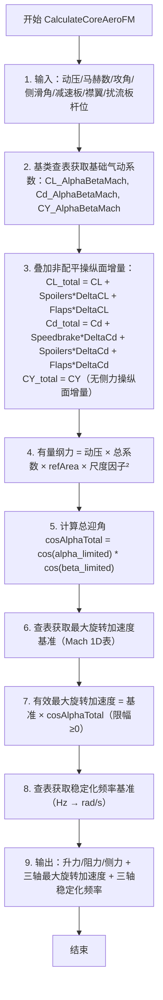

# 算法卡片 -- wsf_six_dof PointMass 气动力与旋转限幅模型

> **状态**：draft
> **日期**：2026-06-11
> **索引证据**：function-index.jsonl (wsf_six_dof::PointMassAeroCoreObject), source/WsfPointMassSixDOF_AeroCoreObject.hpp, source/WsfPointMassSixDOF_AeroCoreObject.cpp
> **关联文档**：flight-dynamics-pointmass-sas-card.md, flight-dynamics-rigidbody-aero-coefficient-card.md

### 基础资料

- **算法名称**：PointMass Aerodynamics Model with Rotation Authority and Stabilizing Frequency（PointMass 气动力与旋转限幅/稳定频率模型）
- **算法所属模块**：wsf_six_dof（点质/刚体六自由度飞行器运动学插件 -- 新模块）
- **算法功能**：PointMass 飞行器专属的气动模型，在标准气动力（升力/阻力/侧力 3D 表）基础上叠加非配平操纵面效果（减速板/襟翼/扰流板的 Delta CL 和 Delta Cd），并输出旋转加速度限幅基准（Max Roll/Pitch/Yaw Acceleration）和稳定化频率基准（Alpha/Beta/Roll Stabilizing Frequency），供 SAS（稳定增稳系统）控制器使用。旋转加速度限幅随总迎角衰减（cos alpha_total），模拟大迎角下操纵效能丧失。

### 算法流程

整个算法流程图如下：



其中，第一步接收来自积分器的飞行状态和操纵面杆位（0-1 归一化值）；第二步从基类 AeroCoreObject 获取 CL/Cd/CY 静态 3D 表项；第三步叠加减速板（仅增阻）、襟翼（增升+增阻）和扰流板（减升+增阻）的 Delta 系数 -- 每个增量 = 杆位乘以 Mach 查表值；第四步用动压、参考面积和尺度因子平方将有量纲系数转换为有量纲力；第五步将攻角和侧滑角限制在 ±90 度后计算总迎角的余弦；第六步通过 Mach 1D 表获取名义最大旋转加速度（单位 deg/s^2）；第七步将名义基准乘以 cosAlphaTotal 得到有效最大加速度（大迎角时操纵效能退化），再转为 rad/s^2；第八步通过 Mach 1D 表查取稳定化频率（单位 Hz），乘以 2*pi 转为 rad/s；第九步返回所有力、限幅和频率参数。

### 算法变量和常量

1. 输入 (input)：

   | 英文标识符 (Symbol)     | 中文名称 (Name) | 数据类型 (Type) | 含义 (Meaning)                | 单位 (Units) | 所属函数 (Method)                |
   | ------------------ | ----------- | ----------- | --------------------------- | ---------- | ---------------------------- |
   | `aDynPress_lbsqft` | 动压          | `double`    | 自由流动压 q_bar = 0.5*rho*V^2   | lb/ft^2    | CalculateCoreAeroFM          |
   | `aMach`            | 马赫数         | `double`    | 飞行马赫数                       | 无量纲        | CalculateCoreAeroFM          |
   | `aAlpha_rad`       | 攻角          | `double`    | 体轴 x 与相对气流方向的夹角             | rad        | CalculateCoreAeroFM          |
   | `aBeta_rad`        | 侧滑角         | `double`    | 体轴 y 与相对气流方向的夹角             | rad        | CalculateCoreAeroFM          |
   | `aSpeedbrakeLever` | 减速板杆位       | `double`    | 减速板伸出比率，0.0=收起/1.0=全开       | 无量纲        | CalculateCoreAeroFM          |
   | `aFlapsLever`      | 襟翼杆位        | `double`    | 襟翼伸出比率，0.0=收起/1.0=全开        | 无量纲        | CalculateCoreAeroFM          |
   | `aSpoilersLever`   | 扰流板杆位       | `double`    | 扰流板打开比率，0.0=收起/1.0=全开       | 无量纲        | CalculateCoreAeroFM          |
   | `aRadiusSizeFactor` | 几何尺度因子      | `double`    | 缩放气动面的线性因子，默认 1.0            | 无量纲        | CalculateCoreAeroFM          |
   | `aInput` (overload) | 输入数据流       | `UtInput&`  | 读取气动数据配置文件（气动系数表+旋转动态参数表）   | —          | ProcessInput                 |

2. 输出 (output)：

   | 英文标识符 (Symbol)                   | 中文名称 (Name)     | 数据类型 (Type) | 含义 (Meaning)                  | 单位 (Units) | 所属函数 (Method)       |
   | -------------------------------- | --------------- | ----------- | ----------------------------- | ---------- | ------------------- |
   | `aLift_lbs`                      | 升力              | `double&`   | 垂直于相对气流方向的力                    | lb         | CalculateCoreAeroFM |
   | `aDrag_lbs`                      | 阻力              | `double&`   | 平行于相对气流方向的力                    | lb         | CalculateCoreAeroFM |
   | `aSideForce_lbs`                 | 侧力              | `double&`   | 垂直于升阻平面的力                     | lb         | CalculateCoreAeroFM |
   | `aMaximumRollAcceleration_rps2`  | 最大滚转加速度         | `double&`   | 滚转通道最大可实现的角加速度（SAS 控制限幅用）     | rad/s^2    | CalculateCoreAeroFM |
   | `aMaximumPitchAcceleration_rps2` | 最大俯仰加速度         | `double&`   | 俯仰通道最大可实现的角加速度（SAS 控制限幅用）     | rad/s^2    | CalculateCoreAeroFM |
   | `aMaximumYawAcceleration_rps2`   | 最大偏航加速度         | `double&`   | 偏航通道最大可实现的角加速度（SAS 控制限幅用）     | rad/s^2    | CalculateCoreAeroFM |
   | `aAlphaStabilizingFrequency_rps` | 攻角稳定化频率         | `double&`   | 俯仰通道自然稳定频率（rad/s），供 SAS 回路设计用  | rad/s      | CalculateCoreAeroFM |
   | `aBetaStabilizingFrequency_rps`  | 侧滑角稳定化频率        | `double&`   | 偏航通道自然稳定频率（rad/s），供 SAS 回路设计用  | rad/s      | CalculateCoreAeroFM |
   | `aRollStabilizingFrequency_rps`  | 滚转稳定化频率         | `double&`   | 滚转通道自然稳定频率（rad/s），供 SAS 回路设计用  | rad/s      | CalculateCoreAeroFM |

3. 常量 (constant)：

   | 英文标识符 (Symbol)                     | 中文名称 (Name)   | 数据类型 (Type)          | 含义 (Meaning)                   | 单位 (Units) | 所属函数 (Method) |
   | ---------------------------------- | ------------- | -------------------- | ------------------------------ | ---------- | ------------- |
   | `mRefArea_sqft`                    | 参考面积          | `double`             | 气动参考面积（基类 AeroCoreObject 定义）   | ft^2       | ProcessInput  |
   | `mCL_AlphaBetaMachTablePtr`        | 升力系数 3D 表     | `Table*`             | CL(alpha, beta, Mach) 3D 表（基类） | 无量纲        | ProcessInput  |
   | `mCd_AlphaBetaMachTablePtr`        | 阻力系数 3D 表     | `Table*`             | Cd(alpha, beta, Mach) 3D 表（基类） | 无量纲        | ProcessInput  |
   | `mCY_AlphaBetaMachTablePtr`        | 侧力系数 3D 表     | `Table*`             | CY(alpha, beta, Mach) 3D 表（基类） | 无量纲        | ProcessInput  |
   | `mFlapsDeltaCL_MachTablePtr`       | 襟翼升力增量 1D 表   | `Table*`             | 襟翼全开时 Delta CL vs Mach（Mach 1D） | 无量纲        | ProcessInput  |
   | `mFlapsDeltaCd_MachTablePtr`       | 襟翼阻力增量 1D 表   | `Table*`             | 襟翼全开时 Delta Cd vs Mach          | 无量纲        | ProcessInput  |
   | `mSpoilersDeltaCL_MachTablePtr`    | 扰流板升力减量 1D 表  | `Table*`             | 扰流板全开时 Delta CL vs Mach         | 无量纲        | ProcessInput  |
   | `mSpoilersDeltaCd_MachTablePtr`    | 扰流板阻力增量 1D 表  | `Table*`             | 扰流板全开时 Delta Cd vs Mach         | 无量纲        | ProcessInput  |
   | `mSpeedbrakeDeltaCd_MachTablePtr`  | 减速板阻力增量 1D 表  | `Table*`             | 减速板全开时 Delta Cd vs Mach         | 无量纲        | ProcessInput  |
   | `mMaximumRollAcceleration_MachTablePtr`  | 最大滚转加速度 1D 表 | `Table*`       | 最大滚转角加速度基准 vs Mach（deg/s^2）     | deg/s^2    | ProcessInput  |
   | `mMaximumPitchAcceleration_MachTablePtr` | 最大俯仰加速度 1D 表 | `Table*`       | 最大俯仰角加速度基准 vs Mach              | deg/s^2    | ProcessInput  |
   | `mMaximumYawAcceleration_MachTablePtr`   | 最大偏航加速度 1D 表 | `Table*`       | 最大偏航角加速度基准 vs Mach              | deg/s^2    | ProcessInput  |
   | `mAlphaStabilizingFrequency_MachTablePtr` | 攻角稳定化频率 1D 表 | `Table*`      | 俯仰通道自然频率 vs Mach（Hz）           | Hz         | ProcessInput  |
   | `mBetaStabilizingFrequency_MachTablePtr`  | 侧滑稳定化频率 1D 表 | `Table*`      | 偏航通道自然频率 vs Mach（Hz）           | Hz         | ProcessInput  |
   | `mRollStabilizingFrequency_MachTablePtr`  | 滚转稳定化频率 1D 表 | `Table*`      | 滚转通道自然频率 vs Mach（Hz）           | Hz         | ProcessInput  |

### 关键数学公式

1. **总升力系数（含高升力装置增量）**：
   升力由静态 3D 表加上襟翼和扰流板的增量组成：
   $$C_{L\_total} = C_L(\alpha, \beta, M) + \delta_{spoilers} \cdot \Delta C_{L\_spoilers}(M) + \delta_{flaps} \cdot \Delta C_{L\_flaps}(M)$$
   其中：
   - $C_L(\alpha, \beta, M)$ 为升力系数静态 3D 表（基类 AeroCoreObject）。
   - $\delta_{spoilers}$ 为扰流板杆位（0 到 1），$\Delta C_{L\_spoilers}(M)$ 为满偏升力减量（负值）。
   - $\delta_{flaps}$ 为襟翼杆位（0 到 1），$\Delta C_{L\_flaps}(M)$ 为满偏升力增量。
   - 减速板不产生升力增量。

2. **总阻力系数（含高阻装置增量）**：
   阻力在静态 3D 表基础上，叠加减速板、扰流板、襟翼的增量：
   $$C_{d\_total} = C_d(\alpha, \beta, M) + \delta_{speedbrake} \cdot \Delta C_{d\_speedbrake}(M) + \delta_{spoilers} \cdot \Delta C_{d\_spoilers}(M) + \delta_{flaps} \cdot \Delta C_{d\_flaps}(M)$$
   其中所有增量均为全偏时的 Mach 函数，按杆位线性缩放。

3. **有量纲力**：
   升力、阻力、侧力均由总系数乘以动压、参考面积和尺度因子平方得出：
   $$L = \bar{q} \cdot S_{ref} \cdot C_{L\_total} \cdot R^2$$
   $$D = \bar{q} \cdot S_{ref} \cdot C_{d\_total} \cdot R^2$$
   $$Y = \bar{q} \cdot S_{ref} \cdot C_Y(\alpha, \beta, M) \cdot R^2$$
   其中 $\bar{q}$ 为动压，$S_{ref}$ 为参考面积（来自基类 mRefArea_sqft），$R$ 为尺度因子。

4. **总迎角余弦 -- 操纵效能衰减因子**：
   将攻角和侧滑角限制在 ±90 度后计算总迎角的余弦，作为旋转加速度的通用衰减系数：
   $$\cos\alpha_{total} = \cos(\min(|\alpha|, \pi/2)) \cdot \cos(\min(|\beta|, \pi/2))$$
   当飞行器接近或超过 90 度俯仰时，俯仰操纵效能消失；接近或超过 90 度偏航时，偏航操纵效能消失；总迎角超过 90 度时滚转操纵效能消失。

5. **有效最大旋转加速度**：
   各通道的名义最大加速度（Mach 函数）乘以总迎角余弦：
   $$\dot{\omega}_{max\_roll} = \max(0, \dot{\omega}_{nom\_roll}(M) \cdot \cos\alpha_{total}) \cdot \frac{\pi}{180}$$
   $$\dot{\omega}_{max\_pitch} = \max(0, \dot{\omega}_{nom\_pitch}(M) \cdot \cos\alpha_{total}) \cdot \frac{\pi}{180}$$
   $$\dot{\omega}_{max\_yaw} = \max(0, \dot{\omega}_{nom\_yaw}(M) \cdot \cos\alpha_{total}) \cdot \frac{\pi}{180}$$
   其中初始查表值单位为 deg/s^2，乘以 cRAD_PER_DEG 转为 rad/s^2。负值被截断为 0。

6. **稳定化频率**：
   从 Mach 1D 表查取自然频率（Hz），转为角频率（rad/s）：
   $$\omega_{\alpha} = 2\pi \cdot f_{\alpha}(M), \quad \omega_{\beta} = 2\pi \cdot f_{\beta}(M), \quad \omega_{roll} = 2\pi \cdot f_{roll}(M)$$
   这些频率供 SAS 二级增稳回路使用，用于确定控制回路的自然带宽。

### 算法伪代码

```
// === PointMass 气动力与旋转限幅模型 ===
// 整体目标：计算有量纲力（升力/阻力/侧力）+ 旋转加速度限幅 + 稳定化频率基准

function CalculateCoreAeroFM(q_bar, Mach, alpha, beta,
                             speedbrake, flaps, spoilers,
                             out lift, out drag, out sideForce,
                             out maxRollAccel, out maxPitchAccel, out maxYawAccel,
                             out alphaStabFreq, out betaStabFreq, out rollStabFreq,
                             radius_factor):
    // 1. 基础气动系数查表（基类 AeroCoreObject 3D 表）
    CL = CL_AlphaBetaMach(Mach, alpha, beta)                // 升力静态项
    Cd = Cd_AlphaBetaMach(Mach, alpha, beta)                // 阻力静态项
    CY = CY_AlphaBetaMach(Mach, alpha, beta)                // 侧力静态项

    // 2. 叠加操纵面增量：每个增量 = 杆位(0-1) × 满偏查表值
    CL = CL + spoilers * SpoilersDeltaCL_Mach(Mach)          // 扰流板减升（负值）
            + flaps * FlapsDeltaCL_Mach(Mach)               // 襟翼增升

    Cd = Cd + speedbrake * SpeedbrakeDeltaCd_Mach(Mach)      // 减速板增阻
            + spoilers * SpoilersDeltaCd_Mach(Mach)         // 扰流板增阻
            + flaps * FlapsDeltaCd_Mach(Mach)               // 襟翼增阻

    // CY 无侧力操纵面增量

    // 3. 有量纲力：动压 × 系数 × 参考面积 × 尺度因子²
    areaFactor = radius_factor * radius_factor               // 面积缩放（半径平方）
    lift      = q_bar * CL * refArea * areaFactor            // 有量纲升力 (lb)
    drag      = q_bar * Cd * refArea * areaFactor            // 有量纲阻力 (lb)
    sideForce = q_bar * CY * refArea * areaFactor            // 有量纲侧力 (lb)

    // 4. 总迎角计算：攻角和侧滑角限制在 ±90 度
    alphaLimited_rad = Limit(alpha, -PI_OVER_2, PI_OVER_2)   // 攻角限幅 ±90 度
    betaLimited_rad  = Limit(beta,  -PI_OVER_2, PI_OVER_2)   // 侧滑角限幅 ±90 度
    cosAlphaTotal    = cos(alphaLimited_rad) * cos(betaLimited_rad) // 总迎角余弦

    // 5. 查表获取名义最大旋转加速度（单位 deg/s^2）
    nomRollAccel_dps2  = MaximumRollAcceleration_Mach(Mach)     // 滚转基准
    nomPitchAccel_dps2 = MaximumPitchAcceleration_Mach(Mach)    // 俯仰基准
    nomYawAccel_dps2   = MaximumYawAcceleration_Mach(Mach)      // 偏航基准

    // 6. 有效最大加速度 = 名义 × cosAlphaTotal → 转 rad/s^2
    maxRollAccel_rps2  = nomRollAccel_dps2  * cosAlphaTotal * RAD_PER_DEG
    maxPitchAccel_rps2 = nomPitchAccel_dps2 * cosAlphaTotal * RAD_PER_DEG
    maxYawAccel_rps2   = nomYawAccel_dps2   * cosAlphaTotal * RAD_PER_DEG

    // 7. 负值截断（安全保护）
    if maxRollAccel_rps2  < 0 then maxRollAccel_rps2  = 0          // 负值视为无操纵能力
    if maxPitchAccel_rps2 < 0 then maxPitchAccel_rps2 = 0
    if maxYawAccel_rps2   < 0 then maxYawAccel_rps2   = 0

    // 8. 查表获取稳定化频率基准（Hz），转换为 rad/s
    alphaStabFreq = AlphaStabilizingFrequency_Mach(Mach) * TWO_PI  // 攻角稳定频率 (rad/s)
    betaStabFreq  = BetaStabilizingFrequency_Mach(Mach)  * TWO_PI  // 侧滑稳定频率 (rad/s)
    rollStabFreq  = RollStabilizingFrequency_Mach(Mach)  * TWO_PI  // 滚转稳定频率 (rad/s)

    return
```

### 源码使用说明

#### 入口和调用链

```
// 从 PointMass 积分器 → 飞行器气动接口 → PointMass 气动模型求值
PointMassIntegrator::CalculateFM()                                  // 力/力矩汇总 — 积分器每帧调用
  → 飞行状态更新（α/β/Mach/q_bar）
  → PointMassAeroCoreObject::CalculateCoreAeroFM(                   // 气动模型主入口
      q_bar, Mach, α, β, speedbrake, flaps, spoilers,
      lift, drag, side,
      maxRollAccel, maxPitchAccel, maxYawAccel,
      alphaStabFreq, betaStabFreq, rollStabFreq, ...)
    → AeroCoreObject::CL_AlphaBetaMach(Mach, α, β)        // 基类 升力 3D 表
    → AeroCoreObject::Cd_AlphaBetaMach(Mach, α, β)        // 基类 阻力 3D 表
    → AeroCoreObject::CY_AlphaBetaMach(Mach, α, β)        // 基类 侧力 3D 表
    → PointMassAeroCoreObject::SpeedbrakeDeltaCd_Mach(Mach)     // 减速板增阻 1D 表
    → PointMassAeroCoreObject::FlapsDeltaCL_Mach(Mach)          // 襟翼增升 1D 表
    → PointMassAeroCoreObject::FlapsDeltaCd_Mach(Mach)          // 襟翼增阻 1D 表
    → PointMassAeroCoreObject::SpoilersDeltaCL_Mach(Mach)       // 扰流板减升 1D 表
    → PointMassAeroCoreObject::SpoilersDeltaCd_Mach(Mach)       // 扰流板增阻 1D 表
    → PointMassAeroCoreObject::MaximumRollAcceleration_Mach(Mach)     // 最大滚转加速度 1D 表
    → PointMassAeroCoreObject::MaximumPitchAcceleration_Mach(Mach)    // 最大俯仰加速度 1D 表
    → PointMassAeroCoreObject::MaximumYawAcceleration_Mach(Mach)      // 最大偏航加速度 1D 表
    → PointMassAeroCoreObject::AlphaStabilizingFrequency_Mach(Mach)   // 攻角稳定化频率 1D 表
    → PointMassAeroCoreObject::BetaStabilizingFrequency_Mach(Mach)    // 侧滑稳定化频率 1D 表
    → PointMassAeroCoreObject::RollStabilizingFrequency_Mach(Mach)    // 滚转稳定化频率 1D 表
    → cosAlphaTotal 衰减计算 → 负值截断 → 频率 Hz→rad/s 转换

// 初始化阶段：从配置文件读取气动数据
PointMassAeroCoreObject::ProcessInput(aInput)                   // 解析 aero_data 配置块
  → ProcessCommonInput(aInput, command, this)                   // 静态方法
    → 读取 ref_area_sqft                                        // 参考面积
    → 读取 cL_alpha_beta_mach_table                             // 升力 3D 表
    → 读取 cd_alpha_beta_mach_table                             // 阻力 3D 表
    → 读取 cy_alpha_beta_mach_table                             // 侧力 3D 表
    → 读取 speedbrake_dcd_mach_table                            // 减速板增量表
    → 读取 flaps_dcl_mach_table / flaps_dcd_mach_table          // 襟翼增量表
    → 读取 spoilers_dcl_mach_table / spoilers_dcd_mach_table   // 扰流板增量表
    → 读取 maximum_roll/pitch/yaw_acceleration_mach_table       // 旋转加速度表
    → 读取 alpha/beta/roll_stabilizing_frequency_mach_table    // 稳定化频率表
```

#### 源码位置

| File | Symbol | Lines | Evidence level | 中文说明 |
| ---- | ------ | ----- | -------------- | -------- |
| [WsfPointMassSixDOF_AeroCoreObject.hpp](source_root/src/wsf_plugins/wsf_six_dof/source/WsfPointMassSixDOF_AeroCoreObject.hpp) | `PointMassAeroCoreObject` (class) | 27-121 | source-cited | PointMass 气动核心对象 -- 5 个操纵面增量表 + 3 个旋转加速度表 + 3 个频率表 |
| [WsfPointMassSixDOF_AeroCoreObject.hpp](source_root/src/wsf_plugins/wsf_six_dof/source/WsfPointMassSixDOF_AeroCoreObject.hpp) | `CalculateCoreAeroFM()` | 45-61 | source-cited | 气动力计算 + 旋转动力学参数输出 -- 16 个参数 |
| [WsfPointMassSixDOF_AeroCoreObject.hpp](source_root/src/wsf_plugins/wsf_six_dof/source/WsfPointMassSixDOF_AeroCoreObject.hpp) | `ProcessInput()` | 38 | source-cited | 配置输入接口 |
| [WsfPointMassSixDOF_AeroCoreObject.cpp](source_root/src/wsf_plugins/wsf_six_dof/source/WsfPointMassSixDOF_AeroCoreObject.cpp) | `ProcessInput()` | 27-72 | source-cited | 解析 aero_data 和 aero_mode 配置块 |
| [WsfPointMassSixDOF_AeroCoreObject.cpp](source_root/src/wsf_plugins/wsf_six_dof/source/WsfPointMassSixDOF_AeroCoreObject.cpp) | `ProcessCommonInput()` | 74-274 | source-cited | 解析 14 种气动数据命令 |
| [WsfPointMassSixDOF_AeroCoreObject.cpp](source_root/src/wsf_plugins/wsf_six_dof/source/WsfPointMassSixDOF_AeroCoreObject.cpp) | `CalculateCoreAeroFM()` | 428-497 | source-cited | 主计算函数 -- 70 行含操纵面叠加+cosAlphaTotal 衰减+频率转换 |
| [WsfPointMassSixDOF_AeroCoreObject.cpp](source_root/src/wsf_plugins/wsf_six_dof/source/WsfPointMassSixDOF_AeroCoreObject.cpp) | 各查表函数（11 个） | 296-426 | source-cited | 每个函数的实现：空表返回 0 + UtTable::Lookup 1D 查表 |

#### 框架依赖

| AFSIM 原始依赖 | 依赖类型 | 替换方案 |
| ------------ | ---- | ---- |
| `UtTable::Table` | 高维查表引擎 | 自定义多维插值引擎（支持 2D/3D 线性插值） |
| `UtInput` / `UtInputBlock` | 配置文件解析 | 自定义 JSON/YAML/TOML 解析器 |
| `UtVec3dX` | 三维矢量 | Eigen::Vector3d |
| `UtCloneablePtr` | 智能指针（深拷贝） | std::unique_ptr/std::shared_ptr |
| `UtMath::cPI_OVER_2 / cPI / cRAD_PER_DEG / cTWO_PI` | 数学常数 | 直接硬编码 |
| `AeroCoreObject` (基类) | 类继承 | 作为整体移植或扁平化为单一类 |

#### 测试和验证计划

1. **空操纵面零增量测试**：所有杆位为 0（speedbrake=flaps=spoilers=0），验证 CL/Cd/CY 仅由静态 3D 表决定。
2. **全偏操纵面测试**：各杆位为 1.0，对比气动系数变化 -- 减速板仅增阻，襟翼增升增阻，扰流板减升增阻。
3. **零迎角操纵效能测试**：alpha=0, beta=0，cosAlphaTotal=1，验证 maxAccel 等于 Mach 表查值（不衰减）。
4. **90 度迎角操纵失效测试**：alpha=90deg，cosAlphaTotal=0，验证所有 maxAccel 输出为 0。
5. **尺度因子测试**：radiusFactor=2.0，验证力变为原来的 4 倍（面积随半径平方缩放）。
6. **频率 Hz → rad/s 转换测试**：对给定频率值（如 f=1Hz），验证输出为 2*pi*1 = 6.283 rad/s。
7. **空表保护测试**：不加载任何表，验证所有输出均为 0（空表返回 0 + 负值截断）。

### 内部状态

`PointMassAeroCoreObject` 是持有气动参数配置的持久化对象。核心计算 `CalculateCoreAeroFM()` 是纯函数（无成员变量写入），所有状态来自初始化阶段的查表指针和来自基类 `AeroCoreObject` 的参考面积。

| 变量名 | 类型 | 初始值 | 物理含义 | 更新时机 |
|--------|------|--------|----------|----------|
| `mRefArea_sqft`（基类） | `double` | `0.0` | 气动参考面积（ft^2） | 初始化阶段由 `ref_area_sqft` 配置命令写入 |
| `mCL_AlphaBetaMachTablePtr`（基类） | `UtTable::Table*` | `nullptr` | 升力系数静态 3D 表 `CL(alpha, beta, Mach)` | 初始化阶段由 `cL_alpha_beta_mach_table` 命令加载 |
| `mCd_AlphaBetaMachTablePtr`（基类） | `UtTable::Table*` | `nullptr` | 阻力系数静态 3D 表 `Cd(alpha, beta, Mach)` | 初始化阶段由 `cd_alpha_beta_mach_table` 命令加载 |
| `mCY_AlphaBetaMachTablePtr`（基类） | `UtTable::Table*` | `nullptr` | 侧力系数静态 3D 表 `CY(alpha, beta, Mach)` | 初始化阶段由 `cy_alpha_beta_mach_table` 命令加载 |
| `mFlapsDeltaCL_MachTablePtr` | `UtTable::Table*` | `nullptr` | 襟翼全开时 Delta CL vs Mach 1D 表（升力增量） | 初始化阶段由 `flaps_dcl_mach_table` 命令加载 |
| `mFlapsDeltaCd_MachTablePtr` | `UtTable::Table*` | `nullptr` | 襟翼全开时 Delta Cd vs Mach 1D 表（阻力增量） | 初始化阶段由 `flaps_dcd_mach_table` 命令加载 |
| `mSpoilersDeltaCL_MachTablePtr` | `UtTable::Table*` | `nullptr` | 扰流板全开时 Delta CL vs Mach 1D 表（升力减量，负值） | 初始化阶段由 `spoilers_dcl_mach_table` 命令加载 |
| `mSpoilersDeltaCd_MachTablePtr` | `UtTable::Table*` | `nullptr` | 扰流板全开时 Delta Cd vs Mach 1D 表（阻力增量） | 初始化阶段由 `spoilers_dcd_mach_table` 命令加载 |
| `mSpeedbrakeDeltaCd_MachTablePtr` | `UtTable::Table*` | `nullptr` | 减速板全开时 Delta Cd vs Mach 1D 表（阻力增量） | 初始化阶段由 `speedbrake_dcd_mach_table` 命令加载 |
| `mMaximumRollAcceleration_MachTablePtr` | `UtTable::Table*` | `nullptr` | 最大滚转角加速度基准 vs Mach 1D 表（deg/s^2） | 初始化阶段由 `maximum_roll_acceleration_mach_table` 命令加载 |
| `mMaximumPitchAcceleration_MachTablePtr` | `UtTable::Table*` | `nullptr` | 最大俯仰角加速度基准 vs Mach 1D 表（deg/s^2） | 初始化阶段由 `maximum_pitch_acceleration_mach_table` 命令加载 |
| `mMaximumYawAcceleration_MachTablePtr` | `UtTable::Table*` | `nullptr` | 最大偏航角加速度基准 vs Mach 1D 表（deg/s^2） | 初始化阶段由 `maximum_yaw_acceleration_mach_table` 命令加载 |
| `mAlphaStabilizingFrequency_MachTablePtr` | `UtTable::Table*` | `nullptr` | 攻角稳定化频率 vs Mach 1D 表（Hz） | 初始化阶段由 `alpha_stabilizing_frequency_mach_table` 命令加载 |
| `mBetaStabilizingFrequency_MachTablePtr` | `UtTable::Table*` | `nullptr` | 侧滑角稳定化频率 vs Mach 1D 表（Hz） | 初始化阶段由 `beta_stabilizing_frequency_mach_table` 命令加载 |
| `mRollStabilizingFrequency_MachTablePtr` | `UtTable::Table*` | `nullptr` | 滚转稳定化频率 vs Mach 1D 表（Hz） | 初始化阶段由 `roll_stabilizing_frequency_mach_table` 命令加载 |
| `mModeName`（基类） | `std::string` | `"DEFAULT"` | 当前气动模态名称（用于多构型切换） | 由 `SetModeName()` 在模态切换时更新 |
| `mSubModesList` | `list<CloneablePtr>` | 空 list | 子模态列表（多构型气动参数集，如挂弹/空载） | 初始化阶段由 `aero_mode` 子块创建 |

**注意**：`CalculateCoreAeroFM()` 内部的所有变量（`CL`/`Cd`/`CY`/`cosAlphaTotal` 等）均为局部临时变量，不在帧间保留。所有查表函数（11 个 `XXX_Mach()` / `XXX_AlphaBetaMach()`）均为无副作用的纯查表函数。

### 变量映射表

| 代码变量 | 数学符号 | 含义 |
|----------|----------|------|
| `aDynPress_lbsqft` | $\bar{q}$ | 自由流动压 `0.5 * rho * V^2`（lb/ft^2） |
| `aMach` | $M$ | 飞行马赫数（无量纲） |
| `aAlpha_rad` | $\alpha$ | 攻角（rad） |
| `aBeta_rad` | $\beta$ | 侧滑角（rad） |
| `aSpeedbrakeLever` | $\delta_{speedbrake}$ | 减速板杆位（0-1 归一化） |
| `aFlapsLever` | $\delta_{flaps}$ | 襟翼杆位（0-1 归一化） |
| `aSpoilersLever` | $\delta_{spoilers}$ | 扰流板杆位（0-1 归一化） |
| `aRadiusSizeFactor` | $R$ | 几何尺度因子（线性尺寸缩放比，默认 1.0） |
| `mRefArea_sqft` | $S_{ref}$ | 参考面积（ft^2） |
| `CL_AlphaBetaMach(...)` | $C_L(\alpha,\beta,M)$ | 升力系数静态 3D 表项 |
| `Cd_AlphaBetaMach(...)` | $C_d(\alpha,\beta,M)$ | 阻力系数静态 3D 表项 |
| `CY_AlphaBetaMach(...)` | $C_Y(\alpha,\beta,M)$ | 侧力系数静态 3D 表项 |
| `SpoilersDeltaCL_Mach(M)` | $\Delta C_{L,spoilers}(M)$ | 扰流板满偏升力减量 |
| `FlapsDeltaCL_Mach(M)` | $\Delta C_{L,flaps}(M)$ | 襟翼满偏升力增量 |
| `SpeedbrakeDeltaCd_Mach(M)` | $\Delta C_{d,speedbrake}(M)$ | 减速板满偏阻力增量 |
| `SpoilersDeltaCd_Mach(M)` | $\Delta C_{d,spoilers}(M)$ | 扰流板满偏阻力增量 |
| `FlapsDeltaCd_Mach(M)` | $\Delta C_{d,flaps}(M)$ | 襟翼满偏阻力增量 |
| `CL`（局部） | $C_{L,total}$ | 总升力系数（静态 + 操纵面增量） |
| `Cd`（局部） | $C_{d,total}$ | 总阻力系数（静态 + 操纵面增量） |
| `CY`（局部） | $C_{Y,total}$ | 总侧力系数（仅静态项，无侧力操纵面增量） |
| `areaMultiplier` | $R^2$ | 面积缩放因子 = `radiusFactor^2`（半径平方） |
| `aLift_lbs` | $L$ | 有量纲升力（lb） |
| `aDrag_lbs` | $D$ | 有量纲阻力（lb） |
| `aSideForce_lbs` | $Y$ | 有量纲侧力（lb） |
| `alphaLimited_rad` | $\alpha_{limited}$ | 限幅在 ±90 度的攻角（rad） |
| `betaLimited_rad` | $\beta_{limited}$ | 限幅在 ±90 度的侧滑角（rad） |
| `cosAlphaTotal` | $\cos\alpha_{total}$ | 总迎角余弦 = `cos(alpha_limited)*cos(beta_limited)` |
| `MaximumRollAcceleration_Mach(M)` | $\dot{\omega}_{nom,roll}(M)$ | 名义最大滚转角加速度基准（deg/s^2） |
| `MaximumPitchAcceleration_Mach(M)` | $\dot{\omega}_{nom,pitch}(M)$ | 名义最大俯仰角加速度基准（deg/s^2） |
| `MaximumYawAcceleration_Mach(M)` | $\dot{\omega}_{nom,yaw}(M)$ | 名义最大偏航角加速度基准（deg/s^2） |
| `aMaximumRollAcceleration_rps2` | $\dot{\omega}_{max,roll}$ | 有效最大滚转角加速度（rad/s^2） |
| `aMaximumPitchAcceleration_rps2` | $\dot{\omega}_{max,pitch}$ | 有效最大俯仰角加速度（rad/s^2） |
| `aMaximumYawAcceleration_rps2` | $\dot{\omega}_{max,yaw}$ | 有效最大偏航角加速度（rad/s^2） |
| `AlphaStabilizingFrequency_Mach(M)` | $f_{\alpha}(M)$ | 攻角稳定化频率基准（Hz） |
| `BetaStabilizingFrequency_Mach(M)` | $f_{\beta}(M)$ | 侧滑角稳定化频率基准（Hz） |
| `RollStabilizingFrequency_Mach(M)` | $f_{roll}(M)$ | 滚转稳定化频率基准（Hz） |
| `aAlphaStabilizingFrequency_rps` | $\omega_{\alpha}$ | 攻角稳定化角频率 `2*pi*f_alpha`（rad/s） |
| `aBetaStabilizingFrequency_rps` | $\omega_{\beta}$ | 侧滑角稳定化角频率 `2*pi*f_beta`（rad/s） |
| `aRollStabilizingFrequency_rps` | $\omega_{roll}$ | 滚转稳定化角频率 `2*pi*f_roll`（rad/s） |

### 边界条件

1. **空表保护（nullptr 检查）**：所有 11 个查表函数（`SpeedbrakeDeltaCd_Mach()`、`FlapsDeltaCL_Mach()` 等）在查表前检查表指针是否为 `nullptr`，若为空则返回 `0.0`。这意味着未配置的气动参数默认为零，不会崩溃。

2. **攻角/侧滑角限幅（±90 度）**：在计算 `cosAlphaTotal` 之前，`alpha_rad` 和 `beta_rad` 被 `UtMath::Limit()` 限制在 `±PI_OVER_2`（±90 度）范围内。防止 `cos()` 在超出定义域时产生异常值。物理含义：超过 90 度的攻角不再有意义（飞机已失速/倒飞）。

3. **操纵效能 cosAlphaTotal 衰减**：名义最大旋转加速度（deg/s^2 查表值）乘以 `cosAlphaTotal`：
   - 攻角 = 90 度 -> `cos(alpha_limited) = 0` -> 俯仰操纵效能归零
   - 侧滑角 = 90 度 -> `cos(beta_limited) = 0` -> 偏航操纵效能归零
   - 总迎角 > 90 度 -> 滚转操纵效能也归零
   此衰减模拟大迎角/大侧滑角下的操纵面失效。

4. **最大旋转加速度负值截断**：`cosAlphaTotal * nomAccel` 的结果可能为负（当查表基准为负时），通过 `if (value < 0.0) value = 0.0` 截断。负的旋转加速度基准被视为无效数据，输出 0 表示该通道无操纵能力。

5. **操纵面杆位范围**：`aSpeedbrakeLever` / `aFlapsLever` / `aSpoilersLever` 预期在 0.0-1.0 范围内，但代码中没有对杆位做 `clamp(0,1)`。若调用者传入越界值（如 2.0），操纵面增量会被线性放大（可能产生非物理的力系数）。

6. **尺度因子**：`aRadiusSizeFactor` 默认值 1.0。力按半径的平方 `R^2` 缩放——这是针对降落伞、气球等非翼面气动体的几何缩放。注意：若 `R=0`，所有有量纲力归零。

7. **除零保护**：`CalculateCoreAeroFM()` 中无除法，不存在除零风险。

8. **NaN/Inf 保护**：代码中无显式 `isnan()`/`isinf()` 检查。若查表引擎返回 NaN（如插值异常），会直接传播到输出力/加速度。

9. **二维/三维表参数域限制**：初始化时通过 `UtTable::ValueGE(0.0)` / `UtTable::ValueGE_LE(-PI_OVER_2, PI_OVER_2)` 设置参数域的合法范围。查表引擎在超出域时使用外推或边界值（取决于表引擎实现），不会抛出异常。

### 提取策略

- **源文件**：
  - `WsfPointMassSixDOF_AeroCoreObject.hpp`（类声明，121 行）-- 全部 14 张表的指针成员 + 11 个查表函数 + `CalculateCoreAeroFM()` 声明
  - `WsfPointMassSixDOF_AeroCoreObject.cpp`（全量实现，532 行）-- `CalculateCoreAeroFM()`（行 428-497，70 行）+ 11 个查表函数（行 296-426）+ 配置解析 `ProcessInput()` + `ProcessCommonInput()`（行 27-274）
  - `WsfSixDOF_AeroCoreObject.hpp`（基类声明，83 行）-- 参考面积 `mRefArea_sqft` + 3 张静态 3D 表 `CL/Cd/CY` 成员变量

- **提取方法**：核心计算集中在 `CalculateCoreAeroFM()` 一个函数（约 70 行），分三段：
  1. 气动系数叠加（操纵面增量）：行 446-450
  2. 有量纲力：行 454-458
  3. cosAlphaTotal 衰减 + 旋转限幅/频率：行 460-496
  11 个查表函数的模板相同（空表返回 0 + 1D 查表），各约 10 行。

- **函数识别**：从 `function-index.jsonl` 中以 `wsf_plugins::sixdof_aero_core_class` 定位 `PointMassAeroCoreObject`。所有查表函数均为 `io` 角色（读取表数据），`CalculateCoreAeroFM()` 为 `math` 标记（气动系数计算）。

- **还原方式**：`CalculateCoreAeroFM()` 仅含基本算术（加减乘除 + cos + 限幅），可直接用任何语言重写。还原时关键处理：
  1. 静态 CL/Cd/CY 3D 表（alpha, beta, Mach）替换为自定义 3D 线性插值
  2. 5 张操纵面增量 1D 表（Mach）替换为自定义 1D 线性插值
  3. 3 张旋转加速度 1D 表（Mach，单位 deg/s^2）同 1D 插值
  4. 3 张稳定化频率 1D 表（Mach，单位 Hz）同 1D 插值
  5. `cosAlphaTotal = cos(clamp(alpha, ±90deg)) * cos(clamp(beta, ±90deg))` 操作直接用 `std::cos` + `std::clamp`
  6. deg/s^2 -> rad/s^2 转换乘以 `PI/180`
  7. Hz -> rad/s 转换乘以 `2*PI`
  8. 面积缩放因子 `R^2` 需保留
  9. `refArea` 可在初始化时设置或通过用户配置传入

- **已知从属**：PointMass 气动模型是 SAS 的输入源（提供旋转限幅基准和稳定化频率基准），也是积分器 `CalculateAcceleration()` 的气动力来源。查表引擎 `UtTable::Table` 可替换为自定义插值库（如支持 1D/3D 线性插值）。

#### 可移植性评分

**可移植性**：高

**原因**：

1. 核心计算逻辑（`CalculateCoreAeroFM`）仅约 70 行，完全基于基本数学运算（加减乘除 + 三角函数），不包含任何平台特定代码。
2. 总迎角余弦衰减律是标准的飞行力学近似方法，物理意义明确，文献充分。
3. 操纵面线性叠加（杆位 * 满偏增量）是极其简单的插值模型，可直接用查表实现。
4. 频率 Hz → rad/s（* 2pi）和角度 deg/s^2 → rad/s^2（* pi/180）的转换均为标准数学运算。
5. 与 RigidBody 气动模型相比，PointMass 模型更简单 -- 无需简化频率计算、无需三轴角速率输入、无需力矩计算。
6. 查表引擎 `UtTable::Table` 为 AFSIM 框架类，移植时需替换为自定义插值库。
7. 单位体系为 Imperial（lb, ft），移植时建议统一为 SI。
8. 所有操纵面和旋转动态参数表均为飞行器特有数据，移植后需用户自行提供。
