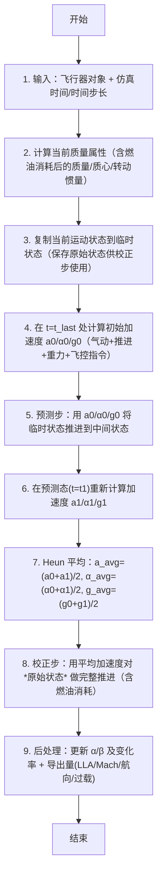

# 算法卡片 -- PointMass 六自由度 Heun 积分器

> **状态**：draft
> **日期**：2026-06-11
> **索引证据**：function-index.jsonl (wsf_plugins::sixdof_integrator_class), source/WsfPointMassSixDOF_Integrator.cpp, source/WsfPointMassSixDOF_Integrator.hpp
> **关联文档**：flight-dynamics-pointmass-sas-card.md, flight-dynamics-rigid-body-integrator-card.md, flight-dynamics-p6dof-heun-integrator-card.md

### 基础资料

- **算法名称**：PointMass Six-DOF Heun Integrator（点质六自由度 Heun 预测-校正积分器）
- **算法所属模块**：wsf_six_dof（点质/刚体六自由度飞行器运动学插件 -- 新模块）
- **算法功能**：对"点质量"（PointMass）飞行器模型进行六自由度时间推进。采用 Heun 预测-校正法（二阶 Runge-Kutta）将平动和转动运动在同一框架内积分。平动推进计算位置和速度（含 1000G 加速度限幅），转动推进计算姿态和角速率（使用半隐式欧拉法）。质量属性（含燃油消耗）在每个积分步内更新。

### 算法流程



其中，第一步至第三步完成质量更新和状态拷贝流程；第四步调用飞行器模型计算气动力、推进力和重力，并委托飞控系统计算旋转加速度（详见关联的 SAS 卡片）；第五步用半隐式欧拉法推进临时状态并施加 1000G 平动加速度限幅；第六步在推进后的预测态重新计算所有加速度；第七步取两个端点的算术平均（Heun 方法的核心，实现二阶精度）；第八步取回原始状态用平均加速度做完整校正推进（含燃油消耗）；第九步更新导出量（攻角/侧滑角及其变化率、LLA、马赫数、动压、航向、体轴过载）。

### 算法变量和常量

1. 输入 (input)：

   | 英文标识符 (Symbol) | 中文名称 (Name) | 数据类型 (Type) | 含义 (Meaning) | 单位 (Units) | 所属函数 (Method) |
   | ---- | ---- | ---- | --- | ---- | --- |
   | `aSimTime_nanosec` | 当前仿真时间 | `int64_t` | 当前仿真帧的时间戳 | ns | Update |
   | `aDeltaT_sec` | 帧时间步长 | `double` | 积分步长（仿真帧率的倒数） | s | Update |
   | `mVehicle` | 飞行器对象指针 | `PointMassMover*` | 包含运动状态/质量/气动/推进/飞控的完整飞行器模型 | — | Update |
   | `g_current` | 当前重力加速度 | `UtVec3dX` | 重力加速度矢量（体轴系） | g | PropagateUsingFM |
   | `a_current` | 当前平动加速度 | `UtVec3dX` | 平动加速度矢量（体轴系） | m/s^2 | PropagateUsingFM |
   | `alpha_current` | 当前旋转加速度 | `UtVec3dX` | 旋转角加速度矢量（体轴系） | rad/s^2 | PropagateUsingFM |

2. 输出 (output)：

   | 英文标识符 (Symbol) | 中文名称 (Name) | 数据类型 (Type) | 含义 (Meaning) | 单位 (Units) | 所属函数 (Method) |
   | ---- | ---- | ---- | --- | ---- | --- |
   | `kinematicState` (mutated) | 更新后的运动状态 | `KinematicState&` | 位置/速度/姿态DCM/角速率/攻角/侧滑角/马赫数/动压/过载 | SI/Imperial 混合 | Update |
   | `g_avg` | 平均重力加速度 | `UtVec3dX` | Heun 平均后的重力加速度，用于校正步 | g | Update |
   | `a_avg` | 平均平动加速度 | `UtVec3dX` | Heun 平均后的平动加速度，用于校正步 | m/s^2 | Update |
   | `alpha_avg` | 平均旋转加速度 | `UtVec3dX` | Heun 平均后的旋转角加速度，用于校正步 | rad/s^2 | Update |

3. 常量 (constant)：

   | 英文标识符 (Symbol) | 中文名称 (Name) | 数据类型 (Type) | 含义 (Meaning) | 单位 (Units) | 所属函数 (Method) |
   | ---- | ---- | ---- | --- | ---- | --- |
   | `cMaxG` | 最大过载限制 | `double (1000.0)` | 平动加速度硬限幅：防止碰撞尖峰 | 无量纲 (g) | PropagateUsingFM |
   | `cREFERENCE_GRAV_ACCEL_MPS2` | 标准重力加速度 | `double (9.80665)` | 将英制 lbf 转换为公制 m/s^2 加速度的转换因子 | m/s^2 | UpdateUsingFM |

### 关键数学公式

1. **Heun 预测-校正法（二阶 Runge-Kutta）**：

   给定当前状态 $\mathbf{s}_n = (\mathbf{r}_n, \mathbf{v}_n, \mathbf{q}_n, \boldsymbol{\omega}_n)$ 和时间步长 $\Delta t$，Heun 方法分为两步：

   **预测步（前向欧拉）**：
   $\mathbf{s}_{n+1}^{(p)} = \mathbf{s}_n + \Delta t \cdot \mathbf{f}(\mathbf{s}_n, t_n)$

   **校正步（梯形法则）**：
   $\mathbf{s}_{n+1} = \mathbf{s}_n + \frac{\Delta t}{2} \cdot \left[\mathbf{f}(\mathbf{s}_n, t_n) + \mathbf{f}(\mathbf{s}_{n+1}^{(p)}, t_{n+1})\right]$

   其中 $\mathbf{f}$ 为状态导数函数（平动加速度 + 旋转加速度 + 重力加速度）。

2. **平动推进（PropagateTranslation）**：

   **速度更新**：
   $\mathbf{v}_{n+1} = \mathbf{v}_n + \mathbf{a}_{avg} \cdot \Delta t$

   **位置更新**：
   $\mathbf{r}_{n+1} = \mathbf{r}_n + \mathbf{v}_{n+1} \cdot \Delta t$

   其中 $\mathbf{a}_{avg}$ 为 Heun 平均后的体轴平动加速度（已转换为惯性系）。

3. **转动推进 -- 半隐式欧拉法（PropagateRotation）**：

   **角速率更新**：
   $\boldsymbol{\omega}_{n+1} = \boldsymbol{\omega}_n + \boldsymbol{\alpha}_{avg} \cdot \Delta t$

   **姿态更新（四元数）**：
   $\mathbf{q}_{n+1} = \mathbf{q}_n + \frac{\Delta t}{2} \cdot \boldsymbol{\Omega}(\boldsymbol{\omega}_{n+1}) \cdot \mathbf{q}_n$

   其中 $\boldsymbol{\Omega}(\boldsymbol{\omega})$ 为角速率四元数矩阵，使用更新后的角速率（半隐式）。

4. **平动加速度限幅**：
   $|\mathbf{a}_{translational}| \leq 1000 \cdot g_0$

   防止碰撞/爆炸产生尖峰加速度，$g_0 = 9.80665$ m/s^2 为标准重力加速度。

5. **质量属性更新**：
   每积分步开始时调用飞行器模型的 `CalculateCurrentMassProperties()`，计算当前燃油消耗后的质量 $m$、质心位置 $\mathbf{r}_{cm}$ 和转动惯量张量 $\mathbf{I}$。

6. **体轴过载计算**（后处理）：
   $N_{i,g} = \frac{a_{translational,i}}{g_0} - g_{body,i}$，其中 $i = x, y, z$（前、右、下）。

### 算法伪代码

```
// === PointMass 积分器主循环 — Heun 修正欧拉法 ===
// 整体目标：每帧用二阶预测-校正法推进飞行器平动/转动。

function Update(aSimTime_nanosec, aDeltaT_sec):
    if mVehicle == null: return                              // 空指针保护

    // 1. 质量属性更新
    mVehicle.CalculateCurrentMassProperties()
    initialState = copy(*mVehicle.GetKinematicState())       // 保存原始状态
    tempState = copy(initialState)                           // 临时状态用于预测步

    // 2. Heun Step 1: 在 t=t_last 处计算加速度
    g0, a0, alpha0 = CalculateAcceleration(tempState, t_last, aDeltaT_sec)

    // 3. Heun Step 2: 预测步 — 用当前加速度推进到中间状态
    PropagateUsingFM(tempState, aDeltaT_sec, g0, a0, alpha0)

    // 4. Heun Step 3: 在预测态(t=t1)重新计算加速度
    g1, a1, alpha1 = CalculateAcceleration(tempState, aSimTime_nanosec, aDeltaT_sec)

    // 5. Heun 平均 — 二阶精度
    g_avg = (g0 + g1) * 0.5                                  // 平均重力加速度 (g)
    a_avg = (a0 + a1) * 0.5                                  // 平均平动加速度 (m/s^2)
    alpha_avg = (alpha0 + alpha1) * 0.5                       // 平均旋转加速度 (rad/s^2)

    // 6. 从预测态拷贝诊断值
    kinematicState = mVehicle.GetKinematicState()
    kinematicState.SetLiftDragSideForceThrustWeight(tempState)

    // 7. Heun Step 4: 校正步 — 用平均加速度对*原始状态*推进
    UpdateUsingFM(kinematicState, aSimTime_nanosec,
                  aDeltaT_sec, g_avg, a_avg, alpha_avg)
        // 内部：UpdateFuelBurn() + PropagateUsingFM()

    // 8. 后处理
    if freezeFlags.testingNoAlpha:
        kinematicState.RemoveAlphaForTesting()
    kinematicState.UpdateAeroState(aSimTime_nanosec)         // 更新 α, β, α̇, β̇
    kinematicState.CalculateSecondaryParameters()            // LLA, Mach, 动压, 航向, 过载


// === 用已知加速度推进临时状态 ===
function PropagateUsingFM(aState, dt, g, a, alpha):
    // 1000G 平动加速度限幅
    a_mps2 = a * cREFERENCE_GRAV_ACCEL_MPS2                 // 转换为 m/s^2
    if |a_mps2| > cMaxG * 9.80665:
        a = a * (cMaxG * 9.80665 / |a_mps2|)

    // 设定体轴过载供诊断
    aState.SetBodyOverload(a, g)

    // 平动推进
    PropagateTranslation(aState, dt, a, g)

    // 转动推进（半隐式欧拉）
    PropagateRotation(aState, dt, alpha)


// === 校正步：先消耗燃油，再推进 ===
function UpdateUsingFM(kinematicState, simTime_ns, dt, g, a, alpha):
    mVehicle.UpdateFuelBurn()                                 // 消耗本帧燃油
    PropagateUsingFM(kinematicState, dt, g, a, alpha)
```

### 源码使用说明

#### 入口和调用链

```
// 每帧从 WsfPointMassSixDOF_Mover 调用积分器进行状态推进
WsfSimulation::Update()                                                // AFSIM 仿真引擎主循环
  → WsfPointMassSixDOF_Mover::Update()                                // PointMass 运动器更新
    → PointMassIntegrator::Update(simTime_ns, dt_sec)                 // 积分器主入口 — Heun 预测-校正全流程
      → mVehicle.CalculateCurrentMassProperties()                     // 质量属性更新
      → CalculateAcceleration(tempState, t_last, dt)                  // Heun Step 1: 在 t0 处计算加速度
        → aState.UpdateAeroState()                                    //   更新气动状态（α/β/Mach/动压）
        → mVehicle.CalculateAeroBodyForceAndRotation()                //   气动力 + 旋转限幅 + 稳定化频率基准
        → mVehicle.CalculatePropulsionFM()                            //   推进力 + 推力矢量旋转加速度
        → aState.NormalizedGravitationalAccelVec()                    //   重力方向矢量
        → （飞控系统计算旋转加速度，详见 SAS 卡片）                    //
      → PropagateUsingFM(tempState, dt, g0, a0, α0)                   // Heun Step 2: 预测步
        → 1000G 平动加速度限幅 → 体轴过载设定                        //
        → PropagateTranslation() + PropagateRotation()                //
      → CalculateAcceleration(tempState, simTime, dt)                 // Heun Step 3: 在预测态计算 a1
      → average(a0, a1) → alpha_avg, a_avg, g_avg                     // Heun Step 4: 平均
      → UpdateUsingFM(kinematicState, dt, ...)                        // Heun Step 5: 校正步
        → UpdateFuelBurn() → PropagateUsingFM()                       //
      → kinematicState.UpdateAeroState()                               // 后处理：更新 α, β, α̇, β̇
      → kinematicState.CalculateSecondaryParameters()                  // 后处理：导出量 (LLA/Mach/动压/航向/过载)
```

#### 源码位置

| File | Symbol | Lines | Evidence level | 中文说明 |
| ---- | ------ | ----- | -------------- | -------- |
| [WsfPointMassSixDOF_Integrator.hpp](source_root/src/wsf_plugins/wsf_six_dof/source/WsfPointMassSixDOF_Integrator.hpp) | `PointMassIntegrator` (class) | — | source-cited | 积分器类声明 — 含 Update/PropagateUsingFM/UpdateUsingFM 等函数 |
| [WsfPointMassSixDOF_Integrator.cpp](source_root/src/wsf_plugins/wsf_six_dof/source/WsfPointMassSixDOF_Integrator.cpp) | `Update()` | 46-151 | source-cited | 积分器主循环 — Heun 预测-校正全流程（质量更新 -> a0 -> 预测 -> a1 -> 平均 -> 校正 -> 后处理） |
| [WsfPointMassSixDOF_Integrator.cpp](source_root/src/wsf_plugins/wsf_six_dof/source/WsfPointMassSixDOF_Integrator.cpp) | `PropagateUsingFM()` | 346-394 | source-cited | 用加速度推进状态 — 1000G 限幅 + 平动推进 + 转动推进 |
| [WsfPointMassSixDOF_Integrator.cpp](source_root/src/wsf_plugins/wsf_six_dof/source/WsfPointMassSixDOF_Integrator.cpp) | `UpdateUsingFM()` | 396-411 | source-cited | 校正步 — 燃油消耗 + 用平均加速度推进 |

#### 框架依赖

| AFSIM 原始依赖 | 依赖类型 | 替换方案 |
| -------------- | -------- | -------- |
| `PointMassMover` | 飞行器模型（框架必需） | 自定义 `Vehicle` 接口，含运动状态/质量/气动/推进/飞控子系统 |
| `KinematicState` | 运动状态容器 | 自定义状态结构体，含位置/速度/DCM/角速率/气动角 |
| `MassProperties` | 质量属性容器 | 自定义结构体，含 mass/baseMass/cm/inertia |
| `UtVec3dX` | 三维矢量 | Eigen::Vector3d |
| `UtMath::Limit()` | 数值限幅 | `std::clamp()` 或手动限幅 |

#### 测试和验证计划

1. **Heun 二阶精度验证**：取一个已知解析解的运动（如自由落体），分别用前向欧拉（一阶）和本 Heun 积分器计算，验证 Heun 方法的全局误差随 $\Delta t^2$ 收敛。
2. **预测-校正一致性**：在常加速度条件下，验证预测步和校正步产生相同的状态更新（预测态加速度 = 初始态加速度）。
3. **1000G 平动限幅**：输入极大外力，验证加速度被限幅至 1000 * g0，积分器不产生 NaN 或 inf。
4. **转动推进（半隐式欧拉）**：输入常值旋转加速度，验证角速率线性增长、姿态四元数保持归一化。
5. **燃油消耗更新**：验证每校正步 `UpdateFuelBurn()` 被调用一次，质量单调递减。
6. **状态拷贝正确性**：验证预测步不修改原始状态（校正步使用原始状态出发）。
7. **零质量保护**：mass <= 0 时积分器安全返回，不崩溃。

### 内部状态

PointMassIntegrator 本身是一个无状态的计算器类，不持有跨帧持久化的状态变量。其唯一成员变量 `mVehicle` 是指向飞行器对象的裸指针，由外部 `PointMassMover` 设置和持有。所有实际的跨帧状态（位置、速度、姿态、角速率等）都存储在 `mVehicle` 内部的 `KinematicState` 对象中，通过 `mVehicle->GetKinematicState()` 访问和修改。

| 变量名 | 类型 | 初始值 | 物理含义 | 更新时机 |
|--------|------|--------|----------|----------|
| `mVehicle` | `PointMassMover*` | `nullptr` | 指向所属飞行器对象的指针，提供对运动状态、质量属性、气动、推进和飞控的访问 | 构造函数 / `SetParentVehicle()` 设置；每帧 `Update()` 通过它读写状态 |
| `kinematicState`（飞行器内部） | `KinematicState&` | 配置文件定义 | 飞行器的完整运动状态（位置/速度/DCM/角速率/攻角/侧滑角/马赫数/动压/过载等） | 每帧 `Update()` 末尾调用 `UpdateAeroState()` + `CalculateSecondaryParameters()` 更新；Heun 校正步写入位置/速度/姿态 |
| `massProperties`（飞行器内部） | `MassProperties` | 配置文件定义（含空重和燃重） | 当前质量/基准质量/质心位置/转动惯量 | 每帧 `Update()` 开头调用 `CalculateCurrentMassProperties()` 更新（含燃油消耗） |

**注意**：`initialState`（原始状态副本）和 `tempState`（预测态副本）是 `Update()` 函数内的局部 `const` / 栈上变量，函数返回后即销毁，不属于内部状态。Heun 方法的平均加速度 `a_avg` / `alpha_avg` / `g_avg` 也均为局部临时变量。

### 变量映射表

| 代码变量 | 数学符号 | 含义 |
|----------|----------|------|
| `aSimTime_nanosec` | $t_n$ | 当前仿真时间戳（纳秒） |
| `aDeltaT_sec` | $\Delta t$ | 积分步长（秒），仿真帧率的倒数 |
| `mVehicle` | — | 飞行器对象指针（框架句柄） |
| `initialState` | $\mathbf{s}_n$ | Heun 步起点运动状态（位置/速度/姿态/角速率） |
| `tempState` | $\mathbf{s}_{n+1}^{(p)}$ | 预测态（临时运动状态） |
| `a0` ($aTranslationalAccel\_mps2\_T0$) | $\mathbf{a}(t_n)$ | 初始时刻体轴平动加速度（m/s^2） |
| `a1` ($aTranslationalAccel\_mps2\_T1$) | $\mathbf{a}(t_{n+1})$ | 预测态体轴平动加速度（m/s^2） |
| `a_avg` ($averageTranslationalAcceleration\_mps2$) | $\mathbf{a}_{avg}$ | Heun 平均平动加速度（m/s^2） |
| `alpha0` ($rotationalAccel\_rps2\_T0$) | $\boldsymbol{\alpha}(t_n)$ | 初始时刻体轴旋转角加速度（rad/s^2） |
| `alpha1` ($rotationalAccel\_rps2\_T1$) | $\boldsymbol{\alpha}(t_{n+1})$ | 预测态体轴旋转角加速度（rad/s^2） |
| `alpha_avg` ($averageRotationalAcceleration\_rps2$) | $\boldsymbol{\alpha}_{avg}$ | Heun 平均旋转角加速度（rad/s^2） |
| `g0` ($gravitationalAccel\_g\_T0$) | $\mathbf{g}(t_n)$ | 初始时刻体轴重力加速度（以 g 为单位） |
| `g1` ($gravitationalAccel\_g\_T1$) | $\mathbf{g}(t_{n+1})$ | 预测态体轴重力加速度（以 g 为单位） |
| `g_avg` ($averageGravitationalAcceleration\_g$) | $\mathbf{g}_{avg}$ | Heun 平均重力加速度（以 g 为单位） |
| `cMaxG` | $G_{max}$ | 平动加速度硬限幅阈值（1000 g） |
| `cREFERENCE_GRAV_ACCEL_MPS2` | $g_0$ | 标准重力加速度 `9.80665 m/s^2`（英制-公制转换因子） |
| `translationalAccelerationBody\_mps2` | $\mathbf{a}_{body}$ | 限幅后的体轴平动加速度（m/s^2） |
| `kinematicState` | $\mathbf{s}_{n+1}$ | 校正步完成后的最终运动状态 |
| `freezeFlags.testingNoAlpha` | — | 测试标志：若为 true，校正步后将攻角强制归零（仅用于单元测试验证） |

### 边界条件

1. **空指针保护**：`Update()` 入口检查 `mVehicle == nullptr`，若为 `nullptr` 则直接返回，不执行任何积分操作。`CalculateAcceleration()`、`PropagateUsingAcceleration()`、`UpdateUsingAcceleration()` 内部同样有该检查。

2. **零质量保护**：在 `CalculateAcceleration()` 中，若 `massProperties.GetMass_lbs() <= 0.0`，立即返回，后续加速度计算被跳过（旋转加速度保持默认零向量）。

3. **1000G 平动加速度限幅**：在 `PropagateUsingAcceleration()` 中，平动加速度矢量幅值超过 `1000 * 9.80665 m/s^2`（约 9807 m/s^2）时，按比例缩放到上限，保持方向不变。此限幅用于防止碰撞尖峰导致数值发散。

4. **测试模式攻角清除**：在 `Update()` 后处理阶段，若 `freezeFlags.testingNoAlpha` 为 true，调用 `RemoveAlphaForTesting()` 将攻角结果强制置零。此功能仅用于单元测试验证转动项是否独立于气动角。

5. **除零保护**：无直接的除零风险——`PropagateTranslation` 和 `PropagateRotation`（基类实现）中加速度直接乘以 `dt` 做线性叠加，不涉及除法。

6. **NaN/Inf 保护**：代码中无显式 `isnan()`/`isinf()` 检查。1000G 限幅间接防止外力尖峰产生过大加速度，但若外力输入本身为 NaN，则传播行为依赖硬件浮点语义。

7. **燃油消耗时机**：燃油仅在校正步（`UpdateUsingAcceleration`）中消耗一次，预测步（`PropagateUsingAcceleration`）不消耗燃油。这确保质量在预测-校正全过程中一致。

### 提取策略

- **源文件**：
  - `WsfPointMassSixDOF_Integrator.hpp`（类声明，位于 `source_root/afsim-2_9/swdev/src/wsf_plugins/wsf_six_dof/source/`）
  - `WsfPointMassSixDOF_Integrator.cpp`（全量实现，412 行）
  - `WsfSixDOF_Integrator.hpp`（基类声明，`PropagateTranslation`/`PropagateRotation` 接口定义）

- **提取方法**：从 `.hpp` 确认类接口和成员变量（仅 `mVehicle` 指针），从 `.cpp` 中按函数边界提取四个核心函数的完整实现：
  1. `PointMassIntegrator::Update()`（行 46-151）-- Heun 主循环
  2. `PointMassIntegrator::CalculateAcceleration()`（行 153-344）-- 加速度汇总（含 SAS 调用）
  3. `PointMassIntegrator::PropagateUsingAcceleration()`（行 346-394）-- 1000G 限幅 + 平动/转动推进
  4. `PointMassIntegrator::UpdateUsingAcceleration()`（行 396-411）-- 燃油消耗 + 校正推进

- **函数识别**：从 `function-index.jsonl` 中以 `wsf_plugins::sixdof_integrator_class` 定位 `PointMassIntegrator` 类条目；`CalculateAcceleration` 方法为 `math` 标记（气动汇总 + SAS 数值计算）。

- **还原方式**：Heun 预测-校正法为标准二阶 Runge-Kutta 方法，可直接按伪代码重写。核心是两阶段加速度计算 + 算术平均 + 校正推进。1000G 限幅用 `std::clamp` 或等价操作替换 `UtMath::Limit`。平动推进 `v += a*dt`、`r += v*dt` 为基本向量运算；转动推进（半隐式欧拉 + 四元数姿态）依赖 `PropagateRotation` 基类实现，替换时自行实现即可。

- **已知从属**：`CalculateAcceleration()` 内含内联 SAS 计算代码（控制项一阶跟踪 + 稳定项二阶临界阻尼/一阶滞后）。这些 SAS 公式已在关联卡片 flight-dynamics-pointmass-sas-card.md 中独立记录，还原时可按 SAS 卡片独立还原后嵌入。

#### 可移植性评分

**可移植性**：中-高

**原因**：

1. Heun 预测-校正法为标准二阶 Runge-Kutta 方法，任何数值分析教材均有详述，实现简单。
2. 半隐式欧拉法转动推进是标准刚体转动积分方法，与具体框架解耦。
3. 框架与 AFSIM 特有类（`PointMassMover`/`KinematicState`/`MassProperties`）耦合，移植时需重新定义这些容器接口。
4. 平动加速度由外部 `CalculateAcceleration()` 提供（力模型汇总 + 飞控系统），积分器本身不关心加速度来源，模块化程度高。
5. 单位混用（Imperial/SI），移植时建议统一为 SI。
6. 1000G 限幅是工程安全措施，移植时可调整阈值。
