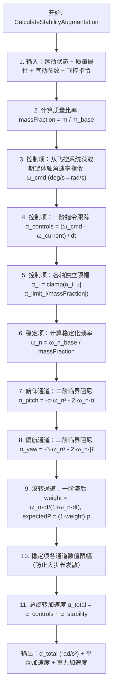

# 算法卡片 -- PointMass 稳定增稳系统 (SAS)

> **状态**：draft
> **日期**：2026-06-11
> **索引证据**：function-index.jsonl (wsf_plugins::sixdof_flight_control_class), source/WsfPointMassSixDOF_Integrator.cpp, source/WsfPointMassSixDOF_FlightControlSystem.hpp
> **关联文档**：flight-dynamics-pointmass-integrator-card.md, flight-dynamics-rigid-body-integrator-card.md

### 基础资料

- **算法名称**：PointMass Stability Augmentation System (SAS)（点质稳定增稳系统）
- **算法所属模块**：wsf_six_dof（点质/刚体六自由度飞行器运动学插件 -- 新模块）
- **算法功能**：为 PointMass 飞行器模型提供旋转角加速度计算，核心创新在于将旋转动力学与控制指令解耦——旋转角加速度由两个独立项叠加：（1）控制项：从飞行员/自动驾驶仪的目标角速率指令经一阶跟踪转换为角加速度；（2）稳定增稳项：模拟飞行器固有静稳定性和气动阻尼，俯仰/偏航通道使用二阶临界阻尼系统将攻角/侧滑角驱回零，滚转通道使用一阶滞后平滑。两项各轴独立限幅后叠加得到总旋转加速度。

### 算法流程



其中，第一步汇总来自飞行器模型的输入参数；第二步计算质量比率，质量越小（燃油消耗后）飞行器越敏捷；第三步至第五步完成控制项计算——通过一阶差分将期望角速率转为角加速度并限幅；第六步至第九步完成三通道稳定增稳计算；第十步施加数值安全限幅；第十一步叠加得到总旋转加速度。稳定增稳项的作用是模拟真实飞行器的静稳定性和气动阻尼——即使没有飞行员输入，飞行器也会自然趋向零攻角/零侧滑角。

### 算法变量和常量

1. 输入 (input)：

   | 英文标识符 (Symbol) | 中文名称 (Name) | 数据类型 (Type) | 含义 (Meaning) | 单位 (Units) | 所属函数 (Method) |
   | ---- | ---- | ---- | --- | ---- | --- |
   | `aState` | 运动状态引用 | `KinematicState&` | 飞行器瞬态运动状态（攻角/侧滑角/角速率/攻角变化率/侧滑角变化率） | — | CalculateStabilityAugmentation |
   | `massProperties` | 质量属性 | `MassProperties` | 当前质量/质心/基准质量 | slug | CalculateStabilityAugmentation |
   | `rotationalAccelerationLimits_rps2` | 旋转加速度限幅基准 | `UtVec3dX` | 气动计算提供的三轴旋转加速度限幅（基准值） | rad/s^2 | CalculateStabilityAugmentation |
   | `stabilizingFrequency_rps` | 稳定化频率基准 | `UtVec3dX` | 气动计算提供的三轴稳定化固有频率（基准值） | rad/s | CalculateStabilityAugmentation |
   | `commandedRotationRates_dps` | 期望体轴角速率 | `UtVec3dX` | 飞控系统从操纵杆位移映射到的目标角速率 | deg/s | CalculateStabilityAugmentation |

2. 输出 (output)：

   | 英文标识符 (Symbol) | 中文名称 (Name) | 数据类型 (Type) | 含义 (Meaning) | 单位 (Units) | 所属函数 (Method) |
   | ---- | ---- | ---- | --- | ---- | --- |
   | `aTranslationalAccel_mps2` (out) | 平动加速度 | `UtVec3dX&` | 体轴系平动加速度（气动+推进力汇总，供积分器推进） | m/s^2 | CalculateStabilityAugmentation |
   | `aRotationalAccel_mps2` (out) | 旋转角加速度 | `UtVec3dX&` | 体轴系旋转角加速度（控制+稳定叠加结果） | rad/s^2 | CalculateStabilityAugmentation |
   | `aGravitationalAccel_g` (out) | 重力加速度 | `UtVec3dX&` | 体轴系重力加速度（供积分器用于过载计算和 Heun 平均） | g | CalculateStabilityAugmentation |
   | `lift_lbs / drag_lbs / thrust_lbs` | 升力/阻力/推力 | `double` | 诊断用气动力/推力数值 | lb | CalculateStabilityAugmentation |

3. 常量 (constant)：

   | 英文标识符 (Symbol) | 中文名称 (Name) | 数据类型 (Type) | 含义 (Meaning) | 单位 (Units) | 所属函数 (Method) |
   | ---- | ---- | ---- | --- | ---- | --- |
   | `cREFERENCE_GRAV_ACCEL_MPS2` | 标准重力加速度 | `double (9.80665)` | 将英制 lbf 转换为公制 m/s^2 加速度的转换因子 | m/s^2 | CalculateStabilityAugmentation |
   | `moverTimestep_sec` | 运动器步长 | `double` | PointMassMover 的仿真步长，用于控制项差分和稳定项计算 | s | CalculateStabilityAugmentation |

### 关键数学公式

1. **旋转角加速度 = 控制项 + 稳定增稳项**：
   这是 PointMass 模型的核心设计：
   $\vec{\alpha}_{total} = \vec{\alpha}_{controls} + \vec{\alpha}_{stability}$
   其中：
   - $\vec{\alpha}_{controls}$ 为飞行员/自动驾驶仪指令产生的控制角加速度。
   - $\vec{\alpha}_{stability}$ 为模拟飞行器固有静稳定性和气动阻尼的增稳角加速度。

2. **控制项 -- 一阶指令跟踪**：
   飞行控制系统给出期望体轴角速率 $\vec{\omega}_{cmd}$（deg/s 转为 rad/s），积分器将差值除以步长得到指令角加速度：
   $\vec{\alpha}_{controls} = \frac{\vec{\omega}_{cmd} - \vec{\omega}_{current}}{dt_{mover}}$
   各轴独立限幅（由气动计算确定上限）：
   $\alpha_i = \text{clamp}\left(\alpha_i, \pm |\alpha_{limit,i}|\right)$
   $\vec{\alpha}_{limit} = \frac{\vec{\alpha}_{limit,base}}{m_{fraction}}$
   其中：
   - $dt_{mover}$ 为运动器步长，单位为 s。
   - $m_{fraction} = m / m_{base}$ 为当前质量与基准质量的比率。质量越小（$m_{fraction}$ 越小），$\vec{\alpha}_{limit}$ 越大，飞行器越敏捷。
   - 控制器设计为避免过冲（overshoot），以防止控制器产生"蜂鸣"（buzzing）效应污染遥测数据。

3. **稳定增稳项 -- 俯仰/偏航通道：二阶临界阻尼系统**：
   模拟弹簧-质量-阻尼系统，目标是将攻角 $\alpha$ 和侧滑角 $\beta$ 驱回零：
   $\alpha_{pitch,stab} = -\alpha \cdot \omega_{n,pitch}^2 - 2\cdot\omega_{n,pitch}\cdot\dot{\alpha}$
   $\alpha_{yaw,stab} = -\beta \cdot \omega_{n,yaw}^2 - 2\cdot\omega_{n,yaw}\cdot\dot{\beta}$
   质量比率对稳定化频率的影响：
   $\omega_{n} = \frac{\omega_{n,base}}{m_{fraction}}$（质量越小，稳定化频率越高）
   其中：
   - $\omega_{n}$ 为稳定化固有频率，由飞行器气动设计决定。等效于静稳定性 + 气动阻尼。
   - 阻尼系数固定为 $\zeta = 1$（临界阻尼），系统以最快速度回到零且无过冲。
   - $-\alpha \cdot \omega_n^2$ 为恢复项（静稳定性），$2\cdot\omega_n\cdot\dot{\alpha}$ 为阻尼项。
   - 偏航通道最终结果乘以 -1（符号翻转）作为输出。

4. **稳定增稳项 -- 滚转通道：一阶滞后平滑**：
   滚转力学比俯仰/偏航简单（主要是翼展方向的速度分布变化），用一阶滞后即可近似：
   $\text{weight} = \frac{\omega_{n,roll} \cdot dt}{1 + \omega_{n,roll} \cdot dt}$
   $\dot{p}_{expected} = (1 - \text{weight}) \cdot p$
   $\alpha_{roll,stab} = \frac{\dot{p}_{expected} - p}{dt}$
   其中 expected roll rate 是向零衰减的加权平滑值，等效于一个低通滤波器的时间常数 $\tau = 1/\omega_{n,roll}$。

5. **稳定性数值限幅（防止大时间步长发散）**：
   在大时间步长下，稳定加速度可能过大导致数值发散。各通道独立限幅：
   $\alpha_{roll,max} = \frac{|p|}{dt}$
   $\alpha_{pitch,max} = \frac{2}{dt^2} \cdot |-\alpha - \dot{\alpha} \cdot dt|$
   $\alpha_{yaw,max} = \frac{2}{dt^2} \cdot |-\beta - \dot{\beta} \cdot dt|$
   物理意义：限幅值 = 一步内将气动角/角速率归零所需加速度的 2 倍（安全裕量）。

6. **质量比率对敏捷性的影响**：
   质量越小（燃油消耗）则：
   - 旋转限幅 $\vec{\alpha}_{limit}$ 增大（除以 $m_{fraction}$）
   - 稳定化频率 $\omega_n$ 增大（除以 $m_{fraction}$）
   因此飞行器在燃油消耗后变得更敏捷。

### 算法伪代码

```
// === 旋转加速度计算 — 控制项 + 稳定增稳项 ===

function ComputeAngularAcceleration(aState, massProperties, alphaLimitBase, freqStabBase,
                                     flightControls) -> alphaTotal:
    if massProperties.mass <= 0: return [0, 0, 0]

    massFraction = massProperties.mass / massProperties.baseMass      // 质量比率
    moverDt = mVehicle.GetStepSize_sec()                               // 运动器步长 (s)

    // --- 控制项：一阶指令跟踪 ---
    alphaControls = [0, 0, 0]
    if flightControls != null:
        omegaCmd_rps = flightControls.GetBodyRateCommands_dps() * DEG_TO_RAD
        omegaCurr_rps = aState.GetOmegaBody()
        alphaControls = (omegaCmd_rps - omegaCurr_rps) / moverDt

        alphaLimit = alphaLimitBase / massFraction                     // 质量越小限幅越大
        for i in {0,1,2}: alphaControls[i] = clamp(alphaControls[i], ±|alphaLimit[i]|)

    // --- 稳定增稳项 ---
    alpha_rad  = aState.GetAlpha_rad()                                 // 攻角 (rad)
    beta_rad   = aState.GetBeta_rad()                                  // 侧滑角 (rad)
    p_rps      = aState.GetRollRate_rps()                              // 滚转角速率 (rad/s)
    alphaDot   = aState.GetAlphaDot_rps()                              // 攻角变化率 (rad/s)
    betaDot    = aState.GetBetaDot_rps()                               // 侧滑角变化率 (rad/s)

    freqStab_roll, freqStab_pitch, freqStab_yaw = freqStabBase
    freqStab_roll  /= massFraction                                     // 质量减小 → 频率升高
    freqStab_pitch /= massFraction
    freqStab_yaw   /= massFraction

    // 俯仰通道：二阶临界阻尼系统 (ζ=1) → 驱 α→0
    alphaPitchStab = -alpha_rad * freqStab_pitch^2 - 2*freqStab_pitch * alphaDot
    // 偏航通道：二阶临界阻尼系统 (ζ=1) → 驱 β→0
    alphaYawStab   = -beta_rad  * freqStab_yaw^2  - 2*freqStab_yaw  * betaDot
    // 滚转通道：一阶滞后平滑 → 驱 p→0
    weight = freqStab_roll * moverDt / (1 + freqStab_roll * moverDt)
    expectedP = (1 - weight) * p_rps                                    // 向零平滑过渡
    alphaRollStab = (expectedP - p_rps) / moverDt                       // 一阶滞后 → 等效加速度

    // 稳定性数值限幅（防止大时间步长发散）
    maxRollStab  = |p_rps / moverDt|
    maxPitchStab = |2/moverDt^2 * (-alpha_rad - alphaDot*moverDt)|
    maxYawStab   = |2/moverDt^2 * (-beta_rad  - betaDot *moverDt)|
    alphaRollStab  = clamp(alphaRollStab,  ±maxRollStab)
    alphaPitchStab = clamp(alphaPitchStab, ±maxPitchStab)
    alphaYawStab   = clamp(alphaYawStab,   ±maxYawStab)

    alphaStability = [alphaRollStab, alphaPitchStab, -alphaYawStab]     // 偏航符号翻转

    // --- 总旋转加速度 = 控制项 + 稳定项 ---
    alphaTotal = alphaControls + alphaStability

    return alphaTotal
```

### 源码使用说明

#### 入口和调用链

```
// 每帧从 PointMass 积分器的 CalculateAcceleration() 中调用
WsfSimulation::Update()
  → WsfPointMassSixDOF_Mover::Update()
    → PointMassIntegrator::CalculateAcceleration()                      // 加速度汇总
      → aState.UpdateAeroState()                                        //   更新气动状态
      → mVehicle.CalculateAeroBodyForceAndRotation()                   //   气动力 + 旋转限幅基准 + 稳定化频率基准
      → mVehicle.CalculatePropulsionFM()                               //   推进力 + 推力矢量旋转加速度
      → flightControls.GetBodyRateCommands_dps()                       //   飞控系统 — 期望体轴角速率 (deg/s)
      → CalculateStabilityAugmentation(...)                             //   SAS 核心计算
        → 控制项 = (omegaCmd - omegaCurr) / moverDt（一阶跟踪）        //
        → 俯仰稳定 = -α*ωn² - 2*ωn*α̇（二阶临界阻尼）                 //
        → 偏航稳定 = -β*ωn² - 2*ωn*β̇（二阶临界阻尼）                 //
        → 滚转稳定 = 一阶滞后 (weight=p→0)                            //
        → 各通道数值限幅 → 控制+稳定叠加                              //
```

#### 源码位置

| File | Symbol | Lines | Evidence level | 中文说明 |
| ---- | ------ | ----- | -------------- | -------- |
| [WsfPointMassSixDOF_Integrator.cpp](source_root/src/wsf_plugins/wsf_six_dof/source/WsfPointMassSixDOF_Integrator.cpp) | `CalculateStabilityAugmentation()` | 270-343 | source-cited | SAS 核心计算 — 控制项(一阶跟踪) + 稳定项(二阶临界阻尼俯仰/偏航 + 一阶滚转滞后) |
| [WsfPointMassSixDOF_Integrator.cpp](source_root/src/wsf_plugins/wsf_six_dof/source/WsfPointMassSixDOF_Integrator.cpp) | `ComputeAngularAcceleration()` | 155-269 | source-cited | 加速度计算总入口 — 气动+推进+重力力汇总 + 调用 SAS 计算旋转加速度 |
| [WsfPointMassSixDOF_FlightControlSystem.hpp](source_root/src/wsf_plugins/wsf_six_dof/source/WsfPointMassSixDOF_FlightControlSystem.hpp) | `GetBodyRateCommands_dps()` | — | source-cited | 飞控系统输出体轴角速率指令 — 从操纵曲线将杆位移映射为期望角速率 (deg/s) |

#### 框架依赖

| AFSIM 原始依赖 | 依赖类型 | 替换方案 |
| -------------- | -------- | -------- |
| `KinematicState` | 运动状态容器 | 自定义状态结构体，含攻角/侧滑角/角速率/攻角变化率/侧滑角变化率 |
| `MassProperties` | 质量属性容器 | 自定义结构体，含 mass/baseMass |
| `PointMassFlightControlSystem` | 飞行控制系统接口 | 自定义飞控接口类，输出期望角速率指令 |
| `ForceAndRotationObject` | 力/力矩 + 旋转参数容器 | 自定义类，含力矢量 + 旋转限幅 + 稳定化频率的三分量 |
| `UtVec3dX` | 三维矢量 | Eigen::Vector3d |
| `UtMath::Limit()` | 数值限幅 | `std::clamp()` 或手动限幅 |
| `UtMath::cDEG_PER_RAD / cRAD_PER_DEG` | 单位换算常数 | 直接硬编码 `0.0174533`, `57.29578` |

#### 测试和验证计划

1. **纯控制模式测试**（稳定项=0）：给定常值期望角速率 omega_cmd = [5, 0, 0] deg/s，验证角速率在一帧后精确收敛到指令值，无过冲。
2. **纯稳定模式（俯仰）**：初始攻角 alpha = 5 度，controls=0，验证攻角以二阶振子方式指数衰减到零，阻尼比为 1（临界阻尼），无振荡。
3. **纯稳定模式（偏航）**：初始侧滑角 beta = 5 度，controls=0，同样验证临界阻尼衰减行为。
4. **滚转一阶滞后**：初始 p = 10 deg/s，controls=0，验证滚转速率按一阶指数衰减，时间常数 tau = 1/omega_n_roll。
5. **质量减少敏感度测试**：半质量时（massFraction=0.5），验证稳定化频率为原来的 2 倍，旋转限幅为原来的 2 倍。
6. **控制限幅测试**：给定极大 omega_cmd（如 1000 deg/s），验证控制角加速度被限幅至气动计算的上限 alpha_limit。
7. **稳定项数值限幅测试**：极端大步长（如 dt=1s）下，验证稳定项不产生发散加速度（限幅确保不超过一步归零所需加速度的 2 倍）。
8. **零飞控系统保护**：不挂载飞控系统时（flightControls==null），验证控制项=0，仅稳定项生效。
9. **零质量保护**：mass<=0 时所有加速度输出为零向量，不崩溃。

### 内部状态

SAS 算法不拥有独立的类——核心代码 `CalculateStabilityAugmentation` 内联在 `PointMassIntegrator::CalculateAcceleration()` 方法中（见 integrator 源文件行 267-343）。该方法本身不持跨帧持久化状态，所有输入来自飞行器对象、所有输出通过引用参数返回。但 SAS 依赖的飞行控制系统 `PointMassFlightControlSystem` 持有内部状态如下（与 SAS 计算直接相关的部分）：

| 变量名 | 类型 | 初始值 | 物理含义 | 更新时机 |
|--------|------|--------|----------|----------|
| `mStickBack` | `double` | `0.0` | 驾驶杆后拉位移（0-1 归一化），映射到俯仰角速率指令 | 每帧由飞行员对象更新 |
| `mStickRight` | `double` | `0.0` | 驾驶杆右压位移，映射到滚转角速率指令 | 每帧由飞行员对象更新 |
| `mRudderRight` | `double` | `0.0` | 右舵位移，映射到偏航角速率指令 | 每帧由飞行员对象更新 |
| `mStickBackCurvePtr` | `UtTable::Curve*` | `nullptr` | 杆位移到期望俯仰角速率的映射曲线（deg/s vs 杆位） | 初始化阶段从配置加载 |
| `mStickRightCurvePtr` | `UtTable::Curve*` | `nullptr` | 杆位移到期望滚转角速率的映射曲线 | 初始化阶段从配置加载 |
| `mRudderRightCurvePtr` | `UtTable::Curve*` | `nullptr` | 舵位移到期望偏航角速率的映射曲线 | 初始化阶段从配置加载 |
| `mLastUpdateSimTime_nanosec` | `int64_t` | `0` | 上一次飞控更新的仿真时间 | 每帧 `Update()` 中由外部设置 |
| `massFraction`（局部） | `double` | 每帧计算 | `m / m_base`；质量越小飞行器越敏捷 | 每帧 `CalculateAcceleration()` 中计算，不在帧间保留 |
| `moverTimestep_sec`（局部） | `double` | 每帧读取 | 运动器步长，用于一阶差分和稳定项计算 | 每帧从 `GetParentVehicle()->GetStepSize_sec()` 读取 |

SAS 计算中其余变量（`alpha_rad`/`beta_rad`/`alphaDot_rps`/`betaDot_rps`/`rollRate_rps`/`freqStab`均为局部临时变量，每帧重新从 `aState` 读入。

### 变量映射表

| 代码变量 | 数学符号 | 含义 |
|----------|----------|------|
| `massFraction` | $m_{fraction}$ | 质量比率 `m / m_{base}`（当前质量 / 基准质量） |
| `moverTimestep_sec` | $dt_{mover}$ | 运动器仿真步长（秒） |
| `commandedRotationRates_dps` | $\vec{\omega}_{cmd}$ | 飞控系统输出的期望体轴角速率（deg/s） |
| `commandedRotationRates_rps` | $\vec{\omega}_{cmd}$ | 期望体轴角速率转换为 rad/s |
| `currentRotationRates_rps`（即 `aState.GetOmegaBody()`） | $\vec{\omega}_{current}$ | 当前体轴角速率（rad/s） |
| `rotationalAccelControls_rps2` | $\vec{\alpha}_{controls}$ | 控制项产生的旋转角加速度（rad/s^2） |
| `rotationalAccelStability_rps2` | $\vec{\alpha}_{stability}$ | 稳定增稳项产生的旋转角加速度（rad/s^2） |
| `rotationalAccelLimitBase_rps2` | $\vec{\alpha}_{limit,base}$ | 旋转加速度限幅基准（来自气动表，rad/s^2） |
| `rotationalAccelLimit_rps2` | $\vec{\alpha}_{limit}$ | 质量缩放后的有效旋转限幅 `alphaLimitBase / massFraction` |
| `alpha_rad` | $\alpha$ | 攻角（rad） |
| `beta_rad` | $\beta$ | 侧滑角（rad） |
| `alphaDot_rps` | $\dot{\alpha}$ | 攻角变化率（rad/s） |
| `betaDot_rps` | $\dot{\beta}$ | 侧滑角变化率（rad/s） |
| `rollRate_rps`（`p`） | $p$ | 滚转角速率（rad/s） |
| `rollStabilizingFrequency` | $\omega_{n,roll}$ | 滚转通道稳定化固有频率（rad/s，已除以 massFraction） |
| `alphaStabilizingFrequency` | $\omega_{n,\alpha}$ | 俯仰通道稳定化固有频率（rad/s，已除以 massFraction） |
| `betaStabilizingFrequency` | $\omega_{n,\beta}$ | 偏航通道稳定化固有频率（rad/s，已除以 massFraction） |
| `pitchAccelerationStability` | $\alpha_{pitch,stab}$ | 俯仰通道稳定角加速度（rad/s^2） |
| `yawAccelerationStability` | $\alpha_{yaw,stab}$ | 偏航通道稳定角加速度（rad/s^2） |
| `rollAlphaFactor` | $\text{weight}$ | 滚转一阶滞后权重因子 `w_n*dt/(1+w_n*dt)` |
| `expectedRollRate_rps` | $p_{expected}$ | 一阶滞后平滑后的期望滚转速率 |
| `rollAccelerationStability` | $\alpha_{roll,stab}$ | 滚转通道稳定角加速度（rad/s^2） |
| `maxRollAccelerationStability` | $\alpha_{roll,max}$ | 滚转通道数值限幅值 `|p/dt|` |
| `maxPitchAccelerationStability` | $\alpha_{pitch,max}$ | 俯仰通道数值限幅值 `2/dt^2 * |-alpha - alphaDot*dt|` |
| `maxYawAccelerationStability` | $\alpha_{yaw,max}$ | 偏航通道数值限幅值 `2/dt^2 * |-beta - betaDot*dt|` |
| `aRotationalAccel_mps2` | $\vec{\alpha}_{total}$ | 总旋转角加速度 = 控制项 + 稳定项（rad/s^2） |
| `mStickBack` / `mStickRight` / `mRudderRight` | — | 驾驶杆/脚舵位移（0-1 归一化，输入到飞控曲线） |

### 边界条件

1. **空飞控系统保护**：若 `mVehicle->GetFlightControls()` 返回 `nullptr`（即未挂载飞控系统），控制项 `rotationalAccelControls_rps2` 保持为零向量（初始化默认值）。仅稳定增稳项生效（模拟无飞行员输入时飞行器的自然稳定性）。

2. **零质量保护**：在 `CalculateAcceleration()` 入口（SAS 代码的上层），若 `massProperties.GetMass_lbs() <= 0.0`，该函数立即返回，所有加速度输出保持为零向量。因此 SAS 不会在零质量时被调用。

3. **控制项限幅**：各轴控制加速度独立通过 `UtMath::Limit()` 限幅到 `+/-|rotationalAccelLimit_rps2[i]|`。限幅基准来自气动模型的 `MaximumRoll/Pitch/YawAcceleration` 查表输出，再除以 `massFraction`。质量越小（`massFraction` 越小），限幅越大。

4. **偏航通道符号翻转**：在 SAS 末尾（代码行 340），偏航稳定加速度 `yawAccelerationStability` 在写入矢量时取反：`rotationalAccelStability_rps2.Set(..., -yawAccelerationStability)`。原文注释未说明原因，但从坐标约定看这是为了使正向偏航力矩产生正确的偏航角速率方向。

5. **稳定性数值限幅**：三个通道的稳定加速度均通过 `UtMath::Limit()` 限幅：
   - 滚转：`max = |rollRate / dt|` —— 物理含义为一步内将滚转速率为零所需加速度。
   - 俯仰：`max = |2/dt^2 * (-alpha - alphaDot*dt)|` —— 一步内将攻角归零所需加速度的 2 倍（安全裕量 2x）。
   - 偏航：`max = |2/dt^2 * (-beta - betaDot*dt)|` —— 同理。
   这些限幅用于防止大时间步长下二阶/一阶系统产生发散加速度。

6. **NaN/Inf 保护**：代码中无显式 `isnan()`/`isinf()` 检查。输入状态中的 NaN（如气动角计算异常）会直接污染输出。稳定性限幅间接限制了发散行为，但不能消除输入 NaN 传播。

7. **质量比率边界**：`massFraction = m / m_base` 在正常操作中应介于 0 到 1 之间（飞行器不增加质量）。若意外大于 1，控制限幅和稳定化频率会缩小（飞行器变得迟钝而不是更敏捷），不会产生数值不稳定。

### 提取策略

- **源文件**：
  - `WsfPointMassSixDOF_Integrator.cpp` -- SAS 代码内联在 `CalculateAcceleration()` 方法中，行 267-343
  - `WsfPointMassSixDOF_FlightControlSystem.hpp` -- 飞行控制系统类声明，提供 `GetBodyRateCommands_dps()` 和操纵曲线查表
  - `WsfPointMassSixDOF_AeroCoreObject.hpp` -- 气动核心对象（提供 `MaximumRoll/Pitch/YawAcceleration_Mach` 和 `StabilizingFrequency_Mach` 限幅与频率基准）

- **提取方法**：SAS 代码没有独立的类/函数，而是内联在 `PointMassIntegrator::CalculateAcceleration()` 中。提取时定位到该方法的旋转加速度计算段落（从 `// Control effects` 注释开始到 `aRotationalAccel_mps2 = ...` 结束），约 76 行代码。需要从上下文中识别 SAS 的输入来源（飞控系统 -> `commandedRotationRates_dps`，气动对象 -> `rotationalAccelerationLimits_rps2` + `stabilizingFrequency_rps`）。

- **函数识别**：从 `function-index.jsonl` 中以 `wsf_plugins::sixdof_flight_control_class` 定位飞控系统类；SAS 本身无独立索引条目（因内联在积分器内）。气动参数来源通过 `wsf_plugins::sixdof_aero_core_class` 索引定位 `PointMassAeroCoreObject`。

- **还原方式**：SAS 核心是三个通道的独立计算——控制项（一阶 P 控制器）、俯仰/偏航稳定项（二阶临界阻尼微分方程）、滚转稳定项（一阶滞后低通滤波），然后叠加和限幅。所有公式为基本代数运算，可直接用任何语言重写。还原时注意：
  1. `massFraction` 需从飞行器获取 `m / m_base`
  2. 限幅值由气动表查表得到，替换时可用用户指定的固定值或查表函数
  3. 控制项限幅基准需从气动模型的 `ForceAndRotationObject` 中读取
  4. 稳定化频率基准需从气动模型的 `StabilizingFrequency` 输出中读取
  5. 偏航的 `-yawAccelerationStability` 符号翻转需要保留

- **已知从属**：SAS 依赖 `PointMassAeroCoreObject` 提供旋转限幅基准和稳定化频率基准（见关联卡片 flight-dynamics-pointmass-aero-card.md），依赖 `PointMassFlightControlSystem` 提供操纵曲线映射（将杆位移映射为期望角速率指令）。独立还原时需提供这两个输入源。

#### 可移植性评分

**可移植性**：中-高

**原因**：

1. 旋转加速度分解为"控制 + 稳定"的架构是 PointMass 特有设计，但可以用标准控制理论公式重实现：控制项是标准一阶跟踪器（P 控制），稳定项俯仰/偏航是标准二阶临界阻尼模型，滚转是一阶滞后。
2. 所有公式不依赖复杂查表（稳定化频率和气动限幅由外部气动分析函数提供即可），核心数学简单直接。
3. 代码与 AFSIM 特有类（`KinematicState`/`ForceAndRotationObject`/`PointMassFlightControlSystem`）耦合，移植时需重新定义这些容器和接口。
4. 稳定化频率 omega_n 需要由外部气动分析或用户显式指定，不可直接搬运。
5. 质量比率（m/m_base）对敏捷性的影响是线性关系，简单直接。
6. 数值限幅公式是工程安全措施，防止大步长下发散，移植时应保留。
