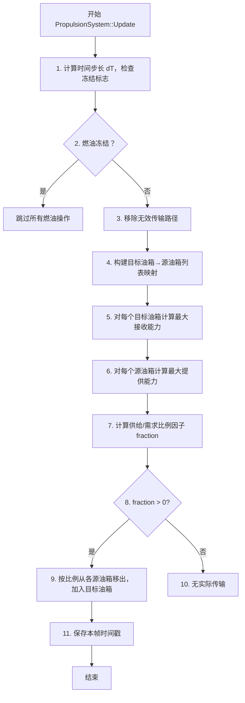
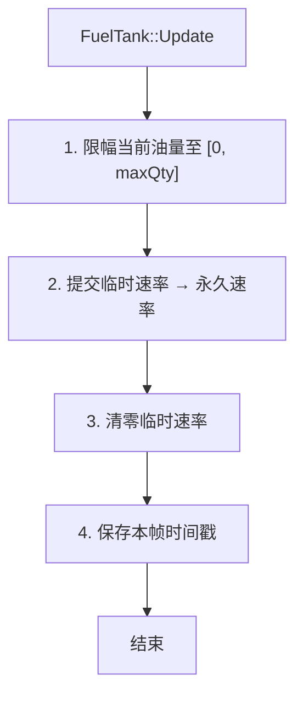
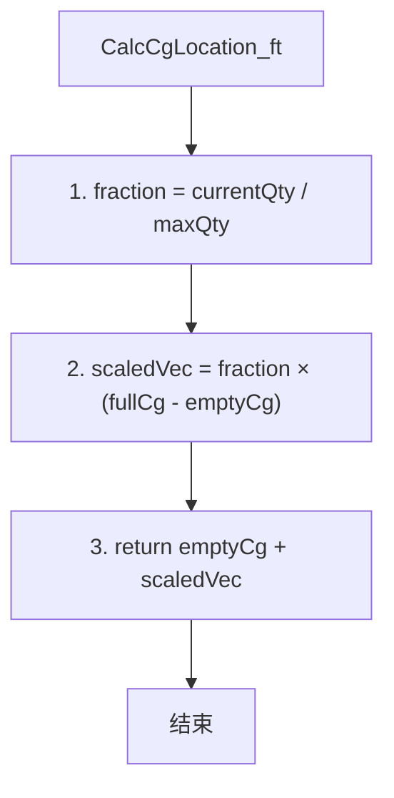

# 算法卡片 -- wsf_six_dof 推进系统与燃油管理模型

> **状态**：draft
> **日期**：2026-06-11
> **索引证据**：function-index.jsonl (wsf_six_dof::PropulsionSystem, wsf_six_dof::FuelTank), source/WsfSixDOF_PropulsionSystem.hpp/.cpp, source/WsfSixDOF_FuelTank.hpp/.cpp
> **关联文档**：flight-dynamics-jet-engine-card.md, flight-dynamics-rigid-body-integrator-card.md

### 基础资料

- **算法名称**：Propulsion System and Fuel Management Model（推进系统与燃油管理模型）
- **算法所属模块**：wsf_six_dof（点质/刚体六自由度飞行器运动学插件 -- 新模块）
- **算法功能**：管理多发动机推进系统中的燃油分配、消耗和油箱间传输。每帧更新时：遍历所有发动机的燃油消耗请求，通过相关燃油箱的 `UpdateFuelBurn` 消耗燃料；同时处理预定义的油箱间燃油传输（Fuel Transfer），按传输速率限制和比例因子协调多源到多目标的传输流程；最后汇总所有燃油箱质量属性（含 CG 位置线性插值）供总质量计算使用。

### 算法流程

整个算法流程图如下：



其中，第一步计算 `dT_sec = aSimTime - mLastSimTime`；第二步检查 `GetParentVehicle()->GetFreezeFlags()->fuelBurn`，若冻结则直接返回（不处理传输但在引擎 UpdateThrust 中不改变油量）；第三步通过 `RemoveInvalidFuelTransfers` 清理因油箱分离（如抛弃副油箱）而失效的传输链路；第四步将所有传输按目标油箱分组构建 `TankMatching` 列表（一个目标可能对应多个源）；第五步使用目标油箱的 `GetMaxFuelTransferRate_pps() * dT_sec` 得到最大接收量，再受限于 `GetFuelCapacity - GetCurrentFuelQuantity`（油箱满度限制）；第六步使用源油箱的 `CalculateFuelTransfer(dT, -request, ...)` 计算最大可提供量；第七步计算 `fraction = totalXfer / maxTgtXfer`，若 fraction <= 1 则 fraction=1（全量传输），否则 fraction=1/fraction（等比压缩）；第九步通过源 `UpdateFuelTransfer(dT, -fraction*provided, ...)` 和 目标 `UpdateFuelTransfer(dT, +fraction*provided, ...)` 完成实际传输。

**燃油箱 FuelTank::Update 子流程**：



**燃油箱 CG 位置计算子流程（CalcCgLocation_ft）**：



### 算法变量和常量

1. 输入 (input)：

   | 英文标识符 (Symbol)        | 中文名称 (Name) | 数据类型 (Type)    | 含义 (Meaning)           | 单位 (Units) | 所属函数 (Method) |
   | --------------------- | ----------- | -------------- | ---------------------- | ---------- | ------------- |
   | `aSimTime_nanosec`    | 当前仿真时间      | `int64_t`      | 当前帧的仿真时间戳              | ns         | Update        |
   | `mLastSimTime_nanosec` | 上次仿真时间      | `int64_t`      | 上一帧的仿真时间戳              | ns         | Update        |
   | `mFuelTransferList`   | 燃油传输列表      | `vector<FuelTransfer>` | 预定义的油箱间传输源/目标/名称       | —          | Update        |
   | `mFuelTankMap`        | 燃油箱映射表      | `unordered_map` | 所有燃油箱的名称→对象映射          | —          | Update        |

2. 输出 (output)：

   | 英文标识符 (Symbol)      | 中文名称 (Name) | 数据类型 (Type)  | 含义 (Meaning)                        | 单位 (Units) | 所属函数 (Method)   |
   | ------------------- | ----------- | ------------ | ----------------------------------- | ---------- | --------------- |
   | `GetMassProperties` | 推进系统质量属性    | `MassProperties` | 所有燃油箱的质量+CG 汇总（mCurrentQuantity_lbs + CG 位置） | lb, ft     | GetMassProperties |

3. 常量 (constant)：

   | 英文标识符 (Symbol)              | 中文名称 (Name)     | 数据类型 (Type) | 含义 (Meaning)                        | 单位 (Units) | 所属函数 (Method)       |
   | --------------------------- | --------------- | ----------- | ----------------------------------- | ---------- | ------------------- |
   | `mMaxFlowRate_pps` (FuelTank) | 最大燃油供给速率       | `double`    | 发动机从油箱抽取燃油的最大速率                    | lb/s       | FuelTank::ProcessInput |
   | `mMaxFillRate_pps` (FuelTank) | 最大燃油填充速率       | `double`    | 外部加油时油箱接受燃油的最大速率                   | lb/s       | FuelTank::ProcessInput |
   | `mMaxTransferRate_pps` (FuelTank) | 最大燃油传输速率      | `double`    | 油箱间燃油传输的最大速率                       | lb/s       | FuelTank::ProcessInput |
   | `mMaxQuantity_lbs` (FuelTank) | 油箱最大容量          | `double`    | 油箱满容量时的燃油质量                        | lb         | FuelTank::ProcessInput |
   | `mFullCgLocation_ft` (FuelTank) | 满油箱 CG 位置      | `UtVec3dX`  | 油箱满时燃油的质心位置（通常为油箱中心）               | ft         | FuelTank::ProcessInput |
   | `mEmptyCgLocation_ft` (FuelTank) | 空油箱 CG 位置      | `UtVec3dX`  | 油箱空时燃油的质心位置（通常为油箱底部）               | ft         | FuelTank::ProcessInput |
   | `mCgEmptyToFullVector` (FuelTank) | 空到满 CG 矢量      | `UtVec3dX`  | = mFullCgLocation_ft - mEmptyCgLocation_ft | ft         | FuelTank::CalcCgLocation_ft |

### 关键数学公式

1. **燃油箱 CG 位置线性插值**：
   CG 位置在空油箱 CG 和满油箱 CG 之间按燃油充满度线性插值：
   $$\mathbf{r}_{cg} = \mathbf{r}_{empty} + \frac{m_{current}}{m_{max}} \cdot (\mathbf{r}_{full} - \mathbf{r}_{empty})$$
   其中：
   - $\mathbf{r}_{cg}$ 为当前燃油 CG 位置矢量（ft）。
   - $\mathbf{r}_{empty}$ 为空油箱 CG 位置（通常为底部）。
   - $\mathbf{r}_{full}$ 为满油箱 CG 位置（通常为中心）。
   - $m_{current}$ 为当前燃油质量（lb）。
   - $m_{max}$ 为油箱最大容量（lb）。
   - 分数 $m_{current}/m_{max}$ 是燃油充满度。

2. **燃油消耗速率限制**：
   发动机请求的燃油燃烧速率必须受限于油箱的最大供给速率：
   $$\dot{m}_{actual} = \min\left(\dot{m}_{request}, \dot{m}_{max\_flow} \cdot \Delta t, m_{remaining}\right)$$
   其中 $\dot{m}_{request}$ 为发动机请求消耗量，$\dot{m}_{max\_flow}$ 为油箱最大供给速率（lb/s），$\Delta t$ 为时间步长（s），$m_{remaining}$ 为油箱当前剩余燃油。

3. **燃油传输协调比例因子**：
   当多个源油箱向同一目标油箱传输时，若总供给量超过目标接收能力，按比例压缩：
   $$f = \begin{cases} 1.0 & \text{if } |\sum m_{provided}| \leq |m_{max\_receive}| \\ \frac{|m_{max\_receive}|}{|\sum m_{provided}|} & \text{otherwise} \end{cases}$$
   每个源油箱实际传输量 = $f \times m_{provided\_by\_source}$。

4. **推进系统总质量属性汇总**：
   所有燃油箱的质量属性累加：
   $$m_{total} = \sum_i m_{tank\_i}, \quad \mathbf{r}_{cg\_total} = \frac{\sum_i m_{tank\_i} \cdot \mathbf{r}_{tank\_i}}{\sum_i m_{tank\_i}}$$
   其中 $m_{tank\_i}$ 表示第 i 个油箱的当前燃油质量（lb），$\mathbf{r}_{tank\_i}$ 表示其 CG 位置。

5. **百分比加油算法**：
   当添加的燃油不足以填满所有油箱时（`AddFuelQuantity_lbs`），按统一百分比填充：
   $$P = 100 \times \frac{m_{current\_total} + m_{to\_add}}{m_{max\_total}}$$
   每个油箱的目标油量 $= m_{max\_i} \times P / 100$，实际加油量 $= m_{target\_i} - m_{current\_i}$。

### 算法伪代码

```
// === 推进系统燃油管理模型 ===
// 整体目标：管理多油箱燃油消耗和油箱间传输，汇总质量属性供飞行器质心计算

// --- PropulsionSystem::Update：每帧调用 ---
function PropulsionSystem_Update(simTime_nanosec):
    dT_nanosec = simTime_nanosec - mLastSimTime_nanosec           // 时间步长 (ns)
    if dT_nanosec < 0 then return                                 // 负时间步，直接返回

    dT_sec = dT_nanosec * 1e-9                                    // 转为秒

    if parentVehicle.freezeFlags.fuelBurn:                         // 冻结标志检查
        mLastSimTime_nanosec = simTime_nanosec
        return                                                    // 燃油冻结，不处理传输

    RemoveInvalidFuelTransfers()                                   // 清理无效传输路径（如抛弃的油箱）

    // 按目标油箱分组构建 tankMatching 列表
    tankMatchingList = []
    for each transfer in mFuelTransferList:
        if transfer.targetTank already in tankMatchingList:
            add transfer.sourceTank to existing match
        else:
            create new TankMatching with targetTank + sourceTank

    // 对每个目标油箱处理传输
    for each match in tankMatchingList:
        targetTank = match.targetTank

        // 目标油箱最大接收量 = 传输速率 × dT，受满度限制
        maxTargetTransfer_lbs = targetTank.maxTransferRate_pps * dT_sec
        targetSpaceAvailable_lbs = targetTank.capacity_lbs - targetTank.currentFuel_lbs
        if maxTargetTransfer_lbs < 0 then maxTargetTransfer_lbs = 0   // 负值截断
        if targetSpaceAvailable_lbs < maxTargetTransfer_lbs:
            maxTargetTransfer_lbs = targetSpaceAvailable_lbs           // 受满度限制

        // 遍历源油箱，累积各自最大可提供量
        totalAvailable_lbs = 0.0
        for each tankData in match.sourceTankList:
            sourceTank = tankData.sourceTank
            sourceMaxTransfer = sourceTank.maxTransferRate_pps * dT_sec

            // 计算源油箱可提供量（负号表示移出）
            (canProvide, actualProvided, newMass, newCg) =
                sourceTank.CalculateFuelTransfer(dT_sec, -sourceMaxTransfer, ...)
            tankData.fuelActuallyProvided_lbs = actualProvided          // 记录每个源的提供量
            totalAvailable_lbs = totalAvailable_lbs + actualProvided    // 累积总供给

        // 计算比例因子
        if |maxTargetTransfer_lbs| > EPSILON:
            fraction = |totalAvailable_lbs| / |maxTargetTransfer_lbs|
            if fraction <= 1.0: fraction = 1.0                          // 供给不超需求，全量
            else: fraction = 1.0 / fraction                             // 等比压缩
        else:
            fraction = 0.0                                              // 目标无法接收

        // 按比例完成传输
        if fraction > EPSILON:
            for each tankData in match.sourceTankList:
                sourceTank = tankData.sourceTank
                transferAmount = -tankData.fuelActuallyProvided_lbs * fraction
                sourceTank.UpdateFuelTransfer(dT_sec, transferAmount, ...)  // 源减少
                targetTank.UpdateFuelTransfer(dT_sec, -transferAmount, ...) // 目标增加

    mLastSimTime_nanosec = simTime_nanosec                               // 保存时间戳

// --- FuelTank::CalcCgLocation_ft：CG 位置线性插值 ---
function FuelTank_CalcCgLocation_ft(currentFuelQty_lbs):
    fraction = currentFuelQty_lbs / maxQty_lbs                       // 燃油充满度 [0, 1]
    scaledVector = fraction * (fullCg_ft - emptyCg_ft)              // 按比例缩放空→满矢量
    return emptyCg_ft + scaledVector                                 // 空CG + 偏移 = 当前CG

// --- FuelTank::UpdateFuelBurn：燃油燃烧状态更新 ---
function FuelTank_UpdateFuelBurn(dT_sec, burnRequest_lbs):
    if dT_sec < EPSILON: return currentState                         // 极小时间步，不更新

    ableToProvide = CalculateFuelBurn(dT_sec, burnRequest_lbs,
                                      out actuallyBurned, out newMass, out newCg)
    // 累积临时流量速率（本帧内可能多次调用）
    mTempCurrentFuelFlow_pps = mTempCurrentFuelFlow_pps + actuallyBurned / dT_sec

    if not parentVehicle.freezeFlags.fuelBurn:                       // 未冻结才改状态
        mCurrentQuantity_lbs = max(0.0, newMass)                     // 更新油量（≥0）
        mCurrentCgLocation_ft = newCg                                // 更新CG位置

    return ableToProvide

// --- FuelTank::CalculateFuelBurn：燃油燃烧计算（不改变状态）---
function FuelTank_CalculateFuelBurn(dT_sec, burnRequest_lbs):
    requestedFlowRate_pps = burnRequest_lbs / dT_sec

    if requestedFlowRate > maxFlowRate_pps:                          // 超过供给速率上限
        limitedBurn = maxFlowRate_pps * dT_sec                       // 限制燃烧量
        burnAmount = min(burnRequest, limitedBurn)                   // 取小值
        remainingAfterBurn = currentFuel - burnAmount
        if remainingAfterBurn < 0:
            burnAmount = burnRequest + remainingAfterBurn            // 油箱见底，仅烧剩余量
    else:
        remainingAfterBurn = currentFuel - burnRequest
        if remainingAfterBurn > 0 and burnRequest >= 0:
            fullyAchieved = true
            burnAmount = burnRequest                                 // 完全满足请求
        else:
            burnAmount = burnRequest + remainingAfterBurn            // 油箱不足

    newMass = currentFuel - burnAmount
    newCg = CalcCgLocation_ft(newMass)                               // 更新CG插值
    return (fullyAchieved, burnAmount, newMass, newCg)
```

### 源码使用说明

#### 入口和调用链

```
// 从积分器主循环 → 推进系统更新 → 燃油箱更新 → 汇总质量属性
WsfSixDOF_Integrator::CalculateFM()                                        // 积分器每帧调用
  → PropulsionSystem::Update(aSimTime_nanosec)                             // 推进系统燃油管理更新
    → 计算 dT → 检查 freeze 标志
    → RemoveInvalidFuelTransfers()                                         // 清理无效传输
    → 遍历 mFuelTransferList → 构建 tankMatching 分组
    → 对每个目标：
      → tgtTank->GetMaxFuelTransferRate_pps() * dT_sec                    // 计算最大接收量
      → tgtTank->CalculateFuelTransfer(dT_sec, fuelAddRequest, ...)        // 目标接收能力计算
      → 对每个源：
        → srcTank->CalculateFuelTransfer(dT_sec, -fuelAddRequest, ...)   // 源提供能力计算
      → 计算 fraction 比例因子
      → 对每个源：
        → srcTank->UpdateFuelTransfer(dT_sec, -fraction*amount, ...)      // 源移出
        → tgtTank->UpdateFuelTransfer(dT_sec, +fraction*amount, ...)      // 目标接收
    → mLastSimTime_nanosec = aSimTime_nanosec                              // 保存时间
  → 各发动机 Engine::UpdateThrust() → FuelTank::UpdateFuelBurn()           // 燃油消耗
  → PropulsionSystem::GetMassProperties()                                   // 汇总质量属性
    → 对每个燃油箱调用 GetMassProperties()                                  // 各油箱质量+CG
```

#### 源码位置

| File | Symbol | Lines | Evidence level | 中文说明 |
| ---- | ------ | ----- | -------------- | -------- |
| [WsfSixDOF_PropulsionSystem.hpp](source_root/src/wsf_plugins/wsf_six_dof/source/WsfSixDOF_PropulsionSystem.hpp) | `PropulsionSystem` (class) | 34-237 | source-cited | 推进系统类全量 -- 多油箱管理 + 传输协调 |
| [WsfSixDOF_PropulsionSystem.cpp](source_root/src/wsf_plugins/wsf_six_dof/source/WsfSixDOF_PropulsionSystem.cpp) | `Update()` | 78-249 | source-cited | 推进系统更新主函数 -- 170 行传输协调 |
| [WsfSixDOF_PropulsionSystem.cpp](source_root/src/wsf_plugins/wsf_six_dof/source/WsfSixDOF_PropulsionSystem.cpp) | `GetMassProperties()` | 499-516 | source-cited | 汇总所有油箱质量属性 |
| [WsfSixDOF_PropulsionSystem.cpp](source_root/src/wsf_plugins/wsf_six_dof/source/WsfSixDOF_PropulsionSystem.cpp) | `AddFuelQuantity_lbs()` | 435-469 | source-cited | 百分比统一加油算法 |
| [WsfSixDOF_PropulsionSystem.cpp](source_root/src/wsf_plugins/wsf_six_dof/source/WsfSixDOF_PropulsionSystem.cpp) | `FillAllTanks()` | 471-489 | source-cited | 所有油箱按百分比填充 |
| [WsfSixDOF_FuelTank.hpp](source_root/src/wsf_plugins/wsf_six_dof/source/WsfSixDOF_FuelTank.hpp) | `FuelTank` (class) | 34-232 | source-cited | 燃油箱类全量 -- 3 种速率 + CG 插值 |
| [WsfSixDOF_FuelTank.cpp](source_root/src/wsf_plugins/wsf_six_dof/source/WsfSixDOF_FuelTank.cpp) | `CalcCgLocation_ft()` | 857-864 | source-cited | CG 位置线性插值 -- 核心 8 行 |
| [WsfSixDOF_FuelTank.cpp](source_root/src/wsf_plugins/wsf_six_dof/source/WsfSixDOF_FuelTank.cpp) | `CalculateFuelBurn()` | 307-388 | source-cited | 燃油燃烧计算（不改变状态） -- 80 行速率/容量双重限制 |
| [WsfSixDOF_FuelTank.cpp](source_root/src/wsf_plugins/wsf_six_dof/source/WsfSixDOF_FuelTank.cpp) | `UpdateFuelBurn()` | 390-431 | source-cited | 燃油燃烧状态更新 |
| [WsfSixDOF_FuelTank.cpp](source_root/src/wsf_plugins/wsf_six_dof/source/WsfSixDOF_FuelTank.cpp) | `CalculateFuelTransfer()` | 560-715 | source-cited | 燃油传输计算（双向：正=接收，负=移出） -- 155 行 |
| [WsfSixDOF_FuelTank.cpp](source_root/src/wsf_plugins/wsf_six_dof/source/WsfSixDOF_FuelTank.cpp) | `SetFullCgLocation_ft()` / `SetEmptyCgLocation_ft()` | 828-840 | source-cited | 设置满/空 CG 并计算 mCgEmptyToFullVector |

#### 框架依赖

| AFSIM 原始依赖 | 依赖类型 | 替换方案 |
| ------------ | ---- | ---- |
| `UtVec3dX` | 三维矢量 | Eigen::Vector3d |
| `UtCloneablePtr` | 智能指针（深拷贝） | std::unique_ptr/std::shared_ptr |
| `UtMath::cLB_PER_KG / cFT_PER_M` | 单位转换常数 | 直接硬编码 |
| `std::unordered_map` | 哈希映射（油箱名 → 对象） | 标准库，直接可用 |
| `Mover / Object` | 父类耦合（freeze 标志检查） | 自定义等效接口 |
| `MassProperties` | 质量属性汇总类 | Eigen 或自定义类 |

#### 测试和验证计划

1. **空油箱燃烧测试**：油箱初始量为 0，请求燃烧 > 0，验证实际消耗为 0 且 `ableToProvide = false`。
2. **超速率燃烧限制测试**：请求燃烧速率 > mMaxFlowRate_pps，验证实际燃烧量不超过 `maxFlowRate * dT`。
3. **CG 线性插值测试**：设定 fullCg=(0,0,5) 和 emptyCg=(0,0,0)，50% 油量时验证 CG=(0,0,2.5)。
4. **油箱间传输测试**：源油箱容量 100lb、目标油箱容量 100lb，传输 50lb，验证源减量=目标增量=50lb 且不超过速率限制。
5. **多源等比压缩测试**：目标油箱仅能接收 10lb，2 个源油箱各提供 20lb，验证 fraction=0.5，每源实际移出 10lb。
6. **燃油冻结测试**：设置 freezeFlags.fuelBurn=true，验证燃油消耗和传输均不生效。
7. **质心汇总测试**：2 个油箱各 100lb，CG 分别为 (1,0,0) 和 (-1,0,0)，验证总质心在 (0,0,0)。
8. **百分比加油测试**：2 个油箱容量各 100lb（当前各 0lb），添加 100lb → 各油箱变为 50lb（50% 填充）。

#### 可移植性评分

**可移植性**：高

**原因**：

1. 核心算法均为基本数学运算：线性插值（CG）、速率限制比较、比例分配，无任何领域特定黑盒。
2. CG 位置线性插值公式极其简单（`emptyCg + fraction * (fullCg - emptyCg)`），一行代码即可实现。
3. 传输比例因子算法是通用资源分配逻辑，仅含加减乘除和条件分支。
4. 主要复杂度在管理逻辑（传输分组、比例计算）而非数学计算，适合任何编程语言。
5. 唯一外部依赖为矢量运算类 `UtVec3dX`，可直接替换为 `Eigen::Vector3d`。
6. 单位体系为 Imperial（lb, ft），但 CG 插值和速率限制的单位转换对算法本身无影响。
7. 燃油箱质量属性汇总使用简单的质量加权平均，公式为标准物理原理。
