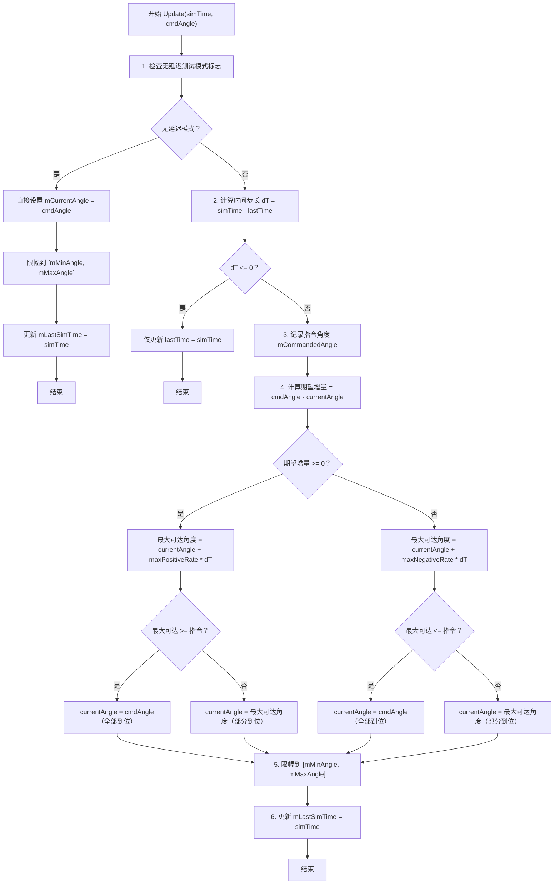

# 算法卡片 -- 舵机角速率限制执行机构模型

> **状态**：draft
> **日期**：2026-06-24
> **索引证据**：function-index.jsonl (P6DofControlActuator, wsf::six_dof::RigidBodyControlActuator)
> **关联文档**：flight-dynamics-autopilot-pid-card.md, flight-dynamics-rigid-body-integrator-card.md, flight-dynamics-p6dof-heun-integrator-card.md
> **关联源文件**：`P6DofControlActuator.hpp/.cpp`、`WsfRigidBodySixDOF_ControlActuator.hpp/.cpp`

### 基础资料

- **算法名称**：Angular Rate-Limited Control Surface Actuator Model（舵机角速率限制执行机构模型）
- **算法所属模块**：wsf_p6dof（拟六自由度旧模块）和 wsf_six_dof（刚体六自由度新模块）
- **算法功能**：模拟真实舵机/控制面的机械运动约束——以有限的最大角速率驱动舵面从当前角度跟踪指令角度，同时受机械止动角限制。两个模块的实现算法完全一致，仅命名空间不同（`P6DofControlActuator` vs `wsf::six_dof::RigidBodyControlActuator`）。该模型不考虑一阶惯性延迟（尽管 `mLagTimeConstant_sec` 成员存在，但 `Update` 中未使用）。

### 算法流程

整个算法流程图如下：



其中，第一步检测仿真测试模式（`testingNoLag` 或 `GetMasterNoLagTesting()`），该模式下执行机构无延迟瞬间到位，用于测试对比；第二步计算距今次更新的时间步长（纳秒→秒），若步长为零则直接返回；第三步保存指令角度用于记录；第四步是核心算法——根据期望旋转方向选择正/负最大角速率，计算在本时间步内能到达的角度范围，判断是否能达到指令角度，不能则仅移动最大可能距离；第五步强制执行机械止动限幅；第六步记录时间以供下次步长计算。

### 算法变量和常量映射表

1. 输入变量(input)：

   | # | 中文名称(Name) | 代码标识(Symbol) | 数学符号(Math-sym) | 数据类型(Type) | 含义(Meaning) | 单位(Units) | 所属函数(Method) |
   |---| ---- | ---- | ---- | --- | ---- | --- |
   | 1 | 仿真时间 | `aSimTime_nanosec` | $t_\text{sim}$ | `int64_t` | 当前仿真时间戳 | 纳秒(ns) | `P6DofControlActuator::Update` / `wsf::six_dof::RigidBodyControlActuator::Update` |
   | 2 | 指令角度 | `aCommandedAngle_deg` | $\theta_\text{cmd}$ | `double` | 飞控系统输出的期望舵面角度 | 度(°) | `P6DofControlActuator::Update` / `wsf::six_dof::RigidBodyControlActuator::Update` |

2. 输出变量(output)：

   | # | 中文名称(Name) | 代码标识(Symbol) | 数学符号(Math-sym) | 数据类型(Type) | 含义(Meaning) | 单位(Units) | 所属函数(Method) |
   |---| ---- | ---- | ---- | --- | ---- | --- |
   | 1 | 当前舵面角度 | `mCurrentAngle_deg` | $\theta_\text{cur}$ | `double` | 经过速率限制和角度限幅后的实际舵面角度 | 度(°) | `P6DofControlActuator::Update` / `wsf::six_dof::RigidBodyControlActuator::Update` |

3. 参数变量(parameters)：

   | # | 中文名称(Name) | 代码标识(Symbol) | 数学符号(Math-sym) | 数据类型(Type) | 含义(Meaning) | 单位(Units) | 所属函数(Method) |
   |---| ---- | ---- | ---- | --- | ---- | --- |
   | 1 | 最大正角速率 | `mMaxPositiveRate_dps` | $\dot{\theta}_{\text{max}+}$ | `double` | 舵面向正方向运动的最大角速率 | 度/秒(°/s) | `P6DofControlActuator::ProcessInput` / `wsf::six_dof::RigidBodyControlActuator::ProcessInput` |
   | 2 | 最大负角速率 | `mMaxNegativeRate_dps` | $\dot{\theta}_{\text{max}-}$ | `double` | 舵面向负方向运动的最大角速率（取正值，算法中用加法） | 度/秒(°/s) | `P6DofControlActuator::ProcessInput` / `wsf::six_dof::RigidBodyControlActuator::ProcessInput` |
   | 3 | 最大机械角度 | `mMaxAngle_deg` | $\theta_{\text{max}}$ | `double` | 舵面机械止动的最大允许角度（必须配置） | 度(°) | `P6DofControlActuator::ProcessInput` / `wsf::six_dof::RigidBodyControlActuator::ProcessInput` |
   | 4 | 最小机械角度 | `mMinAngle_deg` | $\theta_{\text{min}}$ | `double` | 舵面机械止动的最小允许角度（必须配置） | 度(°) | `P6DofControlActuator::ProcessInput` / `wsf::six_dof::RigidBodyControlActuator::ProcessInput` |

4. 状态变量(state variables)：

   | # | 中文名称(Name) | 代码标识(Symbol) | 数学符号(Math-sym) | 数据类型(Type) | 含义(Meaning) | 单位(Units) | 所属函数(Method) | 初始值(Initial-val) | 更新时机(Update-tim) |
   |---| ---- | ---- | ---- | --- | ---- | --- |
   | 1 | 当前角度 | `mCurrentAngle_deg` | $\theta_\text{cur}$ | `double` | 舵面的当前实际角度 | 度(°) | `P6DofControlActuator::Initialize` / `wsf::six_dof::RigidBodyControlActuator::Initialize` | 可由输入脚本指定 `current_angle`，否则为 0 | 每次 `Update()` 调用更新 |
   | 2 | 上次仿真时间 | `mLastSimTime_nanosec` | $t_\text{last}$ | `int64_t` | 上一次 Update 的仿真时间 | 纳秒(ns) | `P6DofControlActuator::Initialize` / `wsf::six_dof::RigidBodyControlActuator::Initialize` | 初始化时赋值为当前仿真时间 | 每次 `Update()` 调用更新为当前时间 |
   | 3 | 指令角度 | `mCommandedAngle_deg` | $\theta_\text{cmd}$ | `double` | 最近一次接收到的指令角度（用于记录和诊断） | 度(°) | `P6DofControlActuator::Update` / `wsf::six_dof::RigidBodyControlActuator::Update` | 0 | 每次 `Update()` 调用更新 |
   | 4 | 滞后时间常数 | `mLagTimeConstant_sec` | $\tau$ | `double` | 一阶滞后滤波时间常数（成员存在但Update中未使用） | 秒(s) | `P6DofControlActuator::Update` / `wsf::six_dof::RigidBodyControlActuator::Update` | 0 | 仅在初始化/ProcessInput 中设置 |

5. 常量(constant)：

   | # | 中文名称(Name) | 代码标识(Symbol) | 数学符号(Math-sym) | 数据类型(Type) | 含义(Meaning) | 单位(Units) | 所属函数(Method) |
   |---| ---- | ---- | ---- | --- | ---- | --- |
   | 1 | 弧度转度系数 | `UtMath::cDEG_PER_RAD` | $180/\pi$ | `double` | 从弧度转换为度的乘法因子（≈57.2958） | 无量纲 | `P6DofControlActuator::ProcessInput` / `wsf::six_dof::RigidBodyControlActuator::ProcessInput` |

### 关键数学公式

1. **时间步长计算**：
    根据两次仿真的纳秒时间戳计算物理时间步长，公式如下：
    $$\Delta t = (t_\text{sim} - t_\text{last}) \times 10^{-9}$$
    其中：
    - $\Delta t$ 表示物理时间步长，单位为秒(s)。
    - $t_\text{sim}$ 表示当前仿真时间戳，单位为纳秒(ns)。
    - $t_\text{last}$ 表示上次更新时的仿真时间戳，单位为纳秒(ns)。

2. **舵面角度更新（速率限制核心公式）**：
    根据方向选择正/负最大速率，计算本步可达的角度，公式如下：
    $$\Delta\theta_{\text{des}} = \theta_{\text{cmd}} - \theta_{\text{cur}}$$
    $$\theta_{\text{new}} = \begin{cases} \theta_{\text{cur}} + \dot{\theta}_{\text{max}+} \cdot \Delta t, & \Delta\theta_{\text{des}} \geq 0 \\ \theta_{\text{cur}} + \dot{\theta}_{\text{max}-} \cdot \Delta t, & \Delta\theta_{\text{des}} < 0 \end{cases}$$
    $$\theta_{\text{cur}}' = \begin{cases} \theta_{\text{cmd}}, & |\theta_{\text{new}} - \theta_{\text{cur}}| \geq |\Delta\theta_{\text{des}}| \text{（能完全到位）} \\ \theta_{\text{new}}, & \text{（只能部分到位）} \end{cases}$$
    其中：
    - $\Delta\theta_{\text{des}}$ 表示从当前角度到指令角度的期望增量，单位为度(°)。
    - $\theta_{\text{cur}}$ 表示更新前的当前角度，单位为度(°)。
    - $\theta_{\text{cmd}}$ 表示飞控系统输出的指令角度，单位为度(°)。
    - $\dot{\theta}_{\text{max}+}$ 表示正向最大角速率，单位为度/秒(°/s)。注意：代码中 `mMaxNegativeRate_dps` 存储为正值，在算法中直接加到 `mCurrentAngle_deg` 上产生负向运动。
    - $\dot{\theta}_{\text{max}-}$ 表示负向最大角速率（代码内用加法实现负向运动），单位为度/秒(°/s)。
    - $\Delta t$ 表示物理时间步长，单位为秒(s)。
    - $\theta_{\text{cur}}'$ 表示更新后的当前角度，单位为度(°)。

3. **机械止动限幅**：
    在所有角度更新后，强制执行硬限幅保护，公式如下：
    $$\theta_{\text{cur}}'' = \text{clamp}(\theta_{\text{cur}}', \theta_{\text{min}}, \theta_{\text{max}})$$
    其中：
    - $\text{clamp}(x, a, b) = \max(a, \min(x, b))$ 表示限幅函数。
    - $\theta_{\text{min}}$ 表示最小机械允许角度，单位为度(°)。必须由输入脚本配置。
    - $\theta_{\text{max}}$ 表示最大机械允许角度，单位为度(°)。必须由输入脚本配置。

4. **无延迟测试模式**：
    当 `testingNoLag` 标志为真时，跳过速率限制，公式如下：
    $$\theta_{\text{cur}}' = \text{clamp}(\theta_{\text{cmd}}, \theta_{\text{min}}, \theta_{\text{max}})$$
    此模式用于测试对比，模拟理想舵机的瞬时响应。

### 算法伪代码

```
// ====================================================================
// 算法：舵机角速率限制执行机构 Update
// 功能：以有限角速率驱动舵面从当前角度跟踪指令角度，受机械止动约束
// 适用模块：wsf_p6dof（P6DofControlActuator）和 wsf_six_dof（RigidBodyControlActuator）
// ====================================================================

FUNCTION Update(simTime_ns, cmdAngle_deg):
    // 第一步：检查无延迟测试模式（用于仿真测试对比）
    IF testing_no_lag_flag IS TRUE THEN
        mCommandedAngle_deg = cmdAngle_deg            // 保存指令角度
        mCurrentAngle_deg = cmdAngle_deg               // 直接等于指令（无延迟）
        mCurrentAngle_deg = CLAMP(mCurrentAngle_deg,   // 仅做机械止动限幅
                                  mMinAngle_deg, mMaxAngle_deg)
        mLastSimTime_ns = simTime_ns                   // 更新时间戳
        RETURN
    END IF

    // 第二步：计算时间步长（纳秒 -> 秒）
    dt_ns = simTime_ns - mLastSimTime_ns               // 时间差（纳秒）
    IF dt_ns <= 0 THEN                                 // 时间未推进或回退
        mLastSimTime_ns = simTime_ns                   // 更新时间戳但不做计算
        RETURN
    END IF
    dt_sec = ns_to_seconds(dt_ns)                      // 转换为秒

    mLastSimTime_ns = simTime_ns                       // 保存本次时间戳

    // 第三步：保存指令角度
    mCommandedAngle_deg = cmdAngle_deg

    // 第四步：速率限制核心逻辑
    desiredDelta = cmdAngle_deg - mCurrentAngle_deg    // 期望角度增量 (°)
    IF desiredDelta >= 0 THEN                          // 需要正向旋转
        bestNewAngle = mCurrentAngle_deg
                     + mMaxPositiveRate_dps * dt_sec  // 正速率推进 (°)
        IF bestNewAngle >= cmdAngle_deg THEN           // 本步内可到达指令
            mCurrentAngle_deg = cmdAngle_deg           // 直接到位
        ELSE                                           // 本步内无法到达指令
            mCurrentAngle_deg = bestNewAngle            // 移动最大可能距离
        END IF
    ELSE                                                // 需要负向旋转
        bestNewAngle = mCurrentAngle_deg
                     + mMaxNegativeRate_dps * dt_sec  // 负速率推进 (°)
        IF bestNewAngle <= cmdAngle_deg THEN           // 本步内可到达指令
            mCurrentAngle_deg = cmdAngle_deg           // 直接到位
        ELSE                                           // 本步内无法到达指令
            mCurrentAngle_deg = bestNewAngle            // 移动最大可能距离
        END IF
    END IF

    // 第五步：强制机械止动限幅（防止超出物理范围）
    IF mCurrentAngle_deg > mMaxAngle_deg THEN
        mCurrentAngle_deg = mMaxAngle_deg               // 上限幅 (°)
    END IF
    IF mCurrentAngle_deg < mMinAngle_deg THEN
        mCurrentAngle_deg = mMinAngle_deg               // 下限幅 (°)
    END IF

    RETURN
END FUNCTION
```

### 源码使用说明

#### 入口和调用链

```
→ P6DofFlightControlSystem::Update() / RigidBodyFlightControlSystem::Update()
  // 飞控系统主更新入口：计算 PID 控制回路 -> 输出指令角度到各执行机构
  → P6DofControlActuator::Update(simTime, cmdAngle_deg)
    // P6DOF 模块：对每个舵面执行速率限制和角度限幅
  → wsf::six_dof::RigidBodyControlActuator::Update(simTime, cmdAngle_deg)
    // 刚体六自由度模块：功能完全相同的速率限制执行机构
```

#### 源码位置

| 类 | 头文件 | 实现文件 | Update方法行号 |
|---|--------|---------|--------------|
| `P6DofControlActuator` | `wsf_plugins/wsf_p6dof/p6dof/source/P6DofControlActuator.hpp:20-58` | `P6DofControlActuator.cpp:141-228` | L141-228 |
| `RigidBodyControlActuator` | `wsf_plugins/wsf_six_dof/source/WsfRigidBodySixDOF_ControlActuator.hpp:25-64` | `WsfRigidBodySixDOF_ControlActuator.cpp:133-220` | L133-220 |

#### 框架依赖

| 依赖类型 | AFSIM 原始依赖 | 说明 |
|---------|---------------|------|
| 框架依赖 | `P6DofFlightControlSystem` / `RigidBodyFlightControlSystem` | 父飞控系统指针，用于访问测试标志；可替换为任意父容器 |
| 框架依赖 | `P6DofFreezeFlags` / 测试标志 | 无延迟测试模式状态；可替换为自定义测试模式开关 |
| 框架依赖 | `P6DofUtils::TimeToTime()` / `utils::TimeToTime()` | 纳秒→秒时间单位转换（× 1e-9）；`std::chrono` 可完全替代 |
| 可替换依赖 | `UtInput` / `UtInputBlock` | 输入脚本解析器；可替换为 JSON/YAML 配置读取 |
| 可替换依赖 | `UtMath::cDEG_PER_RAD` | 弧度→度转换常数 (180/π)；可替换为自定义数学常数 |

#### 边界条件

1. **时间步长为零或负值**：当 `dt_ns <= 0` 时（仿真时间暂停、回退或重复调用），算法直接返回不做角度更新，仅更新时间戳。这防止了在异常时间步下产生错误的角速率计算。
2. **角度硬限幅**：`mMinAngle_deg` 和 `mMaxAngle_deg` 是必须项——缺少任一将导致 `ProcessInput` 抛出异常。这两个值在初始化后不变。
3. **角速率不对称性**：正向和负向可使用不同的最大速率值，模拟真实舵机的不对称动力学（如液压助力在正反方向上的不同流量限制）。
4. **`mLagTimeConstant_sec` 未使用**：虽然成员变量存在且在输入脚本中可通过 `lag_time_constant` 命令配置，但在当前 `Update()` 实现中并未应用一阶滞后滤波。这是代码中实际存在但未启用的特性。

#### 测试和验证计划

1. **单元测试——速率限制基本验证**：
   - 设置 `mMaxPositiveRate_dps = 60 °/s`，`mMaxNegativeRate_dps = 30 °/s`
   - 初始 `mCurrentAngle_deg = 0°`
   - 调用 `Update(t=1.0s, cmd=90°)`，验证输出为 `60°`（正向速率限制）
   - 调用 `Update(t=1.0s, cmd=-45°)`，验证输出为 `30°`（负向速率限制）
2. **单元测试——机械止动限幅**：
   - 设置 `mMaxAngle_deg = 45°`，调用 `Update(t=1.0s, cmd=90°)`，验证输出被钳制在 `45°`
   - 设置 `mMinAngle_deg = -20°`，调用 `Update(t=1.0s, cmd=-90°)`，验证输出被钳制在 `-20°`
3. **单元测试——无延迟模式**：
   - 开启 `testingNoLag = true`，调用 `Update(t=0.01s, cmd=90°)`，验证输出瞬间为 `90°`
4. **数值对比**：与 MATLAB/Simulink 的 Rate Limiter 模块对比，误差 < 1e-10

#### 可移植性评分
**可移植性**：高
**原因**：
1. 核心算法极其简洁——仅包含条件判断、乘法和加法，无任何外部数学库依赖。
2. 两个模块的算法完全一致，说明这是 AFSIM 认可的通用设计模式，不存在模块特定耦合。
3. 唯一的外部依赖是时间单位转换（纳秒→秒）和弧度/度转换常数，均可用标准库替代。
