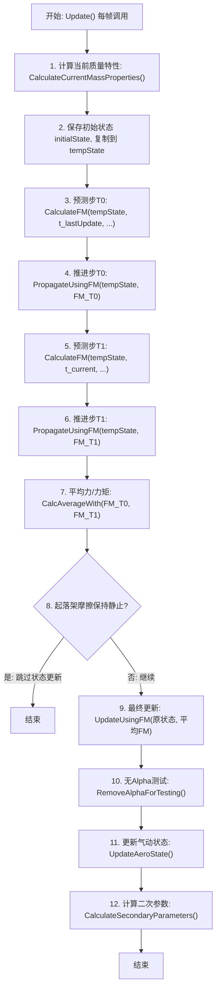

# 算法卡片 -- 刚体六自由度 Heun 预测-校正积分器

> **状态**：draft
> **日期**：2026-06-11
> **索引证据**：function-index.jsonl (wsf_six_dof::Update, wsf_six_dof::PropagateRotation, wsf_six_dof::SetParentVehicle 共3个方法级函数), RigidBodyMover 类
> **关联文档**：p6dof-aero-coefficient-model-card.md, afsim-architecture.md

### 基础资料

- **算法名称**：Rigid Body Six-DOF Integrator（刚体六自由度积分器，Heun 预测-校正法）
- **算法所属模块**：wsf_six_dof（点质/刚体六自由度飞行器运动学插件）
- **算法功能**：wsf_six_dof 模块中的标准刚体六自由度积分器。使用 Heun 修改欧拉法（预测-校正法）对飞行器进行平动和转动推进。在一帧内：计算参考点和质心处的力/力矩（气动+推进+起落架+重力），两步预测后取平均力/力矩，最后用平均 F&M 更新完整运动学状态。与旧模块 wsf_p6dof 的 P6DOF Heun 积分器功能对等，但属于 wsf_six_dof 新架构。

### 算法流程

整个算法流程图如下：



其中，第一步在每帧开始时重新计算质心位置以考虑燃油消耗；第二步保存当前运动学状态快照；第三至六步执行 Heun 法核心——先在当前状态计算 F&M 并推进到中间态，再在中间态计算 F&M 并再次推进；第七步取T0和T1两步 F&M 的算术平均值作为最终使用的力/力矩；第八步检查起落架是否因摩擦保持静止，若静止则跳过后续积分避免地面抖动；第九步用平均 F&M 和原始状态完成最终状态更新（含平动和转动）；第十步测试模式下移除攻角；第十一步更新 alpha-dot、beta-dot 等气动状态导数；第十二步计算辅助参数供外部使用。

### 算法变量和常量

1. 输入 (input)：

   | 英文标识符 (Symbol) | 中文名称 (Name) | 数据类型 (Type) | 含义 (Meaning) | 单位 (Units) | 所属函数 (Method) |
   | ---- | ---- | ---- | --- | ---- | --- |
   | `aSimTime_nanosec` | 当前仿真时间 | int64_t | 本帧结束时刻的仿真时间（纳秒） | ns | Update |
   | `aDeltaT_sec` | 积分步长 | double | 本帧的时间步长 | s | Update |
   | `initialState` | 初始运动学状态 | KinematicState | 帧起始时刻的完整运动学状态快照（位置、速度、姿态、角速率等） | 混合单位 | Update |
   | `massProperties` | 质量特性 | MassProperties | 当前质心位置、质量、转动惯量（Ixx,Iyy,Izz） | lbm, slug-ft² | Update |
   | `aState` | 运动学状态引用 | KinematicState& | 被积分的运动学状态（位置/速度/姿态/角速率） | 混合单位 | CalculateFM / PropagateUsingFM / UpdateUsingFM / PropagateRotation |
   | `aForcesMomentsAtRP` | 参考点力/力矩 | ForceAndMomentsObject | 作用于飞行器参考点(RP)的合力/合力矩（气动+推进+起落架） | lbf, ft-lbf | CalculateFM / PropagateUsingFM / UpdateUsingFM |
   | `aForcesMomentsAtCM` | 质心力/力矩 | ForceAndMomentsObject | 作用于飞行器质心(CM)的力/力矩（仅重力） | lbf, ft-lbf | CalculateFM / PropagateUsingFM / UpdateUsingFM |
   | `aRotationalAccel_rps2` | 体轴转动加速度 | UtVec3dX | 绕体轴三轴的角加速度 [pDot, qDot, rDot] | rad/s² | PropagateRotation |

2. 输出 (output)：

   | 英文标识符 (Symbol) | 中文名称 (Name) | 数据类型 (Type) | 含义 (Meaning) | 单位 (Units) | 所属函数 (Method) |
   | ---- | ---- | ---- | --- | ---- | --- |
   | `aState` (更新后) | 积分后运动学状态 | KinematicState& | 完成 Heun 积分后的完整运动学状态（位置更新、速度更新、姿态更新、角速率更新） | 混合单位 | Update |
   | `lift_lbs` / `drag_lbs` / `sideForce_lbs` | 气动力分量幅值 | double | T1 时刻的升力、阻力、侧力幅值 | lbf | Update |
   | `thrust_lbs` | 推力幅值 | double | T1 时刻的推进力幅值 | lbf | Update |
   | `wgt_lbs` | 重量 | double | 当前飞行器质量（作为重量写入运动学状态） | lbf | Update |
   | `moment_ftlbs` | 总力矩（质心） | UtVec3dX | 所有力/力矩在质心处的合力矩 | ft-lbf | Update |

3. 常量 (constant)：

   | 英文标识符 (Symbol) | 中文名称 (Name) | 数据类型 (Type) | 含义 (Meaning) | 单位 (Units) | 所属函数 (Method) |
   | ---- | ---- | ---- | --- | ---- | --- |
   | `cMaxG` | 最大过载限制 | double (1000.0) | 力幅值的最大过载倍数，防止加速度尖峰 | 无量纲 (g) | PropagateUsingFM |
   | `cMaxOmegaDot_rps` | 最大角加速度限制 | double (100 rev/s²) | 角加速度幅值的上限 = 100 * 360 * PI/180 | rad/s² | PropagateUsingFM |
   | `cGravitationAccel_mps2` | 标准重力加速度 | double (9.80665) | 用于 lbm → kgf → N 的单位换算 | m/s² | PropagateUsingFM |
   | `utils::cEPSILON_SIMTIME_SEC` | 最小仿真时间阈值 | double | 偏航阻尼器中防止除零的时间下限 | s | PropagateRotation |

### 关键数学公式

1. **Heun 修改欧拉法（预测-校正框架）**：
   Heun 法是显式二阶 Runge-Kutta 方法。在一个时间步 $[t_0, t_0 + \Delta t]$ 内，先计算起始点的导数（预测步），再预估终点状态并计算其导数（校正步），最后取两步导数的平均值完成推进。
   公式如下：

   **第一步（预测）**：$\mathbf{FM}_0 = \text{CalculateFM}(\mathbf{x}_0, t_0)$
   **中间态**：$\tilde{\mathbf{x}} = \text{PropagateUsingFM}(\mathbf{x}_0, \mathbf{FM}_0, \Delta t)$
   **第二步（校正）**：$\mathbf{FM}_1 = \text{CalculateFM}(\tilde{\mathbf{x}}, t_0 + \Delta t)$
   **再次推进**：$\tilde{\mathbf{x}} \leftarrow \text{PropagateUsingFM}(\tilde{\mathbf{x}}, \mathbf{FM}_1, \Delta t)$
   **终态**：$\mathbf{FM}_{\text{avg}} = (\mathbf{FM}_0 + \mathbf{FM}_1) / 2$
   **最终更新**：$\mathbf{x}_1 = \text{UpdateUsingFM}(\mathbf{x}_0, \mathbf{FM}_{\text{avg}}, \Delta t)$

   其中：
   - $\mathbf{x}_0$ 为初始运动学状态（位置 $\mathbf{r}$、速度 $\mathbf{v}$、姿态四元数 $\mathbf{q}$、角速率 $\boldsymbol{\omega}$）。
   - $\mathbf{FM}_0$ 为 $t_0$ 时刻计算的力/力矩集合。
   - $\tilde{\mathbf{x}}$ 为两次 Propagate 后的临时中间状态。
   - $\mathbf{FM}_{\text{avg}}$ 为两个端点 F&M 的算术平均。
   - $\mathbf{x}_1$ 为最终积分后的运动学状态。

2. **牛顿第二定律 — 平动推进**：
   将体轴合力转换为惯性系加速度，并用匀加速运动方程更新位置和速度。
   公式如下：

   $\mathbf{a}_{\text{body}} = \frac{\mathbf{F}_{\text{total, body}}}{m} \cdot g$

   $\mathbf{a}_{\text{WCS}} = \mathbf{R}_{\text{body2WCS}} \cdot \mathbf{a}_{\text{body}}$

   $\mathbf{v}_{\text{new}} = \mathbf{v}_{\text{old}} + \mathbf{a}_{\text{WCS}} \cdot \Delta t$

   $\mathbf{r}_{\text{new}} = \mathbf{r}_{\text{old}} + \mathbf{v}_{\text{old}} \cdot \Delta t + \frac{1}{2} \mathbf{a}_{\text{WCS}} \cdot \Delta t^2$

   其中：
   - $\mathbf{F}_{\text{total, body}}$ 为体轴系下作用于质心的合力（lbf）：$\mathbf{F}_{\text{total}} = \mathbf{F}_{\text{RP}} + \mathbf{F}_{\text{CM}}$，包括气动力、推进力、起落架力和重力。
   - $m$ 为当前质量（lbm），$g = 9.80665$ m/s² 为重力加速度常数，用于 lbm 到 N 的换算。
   - $\mathbf{R}_{\text{body2WCS}}$ 为体轴到世界坐标系的方向余弦矩阵（从 DCM 获取）。
   - $\mathbf{a}_{\text{WCS}}$ 为世界坐标系下的加速度（m/s²），可选叠加旋转地球的离心加速度和科里奥利加速度。
   - $\mathbf{v}_{\text{new}}, \mathbf{r}_{\text{new}}$ 分别为积分后的速度和位置。

3. **欧拉转动方程 — 转动推进（角速率更新）**：
   使用转动惯量对角矩阵，通过力矩计算角加速度，并更新体轴角速率。
   公式如下：

   $\dot{p} = \dfrac{M_x}{I_{xx}}, \quad \dot{q} = \dfrac{M_y}{I_{yy}}, \quad \dot{r} = \dfrac{M_z}{I_{zz}}$

   $\boldsymbol{\omega}_{\text{new}} = \boldsymbol{\omega}_{\text{old}} + \dot{\boldsymbol{\omega}} \cdot \Delta t$

   其中：
   - $M_x, M_y, M_z$ 为体轴系下作用于质心的合力矩分量（ft-lbf）。
   - $I_{xx}, I_{yy}, I_{zz}$ 为绕体轴三轴的转动惯量（slug-ft²）。
   - $\dot{p}, \dot{q}, \dot{r}$ 为滚转、俯仰、偏航角加速度（rad/s²）。
   - $\boldsymbol{\omega} = [p, q, r]^T$ 为体轴角速率矢量（rad/s）。

4. **四元数姿态积分**：
   用当前 DCM 构造姿态四元数，通过体轴角速率计算速率四元数，并进行四元数更新和归一化。
   公式如下：

   $\mathbf{q}_{\text{att}} = \text{QuatFromDCM}(\mathbf{R})$

   $\mathbf{q}_{\text{rate}} = \text{SetRate}(\mathbf{q}_{\text{att}}, \boldsymbol{\omega})$

   $\mathbf{q}_{\text{att, new}} = \mathbf{q}_{\text{att}} + \mathbf{q}_{\text{rate}} \cdot \Delta t$

   $\mathbf{q}_{\text{att, new}} \leftarrow \text{Normalize}(\mathbf{q}_{\text{att, new}})$

   $\mathbf{R}_{\text{new}} = \text{DCMFromQuat}(\mathbf{q}_{\text{att, new}})$

   其中：
   - $\mathbf{R}$ 为当前方向余弦矩阵（DCM），即体轴到世界坐标系的旋转矩阵。
   - $\mathbf{q}_{\text{att}}$ 为当前姿态四元数（单位四元数）。
   - $\mathbf{q}_{\text{rate}}$ 为速率四元数，由角速率推导。
   - 四元数归一化是关键的数值稳定性步骤，防止长时间积分漂移。

5. **力/力矩限幅（数值保护）**：
   为防止加速度尖峰导致积分发散，对力和力矩分别施加幅值限幅。
   公式如下：

   $|\mathbf{F}_{\text{RP}}| \leq m \cdot c_{\text{MaxG}}, \qquad |\mathbf{F}_{\text{CM}}| \leq m \cdot c_{\text{MaxG}}$

   $|M_x| \leq I_{xx} \cdot c_{\text{MaxOmegaDot}}, \qquad |M_y| \leq I_{yy} \cdot c_{\text{MaxOmegaDot}}, \qquad |M_z| \leq I_{zz} \cdot c_{\text{MaxOmegaDot}}$

   其中：
   - $c_{\text{MaxG}} = 1000$ 为最大过载限制（无量纲 g 值），对应最大允许合力为 $1000 \times m$ lbf。
   - $c_{\text{MaxOmegaDot}} = 100 \times 360 \times \frac{\pi}{180} \approx 62831.85$ rad/s²，即 100 转/秒²的最大角加速度。
   - 限幅采用矢量缩放方式：若幅值超过上限，则等比例缩小力/力矩矢量。
   - 力矩限幅取三轴中最大上限值统一施加。

6. **参考点→质心转换**：
   所有力/力矩在参考点(RP)处计算（气动参考点、推进安装点等），最终通过 ForceAndMomentsObject 的自动参考点转换将所有力/力矩合成为作用于质心(CM)的等效合力/合力矩。
   公式如下：

   $\mathbf{M}_{\text{CM}}^{\text{等效}} = \mathbf{M}_{\text{RP}} + (\mathbf{r}_{\text{RP}} - \mathbf{r}_{\text{CM}}) \times \mathbf{F}_{\text{RP}}$

   $\mathbf{F}_{\text{CM}} = \mathbf{F}_{\text{RP}}$

   其中 ForceAndMomentsObject 的 `operator+=` 自动处理参考点转换——当 RP 的 F&M 对象加到 CM 的 F&M 对象时，力矩量通过力臂 $(\mathbf{r}_{\text{RP}} - \mathbf{r}_{\text{CM}})$ 产生附加力矩分量。

7. **简单偏航阻尼器**：
   当飞行器配置了简单偏航阻尼器且离地（无轮载）时，将体轴偏航角速率强制设置为当前侧滑角 beta 除以时间步长，以消除侧滑。
   公式如下：

   $r_{\text{new}} = \dfrac{\beta}{\Delta t}, \quad \dot{r}_{\text{new}} = 0$

   其中：
   - $\beta$ 为当前侧滑角（rad），取自气动状态。
   - $r$ 为偏航角速率（rad/s）。
   - 仅在 $\Delta t > \epsilon$ 时计算，防止除零。

### 算法伪代码

```
// === 刚体六自由度 Heun 预测-校正积分器 ===
// 整体目标：在一个仿真帧内，用 Heun 法精确推进飞行器的平动和转动状态。
// 调用上下文：每帧由 RigidBodyMover 通过 Integrator::Update() 触发。

function Update(aSimTime_nanosec, aDeltaT_sec):
    if mVehicle == nullptr: return          // 空指针保护：无挂载运动器直接返回

    // 第一步：更新当前质量特性（质心位置因燃油消耗可能变化）
    mVehicle.CalculateCurrentMassProperties()  // 计算当前质心位置
    massProperties = mVehicle.GetMassProperties()  // 获取质量、质心、转动惯量

    // 第二步：保存初始快照并复制到临时状态
    initialState = *mVehicle.GetKinematicState()  // 深拷贝初始运动学状态
    tempState = initialState                      // 创建临时状态用于中间积分

    // ---------- Heun 预测-校正核心 ----------

    // 第三步：预测步 T0 — 在初始状态计算力/力矩
    CalculateFM(tempState, t_lastUpdate, aDeltaT_sec, FM_RP_T0, FM_CM_T0)
      // FM_RP_T0: 参考点处的合力/力矩（气动+推进+起落架）
      // FM_CM_T0: 质心处的重力

    // 第四步：推进步 T0 — 用 T0 的 F&M 推进到中间态
    PropagateUsingFM(tempState, massProperties, aDeltaT_sec, FM_RP_T0, FM_CM_T0)
      // 平动：F_body/mass → a_WCS, v_new = v + a*dt, r_new = r + v*dt + 0.5*a*dt²
      // 转动：M/I → omega_dot, omega_new = omega + omega_dot*dt
      // 四元数：q_att.Update(q_rate, dt), q_att.Normalize(), DCM = q_att.Get()
      // 力/力矩限幅保护在推进前施加

    // 第五步：预测步 T1 — 在中间态重新计算力/力矩
    CalculateFM(tempState, aSimTime_nanosec, aDeltaT_sec, FM_RP_T1, FM_CM_T1)
      // 中间态的气动条件（姿态、速度）已改变，力/力矩不同

    // 第六步：推进步 T1 — 用 T1 的 F&M 再次推进
    PropagateUsingFM(tempState, massProperties, aDeltaT_sec, FM_RP_T1, FM_CM_T1)

    // 第七步：取 T0 和 T1 力/力矩的算术平均值
    FM_RP_avg = FM_RP_T0.CalcAverageWith(FM_RP_T1)  // 参考点平均力/力矩
    FM_CM_avg = FM_CM_T0.CalcAverageWith(FM_CM_T1)  // 质心平均力/力矩

    // ---------- Heun 预测-校正核心结束 ----------

    // 从 tempState 提取 T1 时刻的气动力/力矩监控量
    lift      = tempState.GetLift()         // 升力幅值 (lbf)
    drag      = tempState.GetDrag()         // 阻力幅值 (lbf)
    sideforce = tempState.GetSideForce()    // 侧力幅值 (lbf)
    thrust    = tempState.GetThrust()       // 推力幅值 (lbf)
    wgt       = tempState.GetWeight()       // 重量 (lbf)
    moment_cg = tempState.GetMoment()       // 质心力矩 (ft-lbf)
    kinematicState.SetLiftDragSideForceThrustWeight(...)  // 写入监控量
    kinematicState.SetMomentAtCG(moment_cg)

    // 第八步：起落架摩擦保持静止检查
    gear = mVehicle.GetLandingGear()
    if gear != nullptr and gear.FrictionHoldingStill():
        return  // 起落架摩擦足以保持静止，跳过状态更新避免地面抖动

    // 第九步：用平均 F&M 和原始初始状态完成最终状态更新
    UpdateUsingFM(kinematicState, massProperties, aSimTime_nanosec, aDeltaT_sec, FM_RP_avg, FM_CM_avg)
      → UpdateFuelBurn(kinematicState, aSimTime_nanosec, aDeltaT_sec)  // 先更新燃油消耗
      → PropagateUsingFM(kinematicState, massProperties, aDeltaT_sec, FM_RP_avg, FM_CM_avg)  // 再推进状态

    // 第十步：测试模式 — 移除攻角
    if mVehicle.GetFreezeFlags().testingNoAlpha:
        kinematicState.RemoveAlphaForTesting()  // 将 alpha 强制归零用于对比测试

    // 第十一步：更新气动状态导数和二次参数
    kinematicState.UpdateAeroState(aSimTime_nanosec)        // 计算 alpha_dot, beta_dot
    kinematicState.CalculateSecondaryParameters()           // 计算辅助输出参数


// === CalculateFM — 计算力/力矩（参考点+质心） ===
function CalculateFM(aState, aSimTime_nanosec, aDeltaT_sec, FM_at_RP, FM_at_CM):
    if mVehicle == nullptr: return

    // 创建 RP 和 CM 的 F&M 容器，CM 的参考点设在质心
    FM_at_RP = ForceAndMomentsObject()  // 参考点处的合力/力矩
    FM_at_CM = ForceAndMomentsObject()
    cmRef_ft = massProperties.GetCmPosRelToRef_ft()  // 质心相对参考点偏移 (ft)
    FM_at_CM.MoveRefPoint_ft(cmRef_ft)  // CM F&M 对象的参考点设为质心位置

    // 1. 气动力/力矩计算
    aState.UpdateAeroState(aSimTime_nanosec)  // 更新 alpha, beta, Mach, rho 等
    mVehicle.CalculateAeroBodyForceAndMoments(aeroLift, aeroDrag, aeroSide, aeroMoment, refPt)
    aeroTotalForce = aeroLift + aeroDrag + aeroSide  // 合力 = 升力 + 阻力 + 侧力

    // 气动参考点处理（含 aeroCenter 偏移量）
    aeroObj = mVehicle.GetActiveAeroObject()
    if aeroObj != nullptr: refPt += aeroObj.GetAeroCenter_ft()
    aeroFM.MoveRefPoint_ft(refPt)  // 设定气动参考点
    aeroFM.AddForceAndMomentAtReferencePoint(aeroTotalForce, aeroMoment)

    FM_at_RP += aeroFM  // 气动力/力矩叠加到 RP 合力/力矩（自动参考点转换）

    // 2. 推进力/力矩计算
    mVehicle.CalculatePropulsionFM(aSimTime_nanosec, aDeltaT_sec, aState, propInertialForce, propMoment)
    propBodyForce = aState.CalcBodyVecFromWCSVec(propInertialForce)  // 惯性系→体轴系
    FM_at_RP.AddForceAndMomentAtReferencePoint(propBodyForce, propMoment)

    // 3. 起落架力/力矩计算
    aeroInertialForce = aState.CalcWCSVecFromBodyVec(aeroTotalForce)
    nonGearForce = aeroInertialForce + propInertialForce  // 非起落架合力（惯性系）
    mVehicle.CalculateLandingGearFM(aSimTime_nanosec, nonGearForce, gearInertialForce, gearMoment)
    gearBodyForce = aState.CalcBodyVecFromWCSVec(gearInertialForce)
    FM_at_RP.AddForceAndMomentAtReferencePoint(gearBodyForce, gearMoment)

    // 4. 写入升力/阻力/侧力/推力/重量监控量
    aState.SetLiftDragSideForceThrustWeight(lift, drag, sideforce, thrust, wgt)

    // 5. 重力计算 — 仅作用于质心
    gravityVec = aState.NormalizedGravitationalAccelVec()  // 重力加速度单位方向
    gravityInertialForce = gravityVec * currentMass_lbm     // 重力 = 方向 * 质量 (lbf)
    gravityBodyForce = aState.CalcBodyVecFromWCSVec(gravityInertialForce)  // 惯性系→体轴系
    FM_at_CM.AddForceAtReferencePoint(gravityBodyForce)  // 重力加到 CM F&M

    // 6. 输出：RP 合力/力矩 + CM 合力（仅重力）
    aForcesMomentsAtRP = FM_at_RP
    aForcesMomentsAtCM = FM_at_CM

    // 7. 计算总力矩（质心处）：RP力矩+CM力矩 → 自动转换到CM
    tempFM_CM = FM_at_CM + FM_at_RP  // operator+= 自动处理参考点差产生的附加力矩
    totalMoment_cg = tempFM_CM.GetMomentAtRefPoint_ftlbs()
    aState.SetMomentAtCG(totalMoment_cg)  // 写入质心总力矩监控量


// === PropagateUsingFM — 用 F&M 推进状态（中间步） ===
function PropagateUsingFM(aState, aMassProperties, aDeltaT_sec, FM_RP, FM_CM):
    if mVehicle == nullptr: return

    currentMass_lbm = aMassProperties.GetMass_lbs()
    if currentMass_lbm <= 0: return  // 质量为零或负则无法推进

    // 保护：力幅值限幅 — 防止加速度尖峰
    maxForce_lbs = currentMass_lbm * cMaxG  // cMaxG = 1000 → 最大允许力 = 1000g
    FM_RP.LimitMaxForceMagnitude_lbs(maxForce_lbs)
    FM_CM.LimitMaxForceMagnitude_lbs(maxForce_lbs)

    // 提取体轴非重力合力/力矩
    FM_RP.GetForceAndMomentAtCurrentRefPoint(totalNonGravityForce, totalNonGravityMoment)

    // 计算体轴过载 (Nx, Ny, Nz)
    nx_g = totalNonGravityForce.X / currentMass_lbm  // 纵向过载
    ny_g = totalNonGravityForce.Y / currentMass_lbm  // 侧向过载
    nz_g = totalNonGravityForce.Z / currentMass_lbm  // 法向过载
    aState.SetBodyAccel(nx_g, ny_g, nz_g)

    // 合并 RP 和 CM 的 F&M 到 CM F&M 对象（自动参考点转换）
    FM_CM += FM_RP  // FM_CM 现在包含全部力/力矩，作用于质心

    // 保护：力矩限幅 — 防止角加速度尖峰
    cMaxOmegaDot_rps = 100.0 * 360.0 * PI / 180.0  // 约 62832 rad/s²
    maxMoment_ftlbs = max(Ixx, Iyy, Izz) * cMaxOmegaDot_rps
    FM_CM.LimitMomentMagnitude_ftlbs(maxMoment_ftlbs)

    // 提取质心处的总体轴合力/力矩
    FM_CM.GetForceAndMomentAtCurrentRefPoint(totalBodyForce, totalMoment)

    // 平动推进：计算体轴加速度 → 惯性系加速度 → 更新位置/速度
    bodyAccel_mps2 = totalBodyForce * cGravitationAccel_mps2 / currentMass_lbm  // F/m * g
    PropagateTranslation(aState, bodyAccel_mps2, aDeltaT_sec)
      → accelWCS = aState.CalcWCSVecFromBodyVec(bodyAccel_mps2)  // 体轴→惯性系
      → accelWCS += centripetalAccel + coriolisAccel  // 可选旋转地球修正
      → r_new = r + v*dt + 0.5*a*dt²  // 位置更新（匀加速）
      → v_new = v + a*dt               // 速度更新

    // 转动推进：计算角加速度 → 更新角速率 → 更新姿态四元数
    omegaDot_rps[0] = totalMoment.X / Ixx  // 滚转角加速度 pDot (rad/s²)
    omegaDot_rps[1] = totalMoment.Y / Iyy  // 俯仰角加速度 qDot (rad/s²)
    omegaDot_rps[2] = totalMoment.Z / Izz  // 偏航角加速度 rDot (rad/s²)
    PropagateRotation(aState, omegaDot_rps, aDeltaT_sec)
      → 检查 freezeFlags: roll/pitch/yaw 冻结则清零对应角加速度和角速率
      → omega_new = omega + omegaDot * dt  // 角速率欧拉步进
      → q_att = QuatFromDCM(currentDCM)     // 当前DCM构造姿态四元数
      → q_rate.SetRate(q_att, omega)         // 计算速率四元数
      → q_att.Update(q_rate, dt)             // 四元数时间推进
      → q_att.Normalize()                    // 四元数归一化（关键数值稳定性步骤）
      → newDCM = q_att.Get()                 // 新DCM从四元数恢复
      → aState.SetDCM(newDCM)               // 更新方向余弦矩阵


// === UpdateUsingFM — 用 F&M 完整更新状态（最终步） ===
function UpdateUsingFM(aState, aMassProperties, aSimTime_nanosec, aDeltaT_sec, FM_RP, FM_CM):
    if mVehicle == nullptr: return
    UpdateFuelBurn(aState, aSimTime_nanosec, aDeltaT_sec)  // 更新燃油消耗
    PropagateUsingFM(aState, aMassProperties, aDeltaT_sec, FM_RP, FM_CM)  // 推进状态


// === PropagateRotation — 转动推进（含简单偏航阻尼器） ===
function PropagateRotation(aState, aRotationalAccel_rps2, aDeltaT_sec):
    if mVehicle == nullptr: return

    // 简单偏航阻尼器：离地时用侧滑角推导偏航速率
    if mVehicle.UseSimpleYawDamper() and not mVehicle.GetWeightOnWheels():
        deltaAngle = aState.GetBeta_rad()  // 当前侧滑角 (rad)
        yawRate_rps = 0.0
        if deltaAngle != 0 and aDeltaT_sec > EPSILON:
            yawRate_rps = deltaAngle / aDeltaT_sec  // 偏航速率 = 侧滑角/时间步长
        omega = aState.GetOmegaBody()
        omega.Set(2, yawRate_rps)          // 强制设置偏航角速率
        aRotationalAccel_rps2.Set(2, 0.0)  // 清零偏航角加速度

    // 调用基类转动推进
    Integrator.PropagateRotation(aState, aRotationalAccel_rps2, aDeltaT_sec)
```

### 源码使用说明

#### 入口和调用链

```
// 仿真引擎每帧从 RigidBodyMover 调用刚体积分器
WsfSimulation::Update()                                                          // AFSIM 仿真引擎主循环
  → WsfRigidBodySixDOF_Mover::Update()                                          // 刚体运动器 — 管理飞行控制和积分
    → RigidBodyIntegrator::Update(simTime_ns, dt_sec)                           // 积分器入口 — Heun 法核心
      → CalculateCurrentMassProperties()                                        // 第一步：更新质心位置
      → CalculateFM(tempState, lastUpdateTime, dt, FM_RP_T0, FM_CM_T0)          // 第三步：T0时刻计算力/力矩
        → UpdateAeroState()                                                     //   更新气动状态 (alpha, beta, Mach)
        → CalculateAeroBodyForceAndMoments()                                    //   气动力/力矩计算
        → CalculatePropulsionFM()                                               //   推进力/力矩计算
        → CalculateLandingGearFM()                                              //   起落架力/力矩计算
        → CalcBodyVecFromWCSVec()                                               //   惯性系→体轴转换
        → NormalizedGravitationalAccelVec()                                     //   重力方向
      → PropagateUsingFM(tempState, ..., FM_RP_T0, FM_CM_T0)                    // 第四步：T0F&M推进到中间态
        → PropagateTranslation(state, bodyAccel, dt)                            //   平动移动（基类Integrator）
        → PropagateRotation(state, omegaDot, dt)                                //   转动推进（含偏航阻尼器）
      → CalculateFM(tempState, simTime_ns, dt, FM_RP_T1, FM_CM_T1)              // 第五步：T1时刻计算力/力矩
      → PropagateUsingFM(tempState, ..., FM_RP_T1, FM_CM_T1)                    // 第六步：T1F&M再次推进
      → CalcAverageWith(FM_T0, FM_T1)                                           // 第七步：平均F&M
      → FrictionHoldingStill()                                                  // 第八步：起落架摩擦检查
      → UpdateUsingFM(kinematicState, ..., FM_RP_avg, FM_CM_avg)                // 第九步：最终状态更新
        → UpdateFuelBurn()                                                      //   更新燃油消耗
        → PropagateUsingFM()                                                    //   最终F&M推进
      → UpdateAeroState()                                                       // 第十一步：更新气动状态导数
      → CalculateSecondaryParameters()                                          // 第十二步：计算辅助参数
```

#### 源码位置

| File | Symbol | Lines | Evidence level | 中文说明 |
| ---- | ------ | ----- | -------------- | -------- |
| [WsfRigidBodySixDOF_Integrator.hpp](source_root/src/wsf_plugins/wsf_six_dof/source/WsfRigidBodySixDOF_Integrator.hpp) | `RigidBodyIntegrator` | 25-76 | source-cited | 刚体积分器主类声明 — 8个公共/保护方法 |
| [WsfRigidBodySixDOF_Integrator.cpp](source_root/src/wsf_plugins/wsf_six_dof/source/WsfRigidBodySixDOF_Integrator.cpp) | `RigidBodyIntegrator::RigidBodyIntegrator` | 24-27 | source-cited | 构造函数 — 绑定 RigidBodyMover |
| [WsfRigidBodySixDOF_Integrator.cpp](source_root/src/wsf_plugins/wsf_six_dof/source/WsfRigidBodySixDOF_Integrator.cpp) | `Clone()` | 29-32 | source-cited | 克隆 — 拷贝构造新积分器 |
| [WsfRigidBodySixDOF_Integrator.cpp](source_root/src/wsf_plugins/wsf_six_dof/source/WsfRigidBodySixDOF_Integrator.cpp) | `SetParentVehicle()` | 39-42 | source-cited | 设置父运动器指针 |
| [WsfRigidBodySixDOF_Integrator.cpp](source_root/src/wsf_plugins/wsf_six_dof/source/WsfRigidBodySixDOF_Integrator.cpp) | `Update()` | 44-141 | source-cited | 主积分入口 — Heun 预测-校正法完整流程 |
| [WsfRigidBodySixDOF_Integrator.cpp](source_root/src/wsf_plugins/wsf_six_dof/source/WsfRigidBodySixDOF_Integrator.cpp) | `CalculateFM()` | 143-293 | source-cited | 力/力矩计算 — 气动+推进+起落架+重力 |
| [WsfRigidBodySixDOF_Integrator.cpp](source_root/src/wsf_plugins/wsf_six_dof/source/WsfRigidBodySixDOF_Integrator.cpp) | `PropagateUsingFM()` | 295-395 | source-cited | 用F&M推进 — 力/力矩限幅+平动+转动 |
| [WsfRigidBodySixDOF_Integrator.cpp](source_root/src/wsf_plugins/wsf_six_dof/source/WsfRigidBodySixDOF_Integrator.cpp) | `UpdateUsingFM()` | 397-412 | source-cited | 最终更新 — 燃油消耗+状态推进 |
| [WsfRigidBodySixDOF_Integrator.cpp](source_root/src/wsf_plugins/wsf_six_dof/source/WsfRigidBodySixDOF_Integrator.cpp) | `PropagateRotation()` | 415-448 | source-cited | 转动推进 — 偏航阻尼器+基类转动积分 |
| [WsfSixDOF_Integrator.hpp](source_root/src/wsf_plugins/wsf_six_dof/source/WsfSixDOF_Integrator.hpp) | `Integrator` | 30-52 | source-cited | 积分器基类声明 — UpdateFuelBurn/PropagateTranslation/PropagateRotation |
| [WsfSixDOF_Integrator.cpp](source_root/src/wsf_plugins/wsf_six_dof/source/WsfSixDOF_Integrator.cpp) | `UpdateFuelBurn()` | 20-29 | source-cited | 燃油消耗更新 — 委托给 Mover |
| [WsfSixDOF_Integrator.cpp](source_root/src/wsf_plugins/wsf_six_dof/source/WsfSixDOF_Integrator.cpp) | `PropagateTranslation()` | 31-101 | source-cited | 平动推进 — 体轴加速度→WCS加速度→位置/速度更新，可选旋转地球效应 |
| [WsfSixDOF_Integrator.cpp](source_root/src/wsf_plugins/wsf_six_dof/source/WsfSixDOF_Integrator.cpp) | `PropagateRotation()` | 104-161 | source-cited | 转动推进（基类） — 角速率更新+四元数姿态积分+冻结标志处理 |
| [WsfSixDOF_ForceAndMomentsObject.hpp](source_root/src/wsf_plugins/wsf_six_dof/source/WsfSixDOF_ForceAndMomentsObject.hpp) | `ForceAndMomentsObject` | 27-108 | source-cited | F&M容器类 — 参考点管理、力/力矩叠加、限幅、平均 |
| [WsfSixDOF_ForceAndMomentsObject.hpp](source_root/src/wsf_plugins/wsf_six_dof/source/WsfSixDOF_ForceAndMomentsObject.hpp) | `CalcAverageWith()` | 99 | source-cited | F&M算术平均 — Heun 法求平均力/力矩 |
| [WsfSixDOF_ForceAndMomentsObject.hpp](source_root/src/wsf_plugins/wsf_six_dof/source/WsfSixDOF_ForceAndMomentsObject.hpp) | `LimitMaxForceMagnitude_lbs()` | 92 | source-cited | 力限幅 — 防止加速度尖峰 |
| [WsfSixDOF_ForceAndMomentsObject.hpp](source_root/src/wsf_plugins/wsf_six_dof/source/WsfSixDOF_ForceAndMomentsObject.hpp) | `LimitMomentMagnitude_ftlbs()` | 95 | source-cited | 力矩限幅 — 防止角加速度尖峰 |
| [WsfSixDOF_ForceAndMomentsObject.hpp](source_root/src/wsf_plugins/wsf_six_dof/source/WsfSixDOF_ForceAndMomentsObject.hpp) | `operator+=` | 36 | source-cited | F&M叠加 — 自动处理不同参考点间的力矩转换 |

#### 框架依赖

| AFSIM 原始依赖 | 依赖类型 | 替换方案 |
| ---- | ---- | ---- |
| `wsf::six_dof::Integrator` | 基类（框架必需） | 自定义 `RigidBodyIntegratorBase` 抽象接口，含 Update/PropagateTranslation/PropagateRotation |
| `wsf::six_dof::KinematicState` | 运动学状态容器 | 自定义 `RigidBodyState` 结构体（位置/速度/DCM/角速率/四元数/气动状态/冻结标志） |
| `wsf::six_dof::MassProperties` | 质量特性容器 | 自定义 `MassProperties` 结构体（质量/质心偏移/转动惯量Ixx,Iyy,Izz） |
| `wsf::six_dof::ForceAndMomentsObject` | F&M容器 | 自定义 `ForceMoments` 类，需实现参考点管理、力/力矩叠加（含参考点转换）、限幅、平均 |
| `wsf::six_dof::Mover` / `RigidBodyMover` | 运动器抽象基类 | 自定义 `Vehicle` 接口，提供质量特性、气动/推进/起落架F&M计算、起落架状态查询 |
| `wsf::six_dof::RigidBodyLandingGear` | 起落架组件 | 自定义 `LandingGear` 类，提供摩擦保持静止查询接口 |
| `wsf::six_dof::RigidBodyAeroCoreObject` | 气动核心对象 | 自定义 `AeroModel` 类，提供气动中心偏移接口 |
| `wsf::six_dof::FreezeFlags` | 冻结标志 | 自定义 `FreezeFlags` 位掩码结构体 |
| `UtVec3dX` | 三维矢量 | Eigen::Vector3d 或自定义 Vec3 |
| `UtQuaternion` | 四元数 | Eigen::Quaterniond 或自定义 Quaternion（需含 SetRate/Update/Normalize/Get接口） |
| `UtDCM` | 方向余弦矩阵 | Eigen::Matrix3d 或自定义 3x3矩阵 |
| `UtMath::cDEG_PER_RAD` | 数学常数 | `M_PI / 180.0` |
| `ut::log::error()` / `UtLog` | 日志 | `std::cerr` 或 spdlog |
| `utils::TimeToTime()` / `utils::cEPSILON_SIMTIME_SEC` | 时间工具 | `static_cast<double>(ns) / 1e9`、自定义 epsilon |

#### 测试和验证计划

1. **单元测试 -- Heun 法精度验证**：对一个已知解析解的简谐运动系统（如弹簧-质量-阻尼），与解析解对比位置/速度误差，验证二阶收敛性（误差与 $\Delta t^2$ 成正比）。
2. **回归测试 -- 与 P6DOF 积分器对比**：使用相同输入条件（气动系数、推力、初始状态），对比 wsf_six_dof 和 wsf_p6dof 两个模块积分器的输出轨迹，差异应在数值容差范围内（位置 < 1m, 姿态 < 0.01deg 经 60s 仿真）。
3. **边界测试**：
   - 零质量/负质量：质量 <= 0 时 PropagateUsingFM 应安全返回。
   - 零时间步长：dt = 0 时偏航阻尼器应跳过计算。
   - 极大时间步长：dt > 1s 时应能正常运行（但精度降低）。
   - 力/力矩限幅触发：人工施加超大推力（如 1e6 lbf），验证限幅是否生效。
   - 起落架静止：在跑道静止状态下，位置不应漂移。
4. **冻结标志测试**：分别设置 location/altitude/speed/roll/pitch/yaw 冻结，验证对应自由度不变化。
5. **四元数归一化验证**：长时间积分（> 10,000 帧）后检查四元数模长是否保持在 $1 \pm 10^{-6}$ 范围内。
6. **旋转地球效应测试**：在高纬度/高速条件下，对比开启/关闭旋转地球的轨迹差异，验证离心和科里奥利加速度符号正确。

#### 可移植性评分

**可移植性**：中

**原因**：

1. 核心算法（Heun 预测-校正法、牛顿第二定律、欧拉转动方程、四元数姿态积分）均为公开的经典数值方法和运动学公式，可以用任何语言重新实现，不依赖专有数学库。
2. 物理常数清晰明确：重力加速度 9.80665 m/s²、力限幅 1000g、角加速度限幅 100 rev/s²，直接移植常数即可。
3. 单位体系复杂：代码内部使用混合单位（lbf, lbm, ft, ft-lbf, slug-ft², rad/s），输出在基类 PropagarateTranslation 中统一转换为 SI（m, m/s, m/s²）。移植时必须精确处理单位换算：1 lbf / 1 lbm = 9.80665 m/s² ≈ 32.174 ft/s²。
4. 框架耦合较重：依赖 KinematicState、MassProperties、ForceAndMomentsObject、Mover 等多个 AFSIM 基础设施类。ForceAndMomentsObject 的 operator+= 隐式执行参考点转换（通过力臂产生附加力矩），移植时需完整保留此逻辑。
5. 四元数姿态积分依赖 UtQuaternion 库的 SetRate/Update/Normalize/Get 接口，移植时可使用 Eigen::Quaterniond 或等价库，但需验证角速率→速率四元数的映射关系是否一致。
6. 旋转地球效应（离心+科里奥利）在基类 PropagarateTranslation 中实现，若不需要可去除，不影响核心轨迹积分精度。
