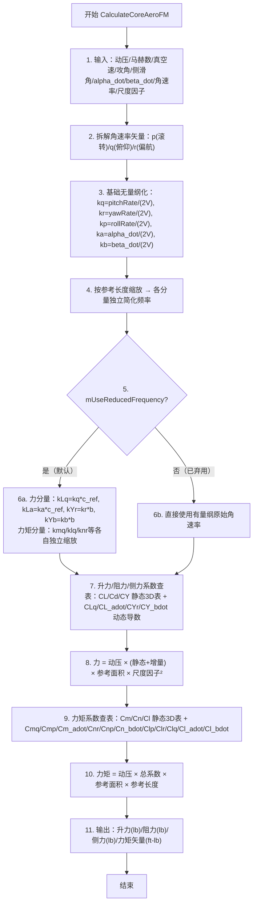

# 算法卡片 -- wsf_six_dof RigidBody 稳定性导数气动系数模型

> **状态**：draft
> **日期**：2026-06-11
> **索引证据**：function-index.jsonl (wsf_six_dof::RigidBodyAeroCoreObject), source/WsfRigidBodySixDOF_AeroCoreObject.hpp, source/WsfRigidBodySixDOF_AeroCoreObject.cpp, source/WsfSixDOF_AeroCoreObject.hpp
> **关联文档**：flight-dynamics-rigid-body-integrator-card.md, flight-dynamics-aero-coefficient-model-card.md (P6DOF 旧版参考)

### 基础资料

- **算法名称**：wsf_six_dof RigidBody Stability-Derivative Aerodynamic Coefficient Model（wsf_six_dof 刚体稳定性导数气动系数模型）
- **算法所属模块**：wsf_six_dof（点质/刚体六自由度飞行器运动学插件 -- 新模块）
- **算法功能**：基于飞行状态（马赫数、攻角、侧滑角、角速率、攻角变化率、侧滑角变化率），通过高维查表获取稳定性导数，将静态 3D 表项与动态阻尼增量线性叠加后乘以动压、参考面积和参考长度，得到有量纲六分量气动力（升力、阻力、侧力）和气动力矩（滚转/俯仰/偏航力矩）。支持简化频率（Reduced Frequency）无量纲化、显式参考面积和多种气动构型模态切换。与旧模块 P6DOF 对应类不同的是，此新模块去除 Legacy 导数模式，结构更清晰，且基类 AeroCoreObject 仅提供 CL/Cd/CY 三张静态 3D 表，子类 RigidBodyAeroCoreObject 额外管理 14 张动态导数表。

### 算法流程

整个算法流程图如下：



其中，第一步接收来自积分器的飞行状态参数；第二步将角速率矢量拆分到三轴；第三步使用基本公式 `rate/(2*V)` 对所有速率做初步无量纲化；第四步根据 `mUseRefArea` 选择弦长（俯仰）或翼展（滚转/偏航）乘以各自的无量纲基值得到简化频率；第五步检查是否启用简化频率模式（默认开启）；第六步完成缩放后的简化频率；第七步通过基类 AeroCoreObject 的 3D 表获取力静态系数、通过子类 RigidBodyAeroCoreObject 的 2D 表/1D 曲线获取动态导数并乘以对应简化频率得到增量（空表返回 0）；第八步用动压乘以参考面积和尺度因子平方转换为有量纲力；第九步通过子类 3D 表和 1D 曲线获取力矩静态系数和动态导数；第十步乘以参考长度转为有量纲力矩；第十一步设置输出。

### 算法变量和常量

1. 输入 (input)：

   | 英文标识符 (Symbol)      | 中文名称 (Name) | 数据类型 (Type)       | 含义 (Meaning)                   | 单位 (Units) | 所属函数 (Method)       |
   | ------------------- | ----------- | ----------------- | ------------------------------ | ---------- | ------------------- |
   | `aDynPress_lbsqft`  | 动压          | `double`          | 自由流动压 q_bar = 0.5*rho*V^2      | lb/ft^2    | CalculateCoreAeroFM |
   | `aMach`             | 马赫数         | `double`          | 飞行马赫数                          | 无量纲        | CalculateCoreAeroFM |
   | `aSpeed_fps`        | 真空速         | `double`          | 相对气流的真空速                       | ft/s       | CalculateCoreAeroFM |
   | `aAlpha_rad`        | 攻角          | `double`          | 体轴 x 与相对气流方向的夹角                | rad        | CalculateCoreAeroFM |
   | `aBeta_rad`         | 侧滑角         | `double`          | 体轴 y 与相对气流方向的夹角                | rad        | CalculateCoreAeroFM |
   | `aAlphaDot_rps`     | 攻角变化率       | `double`          | 攻角的时间导数                        | rad/s      | CalculateCoreAeroFM |
   | `aBetaDot_rps`      | 侧滑角变化率      | `double`          | 侧滑角的时间导数                       | rad/s      | CalculateCoreAeroFM |
   | `aAngularRates_rps` | 体轴角速率       | `const UtVec3dX&` | [rollRate, pitchRate, yawRate] 矢量 | rad/s      | CalculateCoreAeroFM |
   | `aRadiusSizeFactor` | 几何尺度因子      | `double`          | 缩放气动面的线性因子，默认 1.0                | 无量纲        | CalculateCoreAeroFM |
   | `aInput` (overload) | 输入数据流       | `UtInput&`        | 读取气动数据配置文件（翼面参数 + 20 张数据表）      | —          | ProcessInput        |

2. 输出 (output)：

   | 英文标识符 (Symbol)   | 中文名称 (Name) | 数据类型 (Type) | 含义 (Meaning)                              | 单位 (Units) | 所属函数 (Method)       |
   | ---------------- | ----------- | ----------- | ----------------------------------------- | ---------- | ------------------- |
   | `aMoment_ftlbs`  | 气动力矩矢量      | `UtVec3dX&` | [rollMoment, pitchMoment, yawMoment] 矢量   | ft-lb      | CalculateCoreAeroFM |
   | `aLift_lbs`      | 升力          | `double&`   | 垂直于相对气流方向的力                               | lb         | CalculateCoreAeroFM |
   | `aDrag_lbs`      | 阻力          | `double&`   | 平行于相对气流方向的力                               | lb         | CalculateCoreAeroFM |
   | `aSideForce_lbs` | 侧力          | `double&`   | 垂直于升阻平面的力                                 | lb         | CalculateCoreAeroFM |

3. 常量 (constant)：

   | 英文标识符 (Symbol)         | 中文名称 (Name)     | 数据类型 (Type)          | 含义 (Meaning)                                       | 单位 (Units) | 所属函数 (Method) |
   | ---------------------- | --------------- | -------------------- | -------------------------------------------------- | ---------- | ------------- |
   | `mWingChord_ft`        | 机翼弦长            | `double`             | 平均气动弦长（MAC），用于俯仰相关分量的无量纲化                          | ft         | ProcessInput  |
   | `mWingSpan_ft`         | 翼展              | `double`             | 机翼展长，用于滚转/偏航相关分量的无量纲化                              | ft         | ProcessInput  |
   | `mWingArea_sqft`       | 机翼面积            | `double`             | 机翼参考面积，用于所有力/力矩的有量纲化                               | ft^2       | ProcessInput  |
   | `mRefArea_sqft`        | 参考面积            | `double`             | 替代机翼面积的显式参考面积（启用 `mUseRefArea` 时生效）                | ft^2       | ProcessInput  |
   | `mRefLength_ft`        | 参考长度            | `double`             | sqrt(mRefArea_sqft)，显式替代弦长/展长用于无量纲化                 | ft         | ProcessInput  |
   | `mUseRefArea`          | 参考面积开关          | `bool`               | true 时用 mRefArea_sqft / mRefLength_ft 替代翼面参数     | 无量纲        | ProcessInput  |
   | `mUseReducedFrequency` | 简化频率开关          | `bool (true)`        | true 时用无量纲化频率替代有量纲角速率（默认开启）                       | 无量纲        | ProcessInput  |
   | `mSubModesList`        | 气动模态列表          | `list<CloneablePtr>` | 多构型气动参数表（如挂弹/空载/襟翼位置）的列表                          | —          | ProcessInput  |
   | `mAeroCenter_ft`       | 气动中心位置          | `UtVec3dX`           | 气动力/力矩的参考作用点                                       | ft         | ProcessInput  |
   | `mCL_AlphaBetaMachTablePtr` | 升力系数 3D 表     | `Table*`             | 基类 AeroCoreObject 的 CL(alpha, beta, Mach) 3D 表      | 无量纲        | ProcessInput  |
   | `mCd_AlphaBetaMachTablePtr` | 阻力系数 3D 表     | `Table*`             | 基类 AeroCoreObject 的 Cd(alpha, beta, Mach) 3D 表      | 无量纲        | ProcessInput  |
   | `mCY_AlphaBetaMachTablePtr` | 侧力系数 3D 表     | `Table*`             | 基类 AeroCoreObject 的 CY(alpha, beta, Mach) 3D 表      | 无量纲        | ProcessInput  |

### 关键数学公式

1. **简化频率（Reduced Frequency）-- 角速率无量纲化**：
   消除飞行器尺寸和飞行速度的量纲影响，将角速率和变化率转换为无量纲化频率。公式如下：
   $$k_q = \frac{q}{2V}, \quad k_r = \frac{r}{2V}, \quad k_p = \frac{p}{2V}$$
   $$k_{\dot{\alpha}} = \frac{\dot{\alpha}}{2V}, \quad k_{\dot{\beta}} = \frac{\dot{\beta}}{2V}$$
   其中：
   - $p, q, r$ 分别为体轴滚转角速率、俯仰角速率、偏航角速率，单位为 rad/s。
   - $\dot{\alpha}, \dot{\beta}$ 分别为攻角变化率、侧滑角变化率，单位为 rad/s。
   - $V$ 为真空速，单位为 ft/s，当 V<1 时取值下限为 1 ft/s（避免除零）。
   - 各分量再乘以各自的参考长度（俯仰相关：弦长 $c_{ref}$ 或 `mRefLength_ft`；偏航/滚转相关：翼展 $b$ 或 `mRefLength_ft`）。

2. **升力系数（含动态增量）**：
   升力由静态 3D 表加上俯仰阻尼升力和非定常延迟升力组成：
   $$C_{L\_total} = C_L(\alpha, \beta, M) + C_{L_q}(\alpha, M) \cdot k_{Lq} + C_{L_{\dot{\alpha}}}(\alpha, M) \cdot k_{La}$$
   有量纲升力：
   $$L = \bar{q} \cdot S_{ref} \cdot C_{L\_total} \cdot R^2$$
   其中：
   - $C_L(\alpha, \beta, M)$ 为升力系数静态 3D 表（基类 AeroCoreObject）。
   - $C_{L_q}(\alpha, M)$ 为俯仰阻尼升力导数 2D 表。
   - $C_{L_{\dot{\alpha}}}(\alpha, M)$ 为攻角延迟升力导数 2D 表。
   - $\bar{q}$ 为动压，单位为 lb/ft^2。
   - $S_{ref}$ 为参考面积（机翼面积或显式参考面积），单位为 ft^2。
   - $R$ 为几何尺度因子（`aRadiusSizeFactor`），代表气动面的线性尺寸。

3. **阻力系数**：
   阻力仅使用静态 3D 表，不含动态项：
   $$C_{d} = C_d(\alpha, \beta, M)$$
   有量纲阻力：
   $$D = \bar{q} \cdot S_{ref} \cdot C_d \cdot R^2$$

4. **侧力系数（含动态增量）**：
   侧力由静态项加上偏航速率引起的侧力和非定常侧滑延迟侧力：
   $$C_{Y\_total} = C_Y(\alpha, \beta, M) + C_{Y_r}(\beta, M) \cdot k_{Yr} + C_{Y_{\dot{\beta}}}(\beta, M) \cdot k_{Yb}$$
   有量纲侧力：
   $$Y = \bar{q} \cdot S_{ref} \cdot C_{Y\_total} \cdot R^2$$

5. **俯仰力矩系数（含交叉导数）**：
   $$C_{m\_total} = C_m(\alpha, \beta, M) + C_{m_q}(M) \cdot k_{mq} + C_{m_p}(M) \cdot k_{mp} + C_{m_{\dot{\alpha}}}(M) \cdot k_{ma}$$
   有量纲俯仰力矩：
   $$M_y = \bar{q} \cdot S_{ref} \cdot c_{ref} \cdot C_{m\_total}$$
   其中：
   - $C_{m_q}(M)$ 为俯仰阻尼导数（1D 曲线，仅取决于 Mach）。
   - $C_{m_p}(M)$ 为滚转-俯仰交叉导数（1D 曲线）。
   - $C_{m_{\dot{\alpha}}}(M)$ 为攻角延迟俯仰力矩导数（1D 曲线）。
   - $c_{ref}$ 为参考弦长，用于俯仰力矩的有量纲化。

6. **偏航力矩系数**：
   $$C_{n\_total} = C_n(\alpha, \beta, M) + C_{n_r}(M) \cdot k_{nr} + C_{n_p}(M) \cdot k_{np} + C_{n_{\dot{\beta}}}(M) \cdot k_{nb}$$
   有量纲偏航力矩：
   $$M_z = \bar{q} \cdot S_{ref} \cdot b \cdot C_{n\_total}$$

7. **滚转力矩系数（含最全面交叉导数）**：
   $$C_{l\_total} = C_l(\alpha, \beta, M) + C_{l_p}(M) \cdot k_{lp} + C_{l_r}(M) \cdot k_{lr} + C_{l_q}(M) \cdot k_{lq} + C_{l_{\dot{\alpha}}}(M) \cdot k_{la} + C_{l_{\dot{\beta}}}(M) \cdot k_{lb}$$
   有量纲滚转力矩：
   $$M_x = \bar{q} \cdot S_{ref} \cdot b \cdot C_{l\_total}$$

8. **参考面积 vs 机翼面积的选择**：
   当 `mUseRefArea = true` 时（即配置了 `ref_area_sqft`），所有 $S_{ref}$ 使用 `mRefArea_sqft`，所有参考长度使用 `mRefLength_ft = sqrt(mRefArea_sqft)`，用于简化非翼面飞行器（如导弹、降落伞）的建模。

### 算法伪代码

```
// === wsf_six_dof RigidBody 稳定性导数气动系数模型 ===
// 整体目标：给定飞行状态(alpha/beta/Mach/角速率)，通过高维查表和系数叠加计算六分量气动力/力矩

function CalculateCoreAeroFM(q_bar, Mach, V, alpha, beta, alpha_dot, beta_dot, omega_body, radius_factor):
    // 1. 拆解角速率矢量到三轴分量
    rollRate, pitchRate, yawRate = omega_body               // p, q, r (rad/s)

    // 2. 基础无量纲化：角速率/(2*V)，V 下限保护为 1 ft/s 防止除零
    speedSafe = max(V, 1.0)                                 // 保护下限 1 ft/s，防止除零
    kq = pitchRate / (2 * speedSafe)                        // 基础俯仰无量纲速率
    kr = yawRate   / (2 * speedSafe)                        // 基础偏航无量纲速率
    kp = rollRate  / (2 * speedSafe)                        // 基础滚转无量纲速率
    ka = alpha_dot / (2 * speedSafe)                        // 基础攻角变化率无量纲速率
    kb = beta_dot  / (2 * speedSafe)                        // 基础侧滑角变化率无量纲速率

    // 3. 按参考长度缩放 —— 力分量各自选择纵向/横向参考长度
    kLq = kq; kLa = ka; kYr = kr; kYb = kb                 // 力分量初始化为基值
    if UseRefArea:
        kLq *= refLength; kLa *= refLength                   // 俯仰相关力分量用参考长度缩放
        kYr *= refLength; kYb *= refLength                   // 偏航相关力分量用参考长度缩放
    else:
        kLq *= wingChord; kLa *= wingChord                   // 俯仰相关力分量用弦长缩放
        kYr *= wingSpan;  kYb *= wingSpan                    // 偏航相关力分量用翼展缩放

    if Not UseReducedFrequency:
        kLq = pitchRate; kLa = alpha_dot                     // 已弃用：直接使用原始角速率
        kYr = yawRate;   kYb = beta_dot

    // 4. === 升力 + 阻力 + 侧力系数查表 ===
    CL       = CL_AlphaBetaMach(Mach, alpha, beta)           // 升力静态项（基类3D表）
    CLq      = CLq_AlphaMach(Mach, alpha) * kLq              // 俯仰阻尼升力增量（子类2D表）
    CL_adot  = CL_AlphaDotAlphaMach(Mach, alpha) * kLa       // 攻角延迟升力增量（子类2D表）
    Cd       = Cd_AlphaBetaMach(Mach, alpha, beta)           // 阻力静态项（基类3D表，无动态项）
    CY       = CY_AlphaBetaMach(Mach, alpha, beta)           // 侧力静态项（基类3D表）
    CYr      = CYr_BetaMach(Mach, beta) * kYr               // 偏航速率侧力增量（子类2D表）
    CY_bdot  = CY_BetaDotBetaMach(Mach, beta) * kYb         // 侧滑延迟侧力增量（子类2D表）

    // 面积缩放因子：半径因子的平方（适用于降落伞/气球等非翼面气动体）
    areaFactor = radius_factor * radius_factor

    if UseRefArea:                                            // 使用显式参考面积模式
        lift      = q_bar * (CL + CLq + CL_adot) * refArea * areaFactor
        drag      = q_bar * Cd * refArea * areaFactor
        sideForce = q_bar * (CY + CYr + CY_bdot) * refArea * areaFactor
    else:                                                     // 使用机翼面积模式
        lift      = q_bar * (CL + CLq + CL_adot) * wingArea * areaFactor
        drag      = q_bar * Cd * wingArea * areaFactor
        sideForce = q_bar * (CY + CYr + CY_bdot) * wingArea * areaFactor

    // 5. === 力矩：准备各分量的独立简化频率 ===
    kmq = kq; kma = ka; kmp = kp                              // 俯仰力矩用基值
    klq = kq; kla = ka; klr = kr; klb = kb; klp = kp           // 滚转力矩用基值
    knr = kr; knb = kb; knp = kp                               // 偏航力矩用基值

    if UseRefArea:
        kmq*=refLength; kma*=refLength; kmp*=refLength         // 俯仰：统一用参考长度
        klq*=refLength; kla*=refLength; klr*=refLength           // 滚转：统一用参考长度
        klb*=refLength; klp*=refLength
        knr*=refLength; knb*=refLength; knp*=refLength           // 偏航：统一用参考长度
    else:
        kmq*=wingChord; kma*=wingChord; kmp*=wingChord          // 俯仰：用弦长
        klq*=wingSpan;  kla*=wingSpan;  klr*=wingSpan             // 滚转：用翼展
        klb*=wingSpan;  klp*=wingSpan
        knr*=wingSpan;  knb*=wingSpan;  knp*=wingSpan             // 偏航：用翼展

    if Not UseReducedFrequency:
        kmq=pitchRate; kma=alpha_dot; kmp=rollRate              // 已弃用：直接用有量纲值
        klq=pitchRate; kla=alpha_dot; klr=yawRate; klb=beta_dot; klp=rollRate
        knr=yawRate;   knb=beta_dot;  knp=rollRate

    // 6. === 力矩系数：查表 + 无量纲速率 × 导数 ===
    Cm         = Cm_AlphaBetaMach(Mach, alpha, beta)          // 俯仰力矩静态3D表
    CmQ        = Cmq_Mach(Mach) * kmq                         // 俯仰阻尼（1D曲线 × 俯仰简化频率）
    CmP        = Cmp_Mach(Mach) * kmp                         // 滚转-俯仰交叉（1D曲线 × 滚转简化频率）
    Cm_adot    = CmAlphaDotMach(Mach) * kma                   // 攻角延迟俯仰力矩（1D曲线）

    Cn         = Cn_AlphaBetaMach(Mach, alpha, beta)          // 偏航力矩静态3D表
    CnR        = Cnr_Mach(Mach) * knr                         // 偏航阻尼（1D曲线）
    CnP        = Cnp_Mach(Mach) * knp                         // 滚转-偏航交叉（1D曲线）
    Cn_bdot    = CnBetaDotMach(Mach) * knb                    // 侧滑延迟偏航力矩（1D曲线）

    Cl         = Cl_AlphaBetaMach(Mach, alpha, beta)          // 滚转力矩静态3D表
    ClP        = Clp_Mach(Mach) * klp                         // 滚转阻尼（1D曲线）
    ClR        = Clr_Mach(Mach) * klr                         // 偏航-滚转交叉（1D曲线）
    ClQ        = Clq_Mach(Mach) * klq                         // 俯仰-滚转交叉（1D曲线）
    Cl_adot    = Cl_AlphaDotMach(Mach) * kla                  // 攻角延迟滚转力矩（1D曲线）
    Cl_bdot    = Cl_BetaDotMach(Mach) * klb                   // 侧滑延迟滚转力矩（1D曲线）

    // 7. === 有量纲力矩：总系数 × 动压 × 面积 × 参考长度 ===
    if UseRefArea:
        rollMoment  = q_bar * (Cl+ClP+ClR+ClQ+Cl_adot+Cl_bdot) * refArea
        pitchMoment = q_bar * (Cm+CmQ+CmP+Cm_adot) * refArea
        yawMoment   = q_bar * (Cn+CnR+CnP+Cn_bdot) * refArea
    else:
        rollMoment  = q_bar * (Cl+ClP+ClR+ClQ+Cl_adot+Cl_bdot) * wingArea * wingSpan
        pitchMoment = q_bar * (Cm+CmQ+CmP+Cm_adot) * wingArea * wingChord
        yawMoment   = q_bar * (Cn+CnR+CnP+Cn_bdot) * wingArea * wingSpan

    moment = [rollMoment, pitchMoment, yawMoment]            // 力矩矢量 (ft-lb)
    return lift, drag, sideForce, moment
```

### 源码使用说明

#### 入口和调用链

```
// 从刚体积分器 CalculateFM() → 飞行器气动接口 → 气动系数模型求值
WsfRigidBodySixDOF_Integrator::CalculateFM()                      // 力/力矩汇总 — 积分器每帧调用
  → 飞行状态更新（α/β/Mach/q_bar）
  → RigidBodyAeroCoreObject::CalculateCoreAeroFM(                  // 气动系数模型主入口 — 稳定性导数法
      q_bar, Mach, V, α, β, α̇, β̇, ω_vec, moment, lift, drag, side, ...)
    → 拆分角速率 → 计算简化频率
    → AeroCoreObject::CL_AlphaBetaMach(Mach, α, β)       // 基类 升力静态 3D 表
    → AeroCoreObject::Cd_AlphaBetaMach(Mach, α, β)       // 基类 阻力静态 3D 表
    → AeroCoreObject::CY_AlphaBetaMach(Mach, α, β)       // 基类 侧力静态 3D 表
    → RigidBodyAeroCoreObject::CLq_AlphaMach(Mach, α)     // 子类 俯仰阻尼升力 2D 表
    → RigidBodyAeroCoreObject::CL_AlphaDotAlphaMach(...)  // 子类 攻角延迟升力 2D 表
    → RigidBodyAeroCoreObject::CYr_BetaMach(Mach, β)      // 子类 偏航速率侧力 2D 表
    → RigidBodyAeroCoreObject::CY_BetaDotBetaMach(...)    // 子类 侧滑延迟侧力 2D 表
    → RigidBodyAeroCoreObject::Cm_AlphaBetaMach(...)      // 子类 俯仰力矩静态 3D 表
    → RigidBodyAeroCoreObject::Cmq_Mach(Mach)             // 子类 俯仰阻尼 1D 曲线
    → RigidBodyAeroCoreObject::Cmp_Mach(Mach)             // 子类 滚转-俯仰交叉 1D 曲线
    → RigidBodyAeroCoreObject::CmAlphaDotMach(Mach)       // 子类 攻角延迟俯仰力矩 1D 曲线
    → RigidBodyAeroCoreObject::Cn_AlphaBetaMach(...)      // 子类 偏航力矩静态 3D 表
    → RigidBodyAeroCoreObject::Cnr_Mach(Mach)             // 子类 偏航阻尼 1D 曲线
    → RigidBodyAeroCoreObject::Cnp_Mach(Mach)             // 子类 滚转-偏航交叉 1D 曲线
    → RigidBodyAeroCoreObject::CnBetaDotMach(Mach)        // 子类 侧滑延迟偏航力矩 1D 曲线
    → RigidBodyAeroCoreObject::Cl_AlphaBetaMach(...)      // 子类 滚转力矩静态 3D 表
    → RigidBodyAeroCoreObject::Clp_Mach(Mach)             // 子类 滚转阻尼 1D 曲线
    → RigidBodyAeroCoreObject::Clr_Mach(Mach)             // 子类 偏航-滚转交叉 1D 曲线
    → RigidBodyAeroCoreObject::Clq_Mach(Mach)             // 子类 俯仰-滚转交叉 1D 曲线
    → RigidBodyAeroCoreObject::Cl_AlphaDotMach(Mach)      // 子类 攻角延迟滚转 1D 曲线
    → RigidBodyAeroCoreObject::Cl_BetaDotMach(Mach)       // 子类 侧滑延迟滚转 1D 曲线
    → 静态项 + 增量叠加 → × 动压 × 面积 × 参考长度 → 有量纲力/力矩

// 初始化阶段：从配置文件读取气动数据
RigidBodyAeroCoreObject::ProcessInput(aInput)                     // 解析 aero_data 配置块
  → ProcessCommonInput(aInput, command, this)                     // 静态方法，解析 25+ 种气动命令
    → 读取 wing_chord_ft / wing_span_ft / wing_area_sqft         // 翼面几何参数
    → 读取 ref_area_sqft → mRefLength_ft = sqrt(...)              // 显式参考面积时自动计算参考长度
    → 读取 aero_center_x / y / z                                  // 气动中心位置
    → 读取 CL_AlphaBetaMach / Cd_AlphaBetaMach / CY_AlphaBetaMach // 基类 3D 表
    → 读取 CLq/CL_AlphaDot/CYr/CY_BetaDot 等导数表              // 子类动态导数表
    → 读取 Cm/Cmq/Cmp/CmAlphaDot 等力矩导数表                     // 子类力矩表
    → 读取 Cn/Cnr/Cnp/CnBetaDot 等偏航力矩导数表                   // 子类偏航力矩表
    → 读取 Cl/Clp/Clr/Clq/Cl_AlphaDot/Cl_BetaDot 等滚转导数表     // 子类滚转力矩表
    → 读取 use_reduced_frequency 标志                              // 简化频率开关
  → 解析 aero_mode 子块 → 创建子模态 CloneablePtr              // 多构型支持
  → Initialize()                                                  // 空实现，仅返回 true
```

#### 源码位置

| File | Symbol | Lines | Evidence level | 中文说明 |
| ---- | ------ | ----- | -------------- | -------- |
| [WsfRigidBodySixDOF_AeroCoreObject.hpp](source_root/src/wsf_plugins/wsf_six_dof/source/WsfRigidBodySixDOF_AeroCoreObject.hpp) | `RigidBodyAeroCoreObject` (class) | 27-181 | source-cited | 刚体气动核心对象全量 -- 14 个导数查表函数 + 翼面几何参数 + 模态切换 |
| [WsfRigidBodySixDOF_AeroCoreObject.hpp](source_root/src/wsf_plugins/wsf_six_dof/source/WsfRigidBodySixDOF_AeroCoreObject.hpp) | `CalculateCoreAeroFM()` | 51-63 | source-cited | 气动力/力矩主计算函数声明 -- 11 个输入参数 -> 4 个输出 |
| [WsfRigidBodySixDOF_AeroCoreObject.hpp](source_root/src/wsf_plugins/wsf_six_dof/source/WsfRigidBodySixDOF_AeroCoreObject.hpp) | `ProcessInput()` / `Initialize()` | 38-40 | source-cited | 初始化和配置输入接口 |
| [WsfRigidBodySixDOF_AeroCoreObject.hpp](source_root/src/wsf_plugins/wsf_six_dof/source/WsfRigidBodySixDOF_AeroCoreObject.hpp) | 14 个查表函数（`CLq_AlphaMach()` 等） | 88-115 | source-cited | 各稳定性导数查表函数声明 |
| [WsfRigidBodySixDOF_AeroCoreObject.cpp](source_root/src/wsf_plugins/wsf_six_dof/source/WsfRigidBodySixDOF_AeroCoreObject.cpp) | `ProcessInput()` | 27-72 | source-cited | 解析 aero_data 和 aero_mode 配置块 |
| [WsfRigidBodySixDOF_AeroCoreObject.cpp](source_root/src/wsf_plugins/wsf_six_dof/source/WsfRigidBodySixDOF_AeroCoreObject.cpp) | `ProcessCommonInput()` | 74-432 | source-cited | 解析 25+ 种气动数据命令（翼面几何 + 20+ 张导数表加载） |
| [WsfRigidBodySixDOF_AeroCoreObject.cpp](source_root/src/wsf_plugins/wsf_six_dof/source/WsfRigidBodySixDOF_AeroCoreObject.cpp) | `Initialize()` | 434-437 | source-cited | 空实现，仅返回 true |
| [WsfRigidBodySixDOF_AeroCoreObject.cpp](source_root/src/wsf_plugins/wsf_six_dof/source/WsfRigidBodySixDOF_AeroCoreObject.cpp) | `CalculateCoreAeroFM()` | 747-951 | source-cited | 主计算函数 -- 简化频率 -> 系数叠加 -> 有量纲力/力矩全流程 |
| [WsfRigidBodySixDOF_AeroCoreObject.cpp](source_root/src/wsf_plugins/wsf_six_dof/source/WsfRigidBodySixDOF_AeroCoreObject.cpp) | 各查表函数（14 个） | 469-671 | source-cited | 每个函数的实现：空表返回 0 + UtTable 查表 |
| [WsfRigidBodySixDOF_AeroCoreObject.cpp](source_root/src/wsf_plugins/wsf_six_dof/source/WsfRigidBodySixDOF_AeroCoreObject.cpp) | `SetModeName()` / `GetSubModeByName()` | 444-467 | source-cited | 气动模态切换接口 |
| [WsfSixDOF_AeroCoreObject.hpp](source_root/src/wsf_plugins/wsf_six_dof/source/WsfSixDOF_AeroCoreObject.hpp) | `AeroCoreObject` (class) | 34-78 | source-cited | 基类 -- CL/Cd/CY 三张静态 3D 表 |

#### 框架依赖

| AFSIM 原始依赖 | 依赖类型 | 替换方案 |
| ------------ | ---- | ---- |
| `UtTable::Table` | 高维查表引擎 | 自定义多维插值引擎（支持 2D/3D 线性插值） |
| `UtTable::Curve` | 1D 曲线查表 | 自定义 1D 插值（线性/Akima/Cubic Spline） |
| `UtInput` / `UtInputBlock` | 配置文件解析 | 自定义 JSON/YAML/TOML 解析器 |
| `UtVec3dX` | 三维矢量 | Eigen::Vector3d |
| `UtCloneablePtr` | 智能指针（深拷贝） | std::unique_ptr/std::shared_ptr |
| `UtMath::cRAD_PER_DEG/cDEG_PER_RAD/cPI/cFT_PER_M` | 数学和单位转换常数 | 直接硬编码 |

#### 测试和验证计划

1. **零攻角零侧滑角对称性测试**：对称飞行器（alpha=0, beta=0, 所有角速率=0）下，升力/侧力/俯仰/偏航/滚转力矩均应为零或接近零（仅阻力非零）。
2. **简化频率量纲正确性**：改变翼展/弦长/飞行速度，验证无量纲化后系数不变（仅几何和动压缩放影响有量纲力）。
3. **空表保护测试**：不加载任何气动表（所有表指针为 null），验证返回零力/力矩而不崩溃。
4. **多模态构型切换测试**：预设两个模态（如内部挂载-零气动、自由飞行-标准气动），验证切换模态后气动力正确变化。
5. **面积缩放因子测试**：将 `aRadiusSizeFactor` 设为 2.0，验证力变为原来的 4 倍（面积随半径的平方缩放）。
6. **参考面积 vs 机翼面积**：启用 `ref_area_sqft` 后对同一飞行条件比较两种面积模式下的力/力矩，确认缩放关系正确（力矩参考长度从 sqrt(refArea) 计算）。

#### 可移植性评分

**可移植性**：中

**原因**：

1. 稳定性导数法是航空航天工程的标准方法，所有数学公式（静态项+动态阻尼+非定常增量叠加）完全可移植到任何语言。
2. 简化频率（Reduced Frequency）是标准无量化技术，文献记载充分，移植时可直接使用原公式。
3. 核心计算逻辑（`CalculateCoreAeroFM`）不包含任何平台特定代码，仅依赖基本数学运算和查表。
4. 查表引擎 `UtTable::Table` 和 `UtTable::Curve` 属于 AFSIM 框架专属类，移植时需替换为自有多维插值库。
5. 与旧模块 P6DOF 相比，此新模块已移除 Legacy 导数模式（alpha-only, deg/s），代码更干净，减少移植时需要适配的代码路径。
6. 气动数据表本身是飞行器特有的机密数据（通常来自风洞试验或 CFD），不能直接搬运。移植后需用户自行提供数据表。
7. 单位体系为 Imperial（lb, ft, slug, sqft），移植时建议统一为 SI（N, m, kg, m^2）。
8. 继承结构（AeroCoreObject 基类 + RigidBodyAeroCoreObject 子类）清晰，核心计算都在 `CalculateCoreAeroFM` 一个函数中（约 200 行），方便一次性移植。
