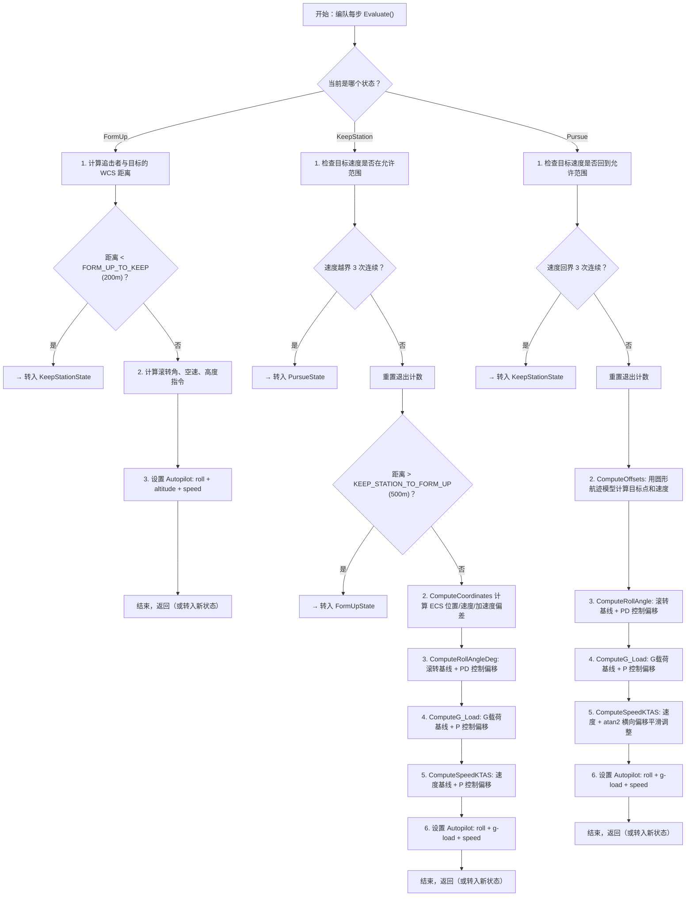

# 算法卡片 -- 编队汇合/位置保持/追击三状态机动控制

> **状态**：draft
> **日期**：2026-06-24
> **索引证据**：function-index.jsonl (FormUpState, KeepStationState, PursueState / FormationPursueState)
> **关联文档**：flight-dynamics-autopilot-pid-card.md, flight-dynamics-p6dof-heun-integrator-card.md, flight-dynamics-rigid-body-integrator-card.md
> **关联源文件**：`StationKeepingState.hpp/.cpp`（wsf_p6dof）、`WsfSixDOF_StationKeepingState.hpp/.cpp`（wsf_six_dof）

### 基础资料

- **算法名称**：Formation Form-Up / Station Keeping / Pursue Three-State Maneuver Control（编队汇合/位置保持/追击三状态机动控制）
- **算法所属模块**：wsf_p6dof（拟六自由度旧模块）和 wsf_six_dof（点质/刚体六自由度新模块）
- **算法功能**：实现编队飞行中追击者（chaser）相对于目标点（target station）的自主三状态运动控制。状态机在三个状态间自动切换：(1) **FormUp（汇合）**—从远距离飞向目标位置，使用方位角或 ECS 坐标偏差的 PD 控制律输出滚转角和速度指令；(2) **KeepStation（位置保持）**—在目标位置上精细保持，基于 ECS 坐标系的三维位置/速度/加速度偏差输出滚转角、G载荷和速度指令；(3) **Pursue（追击）**—当目标点运动超出追击者速度范围时，使用圆形航迹模型（turn circle）计算预期位置和速度，驱动追击者回到允许速度范围。两个模块的实现算法几乎一致，仅命名空间和类名后缀不同。

### 算法流程

整个算法流程图如下：



其中，三个状态构成完整编队控制回路：(1) **FormUp** 是"粗调"阶段——从远距离（>200m）将追击者带到目标附近，评估间隔为 1.0s；(2) **KeepStation** 是"精调"阶段——在近距离用 0.1s 高频评估维持位置，追踪位置的 P 分量（当前位置偏差）、D 分量（速度差防过冲）和 DD 分量（加速度差阻尼）；(3) **Pursue** 是"极端机动"阶段——当目标速度超出允许范围时，追击者沿圆形航迹跟随目标以减小速度差，评估间隔为 1.0s。

### 算法变量和常量映射表

1. 输入变量(input)：

   | # | 中文名称(Name) | 代码标识(Symbol) | 数学符号(Math-sym) | 数据类型(Type) | 含义(Meaning) | 单位(Units) | 所属函数(Method) |
   |---| ---- | ---- | ---- | --- | ---- | --- |
   | 1 | 追击者 WCS 位置 | `mData.mChaserLocWCS` | $\mathbf{r}_c$ | `UtVec3d` | 追击者在地心固连坐标系中的当前位置 | 米(m) | `KeepStationState::Evaluate` / `FormUpState::Evaluate` |
   | 2 | 目标 WCS 动力学数据 | `mData.mKinematics` | `Kinematics` | `struct` | 目标的完整运动状态（位置/速度/加速度/姿态/G载荷） | 混合 | `KeepStationState::Evaluate` / `FormUpState::Evaluate` |
   | 3 | WCS 分离矢量 | `mData.mSeparationWCS` | $\mathbf{d}$ | `UtVec3d` | 追击者到目标的 WCS 位移矢量 | 米(m) | `FormUpState::Evaluate` |
   | 4 | 追击者平台指针 | `mData.mChaserPlatformPtr` | — | `WsfPlatform*` | 用于查询追击者速度和加速度的接口 | — | `KeepStationState::ComputeCoordinates` |

2. 输出变量(output)：

   | # | 中文名称(Name) | 代码标识(Symbol) | 数学符号(Math-sym) | 数据类型(Type) | 含义(Meaning) | 单位(Units) | 所属函数(Method) |
   |---| ---- | ---- | ---- | --- | ---- | --- |
   | 1 | 自驾驶仪滚转角指令 | `rollAngle_deg` | $\phi_{\text{cmd}}$ | `double` | 输出到自动驾驶仪的滚转角指令 | 度(°) | `KeepStationState::ComputeRollAngleDeg` / `FormUpState::ComputeRollAngleDeg` / `PursueState::ComputeRollAngle` |
   | 2 | 自驾驶仪 G载荷指令 | `gLoad` | $n_z$ | `double` | 输出到自动驾驶仪的纵向 G 载荷指令 | g 倍数 | `KeepStationState::ComputeG_Load` |
   | 3 | 自驾驶仪空速指令 | `speed_ktas` | $V_{\text{cmd}}$ | `double` | 输出到自动驾驶仪的空速指令 | 节(KTAS) | `KeepStationState::ComputeSpeedKTAS` / `FormUpState::ComputeSpeedKTAS` |
   | 4 | 自驾驶仪高度指令 | `altitude_ft` | $h_{\text{cmd}}$ | `double` | 仅 FormUp 阶段输出到自动驾驶仪的高度指令 | 英尺(ft) | `FormUpState::Evaluate` |
   | 5 | 转入新状态指针 | `retvalPtr` | — | `unique_ptr<RelativeManeuverState>` | 状态转移时返回的新状态对象；nullptr 表示保持当前状态 | — | `FormUpState::Evaluate` / `KeepStationState::Evaluate` / `PursueState::Evaluate` |

3. 参数变量(parameters)：

   | # | 中文名称(Name) | 代码标识(Symbol) | 数学符号(Math-sym) | 数据类型(Type) | 含义(Meaning) | 单位(Units) | 所属函数(Method) |
   |---| ---- | ---- | ---- | --- | ---- | --- |
   | 1 | 最大允许 G载荷 | `mManeuver.GetG_LoadMax()` | $n_{z,\text{max}}$ | `double` | 机动允许的最大 G载荷，用于限制滚转角 | g 倍数 | `FormUpState::ComputeRollAngleDeg` |
   | 2 | 最小允许速度 | `mManeuver.GetSpeedMpsMin()` | $V_{\text{min}}$ | `double` | 机动允许的最小空速 | 米/秒(m/s) | `FormUpState::ComputeSpeedKTAS` |
   | 3 | 最大允许速度 | `mManeuver.GetSpeedMpsMax()` | $V_{\text{max}}$ | `double` | 机动允许的最大空速 | 米/秒(m/s) | `FormUpState::ComputeSpeedKTAS` |

4. 状态变量(state variables)：

   | # | 中文名称(Name) | 代码标识(Symbol) | 数学符号(Math-sym) | 数据类型(Type) | 含义(Meaning) | 单位(Units) | 所属函数(Method) | 初始值(Initial-val) | 更新时机(Update-tim) |
   |---| ---- | ---- | ---- | --- | ---- | --- |
   | 1 | 退出计数 | `mExitCount` | $c_{\text{exit}}$ | `int` | 连续满足退出条件的次数，用于防抖（3次才执行转移） | 次数 | `KeepStationState::Evaluate` / `PursueState::Evaluate` | 0 | 每次 `Evaluate()` 调用更新 |
   | 2 | ECS 位置偏差 | `mDeltaLoc` | $\Delta\mathbf{r}_{\text{ECS}}$ | `UtVec3d` | 追击者到目标在追击者 ECS 坐标系的位置偏差（仅在 Pursue 状态持久化） | 米(m) | `PursueState::ComputeOffsets` | {0,0,0} | 每次 `Evaluate()` 调用 ComputeOffsets 更新 |
   | 3 | ECS 速度偏差 | `mDeltaVel` | $\Delta\mathbf{v}_{\text{ECS}}$ | `UtVec3d` | 追击者到目标在 ECS 坐标系的速度偏差（仅在 Pursue 状态持久化） | 米/秒(m/s) | `PursueState::ComputeOffsets` | {0,0,0} | 每次 `Evaluate()` 调用 ComputeOffsets 更新 |

5. 常量(constant)：

   | # | 中文名称(Name) | 代码标识(Symbol) | 数学符号(Math-sym) | 数据类型(Type) | 含义(Meaning) | 单位(Units) | 所属函数(Method) |
   |---| ---- | ---- | ---- | --- | ---- | --- |
   | 1 | 位置保持→汇合距离阈值 | `cKEEP_STATION_TO_FORM_UP_DISTANCE` | $d_{K\to F}$ | `double` | 500.0 | 米(m) | `KeepStationState::Evaluate` |
   | 2 | 位置保持评估间隔 | `cKEEP_STATION_DELTA_T` | $\Delta t_{KS}$ | `double` | 0.1 | 秒(s) | `KeepStationState::GetEvaluationInterval` |
   | 3 | G载荷 P 增益 (位置保持) | `cKEEP_STATION_GLOAD_ALPHA` | $\alpha_{g}$ | `double` | 0.05 | m⁻¹ | `KeepStationState::ComputeG_Load` |
   | 4 | G载荷 D 增益 (位置保持) | `cKEEP_STATION_GLOAD_BETA` | $\beta_{g}$ | `double` | 0.1 | s/m | `KeepStationState::ComputeG_Load` |
   | 5 | 滚转角 P 增益 (位置保持) | `cKEEP_STATION_ROLL_ALPHA` | $\alpha_{\phi}$ | `double` | 0.7 | 度/m (°/m) | `KeepStationState::ComputeRollAngleDeg` |
   | 6 | 滚转角 D 增益 (位置保持) | `cKEEP_STATION_ROLL_BETA` | $\beta_{\phi}$ | `double` | 3.0 | 度·s/m (°·s/m) | `KeepStationState::ComputeRollAngleDeg` |
   | 7 | 滚转角 DD 增益 (位置保持) | `cKEEP_STATION_ROLL_GAMMA` | $\gamma_{\phi}$ | `double` | 6.0 | 度·s²/m (°·s²/m) | `KeepStationState::ComputeRollAngleDeg` |
   | 8 | 速度 P 增益 (位置保持) | `cKEEP_STATION_SPEED_ALPHA` | $\alpha_{V}$ | `double` | 0.5 | s⁻¹ | `KeepStationState::ComputeSpeedKTAS` |
   | 9 | 速度 D 增益 (位置保持) | `cKEEP_STATION_SPEED_BETA` | $\beta_{V}$ | `double` | 1.0 | 无量纲 | `KeepStationState::ComputeSpeedKTAS` |
   | 10 | 速度 DD 增益 (位置保持) | `cKEEP_STATION_SPEED_GAMMA` | $\gamma_{V}$ | `double` | 5.0 | s | `KeepStationState::ComputeSpeedKTAS` |
   | 11 | 位置保持→追击转移计数 | `cKEEP_STATION_HITS_TO_PURSUE` | — | `int` | 3 | 次数 | `KeepStationState::Evaluate` |
   | 12 | 汇合→位置保持距离阈值 | `cFORM_UP_TO_KEEP_STATION_DISTANCE` | $d_{F\to K}$ | `double` | 200.0 | 米(m) | `FormUpState::Evaluate` |
   | 13 | 汇合逼近距离 | `cFORM_UP_CLOSING_DISTANCE` | $d_{\text{close}}$ | `double` | 3000.0 | 米(m) | `FormUpState::ComputeRollAngleDeg` |
   | 14 | 汇合速度对齐余弦阈值 | `cFORM_UP_CLOSING_COSTHETA` | $\cos\theta_{\text{close}}$ | `double` | 0.4 | 无量纲 | `FormUpState::ComputeRollAngleDeg` |
   | 15 | 汇合评估间隔 | `cFORM_UP_DELTA_T` | $\Delta t_{FU}$ | `double` | 1.0 | 秒(s) | `FormUpState::GetEvaluationInterval` |
   | 16 | 汇合滚转角距离增益因子 | `cFORM_UP_ROLL_ALPHA_SCALING` | $\alpha_{\text{scale}}$ | `double` | 5e-4 | m⁻¹ | `FormUpState::ComputeRollAngleDeg` |
   | 17 | 汇合滚转角 P 增益因子 | `cFORM_UP_CLOSING_ALPHA_FACTOR` | $\alpha_{\text{FU}}$ | `double` | 1.0e-3 | 无量纲 | `FormUpState::ComputeRollAngleDeg` |
   | 18 | 追击评估间隔 | `cPURSUE_DELTA_T` | $\Delta t_{P}$ | `double` | 1.0 | 秒(s) | `PursueState::GetEvaluationInterval` |
   | 19 | 追击滚转角 P 增益 | `cPURSUE_ROLL_ALPHA` | $\alpha_{P,\phi}$ | `double` | 0.2 | 度/m (°/m) | `PursueState::ComputeRollAngle` |
   | 20 | 追击滚转角 D 增益 | `cPURSUE_ROLL_BETA` | $\beta_{P,\phi}$ | `double` | 3.0 | 度·s/m (°·s/m) | `PursueState::ComputeRollAngle` |
   | 21 | 追击速度范围 | `cPURSUE_SPEED_RANGE` | $\Delta V_P$ | `double` | 5.0 | 米/秒(m/s) | `PursueState::ComputeSpeedKTAS` |
   | 22 | 追击速度平滑因子 | `cPURSUE_SPEED_FACTOR` | $L_P$ | `double` | 100.0 | 米(m) | `PursueState::ComputeSpeedKTAS` |
   | 23 | 追击→位置保持转移计数 | `cPURSUE_HITS_TO_KEEP_STATION` | — | `int` | 3 | 次数 | `PursueState::Evaluate` |
   | 24 | 弧度转度系数 | `UtMath::cDEG_PER_RAD` | $180/\pi$ | `double` | ≈57.2958 | 无量纲 | 多处使用 |
   | 25 | 米/秒→节系数 | `UtMath::cNMPH_PER_MPS` | — | `double` | ≈1.94384 | kn/(m/s) | 多处使用 |

### 关键数学公式

#### 一、KeepStation 状态（位置保持核心控制律）

1. **ECS 坐标系偏差计算（ComputeCoordinates）**：
    将追击者和目标的位置/速度/加速度差值从 WCS 坐标系转换到目标 ECS 坐标系（ECS = Entity Coordinate System，实体的东-北-天框架），公式如下：
    $$\Delta\mathbf{r}_{\text{ECS}} = T_{\text{WCS}\to\text{ECS}}(\mathbf{r}_c - \mathbf{r}_t)$$
    $$\Delta\mathbf{v}_{\text{ECS}} = T_{\text{WCS}\to\text{ECS}}(\mathbf{v}_c - \mathbf{v}_t)$$
    $$\Delta\mathbf{a}_{\text{ECS}} = T_{\text{WCS}\to\text{ECS}}(\mathbf{a}_c - \mathbf{a}_t)$$
    其中：
    - $T_{\text{WCS}\to\text{ECS}}$ 是由目标实体姿态确定的 WCS→ECS 旋转矩阵。
    - $\mathbf{r}_c$ 为追击者 WCS 位置，$\mathbf{r}_t$ 为目标 WCS 位置，单位为米(m)。
    - $\mathbf{v}_c$、$\mathbf{v}_t$ 为 WCS 速度，单位为米/秒(m/s)。
    - $\mathbf{a}_c$、$\mathbf{a}_t$ 为 WCS 加速度，单位为米/秒²(m/s²)。
    - ECS 坐标 X=目标前方，Y=目标右侧，Z=目标下方。

2. **滚转角控制律（ComputeRollAngleDeg）**：
    以目标滚转角为基线，叠加位置/速度/加速度三个偏差分量的线性组合（P + D + DD 控制律），公式如下：
    $$\phi_{\text{cmd}} = \phi_t - \alpha_{\phi} \cdot \Delta r_{Y} - \beta_{\phi} \cdot \Delta v_{Y} - \gamma_{\phi} \cdot \Delta a_{Y}$$
    其中：
    - $\phi_{\text{cmd}}$ 为输出滚转角指令，单位为度(°)。
    - $\phi_t$ 为目标当前滚转角（从 `mKinematics.mAnglesNED[2]` 获取并转为度），单位为度(°)。
    - $\Delta r_{Y}$ 为 ECS 坐标系 Y 轴（横向）位置偏差，单位为米(m)。
    - $\Delta v_{Y}$ 为 ECS 坐标系 Y 轴速度偏差，单位为米/秒(m/s)。
    - $\Delta a_{Y}$ 为 ECS 坐标系 Y 轴加速度偏差，单位为米/秒²(m/s²)。
    - $\alpha_{\phi}$ = 0.7 °/m，$\beta_{\phi}$ = 3.0 °·s/m，$\gamma_{\phi}$ = 6.0 °·s²/m 为经验增益常数。
    - 物理意义：当追击者在目标右侧时（$\Delta r_Y > 0$），$\phi_{\text{cmd}}$ 减小→向左滚转→向左转弯纠正横向偏差。

3. **G载荷控制律（ComputeG_Load）**：
    以目标 G载荷为基线，根据纵向（ECS Z 轴）位置和速度偏差调整俯仰，公式如下：
    $$n_{z,\text{cmd}} = n_{z,t} + \alpha_{g} \cdot \Delta r_{Z} + \beta_{g} \cdot \Delta v_{Z}$$
    $$n_{z,\text{cmd}}' = \text{clamp}(n_{z,\text{cmd}}, n_{z,\text{min}}, n_{z,\text{max}})$$
    其中：
    - $n_{z,\text{cmd}}$ 为输出 G载荷指令（经限幅后），单位为 g 倍数。
    - $n_{z,t}$ 为目标当前 G载荷（`mKinematics.mG_Load`），单位为 g 倍数。
    - $\Delta r_{Z}$ 为 ECS Z 轴（纵向/高度方向）位置偏差，单位为米(m)。
    - $\Delta v_{Z}$ 为 ECS Z 轴速度偏差，单位为米/秒(m/s)。
    - $\alpha_{g}$ = 0.05 m⁻¹（P 增益），$\beta_{g}$ = 0.1 s/m（D 增益）。
    - 物理意义：当追击者低于目标时（$\Delta r_Z > 0$，目标在下方），$n_z$ 增大→拉杆增加 G载荷→向下修正。

4. **空速控制律（ComputeSpeedKTAS）**：
    以目标速度为基线，根据纵向（ECS X 轴）位置/速度/加速度偏差调整速度，公式如下：
    $$V_{\text{cmd}} = V_t - \alpha_{V} \cdot \Delta r_{X} - \beta_{V} \cdot \Delta v_{X} - \gamma_{V} \cdot \Delta a_{X}$$
    $$V_{\text{cmd}}' = \text{clamp}(V_{\text{cmd}}, V_{\text{min}}, V_{\text{max}})$$
    其中：
    - $V_{\text{cmd}}$ 为输出空速指令（经限幅后），经 `UtMath::cNMPH_PER_MPS` 转换为 KTAS。
    - $V_t$ 为目标当前速度（`mKinematics.mVelWCS.Magnitude()`），单位为米/秒(m/s)。
    - $\Delta r_{X}$ 为 ECS X 轴（前方/航向）位置偏差，单位为米(m)。
    - $\Delta v_{X}$、$\Delta a_{X}$ 分别为航向速度和加速度偏差。
    - $\alpha_{V}$ = 0.5 s⁻¹（P 增益），$\beta_{V}$ = 1.0（D 增益），$\gamma_{V}$ = 5.0 s（DD 增益）。
    - 物理意义：当追击者落后目标时（$\Delta r_X > 0$，目标在前方），$V$ 减小→减速让目标"追上来"？实际上 $\Delta\mathbf{r} = \mathbf{r}_c - \mathbf{r}_t$，若追击者落后则 $\Delta r_X < 0$，此时 $V_{\text{cmd}}$ 增大→加速追赶。

#### 二、FormUp 状态（远距离汇合控制律）

5. **速度对齐检测**：
    通过追击者与目标速度的点积归一化值判断速度对齐程度，公式如下：
    $$\cos\theta_v = \frac{\mathbf{v}_c \cdot \mathbf{v}_t}{|\mathbf{v}_c| \cdot |\mathbf{v}_t|}$$
    其中：
    - $\cos\theta_v$ 为速度夹角的余弦值，1 表示完全同向，-1 表示完全反向。
    - $|\mathbf{v}_c|$、$|\mathbf{v}_t|$ 为各自速度的模长。

6. **近距离汇合控制（ECS 坐标 PD 控制，$\cos\theta_v > 0.4$ 且 $d < 3000m$）**：
    使用缩小的增益因子，在目标 ECS 坐标下进行横向 PD 控制，公式如下：
    $$\phi_{\text{cmd}} = \phi_t \cdot \cos\theta_v + (-\alpha_{\text{FU}} \cdot \Delta r_Y - \beta_{\text{FU}} \cdot \Delta v_Y)$$
    其中：
    - $\alpha_{\text{FU}} = 7 \times 10^{-4}$ 度/m（= 0.7 × 1e-3，缩小 3 个数量级）。
    - $\beta_{\text{FU}} = 1.5 \times 10^{-2}$ 度·s/m（= 3.0 × 5e-3，缩小 200 倍）。
    - 注：$\phi_t$ 乘以 $\cos\theta_v$ 用于处理追击者和目标反向飞行时的符号翻转——当反向时，目标滚转方向的语义需要反转。

7. **远距离汇合控制（方位角比例控制）**：
    以追击者到目标的相对方位角乘以距离缩放增益进行比例控制，公式如下：
    $$\phi_{\text{cmd}} = \phi_t \cdot \cos\theta_v + \min(\alpha_{\text{scale}} \cdot d, \alpha_{\text{max}}) \cdot \theta_{\text{bearing}}$$
    其中：
    - $d = |\mathbf{d}|$ 为追击者到目标的距离，单位为米(m)。
    - $\theta_{\text{bearing}}$ 为追击者到目标的相对方位角，单位为弧度(rad)。
    - $\alpha_{\text{scale}} = 5 \times 10^{-4}$ m⁻¹，$\alpha_{\text{max}} = 1.5$。

8. **滚转角限幅（基于 G载荷限制）**：
    由水平转弯的 G载荷关系导出滚转角上限，公式如下：
    $$|\phi|_{\text{max}} = \arccos\left(\frac{1}{n_{z,\text{max}}}\right)$$
    其中：
    - $n_{z,\text{max}}$ 为机动允许的最大 G载荷（由 `mManeuver.GetG_LoadMax()` 提供）。
    - 物理推导：水平转弯时 $n_z = 1/\cos\phi$（升力垂直分量平衡重力），因此 $\phi_{\text{max}} = \arccos(1/n_{z,\text{max}})$。

9. **FormUp 空速分段线性控制**：
    根据追击者速度在分离矢量上的投影正负和大小，分段调整指令速度，公式如下：
    $$\cos\theta_s = -\frac{\mathbf{d} \cdot \mathbf{v}_c}{|\mathbf{d}| \cdot |\mathbf{v}_c|}$$
    $$V_{\text{cmd}} = \begin{cases} V_{\text{min}}, & \cos\theta_s < -0.3 \\ \text{线性插值}(V_{\text{min}} \to V_t), & -0.3 \leq \cos\theta_s < 0 \\ \text{线性插值}(V_t \to V_{\text{max}}), & 0 \leq \cos\theta_s < 0.3 \\ V_{\text{max}}, & \cos\theta_s \geq 0.3 \end{cases}$$
    其中：
    - $\cos\theta_s < 0$ 表示追击者正在飞离目标（分离矢量与速度反向），此时减速。
    - $\cos\theta_s > 0$ 表示追击者正在飞向目标（分离矢量与速度同向），此时加速。
    - 分段线性插值提供了平滑的速度过渡，避免硬切换。

#### 三、Pursue 状态（圆形航迹追击控制）

10. **圆形航迹目标点计算（ComputeOffsets）**：
    当目标速度超出追击者允许范围时，追击者不再直接飞向目标点，而是飞向目标圆形航迹上沿身后的一个点，公式如下：
    $$d_{\text{trail}} = |\mathbf{r}_t - \mathbf{r}_c|$$
    $$\psi = -\frac{d_{\text{trail}}}{R_{\text{turn}}}$$
    $$\mathbf{r}_{\text{target}} = \text{turnCircle.Location}(\psi)$$
    $$\mathbf{v}_{\text{target}} = \text{turnCircle.Velocity}(\psi)$$
    其中：
    - $d_{\text{trail}}$ 为追击者到目标的距离，单位为米(m)。
    - $R_{\text{turn}}$ 为目标当前转弯半径（从 `GetTurnCircle().GetRadiusMeters()` 获取），单位为米(m)。
    - $\psi$ 为圆形航迹上的相位角（负值表示在目标身后），单位为弧度(rad)。
    - $\mathbf{r}_{\text{target}}$ 为期望目标点（圆形航迹上位于目标身后 $\psi$ 相位处），单位为米(m)。
    - $\mathbf{v}_{\text{target}}$ 为圆形航迹上该点的速度矢量，单位为米/秒(m/s)。
    - 物理意义：追击者应飞向目标身后沿转弯圆的某个点，而不是飞向目标当前点——这样当目标转弯时，追击者自动切入内圈缩小速度差。

11. **Pursue 空速 atan2 平滑控制**：
    在追逐中速度仅允许在小范围内偏离目标速度，用 atan2 函数平滑限幅，公式如下：
    $$V_{\text{cmd}} = V_t + \Delta V_P \cdot \arctan\left(\frac{\Delta r_X}{L_P}\right)$$
    其中：
    - $V_t$ 为目标速度，单位为米/秒(m/s)。
    - $\Delta V_P = 5.0$ m/s 为最大范围。
    - $L_P = 100.0$ m 为平滑长度尺度。
    - $\Delta r_X$ 为 ECS X 轴（航向）位置偏差，单位为米(m)。
    - $\arctan$ 的饱和特性（当 $|\Delta r_X| \gg L_P$ 时接近 $\pm\pi/2$）提供了 ±7.85 m/s 的软限幅，比硬限幅更平滑。

### 算法伪代码

```
// ====================================================================
// 算法：编队三状态机动控制 - KeepStation（位置保持）状态
// 功能：基于 ECS 坐标系 P+D+DD 偏差控制，维持编队位置
// ====================================================================

FUNCTION KeepStationState::Evaluate():
    leaving = false
    
    // 第一步：速度范围检查（防抖 3 次）
    IF target_speed NOT IN [min_speed, max_speed] THEN
        mExitCount = mExitCount + 1
        IF mExitCount >= 3 THEN
            RETURN new PursueState(mData, mManeuver)  // 转入追击
        END IF
    ELSE
        mExitCount = 0
        
        // 第二步：距离检查
        IF separation_distance > 500.0 THEN
            RETURN new FormUpState(mData, mManeuver)  // 转入汇合
        END IF
        
        // 第三步：计算 ECS 坐标偏差
        ComputeCoordinates(deltaLoc, deltaVel, deltaAcc)
        // deltaLoc  = T_{WCS→ECS} * (chaser_pos - target_pos)       (m, ECS帧)
        // deltaVel  = T_{WCS→ECS} * (chaser_vel - target_vel)       (m/s, ECS帧)
        // deltaAcc  = T_{WCS→ECS} * (chaser_acc - target_acc)       (m/s², ECS帧)
        
        // 第四步：计算各控制通道输出
        rollCmd = ComputeRollAngleDeg(deltaLoc, deltaVel, deltaAcc)
        // = target_roll - α_φ*loc_Y - β_φ*vel_Y - γ_φ*acc_Y      (度)
        gLoad   = ComputeG_Load(deltaLoc, deltaVel)
        // = target_gLoad + α_g*loc_Z + β_g*vel_Z                    (g)
        speed   = ComputeSpeedKTAS(deltaLoc, deltaVel, deltaAcc)
        // = target_speed - α_V*loc_X - β_V*vel_X - γ_V*acc_X      (m/s → KTAS)
        
        // 第五步：设置自动驾驶仪指令
        chaser.SetAutopilotRollAngle(rollCmd)
        chaser.SetPitchGLoad(gLoad)
        chaser.SetAutopilotSpeedKTAS(speed)
    END IF
    
    RETURN nullptr  // 保持当前状态
END FUNCTION

// ====================================================================
// 算法：FormUp（汇合）状态 - 滚转角计算
// ====================================================================

FUNCTION FormUpState::ComputeRollAngleDeg(targetEntity):
    vDotV = dot(chaser_vel, target_vel) / (|chaser_vel| * |target_vel|)  // [-] 速度对齐度
    rollAngle = target_roll * vDotV                                       // 基线：目标滚转 * 符号
    
    sep = |chaser_pos - target_pos|                                       // 距离 (m)
    
    IF vDotV > 0.4 AND sep < 3000.0 THEN
        // 近距离 ECS 坐标系 PD 控制（缩小增益）
        deltaLoc_ECS = WCS_to_ECS(chaser_pos - target_pos)                // ECS 位置偏差
        deltaVel_ECS = WCS_to_ECS(chaser_vel - target_vel)                // ECS 速度偏差
        alpha = 0.7 * 1e-3   // = 7e-4 °/m
        beta  = 3.0 * 5e-3   // = 1.5e-2 °·s/m
        rollAngle += -alpha * deltaLoc_ECS[1] - beta * deltaVel_ECS[1]   // 横向 PD
    ELSE
        // 远距离方位角 P 控制
        bearing = GetRelativeBearing(target_pos)                          // 相对方位角 (rad)
        alpha = min(5e-4 * sep, 1.5)                                     // 距离缩放增益（有上限）
        rollAngle += alpha * bearing                                     // P 控制
    END IF
    
    // G载荷限幅
    maxRoll = acos(1.0 / maxGLoad)                                        // 由 nz_max 反算 (rad)
    rollAngle = clamp(rollAngle, -maxRoll, maxRoll)                      // 限幅 (rad)
    
    RETURN rollAngle * RAD_TO_DEG                                         // 转换为度
END FUNCTION
```

### 源码使用说明

#### 入口和调用链

```
→ WsfFormUpKeepStationManeuver::Evaluate() / WsfSixDOF_FormUpKeepStationManeuver::Evaluate()
  // 编队机动总Evaluate：根据当前状态分发到具体状态对象的 Evaluate()
  → FormUpState::Evaluate()
    // 汇合状态：飞向目标位置
    → ComputeRollAngleDeg()    // 滚转角控制
    → ComputeSpeedKTAS()       // 速度控制
  → KeepStationState::Evaluate()
    // 位置保持状态：精细维持位置
    → ComputeCoordinates()     // ECS 坐标系偏差变换
    → ComputeRollAngleDeg()    // 滚转角 PD 控制（含 DD 项）
    → ComputeG_Load()          // G载荷 P 控制
    → ComputeSpeedKTAS()       // 速度 PD 控制（含 DD 项）
  → PursueState::Evaluate()
    // 追击状态：沿圆形航迹追踪
    → ComputeOffsets()         // 圆形航迹模型解算
    → ComputeRollAngle()       // 滚转角 PD 控制
    → ComputeG_Load()          // G载荷 P 控制
    → ComputeSpeedKTAS()       // atan2 平滑速度控制
```

#### 源码位置

| 模块 | 头文件 | 实现文件 |
|------|--------|---------|
| wsf_p6dof | `wsf_p6dof/source/formations/StationKeepingState.hpp:33-117` | `StationKeepingState.cpp:55-357` |
| wsf_six_dof | `wsf_six_dof/source/formations/WsfSixDOF_StationKeepingState.hpp:42-120` | `WsfSixDOF_StationKeepingState.cpp:53-358` |

#### 框架依赖

| 依赖类型 | AFSIM 原始依赖 | 说明 |
|---------|---------------|------|
| 框架依赖 | `WsfFormUpKeepStationManeuver` | 编队机动容器，提供 `GetG_LoadMax()`, `GetSpeedMpsMin/Max()`, `LimitG_Load()`, `LimitSpeed()` 等方法 |
| 框架依赖 | `WsfRelativeManeuver::Data` | 机动共享数据：追击者/目标的位置、速度、加速度、姿态等 |
| 框架依赖 | `UtEntity` | 提供坐标系转换（WCS→ECS）和姿态信息（Euler角） |
| 框架依赖 | `TurnCircle` | 圆形航迹模型，提供 `GetLocationOnCircle(phase)`, `GetVelocityOnCircle(phase)` |
| 可替换依赖 | `UtMath::cDEG_PER_RAD`, `UtMath::cNMPH_PER_MPS` | 单位转换常数 |

#### 边界条件

1. **状态转移采用防抖计数**：KeepStation→Pursue 和 Pursue→KeepStation 的转移都需要连续 3 次条件满足才执行，防止在阈值边界处的快速震荡切换。
2. **ECS 坐标系依赖目标姿态**：KeepStation 阶段的控制律完全基于目标 ECS 坐标系。如果目标姿态剧烈变化（如快速翻滚），ECS 坐标系随之旋转，可能导致控制偏差的计算出现非预期变化。
3. **经验增益常数值**：所有控制增益（$\alpha_{\phi}=0.7$、$\beta_{\phi}=3.0$ 等）均为代码中直接给定的经验值，未从物理模型推导。在不同飞行器特性下可能需要重新调参。标记为"需要人工复核"。
4. **圆形航迹假设**：Pursue 状态假设目标沿圆形航迹运动（`GetTurnCircle()`），这要求编队领队（FormationLeader）的运动学数据包含有效的转弯圆信息。如果目标未提供转弯圆或其半径为零，行为未定义。

#### 测试和验证计划

1. **单元测试——状态转移逻辑**：
   - FormUp 初始状态，追击者与目标距离 50m → 验证转入 KeepStation
   - KeepStation 状态，手动设置目标速度超出范围 3 次 → 验证转入 Pursue，少于 3 次 → 验证不转入
   - Pursue 状态，手动恢复目标速度到允许范围 3 次 → 验证转回 KeepStation
2. **单元测试——KeepStation 控制律符号验证**：
   - 目标在追击者右侧 ($\Delta r_Y > 0$)，验证滚转角指令减小（向左滚转）
   - 目标在追击者上方 ($\Delta r_Z < 0$)，验证 G载荷减小（推杆下降）
   - 目标在追击者前方 ($\Delta r_X > 0$？需核实符号），验证空速增大
3. **场景回放——编队转弯测试**：
   - 领队以固定角速率转弯，验证追击者从 FormUp→KeepStation→（若速度不匹配）Pursue 的完整状态转换
4. **数值对比**：与 MATLAB 仿真对比各状态下的控制量输出，误差 < 1e-6

#### 可移植性评分
**可移植性**：中
**原因**：
1. 核心控制律为简单的线性组合（P + D + DD），数学复杂度低，易于移植到任何语言。
2. 但与 AFSIM 坐标系框架（WCS、ECS、TurnCircle）紧密耦合——ECS 转换依赖于 `UtEntity` 的姿态四元数/DCM 计算，TurnCircle 依赖于编队领队的运动学信息提取。
3. 大量硬编码的经验增益值在移植后需要针对新模型的动力学重新标定。
