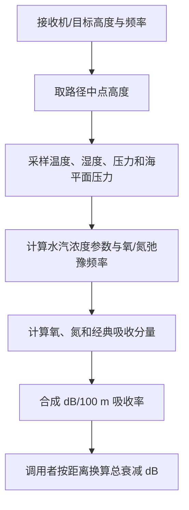

# 均匀大气声吸收算法（Uniform-Atmosphere Acoustic Absorption）

> **算法 ID**：ALG-SENSORS-ACOUSTIC-ATMOSPHERIC-ABSORPTION  
> **状态**：verified  
> **版本/日期**：1.0 / 2026-07-23  
> **领域**：传感器 / 声学传播  
> **AFSIM 模块**：`core/wsf_mil`  
> **覆盖候选**：`b0b90a6e6af394b1`、`de8284c5e838e5e3`  
> **接口规格**：`docs/extracted-algorithms/acoustic-atmospheric-absorption/sensors-acoustic-atmospheric-absorption-interface-spec.md`

## 1. 算法边界

- **目的**：根据传播路径中点处的大气温度、相对湿度、压力比和声频率，计算单位 100 m 路径的声压级吸收量。
- **入口条件**：被动声学传感器正在评估某个三分之一倍频程中心频率；接收机与目标的位置已经更新。
- **完成条件**：返回该频带的吸收率，单位为 dB/100 m。
- **包含**：氧、氮分子弛豫项与经典频率平方吸收项。
- **不包含**：自由场几何扩散、结构遮蔽、地面反射、区域衰减、Doppler 频移、滤波权重和探测门限。
- **生命周期位置**：`simulation_loop`，由每次声学探测尝试在频带循环内调用。

## 2. 流程



源码先以收发两端高度平均值近似整条路径的大气状态，然后计算与频率无关的水汽和弛豫参数，再计算三个频率相关分量。调用者把返回值乘以距离（m）和 `0.01`，得到全程 dB 衰减。

## 3. 数据契约

### 3.1 输入

| # | 中文名称 | 代码标识 | 数学符号 | 类型 | 含义 | 单位/坐标系 | 所属函数 Method |
| --- | --- | --- | --- | --- | --- | --- | --- |
| 1 | 接收机高度 | `aResult.mRcvrLoc.mAlt` | $h_r$ | `double` | 接收机海拔 | m，标量 | `WsfAcousticSensor::AtmosphericAttenuation#14341903e4` |
| 2 | 目标高度 | `aResult.mTgtLoc.mAlt` | $h_t$ | `double` | 目标海拔 | m，标量 | `WsfAcousticSensor::AtmosphericAttenuation#14341903e4` |
| 3 | 频率 | `aFreq` | $f$ | `double` | 当前三分之一倍频程中心频率 | Hz | `WsfAcousticSensor::AtmosphericAttenuation#14341903e4` |
| 4 | 大气模型 | `mAtmosphere` | $\mathcal A$ | `UtAtmosphere` | 在给定高度提供温度、湿度和压力 | SI | `WsfAcousticSensor::AtmosphericAttenuation#14341903e4` |

### 3.2 输出

| # | 中文名称 | 代码标识 | 数学符号 | 类型 | 含义 | 单位/坐标系 | 所属函数 Method |
| --- | --- | --- | --- | --- | --- | --- | --- |
| 1 | 大气吸收率 | `attenuation` | $\alpha_{100}$ | `double` | 每 100 m 的频带声压级损失 | dB/100 m | `WsfAcousticSensor::AtmosphericAttenuation#14341903e4` |

### 3.3 参数与常量

| # | 中文名称 | 代码标识 | 数学符号 | 类型 | 值/范围 | 单位 | 来源 | 所属函数 Method |
| --- | --- | --- | --- | --- | --- | --- | --- | --- |
| 1 | 分贝换算系数 | 字面量 | $C_{\mathrm{dB}}$ | `double` | 434.3 | 代码模型系数 | ESDU #78002 注释上下文 | `WsfAcousticSensor::AtmosphericAttenuation#14341903e4` |
| 2 | 氧弛豫系数 | 字面量 | — | `double` | 24、44100、0.05、0.391 | 见公式 | 代码给定经验系数 | `WsfAcousticSensor::AtmosphericAttenuation#14341903e4` |
| 3 | 氮弛豫系数 | 字面量 | — | `double` | 9、350、6.142、293 | 见公式 | 代码给定经验系数 | `WsfAcousticSensor::AtmosphericAttenuation#14341903e4` |
| 4 | 分子吸收系数 | 字面量 | — | `double` | `1.881e4`、`1.571e5`、2239.1、3352 | 见公式 | 代码给定经验系数 | `WsfAcousticSensor::AtmosphericAttenuation#14341903e4` |
| 5 | 经典吸收系数 | 字面量 | — | `double` | `2.152e-12` | 见公式 | 代码给定经验系数 | `WsfAcousticSensor::AtmosphericAttenuation#14341903e4` |

### 3.4 内部状态

该算法本身无持久状态。`mAtmosphere` 是调用对象持有的环境配置，函数只读；所有中间量均为单次调用的局部变量。

## 4. 数学模型

### 4.1 路径中点大气状态

$$
\bar h=\frac{h_r+h_t}{2},\qquad
T=\mathcal A_T(\bar h),\qquad
H_r=\mathcal A_H(\bar h),\qquad
r_p=\frac{p(\bar h)}{p(0)}
$$

- $T$：绝对温度，K。
- $H_r$：相对湿度，无量纲比例，不是百分数。
- $p$：压力，Pa；算法仅使用无量纲压力比 $r_p$。

这是单点均匀大气近似，不对真实路径做分段积分。

### 4.2 水汽参数与弛豫频率

$$
a_H=\frac{H_r}{r_p}10^{20.318-\frac{2939}{T}-4.922\log_{10}T}
$$

$$
f_{rO}=r_p\left(24+\frac{44100a_H(0.05+a_H)}{0.391+a_H}\right)
$$

$$
f_{rN}=\left[9+350a_H
\exp\left(-6.142\left[\left(\frac{293}{T}\right)^{1/3}-1\right]\right)\right]
r_p\sqrt{\frac{293}{T}}
$$

式中括号项、压力比和平方根项相乘。

### 4.3 三项吸收与合成

$$
\mu_O=1.881\times10^4 T^{-2.5}e^{-2239.1/T}
\left(1-e^{-2239.1/T}\right)^{-2}
$$

$$
\mu_N=1.571\times10^5 T^{-2.5}e^{-3352/T}
\left(1-e^{-3352/T}\right)^{-2}
$$

上述各因子均相乘。

$$
m'_O=\frac{2\mu_Of}{f/f_{rO}+f_{rO}/f},\qquad
m'_N=\frac{2\mu_Nf}{f/f_{rN}+f_{rN}/f}
$$

$$
m_C=\frac{2.152\times10^{-12}\sqrt T}{r_p}f^2
$$

$$
\boxed{\alpha_{100}=434.3\left(m'_O+m'_N+m_C\right)}
$$

调用者对传播距离 $R$（m）执行：

$$
A_{\mathrm{atm,dB}}=\alpha_{100}\,R\,0.01
$$

这是代码中的经验模型离散计算，不是沿非均匀路径的连续积分。

## 5. 伪代码

```text
function acoustic_absorption(receiver_alt_m, target_alt_m, frequency_hz, atmosphere):
    # 中文：用收发两端高度的平均值近似整条传播路径的大气状态。
    mid_alt_m = 0.5 * (receiver_alt_m + target_alt_m)
    temperature_k = atmosphere.temperature(mid_alt_m)
    relative_humidity = atmosphere.relative_humidity(mid_alt_m)
    pressure_ratio = atmosphere.pressure(mid_alt_m) / atmosphere.pressure(0.0)

    # 中文：先计算与频率无关的水汽参数以及氧、氮弛豫频率。
    humidity_term = relative_humidity / pressure_ratio \
        * 10^(20.318 - 2939.0 / temperature_k - 4.922 * log10(temperature_k))
    oxygen_relax_hz = pressure_ratio \
        * (24.0 + 44100.0 * humidity_term * (0.05 + humidity_term) / (0.391 + humidity_term))
    nitrogen_relax_hz = (9.0 + 350.0 * humidity_term \
        * exp(-6.142 * ((293.0 / temperature_k)^(1.0 / 3.0) - 1.0))) \
        * pressure_ratio * sqrt(293.0 / temperature_k)

    # 中文：按源码顺序计算氧、氮分子弛豫项和经典 f² 吸收项。
    oxygen_term = compute_oxygen_term(temperature_k, frequency_hz, oxygen_relax_hz)
    nitrogen_term = compute_nitrogen_term(temperature_k, frequency_hz, nitrogen_relax_hz)
    classical_term = 2.152e-12 * sqrt(temperature_k) / pressure_ratio * frequency_hz^2

    # 中文：返回单位 100 m 的 dB 损失；距离换算由调用者完成。
    return 434.3 * (oxygen_term + nitrogen_term + classical_term)
```

## 6. 源码证据

### 6.1 入口和调用链

```text
WsfAcousticSensor::AttemptToDetect#516f4dae30
  -> WsfAcousticSensor::AtmosphericAttenuation#14341903e4
  -> UtAtmosphere::Temperature / RelativeHumidity / Pressure
```

索引中的 `qualified_name` 遗漏了嵌套类；真实 C++ 声明和定义均为
`WsfAcousticSensor::AcousticMode::AtmosphericAttenuation`。`wsf::` 前缀记录是索引生成的命名空间别名，不代表第二份实现。

### 6.2 源码位置

| candidate_id | qualified_name | 模块 | 源码位置 | 角色 | 证据等级 |
| --- | --- | --- | --- | --- | --- |
| `b0b90a6e6af394b1` | `WsfAcousticSensor::AtmosphericAttenuation#14341903e4` | `core/wsf_mil` | `afsim-2_9/swdev/src/core/wsf_mil/source/sensor/WsfAcousticSensor.cpp:648-676` | 核心 | source-cited |
| `de8284c5e838e5e3` | `wsf::WsfAcousticSensor::AtmosphericAttenuation#14341903e4` | `core/wsf_mil` | `afsim-2_9/swdev/src/core/wsf_mil/source/sensor/WsfAcousticSensor.cpp:648-676` | 同一函数的索引别名 | source-cited |
| `a3aad3bafbc6ea03` | `WsfAcousticSensor::AttemptToDetect#516f4dae30` | `core/wsf_mil` | `afsim-2_9/swdev/src/core/wsf_mil/source/sensor/WsfAcousticSensor.cpp:420-575` | 调用者；不单独提取 | source-cited |

### 6.3 框架与依赖

| 依赖 | 分类 | 用途 | 算法核心必需 | 中性替代 |
| --- | --- | --- | --- | --- |
| `WsfSensorResult` | AFSIM 框架 | 提供两端高度与距离 | no | 三个显式 `double` 输入 |
| `UtAtmosphere` | AFSIM 工具 | 按高度提供大气状态 | no | 直接传入 $T,H_r,p,p_0$ 或抽象采样器 |
| `<cmath>` | 标准库 | `pow`、`exp`、`sqrt`、`log10` | yes | 目标语言等价数学库 |

## 7. 边界、风险与未知

| 条件 | 源码行为 | 数学/数值影响 | 建议处理 | 证据 |
| --- | --- | --- | --- | --- |
| $f\le0$ | 不校验，继续参与 `f/f_r` 和 `f_r/f` | $f=0$ 除零；负频率无物理意义 | 中性接口拒绝非正频率 | `WsfAcousticSensor.cpp:668-671` |
| $T\le0$ | 不校验 | `log10`、开方和幂运算无效 | 中性接口要求有限且大于 0 K | `WsfAcousticSensor.cpp:660-666` |
| $r_p\le0$ | 不校验 | 多处除零或负值开方链路 | 中性接口要求压力与海平面压力均大于 0 | `WsfAcousticSensor.cpp:655-666` |
| 湿度超出物理范围 | 不钳制 | 可导致经验模型外推 | 建议要求 $0\le H_r\le1$ | `WsfAcousticSensor.cpp:654,660-663` |
| 高度差很大 | 仅取中点 | 忽略路径分层 | 如需高保真，外部分段积分多次调用 | `WsfAcousticSensor.cpp:650-657` |

- **已确认假设**：高度单位为 m、温度为 K、压力为 Pa、相对湿度为无量纲比例；调用者用 `range * 0.01` 把 dB/100 m 换算为全程 dB。
- **待人工复核**：代码注释将模型来源指向 ESDU #78002，但本批未持有该文档原文，因此经验系数与文献版本的一致性未独立核验。

## 8. 验证计划

| 类型 | 输入/场景 | Oracle | 容差/不变量 | 覆盖证据 |
| --- | --- | --- | --- | --- |
| 正常 | $T=288.15$ K，$H_r=0.5$，$r_p=1$，$f=1000$ Hz | 独立按源码公式计算 $\alpha_{100}=0.29636178637145016$ dB/100 m | 绝对误差 $\le10^{-12}$ | 全公式 |
| 边界 | $H_r=0$，合法正温度/压力/频率 | 输出有限且非负 | `isfinite` 且 $\alpha_{100}\ge0$ | 干燥空气路径 |
| 退化/异常 | $f=0$、$T\le0$、$p\le0$ 或 NaN | 中性接口返回错误，不调用核心公式 | 不产生 NaN/Inf 输出 | 输入门禁 |

## 9. 可移植性

- **等级**：高
- **可移植核心**：纯标量数学，无持久状态、随机数或时间依赖。
- **AFSIM 耦合**：仅大气采样和 `WsfSensorResult` 字段访问；可在接口边界消除。
- **类型/单位/坐标系适配**：统一使用 m、K、Pa、Hz、dB/100 m；无方向坐标系。
- **许可证/clean-room 注意**：接口和公式说明不能替代对 AFSIM 随附 LICENSE 的审查；重实现时保留来源记录并避免复制框架代码。

## 10. 覆盖账本回写

| candidate_id | 状态 | algorithm_id | 决策理由 | 验证 |
| --- | --- | --- | --- | --- |
| `b0b90a6e6af394b1` | extracted | ALG-SENSORS-ACOUSTIC-ATMOSPHERIC-ABSORPTION | 核心公式实现 | passed |
| `de8284c5e838e5e3` | extracted | ALG-SENSORS-ACOUSTIC-ATMOSPHERIC-ABSORPTION | 同一函数的索引别名 | passed |
