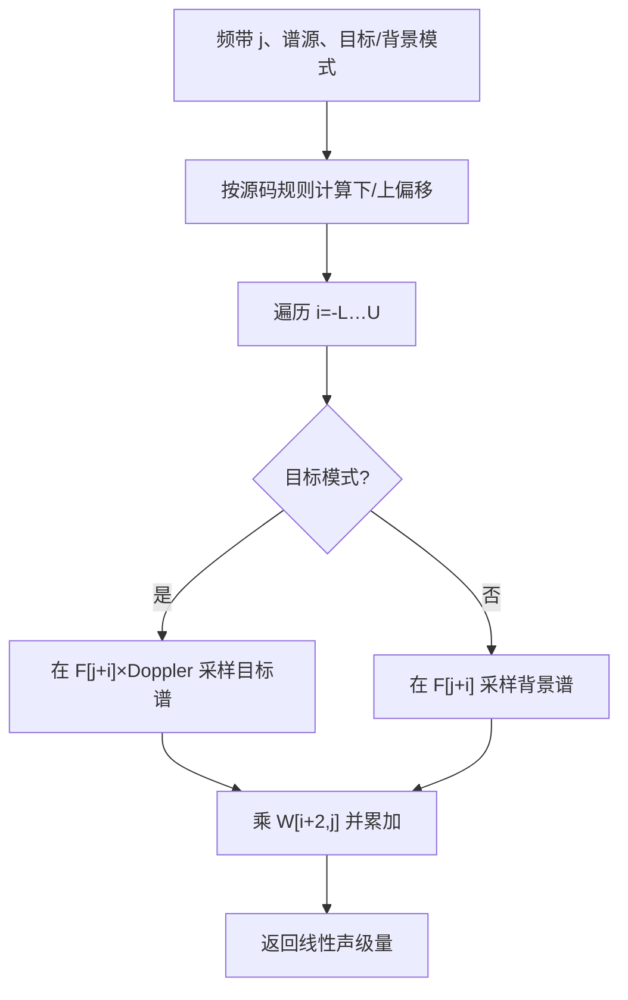

# 三分之一倍频程听觉加权算法（One-Third-Octave Auditory Filter Weighting）

> **算法 ID**：ALG-SENSORS-ACOUSTIC-AUDITORY-FILTER-WEIGHTING  
> **状态**：verified  
> **版本/日期**：1.0 / 2026-07-23  
> **领域**：传感器 / 人类听觉  
> **AFSIM 模块**：`core/wsf_mil`  
> **覆盖候选**：`232eab885c683c9f`、`51b52c5d82bd43e5`  
> **接口规格**：`docs/extracted-algorithms/acoustic-auditory-filter-weighting/sensors-acoustic-auditory-filter-weighting-interface-spec.md`

## 1. 算法边界

- **目的**：用固定 $5\times24$ 经验权重矩阵，对目标声谱或背景噪声谱的相邻三分之一倍频程进行局部加权求和。
- **入口条件**：频带索引在 0–23；目标分支还需要有效声谱和正 Doppler 倍率。
- **完成条件**：返回当前频带的线性加权声级量，调用者再用 $10\log_{10}$ 转为 dB。
- **包含**：邻域边界、目标/背景采样差异、Doppler 频率偏移和经验权重。
- **不包含**：Doppler 系数计算、声谱表插值实现、dB 换算和探测概率。
- **生命周期位置**：`simulation_loop`，每个频带对目标和背景各调用一次。

## 2. 流程



## 3. 数据契约

### 3.1 输入

| # | 中文名称 | 代码标识 | 数学符号 | 类型 | 含义 | 单位/坐标系 | 所属函数 Method |
| --- | --- | --- | --- | --- | --- | --- | --- |
| 1 | 频带索引 | `aIndex` | $j$ | `int` | 24 个中心频率之一 | $[0,23]$ | `WsfAcousticSensor::ApplyFilterWeighting#e15d7f9c4e` |
| 2 | 模式标志 | `aFlag` | $m$ | `int` | 恰为 1 时目标谱，否则背景谱 | 枚举语义 | `WsfAcousticSensor::ApplyFilterWeighting#e15d7f9c4e` |
| 3 | Doppler 倍率 | `aDoppler` | $D$ | `double` | 仅目标分支乘到采样频率 | 无量纲 | `WsfAcousticSensor::ApplyFilterWeighting#e15d7f9c4e` |
| 4 | 谱采样器 | `GetValue` / `GetNoisePressure` | $X(f)$ | 回调 | 返回给定频率的线性声级量 | 代码线性域 | `WsfAcousticSensor::ApplyFilterWeighting#e15d7f9c4e` |

### 3.2 输出

| # | 中文名称 | 代码标识 | 数学符号 | 类型 | 含义 | 单位/坐标系 | 所属函数 Method |
| --- | --- | --- | --- | --- | --- | --- | --- |
| 1 | 加权频带量 | `level` | $Y_j$ | `double` | 邻近频带线性加权和 | 与谱采样值一致 | `WsfAcousticSensor::ApplyFilterWeighting#e15d7f9c4e` |

### 3.3 参数与常量

中心频率为：

```text
[50, 62.5, 80, 100, 125, 160, 200, 250, 315, 400, 500, 630,
 800, 1000, 1250, 1600, 2000, 2500, 3150, 4000, 5000, 6300, 8000, 10000] Hz
```

权重矩阵按相对偏移 $i=-2,-1,0,+1,+2$ 分行、目标频带 $j$ 分列：

```text
i=-2: [0,0,0.3048,0.1521,0.07568,0.03776,0,0,0,0,0,0,0,0,0,0,0,0,0,0,0,0,0,0]
i=-1: [0,0.5333,0.4355,0.3565,0.2917,0.2388,0.1950,0.1596,0.1306,0.1069,0.08750,0,0,0,0,0,0,0,0,0,0,0,0,0]
i= 0: [1,1,1,1,1,1,1,1,1,1,1,1,1,1,1,1,1,1,1,1,1,1,1,1]
i=+1: [1,0.6683,0.5176,0.3999,0.3090,0.2388,0.1845,0.1429,0.1104,0.08311,0.06592,0,0,0,0,0,0,0,0,0,0,0,0,0]
i=+2: [0.5,0.45,0.3846,0.1321,0.04539,0.01560,0,0,0,0,0,0,0,0,0,0,0,0,0,0,0,0,0,0]
```

源码注释把权重来源指向 Ref 3。

### 3.4 内部状态

算法本身无持久状态；背景分支只读 `mBackgroundNoiseStateId`，目标分支读取平台当前声学签名状态和缩放因子。

## 4. 数学模型

源码的邻域界限不是通常的 $\min(j,2)$，而是：

$$
L(j)=\min(\max(j-2,0),2),\qquad U(j)=\min(23-j,2)
$$

因此 $j=0,1,2$ 都不访问更低频率邻居。定义采样频率：

$$
f_{j+i}'=
\begin{cases}
F_{j+i}D,&m=1\\
F_{j+i},&m\ne1
\end{cases}
$$

输出：

$$
\boxed{Y_j=\sum_{i=-L(j)}^{U(j)}X(f_{j+i}')W_{i+2,j}}
$$

目标签名和内置背景表在相关代码中以 $10^{L_{\mathrm{dB}}/10}$ 构造/使用，调用者再用
$10\log_{10}Y_j$。所以中性接口将其称为“线性声级量”，不声称是 Pa。

## 5. 伪代码

```text
function auditory_weighting(band, mode, doppler, sample_spectrum):
    # 中文：严格保留源码的 j-2 下界规则；j=1、2 不取低频邻居。
    lower = min(max(band - 2, 0), 2)
    upper = min(23 - band, 2)
    level = 0.0

    # 中文：目标模式对查询频率做 Doppler 偏移，背景模式不偏移。
    for offset from -lower through upper:
        frequency_hz = CENTER_FREQUENCY[band + offset]
        if mode == target:
            frequency_hz = frequency_hz * doppler
        sample = sample_spectrum(frequency_hz)
        level = level + sample * WEIGHT[offset + 2][band]

    # 中文：返回线性域结果；本函数不执行对数转换。
    return level
```

## 6. 源码证据

### 6.1 入口和调用链

```text
WsfAcousticSensor::AttemptToDetect#516f4dae30
  -> WsfAcousticSensor::ApplyFilterWeighting#e15d7f9c4e
  -> WsfAcousticSignature::GetValue 或 WsfStandardAcousticSignature::GetNoisePressure
```

### 6.2 源码位置

| candidate_id | qualified_name | 模块 | 源码位置 | 角色 | 证据等级 |
| --- | --- | --- | --- | --- | --- |
| `232eab885c683c9f` | `WsfAcousticSensor::ApplyFilterWeighting#e15d7f9c4e` | `core/wsf_mil` | `afsim-2_9/swdev/src/core/wsf_mil/source/sensor/WsfAcousticSensor.cpp:584-628` | 核心；显式纳入 | source-cited |
| `51b52c5d82bd43e5` | `AcousticMode::ApplyFilterWeighting#e15d7f9c4e` | `core/wsf_mil` | `afsim-2_9/swdev/src/core/wsf_mil/source/sensor/WsfAcousticSensor.cpp:584-628` | 索引别名；显式纳入 | source-cited |

真实声明名为 `WsfAcousticSensor::AcousticMode::ApplyFilterWeighting`。

### 6.3 框架与依赖

| 依赖 | 分类 | 用途 | 算法核心必需 | 中性替代 |
| --- | --- | --- | --- | --- |
| `WsfAcousticSignature` | AFSIM 框架 | 目标谱查询 | no | `sample(frequency_hz)` 回调 |
| `WsfStandardAcousticSignature` | AFSIM 框架 | 背景谱插值 | no | 同一采样回调 |
| 固定权重矩阵 | 经验数据 | 听觉滤波 | yes | 版本化常量 |

## 7. 边界、风险与未知

| 条件 | 源码行为 | 数学/数值影响 | 建议处理 | 证据 |
| --- | --- | --- | --- | --- |
| $j\notin[0,23]$ | 不校验 | 数组越界 | 中性接口拒绝 | `WsfAcousticSensor.cpp:606-624` |
| 目标分支且目标为空 | 继续解引用 | 未定义行为 | 要求有效采样器 | `WsfAcousticSensor.cpp:613-617` |
| 目标分支默认 $D=0$ | 查询 0 Hz | 与有效声谱范围可能不符 | 中性接口要求 $D>0$ | `WsfAcousticSensor.hpp:85-88` |
| $j=1,2$ | 不读取任何低频邻居 | 与常规对称 5 点窗不同 | 兼容实现必须保留；另行确认是否缺陷 | `WsfAcousticSensor.cpp:606` |
| 采样值 $\le0$ | 原样累加 | 调用者 `log10` 可无效 | 成功结果要求 $Y_j>0$ | `WsfAcousticSensor.cpp:624-627,490-509` |

- **已确认假设**：频率单位 Hz；权重无量纲；输入/输出位于代码的线性声级域。
- **待人工复核**：Ref 3 原文与矩阵版本、`j-2` 下界是否为有意设计。

## 8. 验证计划

| 类型 | 输入/场景 | Oracle | 容差/不变量 | 覆盖证据 |
| --- | --- | --- | --- | --- |
| 正常 | $j=5$，所有采样值 1，$D=1$ | $0.03776+0.2388+1+0.2388+0.0156=1.53096$ | 绝对误差 $\le10^{-12}$ | 5 点窗 |
| 边界 | $j=0$，所有采样值 1 | $1+1+0.5=2.5$ | 绝对误差 $\le10^{-12}$ | 低端截断 |
| 边界 | $j=23$，所有采样值 1 | $1$ | 精确相等 | 高端截断 |
| 退化/异常 | 越界索引、非正 Doppler、非有限/非正采样 | 错误状态 | 不执行 `log10` | 中性门禁 |

## 9. 可移植性

- **等级**：高
- **可移植核心**：短邻域加权和与固定表。
- **AFSIM 耦合**：声谱/背景表访问可替换为回调。
- **类型/单位/坐标系适配**：Hz 与无量纲线性声级；无空间坐标系。
- **许可证/clean-room 注意**：经验权重来源需追溯 Ref 3，并审查 AFSIM LICENSE。

## 10. 覆盖账本回写

| candidate_id | 状态 | algorithm_id | 决策理由 | 验证 |
| --- | --- | --- | --- | --- |
| `232eab885c683c9f` | extracted | ALG-SENSORS-ACOUSTIC-AUDITORY-FILTER-WEIGHTING | 误标 `none` 的核心实现 | passed |
| `51b52c5d82bd43e5` | extracted | ALG-SENSORS-ACOUSTIC-AUDITORY-FILTER-WEIGHTING | 误标 `control_flow` 的索引别名 | passed |
