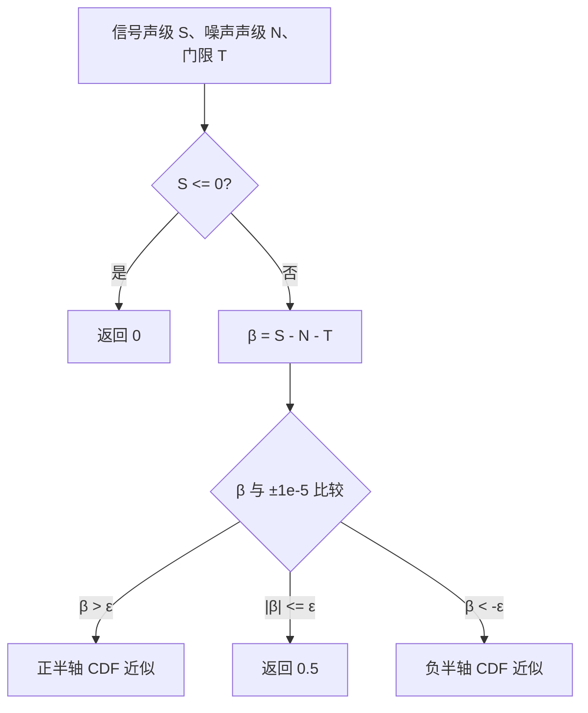

# 声学探测概率高斯近似算法（Acoustic Detection-Probability Gaussian Approximation）

> **算法 ID**：ALG-SENSORS-ACOUSTIC-DETECTION-PROBABILITY  
> **状态**：verified  
> **版本/日期**：1.0 / 2026-07-23  
> **领域**：传感器 / 声学探测  
> **AFSIM 模块**：`core/wsf_mil`  
> **覆盖候选**：`bf1f00212efbe3b2`、`147969b0e635b484`  
> **接口规格**：`docs/extracted-algorithms/acoustic-detection-probability/sensors-acoustic-detection-probability-interface-spec.md`

## 1. 算法边界

- **目的**：把接收声级相对背景/听阈和配置检测门限的裕量，映射为 $[0,1]$ 附近的探测概率。
- **入口条件**：声学频带循环发现新的最大信噪比频带。
- **完成条件**：返回基于标准正态累积分布多项式近似的概率值。
- **包含**：信噪差、门限平移、正态密度和三次多项式分段近似。
- **不包含**：频带选择、声传播、背景滤波、布尔探测判决、随机抽样、地形遮蔽和脚本覆盖。
- **生命周期位置**：`simulation_loop`，由探测尝试更新结果中的 `mPd`。

## 2. 流程



调用者传入的三个量均以 dB 数值表示。代码把 dB 裕量直接作为标准正态变量 $\beta$，这是经验映射，不额外做尺度归一化。返回的 `mPd` 不参与本函数所在调用中的随机判决；布尔 `detected` 仍由声级是否超过背景和听阈决定。

## 3. 数据契约

### 3.1 输入

| # | 中文名称 | 代码标识 | 数学符号 | 类型 | 含义 | 单位/坐标系 | 所属函数 Method |
| --- | --- | --- | --- | --- | --- | --- | --- |
| 1 | 接收信号声级 | `aSignal` | $S$ | `double` | 当前频带的接收声压级 | dB | `WsfAcousticSensor::ComputeProbabilityOfDetection#867e4f1774` |
| 2 | 有效噪声声级 | `aNoise` | $N$ | `double` | 过滤背景声级与听阈声级的较大者 | dB | `WsfAcousticSensor::ComputeProbabilityOfDetection#867e4f1774` |
| 3 | 检测门限 | `aThreshold` | $T_d$ | `double` | 产生 $P_d=0.5$ 所需信噪比 | dB | `WsfAcousticSensor::ComputeProbabilityOfDetection#867e4f1774` |

### 3.2 输出

| # | 中文名称 | 代码标识 | 数学符号 | 类型 | 含义 | 单位/坐标系 | 所属函数 Method |
| --- | --- | --- | --- | --- | --- | --- | --- |
| 1 | 探测概率 | `pd` | $P_d$ | `double` | 经验高斯近似返回值 | 无量纲，目标范围 $[0,1]$ | `WsfAcousticSensor::ComputeProbabilityOfDetection#867e4f1774` |

### 3.3 参数与常量

| # | 中文名称 | 代码标识 | 数学符号 | 类型 | 值/范围 | 单位 | 来源 | 所属函数 Method |
| --- | --- | --- | --- | --- | --- | --- | --- | --- |
| 1 | 标准正态密度系数 | `cCONST` | $c_\phi$ | `double` | 0.39894228 | 无量纲 | $1/\sqrt{2\pi}$ 的截断值 | `WsfAcousticSensor::ComputeProbabilityOfDetection#867e4f1774` |
| 2 | 零邻域容差 | 字面量 | $\epsilon$ | `double` | `1.0e-5` | 与 $\beta$ 同数值尺度 | 代码分支阈值 | `WsfAcousticSensor::ComputeProbabilityOfDetection#867e4f1774` |
| 3 | 近似参数 | 字面量 | $a$ | `double` | 0.33267 | 无量纲 | 源码注释：A&S 26.2.16 | `WsfAcousticSensor::ComputeProbabilityOfDetection#867e4f1774` |
| 4 | 多项式系数 | 字面量 | $b_1,b_2,b_3$ | `double` | 0.4361836、-0.1201676、0.9372980 | 无量纲 | 源码注释：A&S 26.2.16 | `WsfAcousticSensor::ComputeProbabilityOfDetection#867e4f1774` |

### 3.4 内部状态

算法无持久状态。`mDetectionThreshold` 由 `detection_threshold` 配置读取，并作为 `aThreshold` 传入；函数本身不读取或修改对象成员。

## 4. 数学模型

### 4.1 信噪裕量

$$
\beta=(S-N)-T_d
$$

当 $\beta=0$ 时，返回 $P_d=0.5$。由于 $S,N,T_d$ 均是 dB 数值，$\beta$ 也是 dB 差值；代码将其数值直接输入标准正态 CDF 近似。

### 4.2 标准正态累积分布近似

$$
z=c_\phi e^{-\beta^2/2},\qquad c_\phi=0.39894228
$$

定义：

$$
g(t)=b_1t+b_2t^2+b_3t^3
$$

其中 $b_1=0.4361836$、$b_2=-0.1201676$、$b_3=0.9372980$。源码分段为：

$$
P_d=
\begin{cases}
0, & S\le0\\
1-zg\left(\frac{1}{1+0.33267\beta}\right), & S>0,\ \beta>\epsilon\\
0.5, & S>0,\ |\beta|\le\epsilon\\
zg\left(\frac{1}{1-0.33267\beta}\right), & S>0,\ \beta<-\epsilon
\end{cases}
$$

这是对 $\Phi(\beta)$ 的代码近似。源码注释先由 $P_d=Q(-\beta)=1-Q(\beta)$ 化为 $P(\beta)$，并忽略更小的第二个 Q 函数项。

## 5. 伪代码

```text
function acoustic_detection_probability(signal_db, noise_db, threshold_db):
    # 中文：完全保留源码的早退规则；它以 dB 数值是否大于零判断。
    if signal_db <= 0.0:
        return 0.0

    # 中文：计算相对 50% 探测点的信噪裕量，并得到正态密度值。
    beta = signal_db - noise_db - threshold_db
    z = 0.39894228 * exp(-0.5 * beta * beta)

    # 中文：在正、负半轴使用对称的三次多项式近似。
    if beta > 1.0e-5:
        t = 1.0 / (1.0 + 0.33267 * beta)
        return 1.0 - z * (0.4361836*t - 0.1201676*t^2 + 0.9372980*t^3)
    if beta < -1.0e-5:
        t = 1.0 / (1.0 - 0.33267 * beta)
        return z * (0.4361836*t - 0.1201676*t^2 + 0.9372980*t^3)

    # 中文：零邻域直接钉在 0.5，避免两个近似分支的微小差异。
    return 0.5
```

## 6. 源码证据

### 6.1 入口和调用链

```text
WsfAcousticSensor::AttemptToDetect#516f4dae30
  -> 选择最大信噪比频带
  -> WsfAcousticSensor::ComputeProbabilityOfDetection#867e4f1774
  -> 写入 WsfSensorResult::mPd
```

真实 C++ 声明名为
`WsfAcousticSensor::AcousticMode::ComputeProbabilityOfDetection`。当前索引遗漏 `AcousticMode`，并额外产生带 `wsf::` 的同源别名；本卡按索引契约使用存在的 `qualified_name`。

### 6.2 源码位置

| candidate_id | qualified_name | 模块 | 源码位置 | 角色 | 证据等级 |
| --- | --- | --- | --- | --- | --- |
| `bf1f00212efbe3b2` | `WsfAcousticSensor::ComputeProbabilityOfDetection#867e4f1774` | `core/wsf_mil` | `afsim-2_9/swdev/src/core/wsf_mil/source/sensor/WsfAcousticSensor.cpp:686-752` | 核心 | source-cited |
| `147969b0e635b484` | `wsf::WsfAcousticSensor::ComputeProbabilityOfDetection#867e4f1774` | `core/wsf_mil` | `afsim-2_9/swdev/src/core/wsf_mil/source/sensor/WsfAcousticSensor.cpp:686-752` | 同一函数的索引别名 | source-cited |
| `a3aad3bafbc6ea03` | `WsfAcousticSensor::AttemptToDetect#516f4dae30` | `core/wsf_mil` | `afsim-2_9/swdev/src/core/wsf_mil/source/sensor/WsfAcousticSensor.cpp:420-575` | 调用者；不单独提取 | source-cited |

### 6.3 框架与依赖

| 依赖 | 分类 | 用途 | 算法核心必需 | 中性替代 |
| --- | --- | --- | --- | --- |
| `WsfSensorResult` | AFSIM 框架 | 保存最大 SNR 和 `mPd` | no | 由调用者保存返回值 |
| `WsfEM_Rcvr` / 输入配置 | AFSIM 框架 | 提供 `mDetectionThreshold` | no | 显式 `threshold_db` |
| `<cmath>` | 标准库 | `exp` | yes | 目标语言等价数学库 |

## 7. 边界、风险与未知

| 条件 | 源码行为 | 数学/数值影响 | 建议处理 | 证据 |
| --- | --- | --- | --- | --- |
| $S\le0$ dB | 直接返回 0 | 负 dB 声级也可能是有效物理量，但被当作无信号 | 兼容模式保留；严格物理模式应由需求决定 | `WsfAcousticSensor.cpp:688-691` |
| $|\beta|\le10^{-5}$ | 返回恰好 0.5 | 在零附近形成极小平台 | 回归测试必须覆盖两个边界 | `WsfAcousticSensor.cpp:719-728` |
| 极大 $|\beta|$ | 指数下溢趋零 | 输出趋近 1 或 0，通常稳定 | 确保输入有限 | `WsfAcousticSensor.cpp:715-728` |
| NaN/Inf 输入 | 不校验 | 比较可能全部为 false，NaN 可传播 | 中性接口拒绝非有限值 | `WsfAcousticSensor.cpp:688-728` |
| 输出范围 | 不显式钳制 | 系数截断理论上可能产生极小越界风险 | 中性接口可在验证失败时报告，不静默改公式 | `WsfAcousticSensor.cpp:715-751` |

- **已确认假设**：门限是产生 $P_d=0.5$ 的 SNR 数值；调用者传入背景声级和听阈声级的较大者。
- **待人工复核**：源码引用的 MDC B1368 报告和 Abramowitz & Stegun 26.2.16 未在本批逐字核验；“dB 裕量等同标准差单位”的统计标定依据尚缺外部证据。

## 8. 验证计划

| 类型 | 输入/场景 | Oracle | 容差/不变量 | 覆盖证据 |
| --- | --- | --- | --- | --- |
| 正常 | $S=50,N=40,T_d=9$ dB | 独立实现返回 `0.8413513380564247` | 绝对误差 $\le10^{-12}$ | 正半轴 |
| 边界 | $S=50,N=40,T_d=10$ dB | $P_d=0.5$ | 精确相等 | 零邻域 |
| 正常/对称 | $S=50,N=40,T_d=11$ dB | `0.1586486619435753` 且与正半轴结果和为 1 | 和的误差 $\le10^{-12}$ | 负半轴 |
| 退化/异常 | $S=0$ dB | $P_d=0$ | 精确相等 | 早退 |
| 异常 | 任一输入为 NaN/Inf | 中性接口返回错误 | 不产生概率输出 | 输入门禁 |

## 9. 可移植性

- **等级**：极高
- **可移植核心**：一个无状态标量分段函数，仅依赖指数运算。
- **AFSIM 耦合**：调用者选择最大 SNR 频带并保存 `mPd`；这些不属于核心接口。
- **类型/单位/坐标系适配**：三个输入均按 dB 数值传递，无空间坐标系。
- **许可证/clean-room 注意**：统计近似本身有公开文献线索，但仍需单独审查 AFSIM 随附 LICENSE；中性实现应依据规格和独立测试重写。

## 10. 覆盖账本回写

| candidate_id | 状态 | algorithm_id | 决策理由 | 验证 |
| --- | --- | --- | --- | --- |
| `bf1f00212efbe3b2` | extracted | ALG-SENSORS-ACOUSTIC-DETECTION-PROBABILITY | 核心概率映射 | passed |
| `147969b0e635b484` | extracted | ALG-SENSORS-ACOUSTIC-DETECTION-PROBABILITY | 同一函数的索引别名 | passed |
