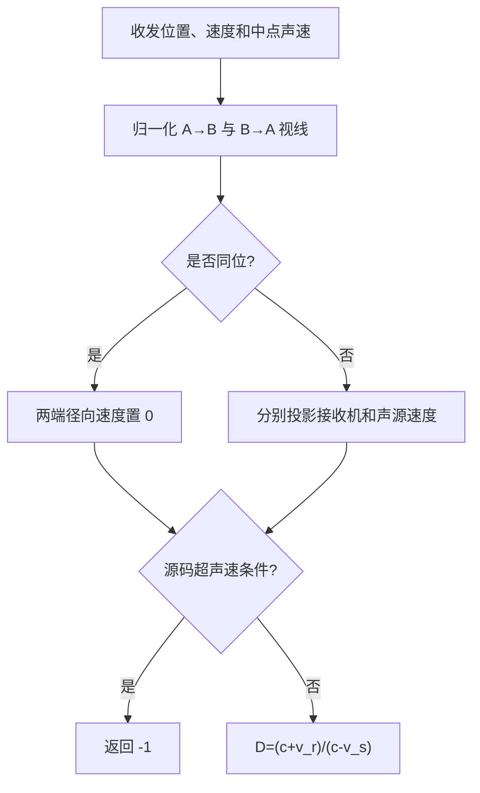

# 声学 Doppler 频率系数算法（Acoustic Doppler Frequency Coefficient）

> **算法 ID**：ALG-SENSORS-ACOUSTIC-DOPPLER-COEFFICIENT  
> **状态**：verified  
> **版本/日期**：1.0 / 2026-07-23  
> **领域**：传感器 / 声学传播  
> **AFSIM 模块**：`core/wsf_mil`  
> **覆盖候选**：`83766514963e2bf5`、`2145f31b1f9e4077`  
> **接口规格**：`docs/extracted-algorithms/acoustic-doppler-coefficient/sensors-acoustic-doppler-coefficient-interface-spec.md`

## 1. 算法边界

- **目的**：用接收机和声源沿视线速度以及路径中点声速，计算目标声谱查询所用的频率倍率。
- **入口条件**：收发位置、WCS 速度和大气模型已更新。
- **完成条件**：返回有限的无量纲倍率，或以 `-1` 表示源码判定的超声速不可听条件。
- **包含**：视线单位向量、两端径向速度、经典运动声源/接收机 Doppler 比。
- **不包含**：声谱插值、频带加权、传播损失和检测判决。
- **生命周期位置**：`simulation_loop`，每次声学探测尝试调用一次。

## 2. 流程



## 3. 数据契约

### 3.1 输入

| # | 中文名称 | 代码标识 | 数学符号 | 类型 | 含义 | 单位/坐标系 | 所属函数 Method |
| --- | --- | --- | --- | --- | --- | --- | --- |
| 1 | 接收机位置 | `aLocWCS` | $\mathbf r_A$ | `double[3]` | 传感器平台位置 | m，WCS | `WsfAcousticSensor::ComputeDopplerTerm#8805cb99d3` |
| 2 | 接收机速度 | `aVelWCS` | $\mathbf v_A$ | `double[3]` | 传感器平台速度 | m/s，WCS | `WsfAcousticSensor::ComputeDopplerTerm#8805cb99d3` |
| 3 | 声源位置 | `bLocWCS` | $\mathbf r_B$ | `double[3]` | 目标平台位置 | m，WCS | `WsfAcousticSensor::ComputeDopplerTerm#8805cb99d3` |
| 4 | 声源速度 | `bVelWCS` | $\mathbf v_B$ | `double[3]` | 目标平台速度 | m/s，WCS | `WsfAcousticSensor::ComputeDopplerTerm#8805cb99d3` |
| 5 | 中点声速 | `sonicVel` | $c$ | `double` | 两端平均高度处声速 | m/s | `WsfAcousticSensor::ComputeDopplerTerm#8805cb99d3` |

### 3.2 输出

| # | 中文名称 | 代码标识 | 数学符号 | 类型 | 含义 | 单位/坐标系 | 所属函数 Method |
| --- | --- | --- | --- | --- | --- | --- | --- |
| 1 | Doppler 系数 | `dopplerCoefficient` | $D$ | `double` | 调用者乘到静态中心频率上的倍率 | 无量纲 | `WsfAcousticSensor::ComputeDopplerTerm#8805cb99d3` |
| 2 | 不可听哨兵 | `-1` | — | `double` | 源码的超声速早退标志 | 无量纲 | `WsfAcousticSensor::ComputeDopplerTerm#8805cb99d3` |

### 3.3 参数与常量

算法没有经验常量；声速由 `UtAtmosphere::SonicVelocity` 提供。

### 3.4 内部状态

无持久状态。函数只读平台运动状态和 `mAtmosphere`。

## 4. 数学模型

令 $A$ 为接收机、$B$ 为声源：

$$
\hat{\mathbf u}_{AB}=\frac{\mathbf r_B-\mathbf r_A}{\|\mathbf r_B-\mathbf r_A\|},
\qquad \hat{\mathbf u}_{BA}=-\hat{\mathbf u}_{AB}
$$

$$
v_r=\hat{\mathbf u}_{AB}\cdot\mathbf v_A,\qquad
v_s=\hat{\mathbf u}_{BA}\cdot\mathbf v_B
$$

$v_r>0$ 表示接收机朝声源运动；$v_s>0$ 表示声源朝接收机运动。源码拒绝：

$$
-v_r\ge c\quad\text{或}\quad v_s\ge c
$$

否则：

$$
\boxed{D=\frac{c+v_r}{c-v_s}}
$$

调用者实际执行 $f_{\mathrm{query}}=f_{\mathrm{center}}D$。源码函数注释却写成
`freq_flight = freq_static / dopplerTerm`，二者矛盾；行为证据以调用者乘法为准。

## 5. 伪代码

```text
function acoustic_doppler(receiver_pos, receiver_vel, source_pos, source_vel, sound_speed):
    # 中文：生成相反方向的两条视线，保持源码两次归一化的符号约定。
    los_ab = source_pos - receiver_pos
    los_ba = receiver_pos - source_pos
    receiver_radial = 0.0
    source_radial = 0.0

    # 中文：同位时源码保留两个零投影，因此返回中性倍率 1。
    if normalize(los_ab) > 0 and normalize(los_ba) > 0:
        receiver_radial = dot(los_ab, receiver_vel)
        source_radial = dot(los_ba, source_vel)

    # 中文：匹配源码不可听条件；中性接口用状态码代替 -1。
    if -receiver_radial >= sound_speed or source_radial >= sound_speed:
        return impossible
    return (sound_speed + receiver_radial) / (sound_speed - source_radial)
```

## 6. 源码证据

### 6.1 入口和调用链

```text
WsfAcousticSensor::AttemptToDetect#516f4dae30
  -> WsfAcousticSensor::ComputeDopplerTerm#8805cb99d3
  -> WsfAcousticSensor::ApplyFilterWeighting#e15d7f9c4e
```

### 6.2 源码位置

| candidate_id | qualified_name | 模块 | 源码位置 | 角色 | 证据等级 |
| --- | --- | --- | --- | --- | --- |
| `83766514963e2bf5` | `WsfAcousticSensor::ComputeDopplerTerm#8805cb99d3` | `core/wsf_mil` | `afsim-2_9/swdev/src/core/wsf_mil/source/sensor/WsfAcousticSensor.cpp:983-1026` | 核心 | source-cited |
| `2145f31b1f9e4077` | `wsf::WsfAcousticSensor::ComputeDopplerTerm#8805cb99d3` | `core/wsf_mil` | `afsim-2_9/swdev/src/core/wsf_mil/source/sensor/WsfAcousticSensor.cpp:983-1026` | 索引别名 | source-cited |

真实声明名为 `WsfAcousticSensor::AcousticMode::ComputeDopplerTerm`。

### 6.3 框架与依赖

| 依赖 | 分类 | 用途 | 算法核心必需 | 中性替代 |
| --- | --- | --- | --- | --- |
| `WsfSensorResult` / `WsfPlatform` | AFSIM 框架 | 取得收发运动状态 | no | 显式向量输入 |
| `UtAtmosphere` | AFSIM 工具 | 中点声速 | no | 显式 `sound_speed_mps` |
| `UtVec3d` | AFSIM 工具 | 向量运算 | no | 中性三维向量 |

## 7. 边界、风险与未知

| 条件 | 源码行为 | 数学/数值影响 | 建议处理 | 证据 |
| --- | --- | --- | --- | --- |
| 收发同位 | 投影保持 0，返回 1 | 方向未定义但结果中性 | 兼容模式保留，并报告 `coincident=true` | `WsfAcousticSensor.cpp:1008-1013` |
| $c\le0$ 或非有限 | 不校验 | 比值无效 | 中性接口拒绝 | `WsfAcousticSensor.cpp:985-1025` |
| $v_s\to c^-$ | 分母趋零 | 倍率爆大 | 保留源码边界并设置最大可接受倍率策略 | `WsfAcousticSensor.cpp:1017-1025` |
| 函数注释与调用乘法矛盾 | 注释称除数，调用者相乘 | 迁移可能反向使用 | 以 `ApplyFilterWeighting` 的乘法作为兼容语义 | `WsfAcousticSensor.cpp:615,980-1025` |

- **已确认假设**：位置/速度在同一 WCS；声速和速度单位均为 m/s。
- **待人工复核**：目标系统是否需要对接近声速但尚未触发早退的巨大倍率设置业务上限。

## 8. 验证计划

| 类型 | 输入/场景 | Oracle | 容差/不变量 | 覆盖证据 |
| --- | --- | --- | --- | --- |
| 正常 | $c=340,v_r=10,v_s=20$ m/s | $D=350/320=1.09375$ | 绝对误差 $\le10^{-12}$ | 主公式 |
| 边界 | 收发同位，$c=340$ | $D=1$ 且 `coincident=true` | 精确相等 | 同位分支 |
| 退化 | $v_s=340$ 或 $v_r=-340$ | `supersonic_geometry` | 不执行除法 | 早退 |
| 异常 | NaN/Inf 或 $c\le0$ | 输入错误 | 无数值输出 | 中性门禁 |

## 9. 可移植性

- **等级**：极高
- **可移植核心**：两个向量投影和一个标量比值。
- **AFSIM 耦合**：仅运动状态访问和大气声速采样。
- **类型/单位/坐标系适配**：统一 WCS、m、m/s；可替换为任意一致的笛卡尔惯性/地固系。
- **许可证/clean-room 注意**：基于规格独立重写，单独审查 AFSIM LICENSE。

## 10. 覆盖账本回写

| candidate_id | 状态 | algorithm_id | 决策理由 | 验证 |
| --- | --- | --- | --- | --- |
| `83766514963e2bf5` | extracted | ALG-SENSORS-ACOUSTIC-DOPPLER-COEFFICIENT | 核心实现 | passed |
| `2145f31b1f9e4077` | extracted | ALG-SENSORS-ACOUSTIC-DOPPLER-COEFFICIENT | 索引别名 | passed |
