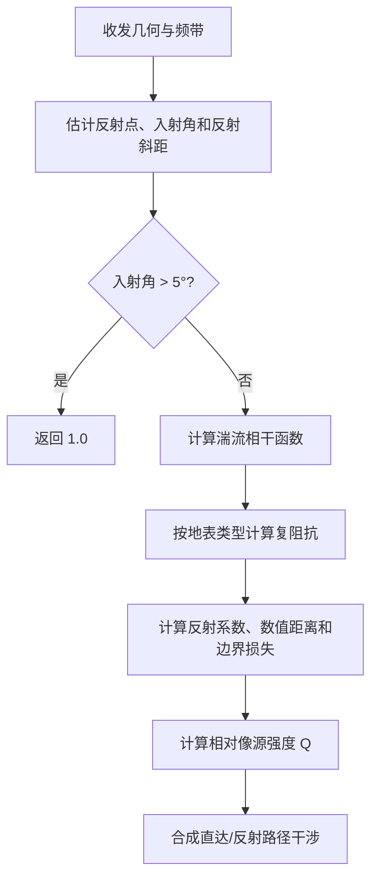

# 声学地面效应与反射干涉算法（Acoustic Ground Effect and Reflection Interference）

> **算法 ID**：ALG-SENSORS-ACOUSTIC-GROUND-EFFECT  
> **状态**：verified  
> **版本/日期**：1.0 / 2026-07-23  
> **领域**：传感器 / 声学传播  
> **AFSIM 模块**：`core/wsf_mil`  
> **覆盖候选**：`7172e771559ed642`、`acce759833af934c`、`31b84e4dbfad67c8`、`1c86ee14ba50cf15`  
> **接口规格**：`docs/extracted-algorithms/acoustic-ground-effect/sensors-acoustic-ground-effect-interface-spec.md`

## 1. 算法边界

- **目的**：根据地面反射几何、湍流相干性、复地面阻抗和直达/反射路径干涉，计算当前频带的地面效应修正值。
- **入口条件**：收发几何、地形、大气和地表覆盖可用，频带索引为 0–23。
- **完成条件**：入射角大于 5° 时返回 `1.0`；否则返回复反射模型合成值。
- **包含**：反射点/入射角辅助几何、地表参数映射、复阻抗、边界损失和带宽平均干涉。
- **不包含**：大气吸收、自由场扩散、结构遮蔽和最终 dB/线性单位解释。
- **生命周期位置**：`simulation_loop`，频带循环内调用。

## 2. 流程



## 3. 数据契约

### 3.1 输入

| # | 中文名称 | 代码标识 | 数学符号 | 类型 | 含义 | 单位/坐标系 | 所属函数 Method |
| --- | --- | --- | --- | --- | --- | --- | --- |
| 1 | 入射角 | `incidenceAngle` | $\theta$ | `double` | 反射路径相对地面的入射角 | rad | `WsfAcousticSensor::GroundEffectAttenuation#7f17591001` |
| 2 | 直达斜距 | `mTgtToRcvr.mRange` | $R_d$ | `double` | 目标到接收机直达距离 | m | `WsfAcousticSensor::GroundEffectAttenuation#7f17591001` |
| 3 | 反射斜距 | `reflectionSlantRange` | $R_r$ | `double` | 目标到反射点距离 | m | `WsfAcousticSensor::GroundEffectAttenuation#7f17591001` |
| 4 | 地面距离 | `groundRange` | $G$ | `double` | 目标到接收机地表距离 | m | `WsfAcousticSensor::GroundEffectAttenuation#7f17591001` |
| 5 | 频率/带宽 | `aFreq` / `deltaFreq` | $f,\Delta f$ | `double` | 中心频率和频带跨度 | Hz | `WsfAcousticSensor::GroundEffectAttenuation#7f17591001` |
| 6 | 大气量 | `sonicVel`、`sonicVelRefl`、`rho` | $c_m,c_g,\rho$ | `double` | 中点/反射点声速和反射点密度 | m/s、kg/m³ | `WsfAcousticSensor::GroundEffectAttenuation#7f17591001` |
| 7 | 方位相位项 | `mTgtToRcvr.mAz` | $\phi$ | `double` | 源码直接用于余弦相位 | rad | `WsfAcousticSensor::GroundEffectAttenuation#7f17591001` |
| 8 | 地表覆盖 | `aCover` | — | 枚举 | 选择流阻率和逆深度 | 分类 | `WsfAcousticSensor::GroundEffectAttenuation#7f17591001` |

### 3.2 输出

| # | 中文名称 | 代码标识 | 数学符号 | 类型 | 含义 | 单位/坐标系 | 所属函数 Method |
| --- | --- | --- | --- | --- | --- | --- | --- |
| 1 | 地面效应修正 | `returnValue` | $E_g$ | `double` | 源码复干涉公式返回值 | **单位未由源码证明** | `WsfAcousticSensor::GroundEffectAttenuation#7f17591001` |

调用者把结果命名为 `groundEffectDB` 并直接加到 dB 声级，但本函数的形式是线性干涉强度式，且无 `10*log10`。接口因此不得擅自声明 dB。

### 3.3 参数与常量

| 参数 | 值 | 含义/来源 |
| --- | ---: | --- |
| 湍流尺度 $L_t$ | 1.1 | Ref 1 |
| 折射率波动 $n_t$ | $10^{-6}$ | 源码固定“turbulent atmosphere” |
| 比热比 $\gamma$ | 1.401 | `UtAtmosphere::cGAMMA` |
| 最大适用入射角 | 5° | Ref 1 注释 |
| 地表参数 | 见下表 | Ref 1 范围和代码假设 |

| 地表 | 流阻率 $\sigma$ (N·s/m⁴) | 逆深度 $\kappa$ (1/m) |
| --- | ---: | ---: |
| barren | $80\,000$ | 0 |
| wetland | $4\,000\,000$ | 0 |
| urban | $4\,500\,000$ | 0 |
| other/grass | $40\,000$ | 32.5 |

### 3.4 内部状态

无跨调用数值状态；只读地形、大气和环境地表类型。

## 4. 数学模型

### 4.1 反射几何

`ComputeIncidenceAngle` 计算地面距离和方位，从目标经大圆外推得到反射点，经地形查询取得高度，再输出：

$$
\theta=-\operatorname{atan2}(z_{\mathrm{NED}},\sqrt{x_{\mathrm{NED}}^2+y_{\mathrm{NED}}^2}),
\qquad R_r=\|\mathbf r_{\mathrm{refl}}-\mathbf r_{\mathrm{target}}\|
$$

当水平分量为 0 时，角度使用 $-\!z$ 的符号乘 $\pi/2$。源码注释说计算“目标相对反射点 NED”，但实际 `Transform` 的输入为 `reflectionWCS`；这需要迁移前用场景黄金数据复核。
此外，`aLoc` 参数注释称 WCS 位置，实际写入顺序却是 `(latitude, longitude, altitude)`；当前调用者仅使用 `aLoc[2]` 作为高度。

### 4.2 相干性与复地面阻抗

$$
\beta=
\begin{cases}
0.5,&\sqrt{c_mG/f}>1.1\\
1,&\text{其他}
\end{cases}
$$

$$
P=n_t\left(\frac{f}{c_m}\right)^2G L_t\sqrt\pi,\qquad
\Gamma=e^{-0.2\beta P}
$$

$$
z_r=\sqrt{\frac{\sigma}{\gamma\pi\rho f}},\qquad
z_i=z_r+\frac{0.2c_g\kappa}{\gamma\pi f},\qquad Z=z_r+i z_i
$$

$$
\mathcal R=\frac{\sin\theta-1/Z}{\sin\theta+1/Z}
$$

### 4.3 边界损失与干涉

令 $\lambda=c_g/f$：

$$
N=i\frac{\pi R_r}{\lambda}\left|\sin\theta+\frac1Z\right|^2
$$

$$
B(N)=
\begin{cases}
1+\sqrt{\pi N}e^{-N}-2N\left(1+\frac N3+\frac{N^2}{10}+\frac{N^3}{43}\right)e^{-N},&|N|<10\\
-\left(\frac{0.5}{N}+\frac{3}{(2N)^2}+\frac{15}{(2N)^3}\right),&|N|\ge10
\end{cases}
$$

$$
Q=\mathcal R+B(1-\mathcal R),\quad r'=\frac{R_d}{R_r},\quad
\zeta=\frac{\pi\Delta f}{f},\quad
\eta=2\pi\sqrt{1+\left(\frac{\Delta f}{2f}\right)^2}
$$

$$
\boxed{
E_g=1+(r'|Q|)^2+
2r'\Gamma|Q|\times
\frac{\lambda}{\zeta(R_d-R_r)}
\times\sin\left(\frac{\zeta(R_r-R_d)}{\lambda}\right)
\times
\cos\left(\frac{\eta(R_r-R_d)}{\lambda}+\phi\right)
}
$$

上式最后四个因子在源码中连乘。

频带跨度为：首带 13 Hz，末带 4800 Hz，其他带
$\Delta f=F_{j+1}-F_{j-1}$。

## 5. 伪代码

```text
function acoustic_ground_effect(geometry, atmosphere, surface, band):
    # 中文：反射几何由辅助步骤给出；超过文献适用角时源码返回 1。
    incidence, reflected_range, reflection_point = reflection_geometry(geometry)
    if incidence > radians(5):
        return 1.0

    # 中文：计算湍流相干性和按地表类别选定的复阻抗。
    coherence = compute_coherence(atmosphere, geometry.ground_range, band.frequency)
    flow_resistivity, inverse_depth = surface_parameters(surface)
    impedance = compute_complex_impedance(flow_resistivity, inverse_depth, atmosphere, band.frequency)

    # 中文：使用数值距离的两段近似得到相对像源强度。
    reflection = compute_reflection_coefficient(incidence, impedance)
    numerical_distance = compute_numerical_distance(incidence, impedance, reflected_range)
    boundary_loss = compute_boundary_loss(numerical_distance)
    image_strength = reflection + boundary_loss * (1 - reflection)

    # 中文：严格按源码将直达/反射路径差、带宽和方位项连乘合成。
    return combine_interference(geometry, band, coherence, image_strength)
```

## 6. 源码证据

### 6.1 入口和调用链

```text
WsfAcousticSensor::AttemptToDetect#516f4dae30
  -> WsfAcousticSensor::GroundEffectAttenuation#7f17591001
     -> WsfAcousticSensor::ComputeIncidenceAngle#f806891ebb
```

### 6.2 源码位置

| candidate_id | qualified_name | 模块 | 源码位置 | 角色 | 证据等级 |
| --- | --- | --- | --- | --- | --- |
| `7172e771559ed642` | `WsfAcousticSensor::GroundEffectAttenuation#7f17591001` | `core/wsf_mil` | `afsim-2_9/swdev/src/core/wsf_mil/source/sensor/WsfAcousticSensor.cpp:761-911` | 核心；显式纳入 | source-cited |
| `acce759833af934c` | `wsf::WsfAcousticSensor::GroundEffectAttenuation#7f17591001` | `core/wsf_mil` | `afsim-2_9/swdev/src/core/wsf_mil/source/sensor/WsfAcousticSensor.cpp:761-911` | 索引别名；显式纳入 | source-cited |
| `31b84e4dbfad67c8` | `WsfAcousticSensor::ComputeIncidenceAngle#f806891ebb` | `core/wsf_mil` | `afsim-2_9/swdev/src/core/wsf_mil/source/sensor/WsfAcousticSensor.cpp:921-977` | 辅助几何 | source-cited |
| `1c86ee14ba50cf15` | `wsf::WsfAcousticSensor::ComputeIncidenceAngle#f806891ebb` | `core/wsf_mil` | `afsim-2_9/swdev/src/core/wsf_mil/source/sensor/WsfAcousticSensor.cpp:921-977` | 辅助别名 | source-cited |

真实声明名包含嵌套类 `WsfAcousticSensor::AcousticMode`。

### 6.3 框架与依赖

| 依赖 | 分类 | 用途 | 算法核心必需 | 中性替代 |
| --- | --- | --- | --- | --- |
| `WsfSensorResult` | AFSIM 框架 | 收发几何 | no | 显式几何结构 |
| `wsf::Terrain` / `WsfEnvironment` | AFSIM 框架 | 地形高度和地表类别 | no | 高程/地表服务 |
| `UtAtmosphere` | AFSIM 工具 | 声速、密度、$\gamma$ | no | 显式大气量 |
| `std::complex` | 标准库 | 复阻抗和边界损失 | yes | 目标语言复数库 |

## 7. 边界、风险与未知

| 条件 | 源码行为 | 数学/数值影响 | 建议处理 | 证据 |
| --- | --- | --- | --- | --- |
| $\theta>5°$ | 返回 1.0 | 调用者直接当 dB 加，未必是中性值 | 迁移前确认单位；兼容模式保留 1.0 | `WsfAcousticSensor.cpp:774-780,497-505` |
| $R_r=0$ | 不校验 | $r'$ 除零 | 中性接口拒绝 | `WsfAcousticSensor.cpp:783` |
| $R_d=R_r$ | 不校验 | 存在可去但未处理的 `sin(x)/x` 型 0/0 | 使用稳定 `sinc` 等价式，兼容测试确认 | `WsfAcousticSensor.cpp:903-907` |
| $f,\rho,c_m,c_g\le0$ | 不校验 | 多处除零/开方无效 | 中性接口拒绝 | `WsfAcousticSensor.cpp:788-877` |
| 反射几何转换 | 注释与 `Transform` 实参疑似不一致 | 入射角和反射点可能错误 | 用 AFSIM 场景黄金数据锁定行为 | `WsfAcousticSensor.cpp:954-976` |
| 反射点输出坐标 | 注释称 WCS，实际输出 LLA 三元组 | 直接按 WCS 迁移会错误 | 中性适配器显式命名为 LLA；核心只接收反射高度 | `WsfAcousticSensor.cpp:914-952` |
| 返回量单位 | 线性干涉式直接加到 dB | 物理量纲不闭合 | 设为阻塞迁移决策，提供 legacy 与 corrected 两模式 | `WsfAcousticSensor.cpp:900-910,497-505` |
| 结果负值/非有限 | 不钳制 | 下游 dB 语义不明 | 检测并报告 | `WsfAcousticSensor.cpp:900-910` |

- **已确认假设**：Ref 1 仅声明适用于小于 5° 的入射角；源码固定使用“turbulent”折射率波动。
- **待人工复核**：`returnValue` 的预期单位、反射几何实参、`aLoc` 注释错误的历史意图、方位角作为相位项的理论依据。

## 8. 验证计划

| 类型 | 输入/场景 | Oracle | 容差/不变量 | 覆盖证据 |
| --- | --- | --- | --- | --- |
| 正常 | $\theta=2°$、$R_d=1000$ m、$R_r=1005$ m、$G=1000$ m、$f=1000$ Hz、$c_m=c_g=340$ m/s、$\rho=1.225$、grass、$\Delta f=450$ Hz、$\phi=0.3$ | 独立复数实现 $E_g=1.6262959722255057$ | 绝对误差 $\le10^{-12}$ | 完整核心 |
| 边界 | $\theta=6°$ | $E_g=1.0$ | 精确相等 | 适用角早退 |
| 退化 | $R_d=R_r$ | 中性接口使用稳定极限或返回明确错误 | 不产生 NaN/Inf | 路径差 |
| 异常 | 非正频率/声速/密度/反射距 | 输入错误 | 无数值输出 | 输入门禁 |

## 9. 可移植性

- **等级**：中
- **可移植核心**：复阻抗、边界损失和干涉公式可独立实现。
- **AFSIM 耦合**：反射几何、地形、大气和地表分类耦合较强。
- **类型/单位/坐标系适配**：几何适配需明确 LLA/WCS/NED；核心可仅接收标量几何量。
- **许可证/clean-room 注意**：经验模型引用 ESDU #94035；实施前需合法取得来源并审查 AFSIM LICENSE。

## 10. 覆盖账本回写

| candidate_id | 状态 | algorithm_id | 决策理由 | 验证 |
| --- | --- | --- | --- | --- |
| `7172e771559ed642` | extracted | ALG-SENSORS-ACOUSTIC-GROUND-EFFECT | 核心实现 | passed |
| `acce759833af934c` | extracted | ALG-SENSORS-ACOUSTIC-GROUND-EFFECT | 核心别名 | passed |
| `31b84e4dbfad67c8` | extracted | ALG-SENSORS-ACOUSTIC-GROUND-EFFECT | 反射几何辅助 | passed |
| `1c86ee14ba50cf15` | extracted | ALG-SENSORS-ACOUSTIC-GROUND-EFFECT | 辅助别名 | passed |
