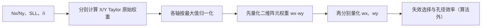

# ESA Taylor 阵元幅度加权算法（ESA Taylor Distribution Weights）

> **算法 ID**：ALG-SENSORS-ESA-TAYLOR-DISTRIBUTION-WEIGHTS  
> **状态**：verified  
> **版本/日期**：1.0 / 2026-07-24  
> **领域**：传感器 / 相控阵天线  
> **AFSIM 模块**：`core/wsf_mil`  
> **覆盖候选**：`80a9d1618f874434`、`a81cf65a6ded7076`（共享量化依赖）  
> **接口规格**：`docs/extracted-algorithms/esa-taylor-distribution-weights/sensors-esa-taylor-distribution-weights-interface-spec.md`

## 1. 算法边界

- **目的**：分别生成 ESA 阵面 X/Y 方向的离散 Taylor 加权，峰值归一化后形成二维阵元幅度权重，并模拟有限位数幅度量化。
- **入口条件**：阵列尺寸已确定，轴向权重向量已按 1 初始化，阵元已创建且初始权重为 1。
- **完成条件**：更新 `mWeightVecX`、`mWeightVecY` 和各 `Element::mWeight`。
- **包含**：Taylor 系数、离散余弦和、逐轴峰值归一化、幅度量化及源码的量化顺序。
- **不包含**：阵元几何布局、随机失效选择、孔径效率、相位量化和阵因子。
- **生命周期位置**：初始化阶段；`AdjustApertureElements` 中位于布局之后、随机失效与孔径效率之前。



## 2. 数据契约

### 2.1 输入

| 中文名称 | 代码标识 | 符号 | 类型 | 单位 | 约束/来源 | Method |
| --- | --- | --- | --- | --- | --- | --- |
| X/Y 阵元数 | `mNX`, `mNY` | $N_x,N_y$ | `int` | 1 | 初始化正常路径 `>0` | `WsfESA_AntennaPattern::ComputeDistributionWeights#9a5cd098f9` |
| X/Y 副瓣比 | `mSidelobeLevelX/Y` | $S_x,S_y$ | `double` | 线性功率比 | 输入层允许 15–55 dB 对应的线性比 | 同上 |
| X/Y Taylor 参数 | `mN_BarX/Y` | $\bar n_x,\bar n_y$ | `int` | 1 | 语义为“受控副瓣数 + 1”；源码不校验范围 | 同上 |
| 幅度量化位数 | `mAmpNumBits` | $b_a$ | `int` | bit | 0 表示不量化；显式配置要求 `>0` | 同上 |
| 轴权重初值 | `mWeightVecX/Y` | $w^{(0)}$ | `vector<double>` | 1 | 调用者初始化为全 1 | 同上 |
| 阵元初始权重 | `mElements[].mWeight` | $e_{ij}^{(0)}$ | `double` | 1 | `Element` 构造默认 1 | 同上 |

### 2.2 输出

| 中文名称 | 代码标识 | 符号 | 类型 | 单位 | 说明 |
| --- | --- | --- | --- | --- | --- |
| X/Y 轴量化权重 | `mWeightVecX/Y` | $\hat w_{x,i},\hat w_{y,j}$ | `vector<double>` | 1 | 峰值归一化后再量化 |
| 二维阵元权重 | `mElements[].mWeight` | $\hat e_{ij}$ | `double` | 1 | 由未量化轴权重乘积直接量化 |

### 2.3 参数、状态与副作用

算法写入三组对象状态，无随机性。`distribution_type` 不是 Taylor 时函数不执行任何计算；在标准初始化链中因此保留全 1 权重。共享量化函数还被阵因子算法用于相位量化。

## 3. 数学模型

对任一轴，令 $N=N_q$、$S=S_q$、$\bar n=\bar n_q$。当 $\bar n>1$ 时：

$$
B=10^{\operatorname{LinearToDB}(S)/20}=\sqrt S,\qquad
A=\frac{\ln(B+\sqrt{B^2-1})}{\pi}
$$

$$
\sigma^2=\frac{\bar n^2}{A^2+(\bar n-\tfrac12)^2}
$$

对 $m=1,\ldots,\bar n-1$：

$$
F_m=
\frac{(-1)^{m+1}}{2}
\frac{
\prod_{i=1}^{\bar n-1}
\left[1-\frac{m^2/\sigma^2}{A^2+(i-\tfrac12)^2}\right]
}{
\prod_{\substack{i=1\\i\ne m}}^{\bar n-1}
\left(1-\frac{m^2}{i^2}\right)
}
$$

离散轴权重为：

$$
w_n^{raw}=1+2\sum_{m=1}^{\bar n-1}
F_m\cos\left(
\frac{2\pi m[n-(N-1)/2]}{N}
\right),\quad
w_n=\frac{w_n^{raw}}{\max_k w_k^{raw}}
$$

当 $\bar n\le1$ 时源码跳过生成，标准调用链中的轴权重保持 1。

量化函数精确为：

$$
Q_{b,R}(v)=
\begin{cases}
v,&b\le0\\
\operatorname{trunc}\left(\dfrac{v}{R/2^b}\right)\dfrac{R}{2^b},&b>0
\end{cases}
$$

其中 `trunc` 是 C++ 浮点转 `int` 的向零截断。幅度使用 $R=1$。源码顺序不可交换：

$$
\hat e_{ij}=Q_{b_a,1}\left(e_{ij}^{(0)}w_{x,i}w_{y,j}\right)
$$

$$
\hat w_{x,i}=Q_{b_a,1}(w_{x,i}),\qquad
\hat w_{y,j}=Q_{b_a,1}(w_{y,j})
$$

所以一般有 $\hat e_{ij}\ne \hat w_{x,i}\hat w_{y,j}$。

## 4. 伪代码

```text
function taylor_distribution_weights(input):
    wx = input.initial_x_weights
    wy = input.initial_y_weights

    if input.distribution != TAYLOR:
        return wx, wy, input.initial_element_weights

    for each axis (w, N, S, nbar):
        if nbar > 1:
            B = 10^(linear_to_db(S) / 20)
            A = log(B + sqrt(B*B - 1)) / pi
            sigma2 = nbar*nbar / (A*A + (nbar - 0.5)^2)
            for n in [0, N):
                w[n] = 1 + 2 * sum(taylor_F(m) * cos(discrete_phase))
        w = w / max(w)

    # 中文：二维乘积先量化，之后才量化轴向向量。
    for j in [0, Ny):
        for i in [0, Nx):
            element[i,j] = quantize(element[i,j] * wx[i] * wy[j], amp_bits, 1)

    wx = quantize_each(wx, amp_bits, 1)
    wy = quantize_each(wy, amp_bits, 1)
    return wx, wy, element
```

## 5. 源码证据

| candidate_id | qualified_name | 模块 | 源码位置 | 证据等级 |
| --- | --- | --- | --- | --- |
| `80a9d1618f874434` | `WsfESA_AntennaPattern::ComputeDistributionWeights#9a5cd098f9` | `core/wsf_mil` | `afsim-2_9/swdev/src/core/wsf_mil/source/WsfESA_AntennaPattern.cpp:303-437` | source-cited |
| `a81cf65a6ded7076` | `WsfESA_AntennaPattern::ComputeQuantizationError#85239a09d9` | `core/wsf_mil` | 同文件 `518-530` | source-cited |

### 5.1 调用与配置证据

| 证据 | 位置 | 结论 |
| --- | --- | --- |
| 初始化顺序 | `WsfESA_AntennaPattern.cpp:255-277` | 权重向量先置 1，Taylor 后接失效和效率 |
| 元素默认值 | `WsfESA_AntennaPattern.hpp:49-60` | 元素权重默认 1 |
| 配置解析 | `.cpp:721-747,937-968` | SLL 有 15–55 dB 门禁；`n_bar` 无范围门禁 |
| 默认配置 | `.cpp:654-674`；`.hpp:69-86` | 默认非 Taylor、量化位数 0、Taylor 数据全 0 |
| dB 转换 | `tools/util/source/UtMath.cpp:121-128` | `LinearToDB=10log10`，`DB_ToLinear=10^(dB/10)` |

未发现覆盖这些私有函数的直接单元测试。

## 6. 依赖与可替换性

| 依赖 | 用途 | 核心必需 | 中性替代 |
| --- | --- | --- | --- |
| `ESA_Data` | 参数存储 | no | 显式不可变输入 |
| `ElementVec` | 二维权重状态 | no | 行优先数组 |
| `UtMath` | $\pi$ 和 dB 转换 | no | 标准常量与公式 |
| `<cmath>` | `pow/log/sqrt/cos` | yes | 等价数学库 |

## 7. 边界、风险与未知

| 条件 | 源码行为 | 风险/建议 |
| --- | --- | --- |
| $\bar n\le1$ | 保留初始均匀权重后归一化 | 若初值不是全 1，输出依赖调用上下文 |
| $\bar n>1$ 且 $S=0$ | `log10(0)` 与后续非有限运算 | 输入块允许遗漏 SLL；中性接口应拒绝 |
| $\bar n$ 过大或相对 $N$ 不合理 | 仍执行乘积与余弦和 | 复杂度和数值误差迅速上升；需显式上限 |
| 最大原始权重为 0/NaN | 除零或传播 NaN | 归一化前检查有限正最大值 |
| 位数很大 | `pow(2,bits)` 转 `int` | 可能溢出或产生未定义/实现相关结果 |
| 二维/轴量化顺序 | 元素量化先于轴量化 | 不能用量化轴向量重新构造兼容元素权重 |
| 负值量化 | 向零截断 | 与 `floor` 不同；虽正常 Taylor 权重应非负，兼容实现仍需保留 |

## 8. 验证计划与结果

| 类型 | 输入 | Oracle | 判据 |
| --- | --- | --- | --- |
| 正常 | $N=5,S=1000$（30 dB），$\bar n=3,b=0$ | `[0.3404043556738716, 0.7768161156469154, 1, 0.7768161156469154, 0.3404043556738716]` | 每项绝对误差 $\le10^{-12}$ |
| 幅度量化 | 同上，$b=3$ | `[0.25,0.75,1,0.75,0.25]` | 精确 |
| 顺序 | X/Y 均用上例，$b=3$，角阵元 | 源码元素权重 `0`，量化轴乘积 `0.0625` | 精确证明不可交换 |
| 量化符号 | $v=\pm0.73,b=3,R=1$ | `+0.625`、`-0.625` | 精确 |
| 退化 | $\bar n=1$、初值全 1 | 全 1 | 精确 |
| 输入异常 | 缺失 SLL、非有限值、过大位数 | 中性接口拒绝 | 不执行公式 |

数值 Oracle 使用独立 JavaScript 标量实现，不调用 AFSIM 函数。

## 9. 可移植性

- **等级**：高。
- 核心是离散标量公式；主要兼容风险在 dB/线性比语义、向零截断和“元素先量化、轴后量化”的状态更新顺序。
- 建议中性实现同时返回未量化轴权重、量化轴权重和源码兼容二维权重，避免下游误重构。
- 重实现前需审查 AFSIM 随附许可证。

## 10. 覆盖账本回写

| candidate_id | 状态 | algorithm_id | 决策理由 | 验证 |
| --- | --- | --- | --- | --- |
| `80a9d1618f874434` | extracted | ALG-SENSORS-ESA-TAYLOR-DISTRIBUTION-WEIGHTS | 独立、可测试的 Taylor 离散加权核心 | passed |
| `a81cf65a6ded7076` | extracted | 本算法；ALG-SENSORS-ESA-WEIGHTED-ARRAY-FACTOR | 共享的幅度/相位量化依赖，不单独扩成第四个算法 | passed |
