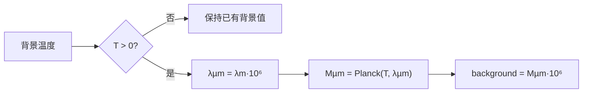

# LADAR 黑体背景谱辐照度初始化（LADAR Blackbody Background Radiance Initialization）

> **算法 ID**：ALG-SENSORS-LADAR-BACKGROUND-RADIANCE  
> **状态**：verified  
> **版本/日期**：1.0 / 2026-07-27  
> **领域**：传感器 / 激光雷达  
> **AFSIM 模块**：`core/wsf_mil`  
> **覆盖候选**：`e6e202761aa4beb3`  
> **接口规格**：`docs/extracted-algorithms/ladar-background-radiance/sensors-ladar-background-radiance-interface-spec.md`

## 1. 算法边界

- **目的**：在配置了背景温度时，把接收机波长上的黑体谱量写入 LADAR 模式背景谱辐照度。
- **入口条件**：模式初始化已完成接收机对象配置。
- **完成条件**：仅当 `mBackgroundTemperature > 0` 时更新 `mBackgroundSpectralIrradiance`。
- **包含**：m→µm 波长换算、普朗克函数调用、每 µm→每 m 数值换算。
- **不包含**：未配置温度时的默认背景来源、面积单位换算、探测噪声计算。
- **生命周期位置**：`WsfLADAR_Sensor::LADAR_Mode::Initialize` 中一次调用。

## 2. 流程



## 3. 数据契约

### 3.1 输入

| 名称 | 代码标识 | 符号 | 单位 | Method |
| --- | --- | --- | --- | --- |
| 背景温度 | `mBackgroundTemperature` | $T_b$ | K（注释约定） | `WsfLADAR_Sensor::ComputeBackgroundRadiance#5c2a42d009` |
| 接收机波长 | `mRcvr.GetWavelength()` | $\lambda_m$ | m | 同上 |

### 3.2 输出

| 名称 | 代码标识 | 符号 | 单位 | 副作用 |
| --- | --- | --- | --- | --- |
| 背景谱辐照度 | `mBackgroundSpectralIrradiance` | $S_b$ | 源码存储量；下游注释为 W/(m²·m) | 条件写入模式状态 |

### 3.3 参数与常量

| 名称 | 代码标识 | 值 | 来源 |
| --- | --- | --- | --- |
| 米至微米比例 | `1.0E6` | $10^6$ | 源码硬编码 |

### 3.4 内部状态

| 状态 | 初值/来源 | 读 | 写 | 更新时机 |
| --- | --- | --- | --- | --- |
| `mBackgroundSpectralIrradiance` | 配置或已有值 | `ComputeTargetSolarIrradiance` | 本函数 | 模式初始化 |

## 4. 数学模型

$$\lambda_{\mu m}=10^6\lambda_m,\qquad S_b=10^6 M_{\lambda_{\mu m}}(T_b)\quad(T_b>0)$$

这是源码的波长谱密度换算顺序。`SpectralRadiantEmittance` 注释为 W/(cm²·µm)，而下游变量注释为 W/(m²·m)；源码仅显示 $10^6$ 波长换算，未显示 $10^4$ 面积换算，故不可把该差异臆测为已处理。

## 5. 伪代码

```text
function initialize_background_radiance(temperature_k, receiver_wavelength_m, stored_value):
    # 中文：源码在未提供正温度时完全不写状态。
    if temperature_k <= 0:
        return stored_value, "not_configured"
    wavelength_um = receiver_wavelength_m * 1e6
    # 中文：调用独立的普朗克谱出射度算法，再按波长单位换算。
    return planck_spectral_emittance(temperature_k, wavelength_um) * 1e6, "updated"
```

## 6. 源码证据

### 6.1 入口和调用链

```text
WsfLADAR_Sensor::LADAR_Mode::Initialize  // 行 337-371
  -> WsfLADAR_Sensor::ComputeBackgroundRadiance#5c2a42d009
  -> WsfLADAR_Sensor::SpectralRadiantEmittance#e62bac53c9
```

### 6.2 源码位置

| candidate_id | qualified_name | 模块 | 源码位置 | 角色 | 证据等级 |
| --- | --- | --- | --- | --- | --- |
| `e6e202761aa4beb3` | `WsfLADAR_Sensor::ComputeBackgroundRadiance#5c2a42d009` | `core/wsf_mil` | `afsim-2_9/swdev/src/core/wsf_mil/source/sensor/WsfLADAR_Sensor.cpp:234-244` | 状态更新 | source-cited |

### 6.3 框架与依赖

| 依赖 | 分类 | 用途 | 中性替代 |
| --- | --- | --- | --- |
| `WsfEM_Rcvr` | AFSIM 框架 | 提供波长 | 显式 `receiver_wavelength_m` |
| 普朗克函数 | 本批算法 | 核心谱量 | 中性纯函数 |

## 7. 边界、风险与未知

| 条件 | 源码行为 | 风险 | 建议 |
| --- | --- | --- | --- |
| $T_b\le0$ | 保留旧状态 | 调用顺序影响输出 | 返回 `not_configured` |
| 波长非正 | 无检查 | 下游普朗克函数非有限 | 中性接口校验 |
| 单位 | 仅做 $10^6$ | 面积量纲可能混淆 | 把存储量标为 code-compatible |

- **已确认假设**：该函数只在 `Initialize` 中由 CodeGraph 调用。
- **待人工复核**：背景温度输入的文档单位与面积单位转换位置。

## 8. 验证计划

| 类型 | 输入 | Oracle | 容差/不变量 |
| --- | --- | --- | --- |
| 正常 | 300 K，$10^{-5}$ m | `3117.7254682771227` | `1e-9` |
| 边界 | 0 K，已有值 7 | 返回 7，未更新 | 精确 |
| 退化 | 正温度、0 m | 中性接口 `invalid_input` | 不写状态 |

## 9. 可移植性

- **等级**：中。
- **可移植核心**：条件状态更新和单位换算。
- **AFSIM 耦合**：接收机对象和模式成员。
- **类型/单位适配**：需显式定义 `stored_spectral_irradiance` 的面积单位。
- **许可证/clean-room 注意**：保留观察到的数值步骤，不复制类结构。

## 10. 覆盖账本回写

| candidate_id | 状态 | algorithm_id | 决策理由 | 验证 |
| --- | --- | --- | --- | --- |
| `e6e202761aa4beb3` | extracted | ALG-SENSORS-LADAR-BACKGROUND-RADIANCE | 独立的黑体背景状态初始化与单位换算 | passed |
