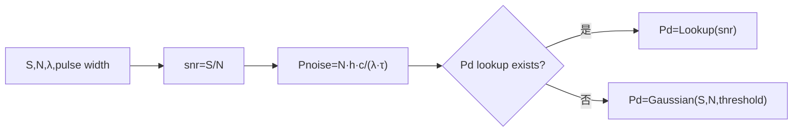

# LADAR 探测概率选择与噪声功率换算（LADAR Detection Probability Selection）

> **算法 ID**：ALG-SENSORS-LADAR-DETECTION-PROBABILITY-SELECTION  
> **状态**：verified  
> **版本/日期**：1.0 / 2026-07-27  
> **领域**：传感器 / 激光雷达  
> **AFSIM 模块**：`core/wsf_mil`  
> **覆盖候选**：`89f195e0973179a5`（精确纳入的上游 `control_flow` 候选）  
> **接口规格**：`docs/extracted-algorithms/ladar-detection-probability-selection/sensors-ladar-detection-probability-selection-interface-spec.md`

## 1. 算法边界

- **目的**：从接收机的信号/噪声光子计数计算 S/N、将噪声光子能量恢复为脉冲功率，并在查表与 Gaussian 模型之间选择 $P_d$。
- **入口条件**：`AttemptToDetect` 已构造 `DetectionData`，并已知发射波长和脉宽。
- **完成条件**：写入 `LADAR_Result` 的 `mSignalToNoise`、`mRcvrNoisePower` 和 `mPd`。
- **包含**：$S/N$、$Nhc/(\lambda\tau)$、Pd 查表优先级和 Gaussian 回退。
- **不包含**：光子计数生成、主动回波方程、最终所需 Pd 门限比较。
- **生命周期位置**：每次 LADAR 探测尝试。

## 2. 流程



## 3. 数据契约

### 3.1 输入

| 名称 | 代码标识 | 符号 | 单位 | Method |
| --- | --- | --- | --- | --- |
| 信号/噪声计数 | `dd.mSignalCount`, `dd.mNoiseCount` | $S,N$ | 光子计数 | `WsfLADAR_Sensor::ComputeProbabilityOfDetection#04d3a9fa19` |
| 波长 | `aXmtr.GetWavelength()` | $\lambda$ | m | 同上 |
| 脉宽 | `aXmtr.GetPulseWidth()` | $\tau$ | s | 同上 |
| 阈值 | `mDetectionThreshold` | $\theta$ | S/N | 同上 |
| Pd 表 | `mDetectionProbabilityPtr` | $L$ | 可选查表 | 同上 |

### 3.2 输出

| 名称 | 代码标识 | 符号 | 单位 |
| --- | --- | --- | --- |
| 信噪比 | `aResult.mSignalToNoise` | $S/N$ | 1 |
| 接收机噪声功率 | `aResult.mRcvrNoisePower` | $P_N$ | W |
| 探测概率 | `aResult.mPd` | $P_d$ | 1 |

### 3.3 参数与常量

| 名称 | 代码标识 | 符号 | 单位 | 来源 |
| --- | --- | --- | --- | --- |
| 普朗克常数 | `UtMath::cPLANCK_CONSTANT` | $h$ | J·s | AFSIM 常量 |
| 光速 | `UtMath::cLIGHT_SPEED` | $c$ | m/s | AFSIM 常量 |

### 3.4 内部状态

`aResult` 被本函数写入；`mDetectionProbabilityPtr` 和 `mDetectionThreshold` 是模式配置/状态。

## 4. 数学模型

$$\mathrm{SNR}=S/N,\qquad E_N=N\frac{hc}{\lambda},\qquad P_N=\frac{E_N}{\tau}=\frac{Nhc}{\lambda\tau}$$

$$P_d=\begin{cases}L(\mathrm{SNR}),&L\ne\varnothing\\P_{d,Gaussian}(S,N,\theta),&L=\varnothing\end{cases}$$

查表路径不调用 Gaussian 近似；源码初始化 `mPd=0` 后始终尝试上述两路径之一。

## 5. 伪代码

```text
function select_detection_probability(signal, noise, wavelength_m, pulse_width_s, threshold, lookup):
    # 中文：按源码先计算结果对象中可见的 S/N 和噪声功率。
    snr = signal / noise
    noise_power_w = noise * planck_constant * light_speed / wavelength_m / pulse_width_s
    # 中文：配置表存在时优先使用表，不混用 Gaussian 结果。
    pd = lookup(snr) if lookup exists else gaussian_detection_probability(signal, noise, threshold)
    return snr, noise_power_w, pd
```

## 6. 源码证据

### 6.1 入口和调用链

```text
WsfLADAR_Sensor::LADAR_Mode::AttemptToDetect  // 生成 DetectionData
  -> WsfLADAR_Sensor::ComputeProbabilityOfDetection#04d3a9fa19
  -> WsfLADAR_Sensor::ComputeGaussianDetectionProbability#a63ba7cb81  // 无表时
```

### 6.2 源码位置

| candidate_id | qualified_name | 模块 | 源码位置 | 角色 | 证据等级 |
| --- | --- | --- | --- | --- | --- |
| `89f195e0973179a5` | `WsfLADAR_Sensor::ComputeProbabilityOfDetection#04d3a9fa19` | `core/wsf_mil` | `afsim-2_9/swdev/src/core/wsf_mil/source/sensor/WsfLADAR_Sensor.cpp:601-627` | 核心编排 | source-cited |

### 6.3 框架与依赖

| 依赖 | 分类 | 用途 | 中性替代 |
| --- | --- | --- | --- |
| `WsfLASER_RcvrComponent::DetectionData` | AFSIM 类型 | 计数载体 | `PhotonCounts` |
| `mDetectionProbabilityPtr` | AFSIM 查表 | 查表 Pd | 回调/单调表 |
| Gaussian 函数 | 本批算法 | 无表回退 | 纯函数 |

## 7. 边界、风险与未知

| 条件 | 源码行为 | 影响 | 建议 |
| --- | --- | --- | --- |
| $N=0$ 或 $\tau=0$ | 无检查 | 除零 | 中性接口拒绝 |
| 查表存在 | 忽略阈值/Gaussian | 两模型不可混用 | 返回 `used_lookup` |
| 波长非正 | 无检查 | 光子能量无效 | 校验 |

- **已确认假设**：该函数因包含三项确定数学输出，按源码证据从上游流程候选精确纳入。
- **待人工复核**：查表插值、范围外行为由 `Lookup` 实现决定，不属于本函数。

## 8. 验证计划

| 类型 | 输入 | Oracle | 容差/不变量 |
| --- | --- | --- | --- |
| 正常 | $S=20,N=10,\lambda=10^{-6}$ m，$\tau=10^{-8}$ s，$\theta=1$，无表 | SNR=2，$P_N=1.986445857148929e-10$ W，Pd=`.8413513380564247` | `1e-12` 相对/绝对 |
| 边界 | 有查表且 `Lookup(2)=.7` | Pd=.7 | 精确选择 |
| 退化 | $N=0$ | `invalid_input` | 不除零 |

## 9. 可移植性

- **等级**：中高。
- **可移植核心**：光子能量换算与明确模型选择。
- **AFSIM 耦合**：`LADAR_Result`、发射机和查表对象。
- **类型/单位适配**：采用 SI 的 m、s、J、W；计数无量纲。
- **许可证/clean-room 注意**：迁移为数据结构和回调，而非框架对象。

## 10. 覆盖账本回写

| candidate_id | 状态 | algorithm_id | 决策理由 | 验证 |
| --- | --- | --- | --- | --- |
| `89f195e0973179a5` | extracted | ALG-SENSORS-LADAR-DETECTION-PROBABILITY-SELECTION | 独立输出 S/N、噪声功率及表/高斯概率选择；按源码精确纳入 | passed |
