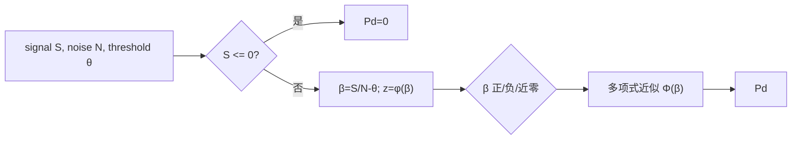

# LADAR Gaussian 探测概率近似（LADAR Gaussian Detection Probability Approximation）

> **算法 ID**：ALG-SENSORS-LADAR-GAUSSIAN-DETECTION-PROBABILITY  
> **状态**：verified  
> **版本/日期**：1.0 / 2026-07-27  
> **领域**：传感器 / 激光雷达  
> **AFSIM 模块**：`core/wsf_mil`  
> **覆盖候选**：`9a33250f14021782`  
> **接口规格**：`docs/extracted-algorithms/ladar-gaussian-detection-probability/sensors-ladar-gaussian-detection-probability-interface-spec.md`

## 1. 算法边界

- **目的**：把信号和噪声光子计数相对检测阈值的裕量映射为 $[0,1]$ 探测概率。
- **入口条件**：简单探测器路径未提供 Pd-S/N 查表时。
- **完成条件**：信号非正直接返回 0；其余按 Abramowitz–Stegun 26.2.16 的正态 CDF 多项式近似返回概率。
- **包含**：$\beta=S/N-\theta$、正负分支、零附近 0.5 和三次多项式。
- **不包含**：查表探测模型、噪声功率换算、阈值比较及检测状态写入。
- **生命周期位置**：每次 `ComputeProbabilityOfDetection` 的 Gaussian 分支。

## 2. 流程



## 3. 数据契约

### 3.1 输入

| 名称 | 代码标识 | 符号 | 类型 | 单位 | Method |
| --- | --- | --- | --- | --- | --- |
| 信号计数 | `aSignal` | $S$ | `double` | 光子计数 | `WsfLADAR_Sensor::ComputeGaussianDetectionProbability#a63ba7cb81` |
| 噪声计数 | `aNoise` | $N$ | `double` | 光子计数 | 同上 |
| 检测阈值 | `aThreshold` | $\theta$ | `double` | S/N 阈值 | 同上 |

### 3.2 输出

| 名称 | 代码标识 | 符号 | 范围 |
| --- | --- | --- | --- |
| 探测概率 | `return` | $P_d$ | 源码意图 $[0,1]$ |

### 3.3 参数与常量

| 名称 | 代码标识 | 值 | 来源 |
| --- | --- | --- | --- |
| 正态密度系数 | `cCONST` | `0.39894228` | $1/\sqrt{2\pi}$，源码注释 |
| 近零带 | `1.0E-5` | $\varepsilon$ | 源码硬编码 |
| 多项式系数 | `0.33267, .4361836, -.1201676, .9372980` | — | 源码引用 A&S 26.2.16 |

### 3.4 内部状态

无持久状态；局部 `signalToNoise`、`beta`、`z`、`t` 每次重算。

## 4. 数学模型

$$\beta=\frac{S}{N}-\theta,\quad z=\frac{1}{\sqrt{2\pi}}e^{-\beta^2/2},\quad
q(t)=0.4361836t-0.1201676t^2+0.9372980t^3$$

$$P_d=\begin{cases}0&S\le0\\1-zq(1/(1+0.33267\beta))&\beta>10^{-5}\\zq(1/(1-0.33267\beta))&\beta<-10^{-5}\\0.5&|\beta|\le10^{-5}\end{cases}$$

源码注释称其忽略完整 $Q(\beta+2\alpha)$ 项，只采用 $P_d\approx\Phi(\beta)$。

## 5. 伪代码

```text
function gaussian_detection_probability(signal_count, noise_count, threshold):
    # 中文：这一早退是源码定义，优先于 S/N 计算。
    if signal_count <= 0: return 0
    beta = signal_count / noise_count - threshold
    z = 0.39894228 * exp(-0.5 * beta * beta)
    # 中文：正负分支用对称多项式逼近标准正态 CDF。
    if beta > 1e-5: return 1 - z * polynomial(1/(1+.33267*beta))
    if beta < -1e-5: return z * polynomial(1/(1-.33267*beta))
    return .5
```

## 6. 源码证据

### 6.1 入口和调用链

```text
WsfLADAR_Sensor::ComputeProbabilityOfDetection#04d3a9fa19
  -> WsfLADAR_Sensor::ComputeGaussianDetectionProbability#a63ba7cb81
```

### 6.2 源码位置

| candidate_id | qualified_name | 模块 | 源码位置 | 角色 | 证据等级 |
| --- | --- | --- | --- | --- | --- |
| `9a33250f14021782` | `WsfLADAR_Sensor::ComputeGaussianDetectionProbability#a63ba7cb81` | `core/wsf_mil` | `afsim-2_9/swdev/src/core/wsf_mil/source/sensor/WsfLADAR_Sensor.cpp:638-681` | 核心 | source-cited |

### 6.3 框架与依赖

| 依赖 | 分类 | 用途 | 中性替代 |
| --- | --- | --- | --- |
| `<cmath>::exp` | 标准库 | 正态密度 | 等价数学库 |

## 7. 边界、风险与未知

| 条件 | 源码行为 | 影响 | 建议 |
| --- | --- | --- | --- |
| $S\le0$ | 返回 0 | 避免零/负信号概率 | 保留 |
| $N=0,S>0$ | 无检查 | 除零 | 中性接口拒绝或定义极限 |
| $|\beta|\le10^{-5}$ | 返回 .5 | 近零不连续导数 | 兼容时保留 |

- **已确认假设**：`aSignal/aNoise` 是光子计数，来自接收机 `DetectionData`。
- **待人工复核**：完整 MDC B1368 的第二 $Q$ 项在当前实现中被明确省略。

## 8. 验证计划

| 类型 | 输入 | Oracle | 容差/不变量 |
| --- | --- | --- | --- |
| 正常 | $S=20,N=10,\theta=1$ | `0.8413513380564247` | `1e-12` |
| 边界 | $S=10,N=10,\theta=1$ | `.5` | 精确 |
| 退化 | $S=0$ | 0 | 精确 |

## 9. 可移植性

- **等级**：高。
- **可移植核心**：纯标量 CDF 近似。
- **AFSIM 耦合**：仅计数来源和查表分支选择。
- **类型/单位适配**：把计数与无量纲 S/N 区分。
- **许可证/clean-room 注意**：重实现时采用已记录多项式契约。

## 10. 覆盖账本回写

| candidate_id | 状态 | algorithm_id | 决策理由 | 验证 |
| --- | --- | --- | --- | --- |
| `9a33250f14021782` | extracted | ALG-SENSORS-LADAR-GAUSSIAN-DETECTION-PROBABILITY | 独立、可测试的正态概率近似 | passed |
