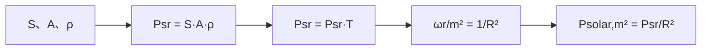

# LADAR 目标太阳反射谱辐照度（LADAR Target Solar Irradiance）

> **算法 ID**：ALG-SENSORS-LADAR-TARGET-SOLAR-IRRADIANCE  
> **状态**：verified  
> **版本/日期**：1.0 / 2026-07-27  
> **领域**：传感器 / 激光雷达  
> **AFSIM 模块**：`core/wsf_mil`  
> **覆盖候选**：`4f57213d1ccef7ab`  
> **接口规格**：`docs/extracted-algorithms/ladar-target-solar-irradiance/sensors-ladar-target-solar-irradiance-interface-spec.md`

## 1. 算法边界

- **目的**：以背景太阳谱辐照度、目标有效面积/反射率、单程传输和接收端单位面积立体角计算太阳噪声谱辐照度。
- **入口条件**：探测尝试已得到目标反射面积、反射率、距离和传输因子。
- **完成条件**：返回接收机前端的 code-compatible 谱辐照度。
- **包含**：Lambertian 反射标量积、传输乘法和 $1/R^2$ 接收几何。
- **不包含**：激光主动回波、接收机探测数据、光学遮蔽和地形门限。
- **生命周期位置**：`LADAR_Mode::AttemptToDetect` 的两程相互作用内。

## 2. 流程



## 3. 数据契约

### 3.1 输入

| 名称 | 代码标识 | 符号 | 单位 | Method |
| --- | --- | --- | --- | --- |
| 背景谱辐照度 | `mBackgroundSpectralIrradiance` | $S$ | 下游注释 W/(m²·m) | `WsfLADAR_Sensor::ComputeTargetSolarIrradiance#ad32e21a39` |
| 目标有效面积 | `aTargetArea` | $A$ | m² | 同上 |
| 反射率 | `aTargetReflectivity` | $\rho$ | 源码按 1/sr 使用 | 同上 |
| 距离 | `aRange` | $R$ | m | 同上 |
| 传输率 | `aTransmittance` | $T_a$ | 1 | 同上 |

### 3.2 输出

| 名称 | 代码标识 | 符号 | 单位 |
| --- | --- | --- | --- |
| 太阳噪声谱辐照度 | `return` | $E_{solar}$ | W/(m²·m)，按源码注释 |

### 3.3 参数与常量

无独立配置；`1.0/(aRange*aRange)` 是源码几何关系。

### 3.4 内部状态

函数无写状态；读取 `mBackgroundSpectralIrradiance`。

## 4. 数学模型

$$P_{sr}=S A\rho T_a,\qquad \boxed{E_{solar}=\frac{S A\rho T_a}{R^2}}$$

源码注释称 `P_sr` 在传输后为 W/(sr·m)，并把 $1/R^2$ 标成 sr/m²；中性实现把它视为源码定义的单位面积接收几何因子。

## 5. 伪代码

```text
function target_solar_irradiance(background, area_m2, reflectivity, range_m, transmittance):
    # 中文：中性接口要求 range_m 为正；AFSIM 源码未做保护。
    validate_positive_finite(range_m)
    reflected_spectral_power = background * area_m2 * reflectivity
    # 中文：只乘目标到接收机的单程传输率。
    reflected_spectral_power *= transmittance
    return reflected_spectral_power / (range_m * range_m)
```

## 6. 源码证据

### 6.1 入口和调用链

```text
WsfLADAR_Sensor::LADAR_Mode::AttemptToDetect  // 主动回波与太阳噪声建模
  -> WsfLADAR_Sensor::ComputeTargetSolarIrradiance#ad32e21a39
  -> WsfLASER_RcvrComponent::ComputeDetectionData  // 消费返回值
```

### 6.2 源码位置

| candidate_id | qualified_name | 模块 | 源码位置 | 角色 | 证据等级 |
| --- | --- | --- | --- | --- | --- |
| `4f57213d1ccef7ab` | `WsfLADAR_Sensor::ComputeTargetSolarIrradiance#ad32e21a39` | `core/wsf_mil` | `afsim-2_9/swdev/src/core/wsf_mil/source/sensor/WsfLADAR_Sensor.cpp:259-281` | 核心 | source-cited |

### 6.3 框架与依赖

| 依赖 | 分类 | 用途 | 中性替代 |
| --- | --- | --- | --- |
| LADAR 模式成员 | AFSIM 状态 | 背景谱量 | 显式输入 |

## 7. 边界、风险与未知

| 条件 | 源码行为 | 影响 | 建议 |
| --- | --- | --- | --- |
| $R=0$ | 无检查 | 除零 | 中性接口拒绝 |
| $T_a<0$ 或 $\rho<0$ | 无夹取 | 可得负辐照度 | 由上游校验或拒绝 |
| 面积为 0 | 返回 0 | 合理退化 | 保留 |

- **已确认假设**：`AttemptToDetect` 传入的 $T_a$ 是单程 `ComputeAttenuationFactor` 结果。
- **待人工复核**：反射率在源码注释中带 1/sr，配置文档未在当前证据包内。

## 8. 验证计划

| 类型 | 输入 | Oracle | 容差/不变量 |
| --- | --- | --- | --- |
| 正常 | $S=1000,A=2,\rho=.4,R=100,T=.8$ | `0.064` | `1e-15` |
| 边界 | $A=0$ | 0 | 精确 |
| 退化 | $R=0$ | `invalid_input` | 不除零 |

## 9. 可移植性

- **等级**：高。
- **可移植核心**：标量 $SA\rho T/R^2$。
- **AFSIM 耦合**：背景值与传输率的产生过程。
- **类型/单位适配**：明确反射率的辐射度/立体角约定。
- **许可证/clean-room 注意**：独立实现公式和范围校验。

## 10. 覆盖账本回写

| candidate_id | 状态 | algorithm_id | 决策理由 | 验证 |
| --- | --- | --- | --- | --- |
| `4f57213d1ccef7ab` | extracted | ALG-SENSORS-LADAR-TARGET-SOLAR-IRRADIANCE | 独立、可测试的太阳反射接收几何公式 | passed |
