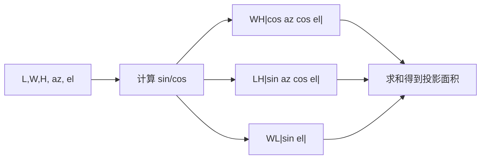

# 光学长方体投影面积（Optical Box Projected Area）

> **算法 ID**：ALG-SENSORS-OPTICAL-BOX-PROJECTED-AREA  
> **状态**：verified  
> **版本/日期**：1.0 / 2026-07-27  
> **领域**：传感器 / 光学特征  
> **AFSIM 模块**：`core/wsf_mil`  
> **覆盖候选**：`83f6af3c75d7a558`  
> **接口规格**：`docs/extracted-algorithms/optical-box-projected-area/sensors-optical-box-projected-area-interface-spec.md`

## 1. 算法边界

- **目的**：未配置光学特征但平台长宽高均为正时，用正交投影计算可见长方体面的总面积。
- **入口条件**：`signaturePtr == nullptr` 且三维尺寸均正。
- **完成条件**：计算投影面积，再由外层乘 `interfacePtr->GetScaleFactor()`。
- **包含**：三对正交面的绝对余弦投影。
- **不包含**：配置签名的 `GetSignature`、默认签名创建、日志和缩放因子本身。
- **生命周期位置**：光学/EOIR/LADAR/SAR 探测期间的特征查询。

## 2. 流程



## 3. 数据契约

### 3.1 输入

| 名称 | 代码标识 | 符号 | 单位 | Method |
| --- | --- | --- | --- | --- |
| 长宽高 | `length/width/height` | $L,W,H$ | m | `WsfOpticalSignature::GetValue#6d56123998` |
| 方位/俯仰 | `aAzimuth/aElevation` | $a,e$ | rad | 同上 |

### 3.2 输出

| 名称 | 代码标识 | 符号 | 单位 |
| --- | --- | --- | --- |
| 未缩放投影面积 | `sig` | $A_p$ | m² |

### 3.3 参数与常量

无配置常量；外层比例 `GetScaleFactor()` 不属于本算法核心。

### 3.4 内部状态

无持久状态；平台几何是只读输入。

## 4. 数学模型

$$\boxed{A_p=WH|\cos a\cos e|+LH|\sin a\cos e|+WL|\sin e|}$$

源码注释给出单位视线 $\{\cos a\cos e,\sin a\cos e,-\sin e\}$，以绝对值选择每对相对面中的可见面。

## 5. 伪代码

```text
function box_projected_area(length_m, width_m, height_m, azimuth_rad, elevation_rad):
    validate_positive(length_m, width_m, height_m)
    # 中文：三个项分别是前后、左右、上下两面对当前视线的投影。
    return width_m*height_m*abs(cos(azimuth_rad)*cos(elevation_rad)) \
         + length_m*height_m*abs(sin(azimuth_rad)*cos(elevation_rad)) \
         + width_m*length_m*abs(sin(elevation_rad))
```

## 6. 源码证据

### 6.1 入口和调用链

```text
WsfLADAR_Sensor::LADAR_Mode::AttemptToDetect
  -> WsfOpticalSignature::GetValue#6d56123998
  -> 默认无签名且尺寸有效时的长方体投影面积分支
```

### 6.2 源码位置

| candidate_id | qualified_name | 模块 | 源码位置 | 角色 | 证据等级 |
| --- | --- | --- | --- | --- | --- |
| `83f6af3c75d7a558` | `WsfOpticalSignature::GetValue#6d56123998` | `core/wsf_mil` | `afsim-2_9/swdev/src/core/wsf_mil/source/WsfOpticalSignature.cpp:166-222` | 条件核心 | source-cited |

### 6.3 框架与依赖

| 依赖 | 分类 | 用途 | 中性替代 |
| --- | --- | --- | --- |
| `WsfPlatform` | AFSIM 框架 | 尺寸与签名 | 显式尺寸输入 |
| `OpticalSignatureInterface` | AFSIM 框架 | 非默认分支与缩放 | 调用者外置 |

## 7. 边界、风险与未知

| 条件 | 源码行为 | 影响 | 建议 |
| --- | --- | --- | --- |
| 签名存在 | 转调用签名 | 不使用本公式 | 选择器外置 |
| 任一尺寸非正 | 转默认签名逻辑 | 无几何面积 | 返回 `not_applicable` |
| 角度非有限 | 无检查 | NaN | 中性接口拒绝 |

- **已确认假设**：面积依平台体轴与视线的方位/俯仰约定。
- **待人工复核**：平台长宽高的体轴方向定义由框架几何约定决定。

## 8. 验证计划

| 类型 | 输入 | Oracle | 容差/不变量 |
| --- | --- | --- | --- |
| 正常 | $L=4,W=2,H=1,a=0,e=0$ | 2 m² | `1e-15` |
| 边界 | $a=\pi/2,e=0$ | 4 m² | `1e-15` |
| 退化 | $H=0$ | `not_applicable` | 不调用公式 |

## 9. 可移植性

- **等级**：高；无状态闭式面积投影。
- **AFSIM 耦合**：签名选择和比例缩放在算法外。
- **类型/单位适配**：m、rad 和 m²；必须定义体轴。
- **许可证/clean-room 注意**：独立实现公式与分支边界。

## 10. 覆盖账本回写

| candidate_id | 状态 | algorithm_id | 决策理由 | 验证 |
| --- | --- | --- | --- | --- |
| `83f6af3c75d7a558` | extracted | ALG-SENSORS-OPTICAL-BOX-PROJECTED-AREA | 函数中可独立测试的默认长方体投影数学分支 | passed |
