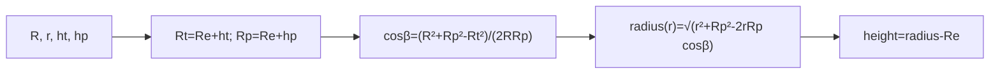

# 光学路径球形地球高度（Optical Curved-Earth Path Height）

> **算法 ID**：ALG-SENSORS-OPTICAL-CURVED-EARTH-PATH-HEIGHT  
> **状态**：verified  
> **版本/日期**：1.0 / 2026-07-27  
> **领域**：传感器 / 光学传播  
> **AFSIM 模块**：`core/wsf_mil`  
> **覆盖候选**：`b9dcf250b3cf3878`、`bf1c93bdd53ab1f4`、`8822387113318a75`  
> **接口规格**：`docs/extracted-algorithms/optical-curved-earth-path-height/sensors-optical-curved-earth-path-height-interface-spec.md`

## 1. 算法边界

- **目的**：在球形地球几何中，按平台到目标斜线的位置计算路径采样点的海拔。
- **入口条件**：总斜距及两端高度代表可计算的几何三角形。
- **完成条件**：返回采样点到地球球面之上的高度 m。
- **包含**：两次余弦定理与地球半径相减。
- **不包含**：积分步长、密度/湍流系数或射线遮挡。
- **生命周期位置**：`WsfOpticalPath::Integrand` 的积分辅助计算。

## 2. 流程



## 3. 数据契约

### 3.1 输入

| 名称 | 代码标识 | 符号 | 单位 | Method |
| --- | --- | --- | --- | --- |
| 路径距离 | `aRangeFromPlatform` | $r$ | m | `Integrand::Height#1312e6167f` |
| 总斜距 | `aTotalSlantRange` | $R$ | m | 同上 |
| 目标/平台高度 | `aTargetHeight/aPlatformHeight` | $h_t,h_p$ | m MSL | 同上 |

### 3.2 输出

| 名称 | 代码标识 | 符号 | 单位 |
| --- | --- | --- | --- |
| 路径高度 | `return` | $h(r)$ | m MSL |

### 3.3 参数与常量

| 名称 | 代码标识 | 符号 | 单位 | 来源 |
| --- | --- | --- | --- | --- |
| 球形地球半径 | `UtSphericalEarth::cEARTH_RADIUS` | $R_e$ | m | AFSIM 常量 |

### 3.4 内部状态

无持久状态；`TargetRadius`、`PlatformRadius`、`CosBeta` 为局部几何中间量。

## 4. 数学模型

$$R_t=R_e+h_t,\quad R_p=R_e+h_p,\quad c_\beta=\frac{R^2+R_p^2-R_t^2}{2RR_p}$$
$$\boxed{h(r)=\sqrt{r^2+R_p^2-2rR_pc_\beta}-R_e}$$

这是球面弦线插值，不是平地线性高度插值。

## 5. 伪代码

```text
function curved_earth_path_height(r_m, total_range_m, target_height_m, platform_height_m, earth_radius_m):
    # 中文：先以地心半径表达两端位置。
    rt = earth_radius_m + target_height_m; rp = earth_radius_m + platform_height_m
    cos_beta = (total_range_m^2 + rp^2 - rt^2) / (2 * total_range_m * rp)
    # 中文：按源码余弦定理计算采样点地心半径并回到 MSL 高度。
    return sqrt(r_m^2 + rp^2 - 2 * r_m * rp * cos_beta) - earth_radius_m
```

## 6. 源码证据

### 6.1 入口和调用链

```text
WsfOpticalPath::Integrand  // 光学路径积分器
  -> Integrand::Height#1312e6167f  // 每个路径样本的球面高度
```

### 6.2 源码位置

| candidate_id | qualified_name | 模块 | 源码位置 | 角色 | 证据等级 |
| --- | --- | --- | --- | --- | --- |
| `b9dcf250b3cf3878` | `Integrand::Height#1312e6167f` | `core/wsf_mil` | `afsim-2_9/swdev/src/core/wsf_mil/source/WsfOpticalPath.cpp:176-193` | 主索引别名 | source-cited |
| `bf1c93bdd53ab1f4` | `WsfOpticalPath::Height#1312e6167f` | `core/wsf_mil` | 同上 | 同一实现别名 | source-cited |
| `8822387113318a75` | `WsfOpticalPathCoefficientTypes::Height#1312e6167f` | `core/wsf_mil` | 同上 | 同一实现别名 | source-cited |

### 6.3 框架与依赖

| 依赖 | 分类 | 用途 | 中性替代 |
| --- | --- | --- | --- |
| `UtSphericalEarth` | AFSIM 常量 | 地球半径 | 显式参数 |
| `<cmath>` | 标准库 | `sqrt/pow` | 等价数学库 |

## 7. 边界、风险与未知

| 条件 | 源码行为 | 影响 | 建议 |
| --- | --- | --- | --- |
| $R=0$ 或 $R_p=0$ | 无检查 | 除零 | 中性接口拒绝 |
| 不满足三角不等式 | 无夹取 | 根号负数 | 返回 `invalid_geometry` |
| $r\notin[0,R]$ | 无检查 | 外插而非路径内插 | 校验 |

- **已确认假设**：使用固定球形地球半径。
- **待人工复核**：调用者是否保证路径无遮挡和几何可行不属于此函数。

## 8. 验证计划

| 类型 | 输入 | Oracle | 容差/不变量 |
| --- | --- | --- | --- |
| 正常 | $R_e=6371000,R=10000,r=5000,h_t=0,h_p=1000$ | `498.0577569035813` m | `1e-9` |
| 边界 | $r=0$ | $h_p$ | `1e-9` |
| 退化 | $R=0$ | `invalid_geometry` | 不除零 |

## 9. 可移植性

- **等级**：高；闭式球面几何。
- **AFSIM 耦合**：只有地球半径常量和索引别名。
- **类型/单位适配**：统一 m MSL；不可混入椭球高。
- **许可证/clean-room 注意**：从公式独立重实现。

## 10. 覆盖账本回写

| candidate_id | 状态 | algorithm_id | 决策理由 | 验证 |
| --- | --- | --- | --- | --- |
| `b9dcf250b3cf3878`、`bf1c93bdd53ab1f4`、`8822387113318a75` | extracted | ALG-SENSORS-OPTICAL-CURVED-EARTH-PATH-HEIGHT | 同一球面路径高度实现的三个上游别名 | passed |
