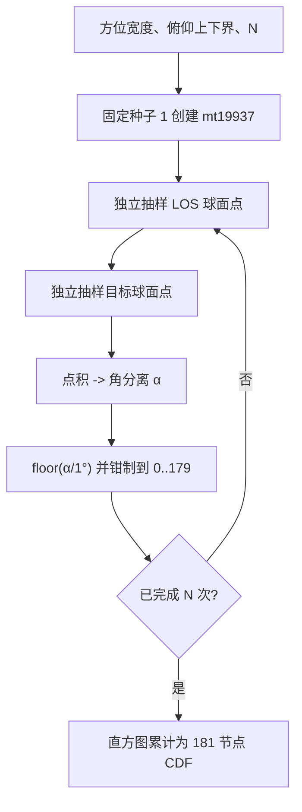

# 光学掠视角分离 Monte Carlo CDF（Optical Glimpse Angular-Separation Monte Carlo CDF）

> **算法 ID**：ALG-SENSORS-OPTICAL-GLIMPSE-ANGULAR-CDF  
> **状态**：verified  
> **版本/日期**：1.0 / 2026-07-23  
> **领域**：传感器 / 光学探测  
> **AFSIM 模块**：`core/wsf_mil`  
> **覆盖候选**：`44313660a8411999`、`85dcc72c047f476c`、`e2cc39b400c2be96`  
> **接口规格**：`docs/extracted-algorithms/optical-glimpse-angular-cdf/sensors-optical-glimpse-angular-cdf-interface-spec.md`

## 1. 算法边界

- **目的**：在给定方位/俯仰视场内独立、均匀地抽样视线点和目标点，估计二者球面角分离的 1° 分箱累积分布。
- **入口条件**：光学模式初始化；视场和 Monte Carlo 迭代数已通过输入校验。
- **完成条件**：生成 181 个 CDF 节点，供后续 `InterpolateDistribution` 和单次掠视探测概率积分使用。
- **包含**：球面面积均匀采样、点积角分离、180 个直方图箱、累计归一化。
- **不包含**：对比度阈值、放大率、眼球积分、最终探测概率、目标运动或时序相关性。
- **生命周期位置**：`model_update`，实际由 `GlimpseProbability::Initialize` 调用一次；每次重算从固定随机状态开始。



## 2. 数据契约

### 2.1 输入

| 中文名称 | 代码标识 | 符号 | 类型 | 单位 | 约束 | Method |
| --- | --- | --- | --- | --- | --- | --- |
| 方位视场宽度 | `mAzimuthFOV` | $\theta_0$ | `double` | deg（内部存储） | 输入角经校验为 `[0,2π]` 后转度；默认 5° | `GlimpseProbability::ComputeProbabilityDistribution#a7048f096e` |
| 最小俯仰 | `mMinElevation` | $\phi_{\min}$ | `double` | deg（内部） | `[-90°,90°]`；默认 0° | 同上 |
| 最大俯仰 | `mMaxElevation` | $\phi_{\max}$ | `double` | deg（内部） | `[-90°,90°]` 且不小于最小值；默认 5° | 同上 |
| 迭代数 | `mNumIterations` | $N$ | `int` | 次 | `>0`；默认 1000 | 同上 |
| 随机状态 | 局部 `ut::Random` | — | `std::mt19937` | — | 默认种子固定为 1 | 同上 |

### 2.2 输出

| 中文名称 | 代码标识 | 符号 | 类型 | 单位 | 说明 |
| --- | --- | --- | --- | --- | --- |
| 角分离 CDF | `mProbabilityDistribution` | $F[j]$ | `vector<double>[181]` | 概率 | $F[j]$ 近似 $P(\alpha<j^\circ)$；$j=0,\dots,180$ |

### 2.3 内部变量

| 代码标识 | 数学符号 | 含义 |
| --- | --- | --- |
| `sinPhiMin/Max` | $s_{\min},s_{\max}$ | 俯仰正弦边界 |
| `theta`, `sinPhi` | $\theta,\sin\phi$ | 面积均匀球面抽样参数 |
| `(x1,y1,z1)` / `(x2,y2,z2)` | $\mathbf u,\mathbf v$ | LOS/目标单位向量 |
| `temp` | $q$ | $\mathbf u\cdot\mathbf v$ |
| `alpha` | $\alpha$ | 角分离，deg |
| `iStats[k]` | $H_k$ | 第 $k$ 个 1° 箱的样本数 |

函数将结果写入对象成员；局部随机数生成器不持久化，因此重复调用会从种子 1 重新生成同一序列。

## 3. 数学模型

### 3.1 球面视场均匀采样

对每个 LOS 点和目标点独立生成 $U_\theta,U_\phi\sim U[0,1)$：

$$
\theta=\theta_0U_\theta
$$

$$
\sin\phi=\sin\phi_{\min}
+(\sin\phi_{\max}-\sin\phi_{\min})U_\phi
$$

$$
\mathbf u=
\begin{bmatrix}
\cos\phi\cos\theta\\
\cos\phi\sin\theta\\
\sin\phi
\end{bmatrix}
$$

在 $\sin\phi$ 上均匀而不是直接在 $\phi$ 上均匀，使球面面积密度均匀。

### 3.2 角分离与分箱

$$
q=\mathbf u\cdot\mathbf v
$$

$$
\alpha=
\begin{cases}
0,&q\ge1\\
\arccos(q)\frac{180}{\pi},&q<1
\end{cases}
$$

$$
k=\min(179,\max(0,\operatorname{trunc}(\alpha))),\qquad H_k\leftarrow H_k+1
$$

对非负角度，C++ 向零截断等同于 $\lfloor\alpha\rfloor$。

### 3.3 累积分布

$$
F[0]=0
$$

$$
\boxed{F[j]=F[j-1]+\frac{H_{j-1}}{\operatorname{float}(N)}},
\qquad j=1,\dots,180
$$

源码刻意把分母转换为 `float`，再提升到 `double` 累加；这会保留单精度归一化误差。所有样本最终进入 0–179 箱，因此 $F[180]$ 应接近 1，但不保证逐位等于 1。

## 4. 伪代码

```text
function build_angular_separation_cdf(az_fov, el_min, el_max, N):
    histogram[0..179] = 0
    rng = mt19937(seed=1)  # 中文：每次调用都重置，不使用仿真全局种子。

    for sample in 1..N:
        # 中文：在方位和 sin(俯仰) 上抽样，得到球面面积均匀点。
        los = sample_spherical_patch(rng, az_fov, el_min, el_max)
        target = sample_spherical_patch(rng, az_fov, el_min, el_max)
        dot = los · target
        alpha_deg = 0 if dot >= 1 else degrees(acos(dot))
        bin = clamp(trunc(alpha_deg), 0, 179)
        histogram[bin] += 1

    cdf[0] = 0
    for j in 1..180:
        # 中文：兼容源码时先把 N 转成 float，再执行除法。
        cdf[j] = cdf[j-1] + histogram[j-1] / float32(N)
    return cdf
```

## 5. 源码证据

### 5.1 调用链

```text
GlimpseProbability::Initialize
  -> ComputeProbabilityDistribution
ProbabilityOfDetection
  -> InterpolateDistribution
     -> mProbabilityDistribution
```

### 5.2 位置与索引别名

| candidate_id | qualified_name | 源码位置 | 角色 |
| --- | --- | --- | --- |
| `44313660a8411999` | `GlimpseProbability::ComputeProbabilityDistribution#a7048f096e` | `WsfOpticalSensor.cpp:625-697` | 最接近真实嵌套类 |
| `85dcc72c047f476c` | `OpticalMode::ComputeProbabilityDistribution#a7048f096e` | 同上 | 索引所有者别名 |
| `e2cc39b400c2be96` | `WsfOpticalSensor::ComputeProbabilityDistribution#a7048f096e` | 同上 | 外层类索引别名 |

真实定义为 `WsfOpticalSensor::OpticalMode::GlimpseProbability::ComputeProbabilityDistribution`。

| 补充证据 | 位置 | 结论 |
| --- | --- | --- |
| 默认参数和初始化 | `WsfOpticalSensor.cpp:595-620` | 默认 5°×5°、1000 次，初始化时计算 |
| CDF 消费 | `WsfOpticalSensor.cpp:853-912` | 线性插值后用于探测概率积分 |
| 配置校验 | `WsfOpticalSensor.cpp:916-946` | 角范围和迭代数约束 |
| RNG 定义 | `UtRandom.hpp:28-172` | `mSeed{1}`、`std::mt19937 mGen{1}` |

## 6. 依赖与可替换性

| 依赖 | 用途 | 核心必需 | 中性替代 |
| --- | --- | --- | --- |
| `ut::Random` | `std::mt19937` 包装 | no | 显式随机流/种子接口 |
| `UtMath` | 度/弧度常量 | no | 标准常量 |
| `std::vector` | 直方图/CDF | no | 固定长度数组 |
| `<cmath>` | 三角函数和开方 | yes | 目标语言数学库 |

## 7. 边界、风险与未知

| 条件 | 源码行为 | 风险/建议 |
| --- | --- | --- |
| 相同输入重复调用 | 局部 RNG 每次从种子 1 开始 | 同一 C++ 标准库实现上重复，但不受场景随机种子控制 |
| 跨标准库迁移 | `uniform_real_distribution` 映射由标准库实现决定 | `mt19937` 状态相同也不保证样本逐位相同；需要显式 U01 生成规范 |
| $q>1$ | 角度置 0 | 上界舍入被保护 |
| $q<-1$ | 直接 `acos(q)` | 可能 NaN，随后浮点转整数行为不可移植；安全接口应容差检查 |
| 视场退化为一点 | 所有角分离为 0 | $F[0]=0$，$F[1..180]\approx1$，可作确定性 oracle |
| 极大 $N$ | 直方图为 `unsigned int`，循环索引为 `int` | 超过类型范围会溢出；接口限制 $N\le INT_MAX$ |
| 累计精度 | 每箱概率用 `float` 除法 | $F[180]$ 可略偏离 1；兼容模式保留，现代模式可全 double |
| 下游角度达到 180° | `InterpolateDistribution` 访问 `ix+1` | 可能越界；下游必须保证插值上界 `<180°` |

## 8. 验证计划与结果

| 类型 | 场景 | Oracle/不变量 | 判据 |
| --- | --- | --- | --- |
| 正常 | 默认 5°×5°、$N=1000$、种子 1 | 长度 181；$F[0]=0$；单调非降；每步为某箱计数除以 `float(1000)`；$F[180]\approx1$ | 所有不变量成立 |
| 可重复 | 同一运行库连续调用两次 | 181 个节点逐位一致 | 精确相等 |
| 边界 | 方位 0°、最小/最大俯仰均 0°、任意 $N>0$ | $H_0=N$，其余 0；$F[0]=0$，$F[1..180]=1$ | 允许源码 `float` 表示误差；整数 1 可精确 |
| 异常 | $N\le0$、角范围非法、NaN | 中性接口拒绝 | 不进入循环 |

正常样例不把某组跨平台随机数值写成通用 oracle；验证重点是源码确定的统计和结构不变量。

## 9. 可移植性

- **等级**：中高。
- 球面采样、分箱和 CDF 累计本身高度可移植；逐位兼容受 `std::uniform_real_distribution` 实现和源码单精度归一化影响。
- 最稳妥的中性边界是注入规范化的 $U[0,1)$ 样本流；若只传种子，应把 RNG 算法和实数映射算法一起版本化。
- 重实现前需审查 AFSIM 随附许可证；本卡不复制框架实现。

## 10. 覆盖账本回写

| candidate_id | 状态 | algorithm_id | 决策理由 | 验证 |
| --- | --- | --- | --- | --- |
| `44313660a8411999` | extracted | ALG-SENSORS-OPTICAL-GLIMPSE-ANGULAR-CDF | 核心函数记录 | passed |
| `85dcc72c047f476c` | extracted | 同上 | 同一函数的嵌套所有者别名 | passed |
| `e2cc39b400c2be96` | extracted | 同上 | 同一函数的外层类索引别名 | passed |
