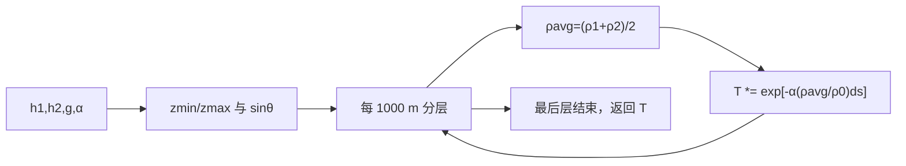

# 光学分层简单大气透过率（Optical Layered Simple Attenuation）

> **算法 ID**：ALG-SENSORS-OPTICAL-LAYERED-SIMPLE-ATTENUATION  
> **状态**：verified  
> **版本/日期**：1.0 / 2026-07-27  
> **领域**：传感器 / 光学传播  
> **AFSIM 模块**：`core/wsf_mil`  
> **覆盖候选**：`1f3fa01844d1e14c`  
> **接口规格**：`docs/extracted-algorithms/optical-layered-simple-attenuation/sensors-optical-layered-simple-attenuation-interface-spec.md`

## 1. 算法边界

- **目的**：以 1000 m 高度层的梯形平均密度，把海平面每米消光系数积分为一条平地近似路径的透过率。
- **入口条件**：两端 MSL 高度、地距、海平面消光系数和可查询大气密度。
- **完成条件**：返回所有层 Beer–Lambert 因子的乘积。
- **包含**：高度排序/截到 0、斜路径几何、1000 m 分层和密度归一化。
- **不包含**：`COMPACT` 算法、曲率、云、`mAdjustmentFactor`（由外层相乘）。
- **生命周期位置**：`ComputeAttenuationFactor` 选择 `cAT_SIMPLE` 时。

## 2. 流程



## 3. 数据契约

### 3.1 输入

| 名称 | 代码标识 | 符号 | 单位 | Method |
| --- | --- | --- | --- | --- |
| 两端高度 | `aAltitude1/aAltitude2` | $h_1,h_2$ | m MSL | `WsfOpticalAttenuation::ComputeSimpleAttenuation#95cb075c59` |
| 地距 | `aGroundRange` | $g$ | m | 同上 |
| 海平面消光 | `mSimpleAttenuation` | $\alpha$ | 1/m | 同上 |
| 大气密度 | `mAtmosphere.Density` | $\rho(z)$ | 框架密度单位 | 同上 |

### 3.2 输出

| 名称 | 代码标识 | 符号 | 范围 |
| --- | --- | --- | --- |
| 透过率 | `return` | $T$ | 正常为 (0,1] |

### 3.3 参数与常量

| 名称 | 代码标识 | 值 | 单位 | 来源 |
| --- | --- | --- | --- | --- |
| 分层高度 | `cDELTA_Z` | 1000 | m | 源码硬编码 |

### 3.4 内部状态

无持久状态；各层 `z1/z2/rho1/rho2/transmittance` 为局部量。

## 4. 数学模型

$$z_{min}=\max(\min(h_1,h_2),0),\quad z_{max}=\max(\max(h_1,h_2),0)$$
$$\sin\theta=\frac{z_{max}-z_{min}}{\sqrt{g^2+(z_{max}-z_{min})^2}}\quad(\text{总长度}>1)$$
$$T\leftarrow T\exp\left[-\alpha\frac{\rho(z_1)+\rho(z_2)}{2\rho(0)}\Delta s\right],\quad
\Delta s=\begin{cases}\Delta z/\sin\theta,&\sin\theta\ne0\\g,&\sin\theta=0\end{cases}$$

按 1000 m 层重复至 $z_{max}$；这是离散梯形积分而非连续解析积分。

## 5. 伪代码

```text
function layered_simple_transmittance(h1, h2, ground_range, alpha, density):
    zmin=max(min(h1,h2),0); zmax=max(max(h1,h2),0); T=1
    sin_theta = slope_sine(zmin,zmax,ground_range)  # 中文：总长度 <=1 时为 0。
    for each [z1,z2] of 1000 m layers to zmax:
        ds = (z2-z1)/sin_theta if sin_theta != 0 else ground_range
        # 中文：用端点平均密度缩放海平面消光并累乘 Beer–Lambert 因子。
        T *= exp(-alpha * average(density(z1),density(z2)) / density(0) * ds)
    return T
```

## 6. 源码证据

### 6.1 入口和调用链

```text
WsfOpticalAttenuation::ComputeAttenuationFactor  // cAT_SIMPLE 分支
  -> WsfOpticalAttenuation::ComputeSimpleAttenuation#95cb075c59
  -> result * mAdjustmentFactor  // 外层，不属于本卡
```

### 6.2 源码位置

| candidate_id | qualified_name | 模块 | 源码位置 | 角色 | 证据等级 |
| --- | --- | --- | --- | --- | --- |
| `1f3fa01844d1e14c` | `WsfOpticalAttenuation::ComputeSimpleAttenuation#95cb075c59` | `core/wsf_mil` | `afsim-2_9/swdev/src/core/wsf_mil/source/WsfOpticalAttenuation.cpp:298-363` | 核心 | source-cited |

### 6.3 框架与依赖

| 依赖 | 分类 | 用途 | 中性替代 |
| --- | --- | --- | --- |
| `UtAtmosphere::Density` | AFSIM | 分层密度 | `DensityAtAltitude` 回调 |
| `<cmath>::exp/sqrt` | 标准库 | 透过率/几何 | 等价数学库 |

## 7. 边界、风险与未知

| 条件 | 源码行为 | 影响 | 建议 |
| --- | --- | --- | --- |
| 高度负 | 截到 0 | 地下段忽略 | 记录状态 |
| `rhoSeaLevel=0` | 无检查 | 除零 | 中性接口拒绝 |
| 负地距/消光 | 无检查 | 非物理路径/增益 | 校验非负 |

- **已确认假设**：注释明确假定 flat Earth，层厚固定 1000 m。
- **待人工复核**：`Density` 的精确单位在本函数中以比值抵消；绝对单位由大气模型定义。

## 8. 验证计划

| 类型 | 输入 | Oracle | 容差/不变量 |
| --- | --- | --- | --- |
| 正常 | 常密度、$\alpha=.001,h_1=0,h_2=2000,g=1000$ | `0.10687792566038574` | `1e-12` |
| 边界 | $h_1=h_2=0,g=1000$，常密度 | $e^{-1}$ | `1e-12` |
| 退化 | $\rho(0)=0$ | `invalid_density` | 不除零 |

## 9. 可移植性

- **等级**：中高；核心积分独立，但取决于密度回调。
- **AFSIM 耦合**：`UtAtmosphere` 和外层调整因子。
- **类型/单位适配**：m、1/m；密度仅需与海平面值同单位。
- **许可证/clean-room 注意**：以分层公式和接口重实现。

## 10. 覆盖账本回写

| candidate_id | 状态 | algorithm_id | 决策理由 | 验证 |
| --- | --- | --- | --- | --- |
| `1f3fa01844d1e14c` | extracted | ALG-SENSORS-OPTICAL-LAYERED-SIMPLE-ATTENUATION | 独立的分层密度 Beer–Lambert 透过率积分 | passed |
