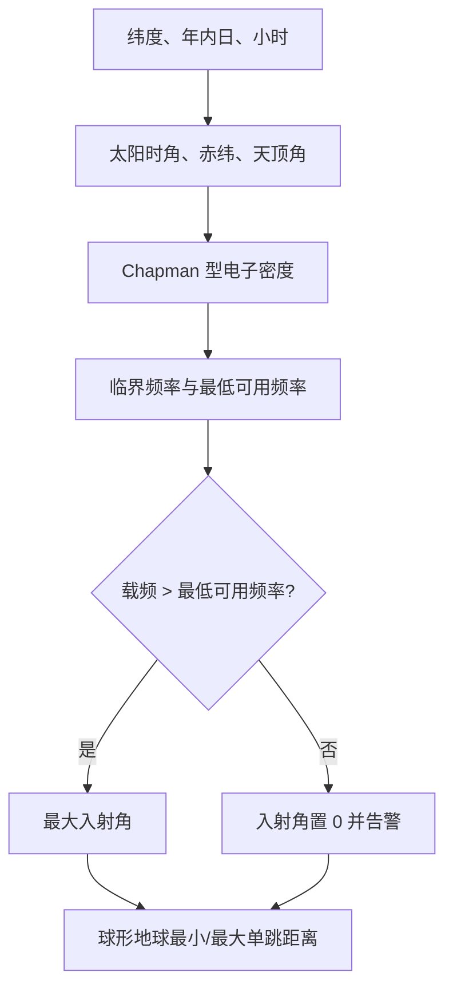

# OTH 电离层传播特性算法（OTH Ionospheric Propagation Characteristics）

> **算法 ID**：ALG-SENSORS-OTH-IONOSPHERIC-CHARACTERISTICS  
> **状态**：verified  
> **版本/日期**：1.0 / 2026-07-23  
> **领域**：传感器 / 超视距雷达传播  
> **AFSIM 模块**：`core/wsf_mil`  
> **覆盖候选**：`f64afbdfcb3a1f6c`、`d0f7735722a44a91`、`1e99f0cd6fb02604`  
> **接口规格**：`docs/extracted-algorithms/oth-ionospheric-characteristics/sensors-oth-ionospheric-characteristics-interface-spec.md`

## 1. 算法边界

- **目的**：由雷达纬度、年内日、时刻、电离层 Chapman 型参数和载频，计算太阳几何、电子密度、临界频率、最低可用频率、最大入射角以及单跳地面距离范围。
- **入口条件**：OTH 波束的发射机、平台位置和电离层配置已就绪；初始化或配置变化触发重算。
- **完成条件**：更新太阳角、电离层频率、入射角和最小/最大范围，并清除 `mIonosphereChanged`。
- **包含**：太阳赤纬/天顶角、简化 Chapman 电子密度、等离子体临界频率、球形地球单跳几何。
- **不包含**：经度时差、地磁/太阳活动、分层射线追踪、多跳传播、吸收、散射、目标反射和雷达方程。
- **生命周期位置**：`object_create` 与按需更新；探测前由 `UpdateIonosphericCharacteristics` 调用。



## 2. 数据契约

### 2.1 输入

| # | 中文名称 | 代码标识 | 符号 | 类型 | 单位 | 约束/说明 | Method |
| --- | --- | --- | --- | --- | --- | --- | --- |
| 1 | 雷达纬度 | `radarLat` | $\varphi$ | `double` | deg | `GetLocationLLA` 输出；经度和高度未参与公式 | `OTH_Beam::ComputeIonosphericCharacteristics#2d5548a2cc` |
| 2 | 年内日 | `mDayOfYear` | $D$ | `int` | day | 配置约束 `[1,365]` | 同上 |
| 3 | 小时 | `mHourOfDay` | $t_h$ | `int` | h | 配置约束 `[1,24]`；代码直接视为太阳时 | 同上 |
| 4 | 峰值电子密度 | `mElectronDensityAtMax` | $n_M$ | `double` | m⁻³（物理推断） | 初始化要求 `>0`；默认 `4.0e11` | 同上 |
| 5 | 峰值高度 | `mElectronHeightAtMax` | $h_M$ | `double` | m | 长度类型，`>0`；默认 250000 | 同上 |
| 6 | 反射高度 | `mReflectionHeight` | $h$ | `double` | m | 长度类型，`>0`；默认 300000 | 同上 |
| 7 | 电子温度 | `mTemperatureAtMax` | $T$ | `double` | K（物理推断） | 原始数值输入，初始化要求 `>0`；默认 1540 | 同上 |
| 8 | 雷达频率 | `GetFrequency()` | $f_r$ | `double` | Hz | 发射机内部单位；本函数不校验正值 | 同上 |

电子密度和温度的单位没有通过 `UtInput` 类型系统声明；这里根据默认量级、变量名和 $8.98\sqrt{n_e}$ 频率公式推断为 m⁻³ 与 K。

### 2.2 输出

| 中文名称 | 代码标识 | 符号 | 单位 | 说明 |
| --- | --- | --- | --- | --- |
| 太阳时角 | `mSolarAngRads` | $H$ | rad | 以 12 时为零 |
| 太阳赤纬 | `mSolarDeclinationAngRads` | $\delta$ | rad | 年内日近似 |
| 太阳天顶角 | `mSolarZenithAngRads` | $\chi$ | rad | 由纬度、赤纬和时角合成 |
| 临界频率 | `mCriticalFrequency` | $f_c$ | Hz | 由反射高度电子密度计算 |
| 最低可用频率 | `mMinUsableFrequency` | $f_{\min}$ | Hz | 源码命名；值为 $1.03f_c$ |
| 最大入射角 | `mMaxIncidenceAngleDegrees` | $i_{\max}$ | deg | 传播不支持时置 0 |
| 最小/最大范围 | `mMinRange` / `mMaxRange` | $R_{\min},R_{\max}$ | m | 球形地球单跳地面弧长 |

### 2.3 参数、常量与内部状态

| 名称 | 值 | 单位 | 来源/作用 |
| --- | ---: | --- | --- |
| 赤纬振幅 | 23.44 | deg | 源码经验常量 |
| 年相位系数 | 0.9856、80.7 | deg/day、day | 源码经验常量 |
| 高度归一化系数 | 34.11 | K/km | Chapman 型表达式源码常量 |
| 临界频率系数 | 8.98 | Hz·m³ᐟ² | 与 $n_e$ 的 m⁻³ 推断一致 |
| 最低频率缓冲 | 1.03 | 1 | 避免正上方传播 |
| 地球半径 | 6366707.0194937075 | m | `UtSphericalEarth::cEARTH_RADIUS` |

函数读取对象配置并写入上述输出成员；`mIonosphereChanged` 从 true/未知状态变为 false。日志告警是唯一 I/O 副作用。

## 3. 数学模型

### 3.1 太阳几何

$$
H=(t_h-12)\,15\frac{\pi}{180}
$$

$$
\delta=23.44\sin\left(0.9856\frac{\pi}{180}(D-80.7)\right)\frac{\pi}{180}
$$

$$
\chi=\arccos\left(\sin\varphi\sin\delta+
\cos\varphi\cos\delta\cos H\right)
$$

代码不使用雷达经度，也不执行 UTC 到当地太阳时转换。

### 3.2 电子密度与频率

令高度以 km 参与经验式：

$$
\eta=\frac{34.11}{T}\left(\frac{h-h_M}{1000}\right),\qquad
s=\begin{cases}
1/\cos\chi,&\cos\chi>0\\
\mathrm{DBL\_MAX},&\cos\chi\le0
\end{cases}
$$

$$
n_0=n_M\sqrt{s}
$$

$$
n_e=n_0\exp\left[\frac12\left(1-\eta-s e^{-\eta}\right)\right]
$$

$$
\boxed{f_c=8.98\sqrt{n_e}},\qquad
\boxed{f_{\min}=1.03f_c}
$$

若 $f_r>f_{\min}$：

$$
i_{\max}=\arcsin\left(\frac{f_c}{f_r}\right)
$$

否则源码发出告警并令 $i_{\max}=0$。

### 3.3 单跳范围

令 $R_E$ 为球形地球半径，$A=R_E+h$、$B=R_E$、$b=\pi/2-i_{\max}$：

$$
a=\pi-\arcsin\left(\frac{A\sin b}{B}\right)
$$

$$
\gamma=2(\pi-a-b),\qquad
\boxed{R_{\min}=R_E\gamma}
$$

最大范围是反射层切线对应的两倍地心角：

$$
\gamma'=\arcsin\left(
\frac{\sqrt{(R_E/1000+h/1000)^2-(R_E/1000)^2}}
{R_E/1000+h/1000}
\right)
$$

$$
\boxed{R_{\max}=2R_E\gamma'}
$$

## 4. 伪代码

```text
function compute_oth_ionosphere(input):
    # 中文：源码把配置小时直接当作太阳时，不使用经度修正。
    H = radians((input.hour - 12) * 15)
    decl = radians(23.44 * sin(radians(0.9856 * (input.day - 80.7))))
    zenith = acos(sin(lat) * sin(decl) + cos(lat) * cos(decl) * cos(H))

    # 中文：按源码 Chapman 型离散表达式求反射高度电子密度。
    eta = 34.11 / temperature * ((reflection_height - peak_height) / 1000)
    sec_zenith = DBL_MAX if cos(zenith) <= 0 else 1 / cos(zenith)
    ne = peak_density * sqrt(sec_zenith) \
         * exp(0.5 * (1 - eta - sec_zenith * exp(-eta)))
    critical_hz = 8.98 * sqrt(ne)
    minimum_usable_hz = 1.03 * critical_hz

    # 中文：载频不足时源码把最大入射角置零，但仍继续计算距离。
    incidence = 0 if radar_hz <= minimum_usable_hz \
                  else asin(critical_hz / radar_hz)
    min_range = spherical_minimum_range(incidence, reflection_height)
    max_range = spherical_tangent_range(reflection_height)
    return all_derived_values
```

## 5. 源码证据

### 5.1 调用链

```text
WsfOTH_RadarSensor::OTH_Beam::AttemptToDetect
  -> UpdateIonosphericCharacteristics
     -> ComputeIonosphericCharacteristics
  -> CanBounceToTarget
```

### 5.2 位置与索引别名

| candidate_id | qualified_name | 源码位置 | 角色 |
| --- | --- | --- | --- |
| `f64afbdfcb3a1f6c` | `OTH_Beam::ComputeIonosphericCharacteristics#2d5548a2cc` | `WsfOTH_RadarSensor.cpp:1000-1089` | 最接近真实嵌套类的索引记录 |
| `d0f7735722a44a91` | `OTH_Mode::ComputeIonosphericCharacteristics#2d5548a2cc` | 同上 | 索引所有者别名 |
| `1e99f0cd6fb02604` | `WsfOTH_RadarSensor::ComputeIonosphericCharacteristics#2d5548a2cc` | 同上 | 外层类索引别名 |

真实 C++ 定义为 `WsfOTH_RadarSensor::OTH_Beam::ComputeIonosphericCharacteristics`。三个候选共享同一路径、行号和函数体哈希，合并为一项物理算法。

| 补充证据 | 位置 | 结论 |
| --- | --- | --- |
| 默认参数/成员 | `WsfOTH_RadarSensor.hpp:266-289` | 默认太阳与电离层参数 |
| 参数有效性 | `WsfOTH_RadarSensor.cpp:978-990` | 四个电离层输入必须大于 0 |
| 输入解析 | `WsfOTH_RadarSensor.cpp:2030-2081` | 日/小时范围，两个高度为长度类型 |
| 下游消费 | `WsfOTH_RadarSensor.cpp:1091-1179` | 范围限制与目标入射角判定 |

## 6. 依赖与可替换性

| 依赖 | 用途 | 核心必需 | 中性替代 |
| --- | --- | --- | --- |
| `WsfEM_Xmtr` / `WsfPlatform` | 频率和 LLA | no | 显式 `frequency_hz`、`latitude_deg` |
| `UtSphericalEarth` | 地球半径 | no | 版本化常量或调用者配置 |
| `UtMath` / `<cmath>` | 角度和数学函数 | yes | 标准数学库 |
| `ut::log` | 传播不支持告警 | no | 状态码/诊断回调 |

## 7. 边界、风险与未知

| 条件 | 源码行为 | 风险 | 中性接口建议 |
| --- | --- | --- | --- |
| $\cos\chi\le0$（夜侧） | `secZenith=DBL_MAX` | 巨大平方根项与趋零指数项相乘，可能形成不稳定的溢出/下溢组合 | 返回 `night_side_model_undefined` |
| $f_r\le f_{\min}$ | 入射角置 0 后继续距离公式 | $A/B>1$，最小距离的 `asin` 通常越界 | 标记 `propagation_supported=false`，最小距离无值 |
| $A\sin b/B>1$ | 无钳制直接 `asin` | `R_min=NaN` | 返回 `minimum_range_domain_error`，不要静默钳制 |
| `acos` 参数轻微越界 | 无钳制 | 浮点 NaN | 兼容模式保持；安全实现先验证容差 |
| 时刻/经度 | 仅整数小时，不使用经度 | 非当地太阳时会系统偏差 | 上层明确传入当地太阳时 |
| 第 366 日 | 配置拒绝 | 闰年最后一天无法表示 | 保持兼容或由上层映射 |
| 温度/密度单位 | 输入为裸数 | 迁移时可能单位误解 | 使用显式 K、m⁻³ 并保留“推断”标记 |

## 8. 验证计划与结果

| 类型 | 输入/场景 | Oracle | 容差/不变量 |
| --- | --- | --- | --- |
| 正常 | 纬度 30°，第 172 日 12 时，默认电离层，6 MHz | $f_c=5096157.443154109$ Hz；$f_{\min}=5249042.166448732$ Hz；$i_{\max}=58.14208128741023°$；$R_{\min}=376367.0394286476$ m；$R_{\max}=3834484.6233969247$ m | 标量绝对/相对误差 $\le10^{-12}$ |
| 边界 | 载频等于 $f_{\min}$ | `propagation_supported=false`、源码兼容入射角 0 | 分支精确 |
| 退化 | 第 172 日 24 时、纬度 30° | 安全接口返回 `night_side_model_undefined` | 不输出伪造有限结果 |
| 定义域 | 正常太阳参数、20 MHz | 最小距离 `asin` 参数 `1.012556465356911` | 报 `minimum_range_domain_error` |

数值 oracle 由独立 JavaScript 标量实现按源码顺序计算，地球半径取当前 `UtSphericalEarth` 常量。

## 9. 可移植性

- **等级**：中高。
- 标量数学核心易迁移，但模型输入的当地太阳时语义、夜侧行为和最小距离定义域必须显式化。
- 建议将“电离层频率”和“球形地球范围”保留在同一返回结构中，因为源码二者由共同的最大入射角耦合；不要把日志、平台查询和天线写入带入纯核心。
- 重实现前仍需审查 AFSIM 随附许可证；本卡只描述接口与行为证据。

## 10. 覆盖账本回写

| candidate_id | 状态 | algorithm_id | 决策理由 | 验证 |
| --- | --- | --- | --- | --- |
| `f64afbdfcb3a1f6c` | extracted | ALG-SENSORS-OTH-IONOSPHERIC-CHARACTERISTICS | 核心函数记录 | passed |
| `d0f7735722a44a91` | extracted | 同上 | 同一函数的索引所有者别名 | passed |
| `1e99f0cd6fb02604` | extracted | 同上 | 同一函数的外层类索引别名 | passed |
