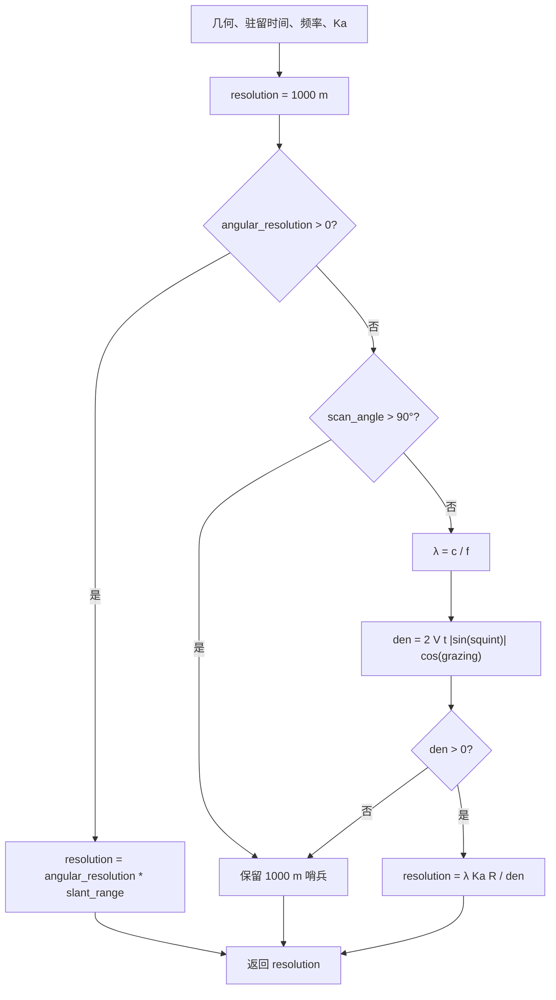

# SAR 驻留时间反算方位分辨率算法（SAR Dwell-Time Azimuth Resolution）

> **算法 ID**：ALG-SENSORS-SAR-AZIMUTH-RESOLUTION  
> **状态**：verified  
> **版本/日期**：1.0 / 2026-07-27  
> **领域**：传感器 / 合成孔径雷达  
> **AFSIM 模块**：`core/wsf_mil`  
> **覆盖候选**：`700e32cae89966e0`  
> **接口规格**：`docs/extracted-algorithms/sar-azimuth-resolution/sensors-sar-azimuth-resolution-interface-spec.md`

## 1. 算法边界

- **目的**：在给定 SAR 几何、载频和实际/预测驻留时间时，计算可达到的方位分辨率。
- **入口条件**：`ComputeGeometry` 已生成斜距、速度、斜视角、擦地角和扫描角；调用者传入驻留时间。
- **完成条件**：返回源码兼容方位分辨率，单位 m。
- **包含**：弃用角分辨率路径、扫描背面门禁、波长换算、参考公式 2 的反算分辨率。
- **不包含**：由目标分辨率计算驻留时间、PRF、CNR、距离向分辨率、图像调度和最终成像质量判定。
- **生命周期位置**：`simulation_loop`；性能预测、spot/strip SAR 开始和结束均可调用。



## 2. 数据契约

### 2.1 输入

| # | 中文名称 | 代码标识 | 数学符号 | 类型 | 含义 | 单位/坐标系 | 所属函数 Method |
| --- | --- | --- | --- | --- | --- | --- | --- |
| 1 | 发射频率 | `mXmtrPtr->GetFrequency()` | $f$ | `double` | SAR 发射机频率 | Hz | `WsfSAR_Sensor::ComputeAzimuthResolution#091f833369` |
| 2 | Doppler 展宽因子 | `mKa` | $K_a$ | `double` | Doppler 滤波展宽因子，默认 1 | 1 | 同上 |
| 3 | 斜距 | `aGeometry.mSlantRange` | $R$ | `double` | 传感器至关注中心距离 | m / WCS 派生 | 同上 |
| 4 | 速度量值 | `aGeometry.mGroundSpeed` | $V$ | `double` | 源码实际使用 NED 三维速度模 | m/s / NED | 同上 |
| 5 | 驻留时间 | `aDwellTime` | $t_D$ | `double` | 合成孔径积分时间 | s | 同上 |
| 6 | 斜视角 | `aGeometry.mSquintAngle` | $\theta_{sq}$ | `double` | 水平速度方向与 LOS 水平投影夹角 | rad / NED | 同上 |
| 7 | 擦地角 | `aGeometry.mGrazingAngle` | $\gamma$ | `double` | LOS 与目标局部切平面夹角 | rad | 同上 |
| 8 | 扫描角 | `aGeometry.mScanAngle` | $\sigma$ | `double` | 天线面法线与 LOS 夹角 | rad | 同上 |
| 9 | 弃用角分辨率 | `mAngularResolution` | $\alpha_{old}$ | `double` | 旧式角分辨率配置，优先于新公式 | rad | 同上 |

### 2.2 输出

| # | 中文名称 | 代码标识 | 数学符号 | 类型 | 含义 | 单位/坐标系 | 所属函数 Method |
| --- | --- | --- | --- | --- | --- | --- | --- |
| 1 | 方位分辨率 | `return` | $\delta_{az}$ | `double` | SAR 方位向分辨率或 1000 m 哨兵 | m | `WsfSAR_Sensor::ComputeAzimuthResolution#091f833369` |

### 2.3 参数与常量

| # | 中文名称 | 代码标识 | 数学符号 | 类型 | 值/范围 | 单位 | 来源 | 所属函数 Method |
| --- | --- | --- | --- | --- | --- | --- | --- | --- |
| 1 | 光速 | `UtMath::cLIGHT_SPEED` | $c$ | `double` | 299792458 | m/s | 常量 | `WsfSAR_Sensor::ComputeAzimuthResolution#091f833369` |
| 2 | 默认分辨率哨兵 | `resolution = 1000.0` | $\delta_s$ | `double` | 1000 | m | 源码硬编码 | 同上 |
| 3 | 背面扫描阈值 | `UtMath::cPI_OVER_2` | $\pi/2$ | `double` | 90 deg | rad | 常量 | 同上 |

### 2.4 内部状态

| # | 状态 | 代码标识 | 类型 | 单位/坐标系 | 初值 | 读取函数 | 写入函数 | 更新时机 | 重置 |
| --- | --- | --- | --- | --- | --- | --- | --- | --- | --- |
| 1 | 当前方位分辨率 | `mCurrentAzimuthResolution` | `double` | m | 0 | 调用者 | `SpotModeBegin` / `StripModeBegin` | 成像开始 | 模式复制/初始化 |
| 2 | 传感器达成分辨率 | `mAchievedAzimuthResolution` | `double` | m | 0 | 外部查询 | `SpotModeBegin` / `SpotModeEnd` / `StripModeBegin` | 成像预测或结束 | 传感器复制/初始化 |

## 3. 数学模型

源码使用的正常分支为：

$$
\lambda=\frac{c}{f}
$$

$$
\boxed{\delta_{az}=
\frac{\lambda K_a R}
{2Vt_D|\sin\theta_{sq}|\cos\gamma}}
$$

完整源码分支为：

$$
\delta_{az}=
\begin{cases}
\alpha_{old}R,&\alpha_{old}>0\\
1000,&\alpha_{old}\le0\land\sigma>\pi/2\\
\frac{\lambda K_a R}{2Vt_D|\sin\theta_{sq}|\cos\gamma},&den>0\\
1000,&den\le0
\end{cases}
$$

注意源码使用 `scan_angle > pi/2`，不是 `>=`；与 SAR 驻留时间算法的背面门禁不完全一致。

## 4. 伪代码

```text
function compute_sar_azimuth_resolution(geometry, dwell_time, mode):
    resolution_m = 1000

    # 中文：旧配置路径优先，绕过扫描角和分母检查。
    if mode.angular_resolution_rad > 0:
        return mode.angular_resolution_rad * geometry.slant_range_m

    if geometry.scan_angle_rad > pi / 2:
        return resolution_m

    wavelength_m = light_speed / mode.frequency_hz
    denominator = 2 * geometry.velocity_magnitude_mps * dwell_time \
                  * abs(sin(geometry.squint_angle_rad)) \
                  * cos(geometry.grazing_angle_rad)

    # 中文：退化几何不报错，保留 1000 m 源码哨兵。
    if denominator > 0:
        resolution_m = wavelength_m * mode.Ka * geometry.slant_range_m / denominator
    return resolution_m
```

## 5. 源码证据

### 5.1 入口和调用链

```text
WsfSAR_Sensor::SAR_Mode::PredictPerformance  // 性能预测，CodeGraph 定位于 WsfSAR_Sensor.cpp:2523
  -> WsfSAR_Sensor::ComputeAzimuthResolution#091f833369
WsfSAR_Sensor::SpotModeEnd#17b5fcb893   // 实际成像结束
  -> WsfSAR_Sensor::ComputeAzimuthResolution#091f833369
```

### 5.2 源码位置

| candidate_id | qualified_name | 模块 | 源码位置 | 角色 | 证据等级 |
| --- | --- | --- | --- | --- | --- |
| `700e32cae89966e0` | `WsfSAR_Sensor::ComputeAzimuthResolution#091f833369` | `core/wsf_mil` | `afsim-2_9/swdev/src/core/wsf_mil/source/sensor/WsfSAR_Sensor.cpp:2192-2232` | 核心 | source-cited |

### 5.3 框架与依赖

| 依赖 | 分类 | 用途 | 算法核心必需 | 中性替代 |
| --- | --- | --- | --- | --- |
| `WsfEM_Xmtr` | AFSIM 框架 | 读取频率 | no | 显式 `frequency_hz` |
| `Geometry` | AFSIM 数据结构 | 聚合几何量 | no | 中性结构体 |
| `UtMath` | 工具常量 | 光速、$\pi/2$ | no | 标准常量 |
| `<cmath>` | 标准库 | `sin/cos/fabs` | yes | 等价数学库 |

## 6. 边界、风险与未知

| 条件 | 源码行为 | 数学/数值影响 | 建议处理 | 证据 |
| --- | --- | --- | --- | --- |
| `mAngularResolution > 0` | 直接返回角分辨率乘斜距 | 忽略频率、速度和驻留时间 | 标记 `legacy_angular_resolution` | `WsfSAR_Sensor.cpp:2195-2199` |
| `scan_angle > pi/2` | 返回 1000 m | 背面扫描被编码为粗分辨率哨兵 | 中性接口返回状态 | `WsfSAR_Sensor.cpp:2200-2203` |
| `denominator <= 0` | 返回 1000 m | 零速度、零驻留或零斜视均混为哨兵 | 区分退化原因 | `WsfSAR_Sensor.cpp:2224-2229` |
| `frequency <= 0` | 未校验 | 可能除零或负波长 | 中性接口拒绝 | `WsfSAR_Sensor.cpp:2222` |
| `scan_angle == pi/2` | 进入正常公式 | 与驻留时间算法 `>=` 不一致 | 兼容实现保留差异 | `WsfSAR_Sensor.cpp:2200` |

- **已确认假设**：角度单位为 rad，速度为 `ComputeGeometry` 中 NED 速度矢量模。
- **待人工复核**：源码注释引用的 Reference 2 未在当前证据包中定位到原文；公式归类只按源码注释和实现确认。

## 7. 验证计划

| 类型 | 输入/场景 | Oracle | 容差/不变量 | 覆盖证据 |
| --- | --- | --- | --- | --- |
| 正常 | 10 GHz、$K_a=1.2$、$R=10000$ m、$V=200$ m/s、$t=5$ s、斜视 30 deg、擦地 45 deg | `0.5087646720009198` m | `1e-12` | 正常公式 |
| 边界 | `mAngularResolution=0.001` rad、`R=12000` m | 12 m | 精确乘法 | 旧路径 |
| 退化/异常 | 斜视角 0 或速度 0 | 1000 m，状态 `degenerate_geometry` | 精确 | 分母门禁 |

## 8. 可移植性

- **等级**：极高/中。
- **可移植核心**：一个标量闭式公式，计算量 $O(1)$。
- **AFSIM 耦合**：频率、几何和旧角分辨率来自模式/传感器状态。
- **类型/单位/坐标系适配**：必须保留 NED 速度模、斜视角水平投影定义和源码背面门禁。
- **许可证/clean-room 注意**：重实现时只迁移公式和契约，不复制 AFSIM 源码。

## 9. 可移植接口摘要

中性接口应返回 `resolution_m`、`status`、`denominator` 和 `wavelength_m`，避免调用者把 1000 m 哨兵误认为真实可达分辨率。

## 10. 覆盖账本回写

| candidate_id | 状态 | algorithm_id | 决策理由 | 验证 |
| --- | --- | --- | --- | --- |
| `700e32cae89966e0` | extracted | ALG-SENSORS-SAR-AZIMUTH-RESOLUTION | 独立、可测试的 SAR 方位分辨率反算公式 | passed |
