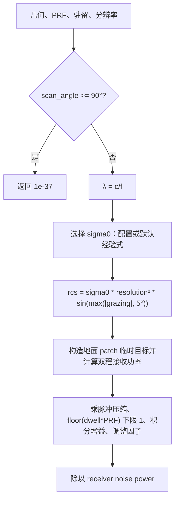

# SAR 地杂波噪声比算法（SAR Clutter-to-Noise Ratio）

> **算法 ID**：ALG-SENSORS-SAR-CLUTTER-TO-NOISE-RATIO  
> **状态**：verified  
> **版本/日期**：1.0 / 2026-07-27  
> **领域**：传感器 / 合成孔径雷达  
> **AFSIM 模块**：`core/wsf_mil`  
> **覆盖候选**：`0b890e242f61ebe9`  
> **接口规格**：`docs/extracted-algorithms/sar-clutter-to-noise-ratio/sensors-sar-clutter-to-noise-ratio-interface-spec.md`

## 1. 算法边界

- **目的**：用地面分辨率单元等效 RCS、AFSIM 双程 RF 功率、脉冲压缩、脉冲积分和增益调整计算线性 CNR。
- **入口条件**：SAR 几何已更新，PRF、驻留时间和方位分辨率已确定。
- **完成条件**：返回线性 clutter-to-noise ratio。
- **包含**：扫描背面早退、后向散射系数默认估计、分辨率单元 RCS、临时地面目标构造、双程接收功率后处理、噪声归一化。
- **不包含**：RF 传播模型内部、天线增益模型、PRF/驻留时间/分辨率计算、CNR 阈值判定。
- **生命周期位置**：`simulation_loop`；性能预测和实际 spot SAR 结束时调用。



## 2. 数据契约

### 2.1 输入

| # | 中文名称 | 代码标识 | 数学符号 | 类型 | 含义 | 单位/坐标系 | 所属函数 Method |
| --- | --- | --- | --- | --- | --- | --- | --- |
| 1 | 扫描角 | `aGeometry.mScanAngle` | $\sigma$ | `double` | 天线法线与 LOS 夹角 | rad | `WsfSAR_Sensor::ComputeCNR#1c885b981d` |
| 2 | 载频 | `mXmtrPtr->GetFrequency()` | $f$ | `double` | 发射频率 | Hz | 同上 |
| 3 | 方位分辨率 | `aResolution` | $\delta$ | `double` | 分辨率单元边长近似 | m | 同上 |
| 4 | 擦地角 | `aGeometry.mGrazingAngle` | $\gamma$ | `double` | LOS 与地面切平面夹角 | rad | 同上 |
| 5 | 斜距 | `aGeometry.mSlantRange` | $R$ | `double` | 临时地面 patch 距离 | m / PCS->WCS | 同上 |
| 6 | PRF | `aPRF` | $p$ | `double` | 脉冲重复频率 | Hz | 同上 |
| 7 | 驻留时间 | `aDwellTime` | $t_D$ | `double` | 积分时间 | s | 同上 |
| 8 | 后向散射系数 | `mBackscatterCoefficient` | $\sigma_0$ | `double` | 地表 backscatter；`<=0` 时走默认式 | 1 | 同上 |
| 9 | 积分增益 | `mIntegrationGain` | $G_i$ | `double` | 接收后积分增益 | 1 | 同上 |
| 10 | 调整因子 | `mAdjustmentFactor` | $A$ | `double` | 通用后处理倍率 | 1 | 同上 |

### 2.2 输出

| # | 中文名称 | 代码标识 | 数学符号 | 类型 | 含义 | 单位/坐标系 | 所属函数 Method |
| --- | --- | --- | --- | --- | --- | --- | --- |
| 1 | 地杂波噪声比 | `return` | $CNR$ | `double` | 线性功率比 | 1 | `WsfSAR_Sensor::ComputeCNR#1c885b981d` |

### 2.3 参数与常量

| # | 中文名称 | 代码标识 | 数学符号 | 类型 | 值/范围 | 单位 | 来源 | 所属函数 Method |
| --- | --- | --- | --- | --- | --- | --- | --- | --- |
| 1 | 背面早退值 | `1.0E-37` | $CNR_s$ | `double` | -370 dB | 1 | 源码硬编码 | `WsfSAR_Sensor::ComputeCNR#1c885b981d` |
| 2 | 最小擦地角 | `5.0 * UtMath::cRAD_PER_DEG` | $\gamma_{min}$ | `double` | 5 deg | rad | 源码硬编码 | 同上 |
| 3 | 默认 backscatter 经验式系数 | `15.0`、`3.0`、`100.0` | - | `double` | 见公式 | - | 源码注释指向 Skolnik | 同上 |
| 4 | 最小积分脉冲数 | `std::max(1, int(t*p))` | $N_p$ | `int` | >=1 | pulse | 源码硬编码 | 同上 |

### 2.4 内部状态

| # | 状态 | 代码标识 | 类型 | 单位/坐标系 | 初值 | 读取函数 | 写入函数 | 更新时机 | 重置 |
| --- | --- | --- | --- | --- | --- | --- | --- | --- | --- |
| 1 | 达成 CNR | `mAchievedCNR` | `double` | 1 | 0 | `GetAchievedCNR` | `SpotModeBegin` / `SpotModeEnd` / `StripModeBegin` | 成像预测或结束 | 传感器复制/初始化 |
| 2 | 临时地面目标 | `mTempPlatform` | `WsfPlatform` | WCS | scenario 构造 | `ComputeCNR` | `ComputeCNR` | 每次 CNR 计算 | 下次覆盖 |

## 3. 数学模型

扫描背面分支：

$$
\sigma\ge\pi/2 \Rightarrow CNR=10^{-37}
$$

默认后向散射系数：

$$
\sigma_{0,dB}=15\left(\log_{10}3-1-\log_{10}(100\lambda)\right)
$$

$$
\sigma_0=10^{\sigma_{0,dB}/10}
$$

分辨率单元等效 RCS：

$$
RCS=\sigma_0\delta^2\sin(\max(|\gamma|,5^\circ))
$$

最终后处理：

$$
N_p=\max(1,\operatorname{int}(t_D p))
$$

$$
\boxed{CNR=\frac{P_{2way}(RCS)\,G_{pc}\,N_p\,G_i\,A}{P_n}}
$$

其中 $P_{2way}$、$G_{pc}$、$P_n$ 分别来自 AFSIM RF 交互、发射机脉冲压缩比和接收机噪声功率。

## 4. 伪代码

```text
function compute_sar_cnr(geometry, prf_hz, dwell_time_s, resolution_m, rf_model, mode):
    if geometry.scan_angle_rad >= pi / 2:
        return 1.0e-37

    wavelength_m = light_speed / mode.frequency_hz
    sigma0 = mode.backscatter_coefficient
    if sigma0 <= 0:
        sigma0_db = 15 * (log10(3) - 1 - log10(wavelength_m * 100))
        sigma0 = db_to_linear(sigma0_db)

    # 中文：源码把分辨率单元视为 resolution^2，并按最小 5 度擦地角修正。
    grazing = max(abs(geometry.grazing_angle_rad), deg_to_rad(5))
    rcs = sigma0 * resolution_m * resolution_m * sin(grazing)

    patch = place_temporary_patch_along_sensor_x_axis(geometry.slant_range_m)
    received_power = rf_model.compute_two_way_power(patch, rcs)

    pulses = max(1, int(dwell_time_s * prf_hz))
    received_power *= mode.pulse_compression_ratio
    received_power *= pulses * mode.integration_gain * mode.adjustment_factor
    return received_power / mode.receiver_noise_power
```

## 5. 源码证据

### 5.1 入口和调用链

```text
WsfSAR_Sensor::SAR_Mode::PredictPerformance  // 预测路径，CodeGraph 定位于 WsfSAR_Sensor.cpp:2523
  -> WsfSAR_Sensor::ComputeCNR#1c885b981d
WsfSAR_Sensor::SpotModeEnd#17b5fcb893  // 实际结束路径
  -> WsfSAR_Sensor::ComputeCNR#1c885b981d
```

### 5.2 源码位置

| candidate_id | qualified_name | 模块 | 源码位置 | 角色 | 证据等级 |
| --- | --- | --- | --- | --- | --- |
| `0b890e242f61ebe9` | `WsfSAR_Sensor::ComputeCNR#1c885b981d` | `core/wsf_mil` | `afsim-2_9/swdev/src/core/wsf_mil/source/sensor/WsfSAR_Sensor.cpp:2063-2129` | 核心 | source-cited |

### 5.3 框架与依赖

| 依赖 | 分类 | 用途 | 算法核心必需 | 中性替代 |
| --- | --- | --- | --- | --- |
| `WsfSensorResult` | AFSIM 框架 | 双程 RF 功率 | no | 注入 `compute_two_way_power` |
| `WsfEM_Xmtr` / `WsfEM_Rcvr` | AFSIM 框架 | 频率、脉冲压缩、噪声功率 | no | 显式标量 |
| `mTempPlatform` | AFSIM 框架 | 临时 ground patch 目标 | no | 中性 patch 输入 |
| `UtMath` / `<cmath>` | 工具/标准库 | dB、光速、三角函数 | yes | 标准数学库 |

## 6. 边界、风险与未知

| 条件 | 源码行为 | 数学/数值影响 | 建议处理 | 证据 |
| --- | --- | --- | --- | --- |
| `scan_angle >= pi/2` | 返回 `1e-37` | 不是物理 CNR，仅为极小哨兵 | 返回状态 `antenna_back_face` | `WsfSAR_Sensor.cpp:2067-2071` |
| `backscatter <= 0` | 使用经验式估计 | 频率越高默认 $\sigma_0$ 越低 | 暴露默认式来源和数值 | `WsfSAR_Sensor.cpp:2077-2083` |
| `dwell*PRF < 1` | 积分脉冲数为 1 | 非正 PRF/驻留也可能保底放大 | 中性接口应拒绝非正值 | `WsfSAR_Sensor.cpp:2118-2120` |
| `noise_power == 0` | 直接除以 0 | Inf/NaN | 中性接口校验 | `WsfSAR_Sensor.cpp:2128` |
| 临时目标位置 | 沿 PCS x 轴按斜距放置 | RF 几何依赖传感器当前姿态 | 中性接口注入 RF 几何结果 | `WsfSAR_Sensor.cpp:2091-2107` |

- **已确认假设**：函数返回线性功率比，不是 dB；`GetAchievedCNR` 注释同样声明 linear。
- **待人工复核**：默认 backscatter 经验式源码留有 TODO，需用模型参考资料确认适用地表和频段。

## 7. 验证计划

| 类型 | 输入/场景 | Oracle | 容差/不变量 | 覆盖证据 |
| --- | --- | --- | --- | --- |
| 正常 | 直接注入 `P_2way=1e-9`、`noise=1e-12`、脉冲压缩 10、`t=2.3`、`PRF=900`、积分增益 2、调整 0.5 | `20700000.000000004` | `1e-6` 相对误差 | 后处理链 |
| 边界 | `backscatter<=0`、10 GHz | 默认 $\sigma_0=0.031655620273391985` | `1e-15` | 经验式 |
| 退化/异常 | `scan_angle=pi/2` | `1e-37` | 精确 | 背面早退 |

## 8. 可移植性

- **等级**：中。
- **可移植核心**：RCS 经验式、脉冲积分和增益链可直接迁移。
- **AFSIM 耦合**：双程 RF 功率、天线姿态、临时目标和噪声模型强依赖框架。
- **类型/单位/坐标系适配**：PRF 为 Hz，驻留为 s，分辨率为 m，CNR 为线性比值。
- **许可证/clean-room 注意**：建议把 RF 子模型作为外部 oracle 或抽象接口，不复制 AFSIM 实现。

## 9. 可移植接口摘要

中性实现应拆成两层：纯标量 `compute_ground_patch_rcs` 和 `compute_cnr_from_received_power`；AFSIM 兼容适配层负责计算 `P_2way(RCS)`。

## 10. 覆盖账本回写

| candidate_id | 状态 | algorithm_id | 决策理由 | 验证 |
| --- | --- | --- | --- | --- |
| `0b890e242f61ebe9` | extracted | ALG-SENSORS-SAR-CLUTTER-TO-NOISE-RATIO | 独立、可测试的 SAR 地杂波噪声比计算链 | passed |
