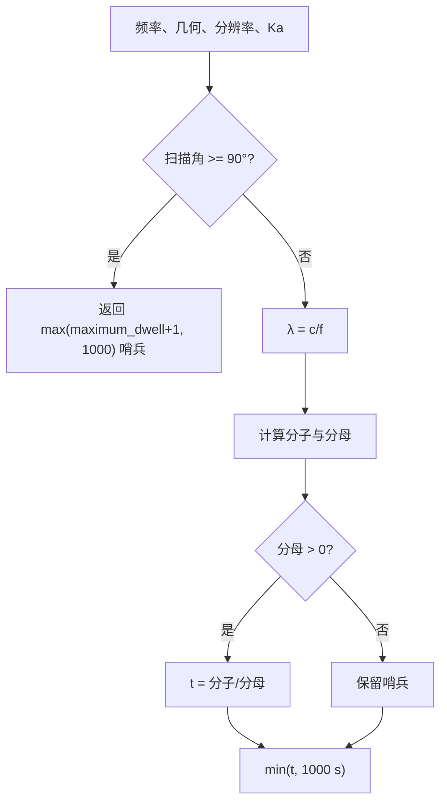

# SAR 方位分辨率驻留时间算法（SAR Resolution-Driven Dwell Time）

> **算法 ID**：ALG-SENSORS-SAR-DWELL-TIME  
> **状态**：verified  
> **版本/日期**：1.0 / 2026-07-23  
> **领域**：传感器 / 合成孔径雷达  
> **AFSIM 模块**：`core/wsf_mil`  
> **覆盖候选**：`934b6909f4aa75ec`  
> **接口规格**：`docs/extracted-algorithms/sar-dwell-time/sensors-sar-dwell-time-interface-spec.md`

## 1. 算法边界

- **目的**：由载频、斜距、平台速度、目标方位分辨率、斜视角和擦地角，计算形成 SAR 合成孔径所需的驻留时间。
- **入口条件**：SAR 几何已更新，模式选择了“由分辨率计算驻留时间”。
- **完成条件**：返回源码兼容驻留时间或不可用哨兵。
- **包含**：波长换算、参考公式 2 的方位驻留时间、扫描方向门禁、1000 s 硬上限。
- **不包含**：几何构造、PRF、CNR、距离向分辨率、图像调度和最终配置最大驻留时间裁剪。
- **生命周期位置**：`simulation_loop`；实际探测与性能预测均可调用。



## 2. 数据契约

### 2.1 输入

| 中文名称 | 代码标识 | 符号 | 类型 | 单位 | 约束/来源 | Method |
| --- | --- | --- | --- | --- | --- | --- |
| 发射频率 | `mXmtrPtr->GetFrequency()` | $f$ | `double` | Hz | 发射机内部单位；本函数不校验 | `WsfSAR_Sensor::ComputeDwellTime#e973416337` |
| Doppler 展宽因子 | `mKa` | $K_a$ | `double` | 1 | 配置要求 `>=1`；默认 1 | 同上 |
| 斜距 | `aGeometry.mSlantRange` | $R$ | `double` | m | `ComputeSlantRange` 输出 | 同上 |
| 速度量值 | `aGeometry.mGroundSpeed` | $V$ | `double` | m/s | 实为完整 NED 速度矢量模，不只是水平速度 | 同上 |
| 方位分辨率 | `aResolution` | $\delta_{cr}$ | `double` | m | 配置 `resolution` 要求 `>0` | 同上 |
| 斜视角 | `aGeometry.mSquintAngle` | $\theta_{sq}$ | `double` | rad | 水平速度方向与 LOS 水平投影夹角 | 同上 |
| 擦地角 | `aGeometry.mGrazingAngle` | $\gamma$ | `double` | rad | LOS 与目标切平面夹角 | 同上 |
| 扫描角 | `aGeometry.mScanAngle` | $\sigma$ | `double` | rad | 天线面法线与 LOS 夹角 | 同上 |
| 配置最大驻留时间 | `mMaximumDwellTime` | $t_{\max,cfg}$ | `double` | s | `>0`，默认 999 | 同上 |

### 2.2 输出

| 中文名称 | 代码标识 | 符号 | 类型 | 单位 | 说明 |
| --- | --- | --- | --- | --- | --- |
| 源码兼容驻留时间 | return | $t_D$ | `double` | s | 正常值、1000 s 硬上限，或反向扫描哨兵 |

### 2.3 参数、状态与副作用

| 名称 | 值 | 单位 | 来源/说明 |
| --- | ---: | --- | --- |
| 光速 | 299792458 | m/s | `UtMath::cLIGHT_SPEED`，精确 |
| 硬上限 | 1000 | s | 源码防止“荒谬驻留时间” |
| 初始哨兵 | $\max(t_{\max,cfg}+1,1000)$ | s | 反向扫描直接返回 |

核心函数只读模式与几何，无副作用。`AttemptToDetect` 在调用后另执行
`min(computed, mMaximumDwellTime)` 并写回模式状态；`PredictPerformance` 不执行这层配置裁剪。

## 3. 数学模型

$$
\lambda=\frac{c}{f}
$$

源码注释引用的基本式经实现修正为：

$$
\boxed{
t_D=
\frac{\lambda K_a R}
{2V\delta_{cr}\left|\sin\theta_{sq}\right|\cos\gamma}
}
$$

其中源码特别说明，参考式中的“总角”正弦项被
$|\sin(\text{squint})|\cos(\text{grazing})$ 替换。

完整离散分支为：

$$
t_s=\max(t_{\max,cfg}+1,1000)
$$

$$
\operatorname{raw}=
\begin{cases}
t_s,&2V\delta_{cr}|\sin\theta_{sq}|\cos\gamma\le0\\
\frac{\lambda K_a R}
{2V\delta_{cr}|\sin\theta_{sq}|\cos\gamma},&\text{否则}
\end{cases}
$$

若 $\sigma\ge\pi/2$，函数在任何计算前直接返回 $t_s$；否则：

$$
\boxed{\operatorname{return}=\min(\operatorname{raw},1000)}
$$

因此“反向扫描”分支可能返回大于 1000 s，而“分母退化”分支固定返回 1000 s。该不对称是源码行为。

## 4. 伪代码

```text
function compute_sar_dwell_time(geometry, resolution, mode):
    sentinel = max(mode.maximum_dwell_time + 1, 1000)

    # 中文：反向看入天线背面时直接返回，绕过后面的 1000 s 裁剪。
    if geometry.scan_angle >= pi / 2:
        return sentinel

    wavelength = light_speed / mode.frequency
    numerator = wavelength * mode.Ka * geometry.slant_range
    denominator = 2 * geometry.speed * resolution \
                  * abs(sin(geometry.squint_angle)) \
                  * cos(geometry.grazing_angle)

    dwell = sentinel
    if denominator > 0:
        dwell = numerator / denominator

    # 中文：这是函数内部硬上限；实际探测调用者之后还会按配置上限裁剪。
    return min(dwell, 1000)
```

## 5. 源码证据

| candidate_id | qualified_name | 模块 | 源码位置 | 证据等级 |
| --- | --- | --- | --- | --- |
| `934b6909f4aa75ec` | `WsfSAR_Sensor::ComputeDwellTime#e973416337` | `core/wsf_mil` | `afsim-2_9/swdev/src/core/wsf_mil/source/sensor/WsfSAR_Sensor.cpp:2133-2162` | source-cited |

索引遗漏真实嵌套类；C++ 定义为 `WsfSAR_Sensor::SAR_Mode::ComputeDwellTime`。

### 5.1 调用与配置证据

| 证据 | 位置 | 结论 |
| --- | --- | --- |
| 探测调用 | `WsfSAR_Sensor.cpp:184-206` | 计算后再按 `mMaximumDwellTime` 裁剪 |
| 默认值 | `WsfSAR_Sensor.cpp:1363-1385` | `Ka=1`、最大驻留 999 s |
| 初始化门禁 | `WsfSAR_Sensor.cpp:1514-1537` | resolution/dwell_time 二选一且必须为正 |
| 输入解析 | `WsfSAR_Sensor.cpp:1588-1615` | `Ka>=1`，分辨率为长度，时间为时间 |
| 几何定义/构造 | `WsfSAR_Sensor.hpp:118-147`；`.cpp:1932-2024` | 量的物理含义和角度生成 |
| 性能预测 | `WsfSAR_Sensor.cpp:2523-2552` | 预测路径不做配置最大值裁剪 |

## 6. 依赖与可替换性

| 依赖 | 用途 | 核心必需 | 中性替代 |
| --- | --- | --- | --- |
| `WsfEM_Xmtr` | 提供 Hz | no | 显式频率 |
| `Geometry` | 聚合几何状态 | no | 中性输入结构 |
| `UtMath` | 光速和 $\pi$ | no | 标准常量 |
| `<cmath>` | `sin/cos/abs` | yes | 等价数学库 |

## 7. 边界、风险与未知

| 条件 | 源码行为 | 风险/建议 |
| --- | --- | --- |
| $\sigma\ge90°$ | 返回 $\max(t_{\max,cfg}+1,1000)$ | 返回值不是物理驻留时间；中性接口应返回状态 |
| $V=0$、$\delta=0$、$\sin\theta=0$ 或 $\cos\gamma\le0$ | 分母不大于 0，返回 1000 | 混淆退化几何与合法长驻留 |
| $f\le0$ | 不校验 | 除零、负波长或非有限结果 |
| $R<0$ 或 $K_a<0$ | 函数不校验 | 可能返回负驻留时间；正常配置链会阻止部分情况 |
| 极小正分母 | 结果被裁为 1000 | 丢失“极大但有限”的原始值 |
| 配置上限 | 核心仅用来构造哨兵 | 正常值是否裁剪取决于调用者；接口必须区分核心与调度 |
| `mGroundSpeed` 命名 | 实际为 NED 三维速度模 | 垂直速度会进入公式 | 兼容时传速度模，不擅自改为水平速度 |

## 8. 验证计划与结果

| 类型 | 输入 | Oracle | 判据 |
| --- | --- | --- | --- |
| 正常 | 10 GHz、$K_a=1$、10 km、200 m/s、1 m、斜视 30°、擦地 45°、扫描 0° | `2.119852800003833` s | 绝对误差 $\le10^{-12}$ |
| 硬上限 | 合法但分母极小 | 1000 s，状态 `capped` | 精确分支 |
| 分母退化 | 斜视角 0° | 源码兼容值 1000 s，状态 `degenerate_geometry` | 精确分支 |
| 反向扫描 | 扫描 90°、配置最大 1200 s | 源码兼容哨兵 1201 s | 精确分支，证明绕过硬上限 |
| 输入异常 | 频率 0、负斜距、NaN | 中性接口拒绝 | 不执行公式 |

## 9. 可移植性

- **等级**：极高（公式核心）/ 中（调用语义）。
- 公式只含标量运算；真正的迁移风险是哨兵、双层上限和 `mGroundSpeed` 的实际定义。
- 建议中性接口返回 `status + uncapped_dwell + source_compatible_dwell`，由调度层单独应用配置最大值。
- 重实现前需审查 AFSIM 随附许可证。

## 10. 覆盖账本回写

| candidate_id | 状态 | algorithm_id | 决策理由 | 验证 |
| --- | --- | --- | --- | --- |
| `934b6909f4aa75ec` | extracted | ALG-SENSORS-SAR-DWELL-TIME | 独立、可测试的 SAR 驻留时间公式 | passed |
