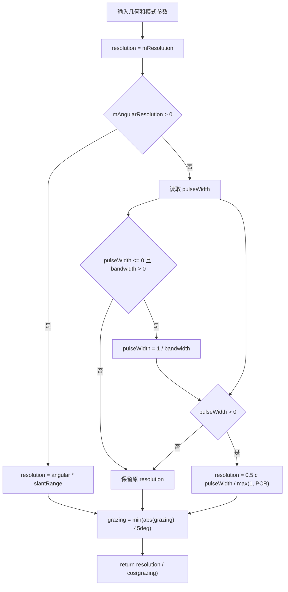

# SAR 距离向地距分辨率算法（SAR Ground-Range Resolution）

> **算法 ID**：ALG-SENSORS-SAR-GROUND-RANGE-RESOLUTION  
> **状态**：verified  
> **版本/日期**：1.0 / 2026-07-27  
> **领域**：传感器 / 合成孔径雷达  
> **AFSIM 模块**：`core/wsf_mil`  
> **覆盖候选**：`bb30e1d34a7c26d7`  
> **接口规格**：`docs/extracted-algorithms/sar-ground-range-resolution/sensors-sar-ground-range-resolution-interface-spec.md`

## 1. 算法边界

- **目的**：由脉宽或接收机带宽、脉冲压缩比和擦地角计算 SAR 距离向地距分辨率。
- **入口条件**：SAR 几何已生成，模式配置和发射/接收机参数可读。
- **完成条件**：返回距离向地距分辨率，单位 m。
- **包含**：旧角分辨率路径、脉宽/带宽路径、脉冲压缩修正、擦地角投影修正。
- **不包含**：方位分辨率、驻留时间、CNR、FOV 和 RF 功率模型。
- **生命周期位置**：`simulation_loop`，由探测和 SAR 模式开始/结束路径调用。

## 2. 流程



## 3. 数据契约

### 3.1 输入

| # | 中文名称 | 代码标识 | 数学符号 | 类型 | 含义 | 单位/坐标系 | 所属函数 Method |
| --- | --- | --- | --- | --- | --- | --- | --- |
| 1 | 期望分辨率 | `mResolution` | $\delta_0$ | `double` | 默认返回基准 | m | `WsfSAR_Sensor::ComputeGroundRangeResolution#ac1540f0b7` |
| 2 | 旧角分辨率 | `mAngularResolution` | $\alpha$ | `double` | 旧式角分辨率 | rad | 同上 |
| 3 | 斜距 | `aGeometry.mSlantRange` | $R$ | `double` | 旧路径投影距离 | m | 同上 |
| 4 | 脉宽 | `mXmtrPtr->GetPulseWidth()` | $\tau$ | `double` | 发射脉冲宽度 | s | 同上 |
| 5 | 接收机带宽 | `mRcvrPtr->GetBandwidth()` | $B$ | `double` | 脉宽缺省时的替代量 | Hz | 同上 |
| 6 | 脉冲压缩比 | `mXmtrPtr->GetPulseCompressionRatio()` | $G_{pc}$ | `double` | 距离向压缩比 | 1 | 同上 |
| 7 | 擦地角 | `aGeometry.mGrazingAngle` | $\gamma$ | `double` | LOS 与地面局部切平面角 | rad | 同上 |

### 3.2 输出

| # | 中文名称 | 代码标识 | 数学符号 | 类型 | 含义 | 单位/坐标系 | 所属函数 Method |
| --- | --- | --- | --- | --- | --- | --- | --- |
| 1 | 距离向地距分辨率 | `return` | $\delta_g$ | `double` | 经擦地角投影后的地距分辨率 | m | `WsfSAR_Sensor::ComputeGroundRangeResolution#ac1540f0b7` |

### 3.3 参数与常量

| # | 中文名称 | 代码标识 | 数学符号 | 类型 | 值/范围 | 单位 | 来源 | 所属函数 Method |
| --- | --- | --- | --- | --- | --- | --- | --- | --- |
| 1 | 光速 | `UtMath::cLIGHT_SPEED` | $c$ | `double` | 299792458 | m/s | 常量 | `WsfSAR_Sensor::ComputeGroundRangeResolution#ac1540f0b7` |
| 2 | 最小压缩分母 | `std::max(1.0, PCR)` | - | `double` | 至少 1 | 1 | 源码保护 | 同上 |
| 3 | 最大投影擦地角 | `45.0 * cRAD_PER_DEG` | $\gamma_{max}$ | `double` | 45 deg | rad | 源码硬编码 | 同上 |

### 3.4 内部状态

| # | 状态 | 代码标识 | 类型 | 单位/坐标系 | 初值 | 读取函数 | 写入函数 | 更新时机 | 重置 |
| --- | --- | --- | --- | --- | --- | --- | --- | --- | --- |
| 1 | 当前地距分辨率 | `mCurrentGroundRangeResolution` | `double` | m | 0 | 成像状态查询 | `SpotModeBegin` / `StripModeBegin` | 成像开始 | 模式初始化 |
| 2 | 达成地距分辨率 | `mAchievedGroundRangeResolution` | `double` | m | 0 | 传感器查询 | `SpotModeBegin` / `SpotModeEnd` / `StripModeBegin` | 预测或结束 | 传感器初始化 |

## 4. 数学模型

旧路径：

$$
\delta_r=\alpha R
$$

脉宽/带宽路径：

$$
\tau_{eff}=
\begin{cases}
\tau,&\tau>0\\
1/B,&\tau\le0\land B>0\\
\text{unset},&\text{otherwise}
\end{cases}
$$

若 $\tau_{eff}>0$：

$$
\delta_r=\frac{0.5c\tau_{eff}}{\max(1,G_{pc})}
$$

地距投影：

$$
\boxed{\delta_g=\frac{\delta_r}{\cos(\min(|\gamma|,45^\circ))}}
$$

## 5. 伪代码

```text
function compute_ground_range_resolution(config, geometry, transmitter, receiver):
    resolution = config.requested_resolution_m

    # 中文：旧 angular_resolution 命令优先，保留源码兼容。
    if config.legacy_angular_resolution_rad > 0:
        resolution = config.legacy_angular_resolution_rad * geometry.slant_range_m
    else:
        pulse_width = transmitter.pulse_width_s
        if pulse_width <= 0 and receiver.bandwidth_hz > 0:
            pulse_width = 1 / receiver.bandwidth_hz
        if pulse_width > 0:
            resolution = 0.5 * light_speed * pulse_width / max(1, transmitter.pulse_compression_ratio)

    grazing = min(abs(geometry.grazing_angle_rad), deg_to_rad(45))
    return resolution / cos(grazing)
```

## 6. 源码证据

### 6.1 入口和调用链

```text
WsfSAR_Sensor::SpotModeBegin#17b5fcb893
  -> WsfSAR_Sensor::ComputeGroundRangeResolution#ac1540f0b7
WsfSAR_Sensor::SpotModeEnd#17b5fcb893
  -> WsfSAR_Sensor::ComputeGroundRangeResolution#ac1540f0b7
```

### 6.2 源码位置

| candidate_id | qualified_name | 模块 | 源码位置 | 角色 | 证据等级 |
| --- | --- | --- | --- | --- | --- |
| `bb30e1d34a7c26d7` | `WsfSAR_Sensor::ComputeGroundRangeResolution#ac1540f0b7` | `core/wsf_mil` | `afsim-2_9/swdev/src/core/wsf_mil/source/sensor/WsfSAR_Sensor.cpp:2235-2261` | 核心 | source-cited |

### 6.3 框架与依赖

| 依赖 | 分类 | 用途 | 算法核心必需 | 中性替代 |
| --- | --- | --- | --- | --- |
| `WsfEM_Xmtr` | AFSIM 框架 | 脉宽、脉冲压缩比 | no | 显式标量 |
| `WsfEM_Rcvr` | AFSIM 框架 | 带宽 | no | 显式标量 |
| `Geometry` | AFSIM 数据 | 擦地角和斜距 | no | 中性几何结构 |
| `<cmath>` | 标准库 | `cos/fabs` | yes | 等价数学库 |

## 7. 边界、风险与未知

| 条件 | 源码行为 | 数学/数值影响 | 建议处理 | 证据 |
| --- | --- | --- | --- | --- |
| `mAngularResolution > 0` | 忽略脉宽和带宽 | 旧配置优先级高 | 返回状态 `legacy` | `WsfSAR_Sensor.cpp:2238-2242` |
| 脉宽和带宽均不可用 | 返回 `mResolution` 再投影 | 可能把方位目标分辨率当距离分辨率 | 中性接口标记 `fallback_resolution` | `WsfSAR_Sensor.cpp:2245-2257` |
| `PCR < 1` | 按 1 处理 | 不允许压缩比放大分辨率 | 保留源码兼容 | `WsfSAR_Sensor.cpp:2256` |
| `|grazing| > 45 deg` | 按 45 deg 投影 | 限制地距膨胀 | 暴露限幅 | `WsfSAR_Sensor.cpp:2259-2260` |

- **已确认假设**：脉宽单位为秒，带宽单位为 Hz，输出为米。
- **待人工复核**：`mResolution` 作为 fallback 时是否代表距离向期望值还是仅为共享配置默认值。

## 8. 验证计划

| 类型 | 输入/场景 | Oracle | 容差/不变量 | 覆盖证据 |
| --- | --- | --- | --- | --- |
| 正常 | `pulseWidth=1e-6`、`PCR=10`、`grazing=30 deg` | `17.308525632731957` m | `1e-12` | 脉宽路径 |
| 边界 | `angular=0.001`、`R=12000`、`grazing=45 deg` | `16.97056274847714` m | `1e-12` | 旧路径 |
| 退化/异常 | `pulseWidth<=0`、`bandwidth<=0` | fallback 到 `mResolution/cos(clampedGrazing)` | 精确 | fallback 路径 |

## 9. 可移植性

- **等级**：高。
- **可移植核心**：纯标量公式。
- **AFSIM 耦合**：参数从发射机、接收机和模式对象读取。
- **类型/单位/坐标系适配**：角度为 rad，长度为 m，带宽为 Hz。
- **许可证/clean-room 注意**：按公式重写，避免复制源码结构。

## 10. 覆盖账本回写

| candidate_id | 状态 | algorithm_id | 决策理由 | 验证 |
| --- | --- | --- | --- | --- |
| `bb30e1d34a7c26d7` | extracted | ALG-SENSORS-SAR-GROUND-RANGE-RESOLUTION | SAR 距离向地距分辨率核心公式 | passed |
