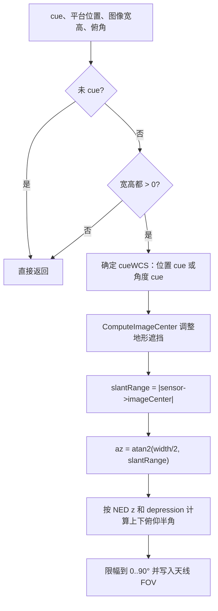

# SAR 图像尺寸视场反算算法（SAR Image-Size Field-of-View）

> **算法 ID**：ALG-SENSORS-SAR-IMAGE-FIELD-OF-VIEW  
> **状态**：verified  
> **版本/日期**：1.0 / 2026-07-27  
> **领域**：传感器 / 合成孔径雷达  
> **AFSIM 模块**：`core/wsf_mil`  
> **覆盖候选**：`8a395a5e539e9ed8`  
> **接口规格**：`docs/extracted-algorithms/sar-image-field-of-view/sensors-sar-image-field-of-view-interface-spec.md`

## 1. 算法边界

- **目的**：当用户指定 spot SAR 图像宽高时，按 cue 点、斜距和俯角反算天线方位/俯仰视场并更新天线状态。
- **入口条件**：传感器已 cue 到位置或角度，`mImageHeight` 与 `mImageWidth` 均为正。
- **完成条件**：更新 `mImageCenterWCS`，并调用天线设置方位和俯仰 FOV。
- **包含**：cue 位置求解、terrain-aware 图像中心调整调用、斜距重算、宽度方位半角、长度俯仰上下半角与 0..90 deg 限幅。
- **不包含**：递归 terrain mask 本体、几何 `ComputeGeometry` 的其余角度、天线 FOV 判定和探测概率。
- **生命周期位置**：`simulation_loop`；`ComputeGeometry` 内部调用。



## 2. 数据契约

### 2.1 输入

| # | 中文名称 | 代码标识 | 数学符号 | 类型 | 含义 | 单位/坐标系 | 所属函数 Method |
| --- | --- | --- | --- | --- | --- | --- | --- |
| 1 | cue 类型 | `GetSensor()->GetCueType()` | $q$ | enum | 未 cue、位置 cue 或角度 cue | - | `WsfSAR_Sensor::ComputeFOV#e0203ca715` |
| 2 | 传感器位置 | `GetPlatform()->GetLocationWCS` | $\mathbf{s}$ | `double[3]` | 平台/传感器 WCS 位置 | m / WCS | 同上 |
| 3 | cue 位置 | `GetCuedLocationWCS` / 角度转换 | $\mathbf{c}$ | `double[3]` | 图像中心初值 | m / WCS | 同上 |
| 4 | 图像宽度 | `mImageWidth` | $W$ | `double` | 横向成像宽度 | m | 同上 |
| 5 | 图像高度 | `mImageHeight` | $H$ | `double` | 纵向成像高度 | m | 同上 |
| 6 | 斜距 | `aGeometry.mSlantRange` | $R_0$ | `double` | 角度 cue 时构造 cue 点使用 | m | 同上 |
| 7 | 俯角 | `aGeometry.mDepressionAngle` | $\phi$ | `double` | 正值向下 | rad / NED | 同上 |

### 2.2 输出

| # | 中文名称 | 代码标识 | 数学符号 | 类型 | 含义 | 单位/坐标系 | 所属函数 Method |
| --- | --- | --- | --- | --- | --- | --- | --- |
| 1 | 方位视场 | `SetAzimuthFieldOfView(-azAngle, azAngle)` | $[-\alpha,\alpha]$ | two doubles | 天线方位 FOV | rad | `WsfSAR_Sensor::ComputeFOV#e0203ca715` |
| 2 | 俯仰视场 | `SetElevationFieldOfView(-elLower, elUpper)` | $[-\epsilon_l,\epsilon_u]$ | two doubles | 天线俯仰 FOV | rad | 同上 |
| 3 | 图像中心 | `mImageCenterWCS` | $\mathbf{c}'$ | `double[3]` | terrain-aware 图像中心 | m / WCS | 同上 |

### 2.3 参数与常量

| # | 中文名称 | 代码标识 | 数学符号 | 类型 | 值/范围 | 单位 | 来源 | 所属函数 Method |
| --- | --- | --- | --- | --- | --- | --- | --- | --- |
| 1 | 半宽/半高 | `/ 2.0` | $W/2,H/2$ | `double` | 输入一半 | m | 源码 | `WsfSAR_Sensor::ComputeFOV#e0203ca715` |
| 2 | 俯仰限幅上界 | `UtMath::cPI_OVER_2` | $\pi/2$ | `double` | 90 deg | rad | 常量 | 同上 |
| 3 | 图像尺寸上界 | `9999.0 * 1000.0` | - | `double` | 9999 km | m | 输入解析 | 同上 |

### 2.4 内部状态

| # | 状态 | 代码标识 | 类型 | 单位/坐标系 | 初值 | 读取函数 | 写入函数 | 更新时机 | 重置 |
| --- | --- | --- | --- | --- | --- | --- | --- | --- | --- |
| 1 | 图像中心 | `mImageCenterWCS` | `double[3]` | m / WCS | 0 | 图像发送/后续处理 | `ComputeFOV` | 几何计算 | 模式构造/复制 |
| 2 | 天线 FOV | `mAntennaPtr` | `WsfEM_Antenna` | rad | 天线默认 | FOV 判定 | `ComputeFOV` | 几何计算 | 天线配置 |

## 3. 数学模型

方位半角：

$$
\boxed{\alpha=\operatorname{atan2}(W/2,R)}
$$

其中 $R=\|\mathbf{c}'-\mathbf{s}\|$，使用 terrain-aware 图像中心。

俯仰半角源码按 NED 的 down 分量 $z$ 和俯角 $\phi$ 计算：

$$
t_1=z\tan\phi,\quad t_2=\frac{H}{2}\tan\phi
$$

$$
\epsilon_u=\left|\phi-\operatorname{atan2}(t_1,z+t_2)\right|
$$

$$
\epsilon_l=\left|\phi-\operatorname{atan2}(t_1,z-t_2)\right|
$$

再分别限幅：

$$
\epsilon_u,\epsilon_l \in [0,\pi/2]
$$

最后写入方位 FOV `[-alpha, alpha]`，俯仰 FOV `[-epsilon_l, epsilon_u]`。

## 4. 伪代码

```text
function compute_sar_image_fov(sensor, platform, antenna, geometry, config):
    if sensor.cue_type == cued_to_nothing:
        return unchanged
    if config.image_height_m <= 0 or config.image_width_m <= 0:
        return unchanged

    sensor_wcs = platform.location_wcs()
    cue_wcs = resolve_cue_wcs(sensor, geometry.slant_range_m)

    # 中文：源码调用递归地形遮挡修正，修正结果写回 cue_wcs。
    compute_image_center(sensor_wcs, cue_wcs, first_pass=true)
    image_center_wcs = cue_wcs

    los_wcs = cue_wcs - sensor_wcs
    slant_range_m = norm(los_wcs)
    az_half = atan2(config.image_width_m / 2, slant_range_m)
    antenna.set_azimuth_fov(-az_half, az_half)

    los_ned = platform.convert_wcs_vector_to_ned(los_wcs)
    t1 = los_ned.down_m * tan(geometry.depression_angle_rad)
    t2 = config.image_height_m / 2 * tan(geometry.depression_angle_rad)
    el_upper = abs(geometry.depression_angle_rad - atan2(t1, los_ned.down_m + t2))
    el_lower = abs(geometry.depression_angle_rad - atan2(t1, los_ned.down_m - t2))

    # 中文：源码独立限幅上下半角，再按下负上正写入。
    antenna.set_elevation_fov(-limit(el_lower, 0, pi/2), limit(el_upper, 0, pi/2))
```

## 5. 源码证据

### 5.1 入口和调用链

```text
WsfSAR_Sensor::ComputeGeometry#0693a0de57
  -> WsfSAR_Sensor::ComputeFOV#e0203ca715
     -> WsfSAR_Sensor::ComputeImageCenter#e5e9d65ad0
     -> WsfEM_Antenna::SetAzimuthFieldOfView
     -> WsfEM_Antenna::SetElevationFieldOfView
```

### 5.2 源码位置

| candidate_id | qualified_name | 模块 | 源码位置 | 角色 | 证据等级 |
| --- | --- | --- | --- | --- | --- |
| `8a395a5e539e9ed8` | `WsfSAR_Sensor::ComputeFOV#e0203ca715` | `core/wsf_mil` | `afsim-2_9/swdev/src/core/wsf_mil/source/sensor/WsfSAR_Sensor.cpp:2628-2688` | 核心/状态更新 | source-cited |

### 5.3 框架与依赖

| 依赖 | 分类 | 用途 | 算法核心必需 | 中性替代 |
| --- | --- | --- | --- | --- |
| `WsfSensor` cue API | AFSIM 框架 | 获取 cue 类型和位置 | no | 显式 cue 输入 |
| `WsfPlatform` 坐标转换 | AFSIM 框架 | WCS/NED 转换 | no | 注入坐标变换 |
| `ComputeImageCenter` | AFSIM 算法辅助 | 地形遮挡中心修正 | no | 可选 terrain oracle |
| `WsfEM_Antenna` | AFSIM 框架 | 写入 FOV | no | 返回 FOV 输出结构 |
| `<cmath>` | 标准库 | `atan2/tan/fabs` | yes | 等价数学库 |

## 6. 边界、风险与未知

| 条件 | 源码行为 | 数学/数值影响 | 建议处理 | 证据 |
| --- | --- | --- | --- | --- |
| 未 cue | 直接返回 | 不修改旧 FOV | 明确输出 `unchanged` | `WsfSAR_Sensor.cpp:2630-2634` |
| 宽或高未同时为正 | 直接返回 | 仅指定单轴尺寸无效 | 输入层提示 | `WsfSAR_Sensor.cpp:2636` |
| cue 类型不是 location/angle | `cueWCS` 保持零向量后继续 | 可能产生错误 FOV | 中性接口拒绝未知 cue | `WsfSAR_Sensor.cpp:2642-2654` |
| `slantRange == 0` | `atan2(width/2,0)` 得约 90 deg | 方位 FOV 饱和 | 返回退化状态 | `WsfSAR_Sensor.cpp:2660-2667` |
| `z - t2 == 0` | `atan2(t1,0)` 有定义 | 下半角突变 | 保留源码兼容 | `WsfSAR_Sensor.cpp:2674-2681` |
| 地形中心递归 | 由 `ComputeImageCenter` 调整 cue | FOV 依赖 terrain mask | 抽象为可选预处理 | `WsfSAR_Sensor.cpp:2656-2658` |

- **已确认假设**：`snrToCueLocNED[2]` 是 NED down 分量；俯角源码注释为 positive down。
- **待人工复核**：`ComputeImageCenter` 是否应拆为独立地形遮挡算法；本批只把它作为 FOV 的可替换辅助。

## 7. 验证计划

| 类型 | 输入/场景 | Oracle | 容差/不变量 | 覆盖证据 |
| --- | --- | --- | --- | --- |
| 正常 | $R=10000$ m、$W=2000$ m、$H=1000$ m、$\phi=30^\circ$、NED down=5000 m | `az=0.09966865249116202`、`elUpper=0.023957812945459123`、`elLower=0.026125582775832656` | `1e-12` | 角公式 |
| 边界 | 未 cue | 不修改 FOV 和图像中心 | 状态 `unchanged` | 早退 |
| 退化/异常 | `slantRange=0` 且宽度正 | 方位半角趋近 $\pi/2$，状态 `degenerate_range` | 限幅不越界 | `atan2` 分支 |

## 8. 可移植性

- **等级**：中。
- **可移植核心**：图像尺寸到 FOV 的三角反算可直接迁移。
- **AFSIM 耦合**：cue、WCS/NED 坐标转换、地形遮挡递归和天线状态写回。
- **类型/单位/坐标系适配**：输入长度为 m，角度为 rad，NED z 为 down 正方向。
- **许可证/clean-room 注意**：建议重写纯几何部分，terrain oracle 单独定义接口。

## 9. 可移植接口摘要

中性接口应返回 `image_center_wcs`、`azimuth_min/max_rad`、`elevation_min/max_rad` 和状态；不要直接修改天线对象。

## 10. 覆盖账本回写

| candidate_id | 状态 | algorithm_id | 决策理由 | 验证 |
| --- | --- | --- | --- | --- |
| `8a395a5e539e9ed8` | extracted | ALG-SENSORS-SAR-IMAGE-FIELD-OF-VIEW | 独立、可测试的 SAR 图像尺寸到天线视场反算与状态更新算法 | passed |
