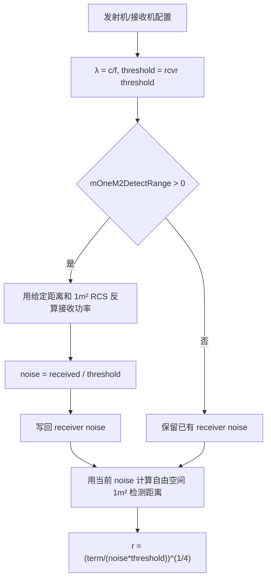

# SAR 1 m² 目标自由空间校准算法（SAR One-Square-Meter Calibration）

> **算法 ID**：ALG-SENSORS-SAR-ONE-M2-CALIBRATION  
> **状态**：verified  
> **版本/日期**：1.0 / 2026-07-27  
> **领域**：传感器 / 合成孔径雷达  
> **AFSIM 模块**：`core/wsf_mil`  
> **覆盖候选**：`c0e8cb95e06388ba`  
> **接口规格**：`docs/extracted-algorithms/sar-one-m2-calibration/sensors-sar-one-m2-calibration-interface-spec.md`

## 1. 算法边界

- **目的**：在 SAR 初始化校准时，用单基地自由空间雷达方程在“1 m² 检测距离”和接收机噪声功率之间互相换算。
- **入口条件**：发射机、接收机、检测阈值、频率、天线峰值增益和损耗已配置。
- **完成条件**：可选写回接收机噪声功率，并计算当前配置对应的 1 m² 自由空间检测距离。
- **包含**：平均功率/波长辅助量、`mOneM2DetectRange` 反算噪声、固定噪声下检测距离四次根计算、脉冲压缩/积分增益/调整因子。
- **不包含**：日志输出、真实地杂波、地球曲率、天线方向图角度变化、SAR CNR 计算。
- **生命周期位置**：`initialize`，由 SAR 模式初始化调用。

## 2. 流程



## 3. 数据契约

### 3.1 输入

| # | 中文名称 | 代码标识 | 数学符号 | 类型 | 含义 | 单位/坐标系 | 所属函数 Method |
| --- | --- | --- | --- | --- | --- | --- | --- |
| 1 | 发射功率 | `xmtr.GetPower()` | $P_t$ | `double` | 当前用于方程的发射功率 | W | `WsfSAR_Sensor::Calibrate#7f7c2eeadf` |
| 2 | 频率 | `xmtr.GetFrequency()` | $f$ | `double` | 发射频率 | Hz | 同上 |
| 3 | 发射峰值增益 | `xmtr.GetPeakAntennaGain()` | $G_t$ | `double` | 发射天线峰值增益 | 1 | 同上 |
| 4 | 接收峰值增益 | `rcvr.GetPeakAntennaGain()` | $G_r$ | `double` | 接收天线峰值增益 | 1 | 同上 |
| 5 | 发射内部损耗 | `xmtr.GetInternalLoss()` | $L_t$ | `double` | 发射链路损耗 | 1 | 同上 |
| 6 | 接收内部损耗 | `rcvr.GetInternalLoss()` | $L_r$ | `double` | 接收链路损耗 | 1 | 同上 |
| 7 | 脉冲压缩比 | `xmtr.GetPulseCompressionRatio()` | $G_{pc}$ | `double` | 后处理增益 | 1 | 同上 |
| 8 | 积分增益 | `mIntegrationGain` | $G_i$ | `double` | 积分增益 | 1 | 同上 |
| 9 | 调整因子 | `mAdjustmentFactor` | $A$ | `double` | 通用调整倍率 | 1 | 同上 |
| 10 | 检测阈值 | `rcvr.GetDetectionThreshold()` | $T$ | `double` | 最小 S/N 线性阈值 | 1 | 同上 |
| 11 | 配置检测距离 | `mOneM2DetectRange` | $r_0$ | `double` | 若大于 0，用来反算噪声 | m | 同上 |

### 3.2 输出

| # | 中文名称 | 代码标识 | 数学符号 | 类型 | 含义 | 单位/坐标系 | 所属函数 Method |
| --- | --- | --- | --- | --- | --- | --- | --- |
| 1 | 校准噪声功率 | `rcvr.SetNoisePower(rcvrNoise)` | $P_n$ | `double` | 可选写回的接收机噪声 | W | `WsfSAR_Sensor::Calibrate#7f7c2eeadf` |
| 2 | 1 m² 检测距离 | local `r` | $r$ | `double` | 当前噪声下自由空间检测距离 | m | 同上 |

### 3.3 参数与常量

| # | 中文名称 | 代码标识 | 数学符号 | 类型 | 值/范围 | 单位 | 来源 | 所属函数 Method |
| --- | --- | --- | --- | --- | --- | --- | --- | --- |
| 1 | 目标 RCS | `rcs = 1.0` | $\sigma$ | `double` | 1 | m² | 校准定义 | `WsfSAR_Sensor::Calibrate#7f7c2eeadf` |
| 2 | 四π | `UtMath::cFOUR_PI` | $4\pi$ | `double` | 常量 | 1 | 工具常量 | 同上 |
| 3 | 四次根指数 | `pow(rangeTerm, 0.25)` | $1/4$ | `double` | 0.25 | 1 | 双程距离损耗 | 同上 |

### 3.4 内部状态

| # | 状态 | 代码标识 | 类型 | 单位/坐标系 | 初值 | 读取函数 | 写入函数 | 更新时机 | 重置 |
| --- | --- | --- | --- | --- | --- | --- | --- | --- | --- |
| 1 | 接收机噪声 | `rcvr.GetNoisePower()` | `double` | W | 接收机配置 | SAR/CNR | `Calibrate` 可写 | 初始化 | 接收机配置 |
| 2 | 配置一平方米检测距离 | `mOneM2DetectRange` | `double` | m | 0 | `Calibrate` | 输入解析 | 场景加载 | 模式配置 |

## 4. 数学模型

波长：

$$
\lambda=\frac{c}{f}
$$

若配置 $r_0>0$，源码按双程自由空间链路计算 1 m² 目标接收功率：

$$
P_r=
\left(\frac{P_tG_t}{L_t}\right)
\left(\frac{1}{4\pi r_0^2}\right)
(1)
\left(\frac{1}{4\pi r_0^2}\right)
\left(\frac{\lambda^2}{4\pi}\right)
\left(\frac{G_r}{L_r}\right)
G_{pc}G_iA
$$

并写回：

$$
\boxed{P_n=\frac{P_r}{T}}
$$

当前噪声下检测距离：

$$
K=
\frac{\lambda^2}{(4\pi)^3}
\frac{P_tG_tG_r}{L_tL_r}
G_{pc}G_iA
$$

$$
\boxed{r=\left(\frac{K}{P_nT}\right)^{1/4}}
$$

## 5. 伪代码

```text
function calibrate_one_m2_sar(config, transmitter, receiver):
    wavelength = light_speed / transmitter.frequency_hz
    threshold = receiver.detection_threshold

    # 中文：如果用户给了 1m² 检测距离，则反算噪声并写回接收机。
    if config.one_m2_detect_range_m > 0:
        r = config.one_m2_detect_range_m
        distance_factor = 1 / (4 * pi * r * r)
        p_radiated = transmitter.power_w * transmitter.peak_gain / transmitter.internal_loss
        p_received = p_radiated * distance_factor * 1.0 * distance_factor
        p_received *= wavelength^2 / (4 * pi)
        p_received *= receiver.peak_gain / receiver.internal_loss
        p_received *= transmitter.pulse_compression_ratio * config.integration_gain * config.adjustment_factor
        receiver.noise_power_w = p_received / threshold

    term = wavelength^2 / (4*pi)^3
    term *= transmitter.power_w * transmitter.peak_gain * receiver.peak_gain
    term /= transmitter.internal_loss * receiver.internal_loss
    term *= transmitter.pulse_compression_ratio * config.integration_gain * config.adjustment_factor
    return pow(term / (receiver.noise_power_w * threshold), 0.25)
```

## 6. 源码证据

### 6.1 入口和调用链

```text
WsfSAR_Sensor::Initialize#ea1450d5de
  -> WsfSAR_Sensor::Calibrate#7f7c2eeadf
```

### 6.2 源码位置

| candidate_id | qualified_name | 模块 | 源码位置 | 角色 | 证据等级 |
| --- | --- | --- | --- | --- | --- |
| `c0e8cb95e06388ba` | `WsfSAR_Sensor::Calibrate#7f7c2eeadf` | `core/wsf_mil` | `afsim-2_9/swdev/src/core/wsf_mil/source/sensor/WsfSAR_Sensor.cpp:2704-2843` | 核心/初始化 | source-cited |

### 6.3 框架与依赖

| 依赖 | 分类 | 用途 | 算法核心必需 | 中性替代 |
| --- | --- | --- | --- | --- |
| `WsfEM_Xmtr` | AFSIM 框架 | 发射功率、频率、增益、损耗 | no | 中性 transmitter 配置 |
| `WsfEM_Rcvr` | AFSIM 框架 | 接收增益、损耗、阈值、噪声 | no | 中性 receiver 配置 |
| `ut::log` | AFSIM 工具 | 校准打印 | no | 移除 |
| `<cmath>` | 标准库 | `pow` | yes | 等价数学库 |

## 7. 边界、风险与未知

| 条件 | 源码行为 | 数学/数值影响 | 建议处理 | 证据 |
| --- | --- | --- | --- | --- |
| `mOneM2DetectRange > 0` | 写回 receiver noise | 初始化会改变后续 CNR 和检测 | 接口显式返回副作用 | `WsfSAR_Sensor.cpp:2782-2815` |
| `threshold <= 0` | 未校验 | 除零或负噪声 | 中性接口拒绝 | `WsfSAR_Sensor.cpp:2772-2815` |
| 损耗或噪声为 0 | 未校验 | Inf/NaN | 中性接口拒绝 | `WsfSAR_Sensor.cpp:2789-2837` |
| 日志分支 | 与核心混杂 | 不影响状态 | 文档剥离日志 | `WsfSAR_Sensor.cpp:2713-2770` |

- **已确认假设**：RCS 固定为 1 m²，公式为单基地自由空间双程雷达方程。
- **待人工复核**：`GetPower()` 与 `GetAveragePower()` 的选择意图；源码在核心方程使用 `GetPower()`。

## 8. 验证计划

| 类型 | 输入/场景 | Oracle | 容差/不变量 | 覆盖证据 |
| --- | --- | --- | --- | --- |
| 正常 | `P=1000 W`、`Gt=Gr=100`、`Lt=Lr=2`、`lambda=0.03 m`、`PCR=10`、`Gi=2`、`A=0.5`、`noise=1e-12 W`、`T=13` | detection range `966.3899246148366` m | `1e-9` | 四次根公式 |
| 边界 | `one_m2_range=5000 m` 同参数 | calibrated noise `1.3954990860519005e-15` W | `1e-24` | 反算噪声 |
| 退化/异常 | `threshold<=0` 或 `noise<=0` | 中性接口拒绝 | 状态 | 输入门禁 |

## 9. 可移植性

- **等级**：中高。
- **可移植核心**：自由空间雷达方程自包含。
- **AFSIM 耦合**：发射机/接收机对象和初始化副作用。
- **类型/单位/坐标系适配**：功率 W、频率 Hz、波长 m、增益/损耗线性。
- **许可证/clean-room 注意**：按标准雷达方程重写，日志输出不迁移。

## 10. 覆盖账本回写

| candidate_id | 状态 | algorithm_id | 决策理由 | 验证 |
| --- | --- | --- | --- | --- |
| `c0e8cb95e06388ba` | extracted | ALG-SENSORS-SAR-ONE-M2-CALIBRATION | SAR 1 m² 自由空间检测距离与接收机噪声互算校准 | passed |
