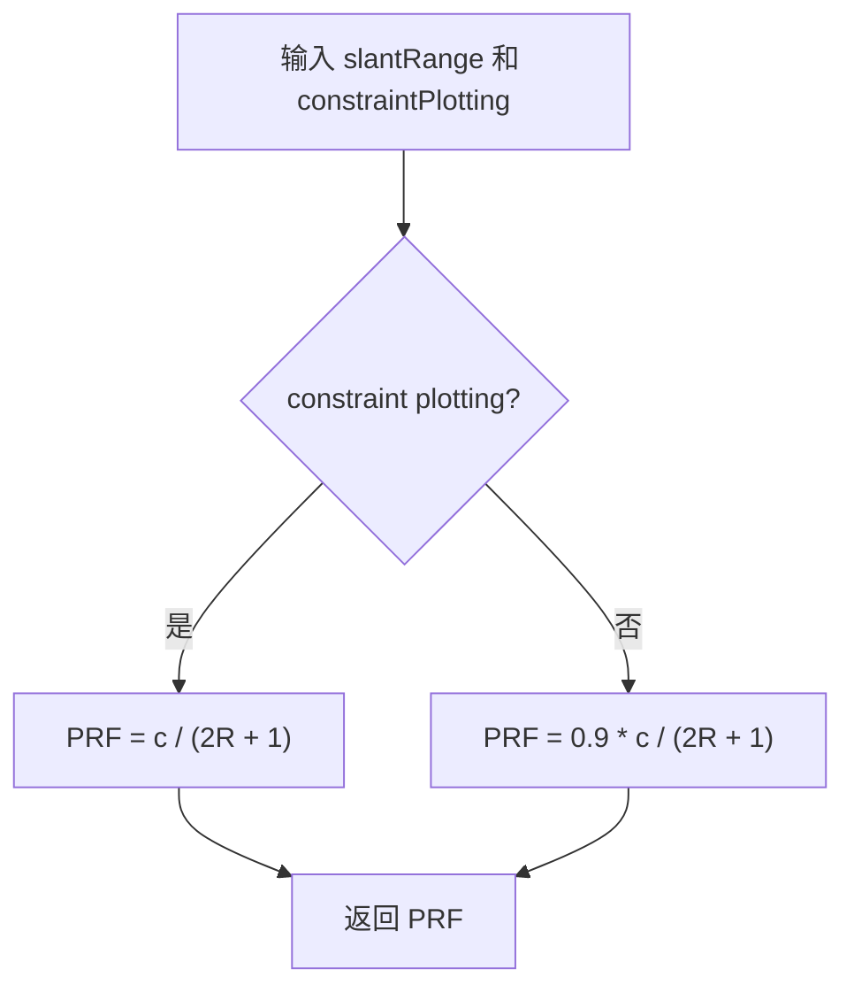

# SAR 非模糊距离 PRF 选择算法（SAR Unambiguous-Range PRF Selection）

> **算法 ID**：ALG-SENSORS-SAR-PRF-UNAMBIGUOUS-RANGE  
> **状态**：verified  
> **版本/日期**：1.0 / 2026-07-27  
> **领域**：传感器 / 合成孔径雷达  
> **AFSIM 模块**：`core/wsf_mil`  
> **覆盖候选**：`e4ca613fd7961a9d`  
> **接口规格**：`docs/extracted-algorithms/sar-prf-unambiguous-range/sensors-sar-prf-unambiguous-range-interface-spec.md`

## 1. 算法边界

- **目的**：根据当前斜距选择满足 SAR 非模糊距离边界的 PRF。
- **入口条件**：SAR 几何斜距已计算，模式配置允许自动计算 PRF。
- **完成条件**：返回 PRF，单位 Hz。
- **包含**：constraint plotting 特殊路径、普通路径 0.9 margin、`2R+1` 分母保护。
- **不包含**：Doppler fold-over 最小 PRF、发射机写回、PRF 合法性检查和编译关闭的 beam-edge 分支。
- **生命周期位置**：`simulation_loop`，由性能预测和探测路径调用。

## 2. 流程



## 3. 数据契约

### 3.1 输入

| # | 中文名称 | 代码标识 | 数学符号 | 类型 | 含义 | 单位/坐标系 | 所属函数 Method |
| --- | --- | --- | --- | --- | --- | --- | --- |
| 1 | 斜距 | `aGeometry.mSlantRange` | $R$ | `double` | 传感器至关注点斜距 | m | `WsfSAR_Sensor::ComputePRF#3eaf3fdd9f` |
| 2 | 约束绘图标志 | `mSAR_SensorPtr->mSAR_ConstraintPlotting` | $q$ | `bool` | 是否绘制 SAR 约束图 | - | 同上 |

### 3.2 输出

| # | 中文名称 | 代码标识 | 数学符号 | 类型 | 含义 | 单位/坐标系 | 所属函数 Method |
| --- | --- | --- | --- | --- | --- | --- | --- |
| 1 | 脉冲重复频率 | `return` | $PRF$ | `double` | 自动选择的 PRF | Hz | `WsfSAR_Sensor::ComputePRF#3eaf3fdd9f` |

### 3.3 参数与常量

| # | 中文名称 | 代码标识 | 数学符号 | 类型 | 值/范围 | 单位 | 来源 | 所属函数 Method |
| --- | --- | --- | --- | --- | --- | --- | --- | --- |
| 1 | 光速 | `UtMath::cLIGHT_SPEED` | $c$ | `double` | 299792458 | m/s | 常量 | `WsfSAR_Sensor::ComputePRF#3eaf3fdd9f` |
| 2 | 分母保护 | `+ 1.0` | $1$ | `double` | 1 | m | 源码硬编码 | 同上 |
| 3 | 普通路径裕度 | `* 0.9` | $m$ | `double` | 0.9 | 1 | 源码硬编码 | 同上 |

### 3.4 内部状态

| # | 状态 | 代码标识 | 类型 | 单位/坐标系 | 初值 | 读取函数 | 写入函数 | 更新时机 | 重置 |
| --- | --- | --- | --- | --- | --- | --- | --- | --- | --- |
| 1 | 发射机 PRF | `mXmtrPtr->SetPulseRepetitionFrequency(prf)` | `double` | Hz | 发射机配置 | 发射机 | `SpotModeBegin` / `StripModeBegin` | 性能预测后 | 模式配置 |

## 4. 数学模型

约束绘图：

$$
PRF=\frac{c}{2R+1}
$$

普通路径：

$$
\boxed{PRF=0.9\frac{c}{2R+1}}
$$

其中 `+1` 是源码中的分母保护，也会轻微降低短斜距 PRF。

## 5. 伪代码

```text
function compute_sar_prf_unambiguous_range(slant_range_m, constraint_plotting):
    base = light_speed / (2 * slant_range_m + 1)

    # 中文：约束图绘制路径取非模糊边界本身；普通路径留 10% 裕度。
    if constraint_plotting:
        return base
    return 0.9 * base
```

## 6. 源码证据

### 6.1 入口和调用链

```text
WsfSAR_Sensor::PredictPerformance  // CodeGraph 定位于 WsfSAR_Sensor.cpp:2523
  -> WsfSAR_Sensor::ComputePRF#3eaf3fdd9f
WsfSAR_Sensor::AttemptToDetect#516f4dae30
  -> WsfSAR_Sensor::ComputePRF#3eaf3fdd9f
```

### 6.2 源码位置

| candidate_id | qualified_name | 模块 | 源码位置 | 角色 | 证据等级 |
| --- | --- | --- | --- | --- | --- |
| `e4ca613fd7961a9d` | `WsfSAR_Sensor::ComputePRF#3eaf3fdd9f` | `core/wsf_mil` | `afsim-2_9/swdev/src/core/wsf_mil/source/sensor/WsfSAR_Sensor.cpp:2165-2189` | 核心 | source-cited |

### 6.3 框架与依赖

| 依赖 | 分类 | 用途 | 算法核心必需 | 中性替代 |
| --- | --- | --- | --- | --- |
| `Geometry` | AFSIM 数据 | 斜距 | no | 显式 `slant_range_m` |
| `WsfSAR_Sensor` | AFSIM 状态 | constraint plotting 标志 | no | 显式布尔值 |
| `UtMath` | 工具常量 | 光速 | no | 标准常量 |

## 7. 边界、风险与未知

| 条件 | 源码行为 | 数学/数值影响 | 建议处理 | 证据 |
| --- | --- | --- | --- | --- |
| `slantRange < -0.5` | 分母为负 | 返回负 PRF | 中性接口拒绝负斜距 | `WsfSAR_Sensor.cpp:2172-2178` |
| `slantRange = -0.5` | 分母为 0 | Inf | 中性接口拒绝 | 同上 |
| 普通路径 | 乘 0.9 | 留 10% 非模糊裕度 | 明确兼容 | `WsfSAR_Sensor.cpp:2176-2178` |
| `#else` 分支 | 编译关闭 | 不参与当前行为 | 不写入核心契约 | `WsfSAR_Sensor.cpp:2179-2186` |

- **已确认假设**：当前源码编译路径为 `#if 1`。
- **待人工复核**：`+1.0` 分母保护的物理意图未由源码说明。

## 8. 验证计划

| 类型 | 输入/场景 | Oracle | 容差/不变量 | 覆盖证据 |
| --- | --- | --- | --- | --- |
| 正常 | `R=10000` m、普通路径 | `13489.986110694465` Hz | `1e-9` | 普通路径 |
| 边界 | `R=10000` m、constraint plotting | `14988.873456327183` Hz | `1e-9` | 特殊路径 |
| 退化/异常 | `R<0` 或 `2R+1<=0` | 中性接口拒绝 | 状态 | 输入门禁 |

## 9. 可移植性

- **等级**：极高。
- **可移植核心**：一行标量公式。
- **AFSIM 耦合**：只依赖 constraint plotting 状态来源。
- **类型/单位/坐标系适配**：斜距 m，输出 Hz。
- **许可证/clean-room 注意**：按非模糊距离公式重写。

## 10. 覆盖账本回写

| candidate_id | 状态 | algorithm_id | 决策理由 | 验证 |
| --- | --- | --- | --- | --- |
| `e4ca613fd7961a9d` | extracted | ALG-SENSORS-SAR-PRF-UNAMBIGUOUS-RANGE | SAR 非模糊距离 PRF 选择公式，原上游误标为 none 后精确纳入 | passed |
