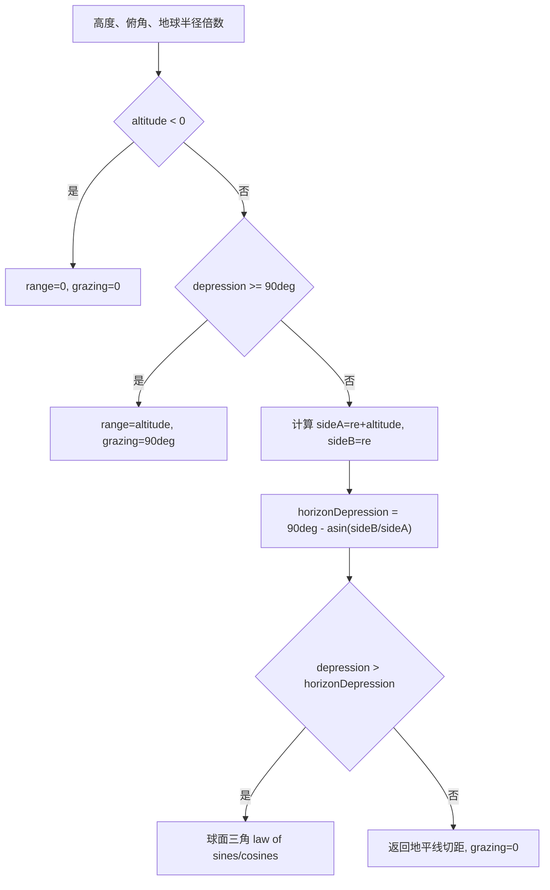

# SAR 曲率地球斜距与擦地角算法（SAR Curved-Earth Slant Range and Grazing Angle）

> **算法 ID**：ALG-SENSORS-SAR-SLANT-RANGE-GRAZING  
> **状态**：verified  
> **版本/日期**：1.0 / 2026-07-27  
> **领域**：传感器 / 合成孔径雷达  
> **AFSIM 模块**：`core/wsf_mil`  
> **覆盖候选**：`42515149407bd8ce`  
> **接口规格**：`docs/extracted-algorithms/sar-slant-range-grazing/sensors-sar-slant-range-grazing-interface-spec.md`

## 1. 算法边界

- **目的**：在球形地球几何下，由传感器高度和俯角计算到地面关注点的斜距，并输出擦地角。
- **入口条件**：传感器高度、positive-down depression angle 和有效地球半径倍数已知。
- **完成条件**：返回斜距，并通过输出参数写入擦地角。
- **包含**：负高度/正下方早退、地平线俯角、低于地平线的球面三角解、地平线距离退化解。
- **不包含**：传感器指向构造、SAR FOV、PRF、CNR 和地形遮挡。
- **生命周期位置**：`simulation_loop`，由 `ComputeGeometry` 和 `ComputePRF` 使用。

## 2. 流程



## 3. 数据契约

### 3.1 输入

| # | 中文名称 | 代码标识 | 数学符号 | 类型 | 含义 | 单位/坐标系 | 所属函数 Method |
| --- | --- | --- | --- | --- | --- | --- | --- |
| 1 | 高度 | `aAltitude` | $h$ | `double` | 传感器高于球形地球表面的高度 | m | `WsfSAR_Sensor::ComputeSlantRange#bb0631eb2b` |
| 2 | 俯角 | `aDepressionAngle` | $\phi$ | `double` | positive-down 指向角 | rad | 同上 |
| 3 | 地球半径倍数 | `mXmtrPtr->GetEarthRadiusMultiplier()` | $k_e$ | `double` | 有效地球半径缩放 | 1 | 同上 |

### 3.2 输出

| # | 中文名称 | 代码标识 | 数学符号 | 类型 | 含义 | 单位/坐标系 | 所属函数 Method |
| --- | --- | --- | --- | --- | --- | --- | --- |
| 1 | 斜距 | `return` | $C$ | `double` | 传感器到关注点距离 | m | `WsfSAR_Sensor::ComputeSlantRange#bb0631eb2b` |
| 2 | 擦地角 | `aGrazingAngle` | $\gamma$ | `double&` | LOS 与地面切平面夹角 | rad | 同上 |

### 3.3 参数与常量

| # | 中文名称 | 代码标识 | 数学符号 | 类型 | 值/范围 | 单位 | 来源 | 所属函数 Method |
| --- | --- | --- | --- | --- | --- | --- | --- | --- |
| 1 | 地球半径 | `UtSphericalEarth::cEARTH_RADIUS` | $R_e$ | `double` | AFSIM 常量 | m | 框架常量 | `WsfSAR_Sensor::ComputeSlantRange#bb0631eb2b` |
| 2 | 半圆周角 | `UtMath::cPI_OVER_2` | $\pi/2$ | `double` | 90 deg | rad | 常量 | 同上 |

### 3.4 内部状态

| # | 状态 | 代码标识 | 类型 | 单位/坐标系 | 初值 | 读取函数 | 写入函数 | 更新时机 | 重置 |
| --- | --- | --- | --- | --- | --- | --- | --- | --- | --- |
| 1 | 几何斜距 | `Geometry::mSlantRange` | `double` | m | 未定义 | SAR 性能函数 | `ComputeGeometry` | 每次几何更新 | 下次覆盖 |
| 2 | 几何擦地角 | `Geometry::mGrazingAngle` | `double` | rad | 未定义 | SAR 性能函数 | `ComputeGeometry` | 每次几何更新 | 下次覆盖 |

## 4. 数学模型

有效半径：

$$
r_e=R_e k_e,\quad A=r_e+h,\quad B=r_e
$$

地平线俯角：

$$
\phi_h=\frac{\pi}{2}-\arcsin\left(\frac{B}{A}\right)
$$

若 $\phi>\phi_h$：

$$
\beta=\frac{\pi}{2}-\phi
$$

$$
\alpha=\pi-\arcsin\left(\frac{A}{B}\sin\beta\right)
$$

$$
\gamma=\alpha-\frac{\pi}{2}
$$

$$
\chi=\pi-\alpha-\beta
$$

$$
\boxed{C=\sqrt{A^2+B^2-2AB\cos\chi}}
$$

若 $\phi\le\phi_h$，源码返回地平线切距：

$$
C=\sqrt{A^2-B^2},\quad \gamma=0
$$

## 5. 伪代码

```text
function compute_slant_range_and_grazing(altitude_m, depression_rad, earth_radius_multiplier):
    if altitude_m < 0:
        return range_m=0, grazing_rad=0
    if depression_rad >= pi / 2:
        return range_m=altitude_m, grazing_rad=pi / 2

    earth_radius = spherical_earth_radius_m * earth_radius_multiplier
    side_a = earth_radius + altitude_m
    side_b = earth_radius
    horizon_dep = pi / 2 - asin(side_b / side_a)

    # 中文：低于地平线时求解球心-传感器-地面点三角形。
    if depression_rad > horizon_dep:
        angle_b = pi / 2 - depression_rad
        angle_a = pi - asin((side_a / side_b) * sin(angle_b))
        grazing = angle_a - pi / 2
        angle_c = pi - angle_a - angle_b
        side_c = sqrt(side_a^2 + side_b^2 - 2 * side_a * side_b * cos(angle_c))
        return range_m=side_c, grazing_rad=grazing

    return range_m=sqrt(side_a^2 - side_b^2), grazing_rad=0
```

## 6. 源码证据

### 6.1 入口和调用链

```text
WsfSAR_Sensor::ComputeGeometry#0693a0de57
  -> WsfSAR_Sensor::ComputeSlantRange#bb0631eb2b
WsfSAR_Sensor::ComputePRF#3eaf3fdd9f
  -> WsfSAR_Sensor::ComputeSlantRange#bb0631eb2b  // 编译关闭分支中保留
```

### 6.2 源码位置

| candidate_id | qualified_name | 模块 | 源码位置 | 角色 | 证据等级 |
| --- | --- | --- | --- | --- | --- |
| `42515149407bd8ce` | `WsfSAR_Sensor::ComputeSlantRange#bb0631eb2b` | `core/wsf_mil` | `afsim-2_9/swdev/src/core/wsf_mil/source/sensor/WsfSAR_Sensor.cpp:2273-2338` | 核心 | source-cited |

### 6.3 框架与依赖

| 依赖 | 分类 | 用途 | 算法核心必需 | 中性替代 |
| --- | --- | --- | --- | --- |
| `UtSphericalEarth` | AFSIM 常量 | 地球半径 | no | 显式半径 |
| `mXmtrPtr` | AFSIM 框架 | 地球半径倍数 | no | 显式倍数 |
| `<cmath>` | 标准库 | 三角和平方根 | yes | 等价数学库 |

## 7. 边界、风险与未知

| 条件 | 源码行为 | 数学/数值影响 | 建议处理 | 证据 |
| --- | --- | --- | --- | --- |
| `altitude < 0` | range=0, grazing=0 | 地下传感器退化 | 返回状态 | `WsfSAR_Sensor.cpp:2275-2280` |
| `depression >= 90 deg` | range=altitude, grazing=90 deg | 正下方近似 | 保留源码兼容 | `WsfSAR_Sensor.cpp:2282-2287` |
| `depression <= horizonDepression` | 返回地平线切距 | 指向地平线以上也夹到 horizon | 返回状态 `horizon_clamped` | `WsfSAR_Sensor.cpp:2309-2336` |
| `earth_radius_multiplier <= 0` | 未校验 | 可能 asin 定义域错误 | 中性接口拒绝 | `WsfSAR_Sensor.cpp:2289-2303` |

- **已确认假设**：地球按球形半径处理，不用椭球。
- **待人工复核**：有效地球半径倍数来自发射机配置，具体默认值需在 `WsfEM_Xmtr` 配置链中确认。

## 8. 验证计划

| 类型 | 输入/场景 | Oracle | 容差/不变量 | 覆盖证据 |
| --- | --- | --- | --- | --- |
| 正常 | $R_e=6371000$ m、`alt=10000` m、`dep=30 deg`、`k=1` | range `20047.311502652294` m，grazing `0.5208736927970348` rad | `1e-9` | 球面三角 |
| 边界 | `dep>=90 deg` | range=altitude，grazing=90 deg | 精确 | 早退 |
| 退化/异常 | `alt<0` | range=0，grazing=0 | 精确 | 早退 |

## 9. 可移植性

- **等级**：高。
- **可移植核心**：球面三角闭式计算。
- **AFSIM 耦合**：地球半径常量和有效半径倍数来源。
- **类型/单位/坐标系适配**：高度和半径为 m，角度为 rad。
- **许可证/clean-room 注意**：按公开球面三角公式重写。

## 10. 覆盖账本回写

| candidate_id | 状态 | algorithm_id | 决策理由 | 验证 |
| --- | --- | --- | --- | --- |
| `42515149407bd8ce` | extracted | ALG-SENSORS-SAR-SLANT-RANGE-GRAZING | SAR 曲率地球斜距与擦地角核心几何 | passed |
