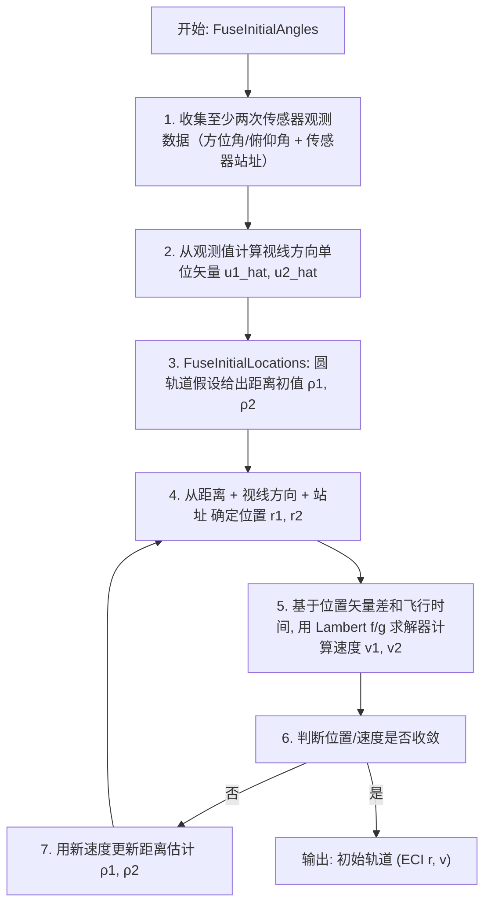

# 算法卡片 -- 仅角度初始轨道确定 (Angles-Only IOD)

> **状态**：draft
> **日期**：2026-06-11
> **索引证据**：function-index.jsonl (FuseInitialLocations, FuseInitialAngles 均为 math 标记)
> **关联文档**：space-lambert-solver-card.md, space-integrating-propagator-card.md

### 基础资料

- **算法名称**：Angles-Only Initial Orbit Determination（仅角度初始轨道确定）
- **算法所属模块**：wsf_space（空间/轨道力学模块）
- **算法功能**：从两次传感器角度测量（方位/俯仰）通过 Gauss 方法迭代求解初始轨道。核心步骤包括：（1）圆轨道假设下的几何初值估计；（2）迭代交替求解位置和速度——从距离估计确定位置，用 Lambert 求解器从位置确定速度，再用速度传播验证位置直至收敛。属于经典 Gauss 初轨确定方法的变体。

### 算法流程

该算法遵循 Gauss 初轨确定的经典框架：从两次观测出发，利用几何约束（视线方向 + 站址 + 未知距离 = 目标位置）和动力学约束（Lambert 问题：已知位置差和飞行时间求速度），通过迭代交替求解距离和速度，逐步逼近真实轨道。

### 算法变量和常量

#### 输入变量

| 变量名 | 类型 | 中文说明 | 所属函数 (Method) |
|--------|------|----------|-------------------|
| `azimuth` | double | 传感器方位测量值 (rad) | FuseInitialLocations |
| `elevation` | double | 传感器俯仰测量值 (rad) | FuseInitialLocations |
| `sensor_position` | UtVector3 | 传感器站址 ECI 位置 (m) | FuseInitialLocations |
| `measurement_data` | UtMeasurementData | 传感器测量数据结构（含时间戳、方位角、俯仰角） | FuseInitialAngles |
| `dt` | double | 两次观测之间的时间差 (s) | FuseInitialLocations |
| `mu` | double | 中心天体引力参数 (km³/s²) | ComputeLambertf_g |

#### 输出变量

| 变量名 | 类型 | 中文说明 | 所属函数 (Method) |
|--------|------|----------|-------------------|
| `r_initial` | UtVector3 | 初轨确定的 ECI 位置矢量 (m) | FuseInitialLocations |
| `v_initial` | UtVector3 | 初轨确定的 ECI 速度矢量 (m/s) | FuseInitialAngles |
| `initial_orbit` | OrbitalElements | 初始轨道六要素 | FuseInitialAngles |

#### 常量

| 常量名 | 类型 | 值 | 中文说明 | 所属函数 (Method) |
|--------|------|-----|----------|-------------------|
| `epsilon_lin` | double | 1e-8 | 位置/速度收敛容差 | FuseInitialLocations |
| `max_iterations` | int | 50 | 最大迭代次数 | FuseInitialLocations |
| `mu_earth` | double | 398600.44 km³/s² | 地球引力参数 | FuseInitialLocations |

### 关键数学公式

1. **几何约束（视线方程）**：

   设第 1 次观测：视线方向 $\hat{\mathbf{u}}_1$（由方位角 $Az$ 和俯仰角 $El$ 确定），站点位置 $\mathbf{R}_1$

   设第 2 次观测：视线方向 $\hat{\mathbf{u}}_2$，站点位置 $\mathbf{R}_2$

   目标位置由未知距离 $\rho_1, \rho_2$ 表达：

   $\mathbf{r}_1 = \mathbf{R}_1 + \rho_1 \hat{\mathbf{u}}_1$

   $\mathbf{r}_2 = \mathbf{R}_2 + \rho_2 \hat{\mathbf{u}}_2$

2. **圆轨道假设下的初始猜测（AnglesOnlyInitialGuess）**：

   假设目标在半径为 $r$ 的圆轨道上，且两次观测位于同一圆轨道面内。由几何约束：

   $|\mathbf{r}_1| = |\mathbf{r}_2| = r$

   代入视线方程得到关于 $\rho_1, \rho_2$ 的二次方程组：

   $|\mathbf{R}_1 + \rho_1 \hat{\mathbf{u}}_1|^2 = r^2$

   $|\mathbf{R}_2 + \rho_2 \hat{\mathbf{u}}_2|^2 = r^2$

   选取物理合理的根（距离为正，且位置在传感器前方）。

3. **迭代交替求解**：

   第 $k$ 次迭代：

   a. 从当前距离估计 $\rho_1^{(k)}, \rho_2^{(k)}$ 计算位置：
      $\mathbf{r}_1^{(k)} = \mathbf{R}_1 + \rho_1^{(k)} \hat{\mathbf{u}}_1$
      $\mathbf{r}_2^{(k)} = \mathbf{R}_2 + \rho_2^{(k)} \hat{\mathbf{u}}_2$

   b. 用 Lambert 求解器从 $(\mathbf{r}_1^{(k)}, \mathbf{r}_2^{(k)}, \Delta t)$ 计算速度 $\mathbf{v}_1^{(k+1)}$

   c. 用 $\mathbf{v}_1^{(k+1)}$ 通过轨道传播验证位置，更新距离估计 $\rho_1^{(k+1)}, \rho_2^{(k+1)}$

   d. 收敛条件：
      $|\mathbf{r}^{(k+1)} - \mathbf{r}^{(k)}| < \epsilon_{lin}$ 且 $|\mathbf{v}^{(k+1)} - \mathbf{v}^{(k)}| < \epsilon_{lin}$

4. **视线方向计算**：

   从传感器测量值（方位角 $Az$、俯仰角 $El$）到 ECI 系视线单位矢量：

   $\hat{\mathbf{u}} = \mathbf{T}_{sensor}^{ECI} \cdot \begin{bmatrix} \cos El \cdot \cos Az \\ \cos El \cdot \sin Az \\ \sin El \end{bmatrix}$

   其中 $\mathbf{T}_{sensor}^{ECI}$ 为传感器坐标系到 ECI 的旋转矩阵（含地球自转修正）。

### 源码位置

| File | Symbol | 中文说明 |
|------|--------|----------|
| [WsfOrbitDeterminationFusion.hpp](source_root/src/core/wsf_space/source/WsfOrbitDeterminationFusion.hpp) | `FuseInitialAngles()` | 仅角度初轨确定入口 — 收集测量数据，触发迭代求解 |
| 同上 | `FuseInitialLocations()` | 仅角度位置融合 — 迭代交替求解距离和速度 |
| 同上 | `AnglesOnlyInitialGuess()` | 圆轨道假设初值估计 |
| 同上 | `ComputeCircularLocationsAndSpeeds()` | 圆轨道几何解 — 二次方程解算距离 |

### 可移植性评分

**可移植性**：高 — 仅角度初轨确定为 Gauss 方法的变体，属于经典航天动力学算法（Vallado 第 7 章）。圆轨道初值假设和迭代交替求解均为标准方法。所有计算为纯几何和代数运算，不依赖专有传感器模型或物理引擎。

**框架依赖**：`UtMeasurementData`（传感器测量）、`WsfTrack`（航迹），可替换为自定义测量/航迹结构体。
