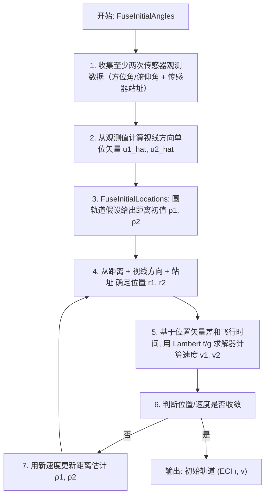

# 算法卡片 -- 仅角度初始轨道确定 (Angles-Only IOD)

> **状态**：draft
> **日期**：2026-06-11
> **索引证据**：function-index.jsonl (FuseInitialLocations, FuseInitialAngles 均为 math 标记)
> **关联文档**：space-lambert-solver-card.md, space-integrating-propagator-card.md

### 基础资料

- **算法名称**：Angles-Only Initial Orbit Determination（仅角度初始轨道确定）
- **算法所属模块**：wsf_space（空间/轨道力学模块）
- **算法功能**：从两次传感器角度测量（方位/俯仰）通过 Gauss 方法迭代求解初始轨道。核心步骤包括：（1）圆轨道假设下的几何初值估计；（2）迭代交替求解位置和速度——从距离估计确定位置，用 Lambert 求解器从位置确定速度，再用速度传播验证位置直至收敛。属于经典 Gauss 初轨确定方法的变体。

### 算法流程

该算法遵循 Gauss 初轨确定的经典框架：从两次观测出发，利用几何约束（视线方向 + 站址 + 未知距离 = 目标位置）和动力学约束（Lambert 问题：已知位置差和飞行时间求速度），通过迭代交替求解距离和速度，逐步逼近真实轨道。

### 算法变量和常量

#### 输入变量

| 变量名 | 类型 | 中文说明 | 所属函数 (Method) |
|--------|------|----------|-------------------|
| `azimuth` | double | 传感器方位测量值 (rad) | FuseInitialLocations |
| `elevation` | double | 传感器俯仰测量值 (rad) | FuseInitialLocations |
| `sensor_position` | UtVector3 | 传感器站址 ECI 位置 (m) | FuseInitialLocations |
| `measurement_data` | UtMeasurementData | 传感器测量数据结构（含时间戳、方位角、俯仰角） | FuseInitialAngles |
| `dt` | double | 两次观测之间的时间差 (s) | FuseInitialLocations |
| `mu` | double | 中心天体引力参数 (km³/s²) | ComputeLambertf_g |

#### 输出变量

| 变量名 | 类型 | 中文说明 | 所属函数 (Method) |
|--------|------|----------|-------------------|
| `r_initial` | UtVector3 | 初轨确定的 ECI 位置矢量 (m) | FuseInitialLocations |
| `v_initial` | UtVector3 | 初轨确定的 ECI 速度矢量 (m/s) | FuseInitialAngles |
| `initial_orbit` | OrbitalElements | 初始轨道六要素 | FuseInitialAngles |

#### 常量

| 常量名 | 类型 | 值 | 中文说明 | 所属函数 (Method) |
|--------|------|-----|----------|-------------------|
| `epsilon_lin` | double | 1e-8 | 位置/速度收敛容差 | FuseInitialLocations |
| `max_iterations` | int | 50 | 最大迭代次数 | FuseInitialLocations |
| `mu_earth` | double | 398600.44 km³/s² | 地球引力参数 | FuseInitialLocations |

### 关键数学公式

1. **几何约束（视线方程）**：

   设第 1 次观测：视线方向 $\hat{\mathbf{u}}_1$（由方位角 $Az$ 和俯仰角 $El$ 确定），站点位置 $\mathbf{R}_1$

   设第 2 次观测：视线方向 $\hat{\mathbf{u}}_2$，站点位置 $\mathbf{R}_2$

   目标位置由未知距离 $\rho_1, \rho_2$ 表达：

   $\mathbf{r}_1 = \mathbf{R}_1 + \rho_1 \hat{\mathbf{u}}_1$

   $\mathbf{r}_2 = \mathbf{R}_2 + \rho_2 \hat{\mathbf{u}}_2$

2. **圆轨道假设下的初始猜测（AnglesOnlyInitialGuess）**：

   假设目标在半径为 $r$ 的圆轨道上，且两次观测位于同一圆轨道面内。由几何约束：

   $|\mathbf{r}_1| = |\mathbf{r}_2| = r$

   代入视线方程得到关于 $\rho_1, \rho_2$ 的二次方程组：

   $|\mathbf{R}_1 + \rho_1 \hat{\mathbf{u}}_1|^2 = r^2$

   $|\mathbf{R}_2 + \rho_2 \hat{\mathbf{u}}_2|^2 = r^2$

   选取物理合理的根（距离为正，且位置在传感器前方）。

3. **迭代交替求解**：

   第 $k$ 次迭代：

   a. 从当前距离估计 $\rho_1^{(k)}, \rho_2^{(k)}$ 计算位置：
      $\mathbf{r}_1^{(k)} = \mathbf{R}_1 + \rho_1^{(k)} \hat{\mathbf{u}}_1$
      $\mathbf{r}_2^{(k)} = \mathbf{R}_2 + \rho_2^{(k)} \hat{\mathbf{u}}_2$

   b. 用 Lambert 求解器从 $(\mathbf{r}_1^{(k)}, \mathbf{r}_2^{(k)}, \Delta t)$ 计算速度 $\mathbf{v}_1^{(k+1)}$

   c. 用 $\mathbf{v}_1^{(k+1)}$ 通过轨道传播验证位置，更新距离估计 $\rho_1^{(k+1)}, \rho_2^{(k+1)}$

   d. 收敛条件：
      $|\mathbf{r}^{(k+1)} - \mathbf{r}^{(k)}| < \epsilon_{lin}$ 且 $|\mathbf{v}^{(k+1)} - \mathbf{v}^{(k)}| < \epsilon_{lin}$

4. **视线方向计算**：

   从传感器测量值（方位角 $Az$、俯仰角 $El$）到 ECI 系视线单位矢量：

   $\hat{\mathbf{u}} = \mathbf{T}_{sensor}^{ECI} \cdot \begin{bmatrix} \cos El \cdot \cos Az \\ \cos El \cdot \sin Az \\ \sin El \end{bmatrix}$

   其中 $\mathbf{T}_{sensor}^{ECI}$ 为传感器坐标系到 ECI 的旋转矩阵（含地球自转修正）。

### 内部状态

仅角度 IOD 的所有计算由 `WsfOrbitDeterminationFusion` 类的成员方法完成，无独立的内部状态类。该方法集复用其宿主类的全部跨帧持久化状态（见 Lambert 卡片）并额外依赖以下状态：

| 成员变量 | 类型 | 初始值 | 物理含义 | 更新时机 |
|----------|------|--------|----------|----------|
| `mNumberOfAnglesMeasurementsNeeded` | unsigned | `5` | 触发仅角度 IOD 所需累积的最小方位-俯仰测量数量。在 `GetFusionCandidates` 中以 `aGetAnglesCandidates=true` 模式收集候选时，达到此数量即停止收集 | 场景加载时通过 `number_of_angle_measurements` 命令配置，必须 >= 3 |
| `mAnglesOnlyMaxIterations` | unsigned | `200` | `AnglesOnlyKinematicSolution` 主循环的最大迭代次数 | 场景加载时通过 `angles_only_maximum_iterations` 命令配置 |
| `mAnglesOnlyLinearTolerance` | double | `10.0` (米) | 距离向量收敛判据：当连续两次迭代的最大距离变化 `maxDeltaRho <= mAnglesOnlyLinearTolerance` 时认为收敛 | 场景加载时通过 `angles_only_linear_tolerance` 命令配置，单位为长度 |
| `mRangeErrorFactor` | double | `0.05` | 用于仅角度跟踪时构造伪距离误差的缩放因子：`rangeError = range * mRangeErrorFactor`。在 `UpdateLocalTrackFromNonLocalTrack` 中，当仅有方位俯仰数据时，用此误差构建伪距离测量的协方差矩阵 | 场景加载时通过 `range_error_factor` 命令配置，合法范围 \[1e-7, 0.5\] |
| `mLambertConvergenceTolerance` | double | `1e-12` | 传递给 `UtLambertProblem::Universal()` 的 Lambert 收敛容差 | Lambert Universal 调用时读取 |
| `mDebug` | bool | `false` | 调试开关。开启后在 `AnglesOnlyKinematicSolution` 中逐测量打印方位、距离、位置、速度；在 `FuseInitialAngles` 中打印目标真值位置/速度；在 `AnglesOnlyInitialGuess` 中打印最大迭代警告 | 场景加载时通过 `debug` 命令开关 |

### 变量映射表

仅角度 IOD 核心数值计算（`AnglesOnlyKinematicSolution`，cpp 第 555-802 行，基于 Karimi & Mortari 2011 论文）：

| 代码变量 | 数学符号 | 含义 |
|----------|----------|------|
| `targetVec[i]` | $\hat{\mathbf{u}}_i$ | 第 i 次观测的视线方向单位矢量（从站点指向目标） |
| `siteLoc[i]` | $\mathbf{R}_i$ | 第 i 次观测的传感器站点 ECI 位置 |
| `rhoVec(i)` | $\rho_i$ | 第 i 次观测的目标距离（待求解未知量之一） |
| `aLocECI[i]` | $\mathbf{r}_i$ | 第 i 次观测时刻的目标 ECI 位置 |
| `aVelECI[i]` | $\mathbf{v}_i$ | 第 i 次观测时刻的目标 ECI 速度 |
| `c[j]`, `d[j]` | $c_k, d_k$ | Gauss f/g 系数组合（论文等式 4）：$c_k = g_{k+1}/(f_k g_{k+1} - f_{k+1} g_k)$, $d_k = -g_k/(f_k g_{k+1} - f_{k+1} g_k)$ |
| `M` | $\mathbf{M}$ | 测量矩阵（论文等式 19），尺寸 $3(n-2) \times n$ |
| `psi` | $\boldsymbol{\psi}$ | 观测残差向量（论文等式 19-20） |
| `fkm1`, `gkm1` | $f_{k-1}, g_{k-1}$ | 从第 k 个测量向第 k-1 个测量反向传播的 f/g 系数（`-delTm` 负时间） |
| `fkp1`, `gkp1` | $f_{k+1}, g_{k+1}$ | 从第 k 个测量向第 k+1 个测量正向传播的 f/g 系数 |
| `delTm` / `delTp` | $-\Delta t_m, +\Delta t_p$ | 第 k 个测量到前后相邻测量的时间差 |
| `maxDeltaRho` | $\max|\Delta\rho_i|$ | 本次迭代的最大距离变化绝对值 |
| `maxDeltaRhoPercent` | $\max(|\Delta\rho_i| / \rho_i)$ | 最大距离变化百分比 |
| `deltaRhoVecScale` | $\alpha$ | 发散时从已知最优解向当前解方向步进的比例因子 |

`AnglesOnlyInitialGuess`（cpp 第 415-546 行）中的关键变量：

| 代码变量 | 数学符号 | 含义 |
|----------|----------|------|
| `radius` | $r$ | 当前假设的圆轨道半径（地心到目标距离） |
| `geometricalSpeed` | $v_{geo}$ | 由几何关系推算的轨道速度：$v_{geo} = \theta \cdot r / \Delta t$，其中 $\theta$ 为两次观测位置的夹角 |
| `gravitationalSpeed` | $v_{grav}$ | 由引力关系推算的圆轨道速度：$v_{grav} = \sqrt{\mu / r}$ |
| `deltaSpeed` | $\Delta v = v_{grav} - v_{geo}$ | 引力速度与几何速度之差。负值表示假设轨道太近（需向外）；正值表示假设太远（需向内） |
| `cSPEED_TOLERANCE` | $10 \, \text{m/s}$ | 速度差收敛容差。`|deltaSpeed| < 10` 时认为找到解 |
| `cMIN_RADIUS` | 地球半径 + 30 km | 搜索空间下限（大气层外） |
| `cMAX_RADIUS` | 200,000 km | 搜索空间上限（远超地球同步轨道） |

### 边界条件

1. **数值稳定性保护**：
   - `ComputeRange()` 中 `asin(siteRadius * sinSigma / aRadius)` 的参数通过 `std::max(-1.0, std::min(1.0, ...))` 限幅，防止浮点舍入导致定义域溢出
   - `AnglesOnlyKinematicSolution` 中通过 `PseudoInvert(M)` 而非正规方程 $(M^T M)^{-1} M^T \psi$ 求解——伪逆使用 SVD，对接近奇异的测量矩阵更稳定
   - 当迭代解出现发散（当前距离变化百分比大于历史最小百分比），自动回退到最佳已知解（`bestRhoVec`），并以增量搜索逐步向当前解方向试探（加权因子从 0.1 逐步增至 1.0，细粒度从 0.1 至 0.01）

2. **无效输入处理**：
   - `AnglesOnlyInitialGuess` 中 `dt <= 0.0` 直接返回 `false`（cpp 第 535-537 行）
   - 初始猜测首次迭代时如果 `deltaSpeed < 0` 且起始于最小半径，自动切换到最大半径重试（cpp 第 462-477 行）——处理目标在高轨而初始假设低轨导致符号错误的情况
   - `FuseInitialAngles` 中如果航迹上已有传播器（`AttributeExists("propagator")`），跳过 IOD（cpp 第 1197 行），避免重复初始化
   - 观测候选收集（`GetFusionCandidates`）中，同一时间戳的重复测量被随机交换排序以避免传感器偏好；相邻测量时间差需 >= 0.01s 才被采纳

3. **限幅阈值**：
   - 初始猜测半径搜索：下界 `cMIN_RADIUS`（地球半径 + 30km），上界 `cMAX_RADIUS`（200,000km），步长 `2 * (max-min) / 200`
   - 速度收敛容差：`cSPEED_TOLERANCE = 10.0` m/s（初始猜测阶段）
   - 距离收敛容差：`mAnglesOnlyLinearTolerance = 10.0` m（运动学求解阶段）
   - 最大迭代次数：初始猜测 200 次，运动学求解 `mAnglesOnlyMaxIterations`（默认 200）次
   - 距离变化百分比阈值：`cDELTA_RHO_PERCENT_THRESHOLD = 0.05`，超过此值时对解做阻尼平均（与上一次迭代结果取平均）以抑制大振荡
   - 双曲轨道检查：`cMAX_ECCENTRICITY = 0.9`（cpp 第 66 行，用于限制传播器初始化的轨道偏心率上限）

4. **回退行为**：
   - Lambert 求解失败时：回退到圆轨道近似速度（``ComputeVelocities`` 中 cpp 第 825-833 行）——方向取两位置差，速度大小 $v = \sqrt{\mu/r}$
   - 运动学解发散时：从 `bestRhoVec`（历史最优解）出发，沿发散方向逐步增大步长试探，若走到 100% 仍无效则以 10 倍更细粒度重新搜索（cpp 第 762-775 行）
   - IOD 整体失败时：不对航迹附加传播器和 Kalman 滤波器，转而执行直接替换（`aLocalTrack.ReplacementUpdate(aNonLocalTrack)`）

### 提取策略

**源文件与提取方式**：

| 源文件 | 提取内容 | 提取方式 |
|--------|----------|----------|
| `WsfOrbitDeterminationFusion.hpp` | 类成员变量声明（`mNumberOfAnglesMeasurementsNeeded`, `mAnglesOnlyMaxIterations`, `mAnglesOnlyLinearTolerance`, `mRangeErrorFactor`, `mLambertConvergenceTolerance`, `mDebug`），`AnglesOnlyInitialGuess()` 等私有函数签名 | 直接解析头文件 `private:` 块，提取成员变量类型与默认值（在 cpp 构造函数中赋值）；提取所有 `private` 方法签名 |
| `WsfOrbitDeterminationFusion.cpp` | `AnglesOnlyKinematicSolution`（第 555-802 行）的完整迭代逻辑：包括 Gauss f/g 系数计算（`c[j]`, `d[j]`）、测量矩阵 `M` 与残差 `psi` 构建、伪逆求解距离向量、收敛/发散检测与阻尼/回溯机制 | 分析方法体代码，对照注释中的论文引用（Karimi & Mortari 2011）定位公式出处；提取局部常量 `cDELTA_RHO_PERCENT_THRESHOLD`（0.05）、`cINITIAL_DELTA_RHO_VEC_SCALE_INCREMENT`（0.1）等 |
| 同上 | `AnglesOnlyInitialGuess`（第 415-546 行）的半径二分搜索逻辑：几何速度 vs 引力速度的比较、过渡检测、二分与线性步进的切换 | 分析方法体代码，提取搜索常数 `cMIN_RADIUS`（地球半径+30km）、`cMAX_RADIUS`（200000km）、`cMAX_ITERATIONS`（200）、`cSPEED_TOLERANCE`（10 m/s） |
| 同上 | `ConvertBearingElevation`（第 930-961 行）的方位俯仰到 ECI 视线矢量的转换流程：NED 矢量构造、WCS 目标点计算、传感器到 ECI 旋转 | 提取 NED 分量公式 `[cosB*cosE, sinB*cosE, -sinE]`，以及 WCS 到 ECI 的坐标转换调用链 |
| 同上 | `FuseInitialAngles`（第 1187-1289 行）和 `FuseInitialLocations`（第 1072-1179 行）的整合流程：候选收集 → 解算 → 传播器创建与初始化 → 卡尔曼滤波器装配 | 分析调用链，识别 `AddPropagator` → `CreateFilterOnTrack` → 坐标回写航迹的完整路径 |
| `function-index.jsonl` | `FuseInitialAngles`（line 3441）、`FuseInitialLocations`（line 3442）、`AnglesOnlyKinematicSolution` 相关调用链 | 搜索 `FuseInitial`, `AnglesOnly` 关键词获取函数名、参数签名、生命周期角色 |

**提取依赖关系**：
- 核心数学（Gauss f/g 系数组合、测量矩阵构建、最小二乘伪逆求解）可独立提取，不依赖 AFSIM 框架
- 坐标转换部分（`ConvertBearingElevation`）依赖 `UtECI_Conversion` 和 `UtEllipsoidalEarth`，移植时可用标准天文坐标转换（ECI-ECEF-LLA-NED 链）替代
- 传播器初始化和滤波器装配属于框架胶水层，移植时可用自定义轨道传播器和状态估计器替代

### 源码位置

| File | Symbol | 中文说明 |
|------|--------|----------|
| [WsfOrbitDeterminationFusion.hpp](source_root/src/core/wsf_space/source/WsfOrbitDeterminationFusion.hpp) | `FuseInitialAngles()` | 仅角度初轨确定入口 — 收集测量数据，触发迭代求解 |
| 同上 | `FuseInitialLocations()` | 仅角度位置融合 — 迭代交替求解距离和速度 |
| 同上 | `AnglesOnlyInitialGuess()` | 圆轨道假设初值估计 |
| 同上 | `ComputeCircularLocationsAndSpeeds()` | 圆轨道几何解 — 二次方程解算距离 |

### 可移植性评分

**可移植性**：高 — 仅角度初轨确定为 Gauss 方法的变体，属于经典航天动力学算法（Vallado 第 7 章）。圆轨道初值假设和迭代交替求解均为标准方法。所有计算为纯几何和代数运算，不依赖专有传感器模型或物理引擎。

**框架依赖**：`UtMeasurementData`（传感器测量）、`WsfTrack`（航迹），可替换为自定义测量/航迹结构体。
