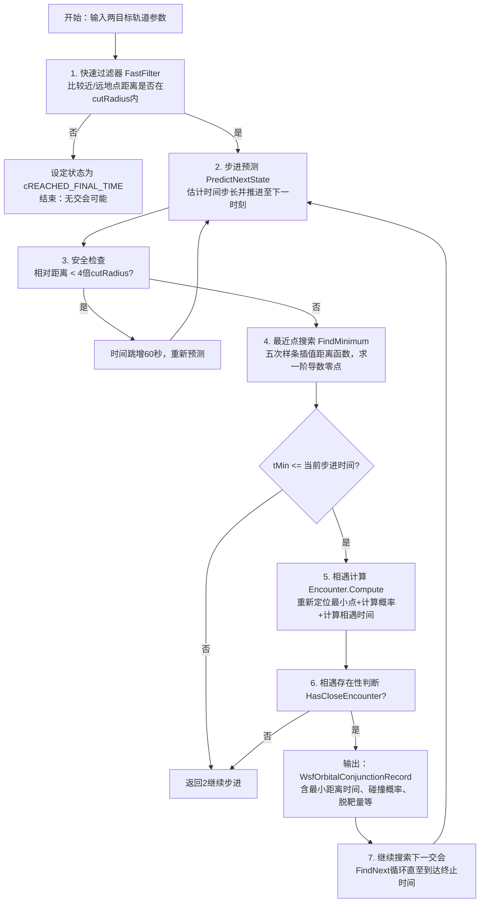

# 算法卡片 — 轨道交会判别

> **状态**：draft
> **日期**：2026-06-11
> **索引证据**：function-index.jsonl (DetectConjunction 为 math 标记)
> **关联文档**：space-libration-point-card.md

### 基础资料

- **算法名称**：Orbital Conjunction Assessment（轨道交会判别算法）
- **算法所属模块**：wsf_space（空间/轨道力学模块）
- **算法功能**：对两个空间目标（主目标、次目标）的轨道进行交会判别分析。算法包含五级逐层筛选：第一级为近地点/远地点距离快速过滤器（FastFilter），快速排除不可能相交的轨道对；第二级为基于平近点角步长的状态预测与步进（PredictNextState），按时间步长前进的同时确保两目标间距超出安全阈值；第三级为最近点搜索（FindMinimum），使用距离函数的五次样条插值及其一阶导数求解极小值点；第四级为相遇时刻计算（ComputeEncounterTimes），通过协方差椭球函数的三次样条插值求根确定进入和离开危险区的时刻；第五级为碰撞概率计算（ComputeProbability），基于 Vallado 解析公式估计最大碰撞概率。此外，算法在相遇时刻计算阶段使用根收缩算法（ContractTowardRoot）收紧时间区间边界，缩短插值范围。

### 算法流程

整个算法流程图如下：



其中，第一步快速过滤器利用轨道拱点极值进行粗筛，若两个轨道的近地点-远地点区间无重叠（差距超出 cutRadius），直接判定无交会可能；第二步按平近点角步长（StepRadians）估计时间步长推进；第三步在相邻两预测时刻间构造五次样条插值多项式描述平方距离函数，求其导数的根以定位极小点；第五步使用 Vallado 公式和协方差椭球精确计算碰撞概率及相遇起止时间。

### 算法变量和常量

#### 输入变量（Input）

| 英文标识符(Symbol) | 中文名称(Name) | 数据类型(Type) | 含义(Meaning) | 单位(Units) | 所属函数(Method) |
| ---- | ---- | ---- | --- | ---- | --- |
| aPrimary | 主目标航迹 | WsfLocalTrack& | 需要进行交会分析的主航天器航迹对象 | — | DetectConjunction |
| aPrimarySize | 主目标尺寸 | double | 主目标的等效半径（可用于计算组合半径） | m | DetectConjunction |
| aSecondary | 次目标航迹 | WsfLocalTrack& | 潜在的次要交会目标航迹对象 | — | DetectConjunction |
| aSecondarySize | 次目标尺寸 | double | 次目标的等效半径 | m | DetectConjunction |
| aOptions | 评估选项 | Options& | 包含 cutRadius、stepRadians、exclusionFactor 等参数的结构体 | — | DetectConjunction |
| aPropPtr | 轨道外推器原型 | UtOrbitalPropagatorBase* | 用于复制后独立外推每个目标轨道的传播器 | — | DetectConjunction |
| mOptions.mCutRadius | 快速过滤距离阈值 | double | 近地点/远地点距离差的上限，超出则直接排除 | m | DetectConjunction |
| mOptions.mStepRadians | 搜索步长角 | double | 用于估计时间步长的平近点角增量，默认 PI/60（3 度） | rad | DetectConjunction |
| mOptions.mExclusionFactor | 排除区缩放因子 | double | 协方差椭球尺寸的缩放系数，默认 8.0 | — | DetectConjunction |
| mOptions.mInitialSearchTime | 搜索起始时间 | double | 交会分析的起始仿真时间 | s | DetectConjunction |
| mOptions.mFinalSearchTime | 搜索终止时间 | double | 交会分析的结束仿真时间 | s | DetectConjunction |
| mOptions.mDefaultObjectRadius | 默认目标半径 | double | 当目标未提供尺寸时使用的默认半径，默认 1.0 | m | DetectConjunction |
| mOptions.mDefaultVariance | 默认位置方差 | double | 当无航迹滤波器时使用的默认位置方差，默认 10.0 | m | DetectConjunction |
| aCurr.mTime | 当前时刻 | double | 当前预测状态的仿真时间 | s | Encounter.Compute |
| aNext.mTime | 下一时刻 | double | 下一步进预测状态的仿真时间 | s | Encounter.Compute |
| aCombinedRadius | 组合目标半径 | double | 两目标尺寸之和 | m | Encounter.Compute |
| aCombinedCovariance | 组合协方差矩阵 | UtCovariance& | 两目标位置协方差之和，用于椭球函数构造 | m^2 | Encounter.Compute |
| aScaleFactor | 缩放因子 | double | 对组合协方差矩阵的额外缩放系数 | — | Encounter.Compute |

#### 输出变量（Output）

| 英文标识符(Symbol) | 中文名称(Name) | 数据类型(Type) | 含义(Meaning) | 单位(Units) | 所属函数(Method) |
| ---- | ---- | ---- | --- | ---- | --- |
| mRecord.mMinTime | 最近点时间 | double | 两个目标距离最近的仿真时刻，由黄金分割搜索精确定位 | s | DetectConjunction |
| mRecord.mStartTime | 相遇开始时间 | double | 两目标进入协方差椭球危险区的时间 | s | DetectConjunction |
| mRecord.mEndTime | 相遇结束时间 | double | 两目标离开协方差椭球危险区的时间 | s | DetectConjunction |
| mRecord.mMaxProbability | 最大碰撞概率 | double | 最坏情况下的碰撞概率估计值，0~1 | — | DetectConjunction |
| mRecord.mMissDistance | 脱靶量/最近距离 | double | 在最近点时刻两目标的相对距离 | m | DetectConjunction |
| mRecord.mRelativeVelocity | 相对速度 | double | 在最近点时刻两目标的相对速度大小 | m/s | DetectConjunction |
| mRecord.mPrimary | 主目标标识 | std::string | 主目标的名称字符串 | — | DetectConjunction |
| mRecord.mSecondary | 次目标标识 | std::string | 次目标的名称字符串 | — | DetectConjunction |
| retval（FindMinimum） | 最小点时间 | double | 在相邻两预测时刻间距离函数取得极小值的时刻 | s | DetectConjunction |

#### 常量（Constant）

| 英文标识符(Symbol) | 中文名称(Name) | 数据类型(Type) | 含义(Meaning) | 单位(Units) | 所属函数(Method) |
| ---- | ---- | ---- | --- | ---- | --- |
| — | 安全距离倍数 | const | PredictNextState 中使用 4.0 倍 cutRadius 作为安全距离阈值 | — | DetectConjunction |
| — | 安全跳步时间 | const | PredictNextState 中当距离过近时跳增 60 秒后再检查 | s | DetectConjunction |
| — | 黄金分割搜索容差 | const | RecomputeMinTime 中使用 1.0e-6 作为收敛容差 | m | DetectConjunction |

### 关键数学公式

1. **距离函数及其导数**（用于最近点搜索）：
   以两目标相对位置矢量定义平方距离函数 $D(t) = \mathbf{r}_{\text{rel}} \cdot \mathbf{r}_{\text{rel}}$，及其一阶、二阶导数：
   $$D(t) = \|\mathbf{r}_s(t) - \mathbf{r}_p(t)\|^2$$
   $$D'(t) = 2 \mathbf{v}_{\text{rel}}(t) \cdot \mathbf{r}_{\text{rel}}(t)$$
   $$D''(t) = 2\|\mathbf{v}_{\text{rel}}(t)\|^2 + 2 \mathbf{a}_{\text{rel}}(t) \cdot \mathbf{r}_{\text{rel}}(t)$$
   其中：
   - $\mathbf{r}_{\text{rel}} = \mathbf{r}_s - \mathbf{r}_p$ 表示次目标相对于主目标的位置矢量，单位为 m。
   - $\mathbf{v}_{\text{rel}} = \mathbf{v}_s - \mathbf{v}_p$ 表示相对速度，单位为 m/s。
   - $\mathbf{a}_{\text{rel}} = \mathbf{a}_s - \mathbf{a}_p$ 表示相对加速度，单位为 m/s^2。
   - $D'(t)$ 的零点对应距离函数的驻点，$D''(t) > 0$ 时该驻点为极小值点。

2. **五次样条插值**（用于描述距离函数在相邻预测时刻间的变化）：
   在相邻两时刻 $t_1, t_2$ 之间构造五次多项式 $f(t)$，使其满足：
   $$f(t_1) = D(t_1), \quad f'(t_1) = D'(t_1), \quad f''(t_1) = D''(t_1)$$
   $$f(t_2) = D(t_2), \quad f'(t_2) = D'(t_2), \quad f''(t_2) = D''(t_2)$$
   通过求解 $f'(t)=0$ 得到区间内的极小值点时间 $t_{\min}$。这是一种**施图姆-刘维尔型极值搜索**：在六阶光滑（五次多项式保证 C2 连续）下精确捕获极小值位置。

3. **碰撞概率（Vallado 解析公式）**：
   基于 Vallado (11-56)，当脱靶量 $d_m$ 大于组合半径 $R_{\text{comb}}$ 时：
   $$\text{令 } r_s = \frac{R_{\text{comb}}}{d_m} < 1$$
   $$s = \sqrt{-\ln\left(\frac{1 - r_s}{1 + r_s}\right)}$$
   $$P_{\max} = \frac{1}{2}\left[\text{erf}\left((r_s + 1) \cdot \frac{s}{2\sqrt{r_s}}\right) + \text{erf}\left((r_s - 1) \cdot \frac{s}{2\sqrt{r_s}}\right)\right]$$
   其中：
   - $R_{\text{comb}} = R_p + R_s$ 是两目标等效半径之和（m）。
   - $d_m$ 是两目标在最近点的脱靶距离（m）。
   - $\text{erf}(x) = \frac{2}{\sqrt{\pi}}\int_0^x e^{-t^2}dt$ 是误差函数。
   - 若 $r_s \ge 1$（脱靶量小于等于组合半径），直接取 $P_{\max} = 1.0$。

4. **协方差椭球函数**（用于确定相遇起止时间）：
   以组合协方差矩阵的逆 $\Sigma^{-1}$ 定义椭球函数：
   $$F(t) = \mathbf{s}(t)^T \Sigma^{-1} \mathbf{s}(t) - 1$$
   其中：
   - $\mathbf{s}(t)$ 为相对位置矢量（仅取位置分量，速度分量设为 0 即被投影掉）。
   - $\Sigma^{-1}$ 为组合协方差矩阵的逆，定义了危险椭球形状。
   - $F(t) = 0$ 表示相对位置恰好位于椭球表面，$F(t) < 0$ 表示在椭球内部（危险区）。
   - 对 $F(t)$ 进行三次样条插值后求根，零点即为相遇进入和离开时间。

5. **根收缩算法 (ContractTowardRoot)**：
   向固定点 $t_{\text{fixed}}$ 方向收缩搜索区间边界 $t_{\text{limit}}$：
   $$\delta \leftarrow \frac{t_{\text{limit}} - t_{\text{fixed}}}{2}$$
   $$t_{\text{test}} \leftarrow t_{\text{fixed}} + \delta$$
   $$\text{当 } f(t_{\text{test}}) > 0 \text{ 时，反复 } \delta \leftarrow \frac{\delta}{2},\; t_{\text{test}} \leftarrow t_{\text{fixed}} + \delta$$
   $$\text{返回 } t_{\text{test}} + 2\delta$$
   该算法确保 $f(t_{\text{fixed}}) < 0$（最小值在椭球内），而返回的边界点处 $f$ 接近但不超过 0，有效地为椭球函数插值缩小了区间范围。

6. **时间步长估计**（基于轨道运动学）：
   使用瞬时平近点角变化率估计推进给定弧度所需时间：
   $$\Delta t \approx \frac{r^2 \cdot \Delta\theta}{n \cdot a^2 \cdot \sqrt{1 - e^2}}$$
   其中：
   - $r^2$ 为轨道半径平方（m^2）。
   - $\Delta\theta$ 为步长角（rad），默认取 $\pi/60$（即 3 度步长）。
   - $n$ 为平运动角速率（rad/s）。
   - $a$ 为轨道半长轴（m）。
   - $e$ 为轨道离心率。

### 算法伪代码

```
// ========== 轨道交会判别主算法 ==========
// 算法目标：在给定的时间区间内逐个发现两个空间目标之间的交会事件
// 调用上下文：由 WsfOrbitalConjunctionProcessor::Update() 定期调用

function DetectConjunction(primaryTrack, secondaryTrack, options, propPtr):
    // 第一步：初始化两目标的轨道外推器，设置初始搜索时间
    mPrimary ← Object(primaryTrack, primarySize, propPtr)
    // 构建次目标对象，含轨道外推器克隆
    mSecondary ← Object(secondaryTrack, secondarySize, propPtr)
    mOptions ← options    // 保存评估选项参数

    // 第二步：在初始搜索时刻外推两目标的运动状态
    mNext.mTime ← mOptions.mInitialSearchTime        // 初始化搜索时间
    mNext.mPrimary ← mPrimary.Propagate(mNext.mTime) // 主目标状态外推
    mNext.mSecondary ← mSecondary.Propagate(mNext.mTime) // 次目标状态外推
    mCurrent ← mNext    // 初始化当前状态与下一状态相同

    // 第三步：快速过滤器 —— 检查轨道拱点是否在 cutRadius 范围内
    if not FastFilter():
        mStatus ← cREACHED_FINAL_TIME    // 轨道拱点无重叠，直接终止
        return false
    // 否则继续搜索
    return true

function FindNext():
    // 循环搜索直至找到下一个交会事件或到达终止时间
    mStatus ← cNO_CONJUNCTION
    mEncounter.Reset()    // 重置相遇记录

    while mStatus == cNO_CONJUNCTION:
        if mNext.mTime < mOptions.mFinalSearchTime:    // 尚未达到搜索终止时间
            mCurrent ← mNext    // 推进当前状态

            PredictNextState()  // 步进：按轨道角步长推进至下一时刻
            // 同时在推进过程中检查相对距离是否超过 4 倍 cutRadius 安全阈值

            tMin ← FindMinimum()    // 在 mCurrent 与 mNext 之间搜索距离极小值点
            if tMin <= mNext.mTime:    // 极小值发生在当前搜索区间内
                combinedRadius ← mPrimary.Size() + mSecondary.Size()
                // 计算组合协方差（两目标位置协方差之和）
                combinedCovariance ← mPrimary.Covariance(tMin) + mSecondary.Covariance(tMin)
                // 执行完整的相遇计算
                mEncounter.Compute(mCurrent, mNext, combinedRadius,
                                   combinedCovariance, mOptions.mExclusionFactor)
                if mEncounter.HasCloseEncounter():    // 存在有效交会
                    mStatus ← cCONJUNCTION_FOUND
        else:
            mStatus ← cREACHED_FINAL_TIME    // 达到终止时间，停止搜索
    return mStatus

// ========== 快速过滤器 ==========
function FastFilter():
    rPeriMax ← max(mPrimary.Periapsis(), mSecondary.Periapsis())  // 取两目标近地点最大值
    rApoMin ← min(mPrimary.Apoapsis(), mSecondary.Apoapsis())     // 取两目标远地点最小值
    // 若近地点最大值与远地点最小值之差超过 cutRadius，则两轨道不可能相交
    return (rPeriMax - rApoMin) <= mOptions.mCutRadius

// ========== 预测下一状态 ==========
function PredictNextState():
    mNext.mTime ← mNext.mTime + ComputeNextTime()  // 按轨道角步长估计下一时刻
    mNext.mPrimary ← mPrimary.Propagate(mNext.mTime)   // 外推主目标至新时刻
    mNext.mSecondary ← mSecondary.Propagate(mNext.mTime) // 外推次目标至新时刻

    // 安全检查：若相对距离小于 4 倍 cutRadius，大步跳进直到相隔足够远
    while mNext.RelativePosition().Magnitude() < 4.0 * mOptions.mCutRadius:
        mNext.mTime ← mNext.mTime + 60.0    // 每次跳进 60 秒
        mNext.mPrimary ← mPrimary.Propagate(mNext.mTime)   // 重新外推
        mNext.mSecondary ← mSecondary.Propagate(mNext.mTime)

// ========== 最近点搜索（极小值搜索） ==========
function FindMinimum():
    // 计算当前时刻距离函数的函数值、一阶和二阶导数
    dInit ← mCurrent.DistanceFunction()       // D(t_curr) = |r_rel|^2
    dDotInit ← mCurrent.DistanceFunctionPrime()   // D'(t_curr) = 2 * v_rel · r_rel
    dDotDotInit ← mCurrent.DistanceFunctionPrimePrime() // D''(t_curr)
    // 计算下一时刻距离函数的函数值、一阶和二阶导数
    dFini ← mNext.DistanceFunction()
    dDotFini ← mNext.DistanceFunctionPrime()
    dDotDotFini ← mNext.DistanceFunctionPrimePrime()

    // 构造五次样条插值多项式 f(t)，使在两端点匹配 D, D', D'' 六个条件
    f ← UtQuinticSpline.TwoPoint(mCurrent.mTime, dInit, dDotInit, dDotDotInit,
                                  mNext.mTime, dFini, dDotFini, dDotDotFini)
    fPrime ← f.Derivative()    // 求一阶导数 f'(t)
    zeros ← fPrime.Zeros(mCurrent.mTime, mNext.mTime)  // 求 f'(t) = 0 的所有根

    retval ← +∞    // 初始设为最大值
    if zeros not empty:
        fPrimePrime ← fPrime.Derivative()    // 求二阶导数 f''(t)
        for each time in zeros:
            if fPrimePrime(time) > 0.0:    // 二阶导数为正才是极小值（非极大值）
                retval ← time    // 记录最小极值点时刻
    return retval

// ========== 相遇计算 ==========
function Encounter.Compute(aCurr, aNext, aCombinedRadius, aCombinedCovariance, aScaleFactor):
    // 第一步：以相对位置构造五次样条路径，描述两目标间的相对轨迹
    path ← UtQuinticSpline.TwoPoint(aCurr.mTime, aCurr.RelativePosition(),
                                     aCurr.RelativeVelocity(), aCurr.RelativeAcceleration(),
                                     aNext.mTime, aNext.RelativePosition(),
                                     aNext.RelativeVelocity(), aNext.RelativeAcceleration())

    // 第二步：黄金分割搜索精确定位最小距离点
    mRecord.mMinTime ← RecomputeMinTime(path, aCurr.mTime, aNext.mTime)
    // 第三步：计算脱靶量（最小距离时的轨迹插值位置的模）
    mRecord.mMissDistance ← path(mRecord.mMinTime).Magnitude()
    // 第四步：计算最小距离点的相对速度
    mRecord.mRelativeVelocity ← path.Derivative()(mRecord.mMinTime).Magnitude()

    ComputeProbability(path, aCombinedRadius)    // 计算碰撞概率

    // 第五步：缩放协方差矩阵后计算相遇起止时间
    scaledCovariance ← aCombinedCovariance * aScaleFactor * aScaleFactor
    ComputeEncounterTimes(path, aCurr.mTime, aNext.mTime, mRecord.mMinTime, scaledCovariance)

// ========== 碰撞概率计算（Vallado 解析法） ==========
function ComputeProbability(aPath, aCombinedRadius):
    rScaled ← aCombinedRadius / mRecord.mMissDistance  // 半径与脱靶量之比
    if rScaled < 1.0:    // 脱靶量大于组合半径，使用 Vallado 公式
        sqrtarg ← -ln((1.0 - rScaled) / (1.0 + rScaled))  // 对数参数
        sfactor ← sqrt(sqrtarg)    // s 因子
        erfarg ← sfactor / (2.0 * sqrt(rScaled))  // 误差函数参数
        // Vallado (11-56): 两个误差函数的平均值
        mRecord.mMaxProbability ← 0.5 * (ErrorFunction((rScaled + 1.0) * erfarg)
                                        + ErrorFunction((rScaled - 1.0) * erfarg))
    else:    // 脱靶量 <= 组合半径，必然碰撞
        mRecord.mMaxProbability ← 1.0

// ========== 相遇时刻计算（协方差椭球求交） ==========
function ComputeEncounterTimes(aPath, aCurrTime, aNextTime, aMinTime, aCombinedCovariance):
    covarX ← aCombinedCovariance(0,0)  // X 方向协方差
    covarY ← aCombinedCovariance(1,1)  // Y 方向协方差
    covarZ ← aCombinedCovariance(2,2)  // Z 方向协方差
    aCombinedCovariance.Invert()  // 求逆得到椭球矩阵

    // 定义椭球函数 F(t) = s(t)^T * Σ^{-1} * s(t) - 1
    // s(t) 为相对位置矢量，注意速度分量被投影为零
    ellipsoidalFunction(t) ← [s(t)^T * Σ^{-1} * s(t)](0,0) - 1.0

    // 根收缩：将搜索区间的两端向最小值点收紧，缩小插值范围
    aCurrTime ← ContractTowardRoot(ellipsoidalFunction, mRecord.mMinTime, aCurrTime)
    aNextTime ← ContractTowardRoot(ellipsoidalFunction, mRecord.mMinTime, aNextTime)

    // 构造四个插值点用于三次样条拟合椭球函数
    if mRecord.mMinTime > (aCurrTime + aNextTime) / 2.0:
        thirdTime ← (mRecord.mMinTime + aCurrTime) / 2.0
        fourthTime ← mRecord.mMinTime
    else:
        thirdTime ← mRecord.mMinTime
        fourthTime ← (mRecord.mMinTime + aNextTime) / 2.0

    // 三次样条插值后求解 F(t) = 0 的根
    ellipsoidInterp ← UtCubicSpline.FourPoint(aCurrTime, F(aCurrTime),
                                               thirdTime, F(thirdTime),
                                               fourthTime, F(fourthTime),
                                               aNextTime, F(aNextTime))
    zeros ← ellipsoidInterp.Zeros(aCurrTime, aNextTime)

    switch zeros.size():
        case 0:    // 无零点：可能全在椭球内或全在椭球外
            minSeparation ← aPath(aMinTime)
            // 检查最小距离点是否在各个分量上均小于协方差标准差
            if minSeparation[0]^2 <= covarX and minSeparation[1]^2 <= covarY
               and minSeparation[2]^2 <= covarZ:
                mRecord.mStartTime ← aCurrTime  // 整段时间都在椭球内
                mRecord.mEndTime ← aNextTime
            else:
                mRecord.mStartTime ← +∞    // 不相交，标记为无效区间
                mRecord.mEndTime ← -∞
        case 1:    // 单个零点：以最小值点为对称中心反射构造另一零点
            if zeros[0] - mRecord.mMinTime > 0:
                mRecord.mEndTime ← zeros[0]
                mRecord.mStartTime ← mRecord.mMinTime - (zeros[0] - mRecord.mMinTime)
            else:
                mRecord.mStartTime ← zeros[0]
                mRecord.mEndTime ← mRecord.mMinTime - (zeros[0] - mRecord.mMinTime)
        case 2:    // 两个零点：由导数值符号区分进入/离开点
            for each root in zeros:
                deriv ← ellipsoidInterp.Derivative()(root)
                if deriv > 0.0:     // 导数为正表示离开椭球
                    mRecord.mEndTime ← root
                else:               // 导数为负表示进入椭球
                    mRecord.mStartTime ← root
        case 3:    // 三点交会违反插值假设
            assert(false, "Impossible: More than two intersections.")
        default:   // 三次样条不可能有超过三个根
            assert(false, "Impossible: More than three roots in a cubic.")

// ========== 根收缩算法 ==========
function ContractTowardRoot(aFunction, aFixed, aLimit):
    if aFunction(aFixed) >= 0.0:    // 若固定点本身在椭球外或表面上
        return aLimit    // 无法收缩，返回原始边界

    delta ← (aLimit - aFixed) / 2.0    // 初始半步长度
    xTest ← aFixed + delta    // 测试点 = 固定点 + 半步

    // 只要测试点在椭球外 (f>0)，继续二分逼近
    while aFunction(xTest) > 0.0:
        delta ← delta / 2.0    // 二分步长
        xTest ← aFixed + delta // 新的更靠近固定点的测试点

    return xTest + 2.0 * delta  // 返回最后在椭球外的点

// ========== 黄金分割精确定位最小距离 ==========
function RecomputeMinTime(aFunction, aLowRange, aHighRange):
    // 定义标量函数：轨迹位置的模（距离）
    func(t) ← aFunction(t).Magnitude()
    // 使用黄金分割搜索法在 [aLowRange, aHighRange] 内精确定位极小点
    return UtGoldenSectionSearch(func, aLowRange, aHighRange, 1.0e-6)
```

### 内部状态

下表列出 `WsfOrbitalConjunctionAssessment` 类及其嵌套类（`Object`、`Encounter`、`State`）中跨帧持久化的成员变量。该类在构造时初始化所有内部对象，并在 `FindNext()` 的循环搜索过程中逐步更新状态。

| 变量名 | 类型 | 初始值 | 物理含义 | 更新时机 |
|--------|------|--------|----------|----------|
| **主类成员** | | | | |
| `mPrimary` | Object | 构造函数初始化 | 主目标的封装对象，含航迹引用、轨道外推器、尺寸信息 | 构造时创建，每次 `Propagate()` 时更新外推状态 |
| `mSecondary` | Object | 构造函数初始化 | 次目标的封装对象，结构同 mPrimary | 构造时创建，每次 `Propagate()` 时更新外推状态 |
| `mOptions` | Options | 由构造函数参数 `aOptions` 传入 | 评估选项：含 `mCutRadius`、`mStepRadians`、`mExclusionFactor`、`mInitialSearchTime`、`mFinalSearchTime`、`mDefaultObjectRadius`、`mDefaultVariance` | 构造时一次传入，搜索过程中不变 |
| `mCurrent` | State | 构造时初始化为 `mNext` 的快照 | 当前步进区间的起始状态（时间、主目标动力学、次目标动力学） | 每次步进开始时 `mCurrent = mNext` |
| `mNext` | State | `mTime = mInitialSearchTime`，位置/速度/加速度由外推器计算 | 当前步进区间的终止状态 | 每次 `PredictNextState()` 时由外推器计算新时刻的运动状态 |
| `mStatus` | Status (enum) | 初始 `cNO_CONJUNCTION`，若 `FastFilter()` 失败则 `cREACHED_FINAL_TIME` | 搜索状态：`cNO_CONJUNCTION`（继续搜索）、`cCONJUNCTION_FOUND`（找到交会）、`cREACHED_FINAL_TIME`（到达终止时间） | 每次 `FindNext()` 迭代时更新 |
| `mEncounter` | Encounter | 默认构造函数（哨兵值） | 当前相遇事件的封装对象，内含 `WsfOrbitalConjunctionRecord mRecord` | 每次 `FindNext()` 循环开始时 `Reset()`，每次找到极小值点时 `Compute()` |
| **Object 类成员** | | | | |
| `mTrack` | `WsfLocalTrack&` | 构造函数传入的引用 | 外部航迹对象的引用，提供滤波器、更新时间和平台信息 | 不在此类中修改 |
| `mSimStartTime` | UtCalendar | 构造时从 `WsfSimulation` 获取 | 仿真起始日期时间，用于将相对时间转为绝对历元 | 构造时一次获取 |
| `mSize` | double | 构造函数参数 `aSize` | 目标的等效半径 (m) | 构造时一次设定 |
| `mPropPtr` | `std::unique_ptr<UtOrbitalPropagatorBase>` | `aPropPtr->Clone()` 克隆 | 目标专属的轨道外推器副本，独立外推运动状态 | 每次 `Propagate()` 时通过 `Update()` 传播到指定历元 |
| `mConjPtr` | `const WsfOrbitalConjunctionAssessment*` | 构造时由 `SetConjunctionAssessment()` 设置 | 指向所属评估对象的回指指针，用于访问 defaultOption 值 | 构造后由外部调用 `SetConjunctionAssessment()` 设置 |
| **Encounter::mRecord 成员** | | | | |
| `mRecord.mMinTime` | double | -1.0 (Reset 后) | 最近点时刻 (s) | 由 `RecomputeMinTime()` 黄金分割搜索确定 |
| `mRecord.mStartTime` | double | -1.0 (Reset 后) | 进入危险区的起始时刻 (s) | 由 `ComputeEncounterTimes()` 椭球求交确定 |
| `mRecord.mEndTime` | double | -1.0 (Reset 后) | 离开危险区的结束时刻 (s) | 由 `ComputeEncounterTimes()` 椭球求交确定 |
| `mRecord.mMaxProbability` | double | -1.0 (Reset 后) | 最大碰撞概率 (0-1) | 由 `ComputeProbability()` Vallado 公式计算 |
| `mRecord.mMissDistance` | double | -1.0 (Reset 后) | 脱靶距离 (m) | 由 `RecomputeMinTime()` 后从插值路径取值 |
| `mRecord.mRelativeVelocity` | double | -1.0 (Reset 后) | 最近点相对速度大小 (m/s) | 由 `RecomputeMinTime()` 后从插值路径导数取值 |
| `mRecord.mPrimary` | std::string | 空字符串 | 主目标名称 | 由 `CurrentConjunction()` 输出时从 `mPrimary.GetName()` 填入 |
| `mRecord.mSecondary` | std::string | 空字符串 | 次目标名称 | 由 `CurrentConjunction()` 输出时从 `mSecondary.GetName()` 填入 |

### 变量映射表

| 代码变量 | 数学符号 | 含义 |
|----------|----------|------|
| `mCurrent.mTime` / `mNext.mTime` | $t_1, t_2$ | 相邻预测时刻 (s) |
| `RelativePosition()` | $\mathbf{r}_{\text{rel}} = \mathbf{r}_s - \mathbf{r}_p$ | 相对位置矢量 (m) |
| `RelativeVelocity()` | $\mathbf{v}_{\text{rel}} = \mathbf{v}_s - \mathbf{v}_p$ | 相对速度矢量 (m/s) |
| `RelativeAcceleration()` | $\mathbf{a}_{\text{rel}} = \mathbf{a}_s - \mathbf{a}_p$ | 相对加速度矢量 (m/s^2) |
| `DistanceFunction()` | $D(t) = \|\mathbf{r}_{\text{rel}}\|^2$ | 平方距离函数 (m^2) |
| `DistanceFunctionPrime()` | $D'(t) = 2 \mathbf{v}_{\text{rel}} \cdot \mathbf{r}_{\text{rel}}$ | 距离函数一阶导数 (m^2/s) |
| `DistanceFunctionPrimePrime()` | $D''(t) = 2\|\mathbf{v}_{\text{rel}}\|^2 + 2 \mathbf{a}_{\text{rel}} \cdot \mathbf{r}_{\text{rel}}$ | 距离函数二阶导数 (m^2/s^2) |
| `mOptions.mCutRadius` | $R_{\text{cut}}$ | 快速过滤器的距离阈值 (m) |
| `mOptions.mStepRadians` | $\Delta\theta$ | 搜索步长角 (rad)，默认 $\pi/60$ |
| `mOptions.mExclusionFactor` | $k_f$ | 协方差椭球缩放因子，默认 8.0 |
| `mOptions.mDefaultVariance` | $\sigma_0^2$ | 默认位置方差 (m^2)，默认 10.0 |
| `aCombinedRadius` | $R_{\text{comb}} = R_p + R_s$ | 组合目标半径 (m) |
| `aCombinedCovariance` | $\Sigma$ | 组合协方差矩阵 (m^2)，等于主目标协方差 + 次目标协方差 |
| `aScaleFactor` | $s$ | 协方差缩放系数 = `mExclusionFactor` |
| `scaledCovariance` | $\Sigma \cdot s^2$ | 缩放后的组合协方差矩阵 |
| `ellipsoidalFunction(t)` | $F(t) = \mathbf{s}(t)^T \Sigma^{-1} \mathbf{s}(t) - 1$ | 椭球函数，$F < 0$ 表示在危险区内部 |
| `rScaled` | $r_s = R_{\text{comb}} / d_m$ | 组合半径与脱靶量之比（无量纲） |
| `sqrtarg` | $-\ln((1-r_s)/(1+r_s))$ | Vallado 公式中的对数参数 |
| `sfactor` | $s$ | Vallado 公式中的 s 因子 |
| `erfarg` | $s / (2\sqrt{r_s})$ | Vallado 公式中 erf 函数的参数 |
| `mRecord.mMaxProbability` | $P_{\max}$ | 最大碰撞概率 (0-1) |
| `mRecord.mMissDistance` | $d_m$ | 脱靶距离 (m) |
| `mRecord.mMinTime` | $t_{\min}$ | 最近点时刻 (s) |
| `mRecord.mStartTime` | $t_{\text{start}}$ | 进入危险区时刻 (s) |
| `mRecord.mEndTime` | $t_{\text{end}}$ | 离开危险区时刻 (s) |
| `covarX / covarY / covarZ` | $\sigma_x^2, \sigma_y^2, \sigma_z^2$ | 对角协方差分量 (m^2) |

### 边界条件

下表列出算法中影响数值稳定性、输入合法性、限幅和回退行为的关键边界条件。

| 条件 | 所在位置 | 处理方式 | 说明 |
|------|----------|----------|------|
| 轨道拱点不重叠 | `FastFilter()` | 返回 false，`mStatus` 置为 `cREACHED_FINAL_TIME` | 近地点最大值与远地点最小值之差 > `mCutRadius` 时，不可能发生交会，直接终止搜索 |
| 相对距离过近（< 4 倍 cutRadius） | `PredictNextState()` | 每次跳增 60 秒并重新外推，循环直到距离 >= `4.0 * mCutRadius` | 防止步进过细导致效率低下，也避免在极近距离下插值失败 |
| `mNext.mTime` 达到 `mFinalSearchTime` | `FindNext()` | 状态置为 `cREACHED_FINAL_TIME`，结束搜索循环 | 正常终止条件 |
| `tMin > mNext.mTime` | `FindNext()` | 跳过当前相遇计算，返回循环开始继续步进 | 极小值尚未发生在当前区间内，继续推进 |
| 目标尺寸 <= 0 | `Object::Size()` | 返回 `mConjPtr->DefaultObjectRadius()`（默认 1.0 m） | 防止组合半径为 0 或负数导致碰撞概率计算失败 |
| 无航迹滤波器（协方差不可用） | `Object::Covariance()` | 返回对角矩阵，对角线值为 `mConjPtr->DefaultVariance() * mConjPtr->DefaultVariance()`（默认 100.0 m^2） | 默认球形不确定度，确保椭球函数始终有定义 |
| 脱靶量 <= 组合半径 ($r_s \ge 1$) | `ComputeProbability()` | 直接返回 $P_{\max} = 1.0$，跳过 Vallado 公式 | Vallado 公式在 $r_s \ge 1$ 时数学上无定义（分母为零或对数参数为负） |
| 脱靶量 > 组合半径 ($r_s < 1$) | `ComputeProbability()` | 使用 Vallado 公式 (11-56) 计算概率 | 正常路径，$r_s < 1$ 保证对数参数为正 |
| 椭球函数在固定点值 >= 0 | `ContractTowardRoot()` | 直接返回 `aLimit`，不收缩 | 若最小值点本身已在椭球外，收缩无意义 |
| 椭球插值无零点 (case 0) | `ComputeEncounterTimes()` | 检查最小距离点是否在各分量上 <= 协方差标准差；若是则整段在椭球内（`mStartTime = aCurrTime`, `mEndTime = aNextTime`），否则标记为无效（`mStartTime = +∞`, `mEndTime = -∞`） | 两个目标可能在同一轨道上（全段在椭球内），或者完全不相交 |
| 椭球插值仅 1 个零点 (case 1) | `ComputeEncounterTimes()` | 以 `mMinTime` 为对称中心反射构造另一个零点 | 表示步长恰好使端点落在交会区边界附近 |
| 椭球插值 2 个零点 (case 2) | `ComputeEncounterTimes()` | 通过导数符号区分进入点（导数 < 0）和离开点（导数 > 0） | 正常情况 |
| 椭球插值 3 个零点 (case 3) | `ComputeEncounterTimes()` | `assert(0)` 断言失败 | 三次样条最多 2 零点，3 零点是异常条件 |
| 黄金分割搜索容差 | `RecomputeMinTime()` | 收敛容差 1.0e-6 m | 距离函数的极小值搜索精度 |
| 时间步长不超过 `mFinalSearchTime` | `ComputeNextTime()` | `std::min(mOptions.mFinalSearchTime, tNext)` | 防止步长越过搜索终止时间 |
| 时间步长取两目标较小值 | `ComputeNextTime()` | `std::min(tNextPrimary, tNextSecondary)` | 取两目标中步长较小的，确保较快的目标不会被跳过 |
| 轨道外推器克隆失败 | `Object::Object()` | `aPropPtr->Clone()` 若返回 nullptr，`std::unique_ptr` 的默认行为会导致后续访问空指针 | 依赖调用方确保 aPropPtr 非空 |

### 提取策略

该算法的信息从以下源文件按以下方式提取：

| 源文件 | 提取方式 | 提取内容 |
|--------|----------|----------|
| `WsfOrbitalConjunctionAssessment.hpp` | 阅读头文件 | 类的完整结构定义：`Options` 结构体（7 个配置参数及其默认值的注释）、`Status` 枚举（3 种状态）、`State` 和 `Kinematics` 嵌套结构体的字段定义、`Object` 内嵌类的完整接口、`Encounter` 内嵌类的完整接口、`ContractTowardRoot` 模板函数的实现代码。主类的 private 成员变量列表（`mPrimary`, `mSecondary`, `mOptions`, `mCurrent`, `mNext`, `mStatus`, `mEncounter`）。 |
| `WsfOrbitalConjunctionAssessment.cpp` | 逐函数分析 | 所有成员函数的完整实现。构造函数中的初始化顺序、`FastFilter()` 的一行实现、`PredictNextState()` 中的安全距离检查逻辑、`FindMinimum()` 的五次样条插值 + 二阶导数判断、`Encounter::Compute()` 的完整流程、`Encounter::ComputeProbability()` 的 Vallado 公式实现、`Encounter::ComputeEncounterTimes()` 中椭球函数构造和零点处理逻辑、`Object::Covariance()` 的默认方差回退逻辑、`Object::Size()` 的默认半径回退逻辑、`ComputeNextTime()` 的时间步估计。 |
| `WsfOrbitalConjunctionProcessor.hpp` | 阅读头文件 | 处理器的类声明，确认调用入口和整体架构。 |
| `WsfOrbitalConjunctionProcessor.cpp` | 阅读处理逻辑 | `Update()` 入口函数、`CategorizeLocalTracks()`、`RunPairs()`、`RunPrimaryPrimary()`、`RunPrimarySecondary()` 的调度逻辑。 |
| `WsfOrbitalConjunctionRecord` (头文件内联定义) | 阅读结构体 | 记录输出字段的完整定义和注释。 |
| `function-index.jsonl` | JSON 行检索 | 通过 `grep` 搜索 `ConjunctionAssessment` 和 `DetectConjunction` 确认索引条目。`DetectConjunction` 标记为 `math` 算法提示。 |

**提取流程**：
1. 从头文件的嵌套类结构出发，逐层提取 `Object`、`State`、`Encounter` 的内部成员变量。
2. 将 `Options` 结构体的默认值（在注释中标明）作为"内部状态"的初始值来源。
3. 从 `Object::Size()` 和 `Object::Covariance()` 中提取 `<= 0.0` 和 `nullptr` 的防御性检查作为边界条件。
4. 从 `Encounter::Compute()` 中的 `ContractTowardRoot` 调用和 `ComputeEncounterTimes()` 中的 switch/case 多分支提取所有边界情况。
5. 从 `ContractTowardRoot` 模板函数的实现（在头文件中内联定义）直接读取二分收缩逻辑。
6. 从 `ComputeNextTime()` 的双 `std::min` 调用提取时间步长限制逻辑。
7. 逐函数将 .cpp 实现中的变量名与数学公式符号建立映射。

### 源码使用说明

#### 入口和调用链

```
→ WsfOrbitalConjunctionProcessor::Update(aSimTime)
   // 入口函数：由仿真调度器周期性调用，每次搜索时间区间 [aSimTime, aSimTime + mSearchInterval]

→ WsfOrbitalConjunctionProcessor::CategorizeLocalTracks(primaryTracks, secondaryTracks)
   // 第一步：将当前平台上的所有航迹分为主目标集（primary）和次目标集（secondary）

→ WsfOrbitalConjunctionProcessor::RunPrimaryPrimary(primaryTracks, records)
   // 第二步：主目标两两配对进行交会分析

→ WsfOrbitalConjunctionProcessor::RunPrimarySecondary(primaryTracks, secondaryTracks, records)
   // 第三步：主次目标交叉配对进行交会分析

→ WsfOrbitalConjunctionProcessor::RunPairs(primary, begin, end, records)
   // 第四步：对每一对目标构造 WsfOrbitalConjunctionAssessment 实例

   → WsfOrbitalConjunctionAssessment::WsfOrbitalConjunctionAssessment(...)
      // 第五步：构造评估器，初始化两目标轨道外推器，执行 FastFilter 快速过滤
      → Object::Object(WsfLocalTrack&, double, UtOrbitalPropagatorBase*)
         // 构造目标对象，克隆传播器，设置初始轨道状态

      → FastFilter()
         // 比较近远地点，快速排除轨道拱点不重叠的配对

   → WsfOrbitalConjunctionAssessment::FindNext()
      // 第六步：循环搜索下一个交会事件

      → PredictNextState()
         // 步进预测：按轨道角步长估计下一时刻，同时进行安全距离检查
         → ComputeNextTime()
            // 用平近点角速率估计推进 stepRadians 所需的时间步长

      → FindMinimum()
         // 在相邻两时刻间用五次样条插值搜索距离函数极小值
         → State::DistanceFunction()      // D(t) = |r_rel|^2
         → State::DistanceFunctionPrime() // D'(t) = 2·v_rel·r_rel
         → State::DistanceFunctionPrimePrime() // D''(t)

      → Encounter::Compute(mCurrent, mNext, combinedRadius, combinedCovariance, exclusionFactor)
         // 相遇计算：精确定位最小距离点、计算碰撞概率、确定相遇起止时间

         → Encounter::RecomputeMinTime(path, aCurr.mTime, aNext.mTime)
            // 黄金分割搜索精确定位最小距离点

         → Encounter::ComputeProbability(path, combinedRadius)
            // 基于 Vallado 解析公式计算最大碰撞概率

         → Encounter::ComputeEncounterTimes(path, aCurr.mTime, aNext.mTime, mMinTime, scaledCovariance)
            // 用协方差椭球函数的三次样条插值求根确定进入/离开危险区时刻

            → ContractTowardRoot(ellipsoidalFunction, mMinTime, time)
               // 根收缩算法，将区间边界向最小点收紧

→ WsfOrbitalConjunctionProcessor::SortRecords(records)
   // 第七步：按最近点时间升序排列所有发现的交会记录
```

#### 源码位置

| File | Symbol | 中文说明 |
|------|--------|----------|
| [WsfOrbitalConjunctionProcessor.hpp](source_root/src/core/wsf_space/source/WsfOrbitalConjunctionProcessor.hpp) | `WsfOrbitalConjunctionProcessor` | 交会处理器的类声明 |
| [WsfOrbitalConjunctionProcessor.cpp](source_root/src/core/wsf_space/source/WsfOrbitalConjunctionProcessor.cpp) | `Update()` | 入口函数 —— 周期性交会评估调度（Line 179-230） |
| 同上 | `CategorizeLocalTracks()` | 航迹分类为主目标/次目标（Line 240-270） |
| 同上 | `RunPairs()` | 单对目标交会分析循环（Line 280-301） |
| 同上 | `RunPrimaryPrimary()` | 主目标两两配对（Line 306-314） |
| 同上 | `RunPrimarySecondary()` | 主次目标交叉配对（Line 320-328） |
| [WsfOrbitalConjunctionAssessment.hpp](source_root/src/core/wsf_space/source/WsfOrbitalConjunctionAssessment.hpp) | `WsfOrbitalConjunctionAssessment` | 交会评估核心类声明 |
| [WsfOrbitalConjunctionAssessment.cpp](source_root/src/core/wsf_space/source/WsfOrbitalConjunctionAssessment.cpp) | `FindNext()` | 主搜索循环（Line 58-89） |
| 同上 | `FastFilter()` | 近/远地点快速过滤器（Line 246-251） |
| 同上 | `PredictNextState()` | 步进预测与安全检查（Line 253-265） |
| 同上 | `FindMinimum()` | 五次样条插值极小值搜索（Line 267-299） |
| 同上 | `ComputeNextTime()` | 基于轨道运动学的步长时间估计（Line 521-526） |
| 同上 | `State::DistanceFunction()` | 平方距离函数（Line 301-304） |
| 同上 | `State::DistanceFunctionPrime()` | 距离函数一阶导数（Line 306-309） |
| 同上 | `State::DistanceFunctionPrimePrime()` | 距离函数二阶导数（Line 311-314） |
| 同上 | `Encounter::Compute()` | 相遇计算主函数（Line 346-369） |
| 同上 | `Encounter::ComputeProbability()` | 碰撞概率计算（Vallado 解析公式）（Line 371-389） |
| 同上 | `Encounter::ComputeEncounterTimes()` | 协方差椭球求根相遇时刻计算（Line 391-509） |
| 同上 | `Encounter::RecomputeMinTime()` | 黄金分割搜索精确最小距离（Line 512-519） |
| 同上 | `Encounter::ContractTowardRoot()` | 根收缩算法模板（Line 160-175） |
| 同上 | `Object::EstimateTimeStep()` | 基于轨道角速率的步长估计（Line 128-134） |
| 同上 | `Object::Propagate()` | 外推目标至指定时刻的完整运动状态（Line 185-194） |

#### 框架依赖

- **轨道外推器 (UtOrbitalPropagatorBase)**：用于预测各目标在未来时刻的位置、速度和加速度。支持标准 Kepler 轨道传播器和 NORAD 模型。可通过传入不同的传播器原型（aPropPtr）替换。
- **黄金分割搜索 (UtGoldenSectionSearch)**：依赖框架提供的通用黄金分割一维极小值搜索算法。
- **样条插值 (UtQuinticSpline / UtCubicSpline)**：依赖框架提供的五次和三次样条插值类，用于在离散预测点间构造连续的光滑函数。
- **协方差矩阵 (UtCovariance)**：依赖框架协方差类，支持矩阵求逆和基本运算。
- **误差函数 (UtMath::ErrorFunction)**：依赖框架提供的数学工具函数。
- **WsfLocalTrack / WsfFilter**：航迹数据结构和滤波器接口，提供目标位置、速度和协方差信息。

#### 测试和验证计划

1. **简单二体轨道交会测试**：构造两颗卫星在同一轨道平面内、具有不同半长轴的圆轨道。调整轨道参数使脱靶距离已知。验证算法是否正确报告交会时间、脱靶距离和碰撞概率。
2. **快速过滤器边界测试**：设置两目标轨道的近远地点恰好使 rPeriMax - rApoMin = CutRadius。验证 FastFilter 在临界值的行为是否正确。
3. **无交会场景测试**：使用轨道拱点差距远大于 CutRadius 的两个目标，验证算法正确返回 cREACHED_FINAL_TIME。
4. **单点插值边缘情况**：构造一种场景使椭球函数仅有一个零点，验证单零点反射逻辑是否正确。

#### 可移植性评分

**可移植性**：中

**原因**：
1. 核心数学公式（平方距离函数极小值搜索、Vallado 碰撞概率、协方差椭球求交）均为标准航天动力学方法，有公开文献支撑，可直接用公式重实现。
2. 算法深度依赖框架的轨道外推器（UtOrbitalPropagatorBase）、样条插值（五次/三次样条）、黄金分割搜索等基础设施组件，离开 AFSIM 框架需重新实现这些组件。
3. 根收缩算法和 PredictNextState 中的安全距离检查是启发式策略，需要根据实际轨道模型和外推精度调整阈值参数。
