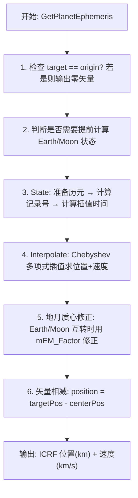

# 算法卡片 -- JPL DE 行星历表 Chebyshev 插值读取器

> **状态**：draft
> **日期**：2026-06-24
> **索引证据**：symbol-index.jsonl (WsfDE_File 类), function-index.jsonl (WsfDE_File 各方法), dependency-index.jsonl (WsfDE_File 依赖关系)
> **关联文档**：space-integrating-propagator-card.md, space-orbital-maneuvers-card.md, space-libration-point-card.md, space-jacchia-roberts-atmosphere-card.md

### 基础资料

- **算法名称**：JPL Development Ephemeris (DE) File Reader with Chebyshev Polynomial Interpolation（JPL DE 行星历表二进制文件读取与 Chebyshev 多项式插值）
- **算法所属模块**：wsf_space（空间/轨道力学模块）
- **算法功能**：读取 JPL 发布的二进制 DE 行星历表文件（支持 DE102 至 DE438 共约 21 种格式），通过 Chebyshev 多项式插值为太阳系天体（水星至冥王星、月球、太阳、太阳系质心、地月质心）提供指定历元下的 ICRF 位置（km）和速度（km/s）。核心基于 USNO NOVAS C 3.1 的 `eph_manager` 模块实现，由 `WsfDE_FileHandle` 提供多客户端共享与 Workspace 复用。

### 算法流程



核心流程涵盖：(a) 输入历元预处理 (`PrepareEpoch`/`Split`)——将两分量儒略日拆分为整数部分和小数部分，处理负值边界；(b) 记录寻址 (`ComputeRecordNumber`)——根据历元计算对应的数据记录编号；(c) 插值时间计算 (`ComputeInterpolationTimes`)——算出记录内的相对插值时间和时间跨度；(d) Chebyshev 插值 (`Interpolate`)——在选定的子区间内用递推生成的位置/速度多项式与 Chebyshev 系数做点积，得到三维位置和速度；(e) 地月质心转换 (`GetPlanetEphemeris`)——处理 Earth/Moon/Earth-Moon Barycenter 之间的复合矢量修正。

### 算法变量和常量

#### 输入变量

| 变量名 | 类型 | 中文说明 | 所属函数 (Method) |
|--------|------|----------|-------------------|
| `aEpoch` | const Date& | 两分量儒略日历元（TDB 时间尺度），`mParts[0]` 为整数部分（最近的午夜），`mParts[1]` 为当日小数值 | GetPlanetEphemeris |
| `aTarget` | Body (enum) | 目标天体（Mercury 至 Earth-Moon Barycenter 共 13 种） | GetPlanetEphemeris |
| `aOrigin` | Body (enum) | 参考中心天体，结果为目标相对于此中心的位置/速度 | GetPlanetEphemeris |
| `aWorkspace` | Workspace& | 可复用的 Chebyshev 多项式缓存，在同相对时间下避免重复计算 | GetPlanetEphemeris |
| `aBuffer` | const double* | 指向当前记录中某天体 Chebyshev 系数首地址的指针 | Interpolate |
| `aInterpolationEpoch` | double | 记录内的相对插值历元（归一化时间，无单位） | Interpolate |
| `aIntervalSpan` | double | 记录覆盖的时间跨度（秒） | Interpolate |
| `aNumCoeffPerComponent` | int | 每个坐标分量（x, y, z）的 Chebyshev 系数量（即多项式阶数） | Interpolate |
| `aNumSetsCoeff` | int | 每个记录内的子区间数（即系数集合数） | Interpolate |

#### 输出变量

| 变量名 | 类型 | 中文说明 | 所属函数 (Method) |
|--------|------|----------|-------------------|
| `aPosition` | UtVec3d& | 插值得到的目标相对于原点的 ICRF 位置矢量（km） | GetPlanetEphemeris |
| `aVelocity` | UtVec3d& | 插值得到的目标相对于原点的 ICRF 速度矢量（km/s） | GetPlanetEphemeris |
| `aWorkspace` | Workspace& | 更新后的多项式缓存：`mPc[1..n]` 为位置 Chebyshev 多项式值，`mVc[2..n]` 为速度导数多项式值 | Interpolate |

#### 内部状态（WsfDE_File 成员变量）

| 成员变量 | 类型 | 初始值 | 物理含义 | 更新时机 |
|----------|------|--------|----------|----------|
| `mFileName` | std::string | `{}` | 历表文件名 | 构造函数成功加载后赋值 |
| `mDE_Num` | std::uint32_t | `0` | DE 编号（102-438） | 从历表文件头读取 |
| `mEM_Factor` | double | `1.0` | 地月质心因子 = 1 / (1 + em_ratio)，其中 em_ratio = Moon/Earth 质量比 | 从文件头读取 em_ratio 后计算 |
| `mRecordOffset[12]` | std::array\<std::uint32_t, 12\> | `{}` | 各目标天体在数据记录中的系数起始偏移量（以 double 为单位） | 从文件头读取 |
| `mNumCoeffPerComponent[12]` | std::array\<std::uint32_t, 12\> | `{}` | 各天体每个坐标分量的 Chebyshev 系数个数 | 从文件头读取 |
| `mNumSetsCoeff[12]` | std::array\<std::uint32_t, 12\> | `{}` | 各天体在每个记录内的子区间数 | 从文件头读取 |
| `mInitialJD` | double | `0.0` | 历表覆盖的最早儒略日（TDB） | 从文件头读取 |
| `mFinalJD` | double | `0.0` | 历表覆盖的最晚儒略日（TDB） | 从文件头读取 |
| `mRecordInterval` | double | `0.0` | 相邻数据记录间的时间间隔（天） | 从文件头读取 |
| `mRecordLength` | int | `0` | 每条记录的字节长度（取决于 DE 编号） | 根据 mDE_Num 查表赋值 |
| `mInitialRecordNum` | int | `3` | 首个有效记录的编号 | LoadAllRecords 中固定为 3 |
| `mFinalRecordNum` | int | `{}` | 末条有效记录的编号 | LoadAllRecords 中由 ComputeRecordNumber 计算 |
| `mRecords` | std::vector\<Record\> | `{}` | 所有数据记录（每个 Record 内存放 `mRecordLength/8` 个 double） | 构造函数中调用 LoadAllRecords 一次性全部加载 |

#### Workspace 成员（插值缓存）

| 成员变量 | 类型 | 初始值 | 物理含义 |
|----------|------|--------|----------|
| `mPc[0]` | double | `1.0` | 零阶位置 Chebyshev 多项式 `T_0(t) = 1`（常量） |
| `mPc[1]` | double | `0` | 一阶位置多项式 `T_1(t) = t`，也用于存储当前归一化 Chebyshev 时间值，检测是否需重新计算 |
| `mVc[0]` | double | `0.0` | 零阶导数多项式 `V_0(t) = 0`（常量） |
| `mVc[1]` | double | `1.0` | 一阶导数多项式 `V_1(t) = 1`（常量） |
| `mPc[2..17]` | std::array\<double, 18\> | `{}` | 高阶位置多项式值 `T_2..T_17` |
| `mVc[2..17]` | std::array\<double, 18\> | `{}` | 高阶导数多项式值 `V_2..V_17` |
| `mTwoT` | double | `0.0` | `2*tc`，用于递推加速 |
| `mNumP` | int | `2` | 已计算的位置多项式的最高阶+1（值为索引） |
| `mNumV` | int | `3` | 已计算的导数多项式的最高阶+1（值为索引） |

#### 常量

| 常量名 | 类型 | 值 | 中文说明 | 所属函数 (Method) |
|--------|------|-----|----------|-------------------|
| `cMAGIC_PHRASE` | const char* | `"JPL Planetary Ephemeris DE"` | 文件头幻数标识（26 字符），验证文件为 JPL DE 格式 | WsfDE_File 构造函数 |

### 关键数学公式

1. **子区间选择与归一化 Chebyshev 时间**：

   将记录内插值时间映射到具体的子区间和该子区间内的归一化 Chebyshev 时间：

   $$dna = N_{\text{sets}} \quad (\text{子区间总数})$$

   $$dt_1 = \lfloor t_{\text{interp}} \rfloor \quad (\text{插值时间的整数部分})$$

   $$temp = dna \cdot t_{\text{interp}}$$

   $$l = \lfloor temp - dt_1 \rfloor \quad (\text{子区间索引，从 0 开始})$$

   $$t_c = 2 \cdot \big( \{temp\} + dt_1 \big) - 1, \quad t_c \in [-1, 1]$$

   其中 $\{temp\}$ 表示 `fmod(temp, 1.0)` 即 `temp` 的小数部分。

2. **Chebyshev 多项式递推（位置）**：

   $$T_0(t) = 1$$
   $$T_1(t) = t$$
   $$T_n(t) = 2t \cdot T_{n-1}(t) - T_{n-2}(t), \quad n \geq 2$$

3. **位置插值（每分量）**：

   对笛卡尔坐标的三个分量 $i \in \{0, 1, 2\}$（对应 x, y, z）：

   $$\mathbf{r}_i = \sum_{j=0}^{N_{\text{coeff}}-1} T_j(t_c) \cdot C\big[\, j + i \cdot N_{\text{coeff}} + l \cdot (3 \cdot N_{\text{coeff}}) \,\big]$$

   其中 $C[k]$ 为 Chebyshev 系数缓冲区，$N_{\text{coeff}}$ 为每分量的系数个数，$l$ 为子区间索引。

4. **Chebyshev 多项式导数递推（速度）**：

   $$V_0(t) = 0, \quad V_1(t) = 1$$
   $$V_n(t) = 2t \cdot V_{n-1}(t) + 2 \cdot T_{n-1}(t) - V_{n-2}(t), \quad n \geq 2$$

5. **速度插值（链式法则）**：

   速度因子（将 Chebyshev 导数转换为物理速度）：

   $$v_{\text{fac}} = \frac{2 \cdot dna}{t_{\text{span}}}$$

   其中 $t_{\text{span}} = mRecordInterval \times 86400$（将记录间隔从天转换为秒）。

   对每个坐标分量 $i \in \{0, 1, 2\}$：

   $$\mathbf{v}_i = v_{\text{fac}} \cdot \sum_{j=1}^{N_{\text{coeff}}-1} V_j(t_c) \cdot C\big[\, j + i \cdot N_{\text{coeff}} + l \cdot (3 \cdot N_{\text{coeff}}) \,\big]$$

   注意速度求和中 $j$ 从 1 开始（因为 $j=0$ 的常数项对速度无贡献）。

6. **记录编号计算**：

   $$N_{\text{record}} = \left\lfloor \frac{JD_{\text{int}} - JD_0}{T_{\text{interval}}} \right\rfloor + 3$$

   其中 $JD_{\text{int}}$ 为历元的整数部分，$JD_0$ 为历表起始儒略日，$T_{\text{interval}}$ 为记录间隔（天）。

   特殊处理：当 $JD_{\text{int}} = JD_{\text{final}}$ 时，$N_{\text{record}} := N_{\text{record}} - 2$。

7. **地月质心修正**：

   $$f_{\text{EM}} = \frac{1}{1 + \mu_{\text{EM}}}$$

   其中 $\mu_{\text{EM}} = m_{\text{Moon}} / m_{\text{Earth}}$ 为月球与地球质量比。

   当地球为目标天体时：
   $$\mathbf{r}_{\text{Earth}} \leftarrow \mathbf{r}_{\text{Earth}} - f_{\text{EM}} \cdot \mathbf{r}_{\text{Moon}}$$

   当月球为目标天体时：
   $$\mathbf{r}_{\text{Moon}} \leftarrow \mathbf{r}_{\text{Moon}} + \mathbf{r}_{\text{Earth}} - f_{\text{EM}} \cdot \mathbf{r}_{\text{Moon}}$$

   当以地月质心为目标时的特殊情况：地月质心位置直接取地球的位置矢量。

8. **Split 函数（浮点数整数/小数分解）**：

   对于输入值 $x$：
   $$x_{\text{whole}} = \lfloor x \rfloor_{\text{double}}, \quad x_{\text{frac}} = x - x_{\text{whole}}$$

   若 $x < 0$ 且 $x_{\text{frac}} \neq 0$：
   $$x_{\text{whole}} \leftarrow x_{\text{whole}} - 1, \quad x_{\text{frac}} \leftarrow x_{\text{frac}} + 1$$

   确保负数情况下小数部分始终在 $[0, 1)$ 范围内。

### 插值位置/速度伪代码

```
function Interpolate(buffer, interpEpoch, intervalSpan, numCoeff, numSets, workspace, pos, vel):
    dna  = double(numSets)
    dt1  = double(int(interpEpoch))
    temp = dna * interpEpoch
    l    = int(temp - dt1)                    // 子区间索引

    tc   = 2.0 * (fmod(temp, 1.0) + dt1) - 1.0  // 归一化 Chebyshev 时间

    // 若 tc 变化则重置计算计数
    if tc != workspace.Pc[1]:
        workspace.numP = 2
        workspace.numV = 3
        workspace.Pc[1] = tc
        workspace.twoT  = tc + tc

    // 计算位置多项式 T_j(tc)
    for i = workspace.numP to numCoeff-1:
        workspace.Pc[i] = workspace.twoT * workspace.Pc[i-1] - workspace.Pc[i-2]
    workspace.numP = numCoeff

    // 位置点积
    for i = 0 to 2:
        pos[i] = 0.0
        for j = numCoeff-1 down to 0:
            k = j + i*numCoeff + l*(3*numCoeff)
            pos[i] += workspace.Pc[j] * buffer[k]

    // 速度因子
    vfac = (2.0 * dna) / intervalSpan
    workspace.Vc[2] = 2.0 * workspace.twoT

    // 计算导数多项式 V_j(tc)
    for i = workspace.numV to numCoeff-1:
        workspace.Vc[i] = workspace.twoT * workspace.Vc[i-1]
                        + workspace.Pc[i-1] + workspace.Pc[i-1]
                        - workspace.Vc[i-2]
    workspace.numV = numCoeff

    // 速度点积
    for i = 0 to 2:
        vel[i] = 0.0
        for j = numCoeff-1 down to 1:
            k = j + i*numCoeff + l*(3*numCoeff)
            vel[i] += workspace.Vc[j] * buffer[k]
        vel[i] *= vfac
```

### 文件格式解析伪代码

```
function WsfDE_File(filename):
    open file as binary

    // 1. 验证幻数
    read 26 bytes → phrase
    if phrase != "JPL Planetary Ephemeris DE": throw Error

    // 2. 跳过 2652 字节头部保留区
    seek +2652

    // 3. 读取时间与间隔信息
    read mInitialJD      (double, 8 bytes)
    read mFinalJD        (double, 8 bytes)
    read mRecordInterval (double, 8 bytes)

    // 4. 跳过未使用的 uint32 + double (共 12 字节)
    seek +12

    // 5. 读取地月质量比
    read emRatio (double)
    mEM_Factor = 1.0 / (1.0 + emRatio)

    // 6. 读取 12 个天体的系数元数据
    for i = 0 to 11:
        read mRecordOffset[i]         (uint32)
        read mNumCoeffPerComponent[i] (uint32)
        read mNumSetsCoeff[i]         (uint32)

    // 7. 读取 DE 编号
    read mDE_Num (uint32)

    // 8. 根据 DE 编号查表设定记录长度
    switch mDE_Num:
        case 102:     mRecordLength = 6184
        case 200,202: mRecordLength = 6608
        case 403,405,410,413,414,418,421,422,423,424,430,431,433,434,435,436,438:
                      mRecordLength = 8144
        case 404,406: mRecordLength = 5824
        default:      throw Error("Unsupported DE value")

    // 9. 加载所有数据记录
    LoadAllRecords()
```

### 变量映射表

Chebyshev 插值（`Interpolate`，cpp 第 337-414 行）涉及的内部变量：

| 代码变量 | 数学符号 | 含义 |
|----------|----------|------|
| `dna` | $N_{\text{sets}}$ | 每个记录内的子区间总数 |
| `dt1` | $\lfloor t_{\text{interp}} \rfloor$ | 插值时间的整数部分 |
| `temp` | — | 中间变量 `dna * interpEpoch` |
| `l` | $l$ | 选定的子区间索引（0-based） |
| `tc` | $t_c$ | 归一化 Chebyshev 时间，范围 $[-1, 1]$ |
| `aWorkspace.mTwoT` | $2t_c$ | 两倍归一化时间，加速递推 |
| `aWorkspace.mPc[j]` | $T_j(t_c)$ | 第 $j$ 阶位置 Chebyshev 多项式值 |
| `aWorkspace.mVc[j]` | $V_j(t_c)$ | 第 $j$ 阶导数 Chebyshev 多项式值 |
| `vfac` | $\frac{2 \cdot N_{\text{sets}}}{t_{\text{span}}}$ | 速度的比例因子（链式法则） |
| `k` | — | 系数缓冲区偏移量 = `j + i*Ncoeff + l*(3*Ncoeff)` |
| `mEM_Factor` | $f_{EM}$ | 地月质心转换因子 |

### 支持的 DE 版本与记录长度

| DE 编号 | 记录长度 (bytes) | 备注 |
|---------|-----------------|------|
| 102 | 6184 | 早期版本 |
| 200, 202 | 6608 | |
| 403, 405, 410, 413, 414, 418, 421, 422, 423, 424, 430, 431, 433, 434, 435, 436, 438 | 8144 | 常用版本（含 DE405, DE421, DE430, DE438） |
| 404, 406 | 5824 | 长期历表 |

不支持 "t" 变体版本（DE430t, DE432t, DE436t, DE438t）。

### 目标天体枚举

| 枚举值 | 索引 | 天体名称 |
|--------|------|----------|
| `cMERCURY` | 0 | 水星 |
| `cVENUS` | 1 | 金星 |
| `cEARTH` | 2 | 地球 |
| `cMARS` | 3 | 火星 |
| `cJUPITER` | 4 | 木星 |
| `cSATURN` | 5 | 土星 |
| `cURANUS` | 6 | 天王星 |
| `cNEPTUNE` | 7 | 海王星 |
| `cPLUTO` | 8 | 冥王星 |
| `cMOON` | 9 | 月球 |
| `cSUN` | 10 | 太阳 |
| `cSOLAR_SYSTEM_BARYCENTER` | 11 | 太阳系质心 |
| `cEARTH_MOON_BARYCENTER` | 12 | 地月质心 |

### 边界条件

1. **历元范围检查**：
   - `PrepareEpoch` 中检查 `retval.mParts[0] < mInitialJD` 或 `(retval.mParts[0] + retval.mParts[1]) > mFinalJD`，超出范围抛出 `Error("Epoch out of range in query of DE state.")`
   - 支持的最大历元范围取决于具体 DE 文件：如 DE405 覆盖约 1600-2200 年，DE438 覆盖约 1550-2650 年

2. **目标与原点相同**：
   - 当 `aTarget == aOrigin` 时直接返回零矢量 `(0, 0, 0)`，不进行插值

3. **记录编号越界保护**：
   - `GetRecord` 中检查 `aRecordNumber` 是否在 `[mInitialRecordNum, mFinalRecordNum]` 范围内，越界抛出 Error

4. **文件格式验证**：
   - 构造函数读取文件头 26 字节幻数，若不匹配则抛出 `"File does not appear to be a JPL DE file."`
   - 每次读取后检查 `fileStream.good()`，任何读取失败均抛出含具体字段名的 Error

5. **Workspace 增量更新**：
   - `Interpolate` 中通过比较 `tc != mPc[1]` 检测 Chebyshev 时间是否变化，避免同一相对时间下重复计算多项式——这对连续多次插值同一历元的不同目标天体组合时效果显著
   - `mNumP`/`mNumV` 跟踪已计算的多项式最高阶数，仅增量计算缺失的高阶项

6. **在末儒略日的特殊处理**：
   - 当 `aEpoch.mParts[0] == mFinalJD` 时，`ComputeRecordNumber` 将记录编号减 2，确保正确落入有效记录范围

7. **负数 Split 处理**：
   - `Split` 函数对负值做特殊调整（`whole -= 1; fraction += 1`），确保小数部分恒为非负数，保证插值时间计算的正确性

### 提取策略

**源文件与提取方式**：

| 源文件 | 提取内容 | 提取方式 |
|--------|----------|----------|
| `WsfDE_File.hpp` | 类声明、Body 枚举、Date 结构体、Workspace 结构体（含 Chebyshev 多项式数组 `mPc[18]`, `mVc[18]`）、所有方法签名、成员变量声明 | 直接解析头文件的类声明部分 |
| `WsfDE_File.cpp` | 构造函数（文件头解析，第 23-174 行）、`GetPlanetEphemeris`（地月质心逻辑，第 199-298 行）、`Interpolate`（Chebyshev 插值核心，第 337-414 行）、`PrepareEpoch`（第 417-437 行）、`ComputeRecordNumber`（第 440-448 行）、`ComputeInterpolationTimes`（第 451-460 行）、`LoadAllRecords`（第 463-473 行）、`Split`（第 484-496 行）、`Record::Read`/`Record::Data`（第 503-515 行） | 从 .cpp 方法体中逐函数提取数学公式和逻辑流程 |
| `WsfDE_FileHandle.hpp` / `.cpp` | Workspace 所有权管理、`GetPlanetEphemeris` 的薄封装 | 分析 Handle 层的转发逻辑 |

**提取依赖关系**：
- `Interpolate` 是纯数学函数，仅依赖 `Workspace` 结构和 Chebyshev 多项式递推公式，可直接独立提取
- `Split`, `PrepareEpoch`, `ComputeRecordNumber`, `ComputeInterpolationTimes` 是辅助时间处理函数，依赖文件级成员变量（`mInitialJD`, `mRecordInterval`），需一并提取
- `GetPlanetEphemeris` 依赖 `State`（内部调用链：`PrepareEpoch → ComputeRecordNumber → GetRecord → ComputeInterpolationTimes → Interpolate`）以及地球/月球/地月质心之间的矢量修正逻辑
- 构造函数中的文件格式解析逻辑依赖 JPL DE 二进制格式规范，可与 NOVAS C 3.1 `eph_manager.c` 对照验证

### 源码位置

| File | Symbol | 中文说明 |
|------|--------|----------|
| [WsfDE_File.hpp](source_root/afsim-2_9/swdev/src/core/wsf_space/source/WsfDE_File.hpp) | `WsfDE_File` | JPL DE 历表文件读取主类 |
| 同上 | `WsfDE_File::Body` | 天体枚举（13 个太阳系天体） |
| 同上 | `WsfDE_File::Date` | 两分量儒略日结构体 |
| 同上 | `WsfDE_File::Workspace` | Chebyshev 多项式缓存结构体 |
| 同上 | `GetPlanetEphemeris()` | 对外接口：获取天体历表 |
| 同上 | `Interpolate()` | Chebyshev 多项式插值核心 |
| [WsfDE_File.cpp](source_root/afsim-2_9/swdev/src/core/wsf_space/source/WsfDE_File.cpp) | `WsfDE_File::WsfDE_File()` | 构造函数：解析 JPL DE 二进制头并加载全部记录 |
| 同上 | `GetPlanetEphemeris()` | 历表查询 + 地月质心修正（第 199-298 行） |
| 同上 | `State()` | 内部状态查询：历元准备 + 记录定位 + 插值（第 312-335 行） |
| 同上 | `Interpolate()` | Chebyshev 多项式插值与求导（第 337-414 行） |
| 同上 | `PrepareEpoch()` | 历元预处理与范围校验（第 417-437 行） |
| 同上 | `ComputeRecordNumber()` | 记录编号计算（第 440-448 行） |
| 同上 | `ComputeInterpolationTimes()` | 插值时间与时间跨度计算（第 451-460 行） |
| 同上 | `Split()` | 浮点数整数/小数分解（第 484-496 行） |
| 同上 | `Record::Read()` | 从文件流读取一条记录（第 503-509 行） |
| 同上 | `LoadAllRecords()` | 一次性加载历表全部数据记录（第 463-473 行） |
| [WsfDE_FileHandle.hpp](source_root/afsim-2_9/swdev/src/core/wsf_space/source/WsfDE_FileHandle.hpp) | `WsfDE_FileHandle` | 历表文件句柄（多客户端共享 + Workspace 所有权） |
| [WsfDE_FileManager.hpp](source_root/afsim-2_9/swdev/src/core/wsf_space/source/WsfDE_FileManager.hpp) | `WsfDE_FileManager` | 历表文件管理器（按文件名缓存与分发句柄） |

### 可移植性评分

**可移植性**：高 -- Chebyshev 多项式插值是经典数值分析方法，JPL DE 历表格式是公开的二进制标准（NOVAS C 3.1 参考实现为公共领域代码）。核心算法 (`Interpolate`) 为纯数学运算，仅依赖四则运算和 `fmod`，无专有库依赖。唯一的外部依赖是 JPL DE 二进制文件的格式约定（记录长度、头部偏移量），该格式已由 JPL/JPL Planetary and Lunar Ephemerides 公开文档标准化。移植时需注意：

1. `Split` 函数依赖 C++ 浮点到整数的截断行为（`static_cast<int>(x)` 向零取整），移植到其他语言时需确认等价行为
2. `Workspace` 缓存机制利用可变引用传递状态，若移植到纯函数式环境需调整为显式状态返回
3. 文件 I/O 部分（二进制读取、字节顺序）假设文件与本机字节序一致（JPL DE 文件通常为 big-endian），在 little-endian 平台需做字节交换（当前代码直接 `reinterpret_cast` 读取，依赖文件本身匹配平台字节序）
4. 记录长度映射表（DE 编号到字节数）需与 JPL 官方格式规格保持一致
