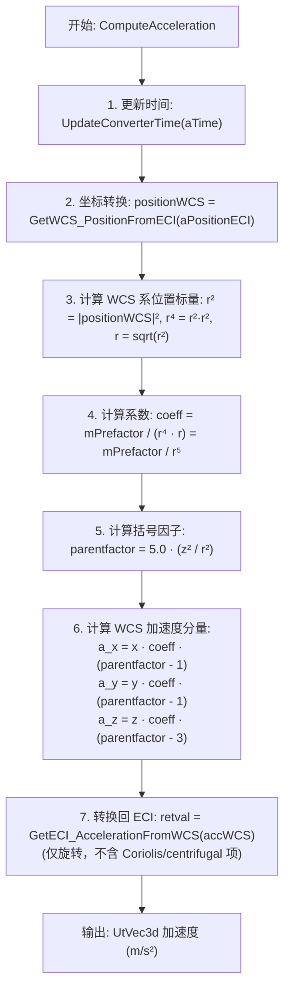

# 算法卡片 -- 地球 J2 带谐项引力摄动模型

> **状态**：draft
> **日期**：2026-06-24
> **索引证据**：function-index.jsonl (wsf_space, WsfEarthJ2Term)
> **关联文档**：space-integrating-propagator-card.md

### 基础资料

- **算法名称**：Earth J2 Zonal Harmonic Gravitational Perturbation Model（地球 J2 带谐项引力摄动模型）
- **算法所属模块**：wsf_space（空间/轨道力学模块）
- **算法功能**：计算地球非球形引力场的 J2 带谐项（二阶带谐系数）对航天器的引力摄动加速度。J2 项是地球引力场中最大的非球形摄动项，源于地球的扁率（赤道半径大于极半径）。该模型将 ECI（地心惯性系）中的位置转换到地固 WCS 系，计算梯度加速度，再以仅旋转（不含 Coriolis/centrifugal 加速项）的方式转换回 ECI。支持 WGS84、EGM96 和手动参数三种配置模式。

### 算法流程

该算法的核心设计原则是：地球引力场的矩应在与地球表面对齐的惯性参考系中计算，以便直接使用大地测量学提供的带谐系数。为此，算法使用 WCS 系（ITRF，地球参考系）提供正确的坐标轴取向，但不将其视为随时间旋转的参考系。将结果加速度转换回 ECI 时，**不**使用 `UtECI_Conversion::ConvertAccelerationWCS_ToECI`（该方法会添加 WCS 系本身的加速度项，即 Coriolis 和向心加速度），而是仅进行旋转矩阵变换。

### 算法变量和常量

#### 输入变量

| 变量名 | 类型 | 中文说明 | 所属函数 (Method) |
|--------|------|----------|-------------------|
| `aMass` | double | 航天器质量（本算法不使用，保留用于接口统一） | ComputeAcceleration |
| `aTime` | UtCalendar& | 当前仿真时间，用于 WCS-ECI 坐标转换的时间对准 | ComputeAcceleration |
| `aPosition` | UtVec3d& | 航天器在 ECI 坐标系中的位置矢量 (m) | ComputeAcceleration |
| `aVelocity` | UtVec3d& | 航天器在 ECI 坐标系中的速度矢量（本算法不使用） | ComputeAcceleration |

#### 输出变量

| 变量名 | 类型 | 中文说明 | 所属函数 (Method) |
|--------|------|----------|-------------------|
| `retval` | UtVec3d | J2 摄动加速度在 ECI 坐标系中的分量 (m/s²) | ComputeAcceleration |

#### 常量

| 常量名 | 类型 | 值 | 中文说明 | 所属函数 (Method) |
|--------|------|-----|----------|-------------------|
| `cDEFAULT_J2_VALUE` | constexpr static double | 0.0010826267 | 默认 J2 带谐系数（Vallado, Fundamentals of Astrodynamics and Applications, 4th Edition, 封底内页表） | 类定义 |
| `cTYPE` | constexpr static const char* | "earth_j2" | 算法类型标识字符串 | 类定义 |
| `UtEarth::cGRAVITATIONAL_PARAMETER` | constexpr double | 3.986004415e+14 | 默认 EGM-96 地球引力常数 (m³/s²) | 构造/RecomputePrefactor |
| `UtEarth::cGRAVITATIONAL_PARAMETER_WGS84` | constexpr double | 3.986004418e+14 | WGS-84 地球引力常数 (m³/s²) | ProcessInput |
| `UtSphericalEarth::cEARTH_MEAN_RADIUS` | constexpr double | 6371000.0 | 地球体积平均半径 (m) | 构造/RecomputePrefactor |

### 关键数学公式

1. **J2 摄动势函数**：

   J2 摄动的引力势为二阶带谐球谐函数：
   
   $$U_{J2} = \frac{\mu}{r} \cdot J_2 \cdot \left(\frac{R}{r}\right)^2 \cdot P_2(\sin\phi)$$
   
   其中 $P_2(x) = \frac{3x^2 - 1}{2}$ 为二阶 Legendre 多项式，$\sin\phi = z/r$ 为地心纬度。

2. **加速度计算（梯度形式）**：

   加速度为势函数的梯度负值 $\mathbf{a} = -\nabla U_{J2}$。在 WCS 坐标系中展开得：
   
   $$a_x = \frac{3}{2} \mu J_2 R^2 \cdot \frac{x}{r^5} \cdot \left(5\frac{z^2}{r^2} - 1\right)$$
   
   $$a_y = \frac{3}{2} \mu J_2 R^2 \cdot \frac{y}{r^5} \cdot \left(5\frac{z^2}{r^2} - 1\right)$$
   
   $$a_z = \frac{3}{2} \mu J_2 R^2 \cdot \frac{z}{r^5} \cdot \left(5\frac{z^2}{r^2} - 3\right)$$

3. **预计算因子 (RecomputePrefactor)**：

   将公共系数合并为单个预计算因子，避免每次 ComputeAcceleration 调用时重复计算：
   
   $$K = mPrefactor = \frac{3}{2} \cdot \mu \cdot R^2 \cdot J_2$$
   
   则该因子仅在参数变更时（构造、ProcessInput）重新计算。

4. **系数和括号因子（ComputeAcceleration 内部）**：

   $$coeff = \frac{K}{r^5} = \frac{K}{r^4 \cdot r}$$
   
   $$parenfactor = 5 \cdot \frac{z^2}{r^2}$$

   源码中 `r4 * r` 而非 `r2 * r2 * r` 是为了尽量减少中间变量的同时保证数值稳定性。

5. **坐标变换（ECI-WCS 往返）**：

   - 位置 ECI → WCS：$\mathbf{r}_{WCS} = \mathbf{T}_{\text{ECI→WCS}}(t) \cdot \mathbf{r}_{ECI}$
     其中 $\mathbf{T}_{\text{ECI→WCS}}(t)$ 为包含岁差、章动、恒星时自转和极移的完整变换矩阵。
   - 加速度 WCS → ECI：$\mathbf{a}_{ECI} = \mathbf{T}_{\text{WCS→ECI}}(t) \cdot \mathbf{a}_{WCS}$
     仅使用旋转矩阵部分，**不含** Coriolis 加速度项 ($2\boldsymbol{\omega} \times \mathbf{v}$) 和向心加速度项 ($\boldsymbol{\omega} \times (\boldsymbol{\omega} \times \mathbf{r})$)。

### 内部状态

下表列出 `WsfEarthJ2Term` 类中跨帧持久化的成员变量。`mPrefactor` 是预计算的聚合系数，当引力参数、地球平均半径或 J2 值发生变化时通过 `RecomputePrefactor()` 更新。

| 变量名 | 类型 | 初始值 | 物理含义 | 更新时机 |
|--------|------|--------|----------|----------|
| `mGravitationalParameter` | double | `UtEarth::cGRAVITATIONAL_PARAMETER` (3.986004415e+14) | 地球引力常数 μ (m³/s²)，默认为 EGM-96 值 | 构造时设置；通过 `SetGravitationalParameter()` 或在 `ProcessInput()` 中输入 `gravitational_parameter` 或 `wgs84`/`egm96` 命令时更新 |
| `mEarthMeanRadius` | double | `UtSphericalEarth::cEARTH_MEAN_RADIUS` (6371000.0) | 地球平均半径 R (m) | 构造时设置；通过 `SetEarthMeanRadius()` 或在 `ProcessInput()` 中输入 `mean_radius` 命令时更新 |
| `mJ2` | double | `cDEFAULT_J2_VALUE` (0.0010826267) | 地球 J2 带谐系数（无量纲），表征地球扁率引起的二阶引力场不对称性 | 构造时设置；通过 `SetJ2()` 或在 `ProcessInput()` 中输入 `j2` 命令时更新 |
| `mPrefactor` | double | 由 RecomputePrefactor() 计算 | 预计算的聚合系数 $K = \frac{3}{2} \mu R^2 J_2$ (m⁵/s²) | 构造时和每次 `ProcessInput()` 末尾通过 `RecomputePrefactor()` 重新计算 |

### 变量映射表

| 代码变量 | 数学符号 | 含义 |
|----------|----------|------|
| `mGravitationalParameter` | $\mu$ | 地球引力常数，单位 m³/s² |
| `mEarthMeanRadius` | $R$ | 地球平均半径，单位 m |
| `mJ2` | $J_2$ | 二阶带谐系数（无量纲），正值表示赤道凸起 |
| `mPrefactor` | $K = \frac{3}{2}\mu R^2 J_2$ | 预计算的聚合系数，单位 m⁵/s² |
| `positionWCS` (局部) | $\mathbf{r}_{\text{WCS}} = (x, y, z)$ | WCS 坐标系中的位置矢量 |
| `r2` (局部) | $r^2 = x^2 + y^2 + z^2$ | 地心距的平方 |
| `r4` (局部) | $r^4 = r^2 \cdot r^2$ | 地心距的四次方 |
| `r` (局部) | $r = \sqrt{r^2}$ | 地心距 |
| `coeff` (局部) | $K / r^5$ | 加速度系数 |
| `parenfactor` (局部) | $5z^2 / r^2$ | 来自 Legendre 多项式导数的公共括号因子 |
| `aPosition` | $\mathbf{r}_{\text{ECI}}$ | 输入 ECI 位置矢量 |
| `retval` | $\mathbf{a}_{\text{ECI}}$ | 输出 ECI 加速度矢量 |
| `accWCS` (局部) | $\mathbf{a}_{\text{WCS}}$ | WCS 坐标系中的中间加速度矢量 |

### 边界条件

下表列出模型中影响数值稳定性、输入合法性、限幅和回退行为的关键边界条件。

| 条件 | 所在位置 | 处理方式 | 说明 |
|------|----------|----------|------|
| 动力学指针为空 | `ComputeAcceleration()` | 返回零加速度 `UtVec3d{0.0, 0.0, 0.0}` | 若 `GetDynamics()` 返回 null，无法进行 ECI-WCS 坐标转换，安全回退为零摄动 |
| 航天器位于地心 (r² ≈ 0) | `ComputeAcceleration()` | 无显式保护 | r² → 0 时 coeff = K / r⁵ → ∞，但在实际轨道传播中航天器不会恰好位于地心。若意外出现此情况，浮点运算将产生 Inf/NaN |
| `gravitational_parameter` 输入 | `ProcessInput()` | `aInput.ValueGreater(mGravitationalParameter, 0.0)` | 引力参数必须为正数，否则输入被拒绝 |
| `mean_radius` 输入 | `ProcessInput()` | `aInput.ValueGreater(mEarthMeanRadius, 0.0)`，使用 `ReadValueOfType(..., UtInput::cLENGTH)` 进行单位转换 | 平均半径必须为正数，且支持 AFSIM 长度单位系统 |
| `j2` 输入 | `ProcessInput()` | 无范围校验 | J2 值理论上可正可负，负值对应极轴比赤道更长的扁球体（如某些天体）。对地球 J2 为正值 |
| `wgs84` 命令 | `ProcessInput()` | 将 `mGravitationalParameter` 设为 `UtEarth::cGRAVITATIONAL_PARAMETER_WGS84` (3.986004418e+14) | 切换至 WGS-84 引力参数，J2 和半径不变 |
| `egm96` 命令 | `ProcessInput()` | 将 `mGravitationalParameter` 设为 `UtEarth::cGRAVITATIONAL_PARAMETER` (3.986004415e+14) | 切换至 EGM-96 引力参数，J2 和半径不变 |
| 参数变更后重算 | `ProcessInput()` 末尾 | 无条件调用 `RecomputePrefactor()` | 任何参数（μ、R、J2）变更后都会重新计算预因子 K，确保下次 ComputeAcceleration 使用最新值 |

### 提取策略

该算法的信息从以下源文件按以下方式提取：

| 源文件 | 提取方式 | 提取内容 |
|--------|----------|----------|
| `WsfEarthJ2Term.hpp` | 阅读头文件 | 类定义、公共接口（getter/setter）、常量 `cDEFAULT_J2_VALUE`、成员变量类型和初始值、`constexpr static` 类型标识 `cTYPE` |
| `WsfEarthJ2Term.cpp` | 逐函数分析 | `ComputeAcceleration()` 的完整数学实现和注释说明（ECI-WCS 往返、仅旋转不含 Coriolis/centrifugal 的转换逻辑）；`RecomputePrefactor()` 的预因子公式；`ProcessInput()` 的四种命令分支和输入校验规则 |
| `WsfOrbitalDynamics.hpp/.cpp` | 阅读基类接口 | `GetWCS_PositionFromECI()`、`GetECI_AccelerationFromWCS()` 和 `UpdateConverterTime()` 的方法声明，理解坐标转换委托链 |
| `UtEarth.hpp` | 阅读常量定义 | `cGRAVITATIONAL_PARAMETER` (3.986004415e+14)、`cGRAVITATIONAL_PARAMETER_WGS84` (3.986004418e+14) 的精确值和来源注释（JPL、WGS-84 标准） |
| `UtSphericalEarth.hpp` | 阅读常量定义 | `cEARTH_MEAN_RADIUS` (6371000.0) 的定义——基于椭球体积等效半径 |
| `UtECI_Conversion.hpp` | 阅读转换类接口 | ECI-WCS 坐标转换类的方法签名，理解为何 `ConvertAccelerationWCS_ToECI` 被刻意避免使用（其添加了 Coriolis/centrifugal 项） |
| `function-index.jsonl` | JSON 行检索 | 通过 `grep` 搜索 `WsfEarthJ2Term` 确认相关条目 |

**提取流程**：
1. 从头文件的 private 成员变量中提取"内部状态"（`mGravitationalParameter`、`mEarthMeanRadius`、`mJ2`、`mPrefactor`），记录初始值和默认常量来源。
2. 从 `RecomputePrefactor()` 提取预因子公式 $K = \frac{3}{2}\mu R^2 J_2$ 并数学化。
3. 从 `ComputeAcceleration()` 的函数体逐行分析：(a) 时间更新和坐标转换；(b) WCS 系中的 r²、r⁴、r 计算；(c) coeff 和 parentfactor 的公式；(d) 三分量加速度公式；(e) 仅旋转的加速度回转换。
4. 阅读理解注释块中关于为何不能使用 `ConvertAccelerationWCS_ToECI` 的关键设计说明，作为核心边界条件记录下来。
5. 从 `ProcessInput()` 提取四种输入命令 (`wgs84`、`egm96`、`gravitational_parameter`、`j2`、`mean_radius`) 及其校验逻辑。
6. 追踪 `GetWCS_PositionFromECI` 和 `GetECI_AccelerationFromWCS` 的基类实现，确认其为仅旋转变换（通过 `UtECI_Conversion` 的旋转矩阵但不调用速度相关的转换）。

### 源码位置

| File | Symbol | 中文说明 |
|------|--------|----------|
| [WsfEarthJ2Term.hpp](source_root/afsim-2_9/swdev/src/core/wsf_space/source/WsfEarthJ2Term.hpp) | `WsfEarthJ2Term` | J2 项类声明，常量定义和成员变量 |
| [WsfEarthJ2Term.cpp](source_root/afsim-2_9/swdev/src/core/wsf_space/source/WsfEarthJ2Term.cpp) | `ComputeAcceleration()` | J2 摄动加速度核心计算 — ECI→WCS→梯度→ECI 往返 |
| 同上 | `RecomputePrefactor()` | 预因子 $K = (3/2)\mu R^2 J_2$ 的计算 |
| 同上 | `ProcessInput()` | 输入处理：支持 wgs84/egm96/gravitational_parameter/j2/mean_radius 命令 |
| [WsfOrbitalDynamics.hpp](source_root/afsim-2_9/swdev/src/core/wsf_space/source/WsfOrbitalDynamics.hpp) | `WsfOrbitalDynamics` | 基类，提供 `GetWCS_PositionFromECI()` 和 `GetECI_AccelerationFromWCS()` 接口 |
| [UtEarth.hpp](source_root/afsim-2_9/swdev/src/tools/util/source/UtEarth.hpp) | `UtEarth` | 地球物理常数命名空间：cGRAVITATIONAL_PARAMETER（EGM-96）、cGRAVITATIONAL_PARAMETER_WGS84 |
| [UtSphericalEarth.hpp](source_root/afsim-2_9/swdev/src/tools/util/source/UtSphericalEarth.hpp) | `UtSphericalEarth` | 地球球形模型常量：cEARTH_MEAN_RADIUS |

### 可移植性评分

**可移植性**：极高 — J2 摄动模型是天体力学中的标准形式，公式完全自包含。代码中的核心计算仅为在 WCS 系中的 3 行加速度公式加上一次预因子的重组。唯一需要外部提供的部分是 ECI-WCS 旋转矩阵（岁差-章动-恒星时-极移变换），其由 `UtECI_Conversion` 类提供，但该部分仅涉及标准天文算法，可使用 IAU 2006/2000 岁差-章动模型或基于 SOFA 库重新实现。EGM-96 和 WGS-84 的物理常数（μ、J2、R）均为国际公开标准值。
