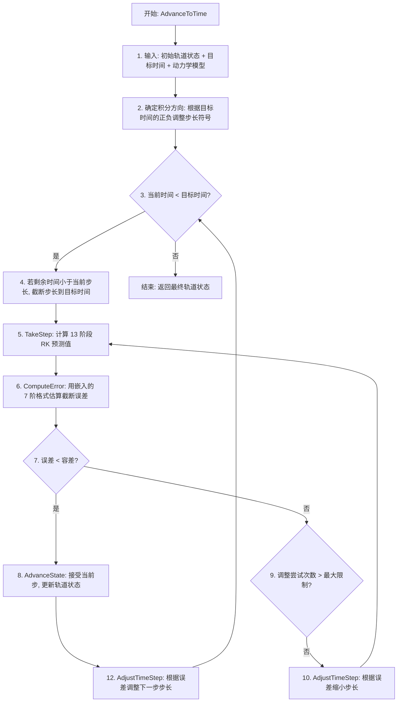

# 算法卡片 — 数值积分轨道传播器

> **状态**：draft
> **日期**：2026-06-11
> **索引证据**：function-index.jsonl (wsf_space, Propagate 为 math 标记), symbol-index.jsonl (WsfIntegratingPropagator 类)
> **关联文档**：space-norad-orbital-propagator-card.md, space-orbital-event-condition-card.md

### 基础资料

- **算法名称**：Numerical Integration Orbital Propagator with Adaptive Runge-Kutta（自适应 Runge-Kutta 数值积分轨道传播器）
- **算法所属模块**：wsf_space（空间/轨道力学模块）
- **算法功能**：使用嵌入型 Runge-Kutta 方法对航天器在任意力模型下的轨道运动进行数值积分。采用 Prince-Dormand 8(7) 13 阶段嵌入 Runge-Kutta 格式，配合自适应步长控制和误差估计，适用于高精度轨道预报、轨道机动仿真以及多体动力学场景。

### 算法流程

整个算法流程图如下：



其中，第一步接收初始轨道状态（含 ECI 位置、速度、加速度）和目标时间；第二步检测积分方向；第三步至第十二步为自适应步长控制的主循环；`TakeStep` 中依次计算 13 个阶段（含 FSAL 优化），每个阶段调用 `OrbitalDynamics::ComputeAcceleration()` 获取当前加速度；`ComputeError` 使用嵌入的 7 阶格式与 8 阶格式之差作为截断误差估计；`AdjustTimeStep` 根据误差与容差的比例缩放步长。

### 算法变量和常量

1. 输入 (input)：
   
   | 英文标识符 (Symbol)  | 中文名称 (Name) | 数据类型 (Type)               | 含义 (Meaning)                  | 单位 (Units)   | 所属函数 (Method)       |
   | --------------- | ----------- | ------------------------- | ----------------------------- | ------------ | ------------------- |
   | `aDynamics`     | 轨道动力学模型     | const WsfOrbitalDynamics& | 包含多个动力学项（引力、J2、太阳、月球等）的加速度计算器 | —            | Propagate |
   | `aFinalTime`    | 目标预报时间      | const UtCalendar&         | 需要预报到的最终时刻                    | —            | Propagate |
   | `aInitialState` | 初始轨道状态      | const ut::OrbitalState&   | 含 ECI 位置/速度/加速度的初始状态          | m, m/s, m/s² | Propagate |
   | `aMass`         | 航天器质量       | double                    | 用于加速度 = 力/质量 的计算              | kg           | Propagate |
   | `aPosition`     | ECI 位置      | const UtVec3d&            | 地心惯性系中的位置矢量                   | m            | Propagate |
   | `aVelocity`     | ECI 速度      | const UtVec3d&            | 地心惯性系中的速度矢量                   | m/s          | Propagate |

2. 输出 (output)：
   
   | 英文标识符 (Symbol)       | 中文名称 (Name) | 数据类型 (Type)      | 含义 (Meaning)         | 单位 (Units)   | 所属函数 (Method) |
   | -------------------- | ----------- | ---------------- | -------------------- | ------------ | ------------- |
   | `retval`             | 传播后的轨道状态    | ut::OrbitalState | 含预报时刻的 ECI 位置/速度/加速度 | m, m/s, m/s² | AdvanceToTime |
   | `mPredictedPosition` | 预测位置        | UtVec3d          | 当前步的 8 阶预测位置         | m            | Propagate |
   | `mPredictedVelocity` | 预测速度        | UtVec3d          | 当前步的 8 阶预测速度         | m/s          | Propagate |
   | `mPosDiff`           | 位置误差        | UtVec3d          | 8 阶与 7 阶格式的位置差       | m            | Propagate |
   | `mVelDiff`           | 速度误差        | UtVec3d          | 8 阶与 7 阶格式的速度差       | m/s          | Propagate |

3. 常量 (constant):
   
   | 英文标识符 (Symbol)           | 中文名称 (Name)         | 数据类型 (Type)                | 含义 (Meaning)        | 单位 (Units) | 所属函数 (Method)   |
   | ------------------------ | ------------------- | -------------------------- | ------------------- | ---------- | --------------- |
   | `cCVALUES[13]`           | Butcher 表 C 节点      | constexpr double[13]       | RK 各阶段的时间节点（0 到 1）  | 无量纲        | SetOrbitalIntegrator |
   | `cBVALUES[13]`           | Butcher 表 B 权重（8 阶） | constexpr double[13]       | 8 阶解的权重系数           | 无量纲        | SetOrbitalIntegrator |
   | `cERRORVALUES[13]`       | Butcher 表误差权重       | constexpr double[13]       | 7 阶嵌入解的权重系数（用于误差估计） | 无量纲        | SetOrbitalIntegrator |
   | `cAVALUES[13][12]`       | Butcher 表 A 系数      | constexpr double[13][12]   | 阶段间依赖矩阵（严格下三角）      | 无量纲        | SetOrbitalIntegrator |
   | `mTolerance`             | 误差容差                | double (default: 1e-10)    | 单步截断误差的允许上限         | m 或 m/s    | Propagate |
   | `mMaxStepSize`           | 最大步长                | double                     | 步长的硬上限              | s          | Propagate |
   | `mMinStepSize`           | 最小步长                | double                     | 步长的硬下限（0 表示无下限）     | s          | Propagate |
   | `mInitialStepSize`       | 初始步长                | double (default: 0.1)      | 首次积分时使用的步长          | s          | Propagate |
   | `mMaxAdjustmentAttempts` | 最大调整次数              | unsigned int (default: 50) | 单步中重试的最大次数          | 次          | Propagate |
   | `cORDER`                 | 主格式阶数               | constexpr (8)              | 8 阶 Runge-Kutta 格式  | —          | Propagate |

### 关键数学公式

1. **13 阶段显式 Runge-Kutta 格式**：
   Prince-Dormand 8(7)13M 是一种嵌入型显式 Runge-Kutta 方法。使用 13 次函数评估得到 8 阶解，同时利用嵌入的 7 阶解进行误差估计。
   
   第 $i$ 阶段的状态计算：
   
   $\mathbf{y}_i = \mathbf{y}_0 + h \sum_{j=0}^{i-1} a_{ij} \cdot \mathbf{k}_j$
   
   其中：
   
   - $\mathbf{y}_0$ 为初始状态 $(\mathbf{r}_0, \mathbf{v}_0)$。
   - $h$ 为当前步长。
   - $a_{ij}$ 为 Butcher 表系数（`cAVALUES[i][j]`）。
   - $\mathbf{k}_j = (\mathbf{v}_j, \mathbf{a}_j)$ 为第 $j$ 阶段的右端函数值。
   - $\mathbf{a}_j = \text{ComputeAcceleration}(mass, t_0 + c_j h, \mathbf{r}_j, \mathbf{v}_j)$ 为第 $j$ 阶段的加速度。
   
   12 个非零节点值 $c_i$：
   
   $c_1 = \frac{1}{18},\ c_2 = \frac{1}{12},\ c_3 = \frac{1}{8},\ c_4 = \frac{5}{16},\ c_5 = \frac{3}{8},\ c_6 = \frac{59}{400}$
   
   $c_7 = \frac{93}{200},\ c_8 = \frac{5490023248}{9719169821},\ c_9 = \frac{13}{20},\ c_{10} = \frac{1201146811}{1299019798},\ c_{11} = 1,\ c_{12} = 1$

2. **8 阶解与 7 阶嵌入解的加权组合**：
   最终解通过加权组合各阶段的右端函数值得到：
   
   $\mathbf{y}_{n+1}^{(8)} = \mathbf{y}_n + h \sum_{i=0}^{12} b_i \cdot \mathbf{k}_i$ （8 阶预测）
   
   $\mathbf{y}_{n+1}^{(7)} = \mathbf{y}_n + h \sum_{i=0}^{12} \hat{b}_i \cdot \mathbf{k}_i$ （7 阶嵌入解，仅用于误差估计）
   
   其中：
   
   - $b_i$ 为 8 阶权重（`cBVALUES`，如 $b_0 = \frac{14005451}{335480064}$, $b_{12} = \frac{1}{4}$）。
   - $\hat{b}_i = b_i + e_i$ 为 7 阶权重，$e_i$ 为误差系数（`cERRORVALUES`）。

3. **FSAL 优化（First Same As Last）**：
   由于 $c_{12} = c_{11} = 1$ 且 $b_{12} \neq 0$，该格式具有 FSAL 性质：当前步第 12 阶段的加速度 $\mathbf{a}_{12}$ 可直接作为下一步的 $\mathbf{k}_0$ 的加速度分量，省去一次函数评估。

4. **局部截断误差估计**：
   使用 8 阶和 7 阶解之差估计局部截断误差：
   
   $\Delta \mathbf{r} = \mathbf{r}_{n+1}^{(8)} - \mathbf{r}_{n+1}^{(7)} = h \sum_{i=0}^{12} (b_i - \hat{b}_i) \cdot \mathbf{v}_i$
   
   $\Delta \mathbf{v} = \mathbf{v}_{n+1}^{(8)} - \mathbf{v}_{n+1}^{(7)} = h \sum_{i=0}^{12} (b_i - \hat{b}_i) \cdot \mathbf{a}_i$
   
   支持两种误差范数：
   
   - **$L_\infty$ 范数**：$err = \max(\|\Delta \mathbf{r}\|_\infty, \|\Delta \mathbf{v}\|_\infty)$
   - **$L_2$ 范数**（默认）：$err = \max\left(\frac{\|\Delta \mathbf{r}\|_2}{\max(\|\mathbf{r}_{step}\|_2, 0.1)}, \frac{\|\Delta \mathbf{v}\|_2}{\max(\|\mathbf{v}_{step}\|_2, 0.1)}\right)$

5. **自适应步长控制**：
   根据误差与容差的比例调整步长，使用标准的最优步长公式：
   
   如果误差未通过（$err > tol$）：
   
   $h_{new} = 0.9 \cdot h \cdot \left(\frac{tol}{err}\right)^{\frac{1}{p-1}}$
   
   其中 $p = cORDER = 8$，故指数为 $\frac{1}{7}$。
   
   如果误差已通过（$err \leq tol$）：
   
   $h_{new} = 0.9 \cdot h \cdot \left(\frac{tol}{err}\right)^{\frac{1}{p}}$
   
   指数为 $\frac{1}{8}$。
   
   乘以 0.9 的安全因子避免步长过度振荡。调整后的步长被钳制在 $[h_{min}, h_{max}]$ 范围内。

6. **轨道动力学加速度合成**：
   传播器本身不实现物理模型，而是通过 `WsfOrbitalDynamics` 聚合多个 `WsfOrbitalDynamicsTerm` 来合成总加速度：
   
   $\mathbf{a}_{ECI} = \frac{1}{m} \sum_{k} \mathbf{F}_k(\mathbf{r}, \mathbf{v}, t)$
   
   典型的动力学项包括：
   
   - 地球中心引力：$\mathbf{a}_{Earth} = -\frac{\mu_E}{r^3} \mathbf{r}$
   - J2 摄动：包含 $J_2 \frac{R_E^2}{r^4}$ 项的加速度修正
   - 太阳/月球第三体引力：$\mathbf{a}_{3rd} = -\mu_{body} \left(\frac{\mathbf{r} - \mathbf{r}_{body}}{|\mathbf{r} - \mathbf{r}_{body}|^3} + \frac{\mathbf{r}_{body}}{r_{body}^3}\right)$
   - 大气阻力、太阳辐射压等非保守力

### 算法伪代码

```
// === 自适应步长 Runge-Kutta 轨道积分器 ===
// 整体目标：从初始轨道状态推进到目标时刻，精度由误差容差控制

function AdvanceToTime(aDynamics, aFinalTime, aInitialState):
    state = aInitialState.Copy()
    finalTime = aFinalTime - state.epoch
    currentTime = 0.0

    // 1. 检测积分方向
    if (finalTime < 0 and stepSize > 0) or (finalTime > 0 and stepSize < 0):
        stepSize = -stepSize

    // 2. 主积分循环
    while |currentTime| < |finalTime|:
        // 2a. 如果剩余时间小于当前步长，截断步长
        if |stepSize + currentTime| > |finalTime|:
            stepSize = finalTime - currentTime

        // 2b. 执行一步 13 阶段 RK
        TakeStep(aDynamics, state)
          → for i = 1 to 12:  // i=0 由 FSAL 提供
                // 构造第 i 阶段的预测状态
                y_pos = state.pos + h * Σ(a[i][j] * rhs_pos[j]) for j < i
                y_vel = state.vel + h * Σ(a[i][j] * rhs_vel[j]) for j < i
                // 计算第 i 阶段的右端函数
                rhs_pos[i] = y_vel
                rhs_vel[i] = aDynamics.ComputeAcceleration(mass, t0+c[i]*h, y_pos, y_vel)
            // 加权合成 8 阶预测和 7 阶对比值
            pred_pos = state.pos + h * Σ(b[i] * rhs_pos[i])
            pred_vel = state.vel + h * Σ(b[i] * rhs_vel[i])
            pos_diff = h * Σ(error_b[i] * rhs_pos[i])
            vel_diff = h * Σ(error_b[i] * rhs_vel[i])

        // 2c. 计算截断误差
        error = ComputeError(state)
          → if L_2:
                pos_err = |pos_diff|₂ / max(|Δpos|₂, 0.1)
                vel_err = |vel_diff|₂ / max(|Δvel|₂, 0.1)
                return max(pos_err, vel_err)
             if L_∞:
                return max(max|pos_diff|, max|vel_diff|)

        // 2d. 接受或拒绝当前步
        if error < tolerance:
            acceptStep = true
        else:
            attempts++
            acceptStep = false
            if attempts > maxAdjustmentAttempts:
                acceptStep = true  // 强制接受
                warn("Unable to find acceptable step size")

        // 2e. 如果接受，推进状态
        if acceptStep:
            state.epoch += stepSize
            state.pos = pred_pos     // 使用 8 阶解
            state.vel = pred_vel
            state.acceleration = rhs_vel[12]  // FSAL: 保存最后阶段的加速度
            attempts = 0
            currentTime += stepSize

        // 2f. 调整下一步长
        AdjustTimeStep(error)
          → if error > tol:
                h *= 0.9 * (tol/error)^(1/7)  // 拒绝，缩小步长
             else:
                h *= 0.9 * (tol/error)^(1/8)  // 接受，调整步长
             clamp |h| ∈ [minStepSize, maxStepSize]

    return state
```

### 源码使用说明

#### 入口和调用链

```
// 仿真引擎通过 WsfSpaceMover 驱动数值积分传播器
WsfSimulation::Update()                                          // AFSIM 仿真引擎主循环
  → WsfSpaceMoverBase::Update()                                 // 空间运动器更新
    → WsfIntegratingPropagator::Propagate(currentTime)          // 积分传播器入口
      → WsfOrbitalIntegrator::AdvanceToTime(dynamics, finalTime, initialState)
        // 自适应步长 RK 主循环
        → TakeStep(dynamics, state)  × N                    // 13 阶段 RK 推进
          → dynamics.ComputeAcceleration(mass, t, r, v) × 12 // 计算各阶段加速度
            → Σ term.ComputeAcceleration(mass, t, r, v)      // 合成所有动力学项
        → ComputeError()                                     // 嵌入格式误差估计
        → AdjustTimeStep(error)                              // 步长自适应控制
        → AdvanceState(state)                                // 状态更新
      → UpdateOrbitalState()                                 // 回写到基类
```

#### 源码位置

| File                                                                                                                     | Symbol                                | Lines   | Evidence level | 中文说明                                     |
| ------------------------------------------------------------------------------------------------------------------------ | ------------------------------------- | ------- | -------------- | ---------------------------------------- |
| [WsfIntegratingPropagator.hpp](source_root/src/core/wsf_space/source/WsfIntegratingPropagator.hpp)                       | `WsfIntegratingPropagator`            | 36-102  | source-cited   | 积分传播器主类 — 组装积分器 + 动力学模型                  |
| [WsfIntegratingPropagator.cpp](source_root/src/core/wsf_space/source/WsfIntegratingPropagator.cpp)                       | `Propagate()`                         | —       | source-cited   | 传播入口 — 调用积分器的 AdvanceToTime              |
| [WsfOrbitalIntegrator.hpp](source_root/src/core/wsf_space/source/WsfOrbitalIntegrator.hpp)                               | `WsfOrbitalIntegrator`                | 23-52   | source-cited   | 积分器抽象接口 — AdvanceToTime 纯虚函数             |
| [WsfRungeKuttaOrbitalIntegrator.hpp](source_root/src/core/wsf_space/source/WsfRungeKuttaOrbitalIntegrator.hpp)           | `AdvanceToTime()`                     | 150-215 | source-cited   | 自适应步长 RK 主循环 — 接受/拒绝步 + 步长调整             |
| [WsfRungeKuttaOrbitalIntegrator.hpp](source_root/src/core/wsf_space/source/WsfRungeKuttaOrbitalIntegrator.hpp)           | `TakeStep()`                          | 265-325 | source-cited   | 13 阶段 RK 推进 — Butcher 表计算 + FSAL         |
| [WsfRungeKuttaOrbitalIntegrator.hpp](source_root/src/core/wsf_space/source/WsfRungeKuttaOrbitalIntegrator.hpp)           | `ComputeError()`                      | 223-259 | source-cited   | 误差估计 — L₂ 和 L∞ 两种范数                      |
| [WsfRungeKuttaOrbitalIntegrator.hpp](source_root/src/core/wsf_space/source/WsfRungeKuttaOrbitalIntegrator.hpp)           | `AdjustTimeStep()`                    | 327-368 | source-cited   | 步长自适应 — 基于误差/容差比的步长缩放                    |
| [WsfPrinceDormand78OrbitalIntegrator.hpp](source_root/src/core/wsf_space/source/WsfPrinceDormand78OrbitalIntegrator.hpp) | `WsfPrinceDormand78OrbitalIntegrator` | 26-269  | source-cited   | PD 8(7) 系数 — 完整的 Butcher 表 (c, b, b̂, A) |
| [WsfOrbitalDynamics.hpp](source_root/src/core/wsf_space/source/WsfOrbitalDynamics.hpp)                                   | `WsfOrbitalDynamics`                  | 31-101  | source-cited   | 轨道动力学 — 多动力学项合成加速度                       |
| [WsfOrbitalDynamicsTerm.hpp](source_root/src/core/wsf_space/source/WsfOrbitalDynamicsTerm.hpp)                           | `WsfOrbitalDynamicsTerm`              | 31-89   | source-cited   | 动力学项抽象接口 — ComputeAcceleration 纯虚函数      |

#### 框架依赖

| AFSIM 原始依赖                                                 | 依赖类型        | 替换方案                                         |
| ---------------------------------------------------------- | ----------- | -------------------------------------------- |
| `WsfOrbitalIntegrator`                                     | 抽象积分器接口     | 自定义 `OrbitalIntegrator` 抽象类                  |
| `WsfRungeKuttaOrbitalIntegrator<Order, Steps, Integrator>` | 模板基类（核心算法）  | 可直接移植模板代码，Butcher 表用常量定义                     |
| `WsfOrbitalDynamics`                                       | 动力学模型容器     | 自定义 `DynamicsModel` 聚合类                      |
| `WsfOrbitalDynamicsTerm`                                   | 动力学项接口      | 自定义 `ForceModel` 抽象接口                        |
| `UtCalendar`                                               | 时间表示        | `double` (秒) 或 `std::chrono`                 |
| `UtOrbitalState / UtOrbitalStateVector`                    | 轨道状态容器      | 自定义 `OrbitalState` (pos + vel + acc + epoch) |
| `UtVec3d`                                                  | 三维矢量        | `Eigen::Vector3d`                            |
| `WsfNonClassicalOrbitalPropagator`                         | 基类          | 合并到自定义传播器基类中                                 |
| `WsfObject`                                                | 脚本系统基类（配置用） | 移除，直接用构造函数或 setter 配置参数                      |

#### 测试和验证计划

1. **单元测试 — 二体问题**：使用纯 Kepler 二体动力学（仅地球中心引力项），对比解析解（Kepler 方程），验证 8 阶收敛速度和精度。
2. **回归测试 — J2 摄动**：加入 J2 项，与 NORAD SGP4 在近地轨道上的预报结果对比（短弧段内）。
3. **精度验证**：改变容差（如 $10^{-8}$、$10^{-10}$、$10^{-12}$），验证误差与指定的容差一致。
4. **步长调整验证**：在椭圆轨道近地点（高加速度）和远地点（低加速度）处，步长应自动缩小/放大。
5. **边界测试**：零质量、零步长、反向积分、最大步长限制、最小步长限制。
6. **FSAL 验证**：确认每步的函数评估次数 = 12（而非 13）。

### 内部状态

**WsfIntegratingPropagator（传播器外层）-- 跨帧持久化成员变量：**

| 变量名 | 类型 | 初始值 | 物理含义 | 更新时机 |
|--------|------|--------|----------|----------|
| `mIntegratorPtr` | `UtCloneablePtr<WsfOrbitalIntegrator>` | null | 数值积分器实例（如 PD78），负责执行积分步进 | 初始化时通过 `SetOrbitalIntegrator()` 或配置创建 |
| `mDynamicsPtr` | `UtCloneablePtr<WsfOrbitalDynamics>` | null | 轨道动力学模型实例，聚合所有力模型（引力、J2、太阳、月球等） | 初始化时通过 `SetOrbitalDynamics()` 或配置创建 |
| `mMassProvider` | `unique_ptr<MassProvider>` | null | 质量提供者接口，返回航天器当前质量 | 初始化时配置 |
| `mPropagatedOrbitalState` | `ut::OrbitalState` | 由初始轨道状态复制 | 当前帧传播后的轨道状态 (pos/vel/acc/epoch) | 每帧 `Propagate()` → `UpdateOrbitalState()` 中写回 |
| `mAccelerationValid` | `bool` | false | 当前加速度是否有效（标志位） | 传播后设置 |
| `mKinematicInput` | `bool` | false | 是否使用运动学模式（从外部输入位置/速度而不通过数值积分） | 初始化时配置 |
| `mAdvancing` | `bool` | false | 是否正在执行传播（重入保护标志） | `AdvancingHandle` RAII 对象在构造时设为 true，析构时恢复 false |

**WsfRungeKuttaOrbitalIntegrator（积分器内层）-- 跨步持久化成员变量：**

| 变量名 | 类型 | 初始值 | 物理含义 | 更新时机 |
|--------|------|--------|----------|----------|
| `mStepSize` | `double` | -1.0（首次使用 `mInitialStepSize`） | 当前积分步长（s），有符号以支持正反方向 | 每步 `AdjustTimeStep()` 更新；首次传播时由 `mInitialStepSize` 赋值 |
| `mTolerance` | `double` | 1.0e-10 | 局部截断误差容差（m 或 m/s，取决于范数类型） | 初始化时配置，用户可通过脚本覆盖 |
| `mMaxStepSize` | `double` | `numeric_limits<double>::max()` | 步长绝对值的硬上限（s） | 初始化时配置 |
| `mMinStepSize` | `double` | 0.0 | 步长绝对值的硬下限（s），0 表示无下限 | 初始化时配置 |
| `mInitialStepSize` | `double` | 0.1 | 首次积分时使用的初始步长（s） | 初始化时配置 |
| `mMaxAdjustmentAttempts` | `unsigned int` | 50 | 单步中因误差超标而重试的最大次数 | 初始化时配置；超过后强制接受当前步并警告 |
| `mErrorCriterion` | `ErrorCriterion` | `cL_TWO_NORM` | 误差范数类型：L_2（默认，相对误差归一化）或 L_infinity（最大分量绝对值） | 初始化时配置 |
| `mRHS_Position` | `array<UtVec3d, 13>` | 全零 | 各 RK 阶段的位置分量（右端函数 = 阶段速度） | 每步 `TakeStep()` 中填充 13 个阶段 |
| `mRHS_Velocity` | `array<UtVec3d, 13>` | 全零 | 各 RK 阶段的速度分量（右端函数 = 阶段加速度） | 每步 `TakeStep()` 中填充 13 个阶段 |
| `mY_Position` | `UtVec3d` | (0,0,0) | 当前阶段的预测位置（中间工作变量） | 每阶段在 `TakeStep()` 中写入 |
| `mY_Velocity` | `UtVec3d` | (0,0,0) | 当前阶段的预测速度（中间工作变量） | 每阶段在 `TakeStep()` 中写入 |
| `mPredictedPosition` | `UtVec3d` | (0,0,0) | 当前步的 8 阶预测位置（m，用于误差估计比对） | 每步 `TakeStep()` 末尾赋值 |
| `mPredictedVelocity` | `UtVec3d` | (0,0,0) | 当前步的 8 阶预测速度（m/s） | 每步 `TakeStep()` 末尾赋值 |
| `mPosDiff` | `UtVec3d` | (0,0,0) | 8 阶与 7 阶嵌入解的位置差异（m，误差估计用） | 每步 `TakeStep()` 末尾由误差权重加权赋值 |
| `mVelDiff` | `UtVec3d` | (0,0,0) | 8 阶与 7 阶嵌入解的速度差异（m/s） | 每步 `TakeStep()` 末尾由误差权重加权赋值 |
| `mWarned` | `bool` | false | 是否已对当前积分过程发出过警告（步长/误差/调整次数超标时仅警告一次） | 超出调整次数限制或步长被最小步长限幅时设为 true |

*注：Butcher 表系数（`cCVALUES`、`cBVALUES`、`cERRORVALUES`、`cAVALUES`）为编译时常量（`static constexpr`），不随帧变化。*

### 变量映射表

| 代码变量 | 数学符号 | 含义 |
|----------|----------|------|
| `mStepSize` | $h$ | 当前积分步长（s），有符号 |
| `mTolerance` | $tol$ / $\epsilon$ | 局部截断误差容差 |
| `mMaxStepSize` | $h_{max}$ | 最大步长（s） |
| `mMinStepSize` | $h_{min}$ | 最小步长（s） |
| `mInitialStepSize` | $h_0$ | 初始步长（s） |
| `mMaxAdjustmentAttempts` | $N_{max}$ | 最大调整尝试次数 |
| `cORDER` | $p = 8$ | 主格式阶数 |
| `cSTEPCOUNT` | $s = 13$ | RK 阶段数 |
| `aInitialState` / `y_0` | $\mathbf{y}_0$ | 初始状态 $(\mathbf{r}_0, \mathbf{v}_0)$ |
| `mRHS_Position[i]` | $\mathbf{k}_i^{(pos)}$ | 第 i 阶段的位置右端函数（即各阶段的速度） |
| `mRHS_Velocity[i]` | $\mathbf{k}_i^{(vel)}$ | 第 i 阶段的速度右端函数（即各阶段的加速度） |
| `mY_Position` | $\mathbf{r}_i$ | 第 i 阶段的预测位置（m） |
| `mY_Velocity` | $\mathbf{v}_i$ | 第 i 阶段的预测速度（m/s） |
| `cCVALUES[i]` | $c_i$ | Butcher 表 C 节点（阶段时间点，0 到 1） |
| `cAVALUES[i][j]` | $a_{ij}$ | Butcher 表 A 系数（阶段间依赖矩阵，严格下三角） |
| `cBVALUES[i]` | $b_i$ | 8 阶权重系数 |
| `cERRORVALUES[i]` | $b_i - \hat{b}_i$ | 8 阶与 7 阶权重之差（误差估计系数） |
| `mPredictedPosition` | $\mathbf{r}_{n+1}^{(8)}$ | 8 阶预测位置（m） |
| `mPredictedVelocity` | $\mathbf{v}_{n+1}^{(8)}$ | 8 阶预测速度（m/s） |
| `mPosDiff` | $\Delta \mathbf{r}$ | 8 阶与 7 阶位置差异（m） |
| `mVelDiff` | $\Delta \mathbf{v}$ | 8 阶与 7 阶速度差异（m/s） |
| `aDynamics` | $\sum \mathbf{F}_k$ | 轨道动力学模型（聚合所有力项产生的加速度） |
| `ComputeAcceleration(mass, t, r, v)` | $\mathbf{a}_{ECI}(t, \mathbf{r}, \mathbf{v})$ | 在当前时刻和状态下的总加速度（m/s²） |
| `currentTime` | $t_c$ | 当前已积分到的时间（s，相对初始时刻的偏移） |
| `finalTime` | $t_{final}$ | 目标时间（s，相对初始时刻的偏移） |
| `error` (ComputeError 返回值) | $err$ | 局部截断误差估计值 |

### 边界条件

1. **首次步长初始化**：当 `mStepSize < 0.0` 时（初始值 -1.0 或反向积分后复位），`AdvanceToTime()` 自动使用 `mInitialStepSize`（默认 0.1 s）作为首次步长。这确保了积分器从有效状态开始。

2. **积分方向检测**：检测 `finalTime` 与当前步长符号的一致性。当 `(finalTime < 0 && mStepSize > 0)` 或 `(finalTime > 0 && mStepSize < 0)` 时，步长符号翻转：`mStepSize = -mStepSize`。支持正向和反向时间积分。

3. **最后一步截断**：当 `|mStepSize + currentTime| > |finalTime|` 时（剩余时间小于当前步长），步长被截断为 `mStepSize = finalTime - currentTime`，确保精确到达目标时刻而不越过。

4. **步长调整安全因子**：步长缩放乘以 0.9 的安全因子，避免步长因误差估计的统计波动而产生过大的振荡。

5. **步长钳制**：
   - 调整后的步长被钳制在 `[mMinStepSize, mMaxStepSize]` 范围内。
   - 当 `mMinStepSize = 0`（默认）时，步长无下限，可以任意缩小（直到误差通过或达到最大重试次数）。
   - 当 `fabs(mStepSize) > mMaxStepSize` 时，步长被限制到 `mMaxStepSize`（保持符号）。
   - 当 `fabs(mStepSize) < mMinStepSize` 且 `mMinStepSize > 0` 时，步长被限制到 `mMinStepSize`，同时触发一次性警告（"Timestep limited by minimum step size"）。

6. **最大重试保护**：当单步误差超标且重试次数超过 `mMaxAdjustmentAttempts`（默认 50 次）时，强制接受当前步（即使误差超标），并触发一次性警告（"Unable to find acceptable step size"）。这避免了在奇点附近或力模型刚性问题时无限循环。`mWarned` 标志确保相同问题的重复步骤不会重复打印日志。

7. **步长调整指数**：
   - 误差未通过（拒绝步）：$h_{new} = 0.9 \cdot h \cdot (tol / error)^{1/7}$（指数为 $1/(p-1)$，即 $1/7$，偏保守，快速缩小）。
   - 误差已通过（接受步）：$h_{new} = 0.9 \cdot h \cdot (tol / error)^{1/8}$（指数为 $1/p$，即 $1/8$，偏激进，缓慢放大）。
   - 当 `error == 0` 时（理论上不会出现），分母为零会导致异常。实际中浮点截断误差 `error` 极小但为正，`(tol/error)` 极大，但步长上限 `mMaxStepSize` 会防止步长过大。

8. **L_2 范数归一化保护**：当使用默认的 L_2 范数时，位置和速度误差各自除以当前步的最大变化量：
   - `posError = |Δr|₂ / max(|r_step|₂, 0.1)`：位置误差按步内变化量归一化，最小值 0.1 米的保护避免在极小位移时除零放大误差。
   - `velError = |Δv|₂ / max(|v_step|₂, 0.1)`：速度误差同理，最小值 0.1 m/s 的保护。
   - 最终误差取 `max(posError, velError)`。

9. **L_infinity 范数**：取 `|Δr|_∞` 和 `|Δv|_∞` 的最大值（三维分量中绝对值最大者），不使用归一化。此模式下误差直接是位置的绝对值（m），需要与 `mTolerance` 的单位一致。

10. **FSAL（First Same As Last）优化**：第 0 阶段（i=0）的 RHS 直接复用上一步保存的最后阶段加速度（`aCurrentState.GetAccelerationInertial()`），省去一次 `ComputeAcceleration()` 调用。每次接受步后，第 12 阶段（i=12）的加速度被保存到 `aCurrentState.SetAccelerationInertial(mRHS_Velocity[12])` 供下一步复用。这保证了每步仅需 12 次函数评估（而非 13 次）。

11. **重入保护**：`mAdvancing` 标志通过 `AdvancingHandle` RAII 对象管理。在 `Propagate()` 调用期间设为 true，防止递归重入（如动力学加速度计算过程中意外触发了传播）。

12. **零质量保护**：如果 `mMassProvider` 返回 0 或极小质量，`ComputeAcceleration()` 中的 `1/mass` 因子会导致加速度无穷大或 NaN。原始代码未显式保护，但建议移植时增加 `if (mass < EPSILON) return zeroAcceleration`。

### 提取策略

- **源文件**：
  - `source_root/afsim-2_9/swdev/src/core/wsf_space/source/WsfIntegratingPropagator.hpp`（传播器主类声明，第 36-102 行，含 mIntegratorPtr、mDynamicsPtr、mPropagatedOrbitalState 等）
  - `source_root/afsim-2_9/swdev/src/core/wsf_space/source/WsfIntegratingPropagator.cpp`（Propagate、Initialize、InitializeDynamics 等实现）
  - `source_root/afsim-2_9/swdev/src/core/wsf_space/source/WsfRungeKuttaOrbitalIntegrator.hpp`（积分器核心模板类，第 29-395 行，含 AdvanceToTime、TakeStep、ComputeError、AdjustTimeStep、AdvanceState 完整实现及全部内部状态变量）
  - `source_root/afsim-2_9/swdev/src/core/wsf_space/source/WsfPrinceDormand78OrbitalIntegrator.hpp`（PD 8(7)13M 的完整 Butcher 表系数：cBVALUES、cERRORVALUES、cAVALUES，第 26-269 行）
  - `source_root/afsim-2_9/swdev/src/core/wsf_space/source/WsfOrbitalDynamics.hpp`（轨道动力学模型，第 31-101 行，聚合多个 WsfOrbitalDynamicsTerm）
  - `source_root/afsim-2_9/swdev/src/core/wsf_space/source/WsfOrbitalIntegrator.hpp`（积分器抽象接口，第 23-52 行，纯虚函数 AdvanceToTime）
- **提取方法**：通过 `.hpp` 头文件获取成员变量声明及类内初始化值。核心积分算法（`AdvanceToTime`、`TakeStep`、`ComputeError`、`AdjustTimeStep`）全部实现为 C++ 模板（`WsfRungeKuttaOrbitalIntegrator`），代码高度集中在一份头文件中。Butcher 系数来自 Prince & Dormand (1981) 论文，可直接抄录。
- **函数识别**：从 `workspace/source-index/core/function-index.jsonl` 中可搜索 `wsf_space::` 命名空间的相关函数：`GetDynamicalMass`、`Initialize`、`InitializeDynamics`、`HyperbolicPropagationAllowed`、`IsAdvancing`、`Propagate`（HEL/DirectedEnergyWeapon 等不同模块各有同名 Propagate 函数，注意区分命名空间）。积分器核心函数（`AdvanceToTime`、`TakeStep` 等）为模板成员函数，不在 jsonl 中单独列出。
- **还原方式**：Butcher 表系数从 `WsfPrinceDormand78OrbitalIntegrator.hpp` 直接复制（含 13 个 c、b、e 值和 13x12 三角矩阵 A）。自适应步长控制公式为标准方法（`h_new = 0.9 * h * (tol/err)^(1/p)` 或 `^(1/(p-1))`）。分离关注点：传播器外层（WsfIntegratingPropagator）管理积分器和动力学模型的组合，积分器内层（WsfRungeKuttaOrbitalIntegrator）执行纯数值积分——移植时可将两者合并或保持分离。

#### 可移植性评分

**可移植性**：高

**原因**：

1. Prince-Dormand 8(7)13M 的 Butcher 表系数是公开的数学常数（来自 Prince & Dormand, 1981），可直接复制到任何语言。
2. 自适应步长控制算法是标准方法（误差/容差比的分数次幂缩放），不依赖任何专有代码。
3. 核心算法已实现为 C++ 模板（`WsfRungeKuttaOrbitalIntegrator`），仅依赖 Butcher 系数（编译时常量），移植到其他语言非常直接。
4. 动力学模型通过抽象接口（`WsfOrbitalDynamicsTerm`）解耦——用户可自定义任意力模型，传播器不关心加速度的来源。
5. 框架耦合仅限于初始化/配置部分，核心积分器（RK 基类 + PD78 系数）几乎不依赖 AFSIM 基础设施。
