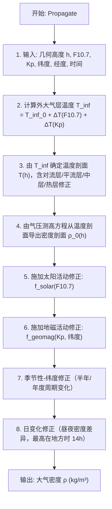

# 算法卡片 -- Jacchia-Roberts 大气密度模型

> **状态**：draft
> **日期**：2026-06-11
> **索引证据**：function-index.jsonl (wsf_space, JacchiaRoberts)
> **关联文档**：space-integrating-propagator-card.md, space-piecewise-exponential-atmosphere-card.md

### 基础资料

- **算法名称**：Jacchia-Roberts Atmosphere Model（Jacchia-Roberts 大气密度模型）
- **算法所属模块**：wsf_space（空间/轨道力学模块）
- **算法功能**：计算地球高层大气（一般 > 90 km）的大气密度，用于高精度大气阻力计算。该模型考虑太阳 10.7 cm 辐射通量 ($F_{10.7}$) 和地磁活动指数 ($K_p$) 对大气的加热和膨胀效应——太阳活动增强时高层大气升温膨胀，密度增大。属于 Jacchia 1977 模型族。

### 算法流程

Jacchia-Roberts 模型是轨道力学领域的高保真大气密度模型。其核心假设是：高层大气的密度和温度由太阳极紫外辐射（以 $F_{10.7}$ 代理）和地磁活动（以 $K_p$ 代理）主导。太阳活动增强时，外球温度 $T_\infty$ 升高，大气标高增大，高层密度显著增加（最高可达平静期的 10-100 倍）。

### 算法变量和常量

#### 输入变量

| 变量名 | 类型 | 中文说明 | 所属函数 (Method) |
|--------|------|----------|-------------------|
| `h` | double | 几何高度 (m) | Propagate |
| `F10_7` | double | 太阳 10.7 cm 辐射通量 (sfu, 1 sfu = 10⁻²² W/(m²·Hz)) | Propagate |
| `Kp` | double | 地磁活动指数 (0-9) | Propagate |
| `latitude` | double | 地心纬度 (rad) | Propagate |
| `longitude` | double | 地心经度 (rad) | Propagate |
| `time` | double | 儒略日或纪元时间 (s)，用于季节性和昼夜修正 | Propagate |
| `r_eci` | UtVector3 | ECI 位置矢量 (m) | Propagate |

#### 输出变量

| 变量名 | 类型 | 中文说明 | 所属函数 (Method) |
|--------|------|----------|-------------------|
| `rho` | double | 大气密度 (kg/m³) | Propagate |
| `T` | double | 大气温度 (K) | Initialize |
| `scale_height` | double | 标高 (m) | Initialize |

#### 常量

| 常量名 | 类型 | 值 | 中文说明 | 所属函数 (Method) |
|--------|------|-----|----------|-------------------|
| `T_inf_0` | double | 查表 | 基准外球温度（对应 $F_{10.7}$ 平均值，约 1000 K） | Initialize |
| `R_gas` | double | 287.058 | 气体常数 (J/(kg·K)) | Initialize |
| `M_molar` | double | 28.9644 | 大气分子量 (kg/kmol) | Initialize |
| `g0` | double | 9.80665 | 海平面重力加速度 (m/s²) | Initialize |
| `R_E` | double | 6378137.0 | 地球赤道半径 (m) | Initialize |

### 关键数学公式

1. **Jacchia-Roberts 大气模型密度**：

   密度为基准剖面与太阳/地磁活动修正因子的乘积：

   $\rho(h, F_{10.7}, K_p) = \rho_0(h) \cdot f_{solar}(F_{10.7}) \cdot f_{geomag}(K_p)$

   其中 $\rho_0(h)$ 为基准大气密度剖面（对应平均太阳活动水平），$f_{solar}$ 和 $f_{geomag}$ 分别为太阳活动和地磁活动的修正因子。

2. **外球温度修正**（核心驱动参数）：

   $T_\infty = T_{\infty,0} + \Delta T(F_{10.7}) + \Delta T(K_p)$

   - $\Delta T(F_{10.7})$ 为太阳 EUV 辐射加热项，与 $F_{10.7}$ 代理值呈近似线性关系。
   - $\Delta T(K_p)$ 为地磁暴加热项，高 $K_p$ 时高纬度地区温度显著升高。

   外球温度 $T_\infty$ 决定了整个高层大气的温度剖面，进而决定密度剖面。

3. **温度剖面**：

   Jacchia 模型从地面到外球定义了完整的温度-高度剖面，包含多个特征层：

   - 对流层（0-11 km）：温度线性递减。
   - 平流层（11-25 km）：温度恒定（~216.65 K）。
   - 中层（25-90 km）：温度线性递增。
   - 热层（> 90 km）：温度从中层顶值指数趋近 $T_\infty$。

4. **气压测高方程（从温度剖面到密度剖面）**：

   $\frac{dp}{dh} = -\rho \cdot g = -\frac{p \cdot M \cdot g}{R \cdot T(h)}$

   积分得到压力 $p(h)$，再通过理想气体状态方程得到密度：

   $\rho(h) = \frac{p(h) \cdot M}{R \cdot T(h)}$

5. **太阳活动修正因子**：

   $f_{solar}(F_{10.7})$ 为 $F_{10.7}$ 的函数，通常包含 81 天平均 $F_{10.7}$（缓变分量）和前一天的瞬时 $F_{10.7}$（短时波动分量）。

6. **地磁活动修正因子**：

   $f_{geomag}(K_p, \phi)$ 依赖于 $K_p$ 指数和地磁纬度 $\phi$。地磁暴时高纬度地区获得额外加热，密度增大尤为显著。

7. **附加修正项**：

   - **半年周期**：4 月和 10 月密度最高，1 月和 7 月密度最低（与地磁轴-太阳风夹角有关）。
   - **昼夜变化**：地方时 14:00 密度最高，04:00 密度最低。
   - **纬度修正**：极区密度远高于赤道。

### 内部状态

下表列出 `JacchiaRobertsAtmosphere` 类中跨帧持久化的成员变量。该模型的成员变量分为两类：配置参数（`mF107a`、`mF107`、`mKp`）在初始化或输入处理时设置，中间变量（`mRoot1`、`mRoot2` 等）在密度计算过程中被填充以提升重复计算效率。

| 变量名 | 类型 | 初始值 | 物理含义 | 更新时机 |
|--------|------|--------|----------|----------|
| `mF107a` | double | 150.0 | 81 天平均太阳 10.7 cm 辐射通量 ($\bar{F}_{10.7}$)，单位 sfu ($10^{-22}$ W/(m^2·Hz)) | 构造时设为 150.0（默认平静期值），可通过 `SetAverageSolarFlux()` 修改或通过脚本输入 `average_solar_flux` 命令设置 |
| `mF107` | double | 150.0 | 前一日瞬时太阳 10.7 cm 辐射通量 ($F_{10.7}$)，单位 sfu | 构造时设为 150.0，可通过 `SetSolarFlux()` 修改或通过脚本输入 `solar_flux` 命令设置 |
| `mKp` | double | 0.0 | 地磁活动指数 $K_p$，取值范围 [0, 9] | 构造时设为 0.0（地磁平静），可通过 `SetGeomagneticIndex()` 修改或通过脚本输入 `geomagnetic_index` 命令设置（输入时强制校验 [0, 9] 范围） |
| `mRoot1` | mutable double | — | 温度多项式的第一个实根，在高度 < 125 km 时通过 Newton 迭代求解 | 每次调用 `Exotherm()` 时若 `alt_km <= 125` 则重新计算 |
| `mRoot2` | mutable double | — | 温度多项式的第二个实根，经缩减法 (deflation) 后求解 | 同 `mRoot1`，在 `Roots()` 和 `DeflatePolynomial()` 中依次计算 |
| `mX_Root` | mutable double | — | 缩减法后的复数根实部，用于 Rho100 和 Rho125 中的多项式分解 | 同 `mRoot1` |
| `mY_Root` | mutable double | — | 缩减法后的复数根虚部绝对值，用于 Rho100 中 atan 项计算 | 同 `mRoot1` |
| `mTinfinity` | mutable double | — | 外球温度 $T_\infty$ (K)，整个高层大气温度剖面的渐近值 | 每次调用 `Exotherm()` 时计算，是密度计算的核心中间量 |
| `mTx` | mutable double | — | 中间温度 $T_x$ (K)，用于描述温度从 125 km 到 $T_\infty$ 的过渡 | 每次调用 `Exotherm()` 时从 $T_\infty$ 导出 |
| `mSum` | mutable double | — | 温度多项式的值和 (K)，用于高度 > 125 km 的温度 profile 计算 | 每次调用 `Exotherm()` 时计算 |
| `mX_Temp` | mutable double | — | 太阳辐射加热项 $T_x = 379 + 3.24 \cdot \bar{F}_{10.7} + 1.3 \cdot (F_{10.7} - \bar{F}_{10.7})$ (K) | 每次调用 `JacchiaRoberts()` 入口时由太阳通量重新计算 |
| `mLowAltWarned` | mutable bool | false | 低于 100 km 警告是否已打印的标志位，防止重复输出日志 | 首次在 < 100 km 高度调用 `GetDensity()` 时置为 true |

### 变量映射表

| 代码变量 | 数学符号 | 含义 |
|----------|----------|------|
| `height_km` | $h$ (km) | 几何高度，以千米为单位（输入为米，内部除以 1000） |
| `mF107` | $F_{10.7}$ | 前一日瞬时太阳 10.7 cm 辐射通量 (sfu) |
| `mF107a` | $\bar{F}_{10.7}$ | 81 天平均太阳 10.7 cm 辐射通量 (sfu) |
| `mKp` | $K_p$ | 地磁活动指数 (0-9) |
| `mX_Temp` | $T_x$ | 太阳辐射加热诱导的高层温度 (K)，含 $F_{10.7}$ 和 $\bar{F}_{10.7}$ 的线性组合 |
| `mTinfinity` | $T_\infty$ | 外球渐近温度 (K)，决定高层大气温度剖面的极限值 |
| `mTx` | $T_{125}$ | 125 km 高度处温度 (K)，温度 profile 的过渡参考点 |
| `sunDec` | $\delta_\odot$ | 太阳赤纬 (rad) |
| `solarLon` | $\lambda_\odot$ | 太阳黄经 (rad) |
| `hourAngle` | $H$ | 太阳时角 (rad) |
| `theta` | $\theta$ | 纬度与太阳赤纬之和的一半 (rad) |
| `eta` | $\eta$ | 纬度与太阳赤纬之差的一半 (rad) |
| `tau` | $\tau$ | 太阳时角偏移后的变量 (rad) |
| `t_500` | $T_{500}$ | 500 km 高度处温度 (K)，用于高层氢密度计算 |
| `a1Time` | $t_{A.1}$ | A.1 时间系统日期（儒略日 + ΔAT 修正），用于半年/年度周期和季节-纬度修正 |
| `density` (内部) | $\rho$ (g/m^3 内部) | 密度，内部计算以 g/m^3 为单位，最终乘以 1000 转为 kg/m^3 |
| `cRHO_ZERO` | $\rho_0$ | 90 km 以下恒定密度 3.46e-6 g/m^3 |
| `cG_ZERO` | $g_0$ | 海平面重力加速度 9.80665 m/s^2 |
| `cGAS_CON` | $R^*$ | 普适气体常数 8.31432 J/(K·mol) |
| `cN_AVOGADRO` | $N_A$ | 阿伏伽德罗常数 6.022045e23 |
| `cMOL_MASS[i]` | $M_i$ | 大气组分 i 的分子量 (g/mol)：N2=28.0134, Ar=39.948, He=4.0026, O2=31.9988, O=15.9994, H=1.00797 |
| `cM_ZERO` | $M_0$ | 海平面大气平均分子量 28.82678 g/mol |

### 边界条件

下表列出模型中影响数值稳定性、输入合法性、限幅和回退行为的关键边界条件。Jacchia-Roberts 模型将大气分为多个高度区域分别处理，每个区域有独立的数值方法。

| 条件 | 所在位置 | 处理方式 | 说明 |
|------|----------|----------|------|
| 高度 <= 0 km | `GetDensity()` | 直接返回 `cRHO_ZERO` (3.46e-6 g/m^3) | 地下或海平面不适用高层大气模型，退回常量值 |
| 0 < 高度 <= 90 km | `JacchiaRoberts()` | 密度 = `cRHO_ZERO` | 模型有效范围 90-2500 km，90 km 以下简单地使用常数密度 |
| 90 < 高度 < 100 km | `JacchiaRoberts()` | 使用 `Rho100()` 计算，结合温度多项式求根 | 过渡区，需要 Newton 求解多项式根，收敛容差 1.0e-14 |
| 100 < 高度 <= 125 km | `JacchiaRoberts()` | 使用 `Rho125()` 计算，含大气组分密度求和（N2, Ar, He, O2, O） | 中高层，5 种组分独立计算后求和 |
| 125 < 高度 <= 2500 km | `JacchiaRoberts()` | 使用 `RhoHigh()` 计算，含 H 组分（仅 > 500 km） | 高层热大气，温度按指数趋近 $T_\infty$ |
| 高度 > 2500 km | `JacchiaRoberts()` | 密度 = 0.0 | 模型外推上限，超过 2500 km 密度视为零 |
| 高度 <= 100 km 首次调用 | `GetDensity()` | 打印 warning 日志"JR 模型适用于 100 km 以上"，`mLowAltWarned` 置 true | 警告用户模型精度下降，后续调用不再重复警告 |
| `mF107` 输入校验 | `ProcessInput()` | `aInput.ValueGreater(mF107, 0.0)` | 太阳通量必须为正数 |
| `mF107a` 输入校验 | `ProcessInput()` | `aInput.ValueGreater(mF107a, 0.0)` | 平均太阳通量必须为正数 |
| `mKp` 输入校验 | `ProcessInput()` | `aInput.ValueInClosedRange(mKp, 0.0, 9.0)` | 地磁指数严格限制在 [0, 9] |
| 高度 < 200 km 地磁修正 | `RhoCorrection()` | 施加 `0.012 * Kp + 0.000012 * exp(Kp)` 的日志修正 | 低层大气受地磁活动影响较小但不可忽略 |
| 高度 >= 200 km 地磁修正 | `RhoCorrection()` | 地磁修正项为 0.0 | 高层由温度剖面中的 Kp 项单独处理 |
| 多项式求根收敛 | `Roots()` | Newton 迭代到 `dif <= 1.0e-14` | 相对变化量收敛判据，防止无限循环（无迭代次数上限，依赖收敛性） |
| 除零保护 (RhoHigh) | `RhoHigh()` 中 `fabs(aSunDec)` | He 修正项使用 `fabs(sunDec)` 作为除数和符号判断 | 当太阳赤纬为 0（春分/秋分）时 He 修正因子 f = 1.0，避免除零和符号不确定 |

### 提取策略

该算法的信息从以下源文件按以下方式提取：

| 源文件 | 提取方式 | 提取内容 |
|--------|----------|----------|
| `WsfJacchiaRobertsAtmosphere.hpp` | 阅读头文件 | 类成员变量的名称、类型、初始值和注释说明。`mF107a`、`mF107`、`mKp` 有明确的 getter/setter。`mutable` 标记的中间变量揭示了哪些量在单次密度计算中会被重用以提升效率。 |
| `WsfJacchiaRobertsAtmosphere.cpp` | 逐函数分析 | 完整的数学实现。匿名 namespace 中的 `constexpr`/`const` 常量（`cRHO_ZERO`、`cG_ZERO`、`cGAS_CON`、`cN_AVOGADRO`、`cMOL_MASS[6]` 等）是物理常数的真实来源。高度分段逻辑（`if (height_km <= 90.0)` → `else if (height_km < 100.0)` → ...）定义了模型的适用范围。 |
| `WsfAtmosphere.hpp` | 阅读头文件 | 基类 `Atmosphere` 接口，包含 `GetDensity()` 虚函数签名和公共工具变量（如 `mCentralBodyPtr` 用于获取椭球参数）。 |
| `WsfScriptJacchiaRobertsAtmosphere.cpp` | 阅读脚本绑定 | 确认 `solar_flux`、`average_solar_flux`、`geomagnetic_index` 三个输入命令及其参数校验逻辑。 |
| `function-index.jsonl` | JSON 行检索 | 通过 `grep` 搜索 `JacchiaRoberts` 确认相关条目。 |

**提取流程**：
1. 从头文件的 private/mutable 成员变量中提取"内部状态"。
2. 从 .cpp 开头的注释块确认参考文献来源（GMAT R2018a 移植、Vallado 第 4 版附录 B）。
3. 从 .cpp 的 `GetDensity()` 入口函数开始，顺藤摸瓜分析 `JacchiaRoberts()` → `Exotherm()` → `Rho100()`/`Rho125()`/`RhoHigh()` → `RhoCorrection()` 的完整调用链。
4. 在每个函数中标记高度分段条件（if/else if 分支）作为边界条件。
5. 从 `ProcessInput()` 中提取输入校验规则（`ValueGreater`、`ValueInClosedRange`）。
6. 逐段提取匿名 namespace 中的物理常数和多项式系数表作为"变量映射表"的基础。

### 源码位置

| File | Symbol | 中文说明 |
|------|--------|----------|
| [WsfJacchiaRobertsAtmosphere.cpp](source_root/src/core/wsf_space/source/WsfJacchiaRobertsAtmosphere.cpp) | `Propagate()` | Jacchia-Roberts 1977 大气密度计算 — 含 $F_{10.7}$ 和 $K_p$ 修正 |
| 同上 | `Initialize()` | 初始化模型参数（外球基准温度、温度剖面参数） |
| [WsfAtmosphere.hpp](source_root/src/core/wsf_space/source/WsfAtmosphere.hpp) | `Atmosphere` | 大气模型基类接口 |

### 可移植性评分

**可移植性**：高 — Jacchia-Roberts 1977 模型的经验系数表公开可查（Jacchia, 1977; SAO Special Report 375），所有修正因子有明确的解析表达式。不依赖 AFSIM 核心库。单位统一（SI）。移植时需注意：$F_{10.7}$ 和 $K_p$ 数据需要外部观测源或用户输入；Jacchia-Roberts 的经验系数包含大量分段表，需完整移植。
