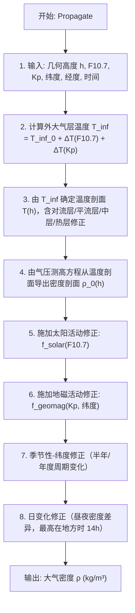

# 算法卡片 -- Jacchia-Roberts 大气密度模型

> **状态**：draft
> **日期**：2026-06-11
> **索引证据**：function-index.jsonl (wsf_space, JacchiaRoberts)
> **关联文档**：space-integrating-propagator-card.md, space-piecewise-exponential-atmosphere-card.md

### 基础资料

- **算法名称**：Jacchia-Roberts Atmosphere Model（Jacchia-Roberts 大气密度模型）
- **算法所属模块**：wsf_space（空间/轨道力学模块）
- **算法功能**：计算地球高层大气（一般 > 90 km）的大气密度，用于高精度大气阻力计算。该模型考虑太阳 10.7 cm 辐射通量 ($F_{10.7}$) 和地磁活动指数 ($K_p$) 对大气的加热和膨胀效应——太阳活动增强时高层大气升温膨胀，密度增大。属于 Jacchia 1977 模型族。

### 算法流程

Jacchia-Roberts 模型是轨道力学领域的高保真大气密度模型。其核心假设是：高层大气的密度和温度由太阳极紫外辐射（以 $F_{10.7}$ 代理）和地磁活动（以 $K_p$ 代理）主导。太阳活动增强时，外球温度 $T_\infty$ 升高，大气标高增大，高层密度显著增加（最高可达平静期的 10-100 倍）。

### 算法变量和常量

#### 输入变量

| 变量名 | 类型 | 中文说明 | 所属函数 (Method) |
|--------|------|----------|-------------------|
| `h` | double | 几何高度 (m) | Propagate |
| `F10_7` | double | 太阳 10.7 cm 辐射通量 (sfu, 1 sfu = 10⁻²² W/(m²·Hz)) | Propagate |
| `Kp` | double | 地磁活动指数 (0-9) | Propagate |
| `latitude` | double | 地心纬度 (rad) | Propagate |
| `longitude` | double | 地心经度 (rad) | Propagate |
| `time` | double | 儒略日或纪元时间 (s)，用于季节性和昼夜修正 | Propagate |
| `r_eci` | UtVector3 | ECI 位置矢量 (m) | Propagate |

#### 输出变量

| 变量名 | 类型 | 中文说明 | 所属函数 (Method) |
|--------|------|----------|-------------------|
| `rho` | double | 大气密度 (kg/m³) | Propagate |
| `T` | double | 大气温度 (K) | Initialize |
| `scale_height` | double | 标高 (m) | Initialize |

#### 常量

| 常量名 | 类型 | 值 | 中文说明 | 所属函数 (Method) |
|--------|------|-----|----------|-------------------|
| `T_inf_0` | double | 查表 | 基准外球温度（对应 $F_{10.7}$ 平均值，约 1000 K） | Initialize |
| `R_gas` | double | 287.058 | 气体常数 (J/(kg·K)) | Initialize |
| `M_molar` | double | 28.9644 | 大气分子量 (kg/kmol) | Initialize |
| `g0` | double | 9.80665 | 海平面重力加速度 (m/s²) | Initialize |
| `R_E` | double | 6378137.0 | 地球赤道半径 (m) | Initialize |

### 关键数学公式

1. **Jacchia-Roberts 大气模型密度**：

   密度为基准剖面与太阳/地磁活动修正因子的乘积：

   $\rho(h, F_{10.7}, K_p) = \rho_0(h) \cdot f_{solar}(F_{10.7}) \cdot f_{geomag}(K_p)$

   其中 $\rho_0(h)$ 为基准大气密度剖面（对应平均太阳活动水平），$f_{solar}$ 和 $f_{geomag}$ 分别为太阳活动和地磁活动的修正因子。

2. **外球温度修正**（核心驱动参数）：

   $T_\infty = T_{\infty,0} + \Delta T(F_{10.7}) + \Delta T(K_p)$

   - $\Delta T(F_{10.7})$ 为太阳 EUV 辐射加热项，与 $F_{10.7}$ 代理值呈近似线性关系。
   - $\Delta T(K_p)$ 为地磁暴加热项，高 $K_p$ 时高纬度地区温度显著升高。

   外球温度 $T_\infty$ 决定了整个高层大气的温度剖面，进而决定密度剖面。

3. **温度剖面**：

   Jacchia 模型从地面到外球定义了完整的温度-高度剖面，包含多个特征层：

   - 对流层（0-11 km）：温度线性递减。
   - 平流层（11-25 km）：温度恒定（~216.65 K）。
   - 中层（25-90 km）：温度线性递增。
   - 热层（> 90 km）：温度从中层顶值指数趋近 $T_\infty$。

4. **气压测高方程（从温度剖面到密度剖面）**：

   $\frac{dp}{dh} = -\rho \cdot g = -\frac{p \cdot M \cdot g}{R \cdot T(h)}$

   积分得到压力 $p(h)$，再通过理想气体状态方程得到密度：

   $\rho(h) = \frac{p(h) \cdot M}{R \cdot T(h)}$

5. **太阳活动修正因子**：

   $f_{solar}(F_{10.7})$ 为 $F_{10.7}$ 的函数，通常包含 81 天平均 $F_{10.7}$（缓变分量）和前一天的瞬时 $F_{10.7}$（短时波动分量）。

6. **地磁活动修正因子**：

   $f_{geomag}(K_p, \phi)$ 依赖于 $K_p$ 指数和地磁纬度 $\phi$。地磁暴时高纬度地区获得额外加热，密度增大尤为显著。

7. **附加修正项**：

   - **半年周期**：4 月和 10 月密度最高，1 月和 7 月密度最低（与地磁轴-太阳风夹角有关）。
   - **昼夜变化**：地方时 14:00 密度最高，04:00 密度最低。
   - **纬度修正**：极区密度远高于赤道。

### 源码位置

| File | Symbol | 中文说明 |
|------|--------|----------|
| [WsfJacchiaRobertsAtmosphere.cpp](source_root/src/core/wsf_space/source/WsfJacchiaRobertsAtmosphere.cpp) | `Propagate()` | Jacchia-Roberts 1977 大气密度计算 — 含 $F_{10.7}$ 和 $K_p$ 修正 |
| 同上 | `Initialize()` | 初始化模型参数（外球基准温度、温度剖面参数） |
| [WsfAtmosphere.hpp](source_root/src/core/wsf_space/source/WsfAtmosphere.hpp) | `Atmosphere` | 大气模型基类接口 |

### 可移植性评分

**可移植性**：高 — Jacchia-Roberts 1977 模型的经验系数表公开可查（Jacchia, 1977; SAO Special Report 375），所有修正因子有明确的解析表达式。不依赖 AFSIM 核心库。单位统一（SI）。移植时需注意：$F_{10.7}$ 和 $K_p$ 数据需要外部观测源或用户输入；Jacchia-Roberts 的经验系数包含大量分段表，需完整移植。
