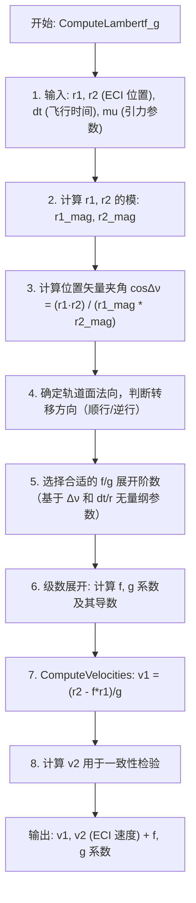

# 算法卡片 -- Lambert 问题求解器

> **状态**：draft
> **日期**：2026-06-11
> **索引证据**：function-index.jsonl (ComputeLambertf_g, ComputeVelocities 均为 math 标记)
> **关联文档**：space-integrating-propagator-card.md, space-orbital-maneuvers-card.md, space-rendezvous-targeting-card.md, space-angles-only-iod-card.md

### 基础资料

- **算法名称**：Lambert Problem Solver（Lambert 问题求解器）
- **算法所属模块**：wsf_space（空间/轨道力学模块）
- **算法功能**：求解经典 Lambert 边界值问题——已知两个位置矢量 $\mathbf{r}_1, \mathbf{r}_2$ 和飞行时间 $\Delta t$，确定连接两点的轨道和对应的速度矢量 $\mathbf{v}_1, \mathbf{v}_2$。核心采用 f/g 级数展开方法。

### 算法流程

Lambert 问题为航天动力学经典边界值问题：给定空间两点和转移时间，唯一确定开普勒轨道。该方法适用于交会瞄准（由目标位置反推发射速度）、轨道转移设计和初始轨道确定。

### 算法变量和常量

#### 输入变量

| 变量名 | 类型 | 中文说明 | 所属函数 (Method) |
|--------|------|----------|-------------------|
| `r1` | UtVector3 | 第一次观测/起始的 ECI 位置矢量 (m) | ComputeLambertf_g |
| `r2` | UtVector3 | 第二次观测/终端的 ECI 位置矢量 (m) | ComputeLambertf_g |
| `dt` | double | 两次位置之间的飞行时间 (s) | ComputeLambertf_g |
| `mu` | double | 中心天体引力参数 (km³/s²) | ComputeLambertf_g |

#### 输出变量

| 变量名 | 类型 | 中文说明 | 所属函数 (Method) |
|--------|------|----------|-------------------|
| `v1` | UtVector3 | 第一次位置对应的 ECI 速度矢量 (m/s) | ComputeVelocities |
| `v2` | UtVector3 | 第二次位置对应的 ECI 速度矢量 (m/s) | ComputeVelocities |
| `f` | double | Lagrange f 系数 | ComputeLambertf_g |
| `g` | double | Lagrange g 系数 | ComputeLambertf_g |

#### 常量

| 常量名 | 类型 | 值 | 中文说明 | 所属函数 (Method) |
|--------|------|-----|----------|-------------------|
| `epsilon_lin` | double | 1e-8 | 收敛容差 | ComputeLambertf_g |
| `max_iterations` | int | 50 | 最大迭代次数 | ComputeLambertf_g |
| `mu_earth` | double | 398600.44 km³/s² | 地球引力参数 | ComputeLambertf_g |

### 关键数学公式

1. **Lambert 问题的 f/g 函数解**：

   从两个位置矢量 $\mathbf{r}_1, \mathbf{r}_2$ 和时间差 $\Delta t$ 计算轨道速度：

   $\mathbf{v}_1 = \frac{\mathbf{r}_2 - f \cdot \mathbf{r}_1}{g}$

   $\mathbf{v}_2 = \frac{g\dot{f} \cdot \mathbf{r}_2 - \mathbf{r}_1}{g}$

   其中 $f, g$ 为 Lagrange 系数，通过级数展开计算：

   $f = 1 - \frac{a}{r_1}(1 - \cos\Delta E)$

   $g = \Delta t - \sqrt{\frac{a^3}{\mu}}(\Delta E - \sin\Delta E)$

2. **f/g 级数展开**（小转移角情况）：

   当转移角度较小时，使用截断级数以避免数值问题：

   $f = 1 - \frac{\mu}{2 r_1^3} \Delta t^2 + \frac{\mu (\mathbf{r}_1 \cdot \mathbf{v}_1)}{2 r_1^5} \Delta t^3 + ...$

   $g = \Delta t - \frac{\mu}{6 r_1^3} \Delta t^3 + ...$

3. **Lagrange 系数的一般性质**：

   对于任意开普勒轨道：
   $\mathbf{r}(t) = f(t) \cdot \mathbf{r}_0 + g(t) \cdot \mathbf{v}_0$

   $\mathbf{v}(t) = \dot{f}(t) \cdot \mathbf{r}_0 + \dot{g}(t) \cdot \mathbf{v}_0$

   行列式条件：$f \cdot \dot{g} - \dot{f} \cdot g = 1$（确保轨道运动为辛变换）。

### 内部状态

Lambert 求解器本身是无状态的纯函数（`ComputeLambertf_g` 和 `ComputeVelocities` 均为 `const` 方法，不修改类成员）。但调用这些函数的宿主类 `WsfOrbitDeterminationFusion` 维护以下跨帧持久化状态：

| 成员变量 | 类型 | 初始值 | 物理含义 | 更新时机 |
|----------|------|--------|----------|----------|
| `mLambertConvergenceTolerance` | double | `1.0e-12` | Lambert Universal 求解器的收敛容差。传递给 `UtLambertProblem::Universal()` 的第五个参数，控制迭代退出条件 | 通过 `lambert_convergence_tolerance` 输入命令在场景加载时配置；运行期不变 |
| `mRangeErrorFactor` | double | `0.05` | 伪距离误差因子。当仅有角度测量时，用此因子乘以当前距离估算值作为虚假距离测量的误差（`rangeError = range * mRangeErrorFactor`） | 通过 `range_error_factor` 输入命令配置，取值范围 \[1e-7, 0.5\] |
| `mAnglesOnlyLinearTolerance` | double | `10.0` (米) | 仅角度 IOD 中距离向量迭代的线性收敛容差。当两次迭代的最大距离变化低于此值，认为收敛 | 通过 `angles_only_linear_tolerance` 输入命令配置，单位为长度 |
| `mAnglesOnlyMaxIterations` | unsigned | `200` | 仅角度 IOD 迭代的最大循环次数 | 通过 `angles_only_maximum_iterations` 输入命令配置 |
| `mNumberOfAnglesMeasurementsNeeded` | unsigned | `5` | 触发仅角度 IOD 所需的最小角度测量数量。必须 >= 3 | 通过 `number_of_angle_measurements` 输入命令配置 |
| `mDebug` | bool | `false` | 调试输出开关。开启后打印中间收敛过程、迭代次数、位置偏差等诊断数据 | 通过 `debug` 输入命令开关 |
| `mPrototypeFilter` | WsfOrbitDeterminationKalmanFilter | 默认构造 | Kalman 滤波器原型。IOD 成功后用此原型克隆生成新滤波器，并装配到轨道传播器上 | 通过 `process_noise_sigmas_XYZ` 等命令配置，运行期不变 |

### 变量映射表

f/g 级数展开（`ComputeLambertf_g`，实现在 cpp 第 870-900 行，对应 Bate-Mueller-White 教材公式 5.5-26 和 5.5-27）涉及的内部变量：

| 代码变量 | 数学符号 | 含义 |
|----------|----------|------|
| `rMag` | $r$ | 参考位置矢量 $\mathbf{r}$ 的模（到中心天体地心的距离） |
| `rDotV` | $\mathbf{r} \cdot \mathbf{v}$ | 位置矢量与速度矢量的点积 |
| `u` | $\mu / r^3$ | 引力参数除以距离立方，无量纲化引力项 |
| `p` | $(\mathbf{r} \cdot \mathbf{v}) / r^2$ | 点积除以距离平方，用于级数展开的中间量 |
| `q` | $v^2 / r^2 - u$ | 速度平方除以距离平方减去引力项，能量相关无量纲量 |
| `dt2`, `dt3`, `dt4`, `dt5`, `dt6` | $\Delta t^2, \Delta t^3, \ldots, \Delta t^6$ | 时间步长的高次幂，用于 6 阶级数截断 |
| `p2`, `q2`, `u2` | $p^2, q^2, u^2$ | 中间量的平方 |
| `up`, `up2` | $u \cdot p, u \cdot p^2$ | 交叉项 |
| `aF` | $f$ | 输出：Lagrange f 系数（位置系数） |
| `aG` | $g$ | 输出：Lagrange g 系数（速度系数） |

`ComputeVelocities` 中 Lambert 调用：

| 代码变量 | 数学符号 | 含义 |
|----------|----------|------|
| `aLocECI[i1]` / `aLocECI[i2]` | $\mathbf{r}_1, \mathbf{r}_2$ | 两次观测的 ECI 位置矢量 |
| `dt` | $\Delta t$ | 两次观测之间的时间差 |
| `result` | — | `UtLambertProblem::Universal()` 的返回结果，包含初末速度 |
| `result.GetInitialVelocity()` | $\mathbf{v}_1$ | Lambert 求解的初始速度 |
| `result.GetFinalVelocity()` | $\mathbf{v}_2$ | Lambert 求解的末端速度 |

### 边界条件

1. **f/g 级数展开的数值稳定性**：
   - 级数截断到 6 阶（$\Delta t^6$ 项），对于转移角较小的情况（通常 $\Delta\theta < 30^\circ$）精度充足
   - 当 Lambert Universal 求解器失败（`result.IsSolution()` 返回 false）时，`ComputeVelocities` 回退到圆轨道活力公式近似：将两位置差方向作为速度方向，速度大小为 $\sqrt{\mu/r_1}$
   - `ComputeRange()` 中 `asin()` 参数通过 `std::max(-1.0, std::min(1.0, ...))` 限幅，防止浮点舍入导致定义域越界

2. **Lambert Universal 求解器的保护**：
   - 调用 `UtLambertProblem::Universal()` 时传入 `mLambertConvergenceTolerance = 1e-12` 作为收敛容差
   - 传入 `GetCentralBody().GetEllipsoid()` 用于判断转移轨道是否与中心天体表面相交
   - `FuseInitialLocations` 中额外检查解是否为双曲线轨道：`propPtr->HyperbolicPropagationAllowed()` 为 true 才允许双曲解

3. **无效输入处理**：
   - `AnglesOnlyInitialGuess` 中如果 `dt <= 0.0`，直接返回 `false`（不尝试求解，避免除零或反向传播）
   - 初始猜测的半径搜索范围限定在 `[cMIN_RADIUS, cMAX_RADIUS]` 之间（`cMIN_RADIUS = 地球半径 + 30km`，`cMAX_RADIUS = 200000km`）
   - 最多迭代 `200` 次，超过则发出警告并返回 `true`（即使可能未完全收敛）

4. **限幅阈值与回退行为**：
   - Lambert 解失败时：位置确定（IOD）整体失败，不对轨道传播器做任何初始化，返回 `false`
   - `FuseInitialLocations` 要求至少 2 个有效位置测量；不满足则跳过
   - `FuseInitialAngles` 要求至少 `mNumberOfAnglesMeasurementsNeeded`（默认 5）个有效角度测量；且航迹上不能已有传播器（避免重复初始化）

### 提取策略

**源文件与提取方式**：

| 源文件 | 提取内容 | 提取方式 |
|--------|----------|----------|
| `WsfOrbitDeterminationFusion.hpp` | 成员变量声明（`mLambertConvergenceTolerance` 等 7 个私有成员）、函数签名（`ComputeLambertf_g`, `ComputeVelocities`, `AnglesOnlyInitialGuess` 等） | 直接解析头文件的类声明部分，提取 `private:` 块中的成员变量及所有方法签名 |
| `WsfOrbitDeterminationFusion.cpp` | f/g 级数展开的 6 阶截断公式（第 870-900 行，含 Bate-Mueller-White 公式 5.5-26 和 5.5-27）、`ComputeVelocities` 中的 Lambert 调用与回退逻辑（第 805-835 行）、`AnglesOnlyInitialGuess` 的半径二分搜索与收敛判断（第 415-546 行）、`FuseInitialLocations` 和 `FuseInitialAngles` 的整体整合逻辑 | 分析 .cpp 文件的方法体，提取公式注释行（如 "Equation 5.5-26"）定位标准公式来源，回溯 eps 和 max_iter 等局部常量值 |
| `function-index.jsonl` | `ComputeLambertf_g`（line 3392）和 `ComputeVelocities`（line 3393）的索引记录，均标注 `algorithm_hint: "math"` | 搜索 `Lambert` 和 `f_g` 关键词获取函数名、参数签名、生命周期角色、算法分类标记 |

**提取依赖关系**：
- Lambert 求解器本身（`ComputeLambertf_g`, `ComputeVelocities`）是纯数学函数，无框架依赖，可直接从 .cpp 中提取公式后独立复现
- 求解器被 `AnglesOnlyKinematicSolution` → `FuseInitialAngles` 以及 `FuseInitialLocations` 调用，这两个高层函数依赖 `WsfTrack`, `WsfLocalTrack`, `UtLambertProblem::Universal` 等 AFSIM 框架类——提取时需区分纯算法层与框架胶水层
- 完整的 f/g 级数展开公式已在 `ComputeLambertf_g` 的注释中引用 Bate-Mueller-White 教材（pp.256-258），可据此直接对照标准文献验证

### 源码位置

| File | Symbol | 中文说明 |
|------|--------|----------|
| [WsfOrbitDeterminationFusion.hpp](source_root/src/core/wsf_space/source/WsfOrbitDeterminationFusion.hpp) | `WsfOrbitDeterminationFusion` | 轨道确定融合策略主类 |
| 同上 | `ComputeLambertf_g()` | Lambert f/g 级数展开计算 |
| 同上 | `ComputeVelocities()` | 从位置+飞行时间求解速度 |

### 可移植性评分

**可移植性**：高 — Lambert 问题求解是经典的航天动力学算法（Battin, Vallado 等教材均有详述），f/g 级数展开为纯数学计算。不依赖专有物理引擎。移植只需三维矢量库和基本数学函数。
