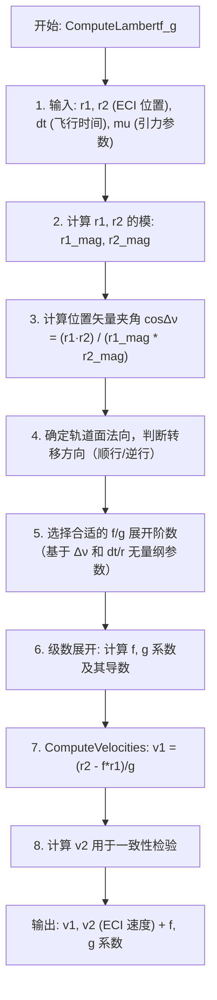

# 算法卡片 -- Lambert 问题求解器

> **状态**：draft
> **日期**：2026-06-11
> **索引证据**：function-index.jsonl (ComputeLambertf_g, ComputeVelocities 均为 math 标记)
> **关联文档**：space-integrating-propagator-card.md, space-orbital-maneuvers-card.md, space-rendezvous-targeting-card.md, space-angles-only-iod-card.md

### 基础资料

- **算法名称**：Lambert Problem Solver（Lambert 问题求解器）
- **算法所属模块**：wsf_space（空间/轨道力学模块）
- **算法功能**：求解经典 Lambert 边界值问题——已知两个位置矢量 $\mathbf{r}_1, \mathbf{r}_2$ 和飞行时间 $\Delta t$，确定连接两点的轨道和对应的速度矢量 $\mathbf{v}_1, \mathbf{v}_2$。核心采用 f/g 级数展开方法。

### 算法流程

Lambert 问题为航天动力学经典边界值问题：给定空间两点和转移时间，唯一确定开普勒轨道。该方法适用于交会瞄准（由目标位置反推发射速度）、轨道转移设计和初始轨道确定。

### 算法变量和常量

#### 输入变量

| 变量名 | 类型 | 中文说明 | 所属函数 (Method) |
|--------|------|----------|-------------------|
| `r1` | UtVector3 | 第一次观测/起始的 ECI 位置矢量 (m) | ComputeLambertf_g |
| `r2` | UtVector3 | 第二次观测/终端的 ECI 位置矢量 (m) | ComputeLambertf_g |
| `dt` | double | 两次位置之间的飞行时间 (s) | ComputeLambertf_g |
| `mu` | double | 中心天体引力参数 (km³/s²) | ComputeLambertf_g |

#### 输出变量

| 变量名 | 类型 | 中文说明 | 所属函数 (Method) |
|--------|------|----------|-------------------|
| `v1` | UtVector3 | 第一次位置对应的 ECI 速度矢量 (m/s) | ComputeVelocities |
| `v2` | UtVector3 | 第二次位置对应的 ECI 速度矢量 (m/s) | ComputeVelocities |
| `f` | double | Lagrange f 系数 | ComputeLambertf_g |
| `g` | double | Lagrange g 系数 | ComputeLambertf_g |

#### 常量

| 常量名 | 类型 | 值 | 中文说明 | 所属函数 (Method) |
|--------|------|-----|----------|-------------------|
| `epsilon_lin` | double | 1e-8 | 收敛容差 | ComputeLambertf_g |
| `max_iterations` | int | 50 | 最大迭代次数 | ComputeLambertf_g |
| `mu_earth` | double | 398600.44 km³/s² | 地球引力参数 | ComputeLambertf_g |

### 关键数学公式

1. **Lambert 问题的 f/g 函数解**：

   从两个位置矢量 $\mathbf{r}_1, \mathbf{r}_2$ 和时间差 $\Delta t$ 计算轨道速度：

   $\mathbf{v}_1 = \frac{\mathbf{r}_2 - f \cdot \mathbf{r}_1}{g}$

   $\mathbf{v}_2 = \frac{g\dot{f} \cdot \mathbf{r}_2 - \mathbf{r}_1}{g}$

   其中 $f, g$ 为 Lagrange 系数，通过级数展开计算：

   $f = 1 - \frac{a}{r_1}(1 - \cos\Delta E)$

   $g = \Delta t - \sqrt{\frac{a^3}{\mu}}(\Delta E - \sin\Delta E)$

2. **f/g 级数展开**（小转移角情况）：

   当转移角度较小时，使用截断级数以避免数值问题：

   $f = 1 - \frac{\mu}{2 r_1^3} \Delta t^2 + \frac{\mu (\mathbf{r}_1 \cdot \mathbf{v}_1)}{2 r_1^5} \Delta t^3 + ...$

   $g = \Delta t - \frac{\mu}{6 r_1^3} \Delta t^3 + ...$

3. **Lagrange 系数的一般性质**：

   对于任意开普勒轨道：
   $\mathbf{r}(t) = f(t) \cdot \mathbf{r}_0 + g(t) \cdot \mathbf{v}_0$

   $\mathbf{v}(t) = \dot{f}(t) \cdot \mathbf{r}_0 + \dot{g}(t) \cdot \mathbf{v}_0$

   行列式条件：$f \cdot \dot{g} - \dot{f} \cdot g = 1$（确保轨道运动为辛变换）。

### 源码位置

| File | Symbol | 中文说明 |
|------|--------|----------|
| [WsfOrbitDeterminationFusion.hpp](source_root/src/core/wsf_space/source/WsfOrbitDeterminationFusion.hpp) | `WsfOrbitDeterminationFusion` | 轨道确定融合策略主类 |
| 同上 | `ComputeLambertf_g()` | Lambert f/g 级数展开计算 |
| 同上 | `ComputeVelocities()` | 从位置+飞行时间求解速度 |

### 可移植性评分

**可移植性**：高 — Lambert 问题求解是经典的航天动力学算法（Battin, Vallado 等教材均有详述），f/g 级数展开为纯数学计算。不依赖专有物理引擎。移植只需三维矢量库和基本数学函数。
