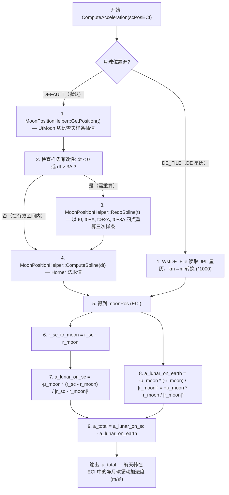

# 算法卡片 -- Moon 第三体引力摄动模型

> **状态**：draft
> **日期**：2026-06-24
> **索引证据**：function-index.jsonl (WsfMoonMonopoleTerm, MoonPositionHelper)
> **关联文档**：space-integrating-propagator-card.md, space-integrating-propagator-card.md

### 基础资料

- **算法名称**：Moon Third-Body Gravitational Perturbation -- Monopole Term（月球第三体引力摄动 -- 单极项）
- **算法所属模块**：wsf_space（空间/轨道力学模块）
- **算法功能**：计算航天器在地心赤道惯性坐标系（ECI）中受到的月球引力摄动加速度。该模型以月球为质量点（单极子近似），计算月球对航天器的直接引力加速度，并减去月球对地球（ECI 坐标系原点）的引力加速度，从而得到航天器在非惯性 ECI 坐标系中的净相对加速度。月球位置通过内置切比雪夫样条插值（默认）或 JPL DE 星历文件（可选）获取。这是轨道力学中标准的第三体摄动处理方法。

### 算法流程

该流程实现了标准第三体摄动公式。核心思想是：ECI 坐标系原点（地球质心）本身也在月球引力场中加速运动，因此 ECI 是一个非惯性系。航天器的"绝对"月球引力加速度必须减去 ECI 原点的"牵连"加速度，方能得到航天器在 ECI 坐标系中的表观加速度。月球被建模为质量点（单极子），即忽略月球的非球形引力场（J2 等）的效应。

### 算法变量和常量

#### 输入变量

| 变量名 | 类型 | 中文说明 | 所属函数 (Method) |
|--------|------|----------|-------------------|
| `scPosECI` | UtVector3 | 航天器在 ECI 坐标系中的位置矢量 (m) | ComputeAcceleration |
| `t` | double | 当前仿真时间（用于查询月球位置） | MoonPositionHelper::GetPosition |
| `moon_source` | enum | 月球位置来源：DEFAULT（UtMoon）或 DE_FILE（JPL 星历） | Initialize |
| `de_filename` | string | DE 星历文件路径（仅在 DE_FILE 模式下使用） | Initialize |

#### 输出变量

| 变量名 | 类型 | 中文说明 | 所属函数 (Method) |
|--------|------|----------|-------------------|
| `a_total` | UtVector3 | 航天器在 ECI 中的净月球摄动加速度 (m/s²) | ComputeAcceleration |
| `moonPos` | UtVector3 | 月球在 ECI 中的位置矢量 (m) | MoonPositionHelper::GetPosition / DE_File |
| `spline_value` | UtVector3 | 样条函数在当前 dt 处的插值结果 | MoonPositionHelper::ComputeSpline |

#### 常量

| 常量名 | 类型 | 值 | 中文说明 | 所属函数 (Method) |
|--------|------|-----|----------|-------------------|
| `μ_moon` | double | ~4.902800066e12 | 月球引力常数 (m³/s²)，通过 UtMoon::GetGravitationalParameter() 获取 | GetGravitationalParameter |
| `Δ` (delta) | double | 由 UtMoon 决定 | 切比雪夫样条的采样间隔 (s)，由 UtMoon 星历数据内部提供 | MoonPositionHelper |
| `cDE_KM_TO_M` | constexpr double | 1000.0 | DE 星历 km 到 m 的单位转换因子 | WsfDE_File (DE 模式) |

### 关键数学公式

1. **第三体摄动加速度（标准公式）**：

   $$\mathbf{a}_{\text{total}} = -\mu_m \frac{\mathbf{r}_{sc} - \mathbf{r}_m}{|\mathbf{r}_{sc} - \mathbf{r}_m|^3} - \left(-\mu_m \frac{-\mathbf{r}_m}{|\mathbf{r}_m|^3}\right)$$

   化简为：

   $$\mathbf{a}_{\text{total}} = -\mu_m \frac{\mathbf{r}_{sc} - \mathbf{r}_m}{|\mathbf{r}_{sc} - \mathbf{r}_m|^3} - \mu_m \frac{\mathbf{r}_m}{|\mathbf{r}_m|^3}$$

   或者写为标准摄动函数形式：

   $$\mathbf{a}_{\text{total}} = \mu_m \left[ \frac{\mathbf{r}_m - \mathbf{r}_{sc}}{|\mathbf{r}_{sc} - \mathbf{r}_m|^3} - \frac{\mathbf{r}_m}{|\mathbf{r}_m|^3} \right]$$

   其中：
   - $\mu_m$：月球引力常数 (m³/s²)
   - $\mathbf{r}_{sc}$：航天器在 ECI 中的位置矢量 (m)
   - $\mathbf{r}_m$：月球在 ECI 中的位置矢量 (m)
   - 第一项：月球对航天器的引力加速度
   - 第二项：月球对地球（ECI 原点）的引力加速度（牵连加速度的负值）

2. **物理意义**：该公式为限制性三体问题中航天器在非惯性 ECI 坐标系下的运动方程。ECI 原点（地球质心）以加速度 $\mathbf{a}_e = \mu_m \mathbf{r}_m / |\mathbf{r}_m|^3$ 向月球加速。在 ECI 坐标系中，航天器的表观加速度等于其绝对月球引力加速度减去 ECI 原点的加速度。

3. **四点三次样条插值 (MoonPositionHelper)**：

   样条在区间 $[t_0, t_0 + 3\Delta]$ 上定义，采样点为：
   $$\mathbf{p}_0 = \mathbf{r}_m(t_0), \quad \mathbf{p}_1 = \mathbf{r}_m(t_0 + \Delta), \quad \mathbf{p}_2 = \mathbf{r}_m(t_0 + 2\Delta), \quad \mathbf{p}_3 = \mathbf{r}_m(t_0 + 3\Delta)$$

   三次样条函数 $\mathbf{S}(dt)$ 满足 $\mathbf{S}(k\Delta) = \mathbf{p}_k$ for $k = 0, 1, 2, 3$。

4. **Horner 法求值 (ComputeSpline)**：

   $$\mathbf{S}(dt) = ((\mathbf{c}_3 \cdot dt + \mathbf{c}_2) \cdot dt + \mathbf{c}_1) \cdot dt + \mathbf{c}_0$$

   其中 $\mathbf{c}_0, \mathbf{c}_1, \mathbf{c}_2, \mathbf{c}_3$ 为三次多项式系数（三维矢量），由 RedoSpline 在构造样条时由 $\mathbf{p}_0, \mathbf{p}_1, \mathbf{p}_2, \mathbf{p}_3$ 确定。

5. **样条有效性条件**：

   设当前时间相对于样条起点 $t_0$ 的偏移量为 $dt = t - t_0$。样条有效当且仅当：
   $$0 \le dt \le 3\Delta$$
   即 $dt < 0$ 或 $dt > 3\Delta$ 时，样条需重新计算 (RedoSpline)。

### 内部状态

下表列出 `WsfMoonMonopoleTerm` 和 `MoonPositionHelper` 中跨帧持久化的成员变量。

| 变量名 | 类型 | 初始值 | 物理含义 | 更新时机 |
|--------|------|--------|----------|----------|
| `mMoonGravParam` | double | 由 UtMoon::GetGravitationalParameter() 获取 | 月球引力常数 $\mu_m$ (m³/s²) | Initialize 时一次设定 |
| `mMoonPositionSource` | enum | DEFAULT | 月球位置数据源：DEFAULT（UtMoon 切比雪夫样条）或 DE_FILE（JPL 星历） | Initialize 时由配置参数决定 |
| `mDE_File` | WsfDE_File 实例 | — | JPL DE 星历文件读取器（仅在 DE_FILE 模式下使用） | Initialize 时若选择 DE_FILE 则打开文件 |
| `mSplineValid` | bool | false | 样条是否在有效区间内 | GetPosition 中检测：dt < 0 或 dt > 3Δ 时置 false；RedoSpline 后置 true |
| `mT0` | double | — | 当前样条段的起点时刻 $t_0$ (s) | RedoSpline 时更新 |
| `mDelta` | double | 由 UtMoon 星历数据决定 | 样条采样间隔 Δ (s) | Initialize 时设定 |
| `mC0, mC1, mC2, mC3` | UtVector3 | — | 三次样条多项式系数 $\mathbf{c}_0, \mathbf{c}_1, \mathbf{c}_2, \mathbf{c}_3$ | RedoSpline 时由四点采样计算 |
| `mP0, mP1, mP2, mP3` | UtVector3 | — | 样条四点采样值（月球 ECI 位置） | RedoSpline 时从 UtMoon::GetLocationECI() 获取 |

### 变量映射表

| 代码变量 | 数学符号 | 含义 |
|----------|----------|------|
| `scPosECI` / `r_sc` | $\mathbf{r}_{sc}$ | 航天器在 ECI 中的位置矢量 (m) |
| `moonPos` / `r_moon` | $\mathbf{r}_m$ | 月球在 ECI 中的位置矢量 (m) |
| `mMoonGravParam` | $\mu_m$ | 月球引力常数 (m³/s²) |
| `r_sc_to_moon` | $\mathbf{r}_{sc} - \mathbf{r}_m$ | 航天器相对于月球的位置矢量 (m) |
| `dist_sc_moon` | $\|\mathbf{r}_{sc} - \mathbf{r}_m\|$ | 航天器到月球的距离 (m) |
| `dist_earth_moon` | $\|\mathbf{r}_m\|$ | 地球到月球的距离 (m) |
| `a_lunar_on_sc` | $-\mu_m (\mathbf{r}_{sc} - \mathbf{r}_m) / \|\mathbf{r}_{sc} - \mathbf{r}_m\|^3$ | 月球对航天器的引力加速度 (m/s²) |
| `a_lunar_on_earth` | $\mu_m \mathbf{r}_m / \|\mathbf{r}_m\|^3$ | 月球对地球（ECI 原点）的引力加速度 (m/s²) |
| `a_total` | $\mathbf{a}_{\text{total}}$ | 航天器在 ECI 中的净摄动加速度 (m/s²) |
| `dt` | $dt = t - t_0$ | 当前时间相对于样条起点的偏移 (s) |
| `mDelta` | $\Delta$ | 样条采样间隔 (s) |
| `mT0` | $t_0$ | 当前样条段起点时刻 (s) |
| `mC0, mC1, mC2, mC3` | $\mathbf{c}_0, \mathbf{c}_1, \mathbf{c}_2, \mathbf{c}_3$ | 三次样条多项式系数（三维矢量） |
| `mP0, mP1, mP2, mP3` | $\mathbf{p}_0, \mathbf{p}_1, \mathbf{p}_2, \mathbf{p}_3$ | 样条四点采样值：月球在 $t_0, t_0+\Delta, t_0+2\Delta, t_0+3\Delta$ 时刻的 ECI 位置 (m) |

### 边界条件

下表列出模型中影响数值稳定性、输入合法性、限幅和回退行为的关键边界条件。

| 条件 | 所在位置 | 处理方式 | 说明 |
|------|----------|----------|------|
| 样条时间偏移超出有效区间 ($dt < 0$ 或 $dt > 3\Delta$) | MoonPositionHelper::GetPosition | 调用 RedoSpline 以当前时刻为新的 $t_0$ 重建样条 | 保证插值始终在采样区间内，避免外推误差 |
| 样条时间偏移在有效区间内 ($0 \le dt \le 3\Delta$) | MoonPositionHelper::GetPosition | 直接调用 ComputeSpline(dt) 求值，无需重建 | 利用缓存避免重复计算 UtMoon 星历查询 |
| DE 星历文件不存在或无法打开 | Initialize (DE_FILE 模式) | 初始化失败，抛出异常或返回错误状态 | 文件路径由用户提供，需保证 DE 星历文件可访问 |
| DE 星历单位转换 | DE_File 读取后 | 将读取的位置值乘以 1000.0（km → m） | JPL DE 星历通常以 km 为单位，AFSIM 内部统一使用 SI (m) |
| $|\mathbf{r}_{sc} - \mathbf{r}_m| \approx 0$（航天器接近月球表面） | ComputeAcceleration | 分母趋近于零，加速度趋向无穷大 | 物理上的奇点。实际航天器很少进入月球引力主导区域（月球 Hill 球半径 ~66000 km），但在月球附近任务中需注意。AFSIM 依赖内嵌的数值积分容差保证稳定性，无显式除零保护 |
| $|\mathbf{r}_m| \approx 0$（物理不可能 -- 月球不会与地球质心重合） | ComputeAcceleration | 无需保护 | 月球轨道半长轴 ~384400 km，远大于零，$\|\mathbf{r}_m\|$ 始终为正 |
| 月球引力常数 $\mu_m$ 为 0 或负值 | Initialize | UtMoon 内部提供标准值 (~4.9028e12 m³/s²)，无需用户输入 | 该常数由 UtMoon 类提供，不经过用户输入通道，无输入校验需求 |

### 提取策略

该算法的信息从以下源文件按以下方式提取：

| 源文件 | 提取方式 | 提取内容 |
|--------|----------|----------|
| `WsfMoonMonopoleTerm.hpp` | 阅读头文件 | 类定义、成员变量声明（月球引力常数 `mMoonGravParam`、位置源枚举、DE 文件实例）、方法签名（`ComputeAcceleration`、`Initialize`、`GetGravitationalParameter`） |
| `WsfMoonMonopoleTerm.cpp` | 逐函数分析 | `ComputeAcceleration` 中的标准第三体摄动公式实现（三步计算：a_lunar_on_sc、a_lunar_on_earth、a_total）；`Initialize` 中的位置源选择分支（DEFAULT vs DE_FILE）；MoonPositionHelper 的调用模式 |
| `MoonPositionHelper`（可能嵌入 .cpp 或独立文件） | 阅读辅助类实现 | 四点三次样条构造（RedoSpline）、Horner 法求值（ComputeSpline）、样条有效性判据（dt 范围检查） |
| `UtMoon.hpp / UtMoon.cpp` | 阅读工具类 | `GetLocationECI()` 接口和切比雪夫样条数据的来源说明；`GetGravitationalParameter()` 返回的月球引力常数及其来源（JPL/IAU 标准值） |
| `WsfDE_File.hpp / WsfDE_File.cpp` | 阅读辅助类 | JPL DE 星历文件读取接口、km→m 单位转换标记 |
| `function-index.jsonl` | JSON 行检索 | 通过 `grep` 搜索 `WsfMoonMonopoleTerm` 和 `MoonPositionHelper` 确认关键函数：`ComputeSpline`、`Initialize`、`GetGravitationalParameter`、`GetPosition`、`RedoSpline` 均出现在索引中 |

**提取流程**：
1. 从头文件提取类的公开和私有接口，确定 `ComputeAcceleration` 为加速度计算入口。
2. 从 `ComputeAcceleration` 函数体直接提取第三体摄动标准公式的三步计算逻辑。
3. 识别月球位置的两个来源分支：DEFAULT（UtMoon 切比雪夫样条）和 DE_FILE（JPL DE 星历 km→m 转换）。
4. 从 MoonPositionHelper 提取四点三次样条的有效性管理逻辑（dt 范围检查、RedoSpline 触发条件）和 Horner 法求值公式。
5. 从 `UtMoon` 提取引力常数 $\mu_m$ 的来源和典型值。
6. 从 `WsfDE_File` 确认 DE 星历读取和 1000 倍单位转换因子的使用方式。

### 源码位置

| File | Symbol | 中文说明 |
|------|--------|----------|
| [WsfMoonMonopoleTerm.hpp](source_root/src/core/wsf_space/source/WsfMoonMonopoleTerm.hpp) | `WsfMoonMonopoleTerm` | 月球单极摄动项类声明 |
| [WsfMoonMonopoleTerm.cpp](source_root/src/core/wsf_space/source/WsfMoonMonopoleTerm.cpp) | `ComputeAcceleration()` | 标准第三体摄动加速度计算 -- 含 ECI 非惯性系修正 |
| 同上 | `ComputeSpline()` | 三次样条系数计算（四点切比雪夫插值） |
| 同上 | `Initialize()` | 月球位置源选择和初始化 |
| 同上 | `GetGravitationalParameter()` | 月球引力常数查询 |
| 同上 | `MoonPositionHelper::GetPosition()` | 样条缓存管理 + 月球位置获取 |
| 同上 | `MoonPositionHelper::ComputeSpline()` | Horner 法三次多项式求值 |
| 同上 | `MoonPositionHelper::RedoSpline()` | 四点重采样重建样条系数 |

### 可移植性评分

**可移植性**：高 -- 第三体摄动加速度为标准天体力学公式，各教材（Battin、Vallado、Montenbruck & Gill）均有完整推导。三次样条插值为通用数值方法，Horner 法求值极为简单。不依赖 AFSIM 专有组件。唯一的外部依赖是月球位置数据源：若不需要高精度（如仅用于概念验证），可使用解析月球星历（如低阶 ELP 系列展开或简单的圆轨道近似）替代 UtMoon/DE 星历。引力常数 $\mu_m$ 为标准物理常数，公开可查（JPL DE430/431、IAU 推荐值）。
