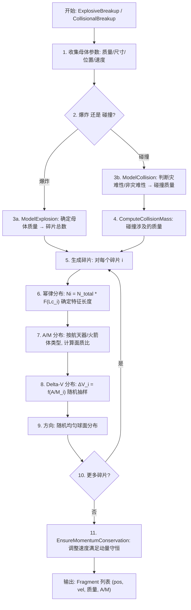

# 算法卡片 — NASA 卫星碎片解体模型

> **状态**：draft
> **日期**：2026-06-11
> **索引证据**：function-index.jsonl (ComputeCollisionMass 为 math 标记)
> **关联文档**：space-integrating-propagator-card.md

### 基础资料

- **算法名称**：NASA Standard Satellite Breakup Model（NASA 标准卫星解体模型）
- **算法所属模块**：wsf_space（空间/轨道力学模块）
- **算法功能**：模拟卫星爆炸解体或碰撞解体事件，生成符合 NASA 统计分布的碎片云。包括碎片数量幂律分布、面质比（A/M）分布、Delta-V 分布，满足动量守恒约束。

### 算法变量和常量

#### 输入变量

| 变量名 | 类型 | 中文说明 | 所属函数 (Method) |
|--------|------|----------|-------------------|
| `M_parent` | double | 解体母体质量 (kg) | ComputeCollisionMass |
| `L_c_parent` | double | 母体特征长度 (m) | ComputeCollisionMass |
| `v_rel` | double | 碰撞相对速度 (km/s) | ComputeCollisionMass |
| `M_small` | double | 较小碰撞体质量 (kg) | ComputeCollisionMass |
| `M_large` | double | 较大碰撞体质量 (kg) | ComputeCollisionMass |
| `position` | UtVector3 | 解体位置 ECI 坐标 (m) | ExplosiveBreakup |
| `velocity` | UtVector3 | 解体速度 ECI (m/s) | ExplosiveBreakup |
| `type` | enum | 解体类型（爆炸/碰撞） | ExplosiveBreakup |
| `spacecraft_type` | enum | 母体类型（航天器/火箭体） | SetModeledAsSpacecraft |
| `S_factor` | double | 爆炸缩放因子 | SetExplosionS_Factor |

#### 输出变量

| 变量名 | 类型 | 中文说明 | 所属函数 (Method) |
|--------|------|----------|-------------------|
| `fragments` | Fragment[] | 碎片列表（位置、速度、质量、A/M） | GetFragmentCount |
| `N_fragments` | int | 碎片总数 | GetFragmentCount |
| `M_collision` | double | 碰撞涉及的总质量 (kg) | ComputeCollisionMass |

#### 常量

| 常量名 | 类型 | 值 | 中文说明 | 所属函数 (Method) |
|--------|------|-----|----------|-------------------|
| `alpha_explosion` | double | 1.6 | 爆炸幂律指数 | ExplosionN |
| `alpha_collision` | double | 1.71 | 碰撞幂律指数 | CollisionN |
| `S_default` | double | 1.0 | 默认爆炸 S 因子 | ExplosionN |
| `L_c_min` | double | 0.01 m | 最小碎片特征长度 | GetFragmentCount |
| `min_fragment_mass` | double | 1e-6 kg | 最小碎片质量阈值 | SetMinFragmentSize |
| `large_fragment_mass_fraction` | double | 0.1 | 大碎片质量占比 | SetLargeFragmentMassFraction |
| `DeltaV_slope_explosion` | double | 0.4 | 爆炸 ΔV-A/M 对数斜率 | DeltaV_Explosion |
| `DeltaV_slope_collision` | double | 0.5 | 碰撞 ΔV-A/M 对数斜率 | DeltaV_Collision |
| `DeltaV_intercept_explosion` | double | 2.9 | 爆炸 ΔV 对数截距 | DeltaV_Explosion |
| `DeltaV_intercept_collision` | double | 2.6 | 碰撞 ΔV 对数截距 | DeltaV_Collision |
| `threshold_specific_energy` | double | 1000 J/g | 灾难性/非灾难性碰撞能量阈值 | CatastrophicCollisionMass |

### 算法流程

### 关键数学公式

1. **碎片数量幂律分布 (NASA 标准模型)**：

   $N(L_c) = \begin{cases} N_0 \cdot (L_c)^{-\alpha} & L_c \geq L_{c,min} \\ 0 & L_c < L_{c,min} \end{cases}$

   爆炸：$N_{explosion} = 6 \cdot S \cdot L_c^{-1.6}$（$S$ 为缩放因子，默认 1.0）

   碰撞：$N_{collision} = 0.1 \cdot \hat{M}^{0.75} \cdot L_c^{-1.71}$（$\hat{M} = M_{total} / (1 \text{ kg})$ 为碰撞涉及的质量）

2. **碰撞质量计算 (ComputeCollisionMass)**：

   灾难性碰撞：$M_{collision} = M_{small} + M_{large}$

   非灾难性碰撞：$M_{collision} = M_{small} \cdot v_{rel}^2 / (1000 \text{ J/g})$

3. **面质比 A/M 分布**（经验公式）：

   航天器（$L_c \geq 0.1$ m）：

   $\log_{10}(A/M) = \begin{cases} -1.0 + 0.5 \cdot \log_{10}(L_c) & L_c \leq 0.1 \\ -1.0 & 0.1 < L_c \leq 1.0 \\ -1.0 - 0.5 \cdot \log_{10}(L_c) & L_c > 1.0 \end{cases}$

   火箭体（$L_c \geq 0.1$ m）：

   $\log_{10}(A/M) = \begin{cases} -1.5 + 0.5 \cdot \log_{10}(L_c) & L_c \leq 0.1 \\ -1.5 & 0.1 < L_c \leq 1.0 \\ -1.5 - 0.5 \cdot \log_{10}(L_c) & L_c > 1.0 \end{cases}$

   小尺寸混合（$L_c < 0.1$ m）：使用 `BlendFunctionWeight` 在航天器和火箭体之间平滑过渡。

4. **Delta-V 分布**：

   $\Delta V(A/M) = 10^{a \cdot \log_{10}(A/M) + b + \sigma \cdot \mathcal{N}(0,1)}$

   爆炸：$\log_{10}(\Delta V) = 0.4 \cdot \log_{10}(A/M) + 2.9 + 0.4 \cdot \mathcal{N}(0,1)$

   碰撞：$\log_{10}(\Delta V) = 0.5 \cdot \log_{10}(A/M) + 2.6 + 0.4 \cdot \mathcal{N}(0,1)$

5. **动量守恒修正**：生成所有碎片后，对 Delta-V 施加整体偏置：

   $\Delta\mathbf{v}_i^{corrected} = \Delta\mathbf{v}_i - \frac{\sum_j m_j \Delta\mathbf{v}_j}{\sum_j m_j}$

### 内部状态

下表列出 `WsfNASA_BreakupModel` 类中跨帧持久化的成员变量。这些变量在解体事件（爆炸或碰撞）开始时由 `FinalizeExplosionModel()` 或 `FinalizeCollisionModel()` 初始化，并在整个碎片生成过程中持续使用。

| 变量名 | 类型 | 初始值 | 物理含义 | 更新时机 |
|--------|------|--------|----------|----------|
| `mProgenitorOne` | Progenitor | `{}`（空结构体） | 爆炸母体 / 碰撞中的较小质量体。含名称 `mName`、ECI 位置 `mLocation`、ECI 速度 `mVelocity`、质量 `mMass`（初值 -1.0）、特征长度 `mLength`（初值 -1.0） | 爆炸：`FinalizeExplosionModel()` 中填入平台位置/速度/质量/长度；碰撞：`FinalizeCollisionModel()` 中填入（较小质量体） |
| `mProgenitorTwo` | Progenitor | `{}`（空结构体） | 碰撞中的较大质量体。爆炸时不使用。字段同 `mProgenitorOne` | 碰撞：`FinalizeCollisionModel()` 中填入（较大质量体）；爆炸时保持空 |
| `mFragments` | `std::vector<Fragment>` | `{}`（空列表） | 生成的碎片容器。每个 Fragment 含 `mName`（名称）、`mMass`（质量）、`mLength`（特征长度）、`mAoverM`（面质比）、`mArea`（截面积）、`mDeltaV_ECI`（速度增量）、`mLocationECI`、`mVelocityECI` | 碎片逐个生成时由 `GenerateExplosiveFragment()` / `GenerateCollisionalFragment()` 等函数追加；动量守恒修正后集体调整 |
| `mMinFragmentSize` | double | 0.1 | 生成碎片的最小特征长度 (m)，小于此尺寸的碎片将被截断 | 由 `SetMinFragmentSize()` 设置，构造时初始化为 0.1 |
| `mExplosionS_Factor` | double | 1.0 | 爆炸碎片数缩放因子 S，取值范围通常 [0.1, 1.0] | 由 `SetExplosionS_Factor()` 设置 |
| `mLargeFragmentFraction` | double | 0.5 | 大碎片质量占总质量的比例。值被限制在 [0.0, 1.0] 区间 | 由 `SetLargeFragmentMassFraction()` 设置 |
| `mCollisionRelativeSpeed` | double | 0.0 | 碰撞时两碎片的相对速度 (km/s) | 碰撞：在 `FinalizeCollisionModel()` 中计算为两母体速度差的模 |
| `mCollisionMass` | double | -1.0 | 碰撞涉及的碎片化质量 (kg) | 碰撞：由 `ComputeCollisionMass()` 调用 `CatastrophicCollisionMass()` 或 `NonCatastrophicCollisionMass()` 计算 |
| `mIsCatastrophicCollision` | bool | false | 是否为灾难性碰撞（比动能超过 40 kJ/kg） | 碰撞：由 `IsCatastrophicCollision()` 判断并设置 |
| `mModelAsSpacecraft` | bool | true | 母体建模类型标记：`true` = 航天器（A/M 更高），`false` = 火箭体（A/M 更低） | 由 `SetModeledAsSpacecraft()` 设置 |
| `mDebrisName` | std::string | `""` | 生成碎片的名称前缀模板。最终碎片名称为 `mDebrisName + 编号` | 由 `SetDebrisName()` 设置；若未设置则爆炸时自动取 `"母体名_debris"`，碰撞时取 `"母体1_母体2_debris"` |

### 变量映射表

| 代码变量 | 数学符号 | 含义 |
|----------|----------|------|
| `aLc` / `L_c` | $L_c$ | 碎片特征长度 (m)，幂律分布的自变量 |
| `mExplosionS_Factor` | $S$ | 爆炸碎片数缩放因子 |
| `cEXPLOSION_N_PREFACTOR` (6.0) | $6$ | 爆炸幂律分布前置因子 |
| `cEXPLOSION_N_SCALING` (-1.6) | $\alpha = 1.6$ | 爆炸幂律指数（绝对值） |
| `cCOLLISION_N_PREFACTOR` (0.1) | $0.1$ | 碰撞幂律分布前置因子 |
| `cCOLLISION_N_MASS_SCALING` (0.75) | $0.75$ | 碰撞幂律分布质量指数 |
| `cCOLLISION_N_SIZE_SCALING` (-1.71) | $\alpha = 1.71$ | 碰撞幂律指数（绝对值） |
| `mCollisionMass` | $M_{collision}$ | 碰撞涉及的碎片化质量 (kg) |
| `mCollisionRelativeSpeed` | $v_{rel}$ | 碰撞相对速度 (km/s) |
| `mProgenitorOne.mMass` | $m_1$ | 较小碰撞体质量 (kg) |
| `mProgenitorTwo.mMass` | $m_2$ | 较大碰撞体质量 (kg) |
| `mProgenitorOne.mLength` | $L_{c,1}$ | 母体特征长度 (m) |
| `mProgenitorTwo.mLength` | $L_{c,2}$ | 母体特征长度 (m) |
| `retval.mAoverM` | $A/M$ | 碎片面质比 (m^2/kg) |
| `retval.mArea` | $A$ | 碎片截面积 (m^2)，由 `AfromLc(L_c)` 计算 |
| `retval.mMass` | $m_i$ | 单个碎片质量 (kg) |
| `deltaV_Mag` | $\Delta V$ | 碎片速度增量大小 (m/s) |
| `cDELTA_V_EXPLOSION_MU_SLOPE` (0.2) | $a = 0.2$ | 爆炸 ΔV 对数斜率 |
| `cDELTA_V_EXPLOSION_SIGMA` (0.4) | $\sigma = 0.4$ | 爆炸 ΔV 对数标准差 |
| `cDELTA_V_COLLISION_MU` (2.0) | $\mu = 2.0$ | 碰撞 ΔV 对数均值（简化模型） |
| `cCATASTROPHIC_ETA_LIMIT` (40000.0) | $\eta_{crit}$ | 灾难性碰撞比动能阈值 (J/kg = 40 kJ/kg) |

### 边界条件

下表列出模型中影响数值稳定性、输入合法性、限幅和回退行为的关键边界条件。

| 条件 | 所在位置 | 处理方式 | 说明 |
|------|----------|----------|------|
| `mMinFragmentSize` (默认 0.1 m) | `ModelExplosion()` / `ModelCollisionDebris()` 内的 loopLimit 计算 | 使用 `floor(upperLimit)` 截断，碎片不超过上限数量 | 当 `ExplosionN(mMinFragmentSize)` 或 `CollisionN(mMinFragmentSize, ...)` 计算出的 `upperLimit = floor(...)` 为 0 时，不会生成任何碎片 |
| 碎片质量超过母体剩余质量 | `GenerateCollisionalFragment()` 内 | 检查 `frag.mMass + depositedMass > aProgenitor.mMass`，若超出则 `break` 跳出循环，转向大碎片生成 | 确保总质量不超出母体质量 |
| 大碎片质量分配 | `GenerateExplosiveLargeFragment()` / `GenerateCollisionalLargeFragment()` 内 | 若 `aMassRemaining <= 0.0`，返回未初始化 Fragment；最后一个大碎片 `aIsLast=true` 时取全部剩余质量保证质量守恒；其余大碎片随机取剩余质量的 0.3-0.5 | 防止质量为负或空分配 |
| `mLargeFragmentFraction` 限幅 | `SetLargeFragmentMassFraction()` | `std::min(1.0, std::max(0.0, aLargeFragmentFraction))` | 强制限制在 [0.0, 1.0] |
| 碰撞两体距离检查 | `FinalizeCollisionModel()` | 若两母体距离 > `cCOLLISION_NEARNESS_FACTOR (5.0) * (L1 + L2)`，不建模碰撞，打印 warning 并返回 false | 防止远距离"碰撞"产生无意义碎片 |
| 母体参数数量检查 | `FinalizeExplosionModel()` / `FinalizeCollisionModel()` | 爆炸需要 2 个参数（质量、长度），若数量不符返回 false | 防止参数不完整导致的未初始化访问 |
| A/M 截面积分段 (AfromLc) | `AfromLc()` | `L_c < 0.00167 m` 使用 `0.540424 * L_c^2`；否则使用 `0.556945 * L_c^2.0047077` | 分段函数在阈值处连续，避免数值跳变 |
| 灾难性/非灾难性碰撞判定 | `IsCatastrophicCollision()` | 比动能 $\eta = \frac{1}{2} m_1 v_{rel}^2 / m_2$ 与 40 kJ/kg 比较 | 引用文献(2)的修正阈值 |
| 碰撞 Delta-V 模型选择 | `DeltaV_Collision()` | 与文献(1)不同，AFSIM 采用与特征长度无关的简化对数正态分布（μ=2.0, σ=0.3），以避免文献(1)在高 A/M 时产生不合理的极大 ΔV 值 | 参考文献(3)的实测对比结论 |
| `aIndex` 越界 | `GetFragment()` | 若 `aIndex >= mFragments.size()`，返回空的未初始化 Fragment | 安全回退，调用方需检查返回值 |

### 提取策略

该算法的信息从以下源文件按以下方式提取：

| 源文件 | 提取方式 | 提取内容 |
|--------|----------|----------|
| `WsfNASA_BreakupModel.hpp` | 阅读头文件 | 类成员变量的名称、类型、初始值和注释说明。`Progenitor` 内部结构体定义了母体的完整数据模型。public getter/setter 方法说明了各成员的可访问性和取值范围。 |
| `WsfNASA_BreakupModel.cpp` | 逐函数分析 | 每个成员函数的具体实现逻辑。匿名 namespace 中的 `constexpr` 常量（如 `cEXPLOSION_N_PREFACTOR`、`cCOLLISION_N_SCALING`）是算法参数的真实来源。`ComputeCollisionMass()`、`ExplosionN()`、`AoverM_Spacecraft()` 等函数的实现包含所有数值系数和分支条件。 |
| `WsfSatelliteBreakupModel.hpp` | 阅读头文件 | `Fragment` 结构体定义（含 `mMass`、`mAoverM`、`mArea`、`mDeltaV_ECI` 等字段）以及基类接口方法签名。 |
| `WsfSatelliteBreakupModel.cpp` | 逐函数分析 | `ExplosiveBreakup()` 和 `CollisionalBreakup()` 入口函数的参数解析与调度逻辑。 |
| `function-index.jsonl` | JSON 行检索 | 通过 `grep` 搜索 `WsfNASA_BreakupModel` 相关条目（共约 40 条），确认 `ComputeCollisionMass` 被标记为 `math` 算法提示，其余为 `unknown`。 |

**提取流程**：
1. 从头文件中提取所有 private 成员变量作为"内部状态"的来源，从 public getter/setter 获取取值范围提示。
2. 从 .cpp 的匿名 namespace 常量块中提取所有 `constexpr` 常量作为公式参数的真实数值来源。
3. 逐函数比对 .cpp 实现中的局部变量、参数名与头文件中的成员变量，建立"变量映射表"。
4. 在 .cpp 中搜索 `if`、`while`、`break`、`std::min`/`std::max`、`return false` 等控制流语句，提炼边界条件。
5. 交叉验证 .cpp 实现中的注释（如 `// This is an implementation choice`、`// NOTE:`）以确认哪些行为是 AFSIM 特有的实现选择。

### 源码位置

| File | Symbol | 中文说明 |
|------|--------|----------|
| [WsfNASA_BreakupModel.hpp](source_root/src/core/wsf_space/source/WsfNASA_BreakupModel.hpp) | `WsfNASA_BreakupModel` | NASA 标准解体模型主类 |
| 同上 | `ComputeCollisionMass()` | 碰撞质量计算 |
| 同上 | `ExplosionN()` / `CollisionN()` | 碎片数幂律分布函数 |
| 同上 | `AoverM_Spacecraft()` / `AoverM_RocketBody()` | 面质比经验模型 |
| 同上 | `DeltaV_Explosion()` / `DeltaV_Collision()` | Delta-V 经验分布 |
| 同上 | `EnsureMomentumConservation()` | 动量守恒修正 |
| [WsfSatelliteBreakupModel.cpp](source_root/src/core/wsf_space/source/WsfSatelliteBreakupModel.cpp) | `ExplosiveBreakup()` / `CollisionalBreakup()` | 解体事件入口 |

### 可移植性评分

**可移植性**：高 — 所有经验公式和幂律系数来自 NASA 公开文献（Johnson et al., 2001 等），不依赖专有代码。随机数生成可用任何标准库替代。
